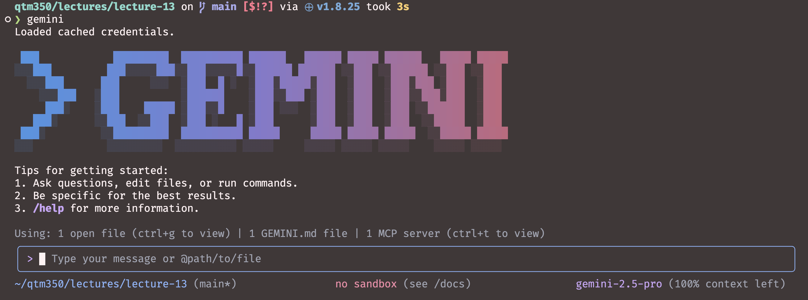
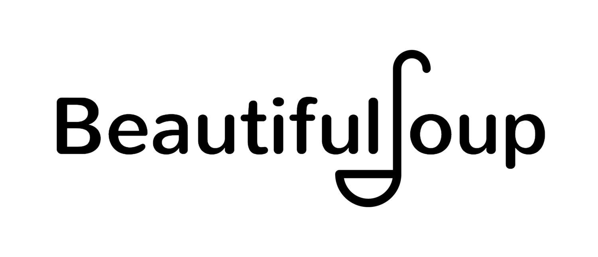

# Welcome to DATASCI 350:   Data Science Computing! 🎉 {background-color="#1B3A6B"}

## Lecture overview
### Today's agenda

:::{style="margin-top: 60px; font-size: 40px;"}
:::{.incremental}
- Introduction
- Motivation
- Class logistics
- Computer setup
:::
:::

## Course materials
### Important links

::: {style="font-size: 25px;"}
 [Course website:]{.alert} <https://danilofreire.github.io/datasci350>

 [Course repository:]{.alert} <https://github.com/danilofreire/datasci350>

The syllabus, the schedule and all the lecture slides are available [on our website](https://danilofreire.github.io/datasci350)

The assignments, project guidelines and study guides are available [on our GitHub repository](https://github.com/danilofreire/datasci350)

We will use Canvas for course administration, including submitting assignments, accessing grades, and receiving announcements

Please take some time to get to know all three platforms, and reach out if you have any questions 😉

::: {.callout-note}
Please remember to check the course repository regularly for updates and announcements!
:::
:::

# Nice to meet you! 😊 {background-color="#1B3A6B"}

## Instructor
### A bit about me

:::: {.columns}
::: {.column}

::: {style="font-size: 26px;"}
 [danilo.freire@emory.edu](mailto:danilo.freire@emory.edu)

 <https://danilofreire.github.io/>

 <https://github.com/danilofreire/>
:::
:::

::: {.column}
::: {style="font-size: 28px;"}
 Visiting Assistant Professor in the [Department of Data and Decision Sciences](https://quantitative.emory.edu)

 MA from the Graduate Institute Geneva, PhD from King's College London, Postdoc at Brown University, Senior Lecturer at the University of Lincoln, UK

 Research interests: computational social science, experimental methods, policy evaluation, political violence, organised crime
:::
:::
::::

## {background-image="figures/neymar.jpg" background-size="100%"}

## {background-image="figures/carnaval.jpg" background-size="100%"}

## {background-image="figures/sp.jpg" background-size="100%"}

## {background-image="figures/montblanc.jpg" background-size="100%"}

## {background-image="figures/buzz.webp" background-size="100%"}

## {background-image="figures/moonwatch.jpg" background-size="100%"}

## What about you? (time permitting!)

:::{style="margin-top: 60px; font-size: 36px;"}

Now it's your turn! 😉

Please introduce yourself! 👋

Tell us your name, your major, one thing you really like, and something we don't know about your city or country! 🌍
:::

## My teaching philosophy

:::{style="margin-top: 60px; font-size: 32px;"}
- [I love teaching]{.alert} and aim to make learning fun 
- [Classes where students participate are the best!]{.alert}
- [Hands-on activities]{.alert} help you learn better
- [I am always available]{.alert} to help and answer questions. [And I mean it]{.alert}
- Your feedback helps me improve my teaching. Please let me know what is working and what is not
:::

## Teaching assistants

:::{style="margin-top: 60px; font-size: 32px;"}
- The teaching assistants for this course will be announced soon
- They will be available to help you with assignments, quizzes, and any questions you may have about the course material
- [We are all here to help you!]{.alert} So feel free to ask questions during class, office hours, or via email 😃
:::

## Office hours
### What for and what not for

:::{style="margin-top: 60px;"}
:::

- What office hours are meant for:
  - Applying tools in practice
  - Discussion of issues related to the assignments
  - Boosting your knowledge of data science

:::{.fragment .fade-in}
- What these sessions are [not]{.alert} meant for: 
    - Solving the assignments for you
    - Taking care of developing your coding skills
:::

## Class etiquette

:::{style="margin-top: 60px; font-size: 26px;"}
:::

:::: {.columns}
::: {.column width=70%}
- Coding can be tough and push you out of your comfort zone. If the course pace is too fast, let us know. I expect your commitment, but [I do not want anyone to fail]{.alert}
- You are all keen on data science, but your backgrounds vary. That is great! Some sessions might be more engaging than others. If you are bored, [help others]{.alert} or explore new data science areas
- [Always be respectful]{.alert} to each other
- [Ask questions]{.alert} whenever you need to!
:::

::: {.column width=30%}
[{width="100%"}](#){data-modal-type="image" data-modal-url="figures/stupid-questions.jpg"}
:::
::::

# Motivation:   What is data science? 👨🏻‍💻👩🏼‍💻 {background-color="#1B3A6B"}

## An old classic {transition="none"}

[{height="550px" style="display: block; margin: auto;"}](#){data-modal-type="image" data-modal-url="figures/venn-orig-1.png"}

## An old classic {transition="none"}

[{height="550px" style="display: block; margin: auto;"}](#){data-modal-type="image" data-modal-url="figures/venn-orig-2.png"}

## An old classic {transition="none"}

[{height="550px" style="display: block; margin: auto;"}](#){data-modal-type="image" data-modal-url="figures/venn-orig-3.png"}

## An old classic {transition="none"}

[{height="550px" style="display: block; margin: auto;"}](#){data-modal-type="image" data-modal-url="figures/venn-orig-4.png"}

## An old classic {transition="none"}

[{height="550px" style="display: block; margin: auto;"}](#){data-modal-type="image" data-modal-url="figures/venn-orig-5.png"}

## Our focus! {transition="none"}

[{height="550px" style="display: block; margin: auto;"}](#){data-modal-type="image" data-modal-url="figures/venn-focus.png"}

## Rise of the digital information age

:::{style="margin-top: 40px; text-align: center;"}
[{width="55%"}](#){data-modal-type="image" data-modal-url="figures/digital.jpeg"}
:::

## Social media data

[{width="80%" style="display: block; margin: auto;"}](#){data-modal-type="image" data-modal-url="figures/redes.png"}

## New data formats

:::: {.columns}
::: {.column width="50%"}
[{width="100%" style="display: block; margin: auto;"}](#){data-modal-type="image" data-modal-url="figures/tweets.png"}
:::

::: {.column width="50%"}
[{width="100%" style="display: block; margin: auto;"}](#){data-modal-type="image" data-modal-url="figures/imagescnn.png"}

[{width="100%" style="display: block; margin: auto;"}](#){data-modal-type="image" data-modal-url="figures/audio.png"}
:::
::::

## Survey data

[{width="60%" style="display: block; margin: auto;"}](#){data-modal-type="image" data-modal-url="figures/survey.png"}

## Cheap computing power

[{width="80%" style="display: block; margin: auto;"}](#){data-modal-type="image" data-modal-url="figures/collab.png"}

# And what can we do with all these data? 🤔 {background-color="#1B3A6B"}

## Scraping the web for social research

:::{style="margin-top: 40px;"}
:::

[{width="100%"}](#){data-modal-type="image" data-modal-url="figures/scrap.png"}

## Tackling social problems

:::{style="margin-top: 40px;"}
:::

[{width="100%"}](#){data-modal-type="image" data-modal-url="figures/social.png"}

## Reducing hate speech

:::{style="margin-top: 40px;"}
:::

[{width="100%"}](#){data-modal-type="image" data-modal-url="figures/hate.png"}

## Monitoring the effects of climate change on health

:::{style="margin-top: 40px;"}
:::

[{width="100%"}](#){data-modal-type="image" data-modal-url="figures/climate.png"}

## Calling bullsh*t when you see it

:::{style="margin-top: 40px;"}
:::

::::{.columns}
::: {.column width="30%"}
:::{style="font-size: 20px;"}
:::{style="margin-top: 40px;"}
[Learn not to be fooled by]{.alert}

- big data
- garbage data
- garbage models
- weird samples
- claims of generality
- implausibly large effect sizes
- overfitted models

And much more...
:::
:::
:::

::: {.column width="70%"}
[{width="100%"}](#){data-modal-type="image" data-modal-url="figures/bullshit.png"}
:::
::::

## And much more...

::: {style="font-size: 30px;"}
::: {style="margin-top: 40px;"}
::: {.incremental}
- Abundance of data available for research and for governments to make better decisions
  - Opportunities for [novel research questions]{.alert}
  - [New methods]{.alert} to answer longstanding research questions

- New technologies also have [social implications]{.alert} and can raise important policy issues
  - Ethical concerns
  - Use of technology by malicious actors
  - Government use of technology to censor or monitor citizens
:::
:::
:::

# Course overview and logistics 📖 📚 💻 {background-color="#1B3A6B"}

## Course objectives

:::{style="font-size: 25px; margin-top: 40px;"}
:::{.columns}
:::{.column width="50%"}
- Use the [command line interface]{.alert} to manage files and directories
- Work with [version control systems]{.alert} to track changes in code and collaborate with others
- Create [reproducible reports and presentations]{.alert}
- Use [AI tools]{.alert} to assist with programming tasks
- Collect data from [web APIs and web pages]{.alert}, and process it [at scale]{.alert}
- Understand the basics of [containerisation and parallel computing]{.alert}
:::

::: {.column width="50%"}
[{width="100%"}](#){data-modal-type="image" data-modal-url="figures/dsc.jpg"}
:::
:::
:::

## Key focus areas
### Why reliability, reproducibility, and robustness matter

- This course centres around three key areas of the modern data science workflow: [reliability]{.alert}, [reproducibility]{.alert}, and [robustness]{.alert}

:::: {.columns}
::: {.column width="33%"}
::: {.fragment .fade-in}
::: {style="font-size: 24px;"}
- [Reliability]{.alert}:
  - Ensures consistency in results across multiple runs
  - Minimises errors in data processing and analysis
  - Supports accurate interpretation of findings
:::
:::
:::

::: {.column width="33%"}
::: {.fragment .fade-in}
::: {style="font-size: 24px;"}
- [Reproducibility]{.alert}:
  - Allows others to verify and build upon your work
  - Enhances the credibility of research outcomes
  - Facilitates long-term preservation of scientific knowledge
:::
:::
:::

::: {.column width="33%"}
::: {.fragment .fade-in}
::: {style="font-size: 24px;"}
- [Robustness]{.alert}:
  - Enables analyses to handle unexpected data variations
  - Improves the stability of results under different conditions
  - Supports the scalability of methods to larger datasets
:::
:::
:::
::::

## Key tools

- [Command-line interfaces](https://en.wikipedia.org/wiki/Command-line_interface) and [bash shell](https://en.wikipedia.org/wiki/Bash_(Unix_shell)) for precise control

:::{.columns}
:::{.column width="50%"}
[{width="100%"}](#){data-modal-type="image" data-modal-url="figures/cli.png"}
:::

:::{.column width="50%"}
:::{style="margin-top: 80px;"}
[{width="100%"}](#){data-modal-type="image" data-modal-url="figures/bash.png"}
:::
:::
:::

## Key tools

- [Git](https://git-scm.com/) and [GitHub](https://github.com) for version control and collaboration

:::: {.columns}
::: {.column width="50%"}
:::{style="margin-top: 40px;"}
[{width="80%"}](#){data-modal-type="image" data-modal-url="figures/git.png"}
:::
:::

::: {.column width="50%"}
[{width="80%"}](#){data-modal-type="image" data-modal-url="figures/github.png"}
:::
::::

## Key tools

- AI coding assistants and agents, such as [GitHub Copilot](https://github.com/features/copilot), [Claude Code](https://www.claude.com/product/claude-code), [Gemini CLI](https://github.com/google-gemini/gemini-cli), and [Codex CLI](https://developers.openai.com/codex/cli/)

:::: {.columns}
::: {.column width="50%"}
:::{style="margin-top: 30px;"}
[{width="35%"}](#){data-modal-type="image" data-modal-url="figures/github-copilot.png"}
:::
:::

::: {.column width="50%"}
:::{style="margin-top: 55px;"}
[{width="60%"}](#){data-modal-type="image" data-modal-url="figures/claude-code.svg"}
:::
:::
::::

:::: {.columns}
::: {.column width="50%"}
:::{style="margin-top: 40px;"}
[{width="70%"}](#){data-modal-type="image" data-modal-url="figures/gemini.png"}
:::
:::

::: {.column width="50%"}
:::{style="margin-top: 50px;"}
[{width="60%"}](#){data-modal-type="image" data-modal-url="figures/codex.svg"}
:::
:::
::::

## Key tools

- [Quarto](https://quarto.org/) and [Jupyter Notebooks](https://jupyter.org/) for interactive computing

:::: {.columns}
::: {.column width="50%"}
[{width="100%"}](#){data-modal-type="image" data-modal-url="figures/quarto.png"}
:::

::: {.column width="50%"}
[{width="50%"}](#){data-modal-type="image" data-modal-url="figures/jupyter.png"}
:::
::::

## Key tools

- [requests](https://requests.readthedocs.io/) and [Beautiful Soup](https://www.crummy.com/software/BeautifulSoup/) for collecting data from web APIs and web pages

:::: {.columns}
::: {.column width="50%"}
:::{style="margin-top: 20px;"}
[{width="45%"}](#){data-modal-type="image" data-modal-url="figures/requests.png"}
:::
:::

::: {.column width="50%"}
:::{style="margin-top: 130px;"}
[{width="95%"}](#){data-modal-type="image" data-modal-url="figures/beautifulsoup.jpg"}
:::
:::
::::

## Key tools

- [pandas](https://pandas.pydata.org/), [Polars](https://pola.rs/), [DuckDB](https://duckdb.org/), and [Dask](https://www.dask.org/) for working with data at scale

:::: {.columns}
::: {.column width="50%"}
:::{style="margin-top: 20px;"}
[{width="60%"}](#){data-modal-type="image" data-modal-url="figures/pandas.png"}
:::
:::

::: {.column width="50%"}
:::{style="margin-top: 45px;"}
[{width="65%"}](#){data-modal-type="image" data-modal-url="figures/polars.png"}
:::
:::
::::

:::: {.columns}
::: {.column width="50%"}
:::{style="margin-top: 40px;"}
[{width="70%"}](#){data-modal-type="image" data-modal-url="figures/duckdb.svg"}
:::
:::

::: {.column width="50%"}
:::{style="margin-top: 30px;"}
[{width="60%"}](#){data-modal-type="image" data-modal-url="figures/dask.png"}
:::
:::
::::

## Key tools

- [uv](https://docs.astral.sh/uv/) and [Docker](https://www.docker.com/) for reproducible environments

::::{.columns}
::: {.column width="50%"}
:::{style="margin-top: 20px;"}
[{width="70%"}](#){data-modal-type="image" data-modal-url="figures/uv.png"}
:::
:::

::: {.column width="50%"}
:::{style="margin-top: 40px;"}
[{width="80%"}](#){data-modal-type="image" data-modal-url="figures/docker.png"}
:::
:::
::::

## Logistics
### Course information

:::{style="margin-top: 60px; font-size: 30px;"}
- [Schedule]{.alert}: Tuesdays and Thursdays, 5:30 to 6:45 pm, Math & Science Center W301
- [Syllabus]{.alert}: On the [website](https://danilofreire.github.io/datasci350/syllabus.html) and the [repository](https://github.com/danilofreire/datasci350/blob/main/syllabus.pdf)
- [Teaching assistants]{.alert}: To be announced
- [Office hours]{.alert}: By appointment. Email me and we will find a time 😉
:::

## Assignments
### How you will be graded

::: {style="margin-top: 40px;"}
:::

- [Problem sets]{.alert}: Ten of them, due on Thursdays at 11:59 pm (50%)
- [In-class quizzes]{.alert}: Five of them (30%)
- [Final project]{.alert}: Due on the last day of class (20%)
- [Late policy]{.alert}: 10% off per day late
- [Collaboration]{.alert}: You can discuss assignments with your classmates, but you must write your own code and submit your own work. AI is allowed
- [Academic integrity]{.alert}: Please refer to the syllabus for the university's policy on academic integrity

# Set up 💻 🛠️ {background-color="#1B3A6B"}

## Software

:::{style="margin-top: 60px; font-size: 30px;"}
- [Git]{.alert}: Version control system. [Download it here](https://git-scm.com/downloads). We will configure it together in class
- [GitHub]{.alert}: Where we host our code. [Create an account](https://github.com/signup) and apply for the [student discount](https://education.github.com/discount_requests/new)
- Our [tutorials page](https://danilofreire.github.io/datasci350/tutorials.html) shows you how to set up both 😉
:::

## OS extras

::: {style="margin-top: 40px;"}
:::

- [Windows]{.alert}: Please install [Windows Subsystem for Linux (bash)](https://learn.microsoft.com/en-us/windows/wsl/install). Another good tutorial can be found [here](https://itsfoss.com/install-bash-on-windows/). [FAQ available here](https://learn.microsoft.com/en-us/windows/wsl/faq)
- [Mac]{.alert}: None, but you can install [iTerm2](https://iterm2.com/), [Homebrew](https://brew.sh/) and [Oh My Zsh](https://ohmyz.sh/) for a better experience
- [Linux]{.alert}: None, you should be good to go
- [Tip]{.alert}: [VS Code](https://code.visualstudio.com/) is a great code editor and it [already includes a terminal](https://code.visualstudio.com/docs/terminal/getting-started)

## Other tools

::: {style="margin-top: 40px;"}
:::

::: {style="font-size: 30px;"}
- We will install these together during the course. If you want to get ahead, start here:
- [VS Code]{.alert}: Our main code editor. Download it [here](https://code.visualstudio.com/)
- [Anaconda]{.alert}: Python distribution with most of the packages we need. Download it [here](https://www.anaconda.com/download)
- [uv]{.alert}: A fast package and project manager for Python. We use it later for reproducible environments. Instructions [here](https://docs.astral.sh/uv/getting-started/installation/)
- [Docker]{.alert}: Containerisation tool. Download it [here](https://www.docker.com/products/docker-desktop/)

::: {style="margin-top: 30px;"}
:::

- Tutorials for these tools are available on our course website: <https://danilofreire.github.io/datasci350/tutorials.html>
:::

## Next class

:::{style="margin-top: 60px;"}
:::

::: {style="font-size: 30px;"}
- Computational literacy: binary and hexadecimal numbers, ASCII and Unicode
- The early days of computing, from Konrad Zuse to the machines we use today
- How programming languages evolved, and what compiled and interpreted mean
- Time for questions about installing the terminal. You will need it in two weeks
- Please create a [GitHub education account](https://education.github.com/discount_requests/new) if you do not have one 😉

:::{.fragment .fade-in}
... **and that's all for today!** 🎉
:::
:::

# Questions? {background-color="#1B3A6B"}

# Thank you very much for your attention! 🙏🏻    See you soon! 😊 {background-color="#1B3A6B"}