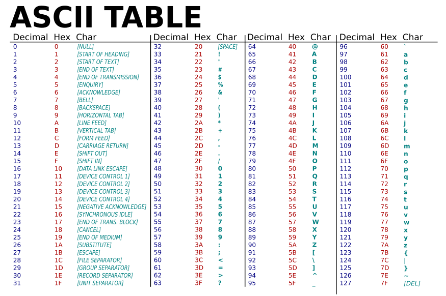

# Recap and lecture overview 📚{background-color="#1B3A6B"}

## Course information

:::{style="margin-top:40px;"}
:::

:::::{.incremental}
:::: {.columns}
::: {.column width="50%"}
::: {style="font-size: 25px;"}
- Three themes: [reliability]{.alert}, [reproducibility]{.alert}, and [robustness]{.alert}
- What we cover:
  - Command line and shell scripting
  - Version control with Git and GitHub
  - Reproducible reports with Quarto
  - AI-assisted programming
  - Cloud computing
  - Getting data from the web
  - Scaling and parallel computing
  - Containers with Docker
:::
:::

::: {.column width="50%"}
::: {style="font-size: 25px;"}
- [Grading]{.alert}:
  - 50% assignments (10)
  - 30% in-class quizzes (5)
  - 20% final project

:::{style="margin-top:10px;"}
:::
- [AI is allowed]{.alert} in all assignments and quizzes
- Discuss with classmates, but [submit your own work]{.alert}
- [Late submissions]{.alert}: 10% off per day
- More details on the [course repository](https://github.com/danilofreire/datasci350)
:::
:::
::::
:::::

## Polars or a SQL revision?
### Lecture 22 can teach one of them, not both

:::{style="margin-top: 40px; font-size: 23px;"}
Lecture 22 is about [Polars](https://pola.rs/). Many of you said your SQL skills are a little shaky, so I can rebuild it as a SQL revision in [DuckDB](https://duckdb.org/) instead!

:::{.columns}
:::{.column width="50%"}
- [Option A]{.alert}: keep Polars
- A fast Python library for tables, new to all of you
- Opens files too large for pandas
- But: another syntax to learn, and your SQL stays where it is
:::

:::{.column width="50%"}
- [Option B]{.alert}: SQL revision in DuckDB
- Most data jobs still start with a `SELECT`
- DuckDB queries a pandas table by name, and we use it again later in the course
- But: repetition if you already write SQL, and no Polars this term
:::
:::

:::{style="background: rgba(27, 58, 107, 0.08); padding: 15px; border-radius: 10px; font-size: 20px; margin-top: 20px; text-align: center;"}
I will write a tutorial for whichever option loses, so you can work through it on your own
:::
:::

# Questions about the course organisation? {background-color="#1B3A6B"}

## Software installation

:::{style="margin-top:40px;"}
:::

:::::{style="font-size: 24px;"}
:::: {.columns}
::: {.column}
- [A terminal]{.alert}
  - Windows: install [WSL](https://learn.microsoft.com/en-us/windows/wsl/install), and use [VS Code's](https://code.visualstudio.com/) built-in terminal
  - Mac: you already have one. [iTerm2](https://iterm2.com/), [Homebrew](https://brew.sh/), and [Oh My Zsh](https://ohmyz.sh/) make it nicer
  - Linux: you are good to go
:::

::: {.column}
- [Git](https://git-scm.com/downloads) and a [GitHub](https://github.com) account
- [Anaconda](https://www.anaconda.com/download), or plain Python
- [Quarto](https://quarto.org/docs/get-started/index.html)
- [uv](https://docs.astral.sh/uv/getting-started/installation/)
- [Docker](https://docs.docker.com/get-docker)
- [VS Code](https://code.visualstudio.com/), strongly recommended
:::
::::

:::{style="margin-top:40px;"}
:::

:::{.callout-tip}
- Our [installation tutorials](https://danilofreire.github.io/datasci350/tutorials.html) explain each step
- You can also ask [Student Tech Support](https://ats.emory.edu/sdl/StudentTechnologySupport/index.html)
- If you have any questions, please let me know
:::
:::::

## Learning objectives
### By the end of this lecture, you will be able to:

:::{style="margin-top:40px;"}
:::

1. Learn how computers work from the ground up, starting with binary code
2. Get familiar with other key computer encodings like hexadecimal, ASCII, and Unicode
3. Learn about the pioneers of computing and the development of Assembly language
4. Understand the difference between low-level and high-level programming languages and when to use each

# Let's get started! 🚀 💻 {background-color="#1B3A6B"}

# Brief history of computing {background-color="#1B3A6B"}

## The first computers

:::{style="margin-top:40px;"}
:::

::::: {.columns}
:::: {.column width="50%"}
- Historically, [a computer was a person who makes calculations]{.alert}, especially with a calculating machine
- To do calculations we use numbers. How to represent them?
  - Fingers 
  - Pebbles
  - [Strings (Inca Khipu)](https://www.ecb.torontomu.ca/~elf/abacus/inca-khipu.html)
  - [Abacus](https://en.wikipedia.org/wiki/Abacus)
::::

:::: {.column width="50%"}
:::{style="font-size: 20px; text-align: center"}
[{width="100%"}](#){data-modal-type="image" data-modal-url="figures/abacus.jpg"}
Video: [How to use an abacus](https://youtu.be/SkUdjlQy3rk&t=176)
:::
::::
:::::

## Four-species mechanical calculators

:::{style="margin-top:40px;"}
:::

:::: {.columns}
::: {.column width="50%"}
[{width="100%"}](#){data-modal-type="image" data-modal-url="figures/mechanical-calculator.jpg"}
:::

::: {.column width="50%"}
- The [first mechanical calculator](https://www.arithmeum.uni-bonn.de/en/collection/exhibit-of-the-month/archive/01-the-first-mechanical-calculating-machine-for-all-four-arithmetic-operations-by-gottfried-wilhelm-leibniz.html) capable of performing all four basic arithmetic operations (addition, subtraction, multiplication, and division)

- Invented by [Gottfried Wilhelm Leibniz](https://en.wikipedia.org/wiki/Gottfried_Wilhelm_Leibniz) in 1694

- If you took a statistics course before the late 1970s, you likely used this type of [mechanical calculator](https://en.wikipedia.org/wiki/Mechanical_calculator) for your computations
:::
::::

## Silicon-based computers

:::{style="margin-top:40px;"}
:::

:::: {.columns}
::: {.column width="50%"}
[{width="100%"}](#){data-modal-type="image" data-modal-url="figures/transistor.gif"}
:::

::: {.column width="50%"}
:::{style="font-size: 26px;"}
The 1970s marked the transition from mechanical to electronic:

:::{.incremental}
- [Transistors](https://en.wikipedia.org/wiki/Transistor) act as switches for electronic signals
- [Integrated circuits](https://en.wikipedia.org/wiki/Integrated_circuit) combine multiple transistors on a single chip
- [Microprocessors](https://en.wikipedia.org/wiki/Microprocessor) are integrated circuits that contain the functions of a computer's [central processing unit (CPU)](https://en.wikipedia.org/wiki/Central_processing_unit)
- They follow the [Von Neumann architecture](https://en.wikipedia.org/wiki/Von_Neumann_architecture)
:::
:::
:::
::::

## Von Neumann architecture

:::{style="margin-top:40px;"}
:::

:::: {.columns}
::: {.column width="50%"}
[{width="100%"}](#){data-modal-type="image" data-modal-url="figures/neumann.webp"}
:::

::: {.column width="50%"}
:::{style="font-size: 24px;"}
- The [Von Neumann architecture](https://en.wikipedia.org/wiki/Von_Neumann_architecture) keeps [programs and data in the same memory]{.alert}
- Five parts: memory, control unit (directs the others), arithmetic logic unit (does the maths), input, and output
- Instructions travel from slow storage (a [hard disk](https://en.wikipedia.org/wiki/Hard_disk_drive)) to fast [RAM](https://en.wikipedia.org/wiki/Random-access_memory), then to the [CPU](https://en.wikipedia.org/wiki/Central_processing_unit)
- The CPU repeats one cycle: [fetch, decode, execute]{.alert}
- Proposed in 1945, when [programs were still seen as part of the machine](https://en.wikipedia.org/wiki/History_of_computing_hardware)
- Almost every computer you use today works this way
:::
:::
::::

## Von Neumann architecture

:::{style="margin-top:40px;"}
:::

:::: {.columns}
::: {.column width="50%"}
[{width="100%"}](#){data-modal-type="image" data-modal-url="figures/von-neumann-architecture.webp"}
:::

::: {.column width="50%"}
:::{style="font-size: 22px;"}
- [Advantages]{.alert}:
  - One memory for everything, so the design stays simple and cheap
  - Programs can be loaded, changed, and replaced like any other data

- [Disadvantages]{.alert}:
  - The [Von Neumann bottleneck](https://en.wikipedia.org/wiki/Von_Neumann_architecture#Von_Neumann_bottleneck): one [bus](https://en.wikipedia.org/wiki/Bus_(computing)) (the wires linking the CPU to memory) carries both instructions and data, so only one can move at a time
  - The CPU sits idle while it waits for memory. Modern chips hide this with [caches](https://en.wikipedia.org/wiki/CPU_cache)
  - The [Harvard architecture](https://en.wikipedia.org/wiki/Harvard_architecture) splits the two memories. Most CPUs today use a mix of both
:::
:::
::::

# Data representation {background-color="#1B3A6B"}

## Computers run on 0s and 1s

:::{style="margin-top:40px;"}
:::

:::: {.columns}
::: {.column width="50%"}
:::{style="font-size: 24px;"}
- Computers store everything as [0s and 1s]{.alert}
- A transistor is a [switch]{.alert}: high voltage is 1, low voltage is 0
- They are [tiny and cheap]{.alert}. A modern chip holds ~200 billion transistors and performs billions of operations per second!
- Two states are the simplest thing a switch can do

:::{.incremental}
- So how do we get to text, images, and video?
- By [abstraction]{.alert}, keeping only the detail we need
- A colour becomes three numbers. A number becomes 0s and 1s
- Each layer hides the one below
:::
:::
:::

::: {.column width="50%"}
[{width="100%"}](#){data-modal-type="image" data-modal-url="figures/picasso.jpg"}
:::
::::

## Converting coins to dollars

:::{style="margin-top:40px;"}
:::

:::: {.columns}
::: {.column width="50%"}
[{width="100%"}](#){data-modal-type="image" data-modal-url="figures/coins.png"}
:::

::: {.column width="50%"}
:::{style="font-size: 24px;"}
- We can convert between number systems by translating a value from one system to the other
- For example, the coins on the left represent the same value as $0.87
- Using pictures is clunky. Let's make a new representation system for coins
:::
:::
::::

## Converting coins to dollars

:::{style="margin-top:40px;"}
:::

:::: {.columns}
::: {.column width="50%"}
[{width="100%"}](#){data-modal-type="image" data-modal-url="figures/coins.png"}
:::

::: {.column width="50%"}
:::{style="font-size: 24px;"}
- To represent coins, we will make a number with four digits 
- The first represents quarters, the second dimes, the third nickels, and the fourth pennies
  - c3102 =
  - 3 x $0.25 + 1 x $0.10 + 0 x $0.05 + 2 x $0.01 =
  - $0.87

:::{style="text-align: center;"}
[{width="50%"}](#){data-modal-type="image" data-modal-url="figures/qdnp.png"}
:::
:::
:::
::::

## Converting dollars to coins

:::{style="margin-top:40px; font-size: 26px;"}
:::: {.columns}
::: {.column width="50%"}
[{width="100%"}](#){data-modal-type="image" data-modal-url="figures/coins.png"}
:::

::: {.column width="50%"}
:::{.incremental}
- How do we convert money from dollars to coins? Assume we want to [minimise
  the number of coins used]{.alert}
- For example, what is $0.59 in coin representation? Use the same four-digit
  system: quarters, dimes, nickels, and pennies

- $0.59 = 2 x $0.25 + 0 x $0.10 + 1 x $0.05 + 4 x $0.01 = [c2014]{.alert}
:::
:::
:::
::::

## Quick questions! {#question-coins}

:::{style="margin-top:40px; font-size: 28px;"}

Remember, the four digits are [quarters, dimes, nickels, and pennies]{.alert}

1. What is `c1112` in dollars?

2. What is $0.61 in coin representation? Use as few coins as you can

<br>

* [[Solutions]{.button}](#sec-solution-coins)
:::

## Number systems – binary

:::{style="margin-top:40px; font-size: 27px;"}
:::{.incremental}
- Back to computers! 💻
- Binary writes numbers with only [0s and 1s]{.alert}
- Coins counted 1s, 5s, 10s, and 25s. Binary counts 1s, 2s, 4s, and 8s
- Why those? They are [powers of 2]{.alert}
- One digit is a [bit]{.alert}: 101 has three bits
- Eight bits are a [byte]{.alert}: 10101010
- Counting up: 
  - 0 is zero
  - 1 is one
  - 10 is two
  - 100 is four
  - 1000 is eight... and so on!
:::
:::

## Quick question!

:::{style="margin-top:40px;"}
:::

- [Question]{.alert}: what is the binary representation of the decimal
  number 3?

:::{.fragment .fade-in fragment-index=1}
A) 101
:::

:::{.fragment .fade-in fragment-index=2}
:::{.fragment .highlight-red fragment-index=5}
B) 11
:::
:::

:::{.fragment .fade-in fragment-index=3}
C) 111
:::

:::{.fragment .fade-in fragment-index=4}
D) 010
:::

## Your turn! {#question01}

[Practice exercise 01]{.alert}:

1. How would you write 5 in binary?

2. And 12?

3. How many bits do you need to write 11?

4. What is the largest number you can write with 4 bits?

<br>

* [[Solutions]{.button}](#sec-solution01)

## Convert binary to decimal

:::{style="margin-top:40px;"}
:::

To convert a binary number to decimal, just add each power of 2 that is
represented by a 1

:::{style="font-size: 26px;"}
- For example, 00011000 = 16 + 8 = 24

| 128 | 64 | 32 | 16 | 8 | 4 | 2 | 1 |
|-----|----|----|----|----|---|---|---|
|  0  | 0  | 0  | 1  | 1  | 0 | 0 | 0 |


<br>

- Another example: 10010001 = 128 + 16 + 1 = 145

| 128 | 64 | 32 | 16 | 8 | 4 | 2 | 1 |
|-----|----|----|----|----|---|---|---|
|  1  | 0  | 0  | 1  | 0  | 0 | 0 | 1 |

:::

# So far, so good? 😃 {background-color="#1B3A6B"}

# Binary and abstraction {background-color="#1B3A6B"}

## Binary and abstraction

<br>

- Now that we can represent numbers using binary, [we can represent everything
  computers store using binary!]{.alert} 🤓
- We just need to use [abstraction]{.alert} to interpret bits or numbers in particular ways
- Let's consider [colours, images, and text]{.alert}

## Images as collections of colours

:::{style="margin-top:40px; font-size: 28px;"}

::: {.columns}
::: {.column width="60%"}
[{width="80%"}](#){data-modal-type="image" data-modal-url="figures/mona-lisa.png"}
:::

::: {.column width="40%"}
:::{.incremental}
- How can we convert an image to numbers?
- First, [we need to convert the image into a grid of colours]{.alert}, where each dot of colour has a distinct hue 
- A dot of colour in this context is called a [pixel](https://en.wikipedia.org/wiki/Pixel)
- Now we just need to [represent a single colour (a pixel) as a number]{.alert}
:::
:::
:::
:::

## Images as collections of colours
### RGB colour model

:::{style="font-size: 27px; margin-top: 20px;"}

:::{.columns}
:::{.column width="50%"}
- The [RGB colour model](https://en.wikipedia.org/wiki/RGB_color_model) describes a pixel with [three numbers from 0 to 255]{.alert}
- One for [red]{.alert}, one for [green]{.alert}, one for [blue]{.alert}
- 0 means none of that colour, 255 means as much as possible
- White is (255, 255, 255), black is (0, 0, 0)
- Try different colours [here](https://www.w3schools.com/colors/colors_rgb.asp)
- In binary, each number needs 8 digits, so one pixel takes 24. That gets long fast
:::

:::{.column width="50%"}
:::{style="text-align: center;"}
[{width="100%"}](#){data-modal-type="image" data-modal-url="figures/rgb.png"}
:::
:::
:::
:::

## Number systems – Hexadecimal
### What is hexadecimal?

:::{style="margin-top:20px;"}
:::

:::: {.columns}
::: {.column width="50%"}
[{width="100%"}](#){data-modal-type="image" data-modal-url="figures/hexadecimal.png"}
:::

::: {.column width="50%"}
:::{style="font-size: 22px; margin-top: 20px;"}
:::{.incremental}
- When we represent values with multiple bytes, it is [hard to distinguish where numbers begin and end]{.alert}
- [Hexadecimal](https://en.wikipedia.org/wiki/Hexadecimal) [is a number system with 16 digits: 0123456789**ABCDEF**]{.alert}
- It is used to represent binary numbers in a more compact way
- Each hex digit corresponds to 4 binary bits, making it a shorthand for binary:
  - 0000 = 0
  - 0001 = 1
  - 0010 = 2
  - ...
  - 1110 = E
  - 1111 = F
:::
:::
:::
::::

## Binary to hex conversion {#question02}

:::{style="margin-top:40px; font-size: 25px;"}

- Convert binary to hex by grouping into blocks of four bits
- Example: Binary `1001 1110 0000 1010` converts to Hex `9E0A` (9 + 14 + 0 + 10)

<br>

[Practice Exercise 02]{.alert}:

1. Convert the decimal number 13 to binary

2. Convert the decimal number 13 to hexadecimal

<br>

* [[Solutions]{.button}](#sec-solution02)
:::

## Hexadecimal and HTML
### Hex and RGB

:::{style="margin-top:40px; font-size: 28px;" .incremental}
- HTML uses hexadecimal to represent colours
- Six-digit hex numbers specify colours:
  - FFFFFF = White
  - 000000 = Black

 - Each pair of digits represents a colour component (RGB)
  - 16 * 16 = 256, so two hex digits can represent values from 0 to 255

 - This gives a total of 256 intensity levels for each primary colour

- When you combine the three channels, you get a possible colour palette of $256^3$ or about 16.7 million colours... but [described in a compact way using hex]{.alert}
:::

## Represent text as individual characters
### Characters and glyphs

:::{style="margin-top:40px;"}
:::

:::: {.columns}
::: {.column width="60%"}
[{width="70%"}](#){data-modal-type="image" data-modal-url="figures/glyph.png"}
:::

::: {.column width="40%"}
:::{style="font-size: 24px; margin-top: 40px;"}
:::{.incremental}
- Next, how do we represent text?
- First, [we break it down into smaller parts, like with images.]{.alert} In this case,
  we break text down into [individual characters]{.alert}
- A [character]{.alert} is the smallest component of text, like A, B, or /
- A [glyph](https://en.wikipedia.org/wiki/Glyph) is the graphical representation of a character
- The display of glyphs is typically handled by [GUI (Graphical User Interface) toolkits or font renderers](https://en.wikipedia.org/wiki/Graphical_user_interface)
:::
:::
:::
::::

## Represent text as individual characters
### Lookup tables

:::{style="margin-top:40px;"}
:::

:::: {.columns}
::: {.column width="60%"}
[{width="70%"}](#){data-modal-type="image" data-modal-url="figures/ascii-art-homer.jpg"}
:::

::: {.column width="40%"}
:::{style="font-size: 22px; margin-top: 40px;"}
:::{.incremental}
- For example, the text "Hello World" becomes `H, e, l, l, o, space, W, o, r, l, d` 
- Unlike colours, characters do not have a logical connection to numbers
- To represent characters as numbers, we use a [lookup table]{.alert} called
  [ASCII](https://en.wikipedia.org/wiki/ASCII)
- ASCII stands for [American Standard Code for Information Interchange](https://www.ascii-code.com/timeline)
- As long as every computer uses the same lookup table, computers can always translate a set of numbers into the same set of characters
:::
:::
:::
::::

## ASCII is nothing but a simple lookup table
### Yes, really!

:::{style="margin-top:40px;"}
:::

:::: {.columns}
::: {.column width="40%"}
:::{style="font-size: 26px;"}
- [ASCII]{.alert} maps the numbers 0 to 127 to characters
- That range needs 7 bits, so a character fits in one [byte]{.alert}
- `A` is 65, `a` is 97, and a space is 32
- The first 32 entries are not letters at all. They are control codes, like tab and newline
- Explore the whole table [here](https://www.asciitable.com/)
:::
:::

::: {.column width="60%"}
:::{style="margin-top: -25px;"}
[{width="100%"}](#){data-modal-type="image" data-modal-url="figures/ascii-table-wide.svg"}
:::
:::
::::

## ASCII is nothing but a simple lookup table {#question-ascii}
### Can you guess the binary? Hint: split each byte in half!

:::{style="margin-top:40px;"}
:::

:::: {.columns}
::: {.column width="40%"}
:::{style="font-size: 38px;"}
"Hello World" =

`01001000
01100101
01101100
01101100
01101111
00100000
01010111
01101111
01110010
01101100
01100100`
:::

* [[Solutions]{.button}](#sec-solution-ascii)
:::

::: {.column width="60%"}
[{width="100%"}](#){data-modal-type="image" data-modal-url="figures/ascii-table-wide.svg"}
:::
::::


## Your turn! {#question03}
### Practice Exercise 03

:::{style="margin-top:40px;"}
:::

:::: {.columns}
::: {.column width="40%"}
:::{style="font-size: 38px;"}
- Translate the following binary into ASCII text:
- Work in hexadecimal or in decimal

`01011001
01100001
01111001`
:::

* [[Solutions]{.button}](#sec-solution03)
:::

::: {.column width="60%"}
[{width="100%"}](#){data-modal-type="image" data-modal-url="figures/ascii-table-wide.svg"}
:::
::::


## ASCII limitations

:::{style="margin-top:40px; font-size: 32px;"}

- 128 slots go a long way, but not far enough
- No accents, so "café" is out of reach. No Greek, Arabic, or Chinese either

:::{style="margin-top:20px;"}
- [Unicode](https://en.wikipedia.org/wiki/Unicode) has room for about [1.1 million characters]{.alert}, and its first 128 are ASCII
- [UTF-8]{.alert} is how we store it: one byte for ASCII, up to four for the rest
- Emoji live there too. 😉 is `U+1F609`
- "Danilo" is `\u0044\u0061\u006e\u0069\u006c\u006f`
- Browse the [table](https://symbl.cc/en/unicode-table/), or decode text [here](https://symbl.cc/en/tools/decoder/)
:::
:::

# Questions? 🤔 {background-color="#1B3A6B"}

# The genesis of programming languages 🌟 🔡 🐍 {background-color="#1B3A6B"}

## The genesis of programming
### Zuse's computers

:::{style="margin-top:40px;"}
:::

:::: {.columns}
::: {.column width="50%"}
[{width="100%"}](#){data-modal-type="image" data-modal-url="figures/z3.JPG"}
:::

::: {.column width="50%"}
:::{style="font-size: 24px; margin-top: 40px;"}
- [Konrad Zuse](https://en.wikipedia.org/wiki/Konrad_Zuse) was a German
  engineer and computer pioneer
- He created the first programmable computer, the
  [Z3](https://en.wikipedia.org/wiki/Z3_(computer)), in 1941
- The Z3 was the first computer to use [binary arithmetic]{.alert} and read binary instructions from punch tape
- Example: Z4 had 512 bytes of memory
- Zuse also created the first high-level programming language,
  [Plankalkül](https://en.wikipedia.org/wiki/Plankalk%C3%BCl) ("calculus for planning")
:::
:::
::::

## What is Assembly language?

:::{style="margin-top:40px;"}
:::

:::: {.columns}
::: {.column width="60%"}
[{width="100%"}](#){data-modal-type="image" data-modal-url="figures/assembly.png"}
:::

::: {.column width="40%"}
:::{style="font-size: 24px; margin-top: 40px;"}
- [Assembly language](https://en.wikipedia.org/wiki/Assembly_language) is a
  low-level programming language that allows writing machine code in human-readable text
- Each instruction corresponds to a single machine code instruction
- The first assemblers were human!
- Programmers wrote assembly code, which secretaries transcribed to binary for machine processing
:::
:::
::::

## Some curious facts about Assembly!

:::{style="margin-top: 40px;"}
::: {.columns}
::: {.column width="60%"}
:::{style="margin-top: 40px; text-align: center;"}
[{width="100%"}](#){data-modal-type="image" data-modal-url="figures/apollo11a.jpg"}
:::
:::

::: {.column width="40%"}
:::{style="font-size: 22px; margin-top: 40px;"}
- The [Apollo 11](https://en.wikipedia.org/wiki/Apollo_11) mission to the moon
  was programmed in assembly language
- The code is available here: <https://github.com/chrislgarry/Apollo-11> (good
  luck reading it! 😅)

- One of the files is the `BURN_BABY_BURN--MASTER_IGNITION_ROUTINE.agc` 🔥 🚀

- But if Assembly is so fast and efficient, why don't we use it all the time?
:::
:::
:::
:::

## Low-level vs high-level languages

:::{style="margin-top:40px;"}
:::

:::: {.columns}
::: {.column width="50%"}
:::{style="font-size: 24px;"}
- [Low-level languages](https://en.wikipedia.org/wiki/Low-level_programming_language) are
  closer to machine code and are harder to read and write
- [High-level languages](https://en.wikipedia.org/wiki/High-level_programming_language)
  abstract from hardware details and are portable across different systems

:::{style="margin-top:10px;"}
:::

- **Compiled Languages:** Convert code to binary instructions before execution (e.g., `C++`, `Fortran`, `Go`)
- **Interpreted Languages:** Run inside a program that interprets and executes commands immediately (e.g., `R`, `Python`)
:::
:::

::: {.column width="50%"}
:::{style="margin-top: -20px;"}
[{width="100%"}](#){data-modal-type="image" data-modal-url="figures/high-low-languages.png"}
:::
:::
::::

## Low-level vs high-level languages
### Code that is worth a thousand words

:::{style="margin-top:40px;"}
:::

:::: {.columns}
::: {.column width="50%"}
:::{style="font-size: 24px;"}
- "Hello, World!" in machine code (hex):

:::{style="font-size: 38px;"}
```
48 65 6C 6C 6F 2C 20 57 6F 72 6C 64 21
```
:::

- "Hello, World!" in
  [Assembly](https://en.wikipedia.org/wiki/Assembly_language) (x86-64 Assembly for Linux)

```nasm
section .data
    message db 'Hello, World!', 10  ; 10 is ASCII for newline
    msglen  equ $ - message         ; length, worked out by the assembler

section .text
    global _start

_start:
    mov rax, 1          ; system call number for write
    mov rdi, 1          ; file descriptor 1 is stdout
    mov rsi, message    ; address of the string
    mov rdx, msglen     ; how many bytes to write
    syscall             ; hand over to the kernel

    mov rax, 60         ; system call number for exit
    xor rdi, rdi        ; exit status 0
    syscall             ; hand over to the kernel
```

:::
:::

::: {.column width="50%"}
:::{style="font-size: 24px;"}
- "Hello, World!" in [Python](https://en.wikipedia.org/wiki/Python_(programming_language)):

:::{style="font-size: 34px;"}
```python
print("Hello, World!")
```
:::

:::{style="margin-top: 15px;"}
- It's easy to see why high-level languages are more popular! 😅
:::
:::
:::
::::

# Question: Is Natural Language Programming the Future of High-Level Languages? 🤖 {background-color="#1B3A6B"}

# Summary 💡 {background-color="#1B3A6B"}

## Summary

:::{style="margin-top:40px;"}
:::

:::{style="font-size: 27px;"}
- A [computer]{.alert} was once a person. Then came the abacus, Leibniz's calculator, and the transistor
- The [Von Neumann architecture]{.alert} keeps programs and data in one memory. Almost every machine still works this way
- Everything is stored as [0s and 1s]{.alert}. Binary counts in powers of 2, and hexadecimal packs four bits into one digit
- [ASCII]{.alert} gives 128 characters a number each. [Unicode]{.alert} stretches that to about 1.1 million, emoji included
- [Konrad Zuse]{.alert} built the first programmable digital computers, and [assembly]{.alert} gave machine code readable names
- [High-level languages]{.alert} hide all of it. Compilers translate ahead of time, interpreters as they go
:::

## Next class

:::{style="margin-top:40px;"}
:::

::::{.incremental}
:::{style="font-size: 28px;"}
- We will learn about the [command line](https://en.wikipedia.org/wiki/Command-line_interface) and [shell scripting](https://en.wikipedia.org/wiki/Shell_script) in the terminal 
- Please have your [WSL](https://learn.microsoft.com/en-us/windows/wsl/install) or [iTerm2](https://iterm2.com/) installed, and we will start coding!
- If you have VS Code, that's even better! 😉
- Please check the [installation tutorials](https://danilofreire.github.io/datasci350/tutorials.html) for more information, and let me know if you have any questions 😃

:::{style="margin-top:30px;"}
:::

- [Assignment 01](https://github.com/danilofreire/datasci350/blob/main/assignments/01-assignment.ipynb) is already online. Please check it out! It is due next Thursday 😉
:::  
::::

# Thank you very much and see you next class! 😊 🙏 {background-color="#1B3A6B"}

## Solution - Coin conversions {#sec-solution-coins}

:::{style="font-size: 26px; margin-top: 40px;"}

- What is `c1112` in dollars?

- [$0.42]{.alert} = 1 x $0.25 + 1 x $0.10 + 1 x $0.05 + 2 x $0.01

- What is $0.61 in coin representation?

- [c2101]{.alert} = 2 x $0.25 + 1 x $0.10 + 0 x $0.05 + 1 x $0.01

[[Back to the questions]{.button}](#question-coins)
:::

## Solution - Practice exercise 01 {#sec-solution01}

:::{style="font-size: 24px; margin-top: 40px;"}

- How would you write 5 in binary?
- `101`, because $4 + 1 = 5$

- How would you write 12 in binary?
- `1100`, because $8 + 4 = 12$

- How many bits do you need to write 11?
- Four. $11 = 8 + 2 + 1$, so `1011`

- What is the largest number you can write with 4 bits?
- `1111`, which is $8 + 4 + 2 + 1 = 15$

- In general, $n$ bits reach $2^n - 1$. This is why a byte stops at 255

[[Back to the exercise]{.button}](#question01)
:::

## Solution - Practice exercise 02 {#sec-solution02}

:::{style="font-size: 22px; margin-top: 40px;"}

1. Decimal 13 is `1101` in binary.
  - Break it down: $13 = (1 \times 2^3) + (1 \times 2^2) + (0 \times 2^1) + (1 \times 2^0)$.

2. Binary 1101 is `D` in hexadecimal.
  - Group the binary into blocks of four: `1101`.
  - Convert each block to hex: `1101` (binary) = `D` (hex).
  - Let's take a closer look at how to convert the binary number `1101` to hexadecimal:
  - Start with the binary number: `1101`
  - Convert it to decimal by summing the powers of 2:
    - $1 \times 2^3$ = 8
    - $1 \times 2^2$ = 4
    - $0 \times 2^1$ = 0
    - $1 \times 2^0$ = 1
    
- Add the decimal values: $8 + 4 + 0 + 1 = 13$
- The decimal number `13` corresponds to the hexadecimal number `D`.
- Therefore, binary `1101` is `D` in hexadecimal.
- You can check your answers with this [number converter](https://www.rapidtables.com/convert/number/index.html).

[[Back to the exercise]{.button}](#question02)
:::

## Solution - Practice exercise 03 {#sec-solution03}

:::{style="font-size: 25px; margin-top: 40px;"}

Split each byte in half. Every half is one hex digit, which makes the lookup quicker.

| Binary | Halves | Hex | Decimal | Character |
|:--|:--|:--|:--|:--|
| `01011001` | `0101 1001` | 59 | 89 | Y |
| `01100001` | `0110 0001` | 61 | 97 | a |
| `01111001` | `0111 1001` | 79 | 121 | y |

Result: `Yay`

[[Back to the exercise]{.button}](#question03)
:::

## Solution - "Hello World" in binary {#sec-solution-ascii}

:::{style="font-size: 25px; margin-top: 40px;"}

Split each byte in half. Every half is one hex digit, which makes the lookup quicker.

| Binary | Halves | Hex | Decimal | Character |
|:--|:--|:--|:--|:--|
| `01001000` | `0100 1000` | 48 | 72 | H |
| `01100101` | `0110 0101` | 65 | 101 | e |
| `01101100` | `0110 1100` | 6C | 108 | l |
| `01101100` | `0110 1100` | 6C | 108 | l |
| `01101111` | `0110 1111` | 6F | 111 | o |
| `00100000` | `0010 0000` | 20 | 32 | space |
| `01010111` | `0101 0111` | 57 | 87 | W |
| `01101111` | `0110 1111` | 6F | 111 | o |
| `01110010` | `0111 0010` | 72 | 114 | r |
| `01101100` | `0110 1100` | 6C | 108 | l |
| `01100100` | `0110 0100` | 64 | 100 | d |

[[Back to the question]{.button}](#question-ascii)
:::

