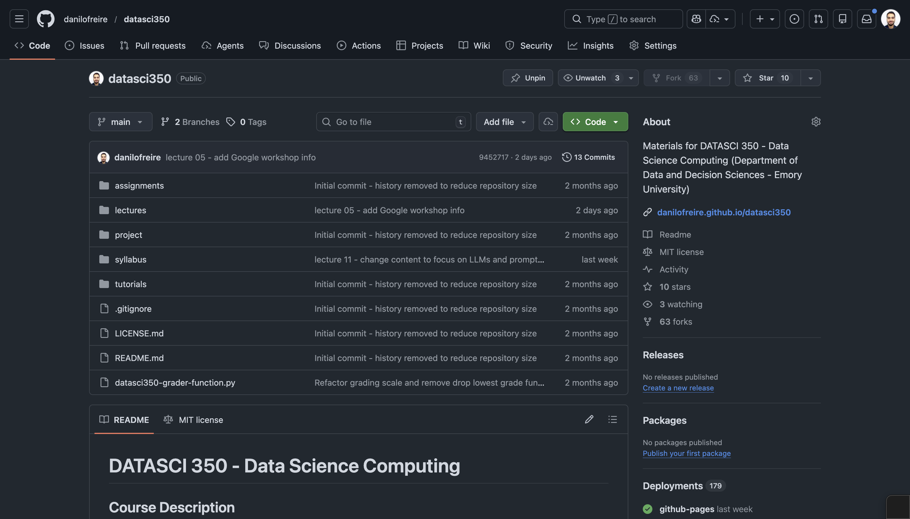

# Recap 📚 {background-color="#1B3A6B"}

## Brief recap
### Why the shell?

:::{style="margin-top: 30px; font-size: 25px;"}

:::{.columns}
:::{.column width="50%"}
- A [terminal]{.alert} is the window. A [shell]{.alert} is the program that runs your commands
- The command line gives you [speed, power, reproducibility, and portability]{.alert}
- Every command has the same shape: `command options arguments`
- Options start with a dash, and they combine: `ls -lah`
- `pwd` says where you are, `ls` shows what is there, `cd` moves you
- `~` is home, `.` is here, `..` is one level up
- `man`, `tldr`, and `cht.sh` when you get stuck
:::

:::{.column width="50%"}
:::{style="text-align: center; margin-top: -70px;"}
[{width="60%"}](#){data-modal-type="image" data-modal-url="figures/bash.png"}
[{width="100%"}](#){data-modal-type="image" data-modal-url="figures/linux-bash.png"}
:::
:::
:::
:::

## The `man` command issue in WSL

:::{style="margin-top: 30px; font-size: 24px;"}
- On Windows WSL, `man` often does not work out of the box
- Minimal Ubuntu images ship without the manual pages to save space
- You will see `man: command not found`, or `No manual entry for ls`

[Possible solutions:]{.alert}

:::: {.columns}
::: {.column width="50%"}
Installation options:

- Install the `man-db` and `manpages` packages:
  ```bash
  sudo apt update
  sudo apt install man-db manpages
  ```

- Alternative installation command:

  ```bash
  sudo apt install man
  ```
:::

::: {.column width="50%"}
Testing the installation:

- After installation, test with:
  ```bash
  man ls
  man cp
  man man
  ```
:::
::::
:::

# Managing your files 🗂 {background-color="#1B3A6B"}

## Managing your files

:::{style="margin-top: 30px; font-size: 27px;"}
:::{.columns}
::: {.column width="50%"}
- Once you can navigate, the next step is [managing files]{.alert}
- Downloading, unzipping, copying, moving, renaming, deleting
- A GUI handles ten files comfortably. It [scales badly]{.alert} to a thousand
- The shell does not ask twice. Expect no ["Do you really want to delete this folder of pictures from your anniversary?"]{.alert} 😅
:::

::: {.column width="50%"}
:::{style="text-align: center; margin-top: -10px;"}
[{width="250%"}](#){data-modal-type="image" data-modal-url="figures/time.jpg"}
:::
:::
:::
:::

## Create: `mkdir` and `touch`

:::{style="margin-top: 30px; font-size: 25px;"}
:::{.columns}
:::{.column width="50%"}
- `mkdir` creates directories:

```{bash, eval=FALSE, echo=TRUE}
mkdir testing
```
- `-p` creates the parent directories too, builds a [whole tree in one command]{.alert}, and never complains if a directory already exists:

```{bash, eval=FALSE, echo=TRUE}
mkdir -p testing02/subdir
```
:::

:::{.column width="50%"}
- `touch` creates empty files:

```{bash, eval=FALSE, echo=TRUE}
touch testing/test1.txt testing/test2.txt
```

- On a file that already exists, `touch` only updates its timestamps. [The contents stay untouched]{.alert}
- Check that it worked:

```{bash, echo=TRUE}
ls testing
```
:::
:::
:::

## Remove: `rm` and `rmdir`

:::{style="margin-top: 30px; font-size: 25px;"}
:::{.columns}
:::{.column width="50%"}
- Let's delete the objects that we just created 
- Start with one of the `.txt` files, by using `rm`
- We could delete all the files at the same time, but you'll see why I want to keep some

```{bash, eval=FALSE, echo=TRUE}
rm testing/test1.txt
```

```{bash, eval=TRUE, echo=FALSE}
touch test.txt
```
:::

:::{.column width="50%"}
- The equivalent command for directories is `rmdir`

```{bash, eval=FALSE, echo=TRUE}
rmdir testing

rm: testing: is a directory
```

- `rmdir` only removes [empty]{.alert} directories
- For a directory with files in it, use `rm -r` ([recursive]{.alert}). `-r` and `-R` are the same thing
- Adding `-f` ([force]{.alert}) skips the confirmation prompt. Leaving it off is safer, but some shells then ask about every single file

```{bash, eval=FALSE, echo=TRUE}
rm -rf testing ## Success
```
:::
:::
:::

## Copy: `cp`

:::{style="margin-top: 30px; font-size: 24px;"}
:::{.columns}
:::{.column width="50%"}
Syntax: `cp object path/newname`

- Leave out `newname` and the copy keeps the original one
- If something at the destination already has that name, add `-f` to overwrite it

```{bash, eval=TRUE, echo=FALSE}
rm -rf ./copies
```

```{bash, echo=TRUE}
## Create new "copies" sub-directory
mkdir ./copies

## Now copy across a file (with a new name)
cp ./04-more-command-line.qmd ./copies/abc.txt

## Show that we were successful
ls ./copies
```
:::

:::{.column width="50%"}
Copying a directory needs `-r`, so that everything inside comes along:

```{bash, echo=TRUE}
cp -r ./figures ./copies
ls ./copies/figures/
```
:::
:::
:::

## Move (and rename): `mv`

:::{style="margin-top: 30px; font-size: 25px;"}
- Syntax: `mv object path/newname`
- Leave out `newname` and the file keeps the one it has

```{bash, echo=TRUE}
## Move a file to see how it works
mv ./test.txt ./copies/
ls ./copies
```

- Moving a file within the same directory, but under a new name, is how you [rename]{.alert} it

```{bash, eval=TRUE, echo=TRUE}
## Rename test.txt to test-b.txt
mv ./copies/test.txt ./copies/test-b.txt
ls ./copies
```

```{bash, eval=TRUE, echo=FALSE}
rm ./copies/test-b.txt
```
:::

## Wildcards

:::{style="margin-top: 30px; font-size: 24px;"}
- [Wildcards](http://tldp.org/LDP/GNU-Linux-Tools-Summary/html/x11655.htm) stand in for other characters. Two of them matter most

- `*` matches [any number]{.alert} of characters. Use it to act on a whole class of files at once

```{bash, echo=TRUE}
# List all files in the "figures" directory that end with ".png"
ls figures/*.png 
```

- `?` matches [exactly one]{.alert} character. Use it to tell similar names apart

```{bash, echo=TRUE}
# List all files in the "figures" directory that start with "tim" and end with ".jpg"
ls figures/tim?.jpg 
```
You can repeat `?`, and [the number of them changes the result]{.alert}

```{bash, echo=TRUE}
# List all files in the "figures" directory that start with "time" and end with ".jpg"
ls figures/tim??.jpg
```
:::

## Find

:::{style="margin-top: 30px; font-size: 24px;"}
- `find` locates files and directories by name, size, type, and more
- Syntax: `find path(s) -options expression`
- `-iname` matches a name, ignoring capitals:

```{bash, echo=TRUE}
# Must use "." to indicate pwd
find ./ ../lecture-03/ -iname "*.qmd" 
```
- `-size` filters by size, with `k`, `M`, or `G` for kilo, mega, and gigabytes:

```{bash, echo=TRUE}
# Find files larger than 500 KB
find . -size +500k | sort # Sort the output 
```

- `-type` filters by kind: `d` for directories, `f` for files:

```{bash, echo=TRUE}
# Find all directories in the parent directory
find ./ -type d | sort # Sort the output
```
:::


## Find

:::{style="margin-top: 30px; font-size: 24px;"}
- Combine conditions with `-and`, `-or`, and `-not` (or `!`)
- Two conditions side by side already mean `-and`

```{bash, echo=TRUE}
# Find all .txt files that are larger than 1KB
find . -name "*.txt" -size +1k
```

```{bash, echo=TRUE}
# Find all .txt files OR .qmd files
find . -name "*.txt" -or -name "*.qmd"
```

```{bash, echo=TRUE}
# Find files that are NOT .csv or .gif files
find ./figures -not -name "*.csv" -and -not -name "*.gif"
```
:::

## Find

:::{style="margin-top: 30px; font-size: 24px;"}
- `-maxdepth n` and `-mindepth n` control how deep the search goes

```{bash, echo=TRUE}
# Search only in current directory, not subdirectories
find . -maxdepth 1 -name "*.txt"

# Skip current directory, search only in subdirectories
find . -mindepth 2 -name "*.txt"
```

- `-exec` runs a command on every result. `{}` stands for the filename, and the line must end with `\;`

```{bash, echo=TRUE}
# Print the size and name of each .txt file
find . -name "*.txt" -exec ls -lh {} \;
```

```{bash, echo=TRUE}
# Count lines in each .csv file
find . -name "*.csv" -exec wc -l {} \;
```
:::

# File management exercise 📂 {background-color="#1B3A6B"}

## File management exercise {#sec-exercise-01}
### I will show you some time-saving tips after the exercise

:::{style="margin-top: 30px; font-size: 25px;"}
:::{.columns}
:::{.column width="50%"}
- Imagine that you are a data analyst working in a new project. The project should have the following structure:

```{verbatim}
project/
│
├── scripts/
│   ├── preprocessing.py
│   ├── analysis.py
│   └── visualization.py
│
├── data/
│   ├── raw_data.csv
│   └── processed_data.csv
│
└── docs/
    ├── readme.txt
    └── notes.txt
```
:::

:::{.column width="50%"}
Your tasks:

1. Create the folders and files shown
2. Rename `raw_data.csv` to `input_data.csv`
3. Copy the Python files into a new `project/backup` folder
4. Delete `docs/notes.txt`
5. List the folders in `project`, long format and human-readable sizes
6. Delete everything

[[Answer: Appendix 01]{.button}](#sec-appendix-01)
:::
:::
:::

## How to use `{}` to create multiple files or directories

:::{style="margin-top: 30px; font-size: 24px;"}
:::{.columns}
:::{.column width="50%"}
- `{}` expands into several names at once, so one command does the work of many
- `touch file{1..3}.txt` creates `file1.txt`, `file2.txt`, `file3.txt`
- `mkdir dir{a,b,c}` creates `dira`, `dirb`, `dirc`
- It works with any command: `cp`, `mv`, `rm`
:::

:::{.column width="50%"}
- For example:

```{bash, echo=TRUE}
mkdir -p project/{scripts,data,docs}
touch project/scripts/{preprocessing,analysis,visualization}.py
touch project/data/data{1..5}.csv
touch project/docs/{readme.txt,notes.txt}
ls project/data
```

```{bash, echo=TRUE, eval=TRUE}
ls project/scripts
```

```{bash, echo=TRUE, eval=TRUE}
ls project/docs
```
:::
:::
:::

## Other tips: `&&`, `||` and `tree`

:::{style="margin-top: 30px; font-size: 23px;"}
:::{.columns}
:::{.column width="50%"}
- `&&` runs the next command only if the first one [succeeded]{.alert}
  - `mkdir my-dir && ls my-dir`
- `||` runs it only if the first one [failed]{.alert}
  - `mkdir my-dir || echo "Directory already exists"`
- Chain them to handle both cases in one line
:::

:::{.column width="50%"}
- `tree` draws the structure of a directory
- Install it with `brew install tree` on macOS, or `sudo apt-get install tree` on Linux and WSL
  - [More information here](https://github.com/Old-Man-Programmer/tree)

```{bash, echo=TRUE}
mkdir -p book/{code,data,text}/chapter-{1..3} && \
tree book
```

```{bash, echo=FALSE, eval=TRUE}
rm -rf project && rm -rf book
```
:::
:::
:::

# Working with text files 📄 {background-color="#1B3A6B"}

## Working with text files

:::{style="margin-top: 30px; font-size: 27px;"}
:::{.columns}
:::{.column width="50%"}
- Data scientists spend [a lot of time with text]{.alert}: scripts, Markdown, CSVs, logs
- Python and R are excellent for analysing text, and you will use them later
- The shell is excellent at a different job: looking at text, and quickly
- It is also already installed, on every machine you will ever log into
- The next few slides only scratch the surface
:::

::: {.column width="30%"}
:::{style="text-align: center; margin-top: -30px; margin-left: 50px;"}
[{width="150%"}](#){data-modal-type="image" data-modal-url="figures/bookshelf.gif"}
:::
:::
:::
:::

## Counting text: `wc`

:::{style="margin-top: 30px; font-size: 25px;"}
- `wc` counts lines, words, and characters, in that order
- Let's try it on a file holding all of Shakespeare's sonnets. [Source](http://www.gutenberg.org/cache/epub/1041/pg1041.txt)

```{bash, echo=TRUE}
## Download the file. -o is to specify the output filename
# curl -o sonnets.txt https://raw.githubusercontent.com/danilofreire/datasci350/main/lectures/lecture-04/sonnets.txt
wc sonnets.txt
```

The character count looks high because `wc` also counts the invisible newline `\n` at the end of every line
:::

:::{.callout-note}
Download the `sonnets.txt` file at <https://github.com/danilofreire/datasci350/blob/main/lectures/lecture-04/sonnets.txt>. Click on "Download raw file". Or use `curl` as shown in the code above. [Download curl here](https://curl.se/download.html).
:::

## Read text: `cat`

:::{style="margin-top: 30px; font-size: 24px;"}
:::{.columns}
:::{.column width="50%"}
- `cat` ("concatenate") prints the [whole]{.alert} file at once
- Fine for short files. Painful for long ones, as you are about to see
- `-n` adds line numbers
- Shakespeare's sonnets will overflow this slide, which is rather the point 😅
:::

:::{.column width="50%"}
```{bash, echo=TRUE}
cat -n sonnets.txt
```
:::
:::
:::

## Preview: `head` and `tail`

:::{style="margin-top: 30px; font-size: 24px;"}
:::{.columns}
:::{.column width="50%"}
- `head` shows the first lines of a file, `tail` the last
- Both default to 10 lines. `-n` sets how many

```{bash, echo=TRUE}
head -n 3 sonnets.txt ## First 3 rows
```
:::

:::{.column width="50%"}
- `tail` works the same way, counting from the bottom:

```{bash, echo=TRUE}
tail -n 1 sonnets.txt ## Last row
```

- `tail -n +N` starts at line N and shows everything after it:

```{bash, echo=TRUE}
tail -n +3024 sonnets.txt ## Show everything from line 3024
```
:::
:::
:::

## Search: `grep`

:::{style="margin-top: 30px; font-size: 24px;"}
:::{.columns}
:::{.column width="50%"}
- `grep` finds lines that match a pattern
- `-n` ("number") also reports the line number
- Here is the opening of Shakespeare's [Sonnet 18](https://en.wikipedia.org/wiki/Sonnet_18):

```{bash, echo=TRUE}
grep -n "Shall I compare thee" sonnets.txt
```
:::

:::{.column width="50%"}
- `-v` ("invert match") does the opposite, showing lines that do *not* match
- Below: lines with no comma, full stop, or question mark, limited to the first 30
```{bash, echo=TRUE}
grep -v "[,.?]" sonnets.txt | head -n 30
```
:::
:::
:::

## Search: `grep`

:::{style="margin-top: 30px; font-size: 24px;"}
:::{.columns}
:::{.column width="50%"}
- `grep` can search many files at once
- This is how you find which file defines a function you are looking for

```{bash, echo=TRUE}
## To visualise the tree structure
tree meals
```
:::

:::{.column width="50%"}
- `-r` (recursive) searches a directory and everything under it. Here, every line mentioning "pasta":

```{bash, echo=TRUE}
grep -r "pasta" ./meals/
```

- `-l` lists only the file names, not the matching lines:

```{bash, echo=TRUE}
grep -rl "pasta" ./meals/
```

- `man grep` lists many more. `-i` ignores capitals, which is usually what you want
:::
:::
:::

## Try it yourself! {#sec-exercise-02}

:::{style="margin-top: 30px; font-size: 24px;"}
- Now it's your turn to practice with text files!
- Download the text file with Shakespeare's Sonnets from [our repository](https://github.com/danilofreire/datasci350/blob/main/lectures/lecture-04/sonnets.txt) or use `curl` as shown before
- Go to the terminal and navigate to the directory where you saved the file
- Then try to do the following:
  - Find all lines in sonnets.txt that contain the word "time" 
  - View the last 20 lines in sonnets.txt
  - Count the number of lines and words in sonnets.txt
  - [Tricky question:]{.alert} Find all lines in sonnets.txt that [start]{.alert} with "and" 
  - [Super tricky question:]{.alert} Find all lines in sonnets.txt that start with "and" _and_ "And"  [[Appendix 02]{.button}](#sec-appendix-02)
:::

## Manipulate text: `sed`

:::{style="margin-top: 30px; font-size: 22px;"}
:::{.columns}
:::{.column width="50%"}
- `sed` is a [stream editor]{.alert}. It transforms text as it flows past, from a file or from a pipe
- `s/old/new/g` substitutes. `s` is substitute, `g` means every match on the line
- On its own it prints the result and leaves the file alone:

```{bash, echo=TRUE}
sed 's/Project Gutenberg/Project Googleberg/g' sonnets.txt | head -n 5
```

- [Warning]{.alert}: `-i` edits the file in place and [overwrites the original]{.alert}
  - `sed -i 's/Project Gutenberg/Project Googleberg/g' sonnets.txt`
:::

:::{.column width="50%"}
- Without `g`, only the first match on each line is replaced
- `sed` does more than substitute. It can delete, insert, and rearrange lines
- `d` deletes every line that matches:

```{bash, echo=TRUE, eval=FALSE}
sed '/Project Gutenberg/d' sonnets.txt
```

- To read more about `sed`, check out the [GNU documentation](https://www.gnu.org/software/sed/manual/sed.html)
:::
:::
:::

## Do you want to know more about `sed`?
### Make sure to master regular expressions!

:::{style="margin-top: 30px; font-size: 24px;"}
:::{.columns}
:::{.column width="50%"}
**Good starting points are:**

-   [This chapter](https://effective-shell.com/part-3-manipulating-text/regex-essentials/) discussing regex in the context of the shell

-   [Regular Expression in Python](https://docs.python.org/3/howto/regex.html)

-   [This base R regex intro](https://stat.ethz.ch/R-manual/R-devel/library/base/html/regex.html)

-   [This vignette from the stringr package](https://cran.r-project.org/web/packages/stringr/vignettes/regular-expressions.html)
:::

::: {.column width="50%"}
[{width="150%"}](#){data-modal-type="image" data-modal-url="figures/evil-laugh.gif"}
:::
:::
:::

## Nano: a CLI-based text editor
### For when you need to make quick edits

:::{style="margin-top: 30px; font-size: 25px;"}
:::{.columns}
:::{.column width="50%"}
- `nano` is a simple text editor that runs inside the terminal
- Useful for a quick edit when opening VS Code would be overkill, and essential on a remote server
- Open a file with `nano filename`
- Arrow keys to move, `Ctrl + O` to save, `Ctrl + X` to exit
- macOS needs `brew install nano`. WSL usually has it, or `sudo apt install nano`
- More in the [GNU documentation](https://www.nano-editor.org/dist/v2.9/nano.html)
:::

:::{.column width="50%"}
[{width="100%"}](#){data-modal-type="image" data-modal-url="figures/nano.png"}
:::
:::
:::

# Redirects, pipes, and loops 🔁 {background-color="#1B3A6B"}

## Redirects, pipes, and loops

:::{style="margin-top: 30px; font-size: 24px;"}
:::{.columns}
:::{.column width="50%"}
- Small tools become powerful when you connect them
- A [pipe]{.alert} feeds one command's output into the next, like `%>%` in R
- A [redirect]{.alert} sends output into a file instead of onto the screen
- A [loop]{.alert} repeats a command over a list
- This is the Unix philosophy in practice: one thing done well, many times over
:::

::: {.column width="50%"}
[{width="100%"}](#){data-modal-type="image" data-modal-url="figures/pipe.gif"}
:::
:::
:::

## Redirect: `>`

:::{style="margin-top: 30px; font-size: 24px;"}
- `>` sends output to a file instead of the screen
- `echo` just prints a message, so it makes an easy example:

```{bash, echo=TRUE, eval=FALSE}
echo "At first, I was afraid, I was petrified"
```

To save it instead, redirect it into a filename of your choice:

```{bash, eval=FALSE, echo=TRUE}
echo "At first, I was afraid, I was petrified" > survive.txt
find survive.txt ## Show that it now exists
```

```{bash, eval=TRUE, echo=FALSE}
find survive.txt ## Show that it now exists
```

- `>>` [appends]{.alert} to a file. `>` [overwrites]{.alert} whatever was there
- Mixing the two up is a common way to lose work

```{bash, eval=FALSE, echo=TRUE}
echo "'Kept thinking I could never live without you by my side" >> survive.txt
cat survive.txt
```

```{bash, eval=TRUE, echo=FALSE}
cat survive.txt
```
:::

## Pipes: `|`

:::{style="margin-top: 30px; font-size: 24px;"}
- `|` takes the output of the command on its left and feeds it to the one on its right
- Chain simple operations and you get a complex one, with no script and no temporary files
- An example using commands you already know:

```{bash, echo=TRUE}
# Read the sonnets.txt file, find all lines that contain the word "time", and count the number of lines and words
cat sonnets.txt | grep "time" | wc -lw
```

- Each stage does one job, and the data flows left to right

```{bash, echo=TRUE}
# Another example: find all lines in sonnets.txt that contain the word "love" and print the first 5 lines
cat sonnets.txt | grep "love" | head -n 5
```
:::

## Iteration with *for* loops

:::{style="margin-top: 30px; font-size: 24px;"}
- A `for` loop repeats an operation over a list
- It works much like a `for` loop in Python or R
- The `$` marks a variable, so `$i` is the current item

- Basic syntax:

``` {bash, eval=FALSE, echo=TRUE}
for i in LIST
do 
  OPERATION $i ## the $ sign indicates a variable in bash
done
```

- `;` ends a statement, so the whole loop fits on one line:

```{bash, eval=FALSE, echo=TRUE}
for i in LIST; do OPERATION $i; done
```

Semicolons are not limited to loops. They end a statement anywhere in Bash
:::

## Example 1: Create directories with a *for* loop

:::{style="margin-top: 30px; font-size: 25px;"}
:::{.columns}
:::{.column width="50%"}
- A loop in action, creating `dir1` through `dir4`:

```{bash, echo=TRUE}
for i in {1..4}; do mkdir dir$i; done
ls -d dir*
rm -rf dir*
```
:::

:::{.column width="50%"}
- `{1..4}` generates the sequence 1, 2, 3, 4
- Each pass through the loop sets `$i` to the next number
- `mkdir dir$i` therefore runs four times, as `mkdir dir1`, `mkdir dir2`, and so on
- Change the list and the same loop does something else entirely
:::
:::
:::

# Scripting with the shell 📜 {background-color="#1B3A6B"}

## Scripting with the shell

:::{style="margin-top: 30px; font-size: 30px;"}
:::{.columns}
:::{.column width="50%"}
- A [shell script]{.alert} is a text file holding a sequence of commands
- Run it with `bash script.sh`, or with `./script.sh` once it is executable
- This is how you stop retyping the same five commands every week
- Downloading data, cleaning it, running an analysis, and building a report can all be one file
:::

:::{.column width="50%"}
[{width="100%"}](#){data-modal-type="image" data-modal-url="figures/automation.gif"}
:::
:::
:::

## Example: Shell script

:::{style="margin-top: 30px; font-size: 24px;"}
:::{.columns}
:::{.column width="50%"}
- Let's script the project structure we built by hand earlier: create it, list it, remove it
- We will call the file `create_project.sh`
- The first line, `#!/bin/sh`, is the [shebang](https://en.wikipedia.org/wiki/Shebang_(Unix))
- It tells the system which interpreter should run the file
:::

:::{.column width="50%"}
- Paste the code below into a text editor and save it as `create_project.sh`
- Make the script executable by running `chmod +x create_project.sh`
- Run the script by typing `./create_project.sh`

```{bash, echo=TRUE, eval=FALSE}
#!/bin/sh
mkdir -p project/{scripts,data,docs}
touch project/scripts/{preprocessing,analysis,visualization}.py
touch project/data/{raw_data,processed_data}.csv
touch project/docs/{readme.txt,notes.txt}
ls -alh project
rm -rf project
```

```{bash, echo=TRUE}
## Make the script executable
chmod +x create_project.sh

## Run the script
./create_project.sh
```
:::
:::
:::

# Next steps 🚀 {background-color="#1B3A6B"}

## Things we didn't cover here

:::{style="margin-top: 30px; font-size: 23px;"}
:::{.columns}
:::{.column width="50%"}
The goal today was to [demystify the shell]{.alert}, so it does not intimidate you when it turns up again later in the course

Things we left out:

- [File permissions]{.alert} and user roles, which matter the moment you share a machine
- [Environment variables]{.alert} and [SSH]{.alert}. Both come back in the cloud lectures
- Watching what your machine is doing, with [top](https://ss64.com/bash/top.html) and [htop](https://hisham.hm/htop/)
- Running commands in parallel with GNU parallel. We return to parallelism in Lecture 21
- Automation: try this [overview](https://stat545.com/automation-overview.html), or [Code and Data for the Social Sciences](https://web.stanford.edu/~gentzkow/research/CodeAndData.pdf)
:::

:::{.column width="50%"}
[{width="80%"}](#){data-modal-type="image" data-modal-url="figures/next.jpg"}
:::
:::
:::

## Additional materials

:::{style="margin-top: 30px; font-size: 26px;"}
If you want to dig deeper, check out

- [The Unix Shell](http://swcarpentry.github.io/shell-novice/) (Software Carpentery)
- [The Unix Workbench](https://seankross.com/the-unix-workbench/) (Sean Kross)
- [Data Science at the Command Line](https://www.datascienceatthecommandline.com/) (Jeroen Janssens)
- [Effective Shell](https://effective-shell.com/) (Dave Kerr)
- [Efficient Way To Process Large Text/Log Files Using Awk With Python](https://techblogs.42gears.com/efficient-way-to-process-large-text-log-files-usin-wpython/)
- [Using AWK and R to parse 25tb](https://livefreeordichotomize.com/posts/2019-06-04-using-awk-and-r-to-parse-25tb/) (Nick Strayer)
- [`./jq`](https://jqlang.github.io/jq/)
- [`awk`](https://en.wikipedia.org/wiki/AWK)
- [`neovim`](https://neovim.io/)
:::

## Summary

:::{style="margin-top: 30px;"}
- `mkdir` and `touch` create, `rm` and `rmdir` delete, `cp` and `mv` copy and move
- Wildcards (`*`, `?`) and braces (`{}`) let one command act on many files
- `find` locates files by name, size, type, or depth, and `-exec` acts on what it finds
- `cat`, `head`, `tail`, and `wc` look at text. `grep` searches it, `sed` edits it
- `>` writes output to a file, `>>` appends to it
- `|` pipes one command into the next. The Unix philosophy in practice
- `for` loops repeat work, and a [shell script]{.alert} saves it for next time
:::

## Next class

:::{style="margin-top: 30px; font-size: 26px;"}
:::{.columns}
:::{.column width="50%"}
- We leave the shell and start on [version control]{.alert}
- [Project structure]{.alert}: where to put your scripts, data, and outputs, so future-you can find them
- What [Git](https://git-scm.com/) is, and why "final_v3_REALLY_final.docx" is not version control
- Installing Git, and introducing yourself to it
- [GitHub](https://github.com), and your first repository
- You will use these every week for the rest of the course 🤓
:::

:::{.column width="50%"}
:::{style="text-align: center; margin-top: 20px;"}
[{width="100%"}](#){data-modal-type="image" data-modal-url="figures/course-repo.png"}
:::
:::
:::
:::

# And that's all for today! 🥳 {background-color="#1B3A6B"}

# Thank you very much and see you soon! 😊 🙏🏼{background-color="#1B3A6B"}

## Appendix 01: Solution to the exercise {#sec-appendix-01}

:::{style="margin-top: 30px; font-size: 21px;"}

```{bash, echo=TRUE}
# Create the project structure
mkdir -p project/{scripts,data,docs}

# Create the required files
touch project/scripts/{preprocessing,analysis,visualization}.py
touch project/data/{raw_data,processed_data}.csv
touch project/docs/{readme.txt,notes.txt} # Extension explicit

# Rename raw_data.csv to input_data.csv
mv project/data/raw_data.csv project/data/input_data.csv

# Copy all Python files in scripts to a new backup directory
mkdir project/backup
cp project/scripts/*.py project/backup/

# Remove the notes.txt file from the docs directory
rm project/docs/notes.txt

# List all folders in the project directory in long and human-readable format
ls -alh project

## Remove all folders
rm -rf project
```

[[Back to the main text]{.button}](#sec-exercise-01)
:::

## Appendix 02: Solution to the exercise {#sec-appendix-02}

```{bash, echo=TRUE}
# Find all lines in sonnets.txt that contain the word "time"
grep "time" sonnets.txt
```

## Appendix 02: Solution to the exercise

```{bash, echo=TRUE}
# View the last 20 lines in sonnets.txt
tail -n 20 sonnets.txt
```

## Appendix 02: Solution to the exercise

```{bash, echo=TRUE}
# Count the number of lines and words in sonnets.txt
wc -lw sonnets.txt
```

## Appendix 02: Solution to the exercise

```{bash, echo=TRUE}
# Find all lines in sonnets.txt that start with "and"
grep -n "^and" sonnets.txt
```

```{bash, echo=TRUE}
# Find all lines in sonnets.txt that start with "and" and "And"
# You have to include the -i flag to ignore case!
grep -in "^and" sonnets.txt
```

[[Back to the main text]{.button}](#sec-exercise-02)