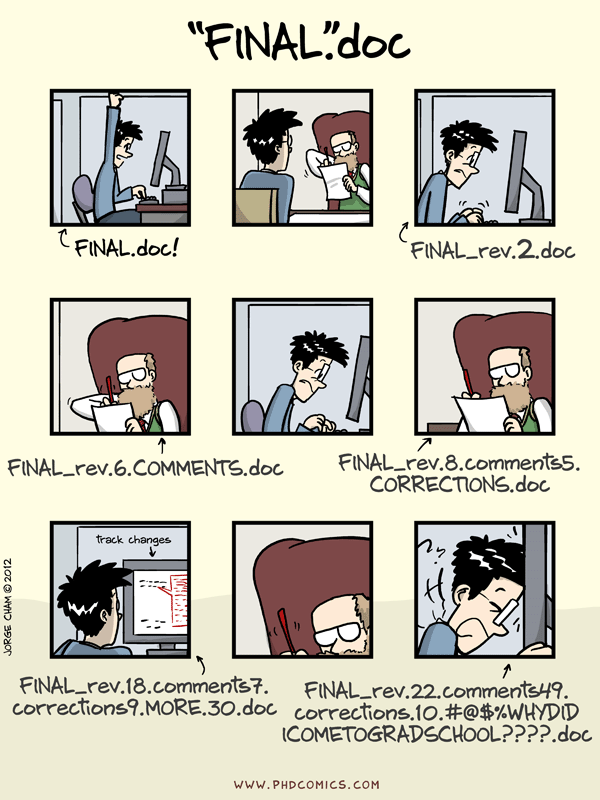

# Nice to see you all again! 😊 {background-color="#1B3A6B"}

# Recap and lecture overview 📚 {background-color="#1B3A6B"}

## Recap of our last lecture
### In our last class, we covered

:::{style="margin-top: 30px; font-size: 24px;"}
:::{.columns}
:::{.column width="50%"}
- Essential navigation commands: `ls`, `cd`, `pwd`
- Useful directory shortcuts: `~` (home), `.` (current), `..` (parent directory)
- File manipulation commands: `touch`, `mkdir`, `rm`, `rmdir`
- File content commands: `cat`, `head`, `tail`
- Wildcards for efficient file matching: `*` (any characters), `?` (any single character)
- Batch operations with `{}`
- Chaining commands with && and ||
- Text manipulation tools: 
  - `wc`, `grep`, `sed`
:::

:::{.column width="50%"}
:::{style="text-align: center;"}
[{width="80%"}](#){data-modal-type="image" data-modal-url="figures/home.jpg"}
:::
:::
:::
:::

## Recap of our last lecture
### Regular expressions

:::{style="margin-top: 30px; font-size: 24px;"}
:::{.columns}
:::{.column width="40%"}
- Regular expressions search for [patterns]{.alert} rather than exact text
- They work in most languages and tools, and in the shell through `grep`

:::{style="text-align: center; margin-top: 40px;"}
[{width="100%"}](#){data-modal-type="image" data-modal-url="figures/regex.webp"}
:::
:::

:::{.column width="60%"}
| Symbol | Meaning | Example | Matches |
| :----: | :------ | :------ | :------ |
| `.` | Any single character | `d.g` | `dog`, `dig`, `d@g` |
| `^` | Start of a line | `^Hello` | `Hello world` |
| `$` | End of a line | `end$` | `This is the end` |
| `[]` | Any character inside | `[aeiou]` | `a`, `e`, `i`, `o`, `u` |
| `*` | Zero or more of the previous | `ab*c` | `ac`, `abc`, `abbc` |
| `+` | One or more of the previous | `ab+c` | `abc`, `abbc` |
| `?` | Zero or one of the previous | `colou?r` | `color`, `colour` |
| `\|` | Either one or the other | `cat\|dog` | `cat`, `dog` |
| `()` | Group, to apply a symbol to all of it | `(ha)+` | `ha`, `haha` |
:::
:::
:::

## Today's lecture

:::{style="margin-top: 30px; font-size: 24px;"}
:::{.columns}
:::{.column width="50%"}
- Thinking in [projects]{.alert}, and how to set one up
- What [version control]{.alert} is, and why it will save you
- [Git]{.alert} and [GitHub]{.alert}, and why they are not the same thing
- Installing Git and introducing yourself to it
- Repositories, the staging area, and commits
- `git init`, `add`, `commit`, `log`, and `checkout`
- Branches, merging, and conflicts come next class
:::

:::{.column width="50%"}
:::{style="text-align: center; margin-top: -40px;"}
[{width="50%"}](#){data-modal-type="image" data-modal-url="figures/git.png"}
[{width="100%"}](#){data-modal-type="image" data-modal-url="figures/github.png"}
:::
:::
:::
:::

# Project management 📂 {background-color="#1B3A6B"}

## Taming chaos

:::{style="margin-top: 30px; font-size: 24px;"}
:::{.columns}
::: {.column width="50%"}
In the data science workflow, there are [two sorts of surprises and cognitive stress]{.alert}:

:::{.incremental}
1. Analytical (often good)
2. Infrastructural (almost always bad)
:::

:::{.incremental}
- [Analytical surprise]{.alert}: you learn something from the data
- [Infrastructural surprise]{.alert}: you cannot find what you did last month, the code breaks, the report will not compile, or your collaborator cannot run any of it
- Good project management lets you focus on the [right kind of stress]{.alert}
:::
:::

::: {.column width="50%" layout-valign="center"}
[{width="80%"}](#){data-modal-type="image" data-modal-url="figures/pippi-langstrumpf.gif"}
:::
:::
:::

## Keeping future-you happy

:::{style="margin-top: 30px; font-size: 24px;"}
:::{.incremental}
- It is tempting to set up a project assuming you will be its only reader
- [That is almost never true]{.alert}. Coauthors and collaborators happen to the best of us 😅
- And even alone, there is always [future-you]{.alert}, who has forgotten everything
- Future-you either enjoys the fruits of your work, or fights through your chaos
- So [be kind to future-you]{.alert}. Set up a good workflow now 😊

:::{style="text-align: center;"}
[{width="40%"}](#){data-modal-type="image" data-modal-url="figures/fox.png"}
:::
:::
:::

## Project setup 👷🏻‍♀️👷🏽‍♂️

:::{style="margin-top: 30px; font-size: 24px;"}
:::{.columns}
:::{.column width="50%"}
You should [always]{.alert} think in terms of projects!

A project is a [self-contained unit of data science work]{.alert} that can be

:::{.incremental}
- Shared (e.g., with collaborators)
- Recreated by others (including future-you)
- Packaged (e.g., as a report)
- Dumped (exported or archived)
:::
:::

:::{.column width="50%"}
:::{.fragment .fade-in}
A project contains:

:::{.incremental}
- [Content]{.alert}, e.g., raw data, processed data, scripts, functions, documents and other output

- [Metadata]{.alert}, e.g., information about tools for running it (required libraries, compilers), version history
:::

:::{style="margin-top: 20px;"}
:::{.fragment .fade-in}
For a Python project:

- The project is a folder
- The metadata is `.git`, plus files like [`pyproject.toml`](https://packaging.python.org/en/latest/guides/writing-pyproject-toml/) and `uv.lock` that record which packages it needs
:::
:::
:::
:::
:::
:::

## Project setup: directories
### Recommendations

:::{style="margin-top: 30px; font-size: 22px;"}
:::{.columns}
:::{.column width="50%"}
- One parent folder contains [everything]{.alert} inside it
- You decide what goes in the project folder. The project dictates the structure
- Keep [input separate from output]{.alert}. Definitely separate raw from processed data!
- [Keep every internal path relative]{.alert}. Never write `"/Users/me/data/thing.csv"`
- That path works on exactly one machine, and often not on that one either, six months later
:::

:::{.column width="50%"}
A workable starting point:

```{verbatim}
my-project/
├── data/
│   ├── raw/
│   └── processed/
├── scripts/
│   ├── 00-setup.py
│   ├── 01-import-data.py
│   └── 02-analysis.py
├── output/
│   ├── figures/
│   └── tables/
├── README.md
└── pyproject.toml
```
:::
:::
:::

## Project setup: scripts

:::{style="margin-top: 30px; font-size: 22px;"}
:::{.columns}
:::{.column width="50%"}
- Scripts are the [glue]{.alert} that holds your project together
- They should be [readable]{.alert} and [reproducible]{.alert}
- Names should [only include letters and numbers]{.alert} with dashes `-` or underscores `_` to separate words
- Use numbering to indicate the order in which files should be run:
  - `00-setup.py`
  - `01-import-data.py`
  - `02-preprocess-data.py`

- Write short, modular scripts. Every script serves a purpose in your pipeline
- Put the setup first (e.g., `library()` and `source()`)
- [Always comment more than you usually do]{.alert}
:::

:::{.column width="50%"}
:::{style="text-align: center;"}
[{width="65%"}](#){data-modal-type="image" data-modal-url="figures/file_management.png"}
:::
:::
:::
:::

# Version control systems 🔄 {background-color="#1B3A6B"}

## What is version control?

:::{style="margin-top: 30px; font-size: 24px;"}
:::{.columns}
:::{.column width="50%"}
:::{.incremental}
- Version control [tracks every change]{.alert} you make to a set of files
- It stores them as [snapshots and branches]{.alert} you can move between
- So you can see how a project grew, and go back to any point in it
- It gives you a backup, a history, and a way for several people to work at once
- It scales from a two-file assignment to the Linux kernel
:::
:::

:::{.column width="50%"}
[{width="70%"}](#){data-modal-type="image" data-modal-url="figures/01-version-control.png"}
:::
:::
:::

## Why version control?

:::{style="margin-top: 30px; font-size: 24px; text-align: center;"}
[{width="40%"}](#){data-modal-type="image" data-modal-url="figures/phd-comics-final-doc.gif"}
:::

## More reasons to use version control

:::{style="margin-top: 30px; font-size: 24px;"}
:::{.columns}
:::{.column width="50%"}
**Have you ever...**

- Changed your code, realised it was a mistake and wanted to revert back?
- Lost code or had a backup that was too old?
- Wanted to see the difference between different versions of your code?
- Wanted to review the history of some code?
- Wanted to submit a change to someone else's code?
- Wanted to see how much work is being done, when, and by whom?

[Version control can help with all of these!]{.alert}
:::

:::{.column width="50%"}
[{width="70%"}](#){data-modal-type="image" data-modal-url="figures/version-control-joke-2.jpeg"}
:::
:::
:::

# Git and GitHub 🐙 {background-color="#1B3A6B"}

## What is Git?

:::{style="margin-top: 30px; font-size: 21px;"}
:::{.columns}
:::{.column width="50%"}
[{width="30%"}](#){data-modal-type="image" data-modal-url="figures/git.png"}

- Git is a [distributed version control system]{.alert}
- Imagine Dropbox and Word's "Track changes" had a baby, except [built for code]{.alert}
- There is a learning curve. It is worth it
- Other [version control systems exist](https://en.wikipedia.org/wiki/Comparison_of_version-control_software), but Git won
- Around 94% of developers used it by [2021](https://survey.stackoverflow.co/2021#most-popular-technologies-tools-tech). Recent surveys stopped asking, because the answer is everyone
- Data scientists will [assume you know it]{.alert}
:::

:::{.column width="50%"}
[{width="45%"}](#){data-modal-type="image" data-modal-url="figures/github.png"}

- [Git and GitHub are not the same thing]{.alert}
- Git is the software that tracks your changes, and it runs on your machine
- [GitHub hosts your repositories online]{.alert} and adds tools for working with other people
- You do not *need* GitHub to use Git, just as you do not need VS Code to write Python
- But it makes life considerably easier
:::
:::
:::

## Git: some background

:::{style="margin-top: 30px; font-size: 24px;"}
:::{.columns}
::: {.column width="50%"}
**Where does Git come from?**

- Git was created in 2005 by Linux creator [Linus Torvalds](https://en.wikipedia.org/wiki/Linus_Torvalds)
- The initial motivation was to have a non-proprietary version control system to manage Linux kernel development
- Check out this (quite opinionated) [talk on Git by Linus Torvalds](https://www.youtube.com/watch?v=4XpnKHJAok8) from 2007, two years after its creation
- There are many [Git GUIs](https://en.wikipedia.org/wiki/Comparison_of_Git_GUIs), giving you the option to use git without the shell (often with reduced functionality). Popular choices are the [GitHub Desktop](https://desktop.github.com/), and the [integration with VS Code](https://code.visualstudio.com/docs/editor/versioncontrol)
:::

::: {.column width="50%"}
:::{style="text-align: center;"}
[{width="50%"}](#){data-modal-type="image" data-modal-url="figures/git-vscode.png"}
:::
:::
:::
:::

## GitHub: some background

:::{style="margin-top: 30px; font-size: 22px;"}
:::{.columns}
:::{.column width="50%"}
**Where does GitHub come from?**

- Created in 2008, and owned by Microsoft since 2018
- It does far more than host code: documentation, websites, issue tracking, and automation
- Think of it as a [social network for developers]{.alert}
- [I am a big fan]{.alert}. [My website](https://danilofreire.github.io/) and [this course](https://danilofreire.github.io/datasci350) are both hosted on it
:::

:::{.column width="50%"}
- [Please create an educational account](https://github.com/education/students) to get free access to GitHub Pro. Use your Emory email address
- You will receive a [GitHub Student Developer Pack](https://education.github.com/pack) with many freebies, including [GitHub Copilot](https://copilot.github.com/), which is an AI tool that helps you write code
- We will meet Copilot and other AI coding tools in future lectures, but you can start using it now

:::{style="text-align: center;"}
[{width="40%"}](#){data-modal-type="image" data-modal-url="figures/professorcat.png"}
:::
:::
:::
:::

## First step: install Git

:::{style="margin-top: 30px; font-size: 23px;"}
Again, Git is an independent piece of software. You need to have it installed on your machine to call it from the command line or VS Code

Chances are that that's already the case. Here's how you can check using the command line:

```{verbatim}
which git
```

And here's how you can check the version:

```{verbatim}
git --version
```

If you want to install (or update) Git on your Mac, I recommend using [Homebrew](https://brew.sh/), "the missing package manager for macOS (or Linux)":

```{verbatim}
brew install git
```

WSL users can install Git using:

```{verbatim}
sudo apt-get install git
```

To install/update Git for Windows (not WSL), check out [happygitwithr.com](https://happygitwithr.com/install-git.html)
:::

## Second step: introduce yourself to Git

:::{style="margin-top: 30px; font-size: 24px;"}
This is particularly important when you work with Git but without the GitHub overhead. The idea is to define how your commits are labelled. Others should easily identify your commits as coming from you.

Have you already introduced yourself to Git? Find it out:

```{verbatim}
git config --list
```

Still have to introduce yourself? To that end, we set our user name and email address like this:

```{verbatim}
git config --global user.name 'danilofreire'
git config --global user.email 'danilo.freire@emory.edu'
```

The user name can be (but does not have to be) your GitHub user name. The email address should definitely be the one associated with your GitHub account.

Check out [these setup instructions](https://swcarpentry.github.io/git-novice/02-setup.html) from [Software Carpentry](https://software-carpentry.org/about/) to learn about more configuration options.
:::

# Git from the shell 🐚 {background-color="#1B3A6B"}

## Repositories

:::{style="margin-top: 30px; font-size: 28px;"}
:::{.columns}
:::{.column width="50%"}
- [Repositories]{.alert}, usually called [repos](https://en.wikipedia.org/wiki/Repository_(version_control)), store the [full history and source control of a project]{.alert}
- They can either be hosted locally, or on a shared server, such as [GitHub](https://github.com/)
- Most repositories are stored on GitHub, while core contributors make copies of the repository on their machine and update the repository using the `push/pull` system
- Any repository stored somewhere other than locally is called a [remote repository]{.alert}
:::

:::{.column width="50%"}
:::{style="text-align: center;"}
[{width="60%"}](#){data-modal-type="image" data-modal-url="figures/03-version-control.png"}
:::
:::
:::
:::

## {background-image="figures/datasci350-repo.png"}

## Repos vs directories

:::{style="margin-top: 30px; font-size: 28px;"}
:::{.columns}
:::{.column width="50%"}
- A [repository]{.alert} is the [whole timeline]{.alert} of a project, every change ever made
- A [working directory]{.alert} is the project as it looks [right now]{.alert}
- A folder on your machine that talks to a repository is itself a repository. We call it a [local repository]{.alert}, to distinguish it from the remote one
:::

::: {.column width="50%"}
:::{style="text-align: center;"}
[{width="100%"}](#){data-modal-type="image" data-modal-url="figures/04-version-control.png"}
:::
:::
::: 
:::

## Workflow diagram

:::{style="margin-top: 30px; font-size: 24px;"}
:::{.columns}
:::{.column width="50%"}
Work moves through four places:

- The [working directory]{.alert}: your files, as they are now
- The [staging area]{.alert}: the changes you have picked out to save next
- The [local repository]{.alert}: the full history, on your machine
- The [remote repository]{.alert}: the same history, on a server, usually GitHub

A [commit]{.alert} is a snapshot: it takes what is staged and adds it to the timeline
:::

::: {.column width="50%"}
:::{style="text-align: center;"}
[{width="50%"}](#){data-modal-type="image" data-modal-url="figures/05-version-control.jpg"}
:::
:::
::: 
:::

## Main Git commands

:::{style="margin-top: 30px; font-size: 22px;"}
:::{.columns}
:::{.column width="50%"}
- `git init`: initialises a new Git repository
- `git clone`: copies an existing repository
- `git add`: adds changes to the staging area
- `git commit`: commits changes 
- `git push`: pushes changes
- `git pull`: pulls changes
- `git status`: shows the status of the working directory
- `git log`: shows the commit history
- `git branch`: shows the branches in the repository
- `git checkout`: switches branches

[Git documentation](https://git-scm.com/doc)
:::

:::{.column width="50%"}
:::{style="text-align: center;"}
[{width="90%"}](#){data-modal-type="image" data-modal-url="figures/commands.webp"}
:::
:::
:::
:::

# Hands-on: Git and GitHub 🤲🏽 {background-color="#1B3A6B"}

## Let's create a repository together

:::{style="margin-top: 30px; font-size: 30px;"}
- Let's create a new repository on GitHub from scratch!
- We will create one in our local machine and make some changes
- Next class, I will show you how to clone it and modify it
- We will also learn how to create branches, merge them, and resolve conflicts

:::{.fragment .fade-in}
:::{style="text-align: center; font-size: 50px;"}
[Let's do it!]{.alert} 🚀
:::
:::
:::

## Creating a new repository

:::{style="margin-top: 30px; font-size: 25px;"}
:::{.columns}
:::{.column width="50%"}
1. I will create a new folder/directory in my computer: `my-project` 
2. Open the `bash/zsh` Terminal and go to the `my-project` directory
3. I will copy the `my-project` directory path into a text document 
4. I will try to add this folder to the `staging area`

```{verbatim}
mkdir my-project
cd my-project
git add .
```
5. [Error!]{.alert} 😟

:::{.fragment .fade-in}
6. We need to initialise the repository. [Do not do that in your home directory!]{.alert}

```{verbatim}
git init
```
:::
:::

:::{.column width="50%"}
:::{style="text-align: center;"}
[{width="130%"}](#){data-modal-type="image" data-modal-url="figures/terminal.png"}
:::
::: 
:::
:::

## Adding/Removing files from the repo

:::{style="margin-top: 30px; font-size: 24px;"}
:::{.columns}
:::{.column width="50%"}
7. Check the `staging area` status

```{verbatim}
git status
```

8. Let's add a `01-data-cleaning.py` file to the `staging area`. Then, check its status

```{verbatim}
touch 01-data-cleaning.py
git add 01-data-cleaning.py
git status
```
:::

::: {.column width="50%"}
:::{style="text-align: center;"}
[{width="100%"}](#){data-modal-type="image" data-modal-url="figures/terminal02.png"}
:::
::: 
:::
:::

## Adding/Removing files from the repo

:::{style="margin-top: 30px; font-size: 24px;"}
:::{.columns}
:::{.column width="50%"}
9. Now let's create more files and add them to the `staging area`

```{verbatim}
touch 02-exploratory-data-analysis.py
touch 03-modelling.py
touch 04-visualisation.py
git add .
git status
```
:::

::: {.column width="50%"}
:::{style="text-align: center;"}
[{width="100%"}](#){data-modal-type="image" data-modal-url="figures/terminal03.png"}
:::
:::
:::
:::

## Adding/Removing files from the repo

:::{style="margin-top: 30px; font-size: 24px;"}
:::{.columns}
:::{.column width="50%"}
10. In the directory, let's delete the `04-visualisation.py` file and check the status:

```{verbatim}
rm -f 04-visualisation.py
git status
```
:::

::: {.column width="50%"}
:::{style="text-align: center;"}
[{width="100%"}](#){data-modal-type="image" data-modal-url="figures/terminal04.png"}
:::
:::
:::
::: 

## First commit

:::{style="margin-top: 30px; font-size: 24px;"}
:::{.columns}
:::{.column width="50%"}
11. Now our "initial commit" :

```{verbatim}
git commit -m "initial commit"
```
:::

::: {.column width="50%"}
:::{style="text-align: center;"}
[{width="100%"}](#){data-modal-type="image" data-modal-url="figures/terminal05.png"}
::: 
:::
:::
:::

## First commit

:::{style="margin-top: 30px; font-size: 24px;"}
:::{.columns}
:::{.column width="50%"}
12. To check all commits in your `repo`:

```{verbatim}
git log
```

- Most important things here are:   
  - commit id;
  - date/time;
  - branch;
  - commit message;
:::

::: {.column width="50%"}
:::{style="text-align: center;"}
[{width="100%"}](#){data-modal-type="image" data-modal-url="figures/terminal06.png"}
::: 
:::
:::
:::

## Git checkout

:::{style="margin-top: 30px; font-size: 23px;"}
:::{.columns}
:::{.column width="50%"}
1. First, let's make new commits in our repo:

```{verbatim}
touch 04-new-visualisation.py # new file
touch 05-comments.py # new file
git add . 
git commit -m "adding files" 
echo "Hello you" >> 05-comments.py # edit file
git add . 
git commit -m "editing 05-comments.py" 
rm -f 05-comments.py 
git commit -am "deleting 05-comments.py" 
git log 
```
:::

::: {.column width="50%"}
:::{style="text-align: center;"}
[{width="100%"}](#){data-modal-type="image" data-modal-url="figures/terminal07.png"}
:::
:::
::: 
:::

## Hands on! Git checkout

:::{style="margin-top: 30px; font-size: 26px;"}
:::{.columns}
:::{.column width="50%"}
2. We use `checkout` to go back in time to a given commit. Let's go back to the "initial commit":

```{verbatim}
git checkout 470636f38e409f4f322c48183e19633ebb550625
```

- [Your hash will be different]{.alert}. Copy yours from `git log`, and the first 5-6 characters are enough

- Check the folder!
- `04-visualisation.py` is back!
- [Important]{.alert}: doing this does not delete our commits. We just move back in time!
::: 

::: {.column width="50%"}
:::{style="text-align: center;"}
[{width="200%"}](#){data-modal-type="image" data-modal-url="figures/terminal08.png"}
:::
:::
::: 
:::

## Git checkout

:::{style="margin-top: 30px; font-size: 24px;"}
:::{.columns}
:::{.column width="50%"}
3. To "go back to the future", the most recent commit, we just need to go back to the main branch:

```{verbatim}
git checkout main
git log
```
- Check the `folder/directory` again!
- `04-visualisation.py` is gone and `04-new-visualisation.py` is back!
::: 

::: {.column width="50%"}
[{width="100%"}](#){data-modal-type="image" data-modal-url="figures/terminal09.png"}
:::
:::
::: 

## Next steps 🙂

:::{style="margin-top: 30px; font-size: 28px;"}
- [Phew!]{.alert} That was a lot of work! 😅
- Next class we will see how we can create branches and merge them
- We will also learn how to resolve conflicts and push our changes to GitHub
- For now, let's keep our `my-project` folder and we will use it in our next class
- If you want to run ahead, create a repository on GitHub and try pushing to it. We will cover the details next class 🤓
- [Questions?]{.alert}
:::

## Summary 📝

:::{style="margin-top: 30px; font-size: 24px;"}
:::{.columns}
:::{.column width="50%"}
Today we learned about:

- The importance of project management
- The benefits of version control systems
- What is Git and why use it
- Why GitHub is a great tool for collaborative projects
- The main Git commands
- The difference between repositories and directories
- How to add, remove, commit, and check changes in a repository
:::

:::{.column width="50%"}
[{width="100%"}](#){data-modal-type="image" data-modal-url="figures/spy.png"}
:::
:::
:::

# Thank you very much and see you soon! 😊🙏🏻 {background-color="#1B3A6B"}