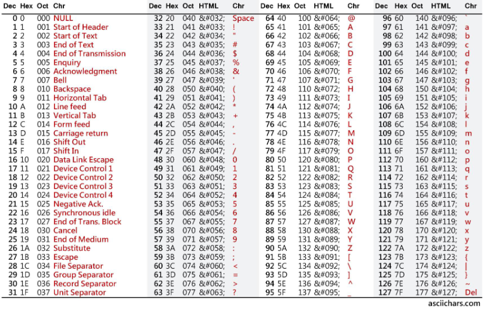
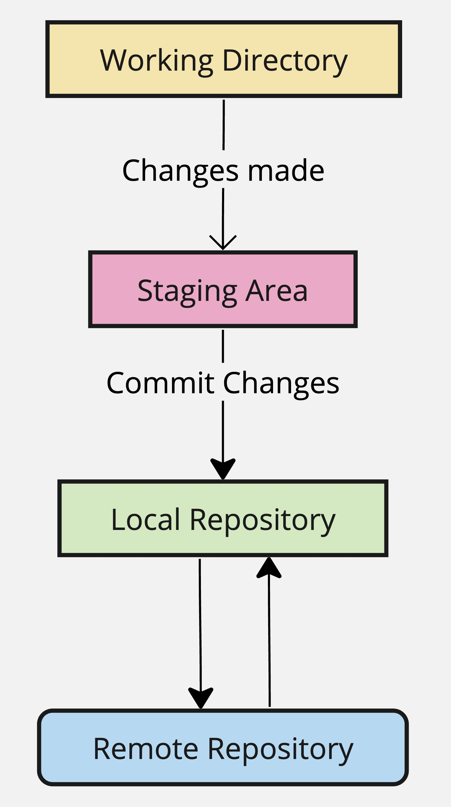
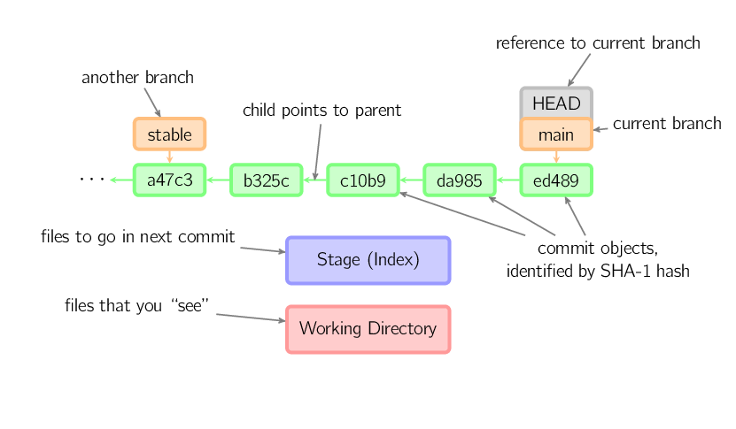
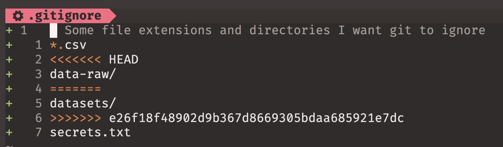

# Welcome back! 😊 <br><br> Time to review 📚 {background-color="#1B3A6B"}

## Today's plan

:::{style="margin-top: 30px; font-size: 22px;"}
:::{.columns}
:::{.column width="52%"}
[How today works]{.alert}

- Six rounds, one for each part of the course so far
- In each round I revise the material for a few minutes, then [you type]{.alert} for a few minutes, then we check the answers together
- You will be working for about half of the class. Keep your terminal open next to these slides
- Everything you type goes into one throwaway folder, and we delete it at the end

:::{style="text-align: center;"}
| Round | Topic | Lectures |
|:--|:--|:--|
| 1 | How computers store things | 01-02 |
| 2 | The shell | 03 |
| 3 | Files, wildcards, and text | 04 |
| 4 | Git on your machine | 05, 07 |
| 5 | GitHub and collaboration | 06, 07 |
| 6 | Checklist for Thursday | all |
:::
:::

:::{.column width="48%"}
[What Thursday looks like]{.alert}

- Quiz 01 is on [Thursday 24 September]{.alert}, in this room, and it is worth 6%
- You fork a repository that I give you, then clone your own copy
- You work through a numbered list of shell and Git tasks
- You record [every command you run]{.alert} in a file called `commands.txt`
- You push your work, then submit the link to your repository on Canvas
- Open notes, open slides, open web, AI allowed
:::
:::
:::

## Set up your sandbox
### Everybody types this now

:::{style="margin-top: 30px; font-size: 26px;"}
:::{.columns}
:::{.column width="55%"}
:::{style="margin-top: 30px;"}
```bash
cd ~
mkdir -p ds350-review
cd ds350-review
pwd
```
:::

- One folder holds everything we do today, so nothing you type can touch your real work
- Every exercise from now on starts inside `~/ds350-review`
- If a command fails, [put your hand up]{.alert}. Somebody else in the room has the same error
:::

:::{.column width="45%"}
:::{style="font-size: 24px;"}
Your last line should look something like:

```bash
/Users/danilo/ds350-review
```

or, on WSL:

```bash
/home/danilo/ds350-review
```

:::{style="margin-top: 30px;"}
We delete this folder together at the end of the class
:::
:::
:::
:::
:::

## Before the quiz

:::{style="margin-top: 40px; font-size: 24px;"}
The quiz ends with a [push to GitHub]{.alert}. Make sure your machine is logged in before Thursday:

:::{style="margin-top: 30px;"}
:::

:::{.columns}
:::{.column width="55%"}
- Check that you have the GitHub CLI: `gh --version`
- If you do not, install it with `brew install gh` on macOS, or copy the command for WSL from <https://cli.github.com>
- Run `gh auth login`. Choose GitHub.com, then HTTPS, then log in with the browser
- Test it: push any small change to your Assignment 03 repository
- [If the push works today, it will work in the quiz]{.alert}
:::

:::{.column width="45%"}
:::{.callout-tip style="font-size: 22px;"}
`gh` is the convenient route, but it is not the only one. A plain `git push` over HTTPS works too, as long as your browser sign-in went through.

What matters is that [some]{.alert} push from this laptop reaches GitHub before Thursday.
:::

:::{style="margin-top: 20px;"}
Start this now if you have never pushed from this machine. Installing takes only a few minutes
:::
:::
:::
:::

# Round 1: how computers store things {background-color="#1B3A6B"}

## Bits, bytes, and lookup tables

:::{style="margin-top: 30px; font-size: 25px;"}
:::{.columns}
:::{.column width="55%"}
- Everything is stored as [0s and 1s]{.alert}. One digit is a [bit]{.alert}, eight bits are a [byte]{.alert}
- Binary counts in powers of 2, so $n$ bits reach $2^n - 1$. That is why one byte stops at 255
- [Hexadecimal]{.alert} is base 16, and one hex digit is exactly four bits
- [ASCII]{.alert} is a lookup table that gives 128 characters a number each, in order: `A` is 65, `B` is 66, `a` is 97
- [Unicode]{.alert} extends that to accents, other alphabets, and emoji
- [Compiled]{.alert} languages translate before running, [interpreted]{.alert} ones translate as they run
:::

:::{.column width="45%"}
[{width="100%"}](#){data-modal-type="image" data-modal-url="figures/ascii-table.png"}
:::
:::
:::

## Try it yourself! {#sec-exercise-01}
### Three questions, three minutes, no terminal needed

:::{style="margin-top: 40px; font-size: 28px;"}
1. How would you write 12 in binary, and how many bits does that take?

2. In ASCII, `A` is 65. Without looking at the table, what number is `D`?

3. Python and C++: which one is compiled, and which one is interpreted?

<br>

* [[Solutions]{.button}](#sec-solution-01)
:::

# Round 2: the shell {background-color="#1B3A6B"}

## The shell, and the shape of a command

:::{style="margin-top: 30px; font-size: 24px;"}
:::{.columns}
:::{.column width="50%"}
- The [kernel]{.alert} talks to the hardware. The [shell]{.alert} runs your commands. The [terminal]{.alert} is the window you type them into
- `bash` is the default on most Linux systems, `zsh` on macOS. `echo $SHELL` tells you which one you have
- Every command has the same three parts:

:::{style="font-size: 28px; margin-top: 15px; margin-bottom: 15px;"}
[command]{.alert} option(s) argument(s)
:::

```bash
ls -lah ~/Documents
```

- `ls` is the command, `-lah` are the options, `~/Documents` is the argument
:::

:::{.column width="50%"}
- Short options take one dash and combine, so `ls -l -a -h` and `ls -lah` are the same thing
- Spelled-out options take two dashes: `ls --human-readable`
- The three you will use constantly: `-l` long format, `-a` all files including hidden ones, `-h` readable sizes
- `man ls` opens the full manual, `tldr ls` gives the five things people actually use
- Inside a manual page, `/word` searches and [`q` quits]{.alert}. That is the one to remember under time pressure
:::
:::
:::

## Finding your way around

:::{style="margin-top: 30px; font-size: 25px;"}
:::{.columns}
:::{.column width="45%"}
:::{style="text-align: center;"}
| Command | What it does |
|:--|:--|
| `pwd` | Print the working directory |
| `cd dir` | Change directory |
| `cd -` | Back to where you just were |
| `ls` | List files here |
| `ls -a` | Include hidden files |
| `ls -R` | Include subdirectories |
| `whoami` | Which user you are |
:::
:::

:::{.column width="55%"}
- `~` is your home folder, `.` is here, `..` is one level up
- An [absolute]{.alert} path starts at the very top: `/Users/danilo/work`
- A [relative]{.alert} path starts from wherever you are: `./scripts`, `../data`
- Prefer relative paths in anything you share. An absolute path works on exactly one machine
- Never put spaces in names. Use `assignment-05`, not `Assignment 05`
- If you must, quote it (`cd "My Documents"`) or escape it (`cd My\ Documents`)
:::
:::
:::

## Try it yourself! {#sec-exercise-02}
### Three tasks, three minutes, inside `~/ds350-review`

:::{style="margin-top: 40px; font-size: 26px;"}
1. Which shell are you running?

2. List everything in your home directory, [including hidden files]{.alert}, with readable sizes. One command

3. Which one of these three paths is [absolute]{.alert}?

:::{style="font-size: 24px; margin-top: 10px;"}
`./scripts/run.sh`

`/Users/danilo/work`

`../data/file.csv`
:::

* [[Solutions]{.button}](#sec-solution-02)
:::

# Round 3: files, wildcards, and text {background-color="#1B3A6B"}

## Creating, copying, moving, deleting

:::{style="margin-top: 30px; font-size: 24px;"}
:::{.columns}
:::{.column width="50%"}
:::{style="text-align: center;"}
| Command | What it does |
|:--|:--|
| `mkdir -p a/b/c` | Create the whole tree |
| `touch file` | Create an empty file |
| `cp a b` | Copy |
| `cp -r dir1 dir2` | Copy a directory |
| `mv a b` | Move, or rename |
| `rm file` | Delete. No undo |
| `rm -r dir` | Delete a directory and its contents |
:::
:::

:::{.column width="50%"}
- `mkdir -p` builds several levels at once and never complains if the directory already exists
- Moving a file within its own directory under a new name is how you [rename]{.alert} it
- `rm` has no Trash and no undo. `rm -rf` does not even ask
- `&&` runs the next command only if the first [succeeded]{.alert}, `||` only if it [failed]{.alert}
- `find . -name "*.csv"` searches by name, `-type d` by kind, `-size +500k` by size
:::
:::
:::

## One command, many files

:::{style="margin-top: 30px; font-size: 25px;"}
:::{.columns}
:::{.column width="50%"}
[Wildcards]{.alert} match files that already exist

- `*` matches [any number]{.alert} of characters

```bash
ls *.py            # every Python file
cp scripts/*.py backup/
```

- `?` matches [exactly one]{.alert} character

```bash
ls data0?.csv      # data01.csv ... data09.csv
```
:::

:::{.column width="50%"}
[Braces]{.alert} invent names that do not exist yet

```bash
touch file{1..3}.txt        # file1, file2, file3
mkdir dir{a,b,c}            # dira, dirb, dirc
mkdir -p project/{data,src}
```

:::{style="margin-top: 20px;"}
The difference that catches people out:
:::

- `*` and `?` ask the shell "which files match this?"
- `{}` tells the shell "write these names out for me"
- This is why `touch file*.txt` creates nothing useful, and `touch file{1..3}.txt` creates three files
:::
:::
:::

## Try it yourself! {#sec-exercise-03}
### Five tasks, six minutes, inside `~/ds350-review`

:::{style="margin-top: 30px; font-size: 26px;"}
Tasks 1 to 4 must each fit on a [single line]{.alert}

1. Create `project/` containing three subdirectories: `data`, `scripts`, and `docs`

2. Create `data01.csv` through `data05.csv` inside `project/data`

3. Create `clean.py`, `analyse.py` and `plot.py` inside `project/scripts`

4. Create `project/backup` and copy [only the Python files]{.alert} into it, chaining both commands on one line

5. Rename `project/data/data01.csv` to `project/data/input.csv`, then run `ls -R project`

* [[Solutions]{.button}](#sec-solution-03)
:::

## Quick check: which files match?

:::{style="margin-top: 30px; font-size: 28px;"}
You have just renamed `data01.csv` to `input.csv`. How many files does each of these list?

```bash
ls project/data/*.csv
ls project/data/data0?.csv
```

:::{.fragment .fade-in}
:::{style="font-size: 26px; margin-top: 20px;"}
- The first lists [five]{.alert}: `input.csv`, `data02.csv`, `data03.csv`, `data04.csv`, `data05.csv`
- The second lists [four]{.alert}. `input.csv` does not match, because `data0?` expects the name to start with `data0`
- On zsh, a pattern that matches nothing gives you `no matches found`. That message means your [pattern]{.alert} is wrong, not your command
:::
:::
:::

## Revision: text, redirects, and pipes

:::{style="margin-top: 30px; font-size: 25px;"}
:::{.columns}
:::{.column width="55%"}
:::{style="text-align: center; margin-bottom: 30px;"}
| Command | What it does |
|:--|:--|
| `wc -l file` | Count the lines |
| `head -n 5 file` | First five lines |
| `tail -n 5 file` | Last five lines |
| `grep "x" file` | Lines that contain `x` |
| `sed 's/a/b/g' file` | Replace `a` with `b` |
:::

- `grep` options worth knowing: `-n` numbers the lines, `-i` ignores capitals, `-v` inverts, `-r` searches a directory, `-c` counts
- `^and` matches lines that [start]{.alert} with "and", `end$` lines that [end]{.alert} with "end"
:::

:::{.column width="45%"}
- `>` sends output into a file and [overwrites]{.alert} it. `>>` [appends]{.alert}. Mixing them up is a common way to lose work
- `|` feeds one command's output into the next

```bash
cat sonnets.txt | grep "love" | wc -l
```

- A `for` loop repeats over a list, and `$i` is the current item

```bash
for i in {1..4}; do mkdir dir$i; done
```
:::
:::
:::

## Try it yourself! {#sec-exercise-04}
### Three tasks, three minutes, inside `~/ds350-review`

:::{style="margin-top: 40px; font-size: 26px;"}
1. Create a file called `project/docs/countries.txt` whose only line is `brazil`

2. Add `india` to the file, [without losing]{.alert} `brazil`

3. Count how many lines contain `in`, using a pipe

<br>

* [[Solutions]{.button}](#sec-solution-04)
:::

# Round 4: Git on your machine {background-color="#1B3A6B"}

## The four places your work lives

:::{style="margin-top: 30px; font-size: 25px;"}
:::{.columns}
:::{.column width="55%"}
- The [working directory]{.alert} holds your files as they are right now
- The [staging area]{.alert} holds the changes you picked out to save next. `git add` puts them there
- The [local repository]{.alert} is the full history on your machine. `git commit` adds a snapshot to it
- The [remote repository]{.alert} is that same history on GitHub. `git push` sends it there
- `git status` tells you which of the four your work is sitting in. Run it constantly

:::{.callout-tip style="font-size: 21px;"}
If Git says `Please tell me who you are` on your first commit, you never introduced yourself:

```bash
git config --global user.name "Your Name"
git config --global user.email "you@emory.edu"
```
:::
:::

:::{.column width="45%"}
:::{style="text-align: center;"}
[{width="60%"}](#){data-modal-type="image" data-modal-url="figures/05-version-control.jpg"}
:::
:::
:::
:::

## Main commands

:::{style="margin-top: 30px; font-size: 24px;"}
:::{.columns}
:::{.column width="50%"}
:::{style="text-align: center;"}
| Command | What it does |
|:--|:--|
| `git init` | Start a repository here |
| `git clone url` | Copy a repository from GitHub |
| `git status` | Where is everything? |
| `git add .` | Stage everything |
| `git commit -m "msg"` | Save a snapshot |
| `git log --oneline` | The history, one line each |
| `git push` | Send commits to GitHub |
| `git pull` | Bring other people's commits back |
:::
:::

:::{.column width="50%"}
[{width="100%"}](#){data-modal-type="image" data-modal-url="figures/git-ref.png"}

:::{style="font-size: 20px;"}
Source: [Lodato (2010)](https://marklodato.github.io/visual-git-guide/index-en.html)
:::

- `.gitignore` lists what Git should [never track]{.alert}: by name (`secrets.txt`), by pattern (`*.csv`), or by folder (`data/`)
- Use it for anything large, private, or regenerated
:::
:::
:::

## Seeing changes and fixing mistakes

:::{style="margin-top: 30px; font-size: 23px;"}
:::{.columns}
:::{.column width="50%"}
- `git diff` shows what you changed but have [not yet staged]{.alert}
- `git diff --staged` shows what is staged and about to be committed
- In the output, `a/` is the old version and `b/` the new one, `+` is an added line and `-` a deleted one

:::{.callout-warning style="font-size: 21px;"}
After `git add`, plain `git diff` goes [empty]{.alert}. Nothing was lost. The change moved to the staging area, so `git diff --staged` is the one that shows it
:::
:::

:::{.column width="50%"}
[Wrong commit message]{.alert}

```bash
git commit --amend -m "The message I meant"
```

[Forgot to include a file]{.alert}

```bash
git add the-forgotten-file
git commit --amend --no-edit
```

[Undo the last commit, keep the work]{.alert}

```bash
git reset --soft HEAD~1
```

- `--soft` keeps your changes staged, `--hard` deletes them
- [Only amend commits you have not pushed]{.alert}
:::
:::
:::

## Try it yourself! {#sec-exercise-05}
### Four steps, four minutes, inside `~/ds350-review/project`

:::{style="margin-top: 40px; font-size: 26px;"}
1. Turn this directory into a repository

2. Create a `.gitignore` containing one line, `backup/`

3. Stage everything, and commit it with the message `Initial commit`

4. Show your history in compact form

:::{style="font-size: 23px; margin-top: 25px;"}
Run `git status` after every step and watch what changes. That habit is worth more than any command on this slide
:::

<br>

* [[Solutions]{.button}](#sec-solution-05)
:::

# Round 5: GitHub {background-color="#1B3A6B"}

## Branches, merging, and conflicts

:::{style="margin-top: 30px; font-size: 23px;"}
:::{.columns}
:::{.column width="55%"}
- A [branch]{.alert} lets you work on something without touching `main`

```bash
git switch -c feature-x     # Git 2.23 and later
git checkout -b feature-x   # the older way, same result
git switch main
git merge feature-x
git branch -d feature-x
```

- `git branch` lists your branches and marks where you are. Check it if you are unsure whether yours is called `main` or `master`. [Both work exactly the same way]{.alert}
- A file committed on a branch disappears when you switch away. It has not been deleted. You moved to a version of the project where it was never created
:::

:::{.column width="45%"}
- Two people change [different lines]{.alert}, and Git merges them for you. The [same line]{.alert}, and it asks you to choose
- A [merge conflict]{.alert} is marked with three lines: `<<<<<<<` opens your version, `=======` separates, `>>>>>>>` closes theirs
- Delete the markers along with the text you do not want, then `git add` and `git commit`

:::{style="text-align: center;"}
[{width="88%"}](#){data-modal-type="image" data-modal-url="figures/vim-conflict.png"}
:::
:::
:::
:::

## Revision: remotes, clone, and fork

:::{style="margin-top: 30px; font-size: 24px;"}
:::{.columns}
:::{.column width="50%"}
- A [remote]{.alert} is a copy of your repository somewhere else, and `origin` is the usual name for it
- `git push` sends your commits up, `git pull` brings other people's down
- `git pull` is `git fetch` (download) plus `git merge` (combine)
- `git remote -v` shows which remote you are actually pushing to. [Check this when a push is rejected]{.alert}

:::{.callout-warning style="font-size: 21px;"}
Committing is not publishing. If you commit and never push, GitHub shows nothing and your work looks missing
:::
:::

:::{.column width="50%"}
- [Clone]{.alert} copies a repository to your computer. It stays connected to the original, and if the original is not yours, [you cannot push to it]{.alert}
- [Fork]{.alert} copies a repository to your GitHub account. Because that copy is yours, you can push to it
- Forking is a GitHub feature, not a Git one, which is why there is no `git fork` command

:::{style="font-size: 26px; margin-top: 15px; text-align: center;"}
[fork first, then clone your fork]{.alert}
:::

- Clone mine instead, and your first `git push` is rejected. That is the most common way to lose time in the quiz
:::
:::
:::

## Try it yourself! {#sec-exercise-06}
### Four steps, four minutes, inside `~/ds350-review/project`

:::{style="margin-top: 40px; font-size: 26px;"}
1. Create a branch called `feature-readme` and switch to it

2. Create `README.md` containing `# Review project`, and commit it

3. Switch back to your default branch. `README.md` is gone

4. Merge `feature-readme`, and `README.md` comes back

* [[Solutions]{.button}](#sec-solution-06)
:::

## Recording your commands

:::{style="margin-top: 30px; font-size: 25px;"}
:::{.columns}
:::{.column width="50%"}
The quiz asks for a `commands.txt` holding every command you ran. An empty one costs marks, and reconstructing it from memory at 6:40 pm never goes well

[The reliable way]{.alert}

- Keep the file open in VS Code and paste each command as you go
- It takes two seconds per command and it is always right

:::{style="margin-top: 20px;"}
[The quick way]{.alert}
:::

```bash
history | tail -n 60 > commands.txt
cat commands.txt
```
:::

:::{.column width="50%"}
- `history` prints the commands you have run, most recent last
- `tail -n 60` keeps the last sixty of them
- Always `cat` the file before you push. An empty `commands.txt` is the single most common way to lose marks on this quiz

:::{.callout-tip style="font-size: 21px;"}
`history` only remembers the terminal session you are in. Close the window mid-quiz and you lose it, which is why pasting as you go is safer
:::
:::
:::
:::

# Round 6: ready for Thursday {background-color="#1B3A6B"}

## What actually goes wrong

:::{style="margin-top: 30px; font-size: 26px;"}
Every one of these has cost somebody marks before, and none of them is about knowing Git:

:::{.incremental}
- Cloning my repository instead of forking it first, so `git push` is rejected
- Committing everything and never pushing, so GitHub shows an empty repository
- Running `git init` inside a repository that was already cloned, or in your home directory
- Merging into the wrong branch, or never merging at all
- Submitting the link to my repository rather than to your own fork
- Leaving `commands.txt` empty, or forgetting to create it
- Working for an hour in the wrong directory
:::

:::{style="margin-top: 20px;"}
:::{.fragment .fade-in}
The fix for almost all of them is the same: [run `git status` and `pwd` often]{.alert}
:::
:::
:::

## Your checklist for Thursday

:::{style="margin-top: 30px; font-size: 25px;"}
:::{.columns}
:::{.column width="50%"}
[Before you arrive]{.alert}

- `git --version` runs, and `git config --list` shows your name and email
- You can sign in to GitHub, and you know your username
- You have pushed to a repository at least once from this laptop
- Laptop charged, charger in your bag
:::

:::{.column width="50%"}
[On the day]{.alert}

- Read the whole task list before you type anything
- Fork first, clone second, `pwd` third
- Record your commands as you go
- Push, then open your fork in the browser and check that it is really there
- Submit the link to [your fork]{.alert} on Canvas
:::
:::

:::{style="margin-top: 20px; text-align: center;"}
Open notes, open slides, open web, AI allowed. Say which AI you used
:::
:::

## Clean up

:::{style="margin-top: 30px; font-size: 26px;"}
:::{.columns}
:::{.column width="55%"}
```bash
cd ~
pwd     # check you are where you think you are
ls      # you should see ds350-review here
rm -rf ds350-review
```

:::{.callout-warning}
`rm -rf` deletes everything at once, with no Trash and no undo. Read the path before you press Enter
:::
:::

:::{.column width="45%"}
- This is the one command in the course that can genuinely ruin your day
- The safety habit: `pwd` and `ls` first, so you can see what you are about to remove
- Nothing outside this folder is affected, and nothing on GitHub changes
- Your `project/` repository is gone, and that is fine. You built it in ten minutes and you could build it again
:::
:::
:::

# Questions? {background-color="#1B3A6B"}

# See you on Thursday! {background-color="#1B3A6B"}

# Appendix: solutions {background-color="#1B3A6B"}

## Solution 1 {#sec-solution-01}
### How computers store things

:::{style="margin-top: 30px; font-size: 26px;"}
1. 12 is `1100`, because $8 + 4 = 12$. That takes [four bits]{.alert}

2. `D` is [68]{.alert}. ASCII is an ordered lookup table, so `A` is 65, `B` is 66, `C` is 67, `D` is 68

3. C++ is [compiled]{.alert}, translated into machine code before it runs. Python is [interpreted]{.alert}, translated as it runs. The compiled program starts and runs faster, and the interpreted one is quicker to write and runs anywhere the interpreter does

<br>

* [[Back to the exercise]{.button}](#sec-exercise-01)
:::

## Solution 2 {#sec-solution-02}
### The shell

:::{style="margin-top: 30px; font-size: 25px;"}
```bash
echo $SHELL    # 1. which shell you are running

ls -lah ~      # 2. long format, all files, human-readable sizes
```

3. Only `/Users/danilo/work` is absolute. The other two are relative, because they start from wherever you happen to be

:::{style="margin-top: 20px;"}
A path like `~/Documents` is the interesting case. The shell expands `~` into your home directory before the command ever sees it, so it behaves like an absolute path even though it does not begin with `/`
:::

* [[Back to the exercise]{.button}](#sec-exercise-02)
:::

## Solution 3 {#sec-solution-03}
### Files and wildcards

:::{style="margin-top: 30px; font-size: 24px;"}
```bash
mkdir -p project/{data,scripts,docs}
touch project/data/data0{1..5}.csv
touch project/scripts/{clean,analyse,plot}.py
mkdir project/backup && cp project/scripts/*.py project/backup/
mv project/data/data01.csv project/data/input.csv
ls -R project
```

- Task 4 needs both ideas at once: `*` picks out the Python files, and `&&` runs the copy only if the directory was created
- If `project/backup` already exists, `mkdir` fails, `&&` stops, and the copy never happens. That is exactly what `&&` is for
- `tree project` shows the same structure more clearly, if you have it installed

* [[Back to the exercise]{.button}](#sec-exercise-03)
:::

## Solution 4 {#sec-solution-04}
### Text tools

:::{style="margin-top: 30px; font-size: 24px;"}
```bash
echo "brazil" > project/docs/countries.txt    # 1. > creates the file

echo "india" >> project/docs/countries.txt    # 2. >> adds to what is there

grep "in" project/docs/countries.txt | wc -l  # 3. one
```

- Task 2 is the whole point. Use `>` there instead of `>>` and you end up with a single line, `india`. [`brazil` is gone, with no warning]{.alert}
- The count is 1 because `india` contains `in` and `brazil` does not. `grep` filtered, and `wc -l` counted what survived
- Task 3 also works without a pipe: `grep -c "in" project/docs/countries.txt`
- Worth trying later: `cat` prints the file, `wc -l` counts its lines, and `grep -n "in"` adds the line number

* [[Back to the exercise]{.button}](#sec-exercise-04)
:::

## Solution 5 {#sec-solution-05}
### Git on your machine

:::{style="margin-top: 30px; font-size: 22px;"}
```bash
git init                                      # 1. Git calls your files "untracked"

echo "backup/" > .gitignore                   # 2. backup/ leaves the untracked list

git add . && git commit -m "Initial commit"   # 3.

git log --oneline                             # 4. one commit
```

- Empty directories never appear in `git status`. Git tracks files, not folders

:::{style="margin-top: 15px;"}
[Two more worth trying at home]{.alert}, both on the revision slide:
:::

```bash
echo "# clean the raw data" >> scripts/clean.py
git diff              # your change, not yet staged
git add scripts/clean.py
git diff              # empty! the change moved to the staging area
git diff --staged     # this is the one that shows it now

git commit -m "add coment"                       # a bad message...
git commit --amend -m "Add comment to clean.py"  # ...fixed, with no second commit
```

* [[Back to the exercise]{.button}](#sec-exercise-05)
:::

## Solution 6 {#sec-solution-06}
### Branches

:::{style="margin-top: 30px; font-size: 23px;"}
```bash
git switch -c feature-readme        # 1. or: git checkout -b feature-readme

echo "# Review project" > README.md               # 2.
git add README.md && git commit -m "Add README"

git switch main                     # 3. use master if that is what git branch showed
ls                                  # README.md is not here

git merge feature-readme            # 4.
ls                                  # and now it is back
```

- In step 3, `README.md` has not been deleted. You moved to a version of the project in which it was never created, and merging brings it back
- `git branch` lists your branches and marks where you are with an asterisk
- Once you have finished with a branch, `git branch -d feature-readme` deletes it

* [[Back to the exercise]{.button}](#sec-exercise-06)
:::
