# Nice to see you all again! 😊 {background-color="#1B3A6B"}

## Recap of our last lectures
### Before the quiz, we covered

:::{style="margin-top: 30px; font-size: 26px;"}
:::{.columns}
:::{.column width="50%"}
- The [command line]{.alert}: navigation, file management, text tools, pipes, and scripts
- [Git]{.alert}: repositories, staging, commits, branches, and merges
- [GitHub]{.alert}: remotes, forks, pull requests, issues, and the `gh` CLI
- Last class you put all of it to work in [quiz 01]{.alert}
- Congratulations, that was the hardest setup work of the course 🎉
:::

:::{.column width="50%"}
:::{style="text-align: center;"}
[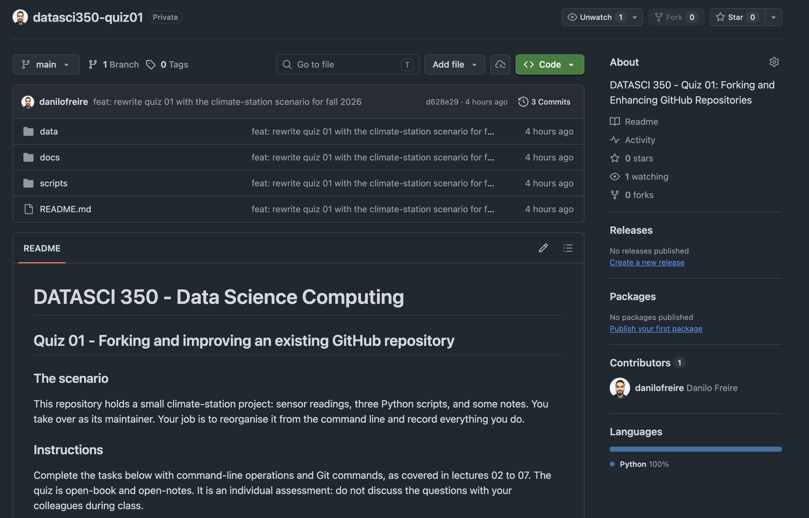{width="90%"}](#){data-modal-type="image" data-modal-url="figures/quiz-01.png"}
:::
:::
:::
:::

## Today's lecture

:::{style="margin-top: 30px; font-size: 25px;"}
:::{.columns}
:::{.column width="50%"}
Today we start a new module, and a new question: [can anyone check your work?]{.alert}

- The [reproducibility crisis]{.alert}: why so much published research fails when someone re-runs it
- The habits that prevent it: project structure, raw data, paths, seeds, environments
- [Literate programming]{.alert}: text, code, and results in one file, so they cannot drift apart
- [Quarto](https://quarto.org/), the tool we will use for it: installing it and writing your first document
- Next class: PDFs, citations, websites, and reports that write themselves
:::

:::{.column width="50%"}
:::{style="text-align: center;"}
[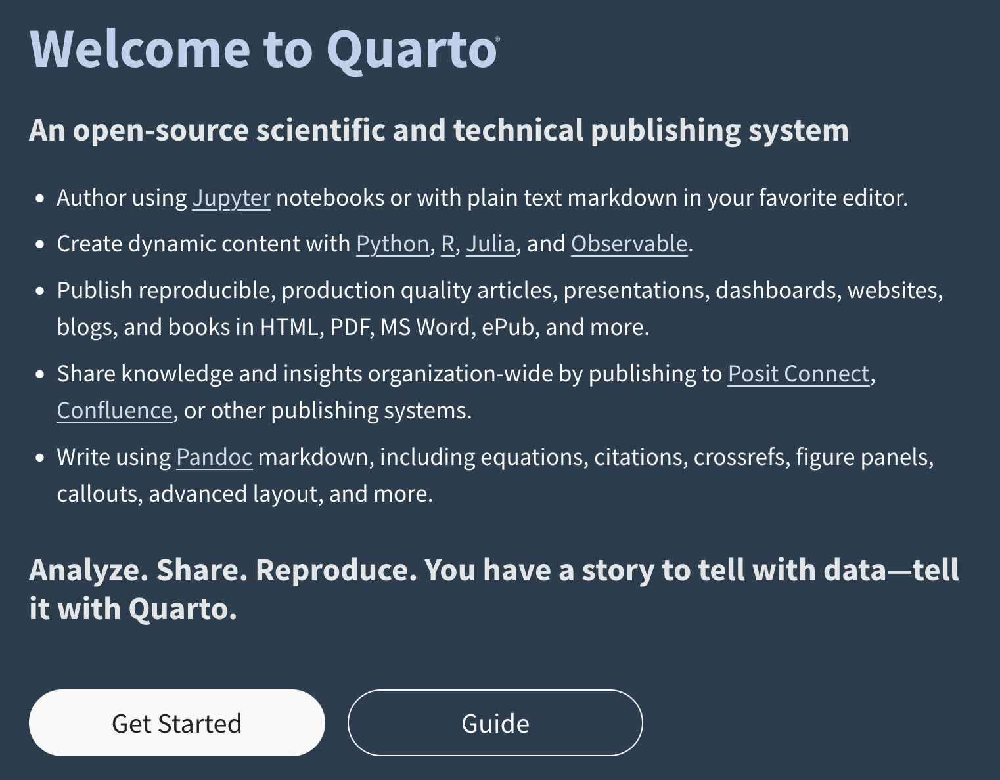{width="100%"}](#){data-modal-type="image" data-modal-url="figures/quarto.png"}
:::
:::
:::
:::

# Why is reproducible research so important? 🤔 {background-color="#1B3A6B"}

## The reproducibility crisis

:::{style="margin-top: 30px; font-size: 24px;"}
:::{.columns}
:::{.column width="50%"}
- [Reproducibility](https://en.wikipedia.org/wiki/Reproducibility): someone else, using your data and code, can get the same results you got
- Sounds like a low bar. Across many fields, [a large share of published findings fail it]{.alert}
- This is the [reproducibility crisis](https://en.wikipedia.org/wiki/Replication_crisis). Psychology, medicine, and economics were hit hardest, but no empirical field escaped
- The usual suspects: small samples, p-hacking, selective reporting, and code that is never shared
- Our focus in this course: [code and data]{.alert}. Most computational results fail for a mundane reason, as you will see in a minute
:::

:::{.column width="50%"}
:::{style="text-align: center; font-size: 18px;"}
[{width="50%"}](#){data-modal-type="image" data-modal-url="figures/power-posing.jpg"}

Amy Cuddy's "power posing" theory. 78 million TED Talk views, [but it could never be replicated](https://www.ted.com/talks/amy_cuddy_your_body_language_may_shape_who_you_are?language=en)
:::
:::
:::
:::

## How bad is it? Two famous papers

:::{style="margin-top: 30px; font-size: 20px;"}
:::{.columns}
:::{.column width="50%"}
**Medicine**

:::{style="text-align: center;"}
[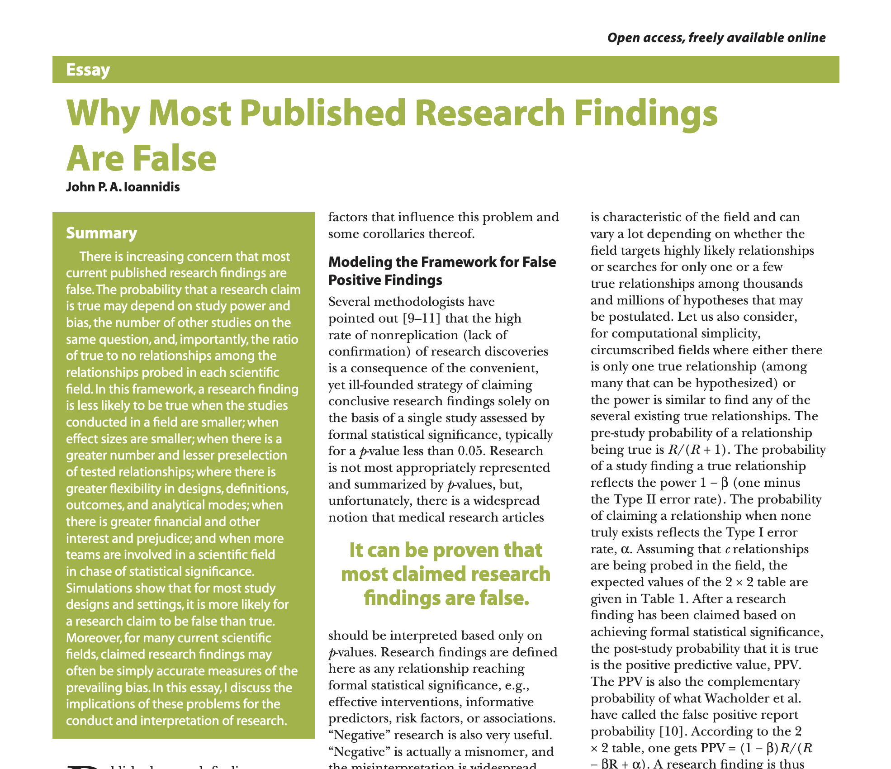{width="65%"}](#){data-modal-type="image" data-modal-url="figures/ioannidis.png"}
:::

- [Ioannidis (2005)](https://doi.org/10.1371/journal.pmed.0020124), one of the most cited papers in medicine
- Argument: for most study designs, a positive finding is [more likely to be false than true]{.alert}
- Why: small samples, flexible analyses, financial interests, many teams racing on the same question
:::

:::{.column width="50%"}
**Psychology**

:::{style="text-align: center;"}
[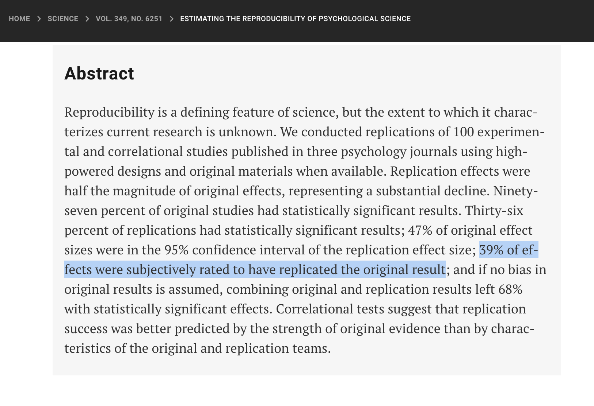{width="80%"}](#){data-modal-type="image" data-modal-url="figures/science.png"}
:::

- [Open Science Collaboration (2015)](https://www.science.org/doi/10.1126/science.aac4716): 270 researchers re-ran 100 published psychology experiments
- Originals: 97% significant. Replications: [36% significant]{.alert}, with effect sizes cut in half
- The fallout changed journal policy: pre-registration, open data, registered reports
:::
:::
:::

## We all write code, so we are fine, right?

:::{style="margin-top: 30px; font-size: 24px;"}
:::{.columns}
:::{.column width="45%"}
:::{style="text-align: center; font-size: 16px;"}
[{width="90%"}](#){data-modal-type="image" data-modal-url="figures/sdata.png"}

<https://www.nature.com/articles/s41597-022-01143-6>
:::
:::

:::{.column width="55%"}
:::{style="margin-top: 30px;"}
- [Trisovic et al. (2022)](https://www.nature.com/articles/s41597-022-01143-6) downloaded 2,109 `R` files from Harvard Dataverse and tried to run them
- [74% produced errors]{.alert} on the first attempt. After automated fixes, 56% still failed
- The reasons are not exotic: missing packages, hardcoded paths, functions that changed, data left out of the repository
- These are files that [authors chose to deposit]{.alert} alongside their publications
- If the code people publish on purpose does not run, imagine the code they do not publish 😅
:::
:::
:::
:::

## Five selfish reasons to work reproducibly

:::{style="margin-top: 30px; font-size: 24px;"}
So far this sounds like a duty to science. [Markowetz (2015)](https://doi.org/10.1186/s13059-015-0850-7) argues you should do it for yourself:

1. It helps you [avoid disaster]{.alert}: you catch your own errors before a reviewer, a retraction, or a job interview does
2. It makes [writing easier]{.alert}: when the data changes, every number and figure in the paper regenerates itself
3. It helps [reviewers see it your way]{.alert}: they can run your analysis instead of guessing what you did
4. It gives your work [continuity]{.alert}: a new collaborator, or future-you, can pick the project up tomorrow
5. It [builds your reputation]{.alert}: working, shared code is public proof that you know what you are doing

:::{.fragment style="margin-top: 15px;"}
Reason 2 alone will save you hours in this course. And keep reason 1 in mind: in a few slides you will meet two famous economists who needed it
:::
:::

# What does it take to be reproducible? {background-color="#1B3A6B"}

## The reproducibility ladder

:::{style="margin-top: 30px; font-size: 23px;"}
:::{.columns}
:::{.column width="52%"}
- People use four words for this, and they mean different things
- [Re-runnable]{.alert}: the code runs again on your machine, today
- [Reproducible]{.alert}: same code, same data, same results, on anyone's machine
- [Replicable]{.alert}: new data, collected independently, gives the same finding
- [Reusable]{.alert}: others can apply your work to their own questions
- Each step is harder than the one below it
- Replicability depends on data you may never get, so it sits mostly outside your control

:::{.fragment style="margin-top: 15px;"}
[Reproducibility is entirely within your control]{.alert}, and that is why this course grades you on it
:::
:::

:::{.column width="48%"}
:::{style="display: flex; align-items: stretch; gap: 14px; margin-top: 10px;"}
:::{style="display: flex; flex-direction: column; justify-content: space-between; align-items: center; font-size: 17px; color: #555; padding: 6px 0;"}
harder

▲

│

│

easier
:::

:::{style="flex: 1; display: flex; flex-direction: column; gap: 8px; text-align: center; font-size: 19px;"}
[reusable]{style="background:#1B3A6B; color:#fff; padding:9px; border-radius:6px; display:block;"}

[replicable]{style="background:#3A5B8C; color:#fff; padding:9px; border-radius:6px; display:block;"}

[reproducible]{style="background:#6E8AB0; color:#fff; padding:9px; border-radius:6px; display:block;"}

[re-runnable]{style="background:#C3CFDE; color:#1B3A6B; padding:9px; border-radius:6px; display:block;"}
:::
:::

:::{style="font-size: 18px; margin-top: 15px; text-align: center;"}
Most published work does not clear the first step
:::
:::
:::
:::

## The four ingredients

:::{style="margin-top: 30px; font-size: 25px;"}
A result is reproducible only if [all four of these travel together]{.alert}:

:::{.columns}
:::{.column width="50%"}
1. [Code]{.alert}: every step from raw data to final number, written down and runnable
2. [Data]{.alert}: the raw inputs, or a script that fetches them
:::

:::{.column width="50%"}
3. [Environment]{.alert}: the language and package versions the code needs
4. [Documentation]{.alert}: what the project does, and the order to run things in
:::
:::

:::{style="margin-top: 25px;"}
Each one fails on its own:

- Code without data: readers can admire your work, but they cannot check it
- Code and data without the environment: it runs today and breaks next year
- All three without documentation: nobody knows which script to run first
- [Miss one ingredient and the result is not reproducible]{.alert}
:::
:::

## Project structure

:::{style="margin-top: 30px; font-size: 21px;"}
:::{.columns}
:::{.column width="48%"}
- [One folder per project]{.alert}, and the same layout in every project, so you never wonder where a file goes
- We will use this one for the rest of the course, and [the final project requires it]{.alert}

```{verbatim}
my-project/
├── data/
│   ├── raw/          # never edited by hand
│   └── clean/        # built by scripts
├── scripts/          # the code, in run order
├── output/           # figures and tables
└── README.md         # what and how
```
:::

:::{.column width="52%"}
- The layout separates [inputs from outputs]{.alert}: `data/raw/` holds what you collected, and everything else can be rebuilt from it
- `data/raw/` is [read-only]{.alert}: download the files once and never touch them again
- Numbered scripts (`01-clean.py`, `02-analyse.py`) make the run order part of the name
- `data/clean/` and `output/` are disposable: delete them and the scripts bring them back
- Generated files often stay out of Git: put `data/clean/` and `output/` in `.gitignore` and commit only sources
- `README.md` explains the project to the next person, who is usually you in six months

:::{style="margin-top: 15px;"}
[If you deleted everything except `data/raw/` and `scripts/`, could you rebuild the project?]{.alert}
:::
:::
:::
:::

## Every project needs a README

:::{style="margin-top: 30px; font-size: 24px;"}
:::{.columns}
:::{.column width="45%"}
- You have been reading READMEs all term: GitHub shows one on [every repository page]{.alert}
- A good one answers three questions: [what is this]{.alert}, [how do I rebuild it]{.alert}, and [in what order]{.alert}
- List each data source and the date you downloaded it, so stale data is easy to spot
- List the commands that rebuild the project, in run order, ready to copy and paste
- Note the language and package versions (more on those in a minute)
- Ten lines are enough. Write it while the project is small, and keep it current as the project grows
:::

:::{.column width="55%"}
```{verbatim}
# Rainfall and crop yields in Brazil

Analysis of rainfall and maize yields, 2000-2024.

## Data
- data/raw/rainfall.csv: INMET, downloaded 12 Sep 2026
- data/raw/yields.csv: IBGE, downloaded 12 Sep 2026

## How to rebuild
Run the scripts in order:

    python scripts/01-clean.py
    python scripts/02-analyse.py
    quarto render report.qmd

## Environment
Python 3.13, pandas 3.0, matplotlib 3.10
```
:::
:::
:::

## The most famous spreadsheet error in economics

:::{style="margin-top: 30px; font-size: 23px;"}
:::{.columns}
:::{.column width="55%"}
- [Reinhart and Rogoff (2010)](https://www.aeaweb.org/articles?id=10.1257/aer.100.2.573), "Growth in a Time of Debt": above [90% debt-to-GDP]{.alert}, growth turns negative
- After 2008, it became the standard citation for [austerity]{.alert}
- In 2013, a graduate student, Thomas Herndon, could not reproduce it, and asked for the spreadsheet
- One formula [averaged rows 30 to 44, not 30 to 49]{.alert}, dropping five countries
- Corrected, growth above the threshold was [+2.2%, not -0.1%](https://doi.org/10.1093/cje/bet075)
- Three years of policy debate passed before anyone noticed, because the analysis sat in a [private spreadsheet]{.alert}
- A public script and dataset would have caught it in an afternoon!
:::

:::{.column width="45%"}
:::{style="text-align: center; margin-top: 20px;"}
[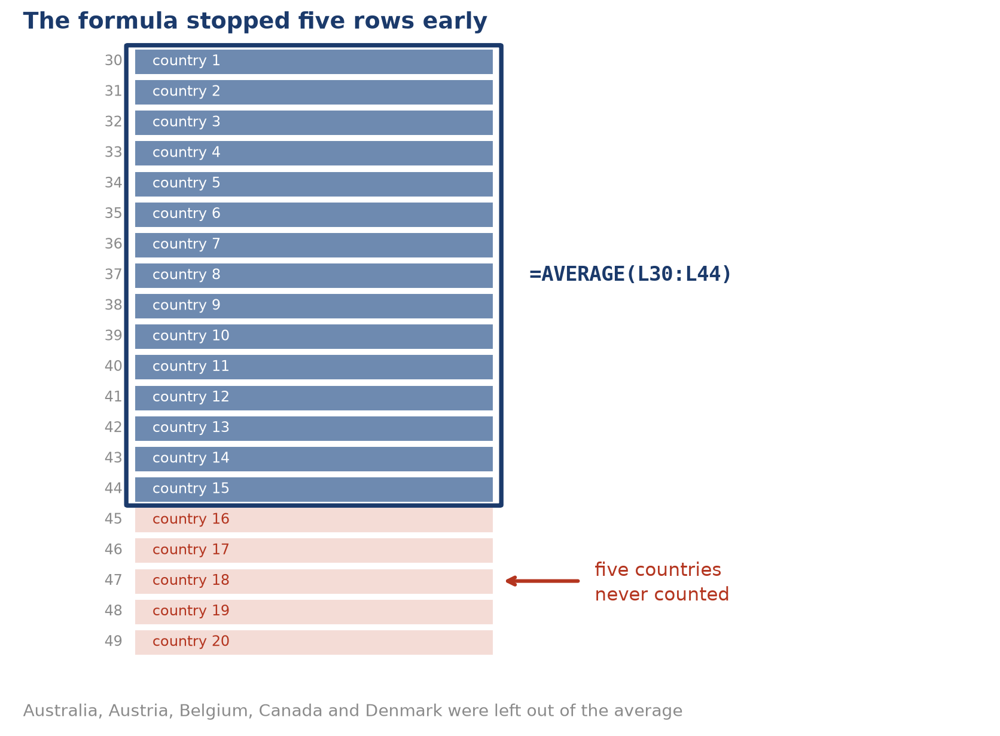{width="100%"}](#){data-modal-type="image" data-modal-url="figures/reinhart-rogoff-error.png"}
:::
:::
:::
:::

## The absolute path problem

:::{style="margin-top: 30px; font-size: 24px;"}
:::{.columns}
:::{.column width="52%"}
The single most common reason code fails on another machine:

:::{style="font-size: 18px;"}
```{.python filename="analysis.py"}
import pandas as pd

df = pd.read_csv("/Users/ana/Desktop/project/data/raw/rainfall.csv")
```
:::

Anyone else who runs it gets:

:::{style="font-size: 22px;"}
```{verbatim}
FileNotFoundError: [Errno 2] No such file
or directory:
'/Users/ana/Desktop/project/data/raw/rainfall.csv'
```
:::
:::

:::{.column width="48%"}
- An [absolute path]{.alert} starts at the root (`/`) and names one exact spot on one exact machine
- Only Ana has a `/Users/ana`. The script fails everywhere else, however good the rest of the code is
- A [relative path]{.alert} starts from the [working directory]{.alert} instead, the same idea as `pwd` in the shell
- Every running program has one, inherited from wherever you launched it
- Which is why "it works when I run it" proves very little

:::{.fragment style="margin-top: 15px;"}
Hardcoded paths were among the top causes of failure in the Trisovic study. [The fix costs nothing]{.alert}
:::
:::
:::
:::

## Relative paths fix it

:::{style="margin-top: 30px; font-size: 21px;"}
:::{.columns}
:::{.column width="52%"}
Write paths [relative to the project folder]{.alert}, and the project works anywhere:

```{.python filename="analysis.py"}
import pandas as pd

df = pd.read_csv("data/raw/rainfall.csv")
```

Use `pathlib` when you need to build paths safely across operating systems:

```{.python filename="analysis.py"}
from pathlib import Path

raw = Path("data") / "raw" / "rainfall.csv"
df = pd.read_csv(raw)
```
:::

:::{.column width="48%"}
- `pathlib` handles the separator for you, so the same line works on macOS, Linux, and Windows
- Quarto renders each document relative to [the folder holding the `.qmd` file]{.alert}, which is usually what you want
- Avoid `os.chdir()`. It changes state halfway through a script and makes the rest of the file hard to follow

:::{.fragment style="margin-top: 20px;"}
[If your code contains your username, it is not reproducible]{.alert}
:::
:::
:::
:::

## Randomness needs a seed

:::{style="margin-top: 30px; font-size: 22px;"}
:::{.columns}
:::{.column width="50%"}
Run this twice, get two answers, and the numbers in your report change on every render:

```{python}
#| echo: true
import numpy as np

print(np.random.normal(size=3).round(3))
print(np.random.normal(size=3).round(3))
```

Set a seed first and the sequence is fixed, so anyone running your code gets exactly what you got:

```{python}
#| echo: true
np.random.seed(350)
print(np.random.normal(size=3).round(3))

np.random.seed(350)
print(np.random.normal(size=3).round(3))
```
:::

:::{.column width="50%"}
- Computers cannot produce true randomness
- `np.random` is a [pseudorandom generator]{.alert}: a formula that walks through a fixed sequence of numbers
- The [seed]{.alert} picks where that walk starts, which fixes the whole sequence in advance
- Newer code makes the generator an explicit object:

```{.python}
rng = np.random.default_rng(350)
rng.normal(size=3)
```

- Every library keeps its own generator. Python's `random` and scikit-learn's `random_state=` need seeding separately
- Randomness hides in sampling, train-test splits, and the starting weights of most models
- [If a number came from a random draw, seed it]{.alert}
:::
:::
:::

## Record your environment

:::{style="margin-top: 30px; font-size: 23px;"}
:::{.columns}
:::{.column width="50%"}
- Packages change. A function gains an argument, a default flips, a method is removed
- Code that worked in 2024 can give different numbers in 2026, or refuse to run at all. This is called [version drift]{.alert}
- The fix is to record what you used, so the next person can match it

At minimum, note the versions in your README:

```{python}
#| echo: true
import sys, numpy, pandas

print("python:", sys.version.split()[0])
print("numpy :", numpy.__version__)
print("pandas:", pandas.__version__)
```
:::

:::{.column width="50%"}
You can also ask `pip` for the full list:

```{.bash filename="Terminal"}
pip list
```

```{verbatim}
Package         Version
--------------- -------
jupyter_client  8.6.3
matplotlib      3.10.8
numpy           2.4.3
pandas          3.0.2
```

:::{.fragment style="margin-top: 20px;"}
A version list helps the next person diagnose a failure. [Module 08 adds the tools that prevent one]{.alert}: virtual environments, `uv`, and containers. Until then, write the versions down
:::
:::
:::
:::

# Literate programming {background-color="#1B3A6B"}

## Literate programming

:::{style="margin-top: 30px; font-size: 24px;"}
:::{.columns}
:::{.column width="50%"}
- So far, habits. Now a tool that enforces the biggest one: [text, code, and results in one file]{.alert}
- [Donald Knuth](https://en.wikipedia.org/wiki/Donald_Knuth) coined [literate programming]{.alert} in 1984: write for humans first, machines second
- Two operations pull the file apart:
  - [Weaving]{.alert}: the readable document (HTML, PDF)
  - [Tangling]{.alert}: the executable code
- Explaining what you are doing catches bad logic before it reaches your results
- The numbers come from the code, so [they cannot go stale]{.alert}
:::

:::{.column width="50%"}
:::{style="text-align: center;"}
[{width="60%"}](#){data-modal-type="image" data-modal-url="figures/book.jpg"}
:::
:::
:::
:::

## From LaTeX to Quarto

:::{style="margin-top: 30px; font-size: 21px;"}
:::{.columns}
:::{.column width="55%"}
- [LaTeX](https://www.latex-project.org/) came first. Beautiful output, verbose syntax, steep learning curve (I know, I've been there 😅)
- [Markdown](https://en.wikipedia.org/wiki/Markdown) kept the ideas and dropped the ceremony: `**bold**`, `- list`, `[link](url)`
- [R Markdown](https://rmarkdown.rstudio.com/) added executable chunks for R, and [Jupyter](https://jupyter.org/) did the same for Python
- Each is fine alone. [Mixing languages or output formats]{.alert} is where they struggle
- [Quarto](https://quarto.org/) (2022, by Posit) rebuilt R Markdown to be [language-agnostic]{.alert}: Python, R, Julia, Observable JS
- One `.qmd` renders to HTML, PDF, Word, slides, websites, books, and dashboards
- [Pandoc](https://pandoc.org/) does the final conversion underneath
- These slides, the course website, and every course PDF are Quarto. [Learn it once, use it everywhere]{.alert}
:::

:::{.column width="45%"}
:::{style="text-align: center;"}
[{width="100%"}](#){data-modal-type="image" data-modal-url="figures/latex.png"}
:::
:::
:::
:::

## What Quarto can produce

:::{style="margin-top: 30px; font-size: 24px;"}
:::{.columns}
:::{.column width="60%"}
::: {layout-ncol="2"}
[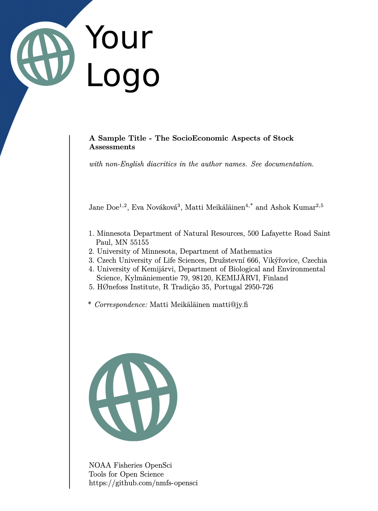{width="55%"}](#){data-modal-type="image" data-modal-url="figures/report.png"}

[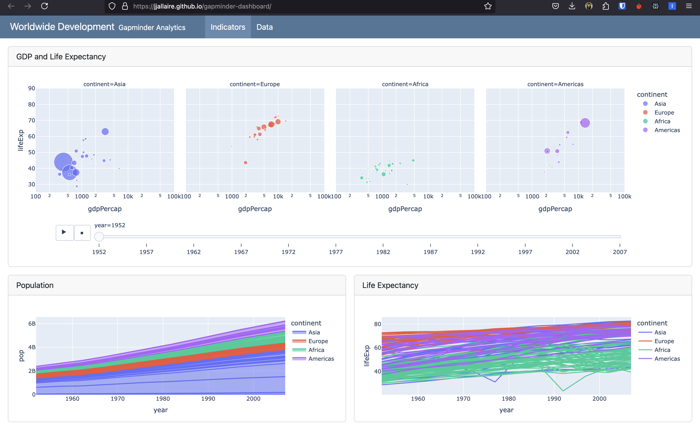{width="100%"}](#){data-modal-type="image" data-modal-url="figures/dashboard.png"}

[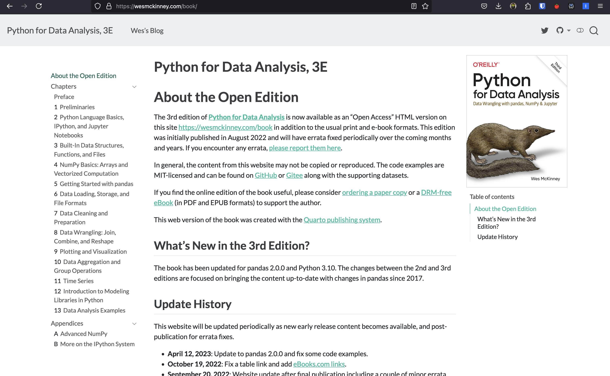{width="100%"}](#){data-modal-type="image" data-modal-url="figures/book-2.png"}

[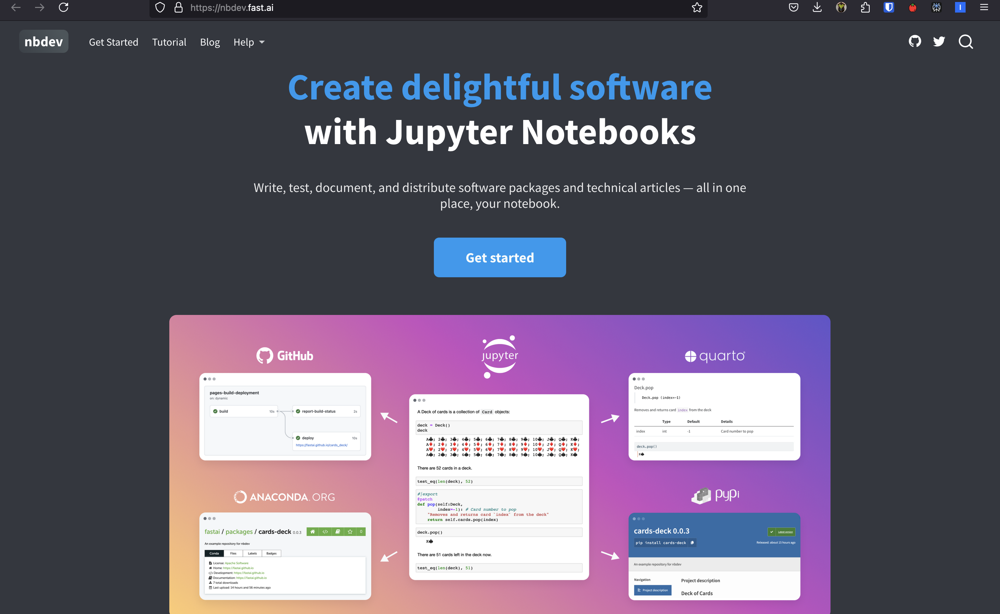{width="100%"}](#){data-modal-type="image" data-modal-url="figures/website.png"}
:::
:::

:::{.column width="40%"}
- Clockwise from top left: a company report, an [interactive dashboard](https://jjallaire.github.io/gapminder-dashboard/), a website, and a book
- All four are plain text files, so all four [live happily in Git]{.alert}
- Same source, same commands, different `format:` line
- Click any image to zoom in
:::
:::
:::

## How does Quarto work?

:::{style="margin-top: 30px; font-size: 24px;"}
:::{.columns}
:::{.column width="50%"}
```{mermaid}
%%| fig-width: 10
%%| fig-height: 9
%%{
  init: {
    "theme": "dark",
    "themeCSS": ".label foreignObject, .cluster-label foreignObject { font-size: 90%; overflow: visible; }"
  }
}%%
flowchart LR
  A1[qmd] --> C{"knitr<br>(R)"}
  A1[qmd] --> B{"Jupyter<br>(Python)"}
  A2[ipynb] --> B{"Jupyter<br>(Python)"}
  B --> D[md]
  C --> D[md]
  D --> E{Pandoc}
  E --> F[pdf]
  E --> G[docx]
  E --> H[html]
  E --> I[...]

  subgraph engine [Engine]
  B
  C
  end
```
:::

:::{.column width="50%"}
- Quarto files use the `.qmd` extension, but you can also feed Jupyter notebooks (`.ipynb`) straight into Quarto with [some YAML configuration](https://quarto.org/docs/tools/jupyter-lab.html)
- The pipeline: `.qmd` → engine (Jupyter or knitr) → `.md` → [Pandoc](https://pandoc.org/) → final output
- Pandoc handles the last step: it reads Markdown and writes HTML, PDF, Word, and [dozens of other formats](https://pandoc.org/MANUAL.html)
- You rarely interact with Pandoc directly. Quarto calls it for you, passing the options from your YAML header
:::
:::
:::

# Getting Quarto running 🛠️ {background-color="#1B3A6B"}

## Installing Quarto

:::{style="margin-top: 30px; font-size: 23px;"}
:::{.columns}
:::{.column width="55%"}
:::{style="text-align: center;"}
[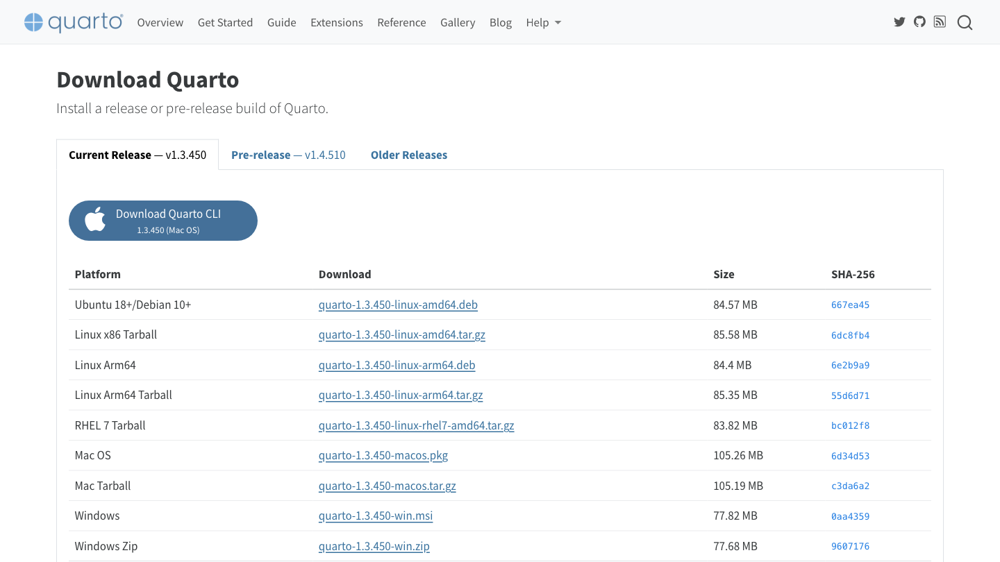{width="90%"}](#){data-modal-type="image" data-modal-url="figures/quarto-download.png"}

<https://quarto.org/docs/download/>
:::
:::

:::{.column width="45%"}
- Download the installer for your system from the page on the left, or use a package manager
- On macOS, [Homebrew](https://brew.sh/) does it in one line:

```{.bash filename="Terminal"}
brew install --cask quarto
```

- On Windows, install Quarto [inside WSL](https://quarto.org/docs/download/) so it lives next to your shell and Git
- To render PDFs you also need LaTeX. Install the lightweight [TinyTeX](https://yihui.org/tinytex/) and you are done:

```{.bash filename="Terminal"}
quarto install tinytex
```
:::
:::
:::

## Did it work? Ask Quarto itself

:::{style="margin-top: 30px; font-size: 22px;"}
```{.bash filename="Terminal"}
quarto check
```

```{verbatim}
Quarto 1.9.38
[✓] Checking environment information...
[✓] Checking versions of quarto binary dependencies...
      Pandoc version 3.8.3: OK
      Dart Sass version 1.87.0: OK
[✓] Checking Quarto installation......OK
      Version: 1.9.38
[✓] Checking tools....................OK
      TinyTeX: v2026.04
[✓] Checking LaTeX....................OK
[✓] Checking basic markdown render....OK
[✓] Checking Python 3 installation....OK
      Version: 3.13.13
      Jupyter: 5.9.1
```

Run this first whenever something stops working. Your version numbers will differ from mine, and that is fine
:::

## Write in whatever editor you like

:::{style="margin-top: 30px; font-size: 24px;"}
:::{.columns}
:::{.column width="50%"}
- A `.qmd` file is [plain text]{.alert}. VS Code, RStudio, Jupyter Lab, Neovim, or Notepad: they all work
- We will use [VS Code with the Quarto extension](https://marketplace.visualstudio.com/items?itemName=quarto.quarto): syntax highlighting, completion, a render button, and a live preview
- Install it from the [Extensions marketplace]{.alert}, like the extensions you already have
- It also offers a [visual editor](https://quarto.org/docs/visual-editor/vscode/), which renders the Markdown as you type. Try both and keep the one you like
:::

:::{.column width="50%"}
:::{style="text-align: center; margin-top: -20px;"}
[{width="100%"}](#){data-modal-type="image" data-modal-url="figures/quarto-vscode.png"}

:::{style="font-size: 16px;"}
[Quarto extension for VS Code](https://marketplace.visualstudio.com/items?itemName=quarto.quarto)
:::
:::
:::
:::
:::

## Two commands you will use every day

:::{style="margin-top: 30px; font-size: 24px;"}
Of course, there is a CLI for that! Quarto has several commands (`quarto --help` lists them), but two do almost all the work:

```{.bash filename="Terminal"}
## Render a file to its default format
quarto render report.qmd

## Render to a specific format
quarto render report.qmd --to pdf

## Render, open in the browser, and re-render on every save
quarto preview report.qmd
```

:::{.fragment style="margin-top: 20px;"}
- [`render`]{.alert} builds the document once. Use it when you are done
- [`preview`]{.alert} keeps a live version open while you write. Use it the rest of the time
- The output lands next to the source file: `report.qmd` becomes `report.html`
:::
:::

# Your first Quarto document {background-color="#1B3A6B"}

## Anatomy of a Quarto document

:::{style="margin-top: 30px; font-size: 24px;"}
- A Quarto document contains three types of content: a [YAML header]{.alert}, [code chunks]{.alert}, and [Markdown text]{.alert}
- That is the whole format. Let's look at each part in turn (Markdown in depth comes next lecture)

::: {layout-ncol="3"}
[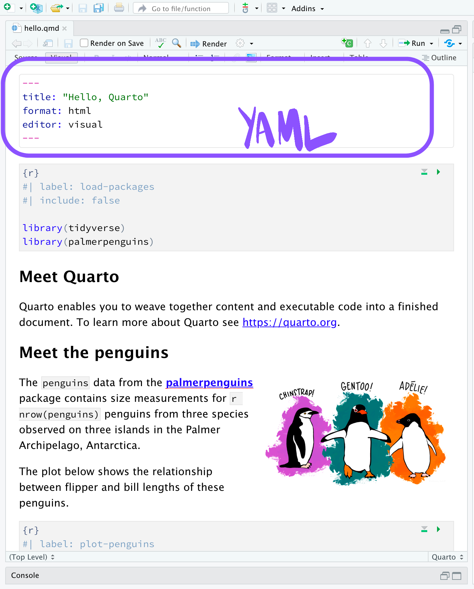{width="100%"}](#){data-modal-type="image" data-modal-url="figures/yaml.png"}

[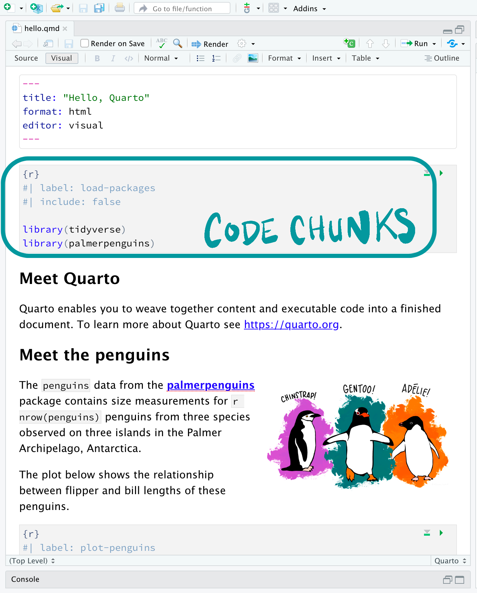{width="100%"}](#){data-modal-type="image" data-modal-url="figures/code-chunks.png"}

[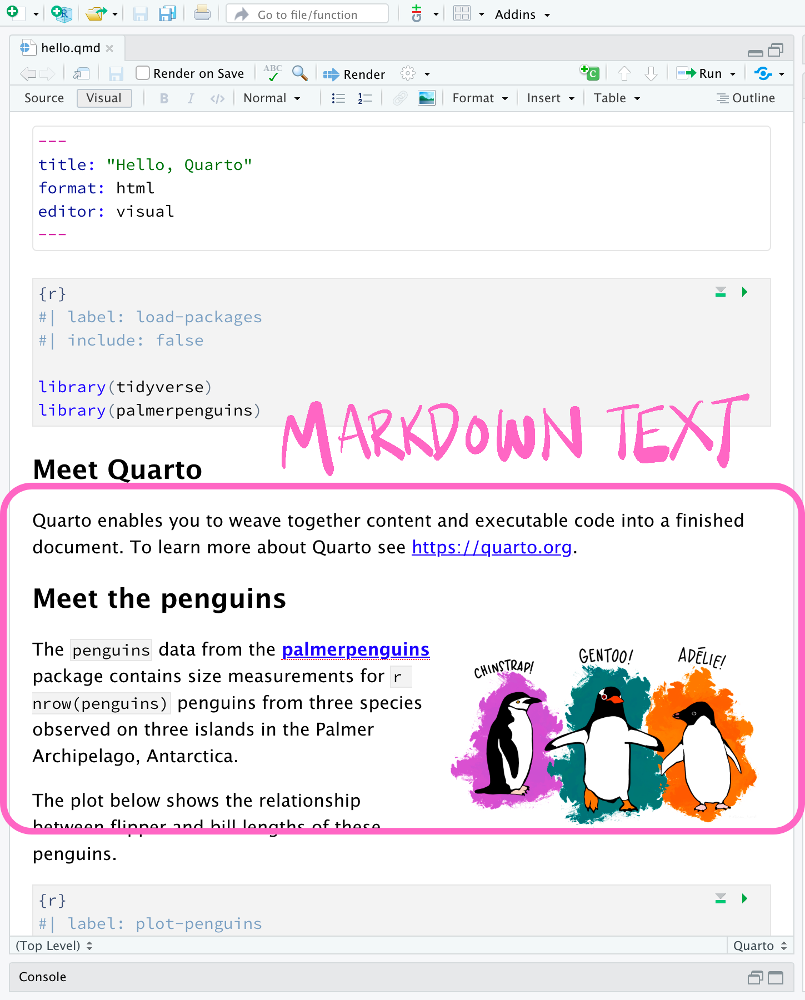{width="100%"}](#){data-modal-type="image" data-modal-url="figures/markdown-text.png"}
:::
:::

## The YAML header

:::{style="margin-top: 30px; font-size: 24px;"}
:::{.columns}
:::{.column width="50%"}
``` yaml
---
title: "Rainfall report"
author: "Your name"
date: 2026-10-06
format:
  html:
    toc: true
    code-fold: true
execute:
  warning: false
jupyter: python3
---
```
:::

:::{.column width="50%"}
- YAML stands for "YAML Ain't Markup Language", a recursive joke. It describes [data]{.alert}, not documents
- Sits at the very top, between two lines of three dashes (`---`)
- `key: value` pairs, where [indentation creates nesting]{.alert}. Use spaces: tabs are illegal in YAML
- `format: html` is the short form. Indent underneath it to pass options, as on the left
- `execute:` sets defaults for [every chunk]{.alert} in the document
- Quote any value containing a colon: `title: "Quarto: a first look"`
- The same syntax runs `_quarto.yml`, GitHub Actions, and Docker Compose. [Learn it once]{.alert}
:::
:::
:::

## Code chunks

:::{style="margin-top: 30px; font-size: 24px;"}
:::{.columns}
:::{.column width="50%"}
```` markdown
```{{python}}
#| label: fig-rainfall
#| echo: false
#| warning: false

import matplotlib.pyplot as plt

plt.bar(rain["month"], rain["mm"])
plt.ylabel("Rainfall (mm)")
plt.show()
```
````
:::

:::{.column width="50%"}
- Three backticks and `{python}` open a chunk; three backticks close it
- When you render, the chunk [runs]{.alert}, and its output lands in the document
- Lines starting with `#|` are [chunk options]{.alert}, in YAML style:
  - `echo: false` hides the code, keeps the output
  - `eval: false` shows the code, skips running it
  - `warning: false` hides warnings
  - `label` names the chunk, so you can cross-reference figures
:::
:::
:::

## The chunk options you will use most

:::{style="margin-top: 30px; font-size: 24px;"}
:::{.columns}
:::{.column width="55%"}
:::{style="text-align: center;"}
| Option | Effect |
|:-------|:-------|
| `echo: false` | hide the code, keep the output |
| `eval: false` | show the code, do not run it |
| `include: false` | run the code, show nothing |
| `warning: false` | hide warnings |
| `label: fig-rain` | name the chunk for cross-references |
| `fig-cap: "..."` | put a caption under the figure |
| `layout-ncol: 2` | arrange the outputs in columns |
:::
:::

:::{.column width="45%"}
- `#|` options apply to [one chunk]{.alert}
- Defaults for the [whole document]{.alert} go in the YAML header instead:

```yaml
execute:
  echo: false
  warning: false
```

- Chunk options override the document defaults, so you can hide all code and still show one chunk
- Cross-references need a [prefixed label]{.alert}: `fig-` for figures, `tbl-` for tables, and also `eq-`, `sec-`, `lst-`
- Then `@fig-rain` in your text becomes "Figure 1", numbered for you
- The full list is in the [Quarto documentation](https://quarto.org/docs/computations/execution-options.html)
:::
:::
:::

## Chunk options in action

:::{style="margin-top: 30px; font-size: 24px;"}
:::{.columns}
:::{.column width="46%"}
`layout-ncol: 2` puts two plots side by side, and `echo: false` keeps the code out of the reader's way:

```` markdown
```{{python}}
#| echo: false
#| layout-ncol: 2

plt.bar(rain["month"], rain["mm"])
plt.show()

plt.plot(rain["month"], rain["mm"])
plt.show()
```
````
:::

:::{.column width="54%"}
What the reader sees:

```{python}
#| echo: false
#| layout-ncol: 2

import pandas as pd
import matplotlib.pyplot as plt

rain = pd.DataFrame({
    "month": ["Jan", "Feb", "Mar", "Apr"],
    "mm": [241, 215, 180, 96]
})

fig, ax = plt.subplots(figsize=(4, 3))
ax.bar(rain["month"], rain["mm"], color="#1B3A6B")
ax.set_ylabel("Rainfall (mm)")
plt.tight_layout()
plt.show()

fig, ax = plt.subplots(figsize=(4, 3))
ax.plot(rain["month"], rain["mm"], color="#1B3A6B", marker="o")
ax.set_ylabel("Rainfall (mm)")
plt.tight_layout()
plt.show()
```

Both figures came straight from the code at render time. [Change the data and they update themselves]{.alert}
:::
:::
:::

## Engines: what actually runs your code

:::{style="margin-top: 30px; font-size: 23px;"}
:::{.columns}
:::{.column width="55%"}
- Quarto runs no code itself. It hands each chunk to an [engine]{.alert}
- [Jupyter]{.alert} runs Python, and any language with a Jupyter kernel. [knitr]{.alert} runs R
- [This course uses Jupyter]{.alert}. These slides render with `jupyter: python3`
- Every render starts [one fresh session]{.alert} and works through the chunks top to bottom
- Chunks share state, like notebook cells: a variable from chunk one still exists in chunk ten
- Fresh session, top to bottom. That is a [restart-and-run-all]{.alert} test, every time
- So a document that renders is one whose analysis just ran from scratch. [Quarto checks your reproducibility for you]{.alert}
:::

:::{.column width="45%"}
```yaml
---
title: "My report"
format: html
jupyter: python3
---
```

:::{style="margin-top: 20px;"}
Quarto can usually detect the engine from your chunks. Declaring it anyway tells the next reader what they need installed.

If you ever switch to R, change this one line and the rest of the document stays as it is
:::
:::
:::
:::

## A minimal Python document

:::{style="margin-top: 30px; font-size: 24px;"}
:::{.columns}
:::{.column width="50%"}
```{verbatim}
---
title: "Palmer Penguins Demo"
format:
  html:
    code-fold: true
jupyter: python3
---

## Meet Quarto

Quarto enables you to weave together content and
executable code into a finished document. To learn
more about Quarto see <https://quarto.org>.

```{{python}}
#| echo: false
#| message: false

import seaborn as sns
from palmerpenguins import load_penguins
sns.set_style('whitegrid')

penguins = load_penguins()

g = sns.lmplot(x="flipper_length_mm",
               y="body_mass_g",
               hue="species",
               height=7,
               data=penguins,
               palette=['#FF8C00','#159090','#A034F0'])
g.set_xlabels('Flipper Length')
g.set_ylabels('Body Mass')
```
:::

:::{.column width="45%"}
- Thirty lines, and everything from today's lecture is in them
- The [YAML header]{.alert} names the document and picks the format and engine
- `code-fold: true` tucks the code behind a toggle, so readers who want it can still find it
- The prose is plain [Markdown]{.alert}, with a `##` heading
- One [chunk]{.alert} loads the penguin data and draws a figure
- The next slide shows what renders
:::
:::
:::

## The rendered page

:::{style="margin-top: 30px; font-size: 24px;"}
:::{.columns}
:::{.column width="55%"}
:::{style="text-align: center;"}
[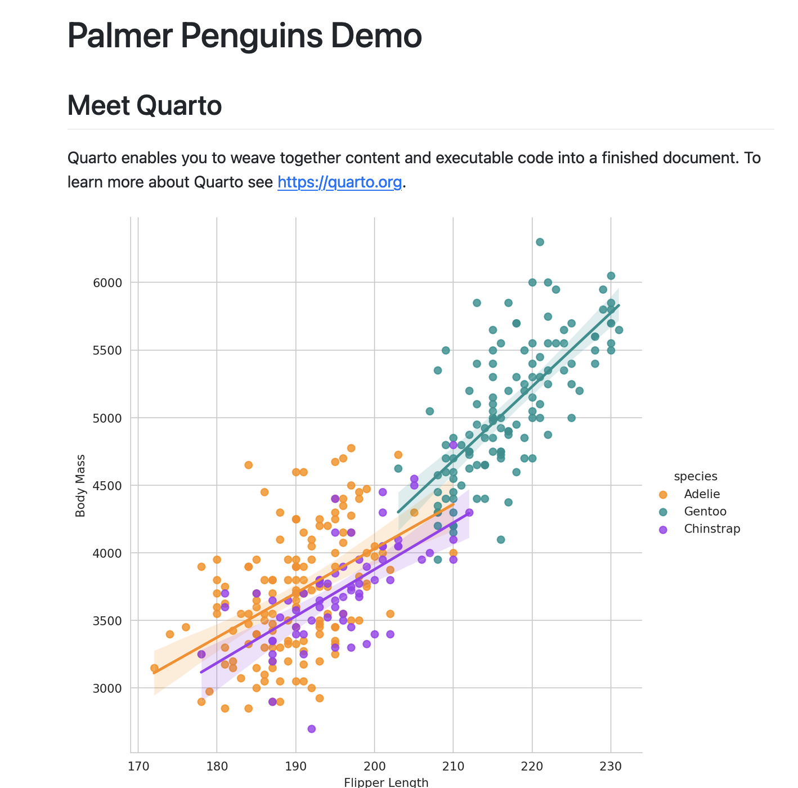{width="85%"}](#){data-modal-type="image" data-modal-url="figures/jupyter-plot.png"}
:::
:::

:::{.column width="45%"}
:::{style="margin-top: 20px;"}
- The title comes from the YAML, the heading and prose from the Markdown, and the figure from the chunk
- The Code toggle at the top is `code-fold: true` at work
- Change the data and render again: [the figure and the numbers follow]{.alert}
- This page cannot show a figure its own code did not produce. That is literate programming doing its job
:::
:::
:::
:::

## Try it yourself! {#sec-exercise-01}

:::{style="margin-top: 30px; font-size: 21px;"}
:::{.columns}
:::{.column width="52%"}
Create a Quarto document from scratch and render it to HTML.

1. Make a new file called `weather.qmd`
2. Start it with this YAML header:

```yaml
---
title: "Rainfall report"
author: "Your name"
format: html
jupyter: python3
---
```

3. Add a `##` heading and a short paragraph
4. Add a chunk that builds the table below and prints it
5. Add a [second]{.alert} chunk that draws a bar chart, with its code hidden
6. Render the file and open the result
:::

:::{.column width="48%"}
Use this data so everyone gets the same answer:

```{.python}
import pandas as pd

rain = pd.DataFrame({
    "month": ["Jan", "Feb", "Mar", "Apr"],
    "mm": [241, 215, 180, 96]
})
```

:::{style="margin-top: 15px;"}
Stuck? The option that hides code is on the chunk options slide, and `quarto check` diagnoses a broken installation
:::

[[Answer: Appendix 01]{.button}](#sec-appendix-01)
:::
:::
:::

## Summary

:::{style="margin-top: 30px; font-size: 26px;"}
- The reproducibility crisis is real, and most computational results fail for a mundane reason: [the code does not run]{.alert}
- The ladder: re-runnable → reproducible → replicable → reusable. This course gets you to the second step
- Four ingredients travel together: [code, data, environment, documentation]{.alert}
- The habits: raw data left untouched, cleaning in code, relative paths only, seeds set, versions written down, a README that says how to rebuild
- [Literate programming]{.alert} keeps text, code, and results in one file, so they cannot drift apart
- [Quarto]{.alert} is our tool for it: one plain-text `.qmd` file, one `render` command, many output formats
:::

## Next class

:::{style="margin-top: 30px; font-size: 25px;"}
:::{.columns}
:::{.column width="50%"}
- Quarto [in practice]{.alert}: Markdown in depth, PDFs, and citations that format themselves
- `freeze`: rendering documents [without re-running the world]{.alert}
- Slides (like these) and [websites]{.alert}, published straight from GitHub
- [Parameterised reports]{.alert}: one file that writes a report for every country in your dataset
- Bring a working Quarto installation: today's exercise is the check 🤓
:::

:::{.column width="50%"}
:::{style="text-align: center; margin-top: 20px;"}
[{width="100%"}](#){data-modal-type="image" data-modal-url="figures/website.png"}
:::
:::
:::
:::

## Additional materials

:::{style="margin-top: 30px; font-size: 24px;"}
- [Quarto documentation](https://quarto.org/docs/)
- [Quarto gallery](https://quarto.org/docs/gallery/), full example documents with their source code
- [Awesome Quarto](https://github.com/mcanouil/awesome-quarto#readme), a curated list of examples and extensions
- [Introduction to Quarto (video)](https://youtu.be/_f3latmOhew?si=18Gdq9HVK-j_G0eM)
- [Quarto for academics (video)](https://youtu.be/EbAAmrB0luA?si=7sgRwILesUKHPbiG)
- [Beautiful reports and presentations with Quarto (video - worth watching)](https://www.youtube.com/live/hbf7Ai3jnxY?si=3LDtD38oFj8NCu21)
- [The Turing Way](https://book.the-turing-way.org/), a community handbook on reproducible data science
- [Sandve et al. (2013), "Ten Simple Rules for Reproducible Computational Research"](https://doi.org/10.1371/journal.pcbi.1003285), still true a decade later
- [Markowetz (2015), "Five selfish reasons to work reproducibly"](https://doi.org/10.1186/s13059-015-0850-7)
- ["The student who caught out the profs" (BBC)](https://www.bbc.com/news/magazine-22223190), the Reinhart and Rogoff story
:::

# And that's all for today! 🥳 {background-color="#1B3A6B"}

# Thank you very much and see you soon! 😊 🙏🏼 {background-color="#1B3A6B"}

## Appendix 01: Solution to the exercise {#sec-appendix-01}

:::{style="margin-top: 30px; font-size: 18px;"}
:::{.columns}
:::{.column width="55%"}
The complete `weather.qmd`:

````{verbatim}
---
title: "Rainfall report"
author: "Your name"
format: html
jupyter: python3
---

## Rainfall in the first four months

Rainfall fell steadily from January to April, with April
receiving less than half of January's total.

```{{python}}
import pandas as pd

rain = pd.DataFrame({
    "month": ["Jan", "Feb", "Mar", "Apr"],
    "mm": [241, 215, 180, 96]
})

rain
```

```{{python}}
#| echo: false

import matplotlib.pyplot as plt

plt.bar(rain["month"], rain["mm"], color="#1B3A6B")
plt.ylabel("Rainfall (mm)")
plt.show()
```
````

Then render it:

```{.bash filename="Terminal"}
quarto render weather.qmd
```
:::

:::{.column width="45%"}
`#| echo: false` is the option that hides the code but keeps the output, which is what question 5 asked for.

The chart your second chunk produces:

```{python}
#| echo: false
#| fig-align: center

fig, ax = plt.subplots(figsize=(5, 3.2))
ax.bar(rain["month"], rain["mm"], color="#1B3A6B")
ax.set_ylabel("Rainfall (mm)")
ax.spines[["top", "right"]].set_visible(False)
plt.tight_layout()
plt.show()
```

[[Back to the main text]{.button}](#sec-exercise-01)
:::
:::
:::
