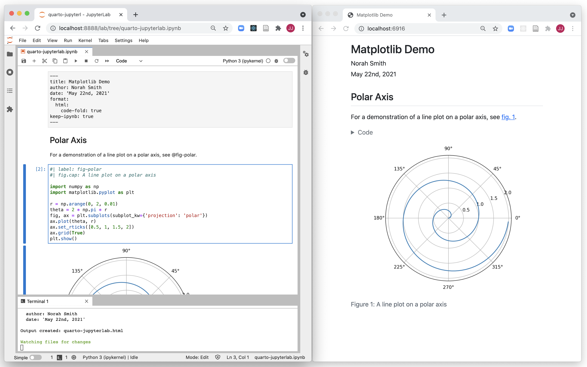
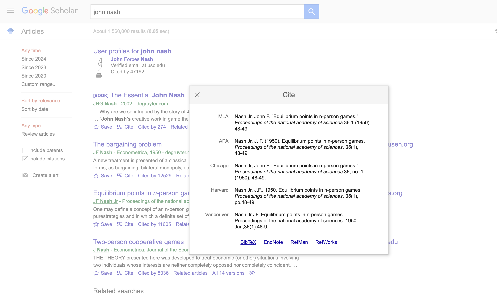
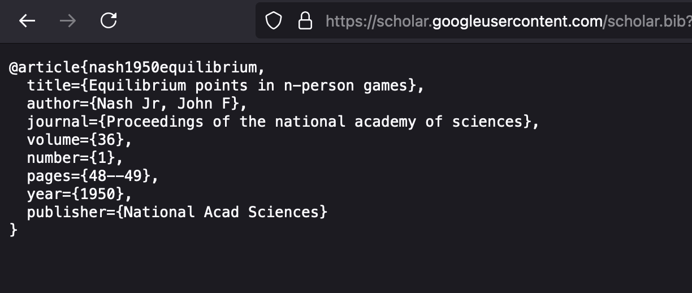
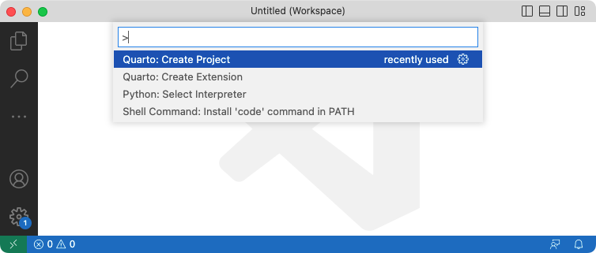
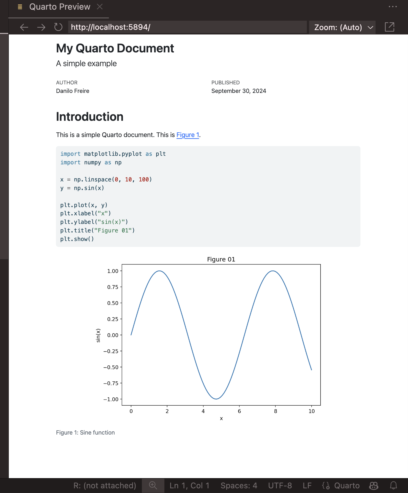

# Hello, everyone! 😊 {background-color="#1B3A6B"}

## Recap of our last lecture
### In our last class, we covered

:::{style="margin-top: 30px; font-size: 22px;"}
:::{.columns}
:::{.column width="50%"}
- The [reproducibility crisis]{.alert}, and the mundane reason most results fail: the code does not run
- The habits that fix it: project structure, raw data left alone, relative paths, seeds, recorded versions
- [Quarto]{.alert} and its three parts: [YAML header]{.alert}, [Markdown]{.alert}, and [code chunks]{.alert}
- `quarto render` builds a document; `quarto preview` keeps a live one open
- Every render is a [restart-and-run-all]{.alert} test of your analysis
- You wrote and rendered your first document. Today [we put Quarto to work]{.alert}
:::

:::{.column width="50%"}
````markdown
---
title: My Quarto Document
subtitle: A simple example
author: Danilo Freire
date: 2026-09-18
format:
  html:
    theme: cosmo
    embed-resources: true
---

# Introduction

This is a simple Quarto document.

```{{python}}
print("Hello, world!")
```

## Subsection

[Link](https://www.emory.edu).
````
:::
:::
:::

## Today's lecture

:::{style="margin-top: 30px; font-size: 24px;"}
:::{.columns}
:::{.column width="50%"}
Last class you rendered one HTML page. Today that same skill fans out:

- [Markdown]{.alert} beyond the basics: tables, footnotes, maths
- [PDFs]{.alert} and [citations]{.alert} that format themselves from a `.bib` file
- `freeze`: rendering documents [without re-running the world]{.alert}
- [Slides]{.alert} (like these) and [websites]{.alert}, published free from GitHub
- [Parameterised reports]{.alert}: one file that writes a report for every country in your dataset
- Two exercises along the way, so bring your laptop battery
:::

:::{.column width="50%"}
:::{style="text-align: center; margin-top: 20px;"}
[{width="100%"}](#){data-modal-type="image" data-modal-url="figures/voila.png"}
:::
:::
:::
:::

# Markdown, PDFs, and citations 🛠️ {background-color="#1B3A6B"}

## Markdown you will use every week

:::{style="margin-top: 30px; font-size: 24px;"}
:::{.columns}
:::{.column width="50%"}
:::{style="text-align: center;"}
| You type | You get |
|:---------|:--------|
| `**bold**`, `*italic*` | **bold**, *italic* |
| `~~scratch that~~` | ~~scratch that~~ |
| `[text](url)` | a [link]{.alert} |
| `` | an image |
| `` `code` `` | `code` |
| `> quote` | a blockquote |
| `2^10^`, `H~2~O` | 2^10^, H~2~O |
| `footnote[^1]` | a numbered footnote |
:::
:::

:::{.column width="50%"}
- Tables: pipes and dashes, with colons setting the alignment

:::{style="text-align: center; margin-bottom: 30px; margin-top: 30px;"}
```markdown
| Left | Centre | Right |
|:-----|:------:|------:|
| a    | b      | c     |
```
:::

- Maths is LaTeX between dollar signs: `$\mu = \frac{1}{n}\sum x_i$` inline, `$$ ... $$` for display equations
- The [LaTeX Wiki](https://en.wikibooks.org/wiki/LaTeX/Mathematics) lists the symbols; the [Markdown Guide](https://www.markdownguide.org/) covers the rest
- That is most of the language. [Markdown is small on purpose]{.alert}
:::
:::
:::

## Markdown, raw and rendered

:::{style="margin-top: 30px; font-size: 21px;"}
:::{.columns}
:::{.column width="50%"}
```markdown
# Heading 1

This is a paragraph[^1].

## Heading 2

This is *italic*, this is `code`,
this is ~~strikethrough~~.

This is a [link](https://www.emory.edu).
Equation: $\mu = \frac{1}{n} \sum_{i=1}^{n} x_i$

List:

- Item 1
- Item 2
  - Subitem 1

[^1]: This is a footnote.

| Header 1 | Header 2 | Header 3 |
|:---------|:--------:|---------:|
| Cell 1   | Cell 2   | Cell 3   |
```
:::

:::{.column width="50%"}
[Heading 1]{style="font-size: 1.5em; font-weight: 700; display: block; margin-bottom: 12px;"}

This is a paragraph[^1].

[Heading 2]{style="font-size: 1.2em; font-weight: 700; display: block; margin: 12px 0;"}

This is *italic*, this is `code`,
this is ~~strikethrough~~.

This is a [link](https://www.emory.edu).
Equation: $\mu = \frac{1}{n} \sum_{i=1}^{n} x_i$

List:

- Item 1
- Item 2
  - Subitem 1

[^1]: This is a footnote.

| Header 1 | Header 2 | Header 3 |
|:---------|:--------:|---------:|
| Cell 1   | Cell 2   | Cell 3   |
:::
:::
:::

## Rendering Jupyter notebooks

:::{style="margin-top: 30px; font-size: 22px;"}
:::{.columns}
:::{.column width="40%"}
- Quarto renders existing `.ipynb` notebooks directly. [No rewriting needed]{.alert}
- Add a YAML header in the first cell (as raw text) and run:

```{.bash filename="Terminal"}
quarto render notebook.ipynb --to html
```

- By default Quarto uses the outputs [already stored]{.alert} in the notebook. Add `--execute` to re-run the code first
- If Quarto cannot find your Python, `quarto check jupyter` diagnoses it, and the [`QUARTO_PYTHON` variable](https://quarto.org/docs/computations/python.html) fixes it
- Writing `.qmd` from the start is still nicer for long documents, but old notebooks convert as they are
:::

:::{.column width="60%"}
:::{style="text-align: center;"}
[{width="95%"}](#){data-modal-type="image" data-modal-url="figures/jupyter-notebook.png"}

:::{style="font-size: 17px;"}
The same notebook, rendered. [More details here](https://quarto.org/docs/get-started/hello/jupyter.html)
:::
:::
:::
:::
:::

## PDFs

:::{style="margin-top: 30px; font-size: 22px;"}
:::{.columns}
:::{.column width="50%"}
- Most journals, agencies, and employers still want [PDF]{.alert}
- PDF rendering goes through LaTeX, and you installed [TinyTeX](https://yihui.org/tinytex/) last class (`quarto install tinytex`)
- After that, PDF is one flag:

```{.bash filename="Terminal"}
quarto render report.qmd --to pdf
```

- The same works on a notebook, and `--execute` re-runs it first:

```{.bash filename="Terminal"}
quarto render notebook.ipynb --to pdf --execute
```

- Fonts, margins, and page geometry are all YAML options: see the [PDF basics guide](https://quarto.org/docs/output-formats/pdf-basics.html)
:::

:::{.column width="50%"}
:::{style="text-align: center;"}
[{width="100%"}](#){data-modal-type="image" data-modal-url="figures/pdf.png"}
:::
:::
:::
:::

## Citations with BibTeX

:::{style="margin-top: 30px; font-size: 22px;"}
:::{.columns}
:::{.column width="50%"}
- Formatting references by hand is slow, and updating them by hand is how errors creep in. [BibTeX]{.alert} automates both
- A `.bib` file is plain text: one entry per source, each with a [citation key]{.alert} (here, `nash1950equilibrium`)
- Point your YAML at the file:

```yaml
bibliography: references.bib
```

- Then cite by key in your prose:
  - `@nash1950equilibrium` → Nash (1950)
  - `[@nash1950equilibrium]` → (Nash 1950)
  - `[@nash1950equilibrium, p. 48]` → (Nash 1950, p. 48)
- Quarto formats the citations [and]{.alert} appends the reference list. Change the style with one line: `csl: apa.csl` (thousands of styles [here](https://github.com/citation-style-language/styles))
:::

:::{.column width="50%"}
```bibtex
@article{nash1950equilibrium,
  title={Equilibrium points in n-person games},
  author={Nash Jr, John F},
  journal={Proceedings of the national
           academy of sciences},
  volume={36},
  number={1},
  pages={48--49},
  year={1950},
  publisher={National Acad Sciences}
}
```

:::{style="margin-top: 15px;"}
- Cite it once or fifty times: the entry lives in [one place]{.alert}
- Delete the citation and the reference list updates itself on the next render
- More at the [Quarto citations guide](https://quarto.org/docs/authoring/footnotes-and-citations.html)
:::
:::
:::
:::

## Where BibTeX entries come from

:::{style="margin-top: 30px; font-size: 22px;"}
:::{.columns}
:::{.column width="50%"}
- You almost never type an entry by hand
- On [Google Scholar](https://scholar.google.com/), click [Cite]{.alert}, then [BibTeX]{.alert}, and copy the result into your `.bib` file
- For anything bigger than a homework, use a reference manager: [Zotero](https://www.zotero.org/) is free, open source, and exports `.bib` files that stay in sync with your library
- Check the entries you import: Scholar sometimes gets capitalisation and journal names wrong, and the error lands in your reference list

:::{style="margin-top: 10px;"}
[{width="90%"}](#){data-modal-type="image" data-modal-url="figures/bibtex.png"}
:::
:::

:::{.column width="50%"}
:::{style="text-align: center;"}
[{width="85%"}](#){data-modal-type="image" data-modal-url="figures/scholar.png"}

[{width="85%"}](#){data-modal-type="image" data-modal-url="figures/citation.png"}
:::
:::
:::
:::

## Cross-references: the other `@`

:::{style="margin-top: 25px; font-size: 20px;"}
:::{.columns}
:::{.column width="50%"}
A citation points outside your document. A [cross-reference]{.alert} points inside it. Label the chunk, then use the label:

````{verbatim}
```{{python}}
#| label: fig-rain
#| fig-cap: "Monthly rainfall in Atlanta"
plt.plot(month, rain)
```

Rainfall peaks in March (@fig-rain).
````

That last line renders as [Rainfall peaks in March (Figure 1)]{.alert}

Markdown tables take the label underneath, after a colon:

:::{style="text-align: center; margin-top: 30px;"}
```markdown
| City     | Population |
|:---------|-----------:|
| Atlanta  |    498,715 |
| Savannah |    147,780 |

: Two cities {#tbl-cities}
```
:::
:::

:::{.column width="50%"}
:::{style="margin-top: 20px;"}
- The prefix tells Quarto [what it is numbering]{.alert}: `fig-`, `tbl-`, `eq-`, `sec-`, `lst-`
- Write `label: rainfall` with no prefix and the caption still appears, [with no number]{.alert}, while `@rainfall` sits in your text as raw text
- `@sec-` also needs `number-sections: true` in the YAML
- `[-@fig-rain]` prints the bare number, for when you are already inside brackets
- Add a figure halfway through the document and [every number renumbers itself]{.alert}, in the captions and in your prose
- The same labels work in HTML and PDF, so you write the sentence once

:::{style="margin-top: 12px;"}
This is why we number nothing by hand. [Hand-typed "Figure 3" is wrong the moment you add Figure 2]{.alert}
:::
:::
:::
:::
:::

## Formatting LaTeX documents

:::{style="margin-top: 30px; font-size: 24px;"}
:::{.columns}
:::{.column width="50%"}
- Quarto's default PDF looks fine. Journals, universities, and employers often want [a specific look]{.alert}
- That is what LaTeX templates are for, and you do not have to write one: you point your YAML at one

```markdown
format:
  pdf:
    template: your-template.latex
```

- I keep my own templates (articles, syllabi, letters, CVs) at <https://github.com/danilofreire/quarto-templates>
- You can save some time by using them, or finding others you like 😅
:::

:::{.column width="50%"}
:::{style="text-align: center;"}
[{width="95%"}](#){data-modal-type="image" data-modal-url="figures/latex.png"}
:::
:::
:::
:::

## Try it yourself! {#sec-exercise-01}

:::{style="margin-top: 30px; font-size: 24px;"}
:::{.columns}
:::{.column width="55%"}
1. Create a file called `practice.qmd` in VS Code
2. Write a YAML header with `title`, `author`, `format: html`, and `bibliography: references.bib`
3. Add a `##` heading, a paragraph, a bulleted list, and a small Markdown table
4. Add a Python chunk that plots something (e.g., `plt.plot`) with these chunk options:
   - `#| echo: true` and `#| eval: true`
   - `#| fig-cap: "Your caption here"`
   - `#| label: fig-myplot`
5. Reference the figure in your text with `@fig-myplot`
:::

:::{.column width="45%"}
6. Create a `references.bib` file with one BibTeX entry (grab one from [Google Scholar](https://scholar.google.com/))
7. Cite it in your text with `@key`
8. Render to HTML and to PDF:

```{.bash filename="Terminal"}
quarto render practice.qmd
quarto render practice.qmd --to pdf
```

:::{style="margin-top: 10px; font-size: 20px;"}
The chunk options are on last week's table: `fig-` labels are what `@fig-` references point at
:::

:::{style="margin-top: 10px;"}
[[Example]{.button}](#sec-appendix-01)
:::
:::
:::
:::

# Renders you can trust {background-color="#1B3A6B"}

## The problem with re-rendering

:::{style="margin-top: 40px; font-size: 23px;"}
:::{.columns}
:::{.column width="55%"}
- You finish a report in October. In November you fix a typo and render it again
- Between the two dates, `pandas` shipped a new version and one default changed
- Your edit was one character. [Three numbers in the results table are now different]{.alert}
- You find out when a colleague asks why their printed copy disagrees with the website

:::{style="margin-top: 15px;"}
[Rendering and re-computing are the same action]{.alert}. Every render re-runs every chunk, whether the analysis changed or not
:::
:::

:::{.column width="45%"}
:::{style="font-size: 23px;"}
- [Nothing in your document changed! The ground under it did:]{.alert}

- A package upgrade changes a default
- An API hands you today's data, not October's
- A random draw with no seed
- Anything that reads the clock or today's date
- A different machine with different versions

:::{style="margin-top: 12px;"}
What we want is [controlled re-execution]{.alert}: code runs again when the source changes, and stays put otherwise
:::
:::
:::
:::
:::

## `freeze`: re-run only when the source changes

:::{style="margin-top: 30px; font-size: 23px;"}
:::{.columns}
:::{.column width="50%"}
Put this in `_quarto.yml` for a project:

```yaml
project:
  type: website

execute:
  freeze: auto
```

Or in the YAML header of a single document:

```yaml
---
title: "Rainfall report"
format: html
execute:
  freeze: auto
---
```

:::

:::{.column width="50%"}
- Quarto runs the code once and stores the results in a folder called `_freeze/`
- After that, a document re-runs [only when its own source changes]{.alert}
- `freeze: auto`: change the code, get new results. Change nothing, get the same results
- `freeze: true`: never re-run. For [archival]{.alert} work, a submitted paper or a signed-off report
- `freeze: false`: the default, always re-run

:::{style="margin-top: 12px;"}
- [Commit `_freeze/`]{.alert}. It travels with the project, so whoever clones your repository gets your numbers
- Your site also rebuilds in seconds, because only the pages you edited run again
:::
:::
:::
:::

## What `freeze` does and does not do

:::{style="margin-top: 30px; font-size: 24px;"}
:::{.columns}
:::{.column width="50%"}
[What it does]{.alert}

- Controls [when]{.alert} your code runs again
- Keeps October's results until you touch the source
- Stops accidental re-computation
- Makes a render fast and predictable
:::

:::{.column width="50%"}
[What it does not do]{.alert}

- Control [what your code runs with]{.alert}
- Survive deleting `_freeze/`
- Protect a machine with other package versions
- Pin `pandas` to the version you tested
:::
:::

:::{style="margin-top: 18px;"}
So `freeze` postpones the problem. The rest of the answer is to pin the environment, which is [module 08]{.alert}: `uv` and containers. Until then, use `freeze: auto`, commit `_freeze/`, and write your versions in the README
:::
:::

# Presentations and websites {background-color="#1B3A6B"}

## Slides with reveal.js

:::{style="margin-top: 30px; font-size: 23px;"}
:::{.columns}
:::{.column width="50%"}
- Quarto renders slides with [reveal.js](https://revealjs.com/), an HTML presentation framework
- These very slides are Quarto + reveal.js! 
- Why bother, when PowerPoint exists?
  - [Plain text]{.alert}: diffs, version control, merge conflicts that make sense
  - [Code runs inside the slides]{.alert}: charts update when the data changes
  - [One source, many formats]{.alert}: the same `.qmd` can also become a PDF handout
  - [Free hosting]{.alert}: push to GitHub, share a link
- Fair warning: the first deck takes longer than dragging boxes. The payoff is that your 50th deck is no harder than your 2nd
:::

:::{.column width="50%"}
:::{style="margin-top: -20px;"}
The YAML picks the format, and the headings do the rest:

```yaml
title: "My Presentation"
author: "Your Name"
format:
  revealjs:
    embed-resources: true
```

- `#` starts a [section]{.alert}, `##` starts a [new slide]{.alert}
- `embed-resources: true` bakes images and fonts into one self-contained file
- `:::` fenced divs handle layout: columns, centred text, font sizes
- Chunks, images, tables, and citations work exactly as in a report
- Full reference: [Quarto reveal.js docs](https://quarto.org/docs/presentations/revealjs/)
:::
:::
:::
:::

## Two decks to learn from

:::{style="margin-top: 30px; font-size: 24px;"}
:::{.columns}
:::{.column width="55%"}
1. [A minimal deck]{.alert} with text and images: [simple-slides.html](https://danilofreire.github.io/datasci350/lectures/lecture-11/simple-slides.html), with its source in [simple-slides.qmd](https://github.com/danilofreire/datasci350/blob/main/lectures/lecture-11/simple-slides.qmd), in this lecture's folder (click on the links above)
2. [The template behind this course]{.alert}, with custom theme, columns, and modal images: [quarto-presentation](https://github.com/danilofreire/quarto-presentation)

Install the course template with:

```{.bash filename="Terminal"}
quarto install danilofreire/quarto-presentation
```
:::

:::{.column width="45%"}
:::{style="margin-top: -20px;"}
Things to try on your own:

- Download the simple slides `.qmd` and render it locally
- Change the theme (e.g., `theme: moon`, `theme: serif`)
- Add a two-column layout with `:::{.columns}`
- Add a code chunk that produces a plot
- Add a `{.smaller}` class to a slide with a lot of text
:::
:::
:::
:::

## Where to host slides

:::{style="margin-top: 30px; font-size: 23px;"}
:::{.columns}
:::{.column width="50%"}
Two options, both free:

:::{style="text-align: center; margin-top: 30px; margin-bottom: 30px;"}
| Method | How it works | When to use |
|:-------|:-------------|:------------|
| [GitHub Pages](https://pages.github.com/) | Enable in repo settings, serves from a branch | Permanent hosting, custom domain |
| [Githack](https://raw.githack.com/) | Paste the GitHub link to any `.html` file | Quick sharing, no setup |
:::

You met GitHub Pages in module 02. Githack is the fastest path: push your HTML, paste the file URL at [raw.githack.com](https://raw.githack.com/), share the link it returns
:::

:::{.column width="50%"}
:::{style="text-align: center; font-size: 18px;"}
[{width="100%"}](#){data-modal-type="image" data-modal-url="figures/githack.png"}

Paste the raw GitHub link, get a serveable URL back. The "production" link caches permanently; the "development" link always fetches the latest commit
:::
:::
:::
:::

## Websites

:::{style="margin-top: 30px; font-size: 24px;"}
:::{.columns}
:::{.column width="50%"}
- Quarto websites are [static]{.alert}: pre-rendered HTML, CSS, and images, no server-side code
- Fast to load, free to host, and trivial to version-control
- Common uses: course sites, project documentation, portfolios, research blogs
- Free hosting on [GitHub Pages](https://pages.github.com/), [Netlify](https://www.netlify.com/), or [Vercel](https://vercel.com/)
- Limitation: no databases, no login pages, no server-side logic. For those you need a web framework (Flask, Django, etc.)
- More at [quarto.org/docs/websites](https://quarto.org/docs/websites/)
:::

:::{.column width="50%"}
- Example: <https://www.mm218.dev/>

[{width="100%"}](#){data-modal-type="image" data-modal-url="figures/website.png"}
:::
:::
:::

## The skeleton of a website

:::{style="margin-top: 30px; font-size: 23px;"}
:::{.columns}
:::{.column width="50%"}
Every Quarto website is a folder with the same skeleton:

:::{style="text-align: center; margin-top: 30px; margin-bottom: 30px;"}
| File | Purpose |
|:-----|:--------|
| `_quarto.yml` | Site config: title, navigation, theme |
| `index.qmd` | Home page ([required]{.alert}) |
| `*.qmd` | Other pages: about, posts, docs |
| `styles.css` | CSS overrides (optional) |
:::

- Each `.qmd` becomes one page, with the navigation, footer, and theme inherited from `_quarto.yml`
- A page's own YAML usually holds just its title
:::

:::{.column width="50%"}
The generated `_quarto.yml` for a new site:

```yaml
project:
  type: website

website:
  title: "today"
  navbar:
    left:
      - href: index.qmd
        text: Home
      - about.qmd

format:
  html:
    theme: cosmo
    css: styles.css
    toc: true
```

The [theme list](https://quarto.org/docs/websites/website-blog.html#themes) has two dozen options, light and dark
:::
:::
:::

## Creating a website in VS Code

:::{style="margin-top: 30px; font-size: 24px;"}
:::{.columns}
:::{.column width="60%"}
::: {layout-ncol="2"}
[{width="100%"}](#){data-modal-type="image" data-modal-url="figures/vscode-create-project-command.png"}

[{width="100%"}](#){data-modal-type="image" data-modal-url="figures/vscode-create-project-website.png"}

[{width="100%"}](#){data-modal-type="image" data-modal-url="figures/vscode-create-project-directory.png"}

[{width="100%"}](#){data-modal-type="image" data-modal-url="figures/vscode-create-project-render.png"}
:::
:::

:::{.column width="40%"}
Four steps, clockwise from top left:

1. `Ctrl+Shift+P` (or `Cmd+Shift+P`), then run [Quarto: Create Project]{.alert}
2. Pick [Website Project]{.alert} from the list
3. Choose a new, empty folder for it
4. The project opens with `_quarto.yml`, `index.qmd`, `about.qmd`, and `styles.css`. Click [Preview]{.alert} to see the site

Click any screenshot to zoom in
:::
:::
:::

## Our course website

:::{style="margin-top: 30px; font-size: 24px;"}
:::{.columns}
:::{.column width="35%"}
- The course site is a Quarto website like the one you just created, plus a longer `_quarto.yml`
- The abridged config is on the right: navigation bar, GitHub links, a footer, and paired light and dark themes
- The full file is [on GitHub](https://github.com/danilofreire/datasci350/blob/gh-pages/_quarto.yml), and its `index.qmd` is [here](https://github.com/danilofreire/datasci350/blob/gh-pages/index.qmd)
- [Steal from it freely!]{.alert} That is why it is public 
:::

:::{.column width="65%"}
```yaml
project:
  type: website
  output-dir: docs

website:
  title: "DATASCI 350"
  repo-url: https://github.com/danilofreire/datasci350
  navbar:
    left:
      - href: syllabus.qmd
        text: Syllabus
      - href: lectures/lectures.qmd
        text: Lectures
      - href: assignments/assignments.qmd
        text: Assignments
  page-footer:
    left: "Copyright 2026, Danilo Freire."

format:
  html:
    theme:
      light: lumen
      dark: solar
    toc: true
```
:::
:::
:::

## Publishing with one command

:::{style="margin-top: 30px; font-size: 24px;"}
:::{.columns}
:::{.column width="50%"}
Quarto has a built-in publish command for GitHub Pages:

```{.bash filename="Terminal"}
quarto publish gh-pages
```

- It renders the site, creates or updates a `gh-pages` branch, pushes it, and GitHub serves the result at `https://username.github.io/repo-name/`
- The manual alternative: `quarto render`, commit the output folder, push, and point Pages at it in the repository settings
- After the first publish, updating the site is: edit the `.qmd`, run the command again

:::{style="margin-top: 10px;"}
[Plain text in, public website out!]{.alert}
:::
:::

:::{.column width="50%"}
:::{style="text-align: center; margin-top: 20px;"}
[{width="95%"}](#){data-modal-type="image" data-modal-url="figures/voila.png"}
:::
:::
:::
:::

# One report, many inputs {background-color="#1B3A6B"}

## Parameterised reports

:::{style="margin-top: 30px; font-size: 21px;"}
:::{.columns}
:::{.column width="52%"}
- You need the same report for ten countries. Or every month. Or for each of thirty students
- The tempting move is to copy the file ten times and edit each copy. [Do not]{.alert}. One mistake now means ten files to fix
- Write [one]{.alert} report with a [parameter]{.alert} instead: a value you set from outside the document
- In Python, a parameter is an ordinary variable in a cell tagged `parameters`

```{.python}
#| tags: [parameters]
country = "Brazil"
```

- That value is the [default]{.alert}. Render the file normally and you get Brazil
:::

:::{.column width="48%"}
- To override it, pass `-P` in the terminal:

```{.bash filename="Terminal"}
quarto render report.qmd -P country:Uruguay
```

- The tag is how Quarto finds the cell to replace. Forget it and `-P` does nothing
- Put the tagged cell [first]{.alert}, above any code that uses the parameter
- One extra package makes this work, installed once:

```{.bash filename="Terminal"}
pip install papermill
```

:::{.fragment style="margin-top: 12px;"}
If a country name contains a space, quote it:

```{.bash filename="Terminal"}
quarto render report.qmd -P country:"United States"
```
:::
:::
:::
:::

## A worked example: `report.qmd`

:::{style="margin-top: 30px; font-size: 18px;"}
:::{.columns}
:::{.column width="50%"}
````{verbatim}
---
title: "Country profile"
format: html
jupyter: python3
---

```{{python}}
#| tags: [parameters]
country = "Brazil"
```

```{{python}}
#| echo: false
import pandas as pd
import matplotlib.pyplot as plt

profiles = pd.read_csv("data/country_profiles.csv")
one = profiles[profiles["country"] == country]
one = one.sort_values("year")
```

# `{{python}} country`

This report uses indicators for `{{python}} country`.

## Life expectancy over time

```{{python}}
#| echo: false
fig, ax = plt.subplots(figsize=(7, 3.5))
ax.plot(one["year"], one["life_expectancy"])
plt.show()
```
````
:::

:::{.column width="50%"}
- The data is real: World Bank indicators for ten countries, 2000 to 2023, in `data/country_profiles.csv`
- The parameter does its work in [three places]{.alert}: it filters the data, titles the report, and appears in the sentence
- `` `{{python}} country` `` is [inline code]{.alert}. It drops the value of a Python expression straight into your prose
- So the words change with the data. No heading spells out "Brazil" by hand
- Only the default names a country. Change it, or pass `-P`, and the whole document follows
- The full file is in the lecture folder, a little longer than this extract because it also builds a table

:::{.fragment style="margin-top: 15px;"}
[This is the whole trick]{.alert}. One file, one source of truth, many outputs
:::
:::
:::
:::

## What it produces

:::{style="margin-top: 20px; font-size: 23px;"}
:::{.columns}
:::{.column width="45%"}
Rendered with the default, `country = "Brazil"`:

```{python}
#| echo: false
import pandas as pd

profiles = pd.read_csv("data/country_profiles.csv")
one = profiles[profiles["country"] == "Brazil"].sort_values("year")

(one.tail(5)
    .loc[:, ["year", "gdp_per_capita", "life_expectancy"]]
    .rename(columns={"year": "Year",
                     "gdp_per_capita": "GDP per capita (US$)",
                     "life_expectancy": "Life expectancy"})
    .style.format({"GDP per capita (US$)": "{:,.0f}",
                   "Life expectancy": "{:.1f}"})
    .hide(axis="index"))
```
:::

:::{.column width="55%"}
```{python}
#| echo: false
#| fig-align: center
import matplotlib.pyplot as plt

fig, ax = plt.subplots(figsize=(6, 3.4))
for name, colour in [("Brazil", "#1B3A6B"), ("Uruguay", "#B25A3A")]:
    sub = profiles[profiles["country"] == name].sort_values("year")
    ax.plot(sub["year"], sub["life_expectancy"], label=name,
            color=colour, linewidth=2)
ax.set_xlabel("Year")
ax.set_ylabel("Life expectancy (years)")
ax.legend(frameon=False)
ax.spines[["top", "right"]].set_visible(False)
plt.tight_layout()
plt.show()
```

:::{style="font-size: 18px; text-align: center;"}
Two of the ten countries in the file. The report draws one at a time, and the parameter decides which
:::
:::
:::
:::

## From one report to a pipeline

:::{style="margin-top: 30px; font-size: 21px;"}
:::{.columns}
:::{.column width="52%"}
One country at a time, each with its own file name:

```{.bash filename="Terminal"}
quarto render report.qmd -P country:Uruguay \
  --output profile-Uruguay.html
```

Or let the shell do all of them, with the loop you met in module 02:

```{.bash filename="Terminal"}
for c in Brazil Mexico Uruguay; do
  quarto render report.qmd \
    -P country:$c \
    --output profile-$c.html
done
```

Three commands you did not have to type, and three files:

```{verbatim}
profile-Brazil.html
profile-Mexico.html
profile-Uruguay.html
```
:::

:::{.column width="48%"}
:::{style="margin-top: 20px;"}
- Ten countries is the same loop with a longer list. So is a hundred
- `--output` matters. Without it, every render writes over `report.html`
- Find a mistake, fix [one]{.alert} file, run the loop again
- Industry does exactly this. The only difference is that the loop runs on a schedule instead of on your laptop

:::{style="margin-top: 20px;"}
[This is how one analysis becomes a pipeline!]{.alert}

And it is the shape of your final project: one repository, one analysis, many countries
:::
:::
:::
:::
:::

## Try it yourself, again! {#sec-exercise-02}

:::{style="margin-top: 25px; font-size: 21px;"}
:::{.columns}
:::{.column width="55%"}
You do not have to write the report. Download it and drive it from the terminal.

1. Download [`report.qmd`](https://raw.githubusercontent.com/danilofreire/datasci350/main/lectures/lecture-11/report.qmd) and [`country_profiles.csv`](https://raw.githubusercontent.com/danilofreire/datasci350/main/lectures/lecture-11/data/country_profiles.csv) (click on the links to get the files)
2. Put `report.qmd` in a new folder. Put the CSV in a `data` folder beside it
3. Render the file with no options. You get Brazil
4. Render it again for Japan. Give the output its own file name
5. Open both HTML files. The heading, the table, and the chart all changed
6. Render one more country whose name contains a space
:::

:::{.column width="45%"}
:::{style="font-size: 19px;"}
Or download both from the terminal:

```{.bash filename="Terminal"}
BASE=https://raw.githubusercontent.com/danilofreire/datasci350/main/lectures/lecture-11

curl -O $BASE/report.qmd
mkdir data
curl -o data/country_profiles.csv \
  $BASE/data/country_profiles.csv
```

Hints:

- The flag is `-P`, and it takes `name:value`
- Without `--output`, your second render writes over the first
- The CSV lists all ten countries. Two of the names contain a space
:::

[[Solution]{.button}](#sec-appendix-02)
:::
:::
:::

## When the render fails

:::{style="margin-top: 25px; font-size: 22px;"}
:::{.columns}
:::{.column width="48%"}
Three failures you will meet this term, as they appear on screen:

```{.bash filename="Terminal"}
  Cell 1/1: ''...ERROR
ModuleNotFoundError: No module named 'geopandas'
```

```{.bash filename="Terminal"}
ERROR: YAMLException: bad indentation of
a mapping entry (2:14)
 2 | title: Quarto: a first look
------------------^
```

```{.bash filename="Terminal"}
compilation failed- error
Undefined control sequence.
l.172 ...bad command: \(\notarealcommand
```
:::

:::{.column width="52%"}
- [Python errors read from the bottom]{.alert}. The last line names the problem. The traceback above it only shows how the code got there
- Quarto tells you which cell broke, so you know where to look first
- A missing module usually means the package is fine, and Quarto is running [a different Python]{.alert}
- [YAML errors read from the top]{.alert}. Trust the caret: line 2, column 14 is the unquoted colon
- The stack trace printed underneath is noise. Ignore it
- [In LaTeX errors, `l.172` is a line in the generated `.tex`]{.alert}, not in your `.qmd`
- The text beside it is yours, though, so search your file for that
- And [render often]{.alert}, so the only new thing is also the broken thing
:::
:::
:::

## When Quarto uses the wrong Python

:::{style="margin-top: 25px; font-size: 21px;"}
:::{.columns}
:::{.column width="48%"}
[Which Python is Quarto actually running?]{.alert} Ask it:

```{.bash filename="Terminal"}
quarto check jupyter

[✓] Checking Python 3 installation....OK
      Version: 3.13.13 (Conda)
      Path: /Users/danilo/miniconda3/bin/python3
      Kernels: ds350, python3
```

Compare that path with `which python3`. If they differ, you have found your error. Three fixes:

```{.bash filename="Terminal"}
# 1. activate first, render in the same terminal
source .venv/bin/activate
quarto render report.qmd

# 2. point Quarto at one interpreter
QUARTO_PYTHON=~/.venv/bin/python \
  quarto render report.qmd
```

```yaml
# 3. name a kernel in the document itself
jupyter: ds350
```
:::

:::{.column width="52%"}
:::{style="margin-top: 20px;"}
- The symptom never changes: `ModuleNotFoundError` for a package you know you installed
- Quarto does not inherit your Python. It picks one, in a [fixed order]{.alert}
- `QUARTO_PYTHON` first, if it is set. Otherwise whatever `python3` means on your `PATH`
- Fix 3 is the most reproducible. The choice lives [in the document]{.alert}, so it travels with the file
- `jupyter kernelspec list` shows your kernels. Add the current environment with:

```{.bash filename="Terminal"}
python -m ipykernel install --user --name ds350
```

:::{style="margin-top: 12px;"}
In VS Code, the Render button runs in [its]{.alert} terminal, not yours. The kernel you picked in a notebook does not follow it there
:::
:::
:::
:::
:::

## Summary: where this leaves you

:::{style="margin-top: 30px; font-size: 23px;"}
:::{.columns}
:::{.column width="50%"}
Take stock for a moment. As of today, you can build:

- An article with formatted citations and numbered figures, in HTML and PDF, from [one plain-text file]{.alert}
- A `_freeze/` folder that pins your results until [you]{.alert} decide to change them
- Slides and a [public website]{.alert}, online with `quarto publish gh-pages`
- One parameterised report that a shell loop turns into [ten reports]{.alert}
:::

:::{.column width="50%"}
And you know why each one earns its place:

- `freeze: auto` separates "I changed the code" from "the world changed"
- Labels and `@` references mean nothing is numbered by hand
- A website is just a folder with a `_quarto.yml` in it
- Everything today was plain text, so [everything today lives in Git]{.alert}
:::
:::

:::{style="margin-top: 20px;"}
That is the toolkit your [final project]{.alert} is built with. Module 06 adds scripted data collection, and module 08 pins the environment underneath. [You're ready to go!]{.alert}
:::
:::

## Next class

:::{style="margin-top: 30px; font-size: 25px;"}
:::{.columns}
:::{.column width="50%"}
- We change gears: [AI and prompt engineering]{.alert}
- How large language models actually work, in enough depth to predict their failures
- Writing prompts that get useful answers, and spotting the confident wrong ones
- Using AI to write, explain, and debug code [without letting it replace your judgement]{.alert}
- Bring the scepticism you built this week: it transfers
:::

:::{.column width="50%"}
:::{style="text-align: center; margin-top: 10px;"}
[{width="100%"}](#){data-modal-type="image" data-modal-url="figures/llm-prediction-word.png"}
:::
:::
:::
:::

## Additional materials

:::{style="margin-top: 30px; font-size: 26px;"}
- [Quarto: citations and footnotes](https://quarto.org/docs/authoring/footnotes-and-citations.html)
- [Quarto: presentations](https://quarto.org/docs/presentations/)
- [Quarto: websites](https://quarto.org/docs/websites/)
- [Quarto: parameterised documents](https://quarto.org/docs/computations/parameters.html)
- [papermill documentation](https://papermill.readthedocs.io/), the engine behind `-P`
- [CSL style repository](https://github.com/citation-style-language/styles), thousands of citation styles
- [Zotero](https://www.zotero.org/), the reference manager worth learning before your thesis
- [Markdown Guide](https://www.markdownguide.org/)
- [reveal.js demo](https://revealjs.com/demo/), what HTML slides can do at full stretch
:::

# And now you know what Quarto can do! 😎 {background-color="#1B3A6B"}

# That's all for today! 🎉 {background-color="#1B3A6B"}

## Appendix 01: Solution to the first exercise {#sec-appendix-01}

:::{style="margin-top: 30px; font-size: 18px;"}
:::{.columns}
:::{.column width="50%"}
The complete `practice.qmd`:

````{verbatim}
---
title: "My Quarto Document"
subtitle: "A simple example"
author: "Danilo Freire"
date: "2026-09-30"
format: html
bibliography: references.bib
---

# Introduction

This is a simple Quarto document.
This is @fig-sine.

```{{python}}
#| echo: true
#| eval: true
#| fig-cap: "Sine function"
#| label: fig-sine

import matplotlib.pyplot as plt
import numpy as np

x = np.linspace(0, 10, 100)
y = np.sin(x)

plt.plot(x, y)
plt.xlabel("x")
plt.ylabel("sin(x)")
plt.title("Figure 01")
plt.show()
```
````

Render with:

```{.bash filename="Terminal"}
quarto render practice.qmd
quarto render practice.qmd --to pdf
```
:::

:::{.column width="50%"}
The rendered output:

:::{style="text-align: right;"}
[{width="75%"}](#){data-modal-type="image" data-modal-url="figures/fig-sine.png"}
:::

:::{style="margin-top: 20px;"}
Key points:

- `#| label: fig-sine` gives the figure a cross-reference label
- `@fig-sine` in the text creates a clickable link to it
- `bibliography: references.bib` tells Quarto where to find BibTeX entries
- `@key` cites from the `.bib` file; the reference list is added automatically at the end
:::
:::
:::

[[Back to main text]{.button}](#sec-exercise-01)
:::

## Appendix 02: Solution to the second exercise {#sec-appendix-02}

:::{style="margin-top: 30px; font-size: 19px;"}
:::{.columns}
:::{.column width="50%"}
Your folder should look like this before you render anything:

```{verbatim}
country-report/
├── report.qmd
└── data/
    └── country_profiles.csv
```

Steps 3 to 6, in order:

```{.bash filename="Terminal"}
quarto render report.qmd

quarto render report.qmd \
  -P country:Japan \
  --output profile-Japan.html

quarto render report.qmd \
  -P country:"South Africa" \
  --output profile-South-Africa.html
```
:::

:::{.column width="50%"}
Three things worth noticing:

- The first render writes `report.html`, and it says Brazil, because that is the default in the tagged cell
- Without `--output`, every render writes over `report.html`. The Japan version would have replaced the Brazil one
- `South Africa` needs quotes. Without them the shell splits the name in two, the filter matches nothing, and the render stops with a `ValueError`

:::{style="margin-top: 20px;"}
Nothing above edits the report. You changed the output by changing the [input]{.alert}, which is the point of a parameter

If you want to go further, change the default from `Brazil` to `India`, render with no options, and watch the same file rebuild for a different country
:::

[[Back to main text]{.button}](#sec-exercise-02)
:::
:::
:::
