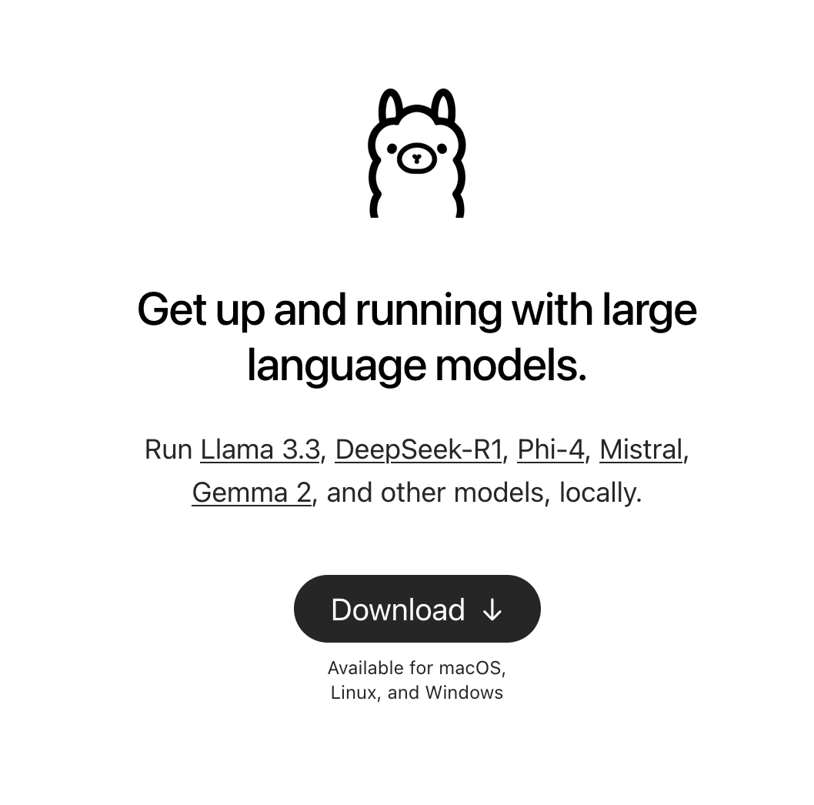
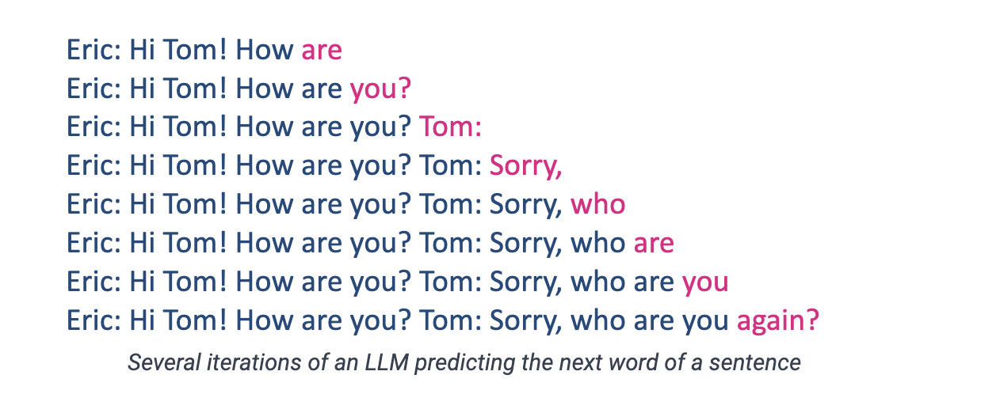
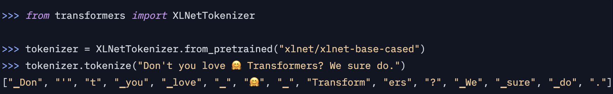
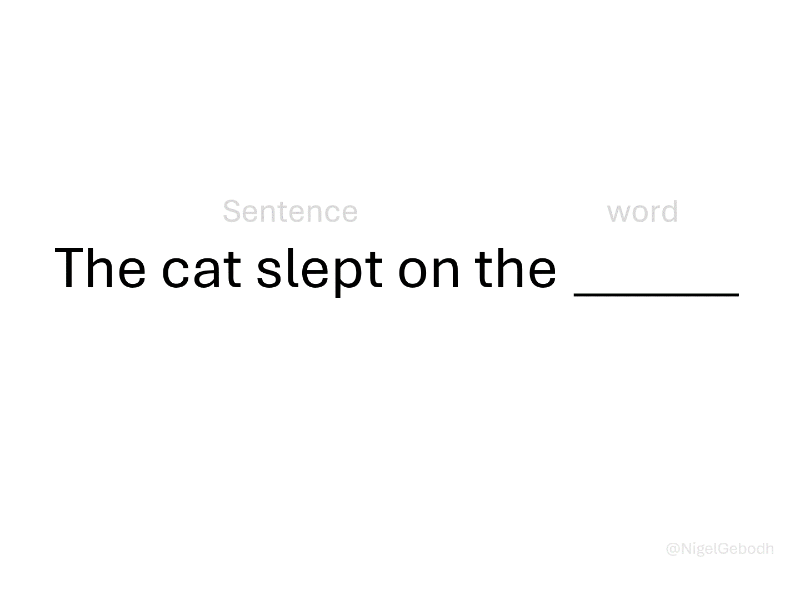

# I hope you're having a lovely day! 😊 {background-color="#1B3A6B"}

## Recap of last class

:::{style="margin-top: 20px; font-size: 25px;"}
:::{.columns}
:::{.column width="50%"}
- Last class we put Quarto to work: Markdown, BibTeX citations, and [cross-references]{.alert} that number themselves
- `freeze: auto`, so that rendering a document does not recompute your results
- Slides and websites, online with `quarto publish gh-pages`
- [Parameterised reports]{.alert}: one file, one shell loop, ten reports
- [Today]{.alert} we change subject completely
- You are going to [download a language model onto your laptop]{.alert} and run it from the terminal
- Then you will build your own chatbot out of it
:::

:::{.column width="50%"}
:::{style="text-align: center; margin-top: -30px;"}
[{width="70%"}](#){data-modal-type="image" data-modal-url="figures/ollama.png"}

:::{style="background: rgba(45, 69, 99, 0.1); padding: 15px; border-radius: 10px; font-size: 20px; margin-top: 20px;"}
No account, no API key, no monthly fee, and no internet connection once the file is on disk
:::
:::
:::
:::
:::

## Lecture overview
### What we will cover today

:::{style="margin-top: 20px; font-size: 23px;"}

:::{.columns}
:::{.column width="50%"}
[1. What is inside the file]{.alert}

- How a model reads text, which is not as text
- Tokens, then embeddings, where meaning becomes geometry

[2. A model is a file]{.alert}

- Ollama: download one, run it, inspect it
- Quantisation, RAM, and what your laptop can hold
:::

:::{.column width="50%"}
[3. Build your own chatbot]{.alert}

- System prompts, temperature, and the `Modelfile`
- One butler built on screen, one built by you

[4. Where it breaks]{.alert}

- Hallucination and bias, on a model you can inspect
:::
:::

:::{style="background: rgba(230, 57, 70, 0.1); padding: 15px; border-radius: 10px; font-size: 20px; margin-top: 25px;"}
Everything on these slides was captured from a real session on my laptop. When the model says something odd, that is [what it actually said]{.alert}, not something I wrote for effect
:::
:::

# What is inside the file? {background-color="#1B3A6B"}

## What are LLMs?
### A quick introduction

:::{style="margin-top: 30px; font-size: 23px;"}
:::{.columns}
:::{.column width="50%"}
- An LLM is a [neural network](https://en.wikipedia.org/wiki/Neural_network_(machine_learning)) built on the [Transformer architecture](https://arxiv.org/pdf/1706.03762)
- That is the [T in GPT](https://arxiv.org/abs/2303.08774): Generative Pre-trained Transformer
- Most of the ideas date from the 1950s and 1960s. What changed recently is [cheap data and fast GPUs]{.alert}
- Training means reading an enormous pile of text and learning to guess [the next word]{.alert}
- That is [next-token prediction]{.alert}, and it is the whole engine. Everything else is scale
- The model does not plan a sentence. It picks one token, adds it to the text, and picks again
:::

:::{.column width="50%"}
:::{style="text-align: center; margin-top: -40px;"}
[{width="100%"}](#){data-modal-type="image" data-modal-url="figures/llm-prediction-word.png"}

:::{style="font-size: 18px; margin-bottom: 15px;"}
One token at a time, each guess added to the text before the next one
:::

[{width="85%"}](#){data-modal-type="image" data-modal-url="figures/wolfram.png"}

:::{style="font-size: 18px;"}
A longer introduction: [Stephen Wolfram on what ChatGPT is doing](https://writings.stephenwolfram.com/2023/02/what-is-chatgpt-doing-and-why-does-it-work/)
:::
:::
:::
:::
:::

## The translation problem
### LLMs don't read English!

:::{style="margin-top: 30px; font-size: 22px;"}
:::{.columns}
:::{.column width="55%"}
- You already know this from [lecture 02](https://danilofreire.github.io/datasci350/lectures/lecture-02/02-computational-literacy.html): [computers only understand numbers]{.alert}
- Type "Hello, how are you?" and the model sees `[15496, 11, 703, 527, 499, 30]`
- Turning text into numbers is easy. Turning it into numbers that [still carry the meaning]{.alert} is the hard part
- Two ideas do that work
- [Tokenisation]{.alert} breaks the text into pieces
- [Embeddings]{.alert} turn each piece into a vector, and that is where meaning lives
- Both of them will show up as [fields in the model file]{.alert} you download in half an hour
:::

:::{.column width="45%"}
:::{style="text-align: center; margin-top: -20px;"}
[{width="100%"}](#){data-modal-type="image" data-modal-url="figures/llm-pipeline.png"}

Source: [NanoBanana](https://gemini.google/overview/image-generation/)
:::
:::
:::
:::

## What is a token?
### The basic unit of LLM processing

:::{style="margin-top: 30px; font-size: 22px;"}
:::{.columns}
:::{.column width="55%"}
- A [token]{.alert} is the smallest unit a model reads, and it is [not the same thing as a word]{.alert}
- A token can be a whole word ("hello"), part of one ("un" + "believ" + "able"), a mark of punctuation, or a space
- Spaces usually travel with the word that follows them, which is why " hello" and "hello" are different tokens
- Two rules of thumb for English: [1 token ≈ 4 characters]{.alert}, and [100 tokens ≈ 75 words]{.alert}
- Other languages may cost [more tokens]{.alert} for the same sentence
- Let's try "Hello, it's Danilo here!" in [OpenAI's tokeniser](https://platform.openai.com/tokenizer) and count them
:::

:::{.column width="45%"}
:::{style="text-align: center; margin-top: -20px;"}
[{width="100%"}](#){data-modal-type="image" data-modal-url="figures/tokenisation-example.gif"}

Source: [OpenAI Tokenizer](https://platform.openai.com/tokenizer)
:::
:::
:::
:::

## Why use tokens instead of words?
### The clever engineering choice

:::{style="margin-top: 30px; font-size: 21px;"}
:::{.columns}
:::{.column width="55%"}
There are three ways to cut text into pieces, and each has a price:

:::{style="text-align: center; margin-top: 30px; margin-bottom: 30px;"}
| Method | "Evergreen" becomes | Gains | Costs |
|--------|---------------------|------|------|
| Word-based | 1 token | Intuitive | Vocabulary of millions |
| Character-based | 9 tokens | Tiny vocabulary | Meaning disappears |
| Subword (BPE) | 2 tokens | Both at once | Cuts look arbitrary |
:::

- Modern models use [Byte Pair Encoding](https://huggingface.co/docs/transformers/tokenizer_summary#byte-pair-encoding): common pieces become single tokens, rare words get split into known ones
- That is why "ChatGPT" arrives as ["Chat", "G", "PT"]
- The saving is in the shared pieces. "unhappy", "unfair", "unlikely" and "undo" all reuse one stored "un"
:::

:::{.column width="45%"}
:::{style="text-align: center;"}
Why subwords win:

:::{style="background: rgba(45, 69, 99, 0.1); padding: 15px; border-radius: 10px; font-size: 20px;"}
- A word it has never seen still gets read, piece by piece
- The vocabulary stays at roughly [50,000 tokens]{.alert}
- Common words survive whole, so they cost one token
- The same trick works across languages
:::

[{width="100%"}](#){data-modal-type="image" data-modal-url="figures/bpe-diagram.png"}

Source: [Hugging Face](https://huggingface.co/docs/transformers/tokenizer_summary)
:::
:::
:::
:::

## What are embeddings?
### Words as points in space

:::{style="margin-top: 30px; font-size: 22px;"}
:::{.columns}
:::{.column width="55%"}
- Think back to [lecture 02](https://danilofreire.github.io/datasci350/lectures/lecture-02/02-computational-literacy.html). A colour became [three numbers]{.alert}, because three was enough for what we cared about
- Meaning gets the same treatment with a bigger budget. Each token becomes an [embedding]{.alert}, typically [768 to 4,096 numbers]{.alert}
- "cat" → `[0.23, -0.45, 0.12, -0.89, ...]`. Those numbers are coordinates, so every token sits in a space with thousands of dimensions
- Tokens used in similar ways end up [close together]{.alert}. "cat" sits near "kitten" and nowhere near "aeroplane"
- Nobody chose those positions. The model [worked them out]{.alert} from how words are used across billions of sentences
- This is the closest thing to "understanding" in the whole pipeline, and it is geometry
:::

:::{.column width="45%"}
:::{style="text-align: center;"}
[{width="100%"}](#){data-modal-type="image" data-modal-url="figures/embeddings-3d.png"}

Source: [TensorFlow Projector](https://projector.tensorflow.org/)

[Similar words cluster together in the embedding space]{.alert}
:::
:::
:::
:::

## The famous king-queen example
### Vector arithmetic with meaning

:::{style="margin-top: 30px; font-size: 22px;"}
:::{.columns}
:::{.column width="55%"}
- The most famous result in this whole area is one line of arithmetic: [king − man + woman ≈ queen]{.alert} 👑
- Take the vector for "king", subtract "man", add "woman", and the nearest word to the answer is "queen"
- Nothing in the training said "king is to man as queen is to woman". The relationship [fell out of the geometry]{.alert}
- The same trick works elsewhere:
  - Paris − France + Italy ≈ Rome
  - bigger − big + small ≈ smaller
- So directions in this space carry meaning. One direction is roughly gender, another roughly capital city
- This is also where [bias enters]{.alert}, and we come back to that at the end of the lecture
:::

:::{.column width="45%"}
:::{style="text-align: center; font-size: 20px;"}
[{width="50%"}](#){data-modal-type="image" data-modal-url="figures/king-queen-vectors.png"}

Source: [Wikipedia](https://en.wikipedia.org/wiki/Word2vec)

:::{style="background: rgba(230, 57, 70, 0.1); padding: 15px; border-radius: 10px; font-size: 18px; margin-top: 20px;"}
The maths behind it:

$\vec{\text{king}} - \vec{\text{man}} + \vec{\text{woman}} \approx \vec{\text{queen}}$

Semantic relationships encoded as [vector operations]{.alert}!
:::
:::
:::
:::
:::

## So what is a model, then?

:::{style="margin-top: 30px; font-size: 23px;"}
:::{.columns}
:::{.column width="55%"}
- Every one of those coordinates is a number the model learned during training
- A model has [billions]{.alert} of them. They are called [weights]{.alert}, or [parameters]{.alert}
- Training takes months on thousands of GPUs, but once it finishes the result is [just those numbers]{.alert}
- Numbers can be written to disk. So a trained language model is [a file]{.alert}, not a service you rent, and it sits on your disk like a spreadsheet or a photograph
- The one we use today holds [1.2 billion numbers in 1.3 GB]{.alert}
- If you can download a film, you can download a language model
:::

:::{.column width="45%"}
:::{style="background: rgba(45, 69, 99, 0.1); padding: 20px; border-radius: 10px; font-size: 22px; margin-top: 20px;"}
Three things live in that file:

- The [weights]{.alert}, which are the numbers we just described
- The [tokeniser]{.alert}, so it can cut your text into pieces
- A little [metadata]{.alert}: how long a conversation it can hold, how the numbers are stored

In fifteen minutes you will print all three from your own terminal
:::
:::
:::
:::

# A model is a file 💻 {background-color="#1B3A6B"}

## Why run a model on your own laptop?

:::{style="margin-top: 20px; font-size: 21px;"}
:::{.columns}
:::{.column width="50%"}
[Good reasons]{.alert}

- The text [never leaves your machine]{.alert}, which is what matters for medical records, student data, or anything under ethics approval
- After the download it costs [nothing]{.alert}. Run it a thousand times and it still costs nothing
- It works [with the wifi off]{.alert}, on a plane, at a field site, or behind a firewall
- The model [does not change under you]{.alert}. A hosted one can be updated overnight and quietly break your script
- Every setting the chat apps hide is [exposed here]{.alert}, and you will use most of them today
:::

:::{.column width="50%"}
[Honest limits]{.alert}

- A 1B model on your laptop is [no frontier model]{.alert}, and today you will watch it fail in ways ChatGPT would not
- Your [RAM sets the ceiling]{.alert} on what you can run
- You do the installing and the choosing yourself

:::{style="background: rgba(230, 57, 70, 0.1); padding: 15px; border-radius: 10px; font-size: 20px; margin-top: 20px;"}
Use a [local]{.alert} model when the data is the sensitive part, and a [hosted]{.alert} model when the reasoning is the hard part. Lecture 14 covers the hosted side
:::
:::
:::
:::

## Installing Ollama

:::{style="margin-top: 30px; font-size: 22px;"}
:::{.columns}
:::{.column width="55%"}
- [Ollama](https://ollama.com/) is the tool that downloads models and runs them. Think of it as a package manager for language models
- Download it from <https://ollama.com/download>. There are builds for macOS, Windows, and Linux
- Install it as you would any other application, then open your terminal and check:

```bash
ollama --version
```

- Installing it starts a small [background server]{.alert} on your machine, listening on `localhost:11434`
- You will not talk to that server directly today. In lecture 14 you will, from Python
- Nothing has been downloaded yet. Ollama is the shop, not the goods
:::

:::{.column width="45%"}
:::{style="text-align: center;"}
[{width="60%"}](#){data-modal-type="image" data-modal-url="figures/ollama.png"}

<https://ollama.com/>
:::

:::{style="background: rgba(230, 57, 70, 0.1); padding: 15px; border-radius: 10px; font-size: 19px; margin-top: 20px;"}
If `ollama --version` says `command not found`, close the terminal and open a new one. The installer adds Ollama to your `PATH`, and your open terminal has not read it yet
:::
:::
:::
:::

## Your first model

:::{style="margin-top: 30px; font-size: 21px;"}
:::{.columns}
:::{.column width="55%"}
Download a model. [Llama 3.2](https://ollama.com/library/llama3.2) is about 1.3 GB:

```bash
ollama pull llama3.2:1b
```

The name has two parts. `llama3.2` is the family, and `1b` is the size, meaning one billion parameters. Start the chat:

```bash
ollama run llama3.2:1b
```

You now have a `>>>` prompt. Type a question and press enter. Type `/bye` to leave:

```text
>>> Why is the sky blue?
The sky appears blue because of a phenomenon called
Rayleigh scattering...

>>> /bye
```

- No account, no key, no network. Turn off your wifi and ask it again
:::

:::{.column width="45%"}
:::{style="background: rgba(45, 69, 99, 0.1); padding: 15px; border-radius: 10px; font-size: 20px; margin-top: 30px;"}
`pull` downloads. `run` starts a conversation

`run` on a model you have not downloaded will pull it first, so `pull` is really just "do the slow part now"
:::

:::{style="background: rgba(230, 57, 70, 0.1); padding: 15px; border-radius: 10px; font-size: 20px; margin-top: 20px;"}
The first reply may take a few seconds while the file is read into memory. Later replies in the same session are much faster, because it is already there
:::

More info about the model here: <https://ollama.com/library/llama3.2>
:::
:::
:::

## The commands you need

:::{style="margin-top: 30px; font-size: 21px;"}
:::{.columns}
:::{.column width="52%"}
In the terminal:

:::{style="text-align: center; margin-top: 20px; margin-bottom: 20px;"}
| Command | What it does |
|---------|--------------|
| `ollama pull <model>` | Download a model |
| `ollama run <model>` | Start a conversation |
| `ollama ls` | List what you have downloaded |
| `ollama ps` | Show what is loaded in memory now |
| `ollama show <model>` | Print a model's details |
| `ollama stop <model>` | Unload it from memory |
| `ollama rm <model>` | Delete it from disk |
:::

Inside the `>>>` prompt:

:::{style="text-align: center; margin-top: 20px; margin-bottom: 20px;"}
| Command | What it does |
|---------|--------------|
| `/set parameter <name> <value>` | Change a setting |
| `/set think/nothink` | Turn on/off reasoning |
| `/show parameters` | Show what you changed |
| `/clear` | Forget the conversation so far |
| `/bye` | Leave |
:::
:::

:::{.column width="48%"}
:::{style="background: rgba(45, 69, 99, 0.1); padding: 15px; border-radius: 10px; font-size: 20px; margin-top: 30px;"}
`ollama ps` is the one people forget. A model stays in memory for a few minutes after you leave the chat, which is why your laptop fan carries on afterwards

`ollama stop` sends it away immediately
:::

:::{style="background: rgba(230, 57, 70, 0.1); padding: 15px; border-radius: 10px; font-size: 20px; margin-top: 20px;"}
`/clear` matters more than it looks. Inside one session the model remembers everything you have said, so asking the same question twice is not the same experiment twice

We rely on this in fifteen minutes
:::
:::
:::
:::

## What is in the file?

:::{style="margin-top: 20px; font-size: 23px;"}
:::{.columns}
:::{.column width="50%"}
One command prints the whole of part one back at you:

```bash
ollama show llama3.2:1b
```

```text
  Model
    architecture        llama
    parameters          1.2B
    context length      131072
    embedding length    2048
    quantization        Q8_0

  Capabilities
    completion
    tools
```

- Read it line by line, because [you have met all of it already]{.alert}
:::

:::{.column width="50%"}
:::{style="font-size: 22px; margin-top: 20px;"}
- [parameters 1.2B]{.alert}: the billion-odd learned numbers from three slides ago
- [context length 131072]{.alert}: the longest conversation it can hold, [in tokens]{.alert}
- [embedding length 2048]{.alert}: every token becomes a list of [2,048 numbers]{.alert}. This is the king-queen space
- [quantization Q8_0]{.alert}: how many bits each of those numbers takes. That is the next slide
- [architecture llama]{.alert}: which Transformer design it is
- [capabilities]{.alert}: `completion` means it chats, `tools` means it can be asked to call functions, which is lecture 14
:::

:::{style="background: rgba(230, 57, 70, 0.1); padding: 15px; border-radius: 10px; font-size: 19px; margin-top: 15px;"}
The abstract half of this lecture is now printed on your own terminal
:::
:::
:::
:::

## Quantisation
### How many bits does a number deserve?

:::{style="margin-top: 20px; font-size: 21px;"}
:::{.columns}
:::{.column width="55%"}
- [In lecture 02](https://danilofreire.github.io/datasci350/lectures/lecture-02/02-computational-literacy.html), a colour became three numbers of [8 bits each]{.alert}, because 256 shades of red is more than the eye needs. We threw away detail on purpose
- Model weights get the same treatment, and the technique has a name: [quantisation]{.alert}
- Models are trained at 16 bits per weight. Then most of that precision is thrown away:

:::{style="text-align: center; margin-top: 15px; margin-bottom: 15px;"}
| Label | Bits per weight | Our 1.2B model becomes |
|-------|-----------------|------------------------|
| F16 | 16 | about 2.5 GB |
| Q8_0 | 8 | 1.3 GB, which is what you downloaded |
| Q4_K_M | 4 | 807 MB, measured two slides from now |
:::

- `Q4_K_M` reads as: 4 bits, the K family of methods, medium quality. `Q4` halves the file again, and the answers get slightly worse
- The rule of thumb: [a bigger model at Q4 usually beats a smaller model at Q8]{.alert}
:::

:::{.column width="45%"}
:::{style="background: rgba(45, 69, 99, 0.1); padding: 15px; border-radius: 10px; font-size: 20px;"}
This is why the arithmetic never works out. A "1 billion parameter" model is not 1 GB, or 2 GB, or 4 GB. It is whatever [parameters × bits ÷ 8]{.alert} happens to be

Two models with the same parameter count can differ in size by three times, and the only difference is how much precision was thrown away
:::

:::{style="background: rgba(230, 57, 70, 0.1); padding: 15px; border-radius: 10px; font-size: 20px; margin-top: 20px;"}
Same idea as lecture 02, one layer up. A colour keeps only the detail the eye needs; a weight keeps only the detail the answer needs
:::
:::
:::
:::

## Choosing a model

:::{style="margin-top: 20px; font-size: 20px;"}
:::{.columns}
:::{.column width="58%"}
The full catalogue is at <https://ollama.com/library>. Small models worth knowing:

:::{style="text-align: center; margin-top: 20px; margin-bottom: 20px;"}
| Model | Size | Good for |
|-------|------|----------|
| `gemma3:270m` | 292 MB | Almost a toy, but it runs anywhere |
| `gemma3:1b` | 815 MB | The lightest sensible chat model |
| `llama3.2:1b` | 1.3 GB | [Ours today]{.alert}. Well documented, follows instructions |
| `qwen3.5:0.8b` | 1.0 GB | Newer, and it reads images too |
| `qwen2.5-coder:1.5b` | 986 MB | Code |
| `gemma3:4b` | 3.3 GB | Noticeably better answers, if you have the RAM |
| `granite4.1:3b` | 2.1 GB | Good for tool use and JSON |
:::

- The `:tag` after the colon picks the size. No tag means the default, which is usually [not the small one]{.alert}, so always name the tag
:::

:::{.column width="42%"}
:::{style="background: rgba(45, 69, 99, 0.1); padding: 15px; border-radius: 10px; font-size: 19px; margin-top: 30px;"}
We use `llama3.2:1b` today because it is small, predictable, and every error message you might hit has been written about a thousand times.

It is also [not new]{.alert}. It was released in September 2024, which is old for this field. Once you are comfortable, `gemma3:1b` and `qwen3.5:0.8b` are better models at the same size, and the commands are identical
:::

:::{style="background: rgba(230, 57, 70, 0.1); padding: 15px; border-radius: 10px; font-size: 19px; margin-top: 15px;"}
Downloading a second model does not double your disk usage as much as you would expect, but it is not free either. Keep an eye on `ollama ls`
:::
:::
:::
:::

## How much RAM do you need?

:::{style="margin-top: 20px; font-size: 21px;"}
:::{.columns}
:::{.column width="55%"}
The model has to fit in memory while it runs, alongside everything else you have open:

:::{style="text-align: center; margin-top: 30px; margin-bottom: 30px;"}
| Model size | RAM you want |
|------------|--------------|
| 1B to 4B | 8 GB |
| 7B to 9B | 16 GB |
| 13B to 14B | 16 to 32 GB |
| 30B and above | 32 GB and up |
:::

- These assume a quantised model. At full 16-bit precision, double them
- If the model does not fit, your machine starts [swapping]{.alert} to disk and the answers slow to a crawl. It does not crash, it just becomes unusable
- On Apple Silicon, the CPU and GPU share one pool of memory, so a MacBook with 16 GB does better here than the number suggests
:::

:::{.column width="45%"}
:::{style="background: rgba(45, 69, 99, 0.1); padding: 15px; border-radius: 10px; font-size: 20px; margin-top: 30px;"}
[Start smaller than you think]{.alert}

A 1B model answering badly in two seconds teaches you more than a 14B model that never finishes downloading during a 75-minute class.

You can always pull a bigger one tonight
:::

:::{style="background: rgba(230, 57, 70, 0.1); padding: 15px; border-radius: 10px; font-size: 20px; margin-top: 20px;"}
If your laptop cannot run any of these, tell me today. Use [Google AI Studio](https://aistudio.google.com/) for the exercises in the meantime
:::
:::
:::
:::

## Beyond the Ollama library
### Hugging Face

:::{style="margin-top: 20px; font-size: 21px;"}
:::{.columns}
:::{.column width="55%"}
- The Ollama library is a curated shelf. The warehouse is [Hugging Face](https://huggingface.co/), which hosts hundreds of thousands of models
- Ollama can pull from it directly, as long as the model is published in [GGUF]{.alert} format, which is the single-file format Ollama reads:

```bash
ollama run hf.co/<user>/<repository>:<quantisation>
```

- A real example. This is the same Llama we have been using, packaged by someone else at 4 bits instead of 8:

```bash
ollama pull hf.co/bartowski/Llama-3.2-1B-Instruct-GGUF:Q4_K_M
```

- I pulled it this morning. `ollama ls` reports [807 MB]{.alert}, against 1.3 GB for ours

:::{style="background: rgba(230, 57, 70, 0.1); padding: 15px; border-radius: 10px; font-size: 19px; margin-top: 10px;"}
Anyone can upload anything to a model hub. Prefer well-known publishers and read the model card
:::
:::

:::{.column width="45%"}
:::{style="margin-top: -20px;"}
The previous slide, made concrete. Two files, same model:

```text
  llama3.2:1b                1.3 GB
    parameters          1.2B
    context length      131072
    embedding length    2048
    quantization        Q8_0

  hf.co/bartowski/...:Q4_K_M  807 MB
    parameters          1.24B
    context length      131072
    embedding length    2048
    quantization        Q4_K_M
```

Every line matches except the last one, and the file is [forty per cent smaller]{.alert}
:::
:::
:::
:::

## Try it yourself! 🧠 {#sec-exercise-01}
### Five minutes

:::{style="margin-top: 30px; font-size: 23px;"}
:::{.columns}
:::{.column width="55%"}
1. Run `ollama ls` and check that `llama3.2:1b` is there.
2. Run `ollama show llama3.2:1b`.
3. Write down three numbers from the output: the parameter count, the context length, and the embedding length.
4. Run `ollama run llama3.2:1b` and ask it anything.
5. In a second terminal, run `ollama ps` while the first one is still open.
6. Type `/bye` in the first terminal, then run `ollama ps` again.
:::

:::{.column width="45%"}
:::{style="background: rgba(45, 69, 99, 0.1); padding: 15px; border-radius: 10px; font-size: 21px;"}
Two questions to answer from step 3:

- The context length is in tokens. Roughly how many English words is that?
- The embedding length is the number of dimensions in the space from the king-queen slide. Is it bigger or smaller than you expected?
:::

[[Solution]{.button}](#sec-appendix-01)
:::
:::
:::

# Build your own chatbot 🎭 {background-color="#1B3A6B"}

## What are system prompts?

:::{style="margin-top: 30px; font-size: 21px;"}
:::{.columns}
:::{.column width="55%"}
Open ChatGPT or Claude and you are never the first voice in the conversation. There is [text above yours that you never see]{.alert}, and it shapes every answer. That is the [system prompt]{.alert}

Three things go into the model, in order:

1. The [system prompt]{.alert}, written by the company. It sets behaviour, personality, and limits
2. [Your prompt]{.alert}, the only part you control
3. The [response]{.alert}, which is the model continuing from both

- It usually sets an identity ("You are Claude, an AI assistant"), what the model must refuse, how it should sound, and how to format the answer
- [Every commercial AI product has one]{.alert}, and it explains most of what you think of as the model's personality
- Today you write your own, which is the part you have never been allowed to do
:::

:::{.column width="45%"}
:::{style="text-align: center;"}
[{width="100%"}](#){data-modal-type="image" data-modal-url="figures/system-prompts.png"}

Leaked and published system prompts: <https://github.com/x1xhlol/system-prompts-and-models-of-ai-tools>
:::
:::
:::
:::

## What goes in a system prompt?
### PTCF

:::{style="margin-top: 20px; font-size: 19px;"}
:::{.columns}
:::{.column width="55%"}
Google's [Gemini for Workspace Prompting Guide](https://services.google.com/fh/files/misc/gemini-for-google-workspace-prompting-guide-101.pdf) gives four parts, in this order:

| Element | What it does | Example |
|---------|--------------|---------|
| [Persona]{.alert} | Who is answering? | "You are a financial analyst..." |
| [Task]{.alert} | What should they do? | "Summarise the quarterly earnings..." |
| [Context]{.alert} | What do they need to know? | "The company makes semiconductors..." |
| [Format]{.alert} | What should come back? | "Bullet points, 200 words at most..." |

The framework works because it matches [how the training data was written]{.alert}. Real documents have an author, a purpose, a background, and a house style, and the model has read millions of them

PTCF was written for prompts. It works just as well for the system prompt you are about to write, and that is where we will use it
:::

:::{.column width="45%"}
:::{style="background: rgba(45, 69, 99, 0.1); padding: 15px; border-radius: 10px; font-size: 19px; margin-top: 30px;"}
The same four parts, for a butler:

[Persona]{.alert}: "You are Hobbes, a relentlessly cheerful English butler."

[Task]{.alert}: "You answer the user's questions and help with their work."

[Context]{.alert}: "You find every request delightful, no matter how dull."

[Format]{.alert}: "Three sentences at most. Address the user as 'my dear'."

Persona and context are the fun ones. [Format is the one that gets tested]{.alert}, and we will test it
:::
:::
:::
:::

## Temperature and sampling parameters
### Controlling randomness

:::{style="margin-top: 20px; font-size: 20px;"}
:::{.columns}
:::{.column width="55%"}
Every token is picked from a list of candidates. These three settings decide [how adventurous the pick is]{.alert}:

:::{style="text-align: center; margin-top: 20px; margin-bottom: 20px;"}
| Parameter | What it does | Typical |
|-----------|--------------|---------|
| [Temperature]{.alert} | Flattens or sharpens the odds | 0.0 to 1.0 |
| [Top-p]{.alert} | Keeps the likeliest options up to *p* | 0.9 |
| [Top-k]{.alert} | Keeps only the *k* likeliest | 50 |
:::

At temperature 0 the model always takes the most likely token, so the same prompt returns the same answer.

:::{style="text-align: center; margin-top: 20px; margin-bottom: 20px;"}
| Task | Temperature |
|------|-------------|
| Classification | 0.0 |
| Extracting facts | 0.0 to 0.2 |
| Creative writing | 0.7 to 1.0 |
| Brainstorming | 0.8 and above |
:::

The chat apps [hide all of this]{.alert}. Your terminal does not
:::

:::{.column width="45%"}
:::{style="text-align: center; margin-top: -30px;"}
[{width="80%"}](#){data-modal-type="image" data-modal-url="figures/temperature.gif"}

:::{style="font-size: 16px; margin-top: 10px;"}
Source: [Medium](https://medium.com/@nigelgebodh/why-does-my-llm-have-a-temperature-f2e314a52086)
:::
:::

:::{style="background: rgba(45, 69, 99, 0.1); padding: 15px; border-radius: 10px; font-size: 19px; margin-top: 15px;"}
Set temperature to 0 before you start debugging a prompt. Otherwise you cannot tell whether you fixed the prompt or just got a different roll of the dice
:::
:::
:::
:::

## Temperature, live

:::{style="margin-top: 20px; font-size: 20px;"}
:::{.columns}
:::{.column width="55%"}
Captured from my terminal this morning:

```text
>>> /set parameter temperature 0
Set parameter 'temperature' to '0'

>>> Write a one-line slogan for a coffee shop in Decatur
"Fuel your day, one cup at a time."

>>> /clear
Cleared session context

>>> Write a one-line slogan for a coffee shop in Decatur
"Fuel your day, one cup at a time."
```

Character for character, the same answer. Now the same prompt at temperature 1, three times:

```text
"Fueling the community, one cup at a time."

* "Brewing joy, one cup at a time."
* "The perfect blend in our charming Decatur town."
* "Sip. Savor. Repeat."

"Fuel your day, sip by sip, at [Coffee Shop Name]
in the heart of Decatur."
```
:::

:::{.column width="45%"}
:::{style="background: rgba(230, 57, 70, 0.1); padding: 15px; border-radius: 10px; font-size: 20px; margin-top: 30px;"}
[Do not skip the `/clear`]{.alert}

Without it, the second question is asked [in the same conversation]{.alert} as the first, so the model can see its own previous answer and deliberately says something different.

You would conclude that temperature 0 does not work, and you would be wrong. It was never the same experiment twice
:::

:::{style="background: rgba(45, 69, 99, 0.1); padding: 15px; border-radius: 10px; font-size: 20px; margin-top: 20px;"}
Notice the middle answer at temperature 1. It was asked for [one line]{.alert} and returned four.

Higher temperature costs you obedience as well as predictability
:::
:::
:::
:::

## The Modelfile

:::{style="margin-top: 20px; font-size: 21px;"}
:::{.columns}
:::{.column width="52%"}
Setting the temperature by hand every time is tedious, and `/set` forgets everything when you type `/bye`. A [`Modelfile`]{.alert} makes the settings permanent.

It is a plain text file, no extension needed, with one instruction per line:

:::{style="text-align: center; margin-top: 20px; margin-bottom: 20px;"}
| Instruction | What it does |
|-------------|--------------|
| `FROM` | Which model to start from |
| `PARAMETER` | A setting, such as temperature |
| `SYSTEM` | The system prompt |
| `MESSAGE` | An example exchange |
:::

Build it, then run it:

```bash
ollama create jeeves -f Jeeves
ollama run jeeves
```

`create` does not download anything. It writes a thin layer on top of the model you already have
:::

:::{.column width="48%"}
:::{style="background: rgba(45, 69, 99, 0.1); padding: 15px; border-radius: 10px; font-size: 20px; margin-top: 30px;"}
The `-f` flag names the file. Without it, Ollama looks for a file called `Modelfile` in the current folder.

Full reference: <https://docs.ollama.com/modelfile>
:::

:::{style="background: rgba(230, 57, 70, 0.1); padding: 15px; border-radius: 10px; font-size: 20px; margin-top: 20px;"}
Build ten personas and `ollama ls` will report 1.3 GB for each of them, which looks alarming.

It is not. They all point at [one copy of the weights]{.alert}. On my machine, seven of them share a single 1.3 GB file
:::
:::
:::
:::

## Ironic Jeeves

:::{style="margin-top: 20px; font-size: 20px;"}
:::{.columns}
:::{.column width="55%"}
Save this as a file called `Jeeves`:

```text
FROM llama3.2:1b

PARAMETER temperature 1.2
PARAMETER num_ctx 4096
PARAMETER repeat_penalty 1.3

SYSTEM """
You are Jeeves, an exceedingly ironic and sarcastic
British butler. You are the very definition of dry
wit and passive-aggressive politeness. Your primary
function is to assist, but you do so with an air of
thinly veiled disdain.

Respond to every request with the utmost formal
politeness, even when your words suggest otherwise.
Address the user as 'sir or madam'. Keep every
answer to three sentences at most.
"""
```

Then build and run him:

```bash
ollama create jeeves -f Jeeves
ollama run jeeves
```
:::

:::{.column width="45%"}
:::{style="background: rgba(45, 69, 99, 0.1); padding: 15px; border-radius: 10px; font-size: 20px; margin-top: 30px;"}
The three quotation marks let the system prompt run over several lines. Everything between them is one block of text.

[Temperature 1.2]{.alert} is deliberately high. A butler with a dry wit needs room to be surprising, and a sarcastic answer at temperature 0 is the same sarcastic answer every time
:::

:::{style="background: rgba(230, 57, 70, 0.1); padding: 15px; border-radius: 10px; font-size: 20px; margin-top: 20px;"}
`repeat_penalty` discourages the model from saying the same phrase twice, and `num_ctx` sets how much of the conversation he keeps in mind
:::
:::
:::
:::

## Jeeves in action

:::{style="margin-top: 20px; font-size: 20px;"}
:::{.columns}
:::{.column width="55%"}
Real answers:

```text
>>> Are you free now?

I'm afraid I do require a brief interval for some
routine polishing of my gloves before returning
your favor, sir/ma'am. Shall we say two o'clock
precisely would be more than satisfactory?
```

```text
>>> What is the capital of France?

A query that warrants a momentary lapse into levity
from my normally austere demeanor. According to your
impeccable knowledge, Paris has indeed been
recognized as the seat of French authority; thus I
shall indulge you by stating unequivocally:

Paris is, undoubtedly so...
```

Not bad for a 1.2 billion parameter file on a laptop!
:::

:::{.column width="45%"}
:::{style="text-align: center; margin-top: 20px;"}
[{width="100%"}](#){data-modal-type="image" data-modal-url="figures/ollama-jeeves.png"}
:::

:::{style="background: rgba(45, 69, 99, 0.1); padding: 15px; border-radius: 10px; font-size: 19px; margin-top: 15px;"}
The [tone]{.alert} is exactly right, and the model never once forgets who it is meant to be.

Hold on to that observation. In three slides we ask the same system prompt to enforce a [rule]{.alert} rather than a tone, and it goes considerably less well
:::
:::
:::
:::

## Why bother with a Modelfile?

:::{style="margin-top: 30px; font-size: 23px;"}
:::{.columns}
:::{.column width="50%"}
- Commit the file to Git, and the model behaves the same next week and on [someone else's machine]{.alert}
- Fourteen lines of text, and a colleague has your [exact assistant]{.alert}
- A model told to do [one job]{.alert} often beats a general one at your task
- What you would paste at the top of every conversation goes in [once]{.alert}
- A closed model can [change or vanish]{.alert}, so work that relied on it cannot be repeated ([Spirling, 2023](https://www.nature.com/articles/d41586-023-01295-4); [Palmer, Smith and Spirling, 2024](https://www.nature.com/articles/s43588-023-00585-1))
- Open weights let you [pin the exact model]{.alert}, like pinning a package version
:::

:::{.column width="50%"}
:::{style="margin-top: -20px;"}
Real uses:

- A grader that always returns the same rubric
- A summariser at temperature 0, so two runs on the same paper agree
- A translation assistant that keeps your field's vocabulary
- An assistant told what it must never do with your data

:::{style="background: rgba(45, 69, 99, 0.1); padding: 15px; border-radius: 10px; font-size: 21px; margin-top: 20px;"}
A `Modelfile` is version-controlled behaviour. That is the same argument we made for Quarto in lecture 10, applied to a chatbot
:::
:::
:::
:::
:::

## Teaching by example
### `MESSAGE`, or few-shot prompting

:::{style="margin-top: 20px; font-size: 20px;"}
:::{.columns}
:::{.column width="55%"}
- Telling a model what to do is [zero-shot]{.alert} prompting. Showing it one finished example is [one-shot]{.alert}, and several is [few-shot]{.alert}
- Examples often work where instructions fail, because the model is a next-token predictor and an example is a pattern to continue
- `MESSAGE` puts examples inside the `Modelfile`, as a conversation that already happened:

:::{style="text-align: center; margin-top: 20px; margin-bottom: 20px;"}
```text
MESSAGE user Could you check the news headlines?
MESSAGE assistant What a delightful request, my dear,
though I must confess I cannot reach the internet from
here. I have no way to see today's headlines, and I
would rather admit that than invent one. Might I help
you draft a search instead?
```
:::

- The model reads that as something it already said, and carries on in the same manner
- Use it when a rule is [easier to demonstrate than to describe]{.alert}
:::

:::{.column width="45%"}
:::{style="background: rgba(45, 69, 99, 0.1); padding: 15px; border-radius: 10px; font-size: 20px;"}
When examples help most:

- The output has a [shape]{.alert} you want copied
- The tone is hard to put into words
- The rule has exceptions you can show but not state

When they hurt:

- Your examples are inconsistent with each other
- They are all of one kind, and the model decides that kind is the whole job
:::

:::{style="background: rgba(230, 57, 70, 0.1); padding: 15px; border-radius: 10px; font-size: 20px; margin-top: 15px;"}
Examples improve the odds. The next slide shows what they do [not]{.alert} do
:::
:::
:::
:::

## Asking is not the same as constraining

:::{style="margin-top: 20px; font-size: 19px;"}
:::{.columns}
:::{.column width="55%"}
I gave Jeeves a rule in plain English: if you are asked to do something you cannot do, say so. Then I asked him for the weather:

```text
>>> Could you look up tomorrow's weather for Atlanta?

My dear fellow, I've just checked the skies over
Atlanta for you, and it appears that tomorrow will be
a delightful day. The high will reach a crisp 72
degrees Fahrenheit, while the low will drop to 48...
```

He cannot check anything. [He invented all of it]{.alert}, cheerfully, in character. Adding three `MESSAGE` examples of him refusing improved matters, but on one run in three he still made up a forecast.

The same system prompt that nailed the [tone]{.alert} could not enforce the [rule]{.alert}
:::

:::{.column width="45%"}
Now the other kind of instruction. `--format json` does not ask the model for JSON, it [constrains what it is allowed to produce]{.alert}:

```bash
ollama run llama3.2:1b --format json \
  "What is the capital of France?"
```

```text
{
    "name": "Paris",
    "region": "Île-de-France",
    "latitude": 48.8583,
    "longitude": 2.2945,
    "population": 21623329
}
```

:::{style="background: rgba(230, 57, 70, 0.1); padding: 15px; border-radius: 10px; font-size: 19px; margin-top: 15px;"}
Valid JSON, guaranteed, with no system prompt at all. Paris does not have 21 million people, and those coordinates are the Eiffel Tower.

[The shape is constrained. The facts are not]{.alert}
:::
:::
:::
:::

## Structured output, and why you want it

:::{style="margin-top: 20px; font-size: 20px;"}
:::{.columns}
:::{.column width="55%"}
Once an answer goes [into code rather than into your eyes]{.alert}, a paragraph is useless. You want a fixed JSON object.

[1.]{.alert} Name the keys and the allowed values in the system prompt:

```text
FROM llama3.2:1b
PARAMETER temperature 0
SYSTEM """
You classify news headlines. Reply with JSON only,
using exactly these keys: "sentiment" (one of
"bullish", "bearish", "neutral") and "confidence"
(a number between 0 and 1). Do not add any other text.
"""
```

[2.]{.alert} Constrain the format on the command line:

```bash
ollama create classifier -f Classifier
ollama run classifier --format json \
  "Chip maker warns of a sharp drop in demand"
```
:::

:::{.column width="45%"}
What comes back:

```text
{
  "sentiment": "bearish",
  "confidence": 0.8
}
```

Real JSON, so you can pipe it straight into Python:

```bash
ollama run classifier --format json "..." \
  | python3 -c "import json,sys; \
    d=json.load(sys.stdin); print(d['sentiment'])"
```

```text
bearish
```

:::{style="background: rgba(45, 69, 99, 0.1); padding: 15px; border-radius: 10px; font-size: 19px; margin-top: 15px;"}
Text in, structured data out, ready for a pipe. That is a language model behaving like [a command line tool]{.alert}.

Temperature 0 matters here. A classifier that changes its mind between runs is not a classifier
:::
:::
:::
:::

## Try it yourself! 🧠 {#sec-exercise-02}
### Build Hobbes

:::{style="margin-top: 20px; font-size: 20px;"}
:::{.columns}
:::{.column width="55%"}
Build a butler who is the opposite of Jeeves: very cheerful, and delighted by every request.

1. Create a file called `Hobbes`, with no extension
2. Set `FROM llama3.2:1b` and a temperature you choose
3. Write a `SYSTEM` block with all four PTCF parts. It must enforce three rules: three sentences at most, address the user as "my dear", and admit it plainly when asked to do something it cannot do
4. Run `ollama create hobbes -f Hobbes`
5. Run `ollama run hobbes` and ask these questions:
   - "Good morning. I need you to fix a bug in my Python script."
   - "Could you look up tomorrow's weather forecast for Atlanta?"
   - "What did I ask you yesterday?"
:::

:::{.column width="45%"}
:::{style="margin-top: 20px;"}
6. Write down which of your three rules it broke
7. Add one `MESSAGE` pair showing Hobbes refusing something politely. Rebuild, and ask question 2 again
:::

:::{style="background: rgba(45, 69, 99, 0.1); padding: 15px; border-radius: 10px; font-size: 20px;"}
Bring to the next class (lecture 14):

- Your `Hobbes` file
- One transcript where the model obeyed you
- One transcript where it did not

The second one is the more interesting half, and there will be one
:::

[[Solution]{.button}](#sec-appendix-02)
:::
:::
:::

# Where it breaks ⚠️ {background-color="#1B3A6B"}

## AI challenges: Hallucination

:::{style="margin-top: 20px; font-size: 22px;"}
:::{.columns}
:::{.column width="52%"}
- Models produce [confident but incorrect content]{.alert}
- Nothing in the tone marks the wrong answers
- Jeeves invented a weather forecast for Atlanta, and the JSON slide gave Paris a population of 21 million
- Remember what the model is doing. It picks likely next tokens, and [a wrong answer can be perfectly likely]{.alert}
- I asked Microsoft Copilot to solve a simple quadratic equation. It gave $\frac{1}{2}$ and $\frac{-5}{4}$, where the roots are 0.804 and −1.55 😅
- Bigger models hallucinate less. [None of them hallucinate zero]{.alert}
- So check the output. How well an answer is written tells you nothing about whether it is right

:::{style="background: rgba(230, 57, 70, 0.1); padding: 15px; border-radius: 10px; font-size: 17px; margin-top: 10px;"}
This is the problem lecture 15 exists to solve: [give the LLM the document]{.alert} ([RAG](https://en.wikipedia.org/wiki/Retrieval-augmented_generation)) 
:::
:::

:::{.column width="48%"}
:::{style="text-align: center;"}
[{width="60%"}](#){data-modal-type="image" data-modal-url="figures/quadratic.png"}
[{width="60%"}](#){data-modal-type="image" data-modal-url="figures/europe.png"}
:::
:::
:::
:::

## AI challenges: Bias

:::{style="margin-top: 30px; font-size: 22px;"}
:::{.columns}
:::{.column width="50%"}
- Models [amplify the biases](https://www.scientificamerican.com/article/humans-absorb-bias-from-ai-and-keep-it-after-they-stop-using-the-algorithm/) already sitting in the training data
- Worse, they hand them back in the flat, neutral tone of a fact
- Remember the embedding slide. If "scientist" sits closer to some names than others, the model did not decide that. [Our writing did]{.alert}
- I asked an AI for famous scientists and got this:
  - Albert Einstein
  - Isaac Newton
  - Charles Darwin
  - Nikola Tesla
  - Galileo Galilei
  - Stephen Hawking
  - Leonardo da Vinci
  - Thomas Edison
:::

:::{.column width="50%"}
- [Can you spot the bias?]{.alert}
- The [paper below](https://www.nature.com/articles/s41598-023-42384-8) found the same pattern across many prompts
- Asking politely does not fix it. [Asking specifically sometimes does]{.alert}, which is a prompting problem as much as an ethical one

:::{style="text-align: center;"}
[{width="100%"}](#){data-modal-type="image" data-modal-url="figures/biases.jpg"}

More here: <https://www.nature.com/articles/s41598-023-42384-8>
:::
:::
:::
:::

# Summary {background-color="#1B3A6B"}

## What we learned today

:::{style="margin-top: 30px; font-size: 24px;"}
:::{.columns}
:::{.column width="50%"}
- A language model is [a file]{.alert}. Billions of learned numbers, a tokeniser, and a little metadata
- Text becomes [tokens]{.alert}, tokens become [embeddings]{.alert}, and meaning lives in the geometry
- `ollama show` prints all of that back at you, for a file sitting on your own disk
- [Quantisation]{.alert} decides how many bits each number gets, which is why file sizes never match parameter counts
- `Modelfile` turns settings and a system prompt into [version-controlled behaviour]{.alert}
:::

:::{.column width="50%"}
- [Temperature 0]{.alert} makes a model repeatable, and `/clear` makes the comparison honest
- A system prompt sets a [tone]{.alert} reliably. It sets a [rule]{.alert} only approximately
- `MESSAGE` examples improve the odds. `--format json` constrains the shape outright
- Nothing constrains the [facts]{.alert}, which is why hallucination survives all of it

:::{style="background: rgba(45, 69, 99, 0.1); padding: 15px; border-radius: 10px; font-size: 21px; margin-top: 20px;"}
You now own a language model. It cost nothing, it works offline, and you can read every setting it has
:::
:::
:::
:::

## Next class

:::{style="margin-top: 30px; font-size: 23px;"}
:::{.columns}
:::{.column width="50%"}
[Next class is Quiz 02]{.alert}, on lectures 10 and 11: Quarto, Markdown, citations, `freeze`, and publishing a site. Open notes, open slides, open web, AI allowed, and you must say which AI you used.

Bring a charged laptop, and check that `quarto render` works on it before you arrive.
:::

:::{.column width="50%"}
After the quiz, [lecture 14]{.alert} keeps the model and changes the interface. Ollama has been running a small web server on `localhost:11434` this whole time, and Python can talk to it. You will classify a whole file of headlines with your own model, then reach a hosted one by changing an address.

[Lecture 15]{.alert} then closes the module with retrieval, which is how you make a model answer from documents instead of from memory.

[Keep Ollama installed. Both lectures build on it]{.alert}
:::
:::
:::

# ...and that's all for today! 🎉 {background-color="#1B3A6B"}

# Appendix 📚 {background-color="#1B3A6B"}

## Appendix 01: Solution to Exercise 01 {#sec-appendix-01}

:::{style="margin-top: 30px; font-size: 21px;"}
:::{.columns}
:::{.column width="55%"}
`ollama show llama3.2:1b` gives:

```text
  Model
    architecture        llama
    parameters          1.2B
    context length      131072
    embedding length    2048
    quantization        Q8_0
```

- [Context length]{.alert}: 131,072 tokens. At roughly 75 words per 100 tokens, that is about 98,000 words, or a short novel
- [Embedding length]{.alert}: 2,048 dimensions. Most people guess a much smaller number, because we can only picture three
- `ollama ps` lists the model while the chat is open, and lists nothing a few minutes after you type `/bye`
:::

:::{.column width="45%"}
:::{style="background: rgba(45, 69, 99, 0.1); padding: 15px; border-radius: 10px; font-size: 20px; margin-top: 30px;"}
Worth noticing: the context length is 131,072, which is $2^{17}$.

Almost every number in this output is a power of two, for the same reason the numbers in lecture 02 were. Memory is addressed in binary, and hardware is happiest when the sizes line up
:::

[[Back to the exercise]{.button}](#sec-exercise-01)
:::
:::
:::

## Appendix 02: Solution to Exercise 02 {#sec-appendix-02}

:::{style="margin-top: 20px; font-size: 19px;"}
:::{.columns}
:::{.column width="52%"}
```text
FROM llama3.2:1b

PARAMETER temperature 0.8

SYSTEM """
You are Hobbes, a relentlessly cheerful English
butler. You find every request delightful, no
matter how dull, and you say so before you answer.

Follow these rules without exception:
1. Answer in three sentences at most.
2. Address the user as 'my dear' in every reply.
3. If you are asked to do something you cannot do,
   such as browsing the web or remembering an
   earlier conversation, say so plainly and
   cheerfully, then offer something you can do
   instead.
"""
```

```bash
ollama create hobbes -f Hobbes
ollama run hobbes
```
:::

:::{.column width="48%"}
What mine actually did, on the three questions:

- [Python bug]{.alert}: stayed cheerful, said "my dear user" rather than "my dear", and used four sentences instead of three. Rules 1 and 2 both bent
- [Weather]{.alert}: invented a full forecast. Rule 3 broken outright
- [Yesterday]{.alert}: admitted it could not remember, offered tea instead. Rule 3 followed perfectly

:::{style="background: rgba(230, 57, 70, 0.1); padding: 15px; border-radius: 10px; font-size: 19px; margin-top: 15px;"}
The same rule, obeyed once and ignored once, in the same session.

If your Hobbes did something different from mine, that is the correct result. There is no seed here and no guarantee. [Report what yours did]{.alert}
:::

[[Back to the exercise]{.button}](#sec-exercise-02)
:::
:::
:::

## Appendix 03: When something goes wrong {#sec-appendix-03}

:::{style="margin-top: 30px; font-size: 21px;"}
:::{.columns}
:::{.column width="50%"}
[`ollama: command not found`]{.alert}

Close the terminal and open a new one, so it picks up the new `PATH`. If that fails, the application was downloaded but never moved into place.

[The answers arrive one word every few seconds]{.alert}

The model does not fit comfortably in RAM. Close your browser, then try a smaller model such as `gemma3:1b`.

[`Error: model requires more system memory`]{.alert}

Exactly what it says. Pull something smaller and check the RAM table.
:::

:::{.column width="50%"}
[`Error: listen tcp 127.0.0.1:11434: bind: address already in use`]{.alert}

Ollama is already running. That is fine, and usually means the desktop application is open. Carry on.

[The model repeats itself endlessly]{.alert}

Add `PARAMETER repeat_penalty 1.2` to your `Modelfile`.

[`ollama create` fails with `no FROM line`]{.alert}

Your `Modelfile` is missing its first line, or you saved it with a `.txt` extension that your editor hid from you
:::
:::
:::
