# Hello, everyone! 👋 {background-color="#1B3A6B"}

# Brief recap 📚 {background-color="#1B3A6B"}

## The AI module

:::{style="margin-top: 30px; font-size: 24px;"}
:::{.columns}
:::{.column width="50%"}
- Last class closed the module with [retrieval-augmented generation]{.alert}
- Four stages: chunk → embed → retrieve → generate
- The whole pipeline was about 50 lines of Python, on your own laptop
- [Fine-tuning]{.alert} changes the model's weights, never its context
- Use it for behaviour and style. Facts that change belong in retrieval
- The ladder to take with you: [prompt → RAG → fine-tune]{.alert}
- Climb a rung only when the one below fails
:::

:::{.column width="50%"}
:::{style="background: rgba(27, 58, 107, 0.08); padding: 18px; border-radius: 10px; font-size: 22px; margin-top: 10px;"}
**Today we change the constraint**

- Every computer in the module was [yours]{.alert}
- One CPU, limited RAM, and it sleeps in your bag
- Today we rent [someone else's]{.alert}
- AWS, and a machine you control from your terminal
:::

:::{style="text-align: center; margin-top: 15px;"}
[{width="35%"}](#){data-modal-type="image" data-modal-url="figures/ollama.png"}
:::
:::
:::
:::

## Lecture overview
### What we will cover today

:::{style="margin-top: 20px; font-size: 22px;"}
:::{.columns}
:::{.column width="55%"}
- [We start with the money]{.alert}: what a company pays for when it owns servers, and what changes when it rents them
- Two newsroom stories from 2008 make the difference concrete
- Then the vocabulary you will meet everywhere: [IaaS, PaaS, SaaS, FaaS]{.alert}, and the virtual machines underneath
- After that, [a tour of the AWS catalogue]{.alert}, from compute to storage to databases
- We look at [what happens when AWS breaks]{.alert}, because it did, for [fifteen hours]{.alert} last October
- [You open your own account]{.alert}, choose the free plan, and set a budget that emails you
- We finish by handing a scanned document to [Amazon Textract](https://aws.amazon.com/textract/) and reading what comes back
:::

:::{.column width="45%"}
:::{style="text-align: center;"}
[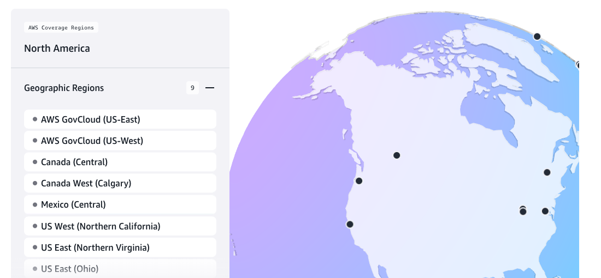{width="100%"}](#){data-modal-type="image" data-modal-url="figures/aws-regions-2026.png"}

:::{style="font-size: 20px;"}
AWS lists [123 availability zones in 39 regions](https://aws.amazon.com/about-aws/global-infrastructure/). The one that failed last October is on this page
:::
:::
:::
:::
:::

# Cloud computing ☁️ {background-color="#1B3A6B"}

## What is cloud computing?

:::{style="margin-top: 30px; font-size: 22px;"}
:::{.columns}
:::{.column width="50%"}
- Cloud computing is the [on-demand delivery]{.alert} of computing resources over the internet, with [pay-as-you-go pricing]{.alert}
- The machine sits in [someone else's data centre]{.alert}, and you rent it by the second
- Four service types: [SaaS, PaaS, IaaS, and FaaS]{.alert}
- The "Big Three" are [AWS, Microsoft Azure, and Google Cloud]{.alert}
  - AWS holds about 28% of the market, Azure 21%, and Google Cloud 14% ([Synergy Research](https://www.statista.com/chart/18819/worldwide-market-share-of-leading-cloud-infrastructure-service-providers/), first quarter of 2026)
  - The world spent [$129 billion]{.alert} on cloud infrastructure in those three months, 35% more than a year earlier
- AWS is Amazon's [most profitable division]{.alert}
  - 21% of sales in the second quarter of 2026, and 60% of the company's operating profit ($16.6 billion in three months)
:::

:::{.column width="50%"}
:::{style="text-align: center;"}
[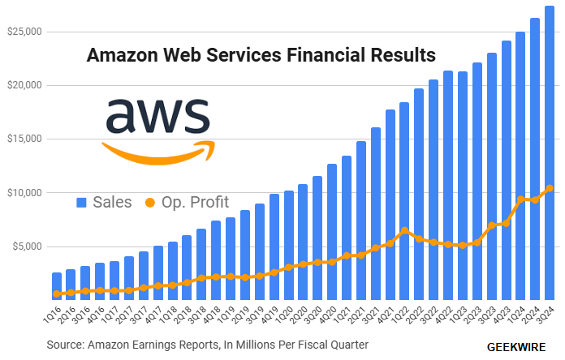{width="100%"}](#){data-modal-type="image" data-modal-url="figures/amazon.png"}

Source: [GeekWire (2025)](https://www.geekwire.com/2025/amazons-quarterly-profits-soar-to-a-record-20-billion-but-cloud-growth-comes-up-short/)
:::
:::
:::
:::

# Why should we care about cloud computing? {background-color="#1B3A6B"}

## Imagine you are opening a business...
### Traditional approach

:::{style="margin-top: 30px; font-size: 28px;"}
:::{.columns}
:::{.column width="50%"}
1. Estimate supply and demand
2. Estimate infrastructural needs
3. Purchase and deploy infrastructure
4. Install and test your system
5. Offer your services to clients
:::

:::{.column width="50%"}
- Infrastructure is [very expensive]{.alert}: 
  - Hardware (Dell's [cheapest rack server](https://www.dell.com/en-us/shop/ipovw/poweredge-r360) starts at $6,500, and a useful one costs much more)
  - Real estate costs 
  - Cooling system, power bill 
  - A few systems engineers 
  - Redundancy for high reliability
- It takes time to deploy the infrastructure
- [What if the estimations were wrong?]{.alert}
:::
:::
:::

## Imagine you are opening a business...
### Cloud approach
:::{style="margin-top: 30px; font-size: 28px;"}

1. Choose one or more cloud services providers
2. Deploy your systems on the cloud
3. Offer your services to clients
4. Pay for what you use

:::{style="margin-top: 40px;"}
:::

| **Traditional process**       | **With Cloud Computing**      |
|-------------------------------|-------------------------------|
| ❌ High investment risk       | ✅ Reduced risk               |
| ❌ Long time-to-market        | ✅ Shorter time-to-market     |
| ✅ Manages own data           | ❌ Trust the vendor?          |
| ✅ Completely in control      | ❌ Dependent on a specific vendor? |
:::

## Case study: Animoto

:::{style="margin-top: 30px; font-size: 26px;"}
:::{.columns}
:::{.column width="50%"}
- [Animoto](https://animoto.com/): Lets users create videos from their own photos/music
- Built using [Amazon EC2](https://aws.amazon.com/ec2/) (Elastic Compute Cloud) + [S3](https://aws.amazon.com/s3/) (Simple Storage Service) + [SQS](https://aws.amazon.com/sqs/) (Simple Queue Service)
- Released a Facebook app in mid-April 2008 
- More than [750,000 people signed up within 3 days]{.alert}
- EC2 usage went [from 50 machines to 3,500 (x70 scalability!)]{.alert}
- [No way they could have done this with traditional infrastructure!]{.alert}
:::

:::{.column width="50%"}
:::{style="text-align: center;"}
[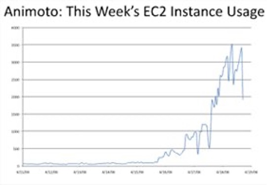{width="100%"}](#){data-modal-type="image" data-modal-url="figures/animoto.jpg"}

Source: [Jeff Bezos' talk at Stanford in 2008](https://youtu.be/6nKfFHuouzA?si=M5LCwMxMUC5Ay3oY)
:::
:::
:::
:::

## Case study: The Washington Post

:::{style="margin-top: 30px; font-size: 23px;"}
:::{.columns}
:::{.column width="50%"}
- [Hillary Clinton's White House schedule]{.alert} was released to the public in 2008
- 17,481 pages of low-quality PDF, none of it searchable
- Reading it by hand would have taken [hundreds of hours]{.alert}
- Peter Harkins, a senior engineer at the paper, asked: "Can we make that data available more quickly, ideally within the same news cycle?"
- He tested optical character recognition programs, then launched [200 EC2 instances]{.alert}
- Nine hours of waiting, 1,407 hours of machine time, [$144.62]{.alert}
- The results were online [26 hours after the release]{.alert}
:::

:::{.column width="50%"}
:::{style="text-align: center; margin-top: -20px;"}
[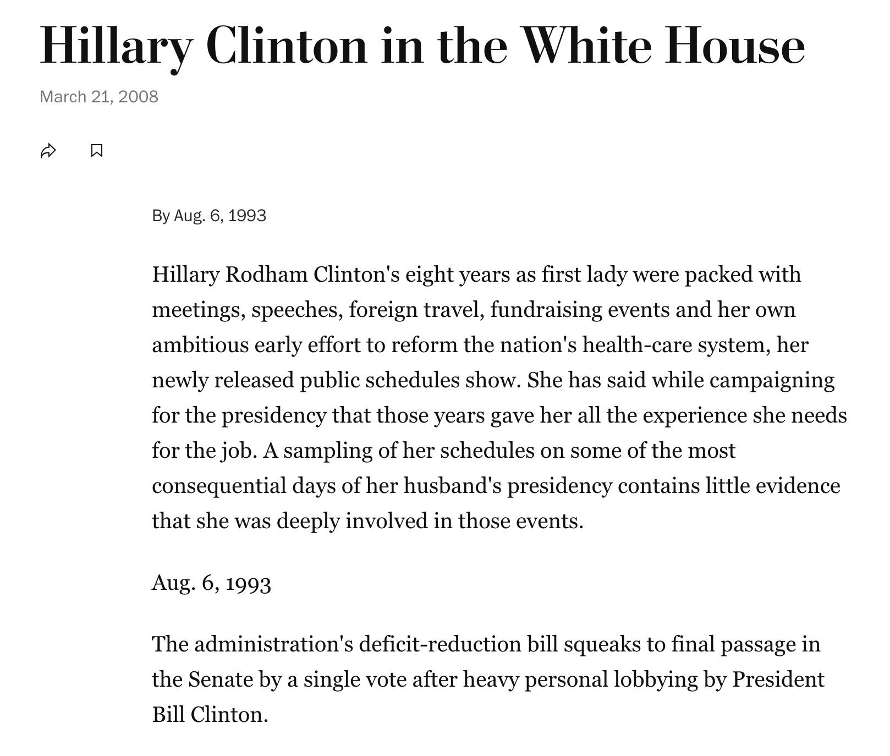{width="100%"}](#){data-modal-type="image" data-modal-url="figures/wapo.png"}

Source: [The Washington Post](https://www.washingtonpost.com/archive/politics/2008/03/21/hillary-clinton-in-the-white-house/200a2e1f-efb4-469a-b5dd-05e87675b598/)
:::
:::
:::
:::

# Cloud computing services ☁️ {background-color="#1B3A6B"}

## Cloud computing services

:::{style="margin-top: 30px; font-size: 26px;"}
- [SaaS (Software as a Service)]{.alert}: a finished application, used through your browser
  - Someone else runs the updates, the security, and the maintenance
  - You pay a subscription, monthly or yearly
  - Nothing to install and nothing to configure
  - Examples: [Gmail](https://gmail.com), [Office 365](https://www.office.com), [Salesforce](https://www.salesforce.com), [GitHub Copilot](https://github.com/features/copilot)

:::{style="margin-top: 20px;"}
- [PaaS (Platform as a Service)]{.alert}: a place to run code you wrote
  - You supply the application. The platform supplies the servers
  - You reach it through an API
  - You pay for the platform, plus the storage and bandwidth you use
  - Examples: [Google App Engine](https://cloud.google.com/appengine), [AWS Elastic Beanstalk](https://aws.amazon.com/elasticbeanstalk), [Heroku](https://www.heroku.com), [GitHub Actions/Codespaces/Pages](https://github.com/features/actions)
:::
:::

## Cloud computing services
### SaaS

:::{style="margin-top: 30px; font-size: 26px; text-align: center;"}
[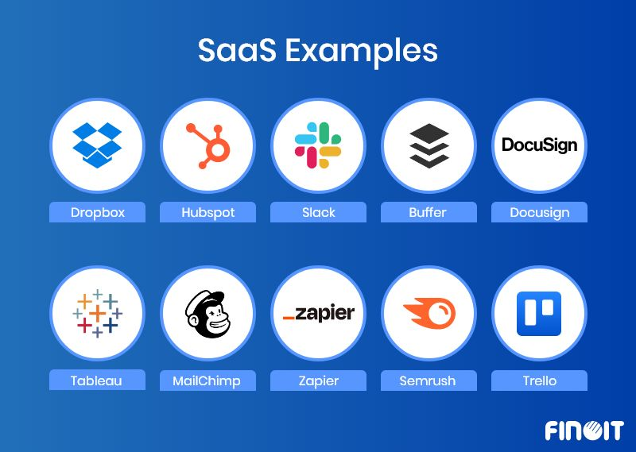{width="65%"}](#){data-modal-type="image" data-modal-url="figures/saas.jpg"}
:::

## Cloud computing services
### PaaS

:::{style="margin-top: 30px; font-size: 26px; text-align: center;"}
[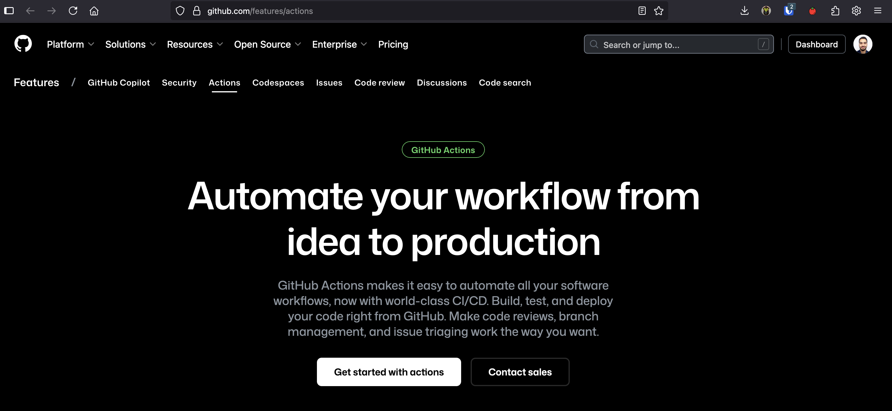{width="100%"}](#){data-modal-type="image" data-modal-url="figures/paas.png"}
:::

## Cloud computing services

:::{style="margin-top: 30px; font-size: 28px;"}
- [FaaS (Function as a Service)]{.alert}:
  - Allows you to run code without provisioning or managing servers
  - You pay for the time your code/function runs
  - Examples: [AWS Lambda](https://aws.amazon.com/lambda), [Google Cloud Functions](https://cloud.google.com/functions), [Azure Functions](https://azure.microsoft.com/en-us/services/functions)

:::{style="margin-top: 20px;"}
- [IaaS (Infrastructure as a Service)]{.alert}:
  - Provides virtualised computing resources over the internet
  - You can rent virtual machines, storage, and networking
  - You pay for the resources you use
  - Examples: [AWS EC2](https://aws.amazon.com/ec2), [Google Compute Engine](https://cloud.google.com/compute), [Azure Virtual Machines](https://azure.microsoft.com/en-us/services/virtual-machines)
:::
:::

## Cloud computing services
### FaaS

:::{style="margin-top: 30px; font-size: 26px; text-align: center;"}
[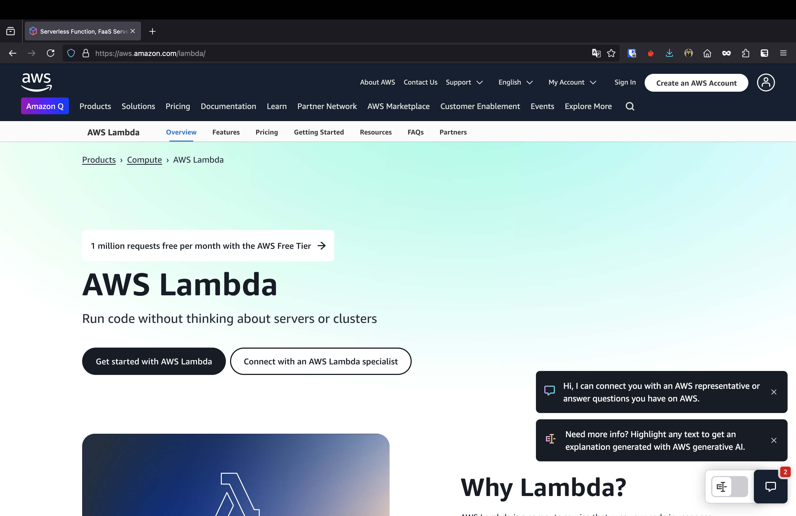{width="70%"}](#){data-modal-type="image" data-modal-url="figures/faas.png"}
:::

## Cloud computing services
### IaaS

:::{style="margin-top: 30px; font-size: 26px; text-align: center;"}
[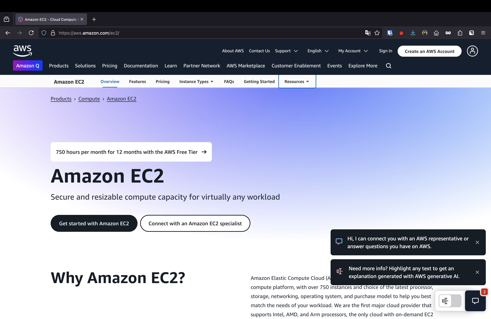{width="70%"}](#){data-modal-type="image" data-modal-url="figures/iaas.png"}
:::

## Comparison of cloud services

:::{style="margin-top: 120px; font-size: 26px; text-align: center;"}
<table style="border-collapse: collapse; width: 90%; margin: 20px auto;">
  <tr>
    <th style="border: 1px solid #ddd; padding: 8px; text-align: center; background-color: #f2f2f2;">On-premise</th>
    <th style="border: 1px solid #ddd; padding: 8px; text-align: center; background-color: #f2f2f2;">IaaS</th>
    <th style="border: 1px solid #ddd; padding: 8px; text-align: center; background-color: #f2f2f2;">PaaS</th>
    <th style="border: 1px solid #ddd; padding: 8px; text-align: center; background-color: #f2f2f2;">SaaS</th>
  </tr>
  <tr>
    <td class="other-manages" style="border: 1px solid #ddd; padding: 8px; text-align: left; background-color: #f44336; color: white; text-align: center;">Application</td>
    <td class="other-manages" style="border: 1px solid #ddd; padding: 8px; text-align: left; background-color: #f44336; color: white; text-align: center;">Application</td>
    <td class="other-manages" style="border: 1px solid #ddd; padding: 8px; text-align: left; background-color: #f44336; color: white; text-align: center;">Application</td>
    <td class="other-manages" style="border: 1px solid #ddd; padding: 8px; text-align: left; background-color: #4CAF50; color: white; text-align: center;">Application</td>
  </tr>
  <tr>
    <td class="user-manages" style="border: 1px solid #ddd; padding: 8px; text-align: left; background-color: #f44336; color: white; text-align: center;">Middleware</td>
    <td class="user-manages" style="border: 1px solid #ddd; padding: 8px; text-align: left; background-color: #f44336; color: white; text-align: center;">Middleware</td>
    <td class="other-manages" style="border: 1px solid #ddd; padding: 8px; text-align: left; background-color: #4CAF50; color: white; text-align: center;">Middleware</td>
    <td class="other-manages" style="border: 1px solid #ddd; padding: 8px; text-align: left; background-color: #4CAF50; color: white; text-align: center;">Middleware</td>
  </tr>
  <tr>
    <td class="user-manages" style="border: 1px solid #ddd; padding: 8px; text-align: left; background-color: #f44336; color: white; text-align: center;">OS</td>
    <td class="user-manages" style="border: 1px solid #ddd; padding: 8px; text-align: left; background-color: #f44336; color: white; text-align: center;">OS</td>
    <td class="other-manages" style="border: 1px solid #ddd; padding: 8px; text-align: left; background-color: #4CAF50; color: white; text-align: center;">OS</td>
    <td class="other-manages" style="border: 1px solid #ddd; padding: 8px; text-align: left; background-color: #4CAF50; color: white; text-align: center;">OS</td>
  </tr>
  <tr>
    <td class="user-manages" style="border: 1px solid #ddd; padding: 8px; text-align: left; background-color: #f44336; color: white; text-align: center;">Virtualisation</td>
    <td class="user-manages" style="border: 1px solid #ddd; padding: 8px; text-align: left; background-color: #f44336; color: white; text-align: center;">Virtualisation</td>
    <td class="other-manages" style="border: 1px solid #ddd; padding: 8px; text-align: left; background-color: #4CAF50; color: white; text-align: center;">Virtualisation</td>
    <td class="other-manages" style="border: 1px solid #ddd; padding: 8px; text-align: left; background-color: #4CAF50; color: white; text-align: center;">Virtualisation</td>
  </tr>
  <tr>
    <td class="user-manages" style="border: 1px solid #ddd; padding: 8px; text-align: left; background-color: #f44336; color: white; text-align: center;">Servers</td>
    <td class="other-manages" style="border: 1px solid #ddd; padding: 8px; text-align: left; background-color: #4CAF50; color: white; text-align: center;">Servers</td>
    <td class="other-manages" style="border: 1px solid #ddd; padding: 8px; text-align: left; background-color: #4CAF50; color: white; text-align: center;">Servers</td>
    <td class="other-manages" style="border: 1px solid #ddd; padding: 8px; text-align: left; background-color: #4CAF50; color: white; text-align: center;">Servers</td>
  </tr>
  <tr>
    <td class="user-manages" style="border: 1px solid #ddd; padding: 8px; text-align: left; background-color: #f44336; color: white; text-align: center;">Networking</td>
    <td class="other-manages" style="border: 1px solid #ddd; padding: 8px; text-align: left; background-color: #4CAF50; color: white; text-align: center;">Networking</td>
    <td class="other-manages" style="border: 1px solid #ddd; padding: 8px; text-align: left; background-color: #4CAF50; color: white; text-align: center;">Networking</td>
    <td class="other-manages" class="other-manages" style="border: 1px solid #ddd; padding: 8px; text-align: left; background-color: #4CAF50; color: white; text-align: center;">Networking</td>
  </tr>
</table>

User manages Provider manages

:::

## What is middleware?

:::{style="margin-top: 30px; font-size: 23px;"}
:::{.columns}
:::{.column width="50%"}
- Middleware is software that [connects two separate applications]{.alert}
- The name is literal: it sits between the operating system and the application
- We rarely see it, and the internet stops working without it
- It handles [authentication, encryption]{.alert}, and the drivers that [talk to databases]{.alert}
- A [message queue]{.alert} holds work until a machine is free, so neither side waits for the other
- Animoto used [SQS](https://aws.amazon.com/sqs) that way: the queue held the video jobs while EC2 grew to 3,500 machines
- [Apache Kafka](https://kafka.apache.org) and [RabbitMQ](https://www.rabbitmq.com) do the same job outside AWS
:::

:::{.column width="50%"}
:::{style="text-align: center;"}
[{width="100%"}](#){data-modal-type="image" data-modal-url="figures/middleware.avif"}

More about middleware: <https://aws.amazon.com/what-is/middleware/>
:::
:::
:::
:::

## What is virtualisation?

:::{style="margin-top: 30px; font-size: 25px;"}
:::{.columns}
:::{.column width="50%"}
- Suppose Alice has a machine with 4 CPUs and 8 GB of memory, and three customers: 
  - Bob wants a machine with 1 CPU and 3 GB of memory 
  - Charlie wants 2 CPUs and 1 GB of memory 
  - Daniel wants 1 CPU and 4 GB of memory
- [What should Alice do?]{.alert}
- Alice can sell each customer a [virtual machine (VM) with the requested resources]{.alert}
- From each customer's perspective, it appears as if they had a [physical machine all by themselves (isolation)]{.alert}
:::

:::{.column width="50%"}
:::{style="text-align: center;"}
[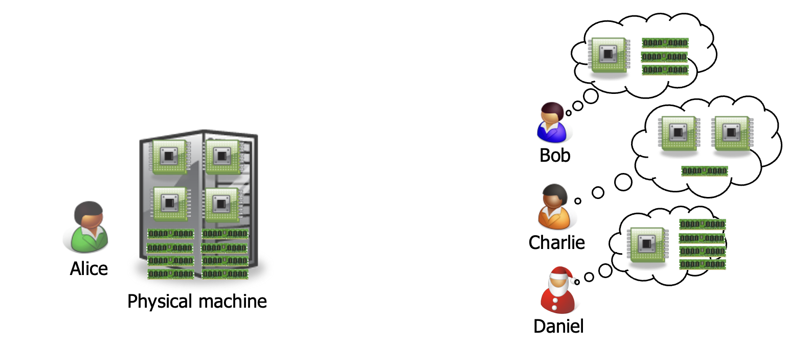{width="100%"}](#){data-modal-type="image" data-modal-url="figures/virtualisation.png"}

More about virtualisation: <https://aws.amazon.com/what-is/virtualization/>
:::
:::
:::
:::

# Amazon Web Services (AWS) {background-color="#1B3A6B"}

## Amazon Web Services (AWS)

:::{style="margin-top: 30px; font-size: 25px;"}
:::{.columns}
:::{.column width="50%"}
- AWS is a collection of cloud-based services
- It's a very [large platform]{.alert}
- Let me say it again: [a VERY LARGE ONE]{.alert} 😂
- They offer a wide range of services:
  - [Compute, storage, databases, analytics, machine learning, AI, IoT, security, and more]{.alert}
- Many companies use AWS, including [Netflix](https://aws.amazon.com/solutions/case-studies/innovators/netflix/), [Airbnb](https://aws.amazon.com/solutions/case-studies/airbnb-case-study/), and [NASA](https://www.earthdata.nasa.gov/engage/partnerships/aws-storage-cloud-compute-request)
- The most widely used services are [EC2](https://aws.amazon.com/ec2), [S3](https://aws.amazon.com/s3), and [RDS](https://aws.amazon.com/rds), for computing, storage, and databases, respectively
- Let's look at them in more detail
:::

:::{.column width="50%"}
:::{style="text-align: center;"}
[{width="100%"}](#){data-modal-type="image" data-modal-url="figures/aws.png"}

<https://aws.amazon.com>
:::
:::
:::
:::

## Amazon EC2 - Elastic Compute Cloud

:::{style="margin-top: 30px; font-size: 24px;"}
:::{.columns}
:::{.column width="50%"}
- Amazon EC2 is a web service that provides [resizable compute capacity]{.alert}
- It's designed to make web-scale cloud computing easier
- You can launch instances with a [many operating systems (mainly Linux)]{.alert}
- Which means that [you can use Bash and run any software you want from the command line]{.alert}
- You can also use a [GUI]{.alert}, but it is not necessary
- You can use EC2 to host a website, run a database, run a machine learning model, etc
- <https://aws.amazon.com/ec2/>
:::

:::{.column width="50%"}
- However, please be [mindful of the costs!]{.alert}
- You pay for the instances you use, and the [costs can add up quickly]{.alert}
- Per-second (or per-hour) billing
- Data transfer [is not]{.alert} included!
- Persistent storage [is not]{.alert} included!
- Scaling [is not]{.alert} included!

:::{style="text-align: center;"}
[{width="90%"}](#){data-modal-type="image" data-modal-url="figures/ec2meme.jpg"}
:::
:::
:::
:::

## EC2 auto scaling

:::{style="margin-top: 30px; font-size: 23px;"}
:::{.columns}
:::{.column width="50%"}
- Scaling is the ability to [increase or decrease]{.alert} the compute capacity of your application
- You can do it manually or automatically
- Useful when you have [fluctuating workloads]{.alert}, such as a website that gets more traffic during the day, or a machine learning model that gets more requests at certain times
- You set a [minimum, desired, and maximum]{.alert} number of instances, and AWS keeps the group inside those bounds
- A rule triggers the change, usually average CPU or the number of requests
- You can also set up [load balancers]{.alert} to distribute traffic across multiple instances
:::

:::{.column width="50%"}
:::{style="text-align: center; font-size: 20px;"}
[{width="100%"}](#){data-modal-type="image" data-modal-url="figures/auto-scaling.png"}

<https://aws.amazon.com/autoscaling>
:::
:::
:::
:::

## ELB - Elastic Load Balancer

:::{style="margin-top: 30px; font-size: 22px;"}
:::{.columns}
:::{.column width="50%"}
- ELB is a service that [distributes incoming application traffic]{.alert} across multiple targets
- It handles the [varying load of your application traffic]{.alert} in a single availability zone or across multiple availability zones
- ELB is a [key component]{.alert} of auto scaling
- As with EC2, you pay for the data transfer and the number of requests
- [And it can be quite expensive too!]{.alert}
- It can detect unhealthy instances and reroute traffic to healthy instances, so your [application is always available]{.alert}
- [Health checks]{.alert} run every few seconds, and a failing instance stops receiving traffic until it recovers
- The load balancer also holds the [HTTPS certificate]{.alert}, so your instances do not each need one
:::

:::{.column width="50%"}
:::{style="text-align: center; font-size: 20px;"}
[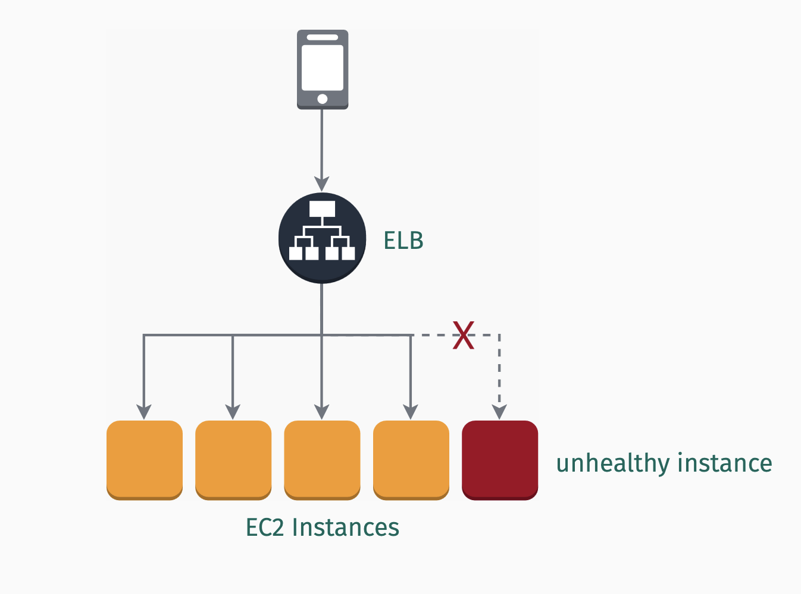{width="100%"}](#){data-modal-type="image" data-modal-url="figures/elb.png"}

<https://aws.amazon.com/elasticloadbalancing/>
:::
:::
:::
:::

## Cloud storage
### Amazon S3 - Simple Storage Service

:::{style="margin-top: 30px; font-size: 21px;"}
:::{.columns}
:::{.column width="50%"}
- Amazon has three main storage services: [S3](https://aws.amazon.com/s3) (Simple Storage Service), [EBS](https://aws.amazon.com/ebs) (Elastic Block Store), and [EFS](https://aws.amazon.com/efs) (Elastic File System)
- S3 is a web service that provides [scalable object storage]{.alert} for data backup, archival, and analytics
- You can store data in [buckets]{.alert}, which are like folders
- Data are distributed across a minimum of [three availability zones]{.alert}
  - 99.999999999% durability (eleven nines!)
- You can set up [lifecycle policies]{.alert} to automatically move data to cheaper storage classes
  - [Standard, Intelligent-Tiering, Glacier, Glacier Deep Archive]{.alert}
- You can also set up [versioning]{.alert} to keep multiple versions of an object (works like `git`)
:::

:::{.column width="50%"}
:::{style="text-align: center; font-size: 20px;"}
[{width="100%"}](#){data-modal-type="image" data-modal-url="figures/s3.png"}

<https://aws.amazon.com/s3/>
:::
:::
:::
:::

## Cloud storage
### Amazon EBS - Elastic Block Store

:::{style="margin-top: 30px; font-size: 23px;"}
:::{.columns}
:::{.column width="50%"}
- EBS is a web service that provides [block storage]{.alert} volumes for use with EC2 instances
- The difference between S3 and EBS is that EBS is [block storage]{.alert}, while S3 is [object storage]{.alert}
  - [Block storage is like a hard drive]{.alert}, while object storage is like a file system
- Why would you use it? [Mainly for SQL files]{.alert}
  - Low-latency, high-performance storage for frequent access
- You can attach EBS volumes to your EC2 instances
- You can also take [snapshots]{.alert} of your volumes for backup (like `git` again!)
- Up to 64 TiB per volume
:::

:::{.column width="50%"}
:::{style="text-align: center; font-size: 20px;"}
[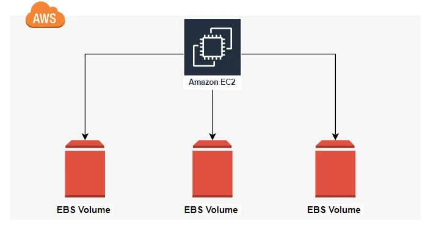{width="100%"}](#){data-modal-type="image" data-modal-url="figures/ebs.webp"}

<https://aws.amazon.com/ebs/>
:::
:::
:::
:::

## Amazon EFS - Elastic File System

:::{style="margin-top: 30px; font-size: 22px;"}
:::{.columns}
:::{.column width="50%"}
- EFS is a web service that provides [scalable file storage]{.alert} for use with EC2 instances
- EFS is mainly used for [shared file storage]{.alert}
  - Multiple EC2 instances can access the same file system
  - Useful for [big data and analytics]{.alert}
  - Also for [content management and web serving]{.alert}
- You can create file systems and mount them to your EC2 instances
- An EBS volume attaches to one instance at a time, while many instances mount the same EFS file system
- EFS grows and shrinks on its own, so there is no volume size to choose
- As with S3 and EBS, you pay for the storage you use
:::

:::{.column width="50%"}
:::{style="text-align: center; font-size: 20px;"}
[{width="50%"}](#){data-modal-type="image" data-modal-url="figures/efs.png"}

<https://aws.amazon.com/efs/>
:::
:::
:::
:::

## Database services
### Amazon RDS - Relational Database Service

:::{style="margin-top: 30px; font-size: 20px;"}
:::{.columns}
:::{.column width="50%"}
- [Amazon RDS](https://aws.amazon.com/rds/) is a web service that makes it easy to set up and operate a [relational database]{.alert}
- You can choose from [seven popular database engines]{.alert}:
  - [Amazon Aurora, PostgreSQL, MySQL, MariaDB, Oracle, SQL Server, and Db2]{.alert}
- It's a managed service, so you don't have to worry about [backups, patches, or updates]{.alert}
- It works well with another AWS service called [Athena](https://aws.amazon.com/athena/), which allows you to query data in S3 using SQL
- The database runs on a machine you never log into. You get a hostname and a port, and no `ssh`
- [Multi-AZ]{.alert} keeps a standby copy in another availability zone and fails over on its own
- You can also use [Redshift](https://aws.amazon.com/redshift/) for data warehousing and business analytics, and [DynamoDB](https://aws.amazon.com/dynamodb/) for NoSQL databases
:::

:::{.column width="50%"}
:::{style="text-align: center; font-size: 20px;"}
[{width="60%"}](#){data-modal-type="image" data-modal-url="figures/rds.png"}

<https://aws.amazon.com/rds/>
:::
:::
:::
:::

## Amazon SageMaker AI

:::{style="margin-top: 30px; font-size: 22px;"}
:::{.columns}
:::{.column width="50%"}
- Finally, let's talk about [Amazon SageMaker AI](https://aws.amazon.com/sagemaker/ai/)
- SageMaker AI is a fully managed service that allows you to build, train, and deploy [machine learning models at scale]{.alert}
  - AWS renamed the original service in 2025, so tutorials still say "SageMaker"
- It has several pre-configured models, such as [TensorFlow, PyTorch, and Scikit-learn]{.alert}
- You can also bring your own models too, and use [Jupyter notebooks]{.alert} to train them
- Lots of other models available in the [AWS Marketplace](https://aws.amazon.com/marketplace), and [SageMaker Unified Studio](https://aws.amazon.com/sagemaker/unified-studio/) is the single workbench for data and AI projects
- Some application services
  - [Comprehend (for NLP)](https://aws.amazon.com/comprehend/)
  - [Rekognition (Visual Analysis)](https://aws.amazon.com/rekognition/)
  - [Translate](https://aws.amazon.com/translate/)
  - [Polly (text-to-speech)](https://aws.amazon.com/polly/)
:::

:::{.column width="50%"}
:::{style="text-align: center; font-size: 20px;"}
[{width="100%"}](#){data-modal-type="image" data-modal-url="figures/sagemaker.png"}

<https://aws.amazon.com/sagemaker/>
:::
:::
:::
:::

## When AWS has a bad night
### 19 October 2025, us-east-1

:::{style="margin-top: 20px; font-size: 22px;"}
:::{.columns}
:::{.column width="50%"}
- Two of DynamoDB's DNS programs updated the same record at once, and the stale one finished last
- That is a [race condition]{.alert}: two processes touch the same thing at the same time, and the result depends on who wins
- The address for `dynamodb.us-east-1.amazonaws.com` was left empty, so nothing could find the database
- The failure spread to EC2 launches, load balancer health checks, and signing in to the console
- The region took roughly [fifteen hours]{.alert} to recover
- [Snapchat, Fortnite, Duolingo, Signal, Ring doorbells and several banks](https://www.cnn.com/business/live-news/amazon-tech-outage-10-20-25-intl) went down with it, and [17 million people reported problems](https://www.techradar.com/pro/security/downtime-caused-historic-issues-in-2025-but-who-lost-out-most)
- Analysts put the losses above [$550 million]{.alert}
:::

:::{.column width="50%"}
:::{style="text-align: center;"}
[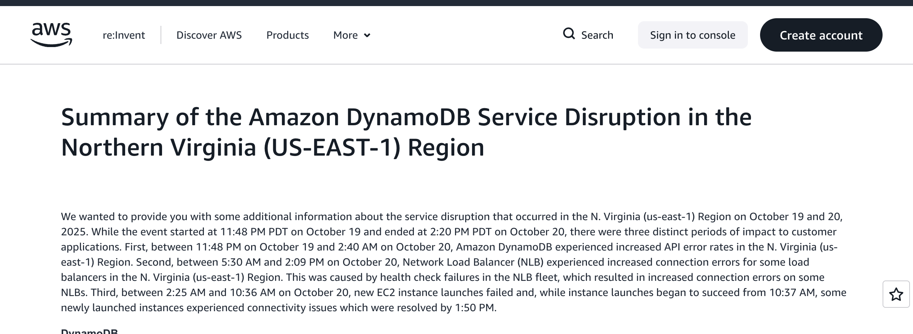{width="100%"}](#){data-modal-type="image" data-modal-url="figures/aws-outage-2025.png"}

:::{style="font-size: 17px;"}
Source: [AWS post-event summary](https://aws.amazon.com/message/101925/)
:::

- You rent capacity from AWS. [Reliability stays your problem]{.alert}, and it starts with not keeping everything in one region!
:::
:::
:::
:::

# Creating and managing an AWS account 🛠️ {background-color="#1B3A6B"}

## Creating an AWS account
### Ten minutes, and you need a payment card

:::{style="margin-top: 20px; font-size: 24px;"}
:::{.columns}
:::{.column width="52%"}
1. Open <https://aws.amazon.com/free/>
2. Choose [Create a Free Account]{.alert}
3. Enter a personal email address. Keep your Emory address for coursework
4. Choose any account name
5. Choose [Verify email address]{.alert}
6. Copy the code from the email into the form
7. AWS requires a card and may place a small temporary authorisation on it. Enter your card details
8. Complete the phone verification
9. Choose your account plan. The next slide covers that choice
:::

:::{.column width="48%"}
:::{style="text-align: center;"}
[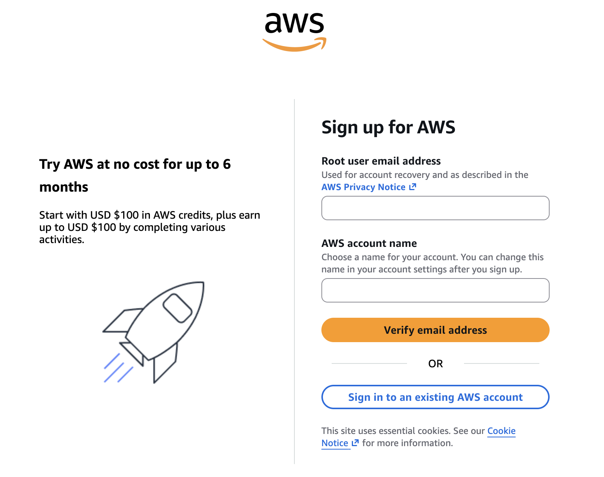{width="68%"}](#){data-modal-type="image" data-modal-url="figures/sign-up-2026.png"}
:::

:::{style="background: rgba(230, 57, 70, 0.1); padding: 15px; border-radius: 10px; font-size: 20px; margin-top: 10px;"}
Do this at home, before or after class. Please let me know if you have any problems
:::
:::
:::
:::

## Free plan or paid plan?
### Choose the free plan

:::{style="margin-top: 20px; font-size: 24px;"}
:::{.columns}
:::{.column width="50%"}
- The account starts with [$100 in credits]{.alert}, and the console offers up to [$100 more]{.alert} for trying key services
- That is $200 across the [six months]{.alert} of the free plan
- The plan ends after six months or when the credits run out, whichever comes first
- AWS puts it plainly: [you will not be charged unless you convert to a paid plan]{.alert}
- The free plan blocks some services, and workloads stop at the credit thresholds
- Everything this course asks of you fits inside those limits
:::

:::{.column width="50%"}
:::{style="text-align: center; margin-top: -20px;"}
[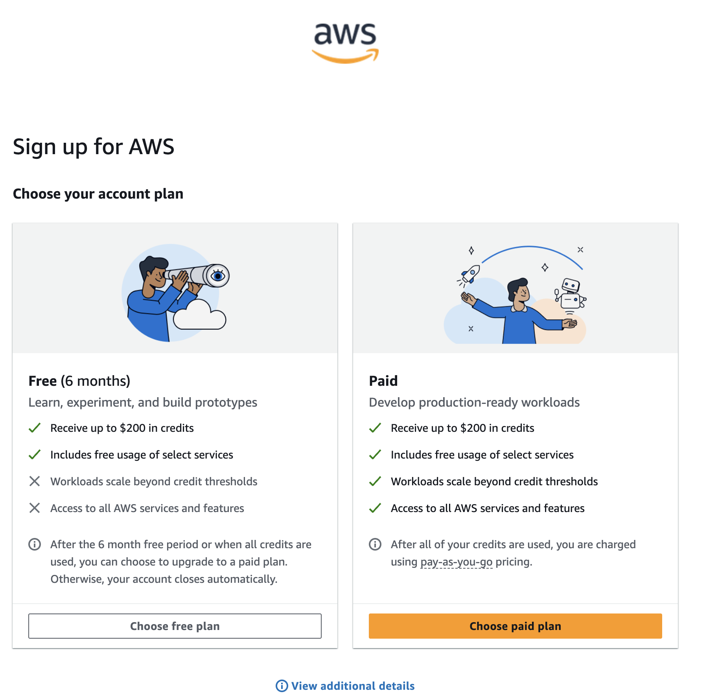{width="62%"}](#){data-modal-type="image" data-modal-url="figures/free-paid-2026.png"}
:::

:::{style="background: rgba(230, 57, 70, 0.1); padding: 15px; border-radius: 10px; font-size: 19px; margin-top: 10px;"}
When the free plan ends, [the account closes on its own]{.alert} and takes your files with it. Download anything you want to keep
:::
:::
:::
:::

## Set a zero-spend budget
### Your first job in the console

:::{style="margin-top: 20px; font-size: 21px;"}
:::{.columns}
:::{.column width="47%"}
1. Open the [Billing and Cost Management](https://console.aws.amazon.com/costmanagement/) console.
2. Choose [Budgets]{.alert} in the left menu.
3. Choose [Create budget]{.alert}.
4. Keep [Use a template (simplified)]{.alert}.
5. Choose [Zero spend budget]{.alert}.
6. Keep the suggested name.
7. Enter your email address.
8. Choose [Create budget]{.alert}.

The template emails you once your spending passes [$0.01]{.alert}

:::{style="background: rgba(27, 58, 107, 0.08); padding: 15px; border-radius: 10px; font-size: 19px; margin-top: 15px;"}
The budget accepts up to ten addresses. Use one you actually read!
:::
:::

:::{.column width="53%"}
:::{style="text-align: center;"}
[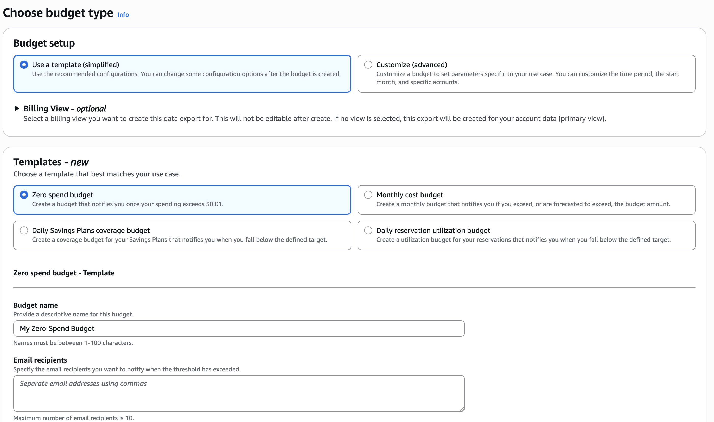{width="100%"}](#){data-modal-type="image" data-modal-url="figures/zero-spend-budget-2026.png"}

<https://console.aws.amazon.com/costmanagement/>
:::
:::
:::
:::

## Check that it worked
### And what the alert will not do for you

:::{style="margin-top: 20px; font-size: 21px;"}
:::{.columns}
:::{.column width="55%"}
:::{style="text-align: center;"}
[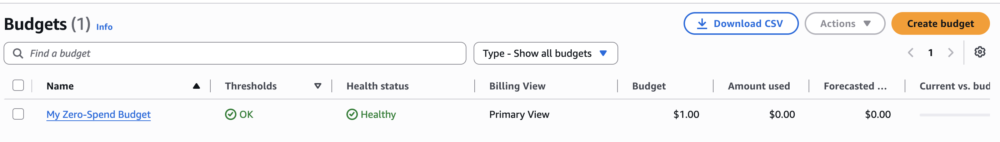{width="100%"}](#){data-modal-type="image" data-modal-url="figures/budgets-2026.png"}

:::{style="font-size: 17px;"}
The budget list after saving
:::

[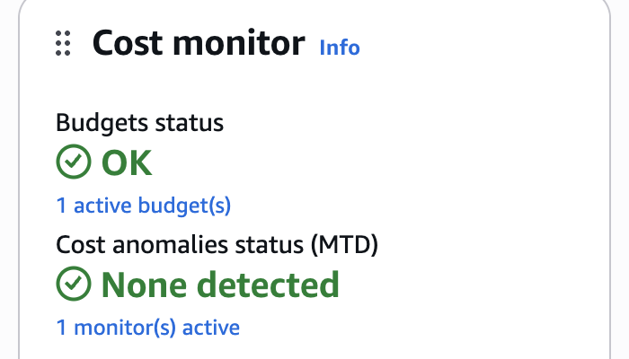{width="46%"}](#){data-modal-type="image" data-modal-url="figures/cost-monitor-2026.png"}

:::{style="font-size: 17px;"}
The same budget on the billing home
:::
:::
:::

:::{.column width="45%"}
- The budget appears in the list with a [Healthy]{.alert} status
- [Billing and Cost Management home]{.alert} repeats it in the Cost monitor panel
- [Billing and Payments, then Credits]{.alert} is where you watch the $200 drain

:::{style="background: rgba(230, 57, 70, 0.1); padding: 15px; border-radius: 10px; font-size: 19px; margin-top: 15px;"}
Billing data refreshes about [once a day]{.alert}, so the email arrives late. An instance left running overnight bills you before anyone warns you
:::

:::{style="background: rgba(27, 58, 107, 0.08); padding: 15px; border-radius: 10px; font-size: 19px; margin-top: 12px;"}
Forecast alerts need roughly five weeks of history, so a new account gets none this term. Terminating what you start is still the real protection
:::
:::
:::
:::

# Reading a scanned document {background-color="#1B3A6B"}

## Amazon Textract
### The 2008 job, in a browser, in about a minute

:::{style="margin-top: 20px; font-size: 22px;"}
:::{.columns}
:::{.column width="50%"}
1. Open the console and search for `Textract`
2. Choose [Analyze Document]{.alert} under Demos
3. Upload `clinton-schedule-2001-pages-11-20.pdf`
4. Tick the outputs you want
5. Choose [Apply configuration]{.alert}

- The file is in the course repository, under [`lectures/lecture-16/data/`](https://github.com/danilofreire/datasci350/blob/main/lectures/lecture-16/data/clinton-schedule-2001-pages-11-20.pdf)

Ten pages of Hillary Clinton's 2001 schedule, the same typewritten paper The Washington Post fed through OCR

:::{style="background: rgba(27, 58, 107, 0.08); padding: 15px; border-radius: 10px; font-size: 17px; margin-top: 15px;"}
New accounts get 1,000 pages a month of plain text detection for three months. The layout, forms and tables features cost more, so read the pricing page before a large run
:::
:::

:::{.column width="50%"}
:::{style="text-align: center;"}
[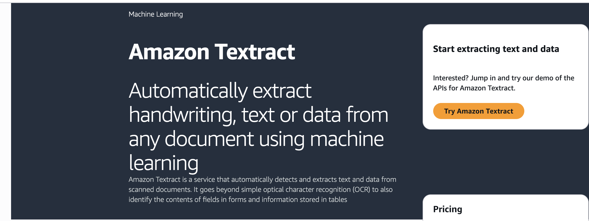{width="100%"}](#){data-modal-type="image" data-modal-url="figures/textract-console-2026.png"}

<https://aws.amazon.com/textract/>
:::
:::
:::
:::

## What you can ask for
### Five kinds of structure, one document

:::{style="margin-top: 30px; font-size: 23px;"}
:::{.columns}
:::{.column width="42%"}
- [Layout]{.alert}: titles, paragraphs, headers, lists, page numbers, and the reading order
- [Forms]{.alert}: key and value pairs, the way a paper form pairs a label with its box
- [Tables]{.alert}: cells, rows, and columns
- [Queries]{.alert}: put a question to the page, such as who signed it
- [Signature detection]{.alert}: where a signature sits

Plain text detection is the cheap option. Everything above it costs more per page
:::

:::{.column width="58%"}
:::{style="text-align: center;"}
[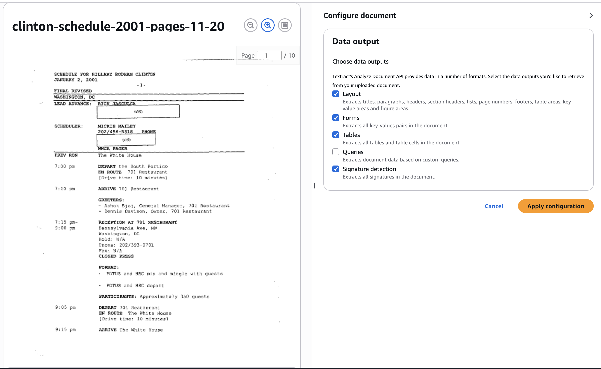{width="100%"}](#){data-modal-type="image" data-modal-url="figures/textract-configure-2026.png"}

:::{style="font-size: 17px;"}
Page 1 of 10, with the outputs about to be applied
:::
:::
:::
:::
:::

## What came back
### Blocks in reading order, each with a confidence score

:::{style="margin-top: 20px; font-size: 21px;"}
:::{.columns}
:::{.column width="42%"}
- Textract returns [blocks in reading order]{.alert}, each labelled by type
- Page 8 came back as a header, a list, and eleven text blocks
- The header reads "SCHEDULE FOR HILLARY [RODAHM]{.alert} CLINTON"
- The typo is in the 2001 document. Textract copied the page faithfully
- Anyone searching these files for "Rodham" would miss this page
- Scores on this page ran from 28% to 92%. They rate how sure Textract is about the [type]{.alert} of block, not the spelling inside it
- The [Raw text]{.alert} tab gives the plain transcript to copy
- The appendix runs an audio transcription job using [Amazon Transcribe](#sec-appendix-transcribe)
:::

:::{.column width="58%"}
:::{style="text-align: center;"}
[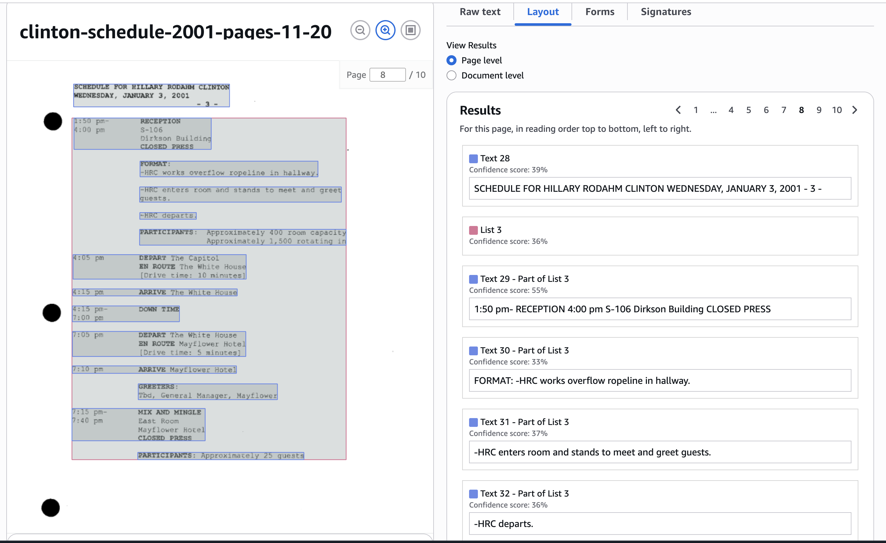{width="100%"}](#){data-modal-type="image" data-modal-url="figures/textract-results-2026.png"}

:::{style="font-size: 17px;"}
The Layout tab, page 8 of 10
:::
:::
:::
:::
:::

# Conclusion {background-color="#1B3A6B"}

## What we learned today

:::{style="margin-top: 30px; font-size: 21px;"}
:::{.columns}
:::{.column width="50%"}
- Why cloud computing is important and [how it can help your business]{.alert}
- The [Big Three cloud computing platforms]{.alert}: AWS, Azure, and GCP
- [The main types of cloud computing services]{.alert}: IaaS, PaaS, SaaS, FaaS
- The most popular AWS services: [EC2, S3, RDS, SageMaker]{.alert}
- How to create an AWS account and set up a billing alarm
- How to create an S3 bucket, upload an audio file, and transcribe it with Amazon Transcribe
- [And that's just the beginning]{.alert}! 
- In the next sessions, we will learn more about AWS services, and how to use them to build and deploy applications
- [Remember to close your EC2 instances and S3 buckets]{.alert} when you're done!
:::

:::{.column width="50%"}
:::{style="text-align: center;"}
[{width="100%"}](#){data-modal-type="image" data-modal-url="figures/cloud-meme.webp"}
:::
:::
:::
:::

## Next class
### Inside the machine you just rented

:::{style="margin-top: 20px; font-size: 21px;"}
:::{.columns}
:::{.column width="52%"}
- We launch an [EC2 instance]{.alert} from the console and connect to it over [SSH]{.alert} with a key pair
- That key pair is a file on your laptop. It [never goes into a Git repository]{.alert}, because bots scan public repositories for AWS keys
- Ubuntu Linux, so every command from the shell module works there
- We install software with `apt`, move files with `scp`, and run a Python script on the instance
- We finish by [terminating]{.alert} it, which is the habit that keeps the bill at zero
- The final project is released the same day

:::{style="text-align: center; margin-top: 10px;"}
[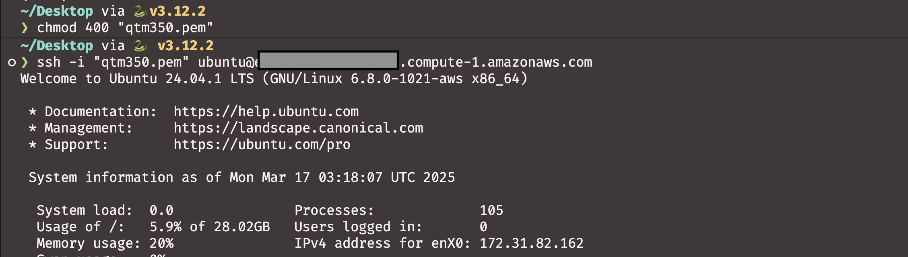{width="78%"}](#){data-modal-type="image" data-modal-url="figures/ssh-ec2-2026.png"}
:::
:::

:::{.column width="48%"}
Before then:

1. Create your AWS account
2. Set the zero-spend budget
3. Windows users, install WSL. Tutorial 06 has the steps
4. Check that `ssh` runs in your terminal

:::{style="background: rgba(27, 58, 107, 0.08); padding: 15px; border-radius: 10px; font-size: 19px; margin-top: 15px;"}
Bring the laptop you will use in class. Setting up SSH on a borrowed machine costs the whole session
:::

:::{style="background: rgba(230, 57, 70, 0.1); padding: 15px; border-radius: 10px; font-size: 19px; margin-top: 12px;"}
[Quiz 03]{.alert} covers the AI module and this cloud module
:::
:::
:::
:::

# Thank you very much!   See you next time! 😊🙏🏽 {background-color="#1B3A6B"}

# Appendix: Amazon Transcribe 🎤 {#sec-appendix-transcribe background-color="#1B3A6B"}

## Audio transcription at scale

:::{style="margin-top: 30px; font-size: 26px;"}
:::{.columns}
:::{.column width="50%"}
- Imagine that you have a task similar to that of the Washington Post journalists
- You found a series of audio files that you need to transcribe, and you have to do it quickly
- So let's create an S3 bucket (folder), upload an audio file, and transcribe it
- The file we will use is available here: [transcribe-sample.mp3](https://d1.awsstatic.com/tmt/create-audio-transcript-transcribe/transcribe-sample.5fc2109bb28268d10fbc677e64b7e59256783d3c.mp3)
- Select [AWS Management Console](https://us-east-1.console.aws.amazon.com/console/home?region=us-east-1) to open the console, then search for `S3` in the search bar
- Click on [Create bucket]{.alert}, give it a name, accept the permissions, and click [Create bucket]{.alert}
:::

:::{.column width="50%"}
:::{style="text-align: center;"}
[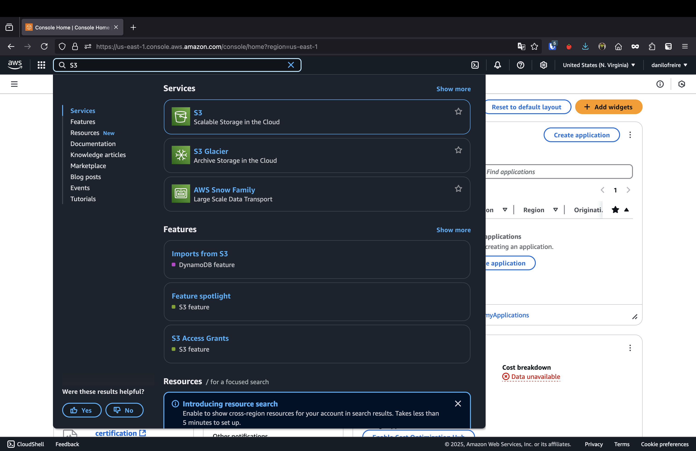{width="100%"}](#){data-modal-type="image" data-modal-url="figures/s3-search.png"}
:::
:::
:::
:::

## Audio transcription at scale

:::{style="margin-top: 30px; font-size: 26px; text-align: center;"}
:::{.columns}
:::{.column width="50%"}
[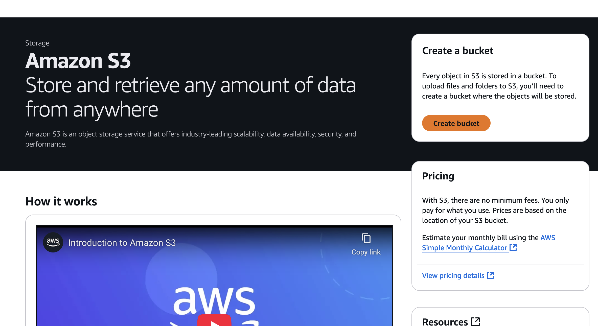{width="100%"}](#){data-modal-type="image" data-modal-url="figures/s3-create.png"}
:::

:::{.column width="50%"}
[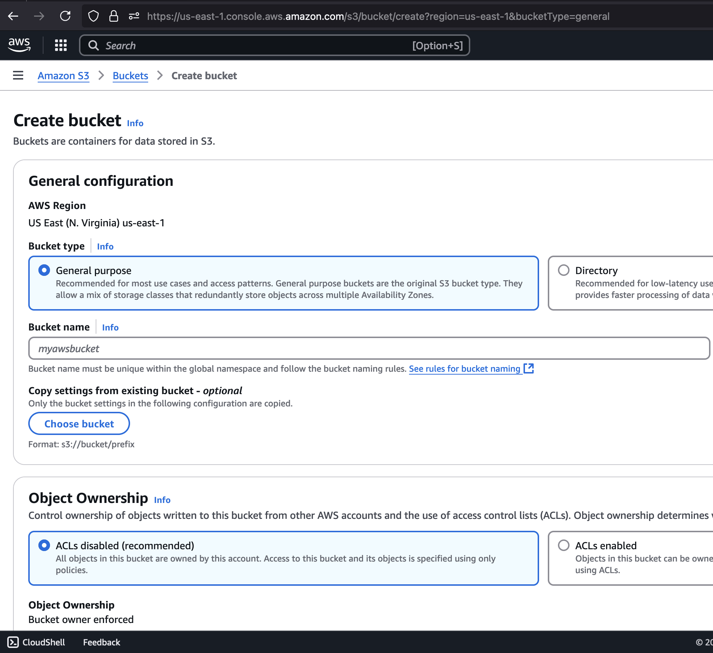{width="100%"}](#){data-modal-type="image" data-modal-url="figures/s3-bucket.png"}
:::
:::
:::

## S3 bucket

:::{style="margin-top: 30px; font-size: 25px; text-align: center;"}
[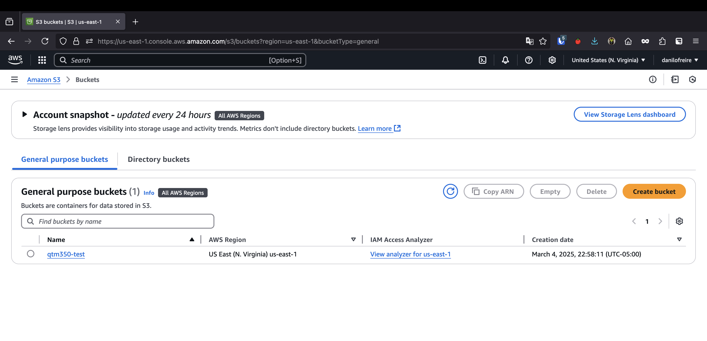{width="90%"}](#){data-modal-type="image" data-modal-url="figures/s3-bucket2.png"}

Then click on the bucket and upload the file
:::

## Create transcription job

:::{style="margin-top: 30px; font-size: 26px;"}
:::{.columns}
:::{.column width="50%"}
- Now let's go to [Amazon Transcribe](https://us-east-1.console.aws.amazon.com/transcribe/home?region=us-east-1)
- Just search for `Transcribe` in the search bar
- Click on [Transcription jobs]{.alert} (left sidebar), then click on [Create job]{.alert}
- Give it a name, select the language, and choose the S3 bucket where the file is located
- Click [Create]{.alert}
:::

:::{.column width="50%"}
:::{style="text-align: center;"}
[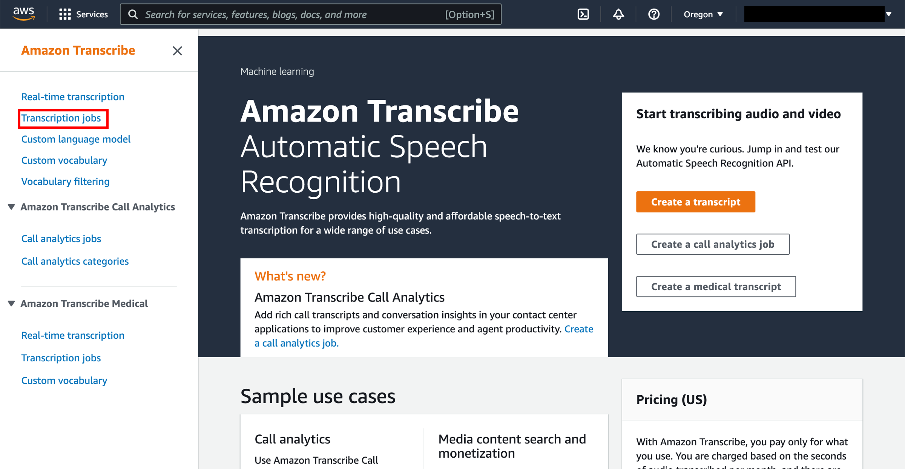{width="100%"}](#){data-modal-type="image" data-modal-url="figures/transcription.png"}
:::
:::
:::
:::

## Transcription job

:::{style="margin-top: 30px; font-size: 25px; text-align: center;"}
:::{.columns}
:::{.column width="50%"}
[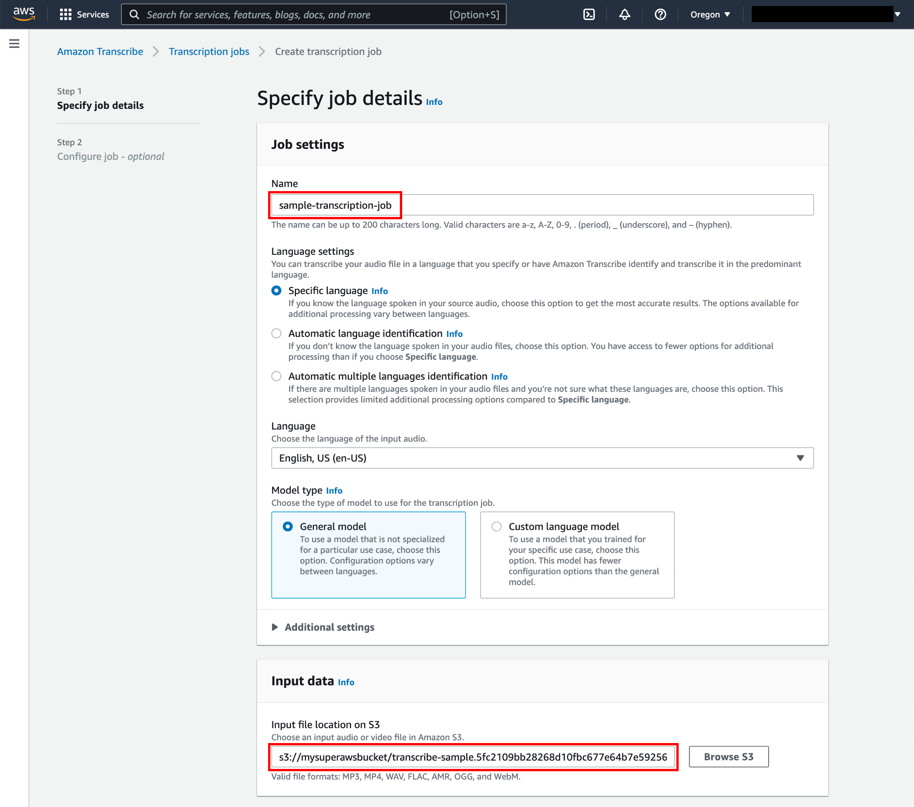{width="100%"}](#){data-modal-type="image" data-modal-url="figures/details.png"}
:::

:::{.column width="50%"}
[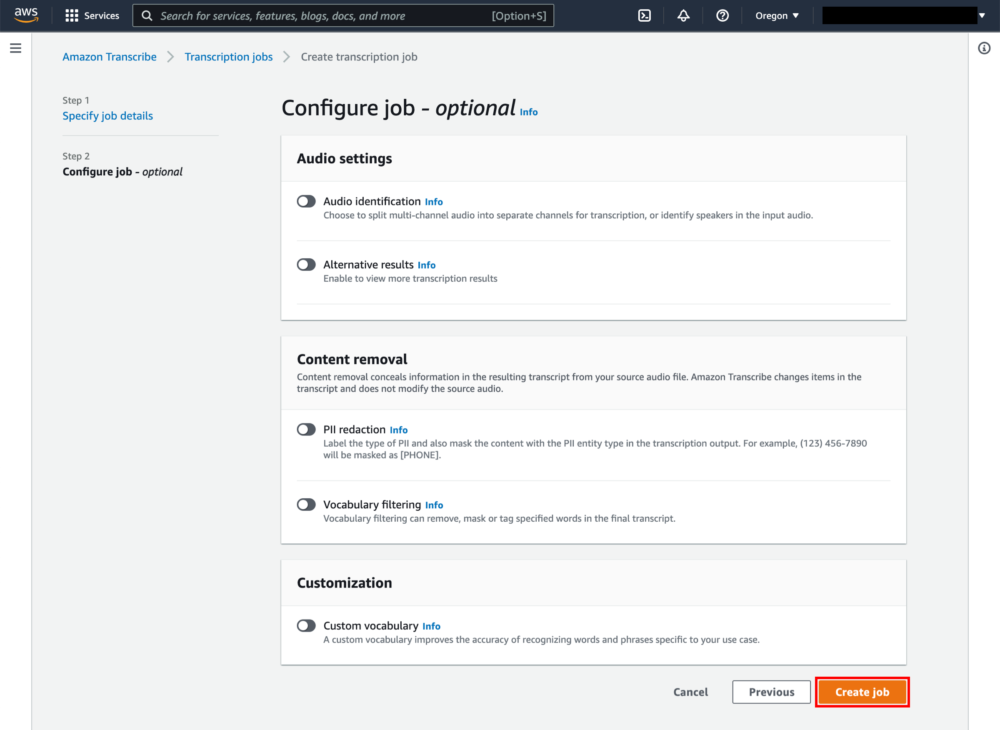{width="100%"}](#){data-modal-type="image" data-modal-url="figures/details2.png"}
:::
:::
:::

## Transcription job

:::{style="margin-top: 30px; font-size: 25px; text-align: center;"}
:::{.columns}
:::{.column width="50%"}
[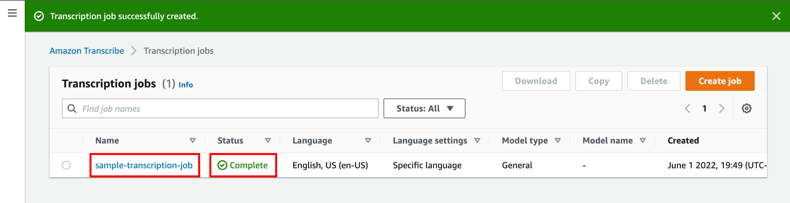{width="100%"}](#){data-modal-type="image" data-modal-url="figures/results2.png"}
:::

:::{.column width="50%"}
[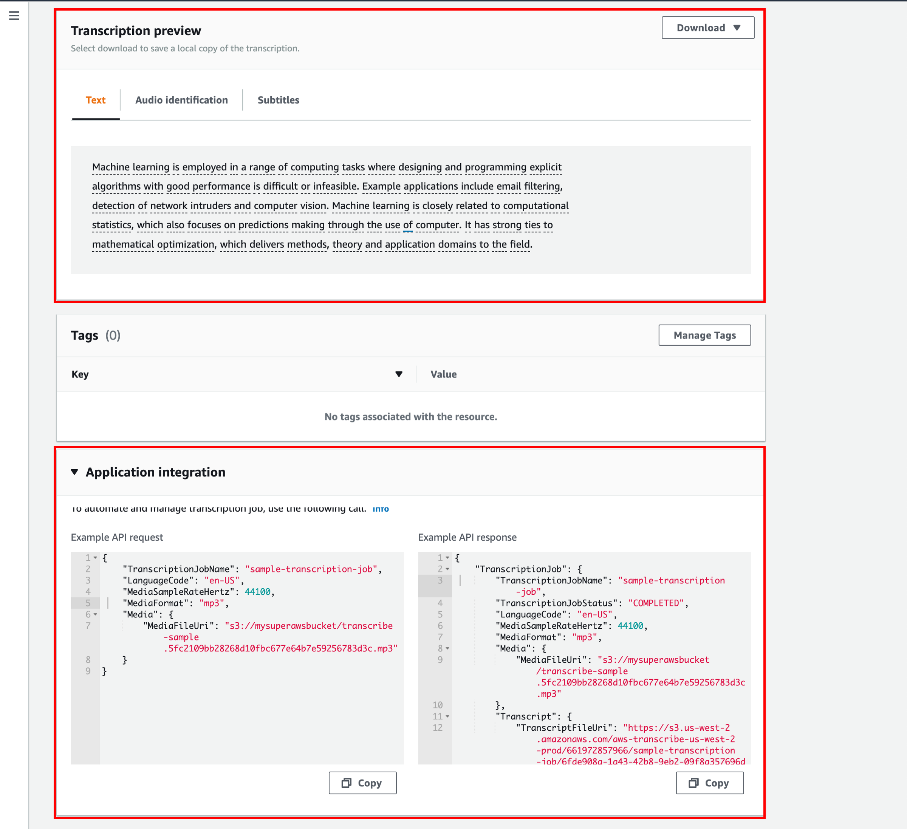{width="100%"}](#){data-modal-type="image" data-modal-url="figures/results.png"}
:::
:::
:::
