# Hello, everyone! 👋 {background-color="#1B3A6B"}

# Brief recap 📚 {background-color="#1B3A6B"}

## Where we left off
### You now have an AWS account

:::{style="margin-top: 25px; font-size: 22px;"}
:::{.columns}
:::{.column width="55%"}
- Last class made the case for [renting]{.alert} servers instead of buying them
- [Animoto]{.alert} grew from 50 EC2 machines to 3,500 in three days when its Facebook app went viral
- The Washington Post read 17,481 pages of Clinton schedules in nine hours of machine time, for $144.62
- We learnt the vocabulary, [IaaS, PaaS and SaaS]{.alert}, and the virtual machines underneath
- We toured the catalogue: EC2, S3, RDS and SageMaker
- We watched `us-east-1` fail for fifteen hours last October and take Snapchat, Signal and several banks with it
- You opened an account on the [six-month free plan]{.alert} and set a [zero-spend budget]{.alert}
- We finished by handing a scanned document to Amazon Textract
:::

:::{.column width="45%"}
:::{style="text-align: center;"}
[{width="58%"}](#){data-modal-type="image" data-modal-url="figures/meme.png"}

:::{style="font-size: 17px;"}
Cartoon by [Forrest Brazeal](https://forrestbrazeal.com/)
:::
:::

- Everything so far happened in the browser. Today we open a terminal and drive the machine from the command line
:::
:::
:::

## Today's plan 

:::{style="margin-top: 30px; font-size: 19px;"}
:::{.columns}
:::{.column width="50%"}
- Using [EC2]{.alert} instances from your [local machine]{.alert}
  - Launching instances via AWS Console
  - Connecting via SSH with [key pairs]{.alert}

- Essential [Linux commands]{.alert} for instance management:
  - Package management: `apt update`, `apt upgrade`, `apt install`
  - File operations: `scp` and `chmod`

- [CloudShell]{.alert}: a terminal in the browser
  - The `aws` command line, already signed in

- Activity 01: Launching a [Jupyter notebook]{.alert} on an EC2 instance
  - Installing Jupyter and running a Python script
  - Forwarding ports with SSH
  - Running Jupyter on a remote server

- Activity 02: [Data analysis on the cloud]{.alert} (time permitting)
  - Creating a weather dataset and uploading it to an EC2 instance
  - Analysing the data with Python and downloading the results
:::

:::{.column width="50%"}
:::{style="text-align: center;"}
[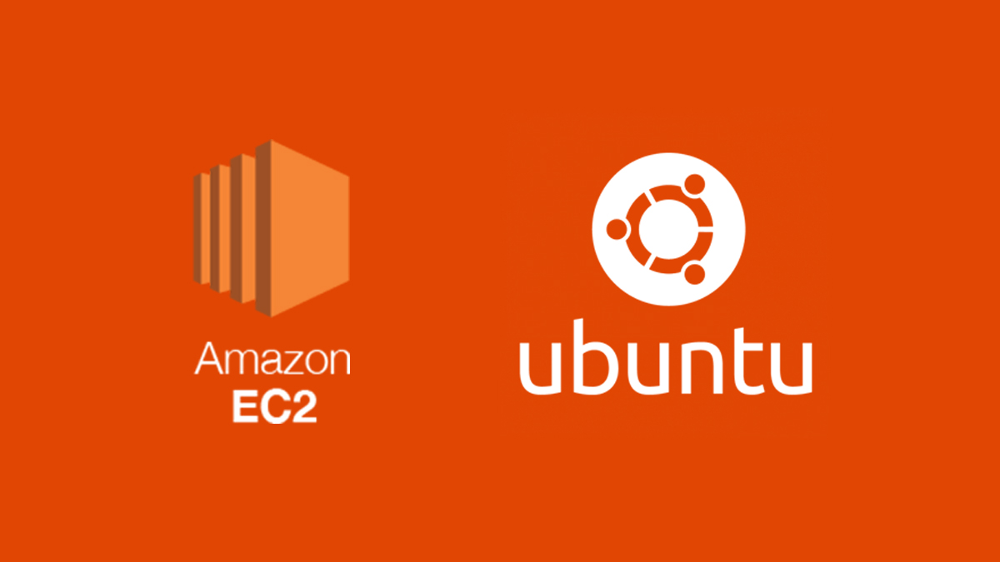{width="80%"}](#){data-modal-type="image" data-modal-url="figures/ubuntu.jpg"}

[About Ubuntu (Wikipedia)](https://en.wikipedia.org/wiki/Ubuntu)

[Ubuntu (Official Site)](https://ubuntu.com/)
:::
:::
:::
:::

# EC2 from your local machine 🖥️ {background-color="#1B3A6B"}

## EC2 instances in a nutshell

:::{style="margin-top: 30px; font-size: 21px;"}
:::{.columns}
:::{.column width="50%"}
- Just to recap: [EC2]{.alert} is a virtual server in the cloud
- Each instance has a full [OS]{.alert} and can run any software (mostly [Ubuntu](https://ubuntu.com/) or [Amazon Linux](https://aws.amazon.com/amazon-linux-2/))
- [Virtualisation]{.alert} allows multiple instances on the same hardware
  - A [virtual machine](https://www.datacamp.com/blog/what-is-a-virtual-machine) is a software emulation of a physical computer
  - [Hypervisors](https://www.redhat.com/en/topics/virtualization/what-is-a-hypervisor) manage VMs and allocate resources
- [Instance types]{.alert} vary in CPU, memory, storage, and network capacity
  - [T2]{.alert} instances are general-purpose, [M5]{.alert} are memory-optimised, etc
- Your account runs on the [six-month free plan](https://aws.amazon.com/free/): $100 in credits, and up to $100 more for trying services
- The types marked [free tier eligible]{.alert} for your account are `t3.micro`, `t3.small`, `t4g.micro` and `t4g.small`
:::

:::{.column width="50%"}
:::{style="text-align: center;"}
[{width="80%"}](#){data-modal-type="image" data-modal-url="figures/hypervisor.avif"}

Source: [DataCamp](https://www.datacamp.com/blog/what-is-a-virtual-machine)
:::
:::
:::
:::

## Ubuntu Linux

:::{style="margin-top: 30px; font-size: 21px;"}
:::{.columns}
:::{.column width="50%"}
- [Linux]{.alert} is an open-source operating system, and it runs most of the servers on the internet
- It is [free]{.alert} to install on as many machines as you like, and you can change any part of it
- The most widely used Linux distribution is [Ubuntu](https://ubuntu.com/)
  - [Debian](https://www.debian.org/)-based, with a focus on usability and security
  - [Long-term support (LTS)](https://ubuntu.com/about/release-cycle) versions are supported for 5 years
  - [Desktop](https://ubuntu.com/desktop) and [server](https://ubuntu.com/server) editions available
- [Google](https://cloud.google.com/), [Amazon](https://aws.amazon.com/), and [Microsoft](https://azure.microsoft.com/en-us/) all offer Ubuntu instances
- [Windows Subsystem for Linux (WSL)](https://docs.microsoft.com/en-us/windows/wsl/) allows you to run Ubuntu on Windows
- For our purposes, we will use [Ubuntu instances on AWS]{.alert}
:::

:::{.column width="50%"}
:::{style="text-align: center;"}
[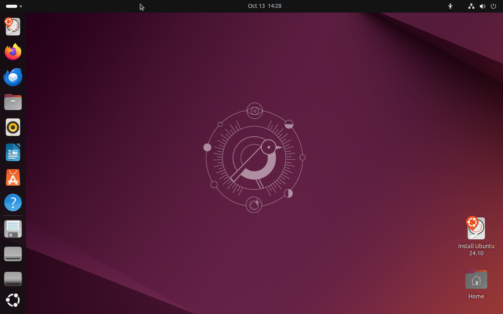{width="90%"}](#){data-modal-type="image" data-modal-url="figures/ubuntu.png"}

[Ubuntu Desktop](https://ubuntu.com/desktop)
:::

- All Linux distributions share a common set of commands and [use bash as the default shell]{.alert}
- Therefore, [all commands we have learnt so far will work on Ubuntu]{.alert}
:::
:::
:::

## Ubuntu server

:::{style="margin-top: 30px; font-size: 21px;"}
:::{.columns}
:::{.column width="50%"}
- While Ubuntu is a complete OS (with a GUI), we will use the [terminal]{.alert} to interact with our instances
- Why should we only use the terminal? 
  - A bare-bones Ubuntu instance is [cheaper]{.alert} and [faster]{.alert} than a full desktop
  - And as you already know, the terminal has [everything you need]{.alert} to manage your instance and run your code
- Again, [all commands are the same]{.alert} (`ls`, `cd`, `pwd`, etc)
- However, you have to use `sudo` to run commands as [root]{.alert} (superuser)
  - This is because [root has full control over the system]{.alert} and can do anything
  - [Be careful with root!]{.alert}
- To install software, use `apt` (Advanced Package Tool)
- `apt update` refreshes the package list
- `apt install` installs a package
:::

:::{.column width="50%"}
:::{style="text-align: center;"}
[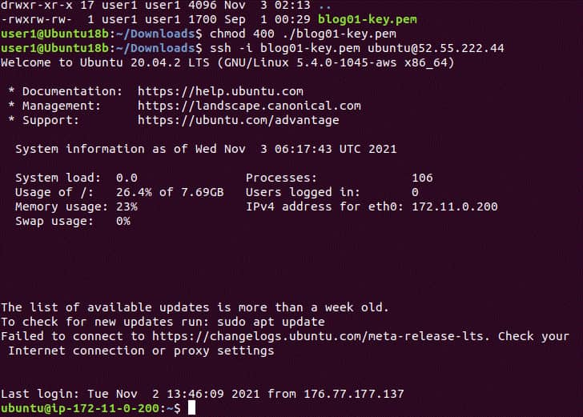{width="100%"}](#){data-modal-type="image" data-modal-url="figures/terminal.jpg"}

[Ubuntu Terminal](https://ubuntu.com/tutorials/command-line-for-beginners)
:::

- `sudo apt install python3` installs Python 3
- `sudo apt install python3-pip` installs [pip](https://pypi.org/project/pip/)
:::
:::
:::

## Windows Subsystem for Linux (WSL)

:::{style="margin-top: 30px; font-size: 24px;"}
:::{.columns}
:::{.column width="50%"}
- [WSL](https://docs.microsoft.com/en-us/windows/wsl/) is nothing but Ubuntu running natively on Windows!
- I hope many of you have already installed it! 😊
- If you work with WSL, [make sure to store your SSH key file in your Ubuntu home directory]{.alert}
- That's because Windows FS does not work well with `chmod 400` (which is required to set the correct permissions on your key file)
- To locate your `/home/user` directory, type `cd ~` and then `pwd` in your WSL terminal
- You can then move your key file there using Windows Explorer or the `mv` command in WSL
:::

:::{.column width="50%"}
:::{style="text-align: center;"}
[{width="100%"}](#){data-modal-type="image" data-modal-url="figures/wsl.jpg"}

[Ubuntu on Windows (WSL)](https://ubuntu.com/wsl)
:::
:::
:::
:::

## Step 01: Launching an EC2 instance

:::{style="margin-top: 30px; font-size: 21px;"}
:::{.columns}
:::{.column width="40%"}
- Now we are ready to launch an [EC2 instance]{.alert}!
- Go to the AWS Console: <https://aws.amazon.com/console/>, sign in, and click on (search for) EC2
- You will see the EC2 Dashboard, with a big orange button saying "Launch Instance"
- Click on it, and you will be taken to the [AMI (Amazon Machine Image)](https://docs.aws.amazon.com/AWSEC2/latest/UserGuide/AMIs.html) selection page
- There, we will choose an Ubuntu AMI (free tier eligible)
 - Amazon has [thousands of AMIs]{.alert} available, including Windows, macOS, and other Linux distributions
 - Many are already pre-configured to run specific software (e.g. [Jupyter](https://jupyter.org/), [TensorFlow](https://www.tensorflow.org/), [Docker](https://www.docker.com/), etc.)
:::

:::{.column width="60%"}
:::{style="text-align: center;"}
[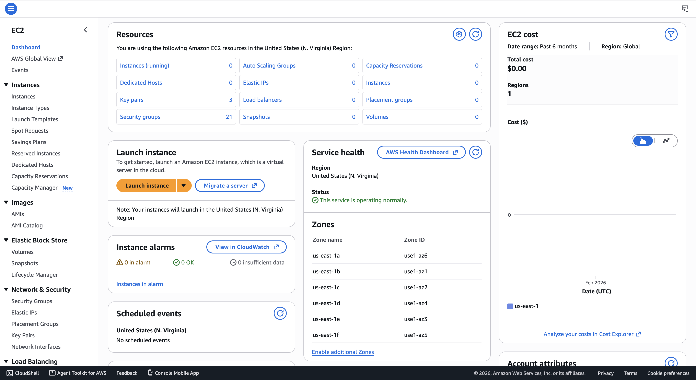{width="100%"}](#){data-modal-type="image" data-modal-url="figures/ec2-dashboard-2026.png"}

:::{style="font-size: 17px;"}
The [EC2 Dashboard](https://us-east-1.console.aws.amazon.com/ec2/home?region=us-east-1#Home:)
:::
:::
:::
:::
:::

## Step 02: Choosing an instance type

:::{style="margin-top: 30px; font-size: 23px;"}
:::{.columns}
:::{.column width="42%"}
- Type a name under `Name and tags`. For example, `datasci350`
- Under `Application and OS Images`, choose [Ubuntu]{.alert}. The console offers the current release, `Ubuntu Server 26.04 LTS`, marked `Free tier eligible`
- Keep `64-bit (x86)` as the architecture
- You can also say how many instances to launch. To start off, [choose 1]{.alert}
- The `Summary` panel on the right lists every choice before you commit to it
- The next slide covers the instance type
- [So far, so good?]{.alert} 😊
:::

:::{.column width="58%"}
:::{style="text-align: center; margin-top: -10px;"}
[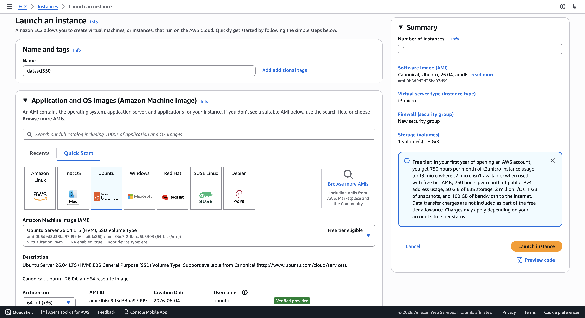{width="100%"}](#){data-modal-type="image" data-modal-url="figures/launch-instance-2026.png"}

:::{style="font-size: 17px;"}
The [launch wizard](https://us-east-1.console.aws.amazon.com/ec2/v2/home?region=us-east-1#LaunchInstanceWizard:). Click the image to read the `Summary` panel
:::
:::
:::
:::
:::

## Which instance type is free?
### The console's own note is out of date

:::{style="margin-top: 25px; font-size: 20px;"}
:::{.columns}
:::{.column width="45%"}
- Choose [`t3.micro`]{.alert}, which carries the `Free tier eligible` label
- The full eligible list for accounts opened after 15 July 2025 is `t3.micro`, `t3.small`, `t4g.micro`, `t4g.small`, `c7i-flex.large` and `m7i-flex.large`
- The dropdown prices every type as you scroll. A `t3.micro` is 2 vCPUs, 1 GiB of memory, and [0.0104 USD an hour]{.alert} on Linux
- If you need more power, you can [change the instance type later]{.alert}

:::{style="background: rgba(230, 57, 70, 0.1); padding: 15px; border-radius: 10px; font-size: 18px; margin-top: 15px;"}
The blue `Free tier` note in the `Summary` panel still describes the old offer: 750 hours a month of `t2.micro` for a year. That offer closed to accounts opened after [15 July 2025]{.alert}. Yours runs on credits, and `t2.micro` is not on your list. Read that note as history
:::
:::

:::{.column width="55%"}
:::{style="text-align: center;"}
[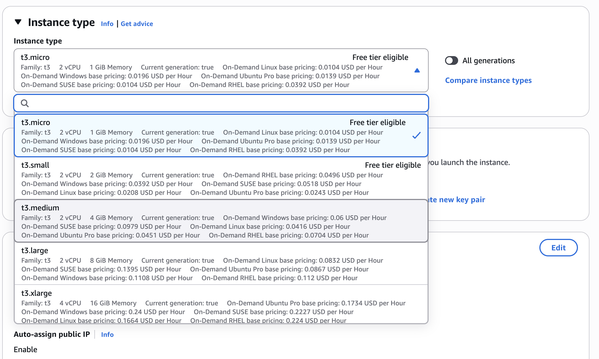{width="100%"}](#){data-modal-type="image" data-modal-url="figures/instance-type-2026.png"}

:::{style="font-size: 17px;"}
The instance type dropdown, with the hourly price under every entry
:::
:::
:::
:::
:::

## Step 03: Choose an SSH key pair 

:::{style="margin-top: 30px; font-size: 21px;"}
:::{.columns}
:::{.column width="40%"}
- Next, you will be asked to choose a [key pair]{.alert}
- You just have to [do it once](https://docs.aws.amazon.com/AWSEC2/latest/UserGuide/ec2-key-pairs.html), and then [you can use the same key pair for all your instances]{.alert}
- A key pair is a pair of cryptographic keys that you use to [authenticate]{.alert} to an instance
- Click on `Create a new key pair` and give it a name (e.g. `datasci350`)
- Choose `ED25519` and `.pem` as the file format
- Click on `Create Key Pair` and [save it to a secure location]{.alert}
- It is important to [keep this key safe and know where it is]{.alert}, as it is the only way to access your instance
:::

:::{.column width="60%"}
:::{style="margin-top: -30px; text-align: center;"}
[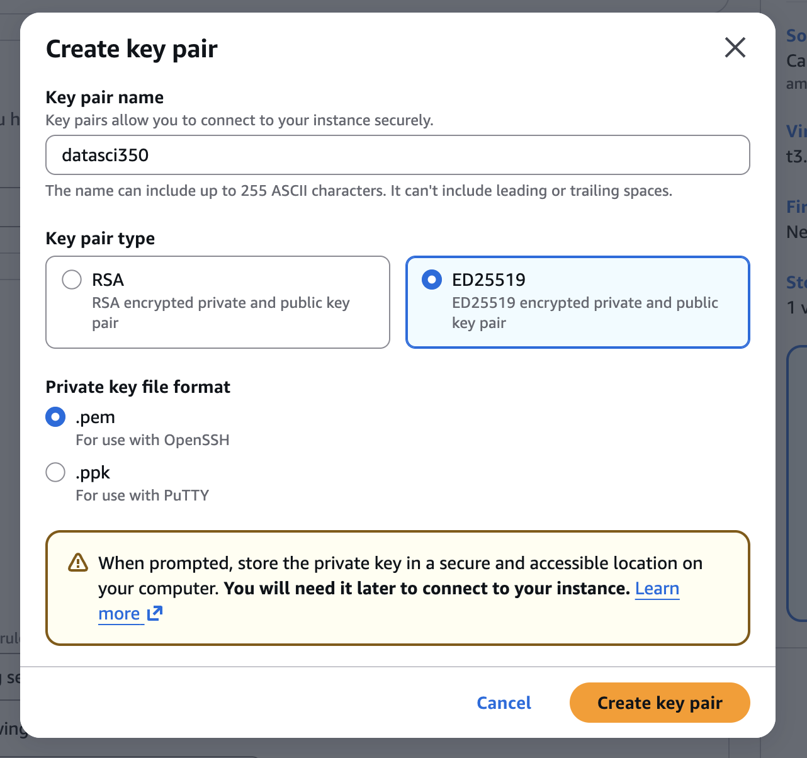{width="88%"}](#){data-modal-type="image" data-modal-url="figures/key-pair-2026.png"}
:::
:::
:::
:::

## Step 04: Check HTTP/HTTPS options

:::{style="margin-top: 30px; font-size: 23px;"}
:::{.columns}
:::{.column width="40%"}
- Under `Network settings`, you may check `Allow HTTPS traffic from the internet` and `Allow HTTP traffic from the internet` so that you can access the web servers hosted on your EC2 VM
- We will allow all traffic for now, but in a production environment, you should [restrict traffic to only what is necessary]{.alert}
- Why so? [Security]{.alert}! The more open ports you have, the more vulnerable your instance is to attacks
- You can always [edit the security group later]{.alert} to add or remove rules
:::

:::{.column width="60%"}
:::{style="text-align: center;"}
[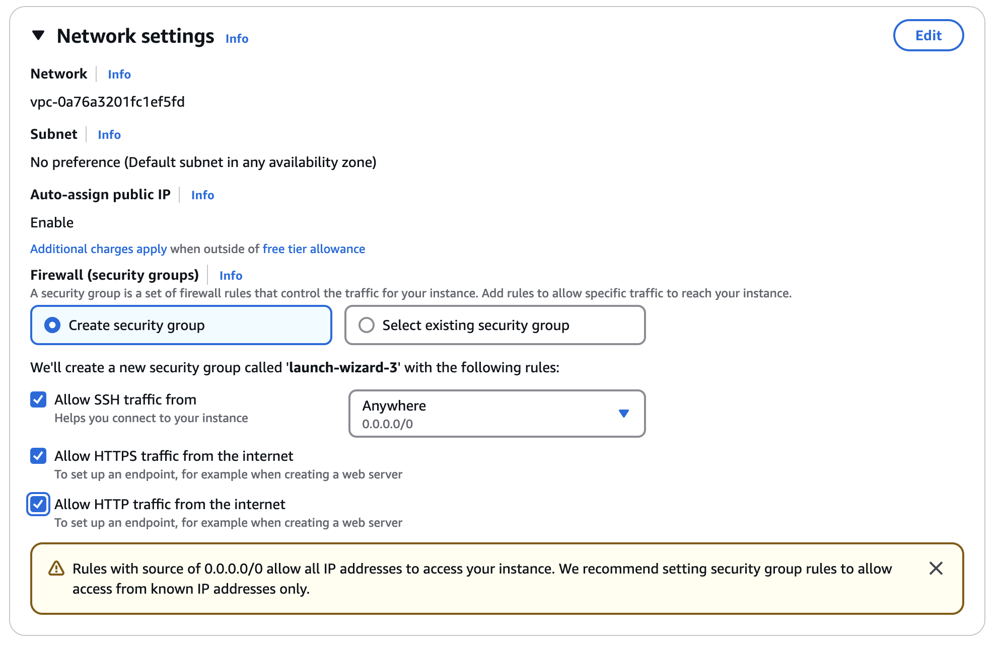{width="100%"}](#){data-modal-type="image" data-modal-url="figures/security-group.png"}
:::
:::
:::
:::

## Step 05: Configure storage

:::{style="margin-top: 30px; font-size: 21px;"}
:::{.columns}
:::{.column width="40%"}
- You may also increase the storage capacity of the `Root` volume under Configure storage
- By default you will be allocated a small 8-GB root disk
- The default 8 GB is enough for everything we do today, and a larger disk spends more of your credits
- You can also add additional volumes if you need more storage
- `gp3` is the default volume type, and it works fine for most use cases
- `io2` is the fastest and most expensive volume type, usually used for high-performance databases (which require millisecond latency)
- If you have data that is not frequently accessed, you can use `sc1` or `st1` for cost savings
:::

:::{.column width="60%"}
:::{style="text-align: center;"}
[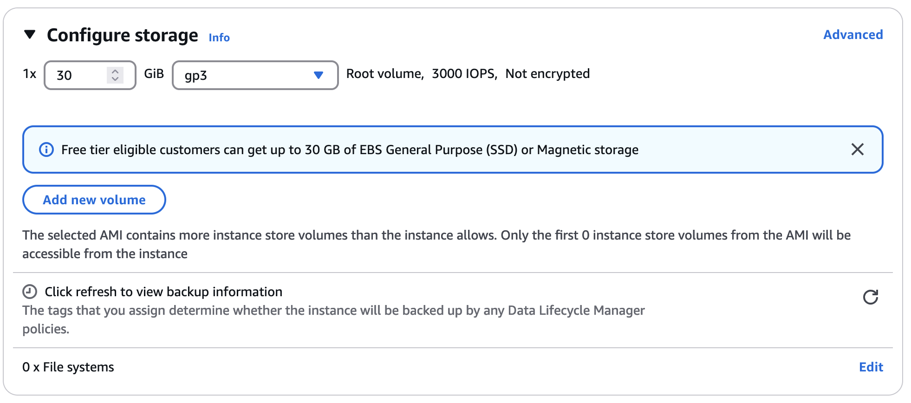{width="100%"}](#){data-modal-type="image" data-modal-url="figures/storage.png"}
:::

- [Now you just have to click on `Launch instance`]{.alert}! 🚀

:::{style="text-align: center;"}
[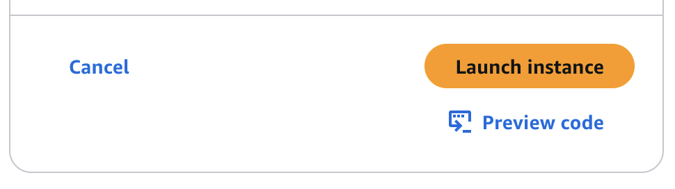{width="90%"}](#){data-modal-type="image" data-modal-url="figures/launch.png"}
:::
:::
:::
:::

## Step 06: Log in to the EC2 instance through SSH

:::{style="margin-top: 30px; font-size: 20px;"}
:::{.columns}
:::{.column width="50%"}
- Once you click on `Launch`, you will be taken to the Instances page
- Click on `Connect to instance` to see the instructions

:::{style="text-align: center;"}
[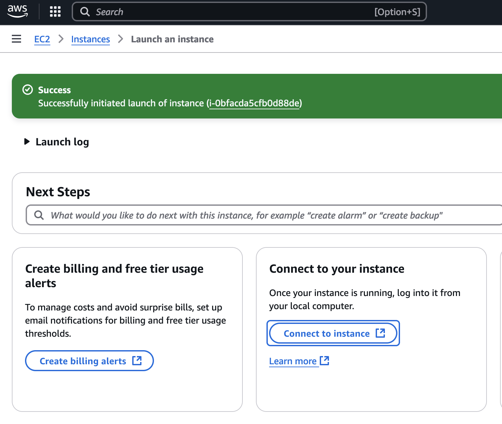{width="100%"}](#){data-modal-type="image" data-modal-url="figures/connect.png"}
:::
:::

:::{.column width="50%"}
- Choose the [`In SSH client`]{.alert} tab to see the commands for your instance
- [Open a terminal]{.alert} on your local machine and go to the directory where you saved the key pair
- AWS writes both commands out for you under `How to connect`. Run step 3, `chmod 400 "your-key.pem"`, then step 4, `ssh -i "your-key.pem" ubuntu@your-public-dns`

:::{style="text-align: center;"}
[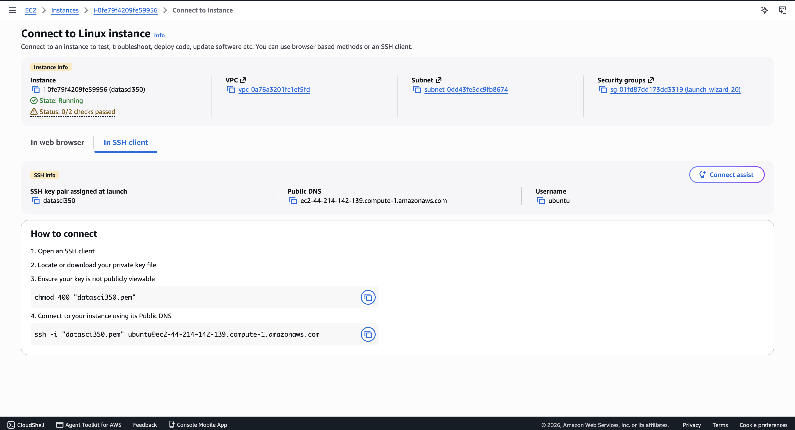{width="100%"}](#){data-modal-type="image" data-modal-url="figures/connect-ssh-2026.png"}
:::
:::
:::
:::

## And you are in! 🎉
### Welcome to the cloud! 🌥️

:::{style="margin-top: 30px; font-size: 24px;"}
:::{.columns}
:::{.column width="58%"}
:::{style="text-align: center; margin-top: -20px;"}
[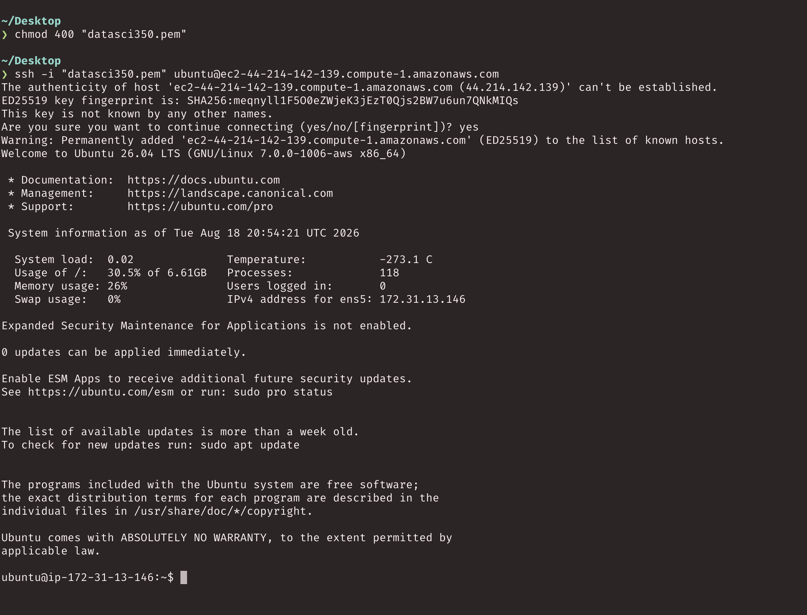{width="100%"}](#){data-modal-type="image" data-modal-url="figures/ssh-session-2026.png"}
:::
:::

:::{.column width="42%"}
- The first connection asks you to confirm the host fingerprint. Type `yes` once, and SSH remembers the machine
- The banner tells you what you rented: [Ubuntu 26.04 LTS]{.alert}, 6.61 GB of disk in use, 118 processes, nobody else logged in
- The prompt changes from your own machine's name to `ubuntu@ip-172-31-13-146`
- Every command you type from here runs on a computer in [Virginia]{.alert}
- Type `exit` to [log out and return to your own machine]{.alert}
:::
:::
:::

## Check the instance details on the AWS Console

:::{style="margin-top: 30px; font-size: 24px;"}
:::{.columns}
:::{.column width="30%"}
- You can click on the instance ID or on the `Instances` link on the left to see the details of your instance
- You can see the [public IP address]{.alert} of your instance, the [instance type]{.alert}, the [security group]{.alert}, the [key pair]{.alert}, and other details
- You can also [stop]{.alert}, [terminate]{.alert}, or [reboot]{.alert} your instance from this page (we will see how to do this later)
:::

:::{.column width="70%"}
:::{style="text-align: center;"}
[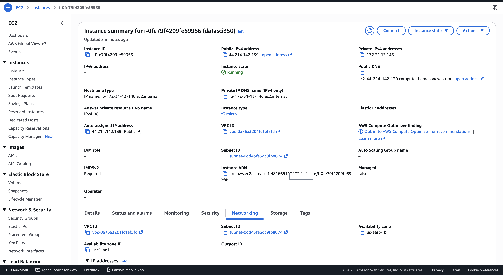{width="100%"}](#){data-modal-type="image" data-modal-url="figures/instance-details-2026.png"}
:::
:::
:::
:::

## AWS CloudShell
### A terminal in the browser, already signed in

:::{style="margin-top: 30px; font-size: 21px;"}
:::{.columns}
:::{.column width="46%"}
- Open it from the [bottom left corner]{.alert} of the console. Nothing to install
- [Amazon Linux 2023]{.alert}: 1 vCPU, 2 GiB of RAM, 1 GB of storage kept between sessions
- Free. You pay only for the AWS resources you drive from it
- The [AWS CLI]{.alert} is installed and signed in as you. No keys to configure
- Also there: `git`, `python3`, `pip`, `boto3`, `jq`, `wget`, `ssh`, `vim`, `nano`, `tmux`
- It is [bash]{.alert}, so `ls`, `cd`, `grep` and `chmod` work as on your laptop
- Sessions end after 20 to 30 idle minutes, or 12 hours. Your home directory goes after 120 unused days
:::

:::{.column width="54%"}
:::{style="text-align: center;"}
[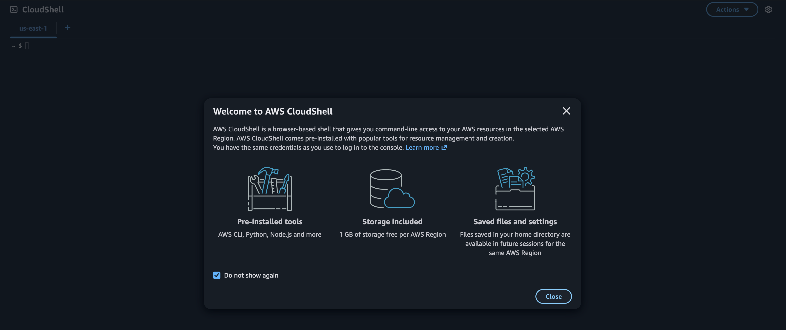{width="100%"}](#){data-modal-type="image" data-modal-url="figures/cloudshell-open-2026.png"}

:::{style="font-size: 17px;"}
The panel you meet on first launch, stating the tools and the 1 GB of storage per region
:::
:::

- I still recommend [your local terminal]{.alert} for this course, so you can write code in your own editor
- CloudShell is the fallback when that is not available
:::
:::
:::

## CloudShell commands
### What is actually new

:::{style="margin-top: 25px; font-size: 20px;"}
:::{.columns}
:::{.column width="52%"}
[Everything from the shell module works unchanged.]{.alert} What is new is the `aws` command line, already signed in as you:

:::{style="text-align: center; margin-top: 30px; margin-bottom: 30px; font-size: 19px;"}
| Command | What it does |
|---|---|
| `aws sts get-caller-identity` | Prints which account and user you are signed in as |
| `aws ec2 describe-instances --output table` | Lists your instances without leaving the browser |
| `aws ec2 stop-instances --instance-ids i-...` | Stops an instance from the command line |
| `aws s3 ls` | Lists your S3 buckets |
| `aws s3 cp report.pdf s3://my-bucket/` | Copies a file into a bucket |
| `sudo dnf install <package>` | Installs software for this session only |
:::

- Amazon Linux uses [`dnf`]{.alert} where Ubuntu uses `apt`, and software installed with it lands in `/usr/bin`, which is wiped when the session ends
- Anything you want to keep goes in your home directory
:::

:::{.column width="48%"}
:::{style="text-align: center;"}
[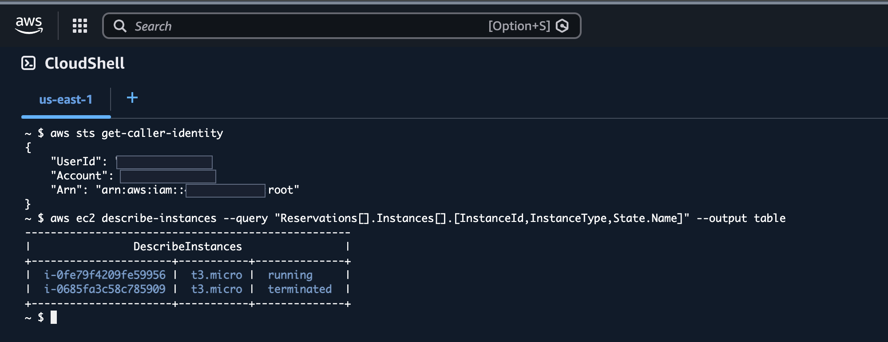{width="100%"}](#){data-modal-type="image" data-modal-url="figures/cloudshell-cli-2026.png"}
:::

:::{style="font-size: 17px;"}
Two `aws` commands and what they return. The account number is blanked out, and `describe-instances` reports one machine running and one already terminated. [More commands here](https://docs.aws.amazon.com/cloudshell/latest/userguide/getting-started.html)
:::
:::
:::
:::

## CloudShell as a way back in
### When your own terminal will not cooperate

:::{style="margin-top: 20px; font-size: 19px;"}
:::{.columns}
:::{.column width="42%"}
- The [WSL problem]{.alert} from earlier: Windows will not apply `chmod 400` to a file sitting in the Windows filesystem, and SSH then refuses the key
- CloudShell sidesteps that, because the key lands on a Linux machine:

1. Open CloudShell from the console.
2. Choose `Actions`, then `Upload file`.
3. Select your `.pem` file. It arrives in `/home/cloudshell-user`.
4. Run `chmod 400 your-key.pem`.
5. Run the same `ssh -i ...` command the console gave you.

- The instance neither knows nor cares that the connection came from a browser tab
:::

:::{.column width="58%"}
:::{style="text-align: center;"}
[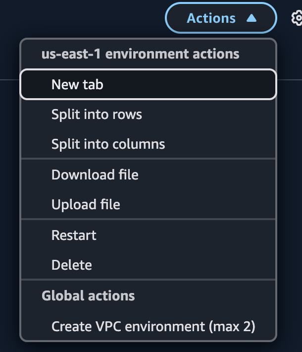{width="18%"}](#){data-modal-type="image" data-modal-url="figures/cloudshell-actions-2026.png"}

[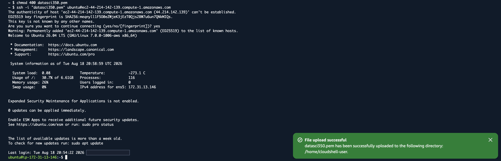{width="92%"}](#){data-modal-type="image" data-modal-url="figures/cloudshell-ssh-2026.png"}

:::{style="font-size: 17px;"}
The whole thing from a browser tab: the upload confirmation, `chmod 400`, and an Ubuntu 26.04 prompt on the instance
:::
:::

- Remember the [20 to 30 minute]{.alert} idle timeout. A CloudShell session that goes quiet takes your SSH connection down with it
:::
:::
:::

## Step 07: Update and install software

:::{style="margin-top: 30px; font-size: 20px;"}
:::{.columns}
:::{.column width="40%"}
- Once you are in, the first thing you should do is to update the package list
- Run `sudo apt update` to refresh the package list
- Then, type `sudo apt upgrade` to install the latest updates
  - You can use the `-y` flag to automatically answer `yes` to all prompts, e.g., `sudo apt update && sudo apt upgrade -y`
- You can also install software using `sudo apt install`
- For example, to install Python 3, run `sudo apt install python3`
- To install pip, run `sudo apt install python3-pip`
- You can also install [Jupyter](https://jupyter.org/) or any other software you need
- And we will be ready to go! 🚀
:::

:::{.column width="60%"}
:::{style="text-align: center;"}
[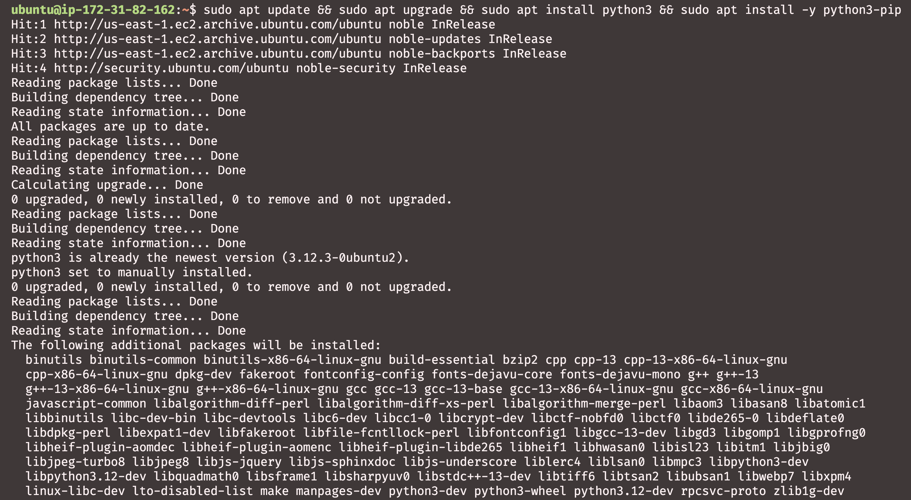{width="100%"}](#){data-modal-type="image" data-modal-url="figures/update.png"}

`sudo apt update && sudo apt upgrade -y && sudo apt install -y python3 && sudo apt install -y python3-pip`
:::

:::{style="background: rgba(230, 57, 70, 0.1); padding: 15px; border-radius: 10px; font-size: 19px; margin-top: 15px;"}
On recent Ubuntu versions, install with `sudo apt install python3-<package>`, or build a virtual environment first with `python3 -m venv env` and `source env/bin/activate`
:::
:::
:::
:::

## Adding files to your instance

:::{style="margin-top: 25px; font-size: 21px;"}
:::{.columns}
:::{.column width="42%"}
- `scp` means "secure copy". It moves files securely
- The `-i` flag stands for "identity file"
- The direction comes from [the order of the two paths. Whichever one you write first is the source]{.alert}

```verbatim
# laptop to instance
scp -i key.pem myfile ubuntu@public-dns:~

# instance to laptop
scp -i key.pem ubuntu@public-dns:~/myfile .
```

- That `.` at the end of the second command means "into the folder I am in right now"
- `scp` also copies [between two remote servers]{.alert}
- [Windows users]{.alert}: [WinSCP](https://winscp.net/eng/index.php) and [PuTTY](https://www.putty.org/) do the same job with a window you can drag files into
:::

:::{.column width="58%"}
- Open a [new local terminal]{.alert}. Do not use the one connected to your instance, because [`scp` runs on your own machine]{.alert}:

:::{style="font-size: 19px;"}
```verbatim
echo "print('Hello, DATASCI350!')" > hello.py
scp -i datasci350.pem hello.py ubuntu@XXXXXX.compute-1.amazonaws.com:~
```
:::

:::{style="text-align: center;"}
[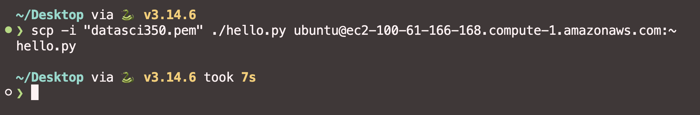{width="100%"}](#){data-modal-type="image" data-modal-url="figures/scp.png"}
:::

- Replace `XXXXXX` with your own public DNS. You will find it on the Instances page
- [Keep the `:~` at the end]{.alert} (home directory)
- Back in your SSH session, `ls` shows that the file arrived and `python3 hello.py` runs it

:::{style="text-align: center; margin-top: -20px;"}
[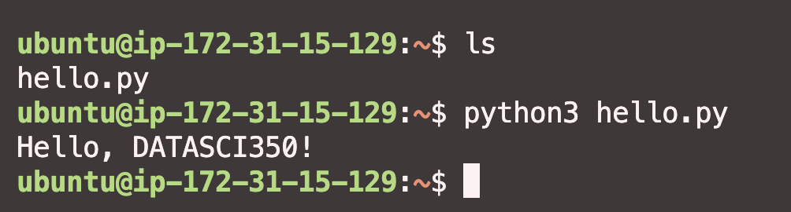{width="58%"}](#){data-modal-type="image" data-modal-url="figures/hello.png"}
:::
:::
:::
:::

## Stopping and terminating your instance

:::{style="margin-top: 25px; font-size: 22px;"}
:::{.columns}
:::{.column width="40%"}
- It is very important to [stop or terminate your instance]{.alert} when you are not using it
- Stopping [pauses]{.alert} the machine. Compute stops costing you anything, and the disk carries on charging
- Terminating [deletes]{.alert} it. Nothing left to pay for, and every file on it is gone
- Stopping also releases the [public IP address]{.alert}. The instance gets a new one when you start it again, and your old `ssh` command stops working
- A `t3.micro` at 0.0104 USD an hour, left running for a month, is [about $7.50]{.alert} of your $100 in credits
- You can stop, terminate or [reboot]{.alert} from the [Instances page]{.alert}
- So let's [terminate]{.alert} our instance now! 🛑
:::

:::{.column width="60%"}
:::{style="text-align: center;"}
[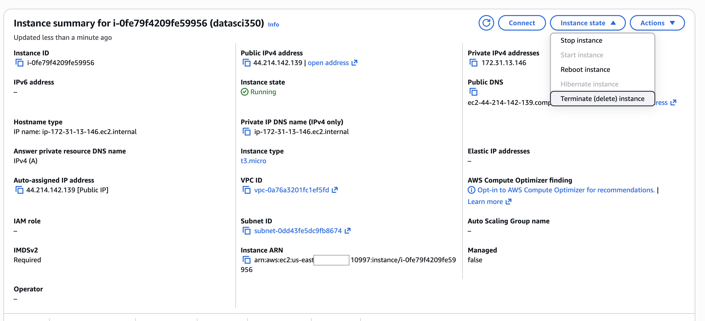{width="100%"}](#){data-modal-type="image" data-modal-url="figures/stop-2026.png"}

:::{style="font-size: 17px;"}
The `Instance state` menu. `Terminate (delete) instance` is the last entry
:::

[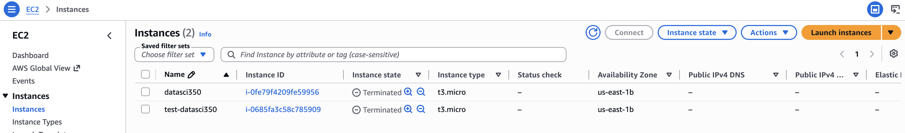{width="100%"}](#){data-modal-type="image" data-modal-url="figures/terminated-2026.png"}

:::{style="font-size: 17px;"}
Afterwards both instances read `Terminated`, and the `Public IPv4 DNS` column is empty. The address is gone
:::
:::
:::
:::
:::

# Now it is your turn! 🚀 {background-color="#1B3A6B"}

## Activity 01

:::{style="margin-top: 20px; font-size: 20px;"}
1. Create an EC2 instance on AWS called `jupyter` (as we did in the previous slides)
2. Connect to your instance [with port forwarding]{.alert} from your local terminal:
    - `ssh -i "<your-key>.pem" ubuntu@<public_IPv4_DNS_address> -L 8000:localhost:8888`
    - The `-L 8000:localhost:8888` part forwards port 8888 on the instance to port 8000 on your machine
3. Update, upgrade, and install Python 3, pip, and Jupyter:
    - `sudo apt update && sudo apt upgrade -y`
    - `sudo apt install -y python3 python3-pip jupyter-notebook`
    - The package is [`jupyter-notebook`]{.alert}, with a hyphen, and it pulls the library in with it. `python3-notebook` on its own gives you the library without the command, and `jupyter notebook` then fails
4. Check that everything is installed: `which python3`, `which pip3`, `which jupyter`
5. Start Jupyter: `jupyter notebook`
6. Open your browser and go to `http://localhost:8000`. Copy the token from the terminal to log in
    - You can also click the link in the terminal (it looks like `http://localhost:8888/?token=...`) and change `8888` to `8000`
7. Create a new notebook and run `print('Hello, DATASCI350!')` (or any other code you like!)
8. [Do not]{.alert} terminate your instance, we will use it later

:::{style="margin-top: 20px;"}
Closing the SSH connection kills Jupyter. `tmux` keeps a session alive across disconnections and `tmux attach` returns to it, but the instance carries on billing for every minute it runs. [More on tmux here](https://linuxize.com/post/getting-started-with-tmux/)
:::
:::

## Activity 01

:::{style="text-align: center; margin-top: 30px;"} 
[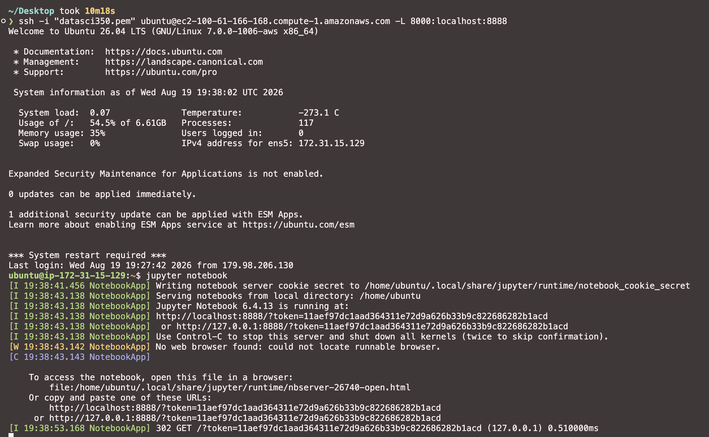{width="85%"}](#){data-modal-type="image" data-modal-url="figures/jupyter.png"}
:::

## Activity 01

:::{style="margin-top: 30px; font-size: 23px; text-align: center;"}
[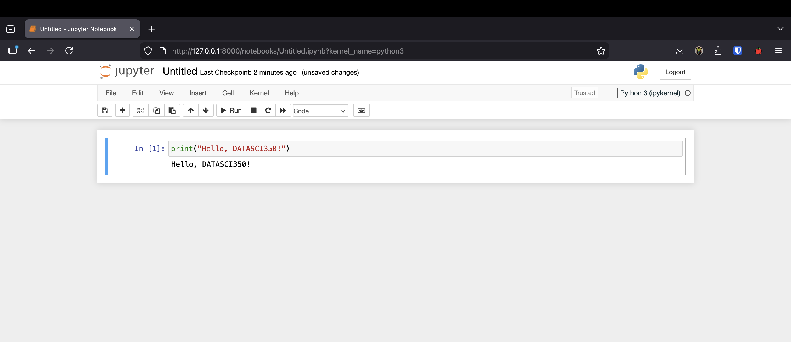{width="100%"}](#){data-modal-type="image" data-modal-url="figures/hello-jupyter.png"}
:::

# Another one? 🚀 {background-color="#1B3A6B"}

## Activity 02

:::{style="margin-top: 30px; font-size: 21px;"}
- Now that you have your EC2 instance running, let's do some data analysis
- We will practise [two ways]{.alert} of getting files onto your instance:
  - **Method 1 (`scp`)**: Create a file on your local machine, then upload it to the instance. Use this when you have files on your own computer that are not available online (e.g., your own datasets, private code)
  - **Method 2 (`wget`)**: Download a file directly from the internet to the instance. Use this when the file is already hosted somewhere (e.g., GitHub, a public dataset URL). This skips your local machine entirely
- First, install the required packages on your instance:
  - `sudo apt install -y python3-numpy python3-pandas python3-matplotlib python3-seaborn`

- **Method 1: local to cloud with `scp`.** On your [local machine]{.alert}, create a weather dataset with the Python code below, or download it here: [weather_data.py](https://github.com/danilofreire/datasci350/blob/main/lectures/lecture-17/weather_data.py)

```python
# weather_data.py
import pandas as pd
import numpy as np
import datetime

# Set seed for reproducibility
np.random.seed(42)

# Generate dates for the past 30 days
dates = pd.date_range(end=datetime.datetime.now(), periods=30).tolist()
dates = [d.strftime('%Y-%m-%d') for d in dates]

# Generate temperature data with some randomness
temp_high = np.random.normal(75, 8, 30)
temp_low = temp_high - np.random.uniform(10, 20, 30)
precipitation = np.random.exponential(0.5, 30)
humidity = np.random.normal(65, 10, 30)

# Create a structured dataset
weather_data = pd.DataFrame({
    'date': dates,
    'temp_high': temp_high,
    'temp_low': temp_low,
    'precipitation': precipitation,
    'humidity': humidity
})

# Save to a text file
with open('weather_data.txt', 'w') as f:
    f.write("# Weather data for the past 30 days\n")
    f.write(weather_data.to_string(index=False))
    
print("Weather data saved to weather_data.txt")
```
:::

## Activity 02

:::{style="margin-top: 30px; font-size: 22px;"}
- Run this script on your [local machine]{.alert}: `python3 weather_data.py`
- It will create a file called `weather_data.txt` with 30 days of weather data
- Now upload it to your EC2 instance using `scp` (from a [local terminal]{.alert}):
  - `scp -i <your-key>.pem weather_data.txt ubuntu@<your-instance-ip>:~/`
- You can verify it arrived by running `ls` on your instance

- **Method 2: internet to cloud with `wget`.** Now let's get the analysis script [directly on the instance]{.alert}, without going through your local machine. Run this on your [EC2 instance]{.alert}:

:::{style="font-size: 20px;"}
- `wget https://raw.githubusercontent.com/danilofreire/datasci350/main/lectures/lecture-17/weather_analysis.py` (one line)
:::

- The code is shown below for reference (you don't need to copy it, `wget` already downloaded it):

```python
# weather_analysis.py
import pandas as pd
import matplotlib.pyplot as plt
import seaborn as sns
from io import StringIO  # Add proper import for StringIO

# Read the weather data
with open('weather_data.txt', 'r') as f:
    lines = f.readlines()

# Skip the header comment
data_str = ''.join(lines[1:])
df = pd.read_csv(StringIO(data_str), sep=r'\s+')  # Fix StringIO import and use raw string for regex

# Print basic statistics
print("Weather Data Analysis:")
print("=====================")
print(f"Number of days: {len(df)}")
print(f"Average high temperature: {df['temp_high'].mean():.1f}°F")
print(f"Average low temperature: {df['temp_low'].mean():.1f}°F")
print(f"Maximum temperature: {df['temp_high'].max():.1f}°F on {df.loc[df['temp_high'].idxmax(), 'date']}")
print(f"Minimum temperature: {df['temp_low'].min():.1f}°F on {df.loc[df['temp_low'].idxmin(), 'date']}")
print(f"Days with precipitation > 1 inch: {len(df[df['precipitation'] > 1])}")

# Create a visualisation
plt.figure(figsize=(12, 6))
sns.set_style("whitegrid")

# Plot temperature range
plt.fill_between(df['date'], df['temp_low'], df['temp_high'], alpha=0.3, color='skyblue')
plt.plot(df['date'], df['temp_high'], marker='o', color='red', label='High Temp')
plt.plot(df['date'], df['temp_low'], marker='o', color='blue', label='Low Temp')

# Add precipitation as bars on a secondary axis
ax2 = plt.twinx()
ax2.bar(df['date'], df['precipitation'], alpha=0.3, color='navy', width=0.5, label='Precipitation')
ax2.set_ylabel('Precipitation (inches)', color='navy')
ax2.tick_params(axis='y', labelcolor='navy')

# Formatting
plt.title('30-Day Weather Report: Temperature Range and Precipitation', fontsize=16)
plt.xticks(rotation=45, ha='right')
plt.ylabel('Temperature (°F)')
plt.legend(loc='upper left')
plt.tight_layout()

# Save the figure
plt.savefig('weather_analysis.png')
print("Analysis complete. Results saved to 'weather_analysis.png'")
```
:::

## Activity 02

:::{style="margin-top: 30px; font-size: 24px;"}
- Both files are now on your instance: `weather_data.txt` (uploaded via `scp`) and `weather_analysis.py` (downloaded via `wget`)
- Run the analysis on your instance: `python3 weather_analysis.py`
- Or, if you prefer, open Jupyter (`jupyter notebook`) and run it there
- Download the resulting image back to your [local machine]{.alert} (using `scp` again, from a local terminal):
  - `scp -i <your-key>.pem ubuntu@<your-instance-ip>:~/weather_analysis.png ./`
- View the image on your local machine
- [Don't forget to terminate your instance when done!]{.alert}

:::{style="margin-top: 15px; background: rgba(45, 69, 99, 0.1); padding: 15px; border-radius: 10px;"}
**Recap**: we used `scp` to move files between your computer and the instance, and `wget` to download files from the internet directly to the instance. Both are useful in different situations!
:::
:::

## Activity 02 Result

:::{style="margin-top: 20px; font-size: 21px;"}
When you run the activity, you should get a weather analysis graph similar to this one:

:::{style="text-align: center;"}
[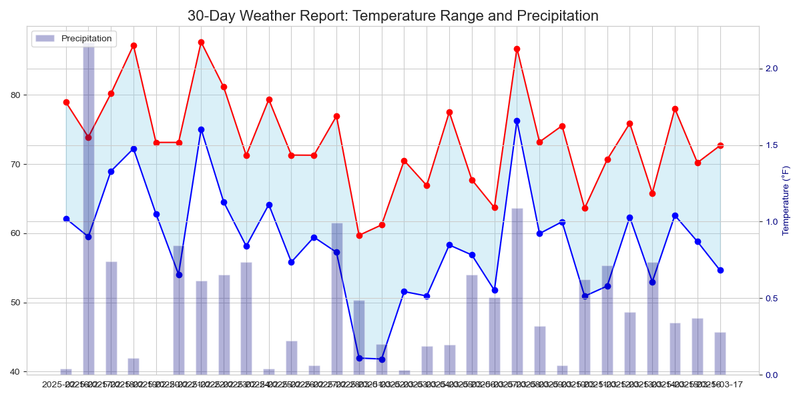{width="80%"}](#){data-modal-type="image" data-modal-url="figures/weather_analysis.png"}
:::
:::

## Activity 02 Result

:::{style="margin-top: 20px; font-size: 27px;"}
You've just completed a full data analysis workflow in the cloud 🎉

1. Created data locally
2. Uploaded it to the cloud
3. Processed it on a cloud server
4. Generated visualisations
5. Downloaded results to your local machine

This workflow is similar to how data scientists use cloud resources for larger datasets and more complex analyses!
:::

# Conclusion {background-color="#1B3A6B"}

## Summary
### What we learned today

:::{style="margin-top: 25px; font-size: 21px;"}
:::{.columns}
:::{.column width="50%"}
- We launched an [EC2]{.alert} instance from the console, with an Ubuntu image and a `t3.micro` type
- We created a [key pair]{.alert} once, and used the same `.pem` file for every connection after that
- We connected over [SSH]{.alert}, updated the machine with `apt`, and installed Python and Jupyter
- We forwarded a port, so a notebook running on the instance opened in the browser on our own laptop
- We moved files two ways: [`scp`]{.alert} from our laptop, and [`wget`]{.alert} straight from the internet
- We met [CloudShell]{.alert}, and the `aws` command line that comes signed in with it
- And we learnt to [stop and terminate]{.alert}, which is the habit that keeps the bill at zero
:::

:::{.column width="50%"}
- This is a small corner of AWS, and the console is worth an hour of browsing on your own
- [Lambda](https://aws.amazon.com/lambda/) runs a function on demand with no server to manage, and it is the easiest thing to try next
- [S3](https://aws.amazon.com/s3/) stores files, [RDS](https://aws.amazon.com/rds/) runs managed databases, and [SageMaker](https://aws.amazon.com/sagemaker/) handles machine learning workflows
- The workflow you practised today is the one used on datasets far larger than a laptop can hold: upload the data, rent a machine, run the code, bring the results home
- The only difference at that scale is the size of the machine and the length of the wait
:::
:::
:::

## Next class
### Getting data from the web

:::{style="margin-top: 25px; font-size: 21px;"}
:::{.columns}
:::{.column width="52%"}
- We leave the cloud and start on how data gets from the internet into your analysis
- [What an API is]{.alert}, and the client and the server on either side of it
- [HTTP]{.alert}: how a URL is put together, query strings, `GET` and `POST`, and what the status codes mean
- [JSON]{.alert}, the format almost every API answers in, and how it maps onto a Python dictionary
- [`requests`]{.alert}, the library that turns all of this into three lines of code
- You have already done this once. The API key you saved in a `.env` file in Lecture 14 was exactly this
:::

:::{.column width="48%"}
:::{style="margin-top: -20px;"}
Before then:

1. Terminate every instance you started today
2. Open [Billing and Cost Management](https://console.aws.amazon.com/billing/home) and check that the total is zero
3. Read the final project instructions here: <https://github.com/danilofreire/datasci350/blob/main/project/project-instructions.pdf>

:::{style="background: rgba(27, 58, 107, 0.08); padding: 15px; border-radius: 10px; font-size: 19px; margin-top: 15px;"}
The final project is out. Groups of three to four, due 8 December 2026. You will pull the data from a web API (the World Bank by default, or another one you clear with me) and submit everything as a Docker container, starting from the starter repository: <https://github.com/danilofreire/datasci350-project-starter>
:::
:::
:::
:::
:::

# And that's all for today! 🎉 {background-color="#1B3A6B"}

# Thank you and see you soon! 🙏 {background-color="#1B3A6B"}