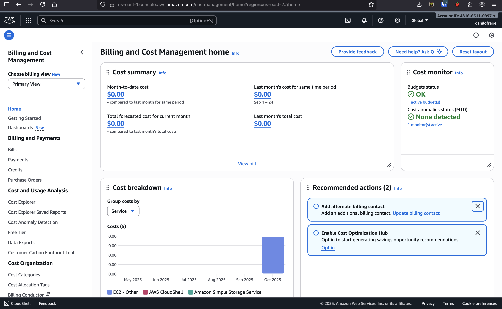
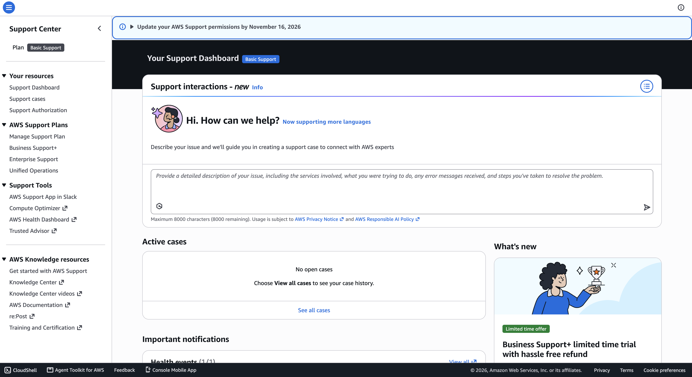
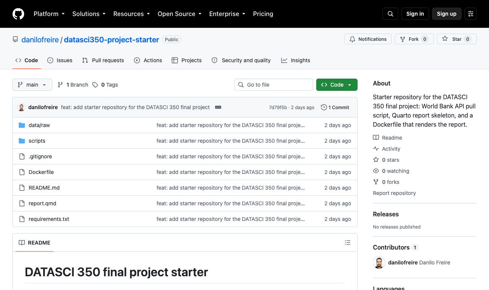
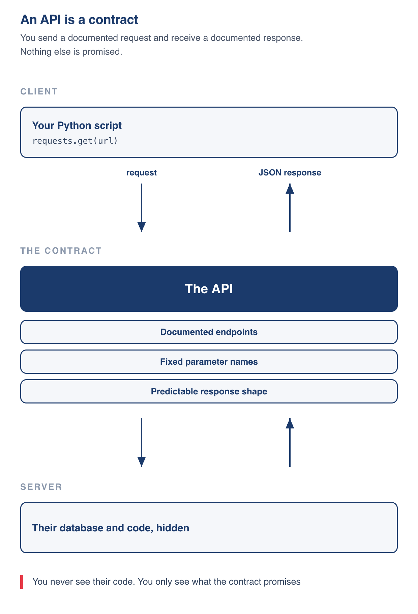
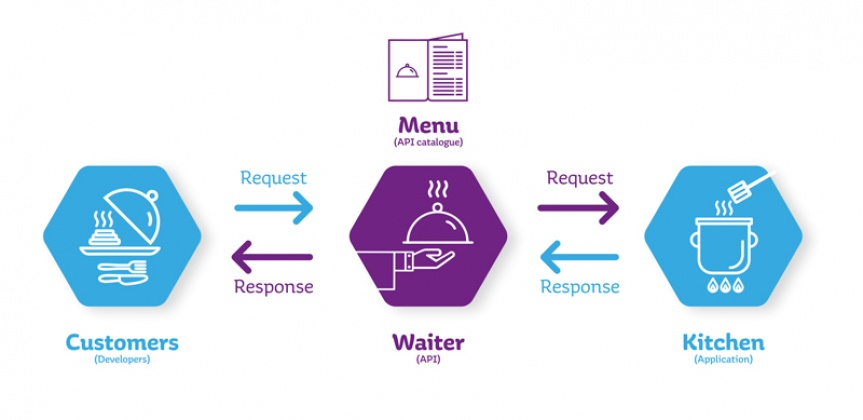
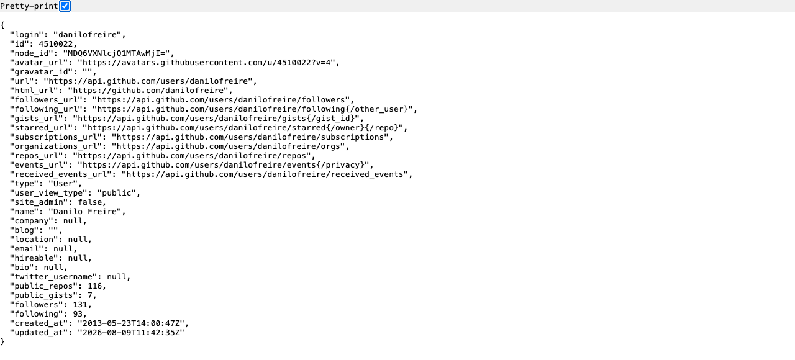
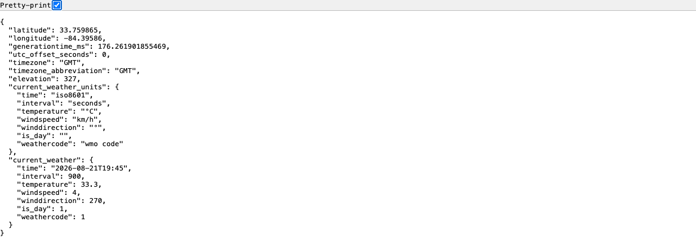
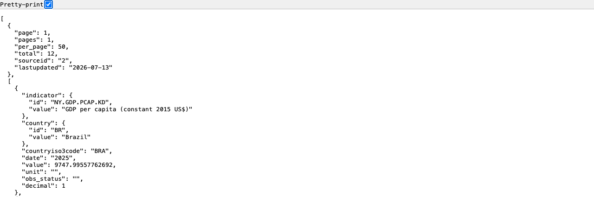
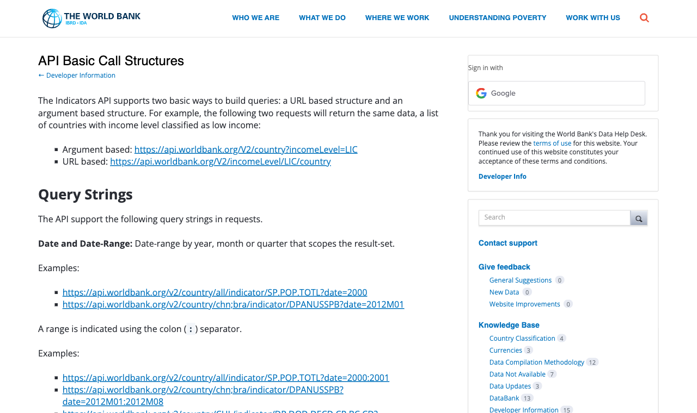

# Hey, there! 😊 <br> I hope you're all doing well! {background-color="#1B3A6B"}

# Brief recap 📚 {background-color="#1B3A6B"}

## Lecture 17: a machine in the cloud
### What we did on AWS last week

:::{style="margin-top: 30px; font-size: 24px;"}
:::{.columns}
::::{.column width="55%"}
- Launched an EC2 [`t3.micro`]{.alert} running Ubuntu Server 26.04, on the free plan ($100 in credits, up to $100 more)
- Created a [key pair]{.alert}, ran `chmod 400` on the private key, and connected with `ssh -i`
- Met [AWS CloudShell]{.alert}, the browser terminal
- Installed software with `apt`
- Moved files with `scp` and `wget`, then forwarded port 8888 so Jupyter on the instance opened in our own browser
- Stopping an instance pauses billing but releases the public IP; terminating erases the machine
- A `t3.micro` left running costs about [$7.50 a month]{.alert}
::::

::::{.column width="45%"}
:::{style="text-align: center; margin-top: -20px;"}
[{width="100%"}](#){data-modal-type="image" data-modal-url="figures/aws-logo.jpeg"}

Source: [K21](https://k21academy.com/aws-cloud/overview-of-amazon-web-services-concepts/)
:::
::::
:::
:::

# A quick reminder! 📢 {background-color="#1B3A6B"}

## Check your AWS account!
### Your instances died last class, now confirm the bill agrees

:::{style="margin-top: 30px; font-size: 24px;"}
:::{.columns}
:::{.column width="40%"}
- Check that no instance you are not using is still running
- [Terminate your EC2 instances](https://docs.aws.amazon.com/AWSEC2/latest/UserGuide/terminating-instances.html) and [delete your S3 buckets](https://docs.aws.amazon.com/AmazonS3/latest/userguide/delete-bucket.html)
- Log in and search for [Billing and Cost Management]{.alert}
- Open the [Billing and Cost Management Dashboard](https://console.aws.amazon.com/billing/home?#/) to see every charge on the account
- We terminated everything together last class, so the total should read zero
:::

:::{.column width="60%"}
:::{style="text-align: center; margin-top: -20px;"}
[{width="100%"}](#){data-modal-type="image" data-modal-url="figures/aws-billing.png"}

Billing and Cost Management Home
:::
:::
:::
:::

## How to contact AWS support if you were charged by mistake
### Five clicks, and the reply usually comes the same day

:::{style="margin-top: 30px; font-size: 24px;"}
:::{.columns}
:::{.column width="40%"}
- A charge you did not expect can be refunded, so ask
- Go to the [AWS Support Center](https://console.aws.amazon.com/support/home)
- Click on `Create case`
- Select `Account and billing support`
- Fill in the form and explain what happened
- Submit the case and wait for a reply (it is usually quick)
- Email me if you get stuck at any of these steps
:::

:::{.column width="60%"}
:::{style="text-align: center; margin-top: -20px;"}
[{width="100%"}](#){data-modal-type="image" data-modal-url="figures/aws-support.png"}

AWS Support Center
:::
:::
:::
:::

## Final project: what you will build
### One pipeline, four steps, two ways to choose your data

:::{style="margin-top: 20px; font-size: 23px;"}
:::{.columns}
::::{.column width="52%"}
- Pull data from a web API with `requests`, then process it with [DuckDB or Polars]{.alert}
- Your pull script saves a snapshot in `data/raw/`; the report reads only that snapshot
- Report in Quarto: 1,500 to 2,500 words, at least two visualisations, visible code
- Ship the whole thing in a [Docker container]{.alert} that anyone can build and run, [code on GitHub]{.alert}
- [Track A]{.alert} (the default): the [World Bank Indicators API](https://datahelpdesk.worldbank.org/knowledgebase/topics/125589), no key, no registration
- [Track B]{.alert}: any public API you clear with me first, free, no OAuth, documented well enough for a classmate to use
- Groups of [three to four]{.alert}; email me the names by [Thursday 5 November]{.alert} or I assign you at random
::::

::::{.column width="48%"}
:::{style="text-align: center;"}
[{width="100%"}](#){data-modal-type="image" data-modal-url="figures/project-starter-2026.png"}

:::{style="font-size: 17px;"}
The starter repository: <https://github.com/danilofreire/datasci350-project-starter>
:::
:::

:::{style="margin-top: 15px; font-size: 21px;"}
- Due [Tuesday 8 December]{.alert}, send the repository link on Canvas
- Full instructions: [project-instructions.pdf](https://github.com/danilofreire/datasci350/blob/main/project/project-instructions.pdf)
:::
::::
:::
:::

## Final project: how it is graded
### Where the 20% goes, and what I do not grade

:::{style="margin-top: 20px; font-size: 24px;"}
:::{.columns}
::::{.column width="50%"}
- The project is worth [20%]{.alert} of your course grade

:::{style="margin-top: 30px; font-size: 28px; margin-bottom: 30px;"}
| Component | Weight |
|---|---|
| Reproducibility | 30% |
| Analysis quality | 30% |
| Communication | 20% |
| Code quality | 10% |
| Git workflow | 10% |
:::

:::{style="margin-top: 15px;"}
- Sophistication is not graded: careful descriptive work is better than a regression you cannot explain
:::
::::

::::{.column width="50%"}
- Every member contributes to the shared repository, and I read the [commit history]{.alert} as the evidence
- [A member with no meaningful contribution receives a zero for the project]{.alert}
- Where the history shows clearly unequal shares, [I adjust individual grades]{.alert}
- Your report ends with a short [contribution statement, which I check against the repository]{.alert}

:::{style="margin-top: 20px; background: rgba(230, 57, 70, 0.1); padding: 15px; border-radius: 10px; font-size: 23px;"}
If `docker run` on my machine does not reproduce your report, your project does not exist 😅
:::
::::
:::
:::

# Today's lecture 📚 {background-color="#1B3A6B"}

## You have already used an API
### Lecture 14, when you talked to a language model

:::{style="margin-top: 20px; font-size: 23px;"}
:::{.columns}
::::{.column width="45%"}
- Think back to [Lecture 14](https://danilofreire.github.io/datasci350/lectures/lecture-14/14-ai.html)
- You created an API key and saved it in a `.env` file
- A few lines of Python sent your prompt to a language model somewhere on the internet
- A reply came back, and you printed it
- That was an [API call]{.alert}, so you have already done this
- Today we take a closer look at what actually happened
- Once you can see the machinery, you can point it at weather, economic indicators, census records, Emory's course catalogue, or anything else that is public!
:::

::::{.column width="55%"}
:::{style="margin-top: 20px; font-size: 22px;"}
```python
# Lecture 14, roughly
import os, requests
from dotenv import load_dotenv

load_dotenv()
key = os.getenv("OPENROUTER_API_KEY")

r = requests.post(
    "https://openrouter.ai/api/v1/chat/completions",
    headers={"Authorization": f"Bearer {key}"},
    json={"model": "...", "messages": [...]},
)
print(r.json())
```

Every piece of this will make sense by the end of the module 😉
:::
:::
:::
:::

## Lecture overview
### What we will cover today

:::{style="margin-top: 20px; font-size: 24px;"}
:::{.columns}
::::{.column width="50%"}
[1. What an API is]{.alert}

- The contract between two programs
- The client-server model you met on EC2
- Why data scientists care

[2. HTTP]{.alert}

- URLs and query strings
- `GET` and `POST`
- Status codes (headers wait for Lecture 19, and [Appendix 05](#sec:appendix05) has a preview)
::::

::::{.column width="50%"}
[3. JSON]{.alert}

- The format almost every API answers in
- How it maps onto Python dictionaries and lists

[4. The `requests` library]{.alert}

- Three lines of code do (most of) what we need
- Some exercises along the way

::::
:::
:::

# What is an API? {background-color="#1B3A6B"}

## An API is a contract
### Ask in this exact way, get an answer in that exact shape

:::{style="margin-top: 20px; font-size: 24px;"}
:::{.columns}
::::{.column width="45%"}
- [API]{.alert} stands for [Application Programming Interface](https://en.wikipedia.org/wiki/Application_programming_interface)
- It is just a [contract between two programs]{.alert}
- The contract says: [if you ask me in exactly this way, I will answer in exactly that way]{.alert}
- For example, [the World Bank](https://documents.worldbank.org/en/publication/documents-reports/api) promises to turn [a URL shaped like this into economic indicators shaped like that](https://worldbank.github.io/template/notebooks/world-bank-api.html)
- Neither side needs to know how the other works internally
- Their database, their programming language, and the location of the machine are all [none of your business]{.alert}
::::

::::{.column width="55%"}
:::{style="text-align: center; margin-top: -30px;"}
[{width="65%"}](#){data-modal-type="image" data-modal-url="figures/api-contract-diagram-vertical.png"}
:::
::::
:::
:::

## The restaurant
### A tired metaphor that happens to be right

:::{style="margin-top: 30px; font-size: 24px;"}
:::{.columns}
::::{.column width="55%"}
- The tired metaphor is a [restaurant]{.alert}, and it is tired because it works 😅
- The [menu]{.alert} is the documentation, telling you what you are allowed to ask for
- Your [order]{.alert} is the request, written in terms the kitchen recognises
- The [dish]{.alert} is the response, arriving in a predictable form
- You never enter the kitchen
- Order something off the menu and you get an error, but never a surprise dish
:::

::::{.column width="45%"}
:::{style="text-align: center; font-size: 18px; margin-top: -30px;"}
[{width="100%"}](#){data-modal-type="image" data-modal-url="figures/api-restaurant-2026.jpg"}

Source: [Manutan](https://www.manutan.com/blog/en/glossary/api-definition-and-application-in-procuremen`r)
:::

:::{style="font-size: 24px; margin-top: 20px;"}
| Restaurant | API |
|---|---|
| Menu | Documentation |
| Order | HTTP request |
| Kitchen | Server |
| Dish | JSON response |
| "We're out of that" | `404 Not Found` |
| "One order per customer" | Rate limit |
:::
:::
:::
:::

## Client and server

:::{style="margin-top: 40px; font-size: 24px;"}
:::{.columns}
::::{.column width="55%"}
- You have played [both roles this semester]{.alert}
- The [client]{.alert} asks: your laptop, your script, your browser
- The [server]{.alert} answers: a machine in a data centre, waiting for requests
- Last week you [launched a server]{.alert} on [EC2](https://aws.amazon.com/ec2/) that sat there waiting for connections
- The [World Bank API](https://datahelpdesk.worldbank.org/knowledgebase/articles/889392-about-the-indicators-api-documentation) is the same idea, run by people with a bigger budget and a better uptime record (hopefully!) 😂
- Again, there's nothing magical about it. [It is someone else's computer](https://aws.amazon.com/ec2/), and you already know what to do 🤓
::::

::::{.column width="45%"}
:::{style="margin-top: -20px;"}
```{mermaid}
%%| fig-width: 6
sequenceDiagram
    participant C as Your laptop
    participant S as api.worldbank.org
    C->>S: GET /v2/country/BRA/...
    Note right of S: look up data
    S-->>C: 200 OK + JSON
    C->>C: parse and analyse
```
:::
::::
:::
:::

## Web APIs specifically
### Two narrowings that make an API a web API

:::{style="margin-top: 20px; font-size: 24px;"}
- "API" is a broad word. `pandas` has an API. Your operating system has an API
- This module is about [web APIs](https://en.wikipedia.org/wiki/Web_API):
  - The request is an [HTTP request to a URL]{.alert}, the same protocol your browser uses
  - The response is usually [JSON]{.alert}, a text format we will meet shortly
- That combination is why [they are everywhere: any language that can fetch a URL and read text can talk to one]{.alert}
- Python, R, JavaScript, and `curl` from the terminal all can do this
- A few terms you will see in documentation:
  - [REST (Representational State Transfer)](https://en.wikipedia.org/wiki/Representational_State_Transfer): a design style where each URL names a resource (`/country/BRA`). Most public data APIs follow it
  - [Endpoint](https://en.wikipedia.org/wiki/Web_API#Endpoints): one specific URL pattern the API offers, such as `/v2/country/{code}/indicator/{code}`
  - [Rate limit](https://en.wikipedia.org/wiki/Rate_limiting): how many requests you may send per unit of time
:::

## Why this matters for data science
### Public data, and the script that goes and gets it

:::{style="margin-top: 20px; font-size: 23px;"}
:::{.columns}
::::{.column width="50%"}
#### The data is already out there

- [The World Bank](https://datahelpdesk.worldbank.org/knowledgebase/topics/125589), [the IMF](https://data.imf.org/en/Resource-Pages/IMF-API), [the US Census Bureau](https://www.census.gov/data/developers/data-sets.html), [the ECB](https://data.ecb.europa.eu/help/api/overview), [Eurostat](https://ec.europa.eu/eurostat/web/main/data/web-services), [NOAA](https://www.ncei.noaa.gov/cdo-web/webservices/v2), and most national statistics offices publish through APIs
- So do [GitHub](https://docs.github.com/en/rest), [Wikipedia](https://www.mediawiki.org/wiki/API:Main_page), and most platforms you use
- [Emory's course catalogue (Atlas)](https://atlas.emory.edu/) is served this way too
- The [World Bank API](https://api.worldbank.org/v2/indicator?format=json) alone exposes [29,544 indicators]{.alert} for 218 countries and territories, going back decades
- Most of this data is free, and a script can assemble exactly the panel you need
::::

::::{.column width="50%"}
#### Scripts are always better than clicking

- A manual download is a story you tell about your data. A script [is]{.alert} your data's history
- Re-run it next year and you get the updated numbers
- Send it to a colleague and they get your exact dataset
- Push it to GitHub and a reviewer can verify every step
- This is ingredient two from [Lecture 10](https://danilofreire.github.io/datasci350/lectures/lecture-10/10-quarto.html), "the raw inputs, or a script that fetches them", made concrete
::::
:::
:::

## Three kinds of API you will meet
### Keyless, key-required, and the ones that send a bill

:::{style="margin-top: 30px; font-size: 21px;"}
:::{.columns}
::::{.column width="60%"}
| Kind | What it costs you | Examples |
|---|---|---|
| [Open and keyless]{.alert} | Nothing. Just fetch the URL | Open-Meteo, World Bank, National Weather Service, USGS earthquakes, GitHub |
| [Free but key-required]{.alert} | A signup form, then a key in every request | NASA, OpenWeatherMap, GitHub for higher limits |
| [Paid]{.alert} | A key and a bill | OpenRouter, most commercial data vendors |

:::{style="margin-top: 30px;"}
- [GitHub answers keyless requests](https://docs.github.com/en/rest/using-the-rest-api/rate-limits-for-the-rest-api), capped at [60 per hour per IP address]{.alert}
- [OpenWeatherMap](https://openweathermap.org/price#one_call) still has a free tier, though it has narrowed over the years
- Today we stay entirely in the first row, so nobody needs an account to follow along
- Keys arrive in Lecture 19, and you have already handled one in Lecture 14
:::
::::

::::{.column width="40%"}
:::{style="text-align: center;"}
[{width="100%"}](#){data-modal-type="image" data-modal-url="figures/github-api-2026.png"}

:::{style="font-size: 19px;"}
`api.github.com/users/danilofreire`, fetched with no key at all (click to enlarge)
:::
:::
::::
:::
:::

# URLs, verbs, and codes {background-color="#1B3A6B"}

## Anatomy of a URL
### Four parts you will see in every request

:::{style="margin-top: 30px; font-size: 25px;"}
- Every API call starts with a URL, and every URL has the same parts
- [Here is a real one](https://api.worldbank.org/v2/country/BRA/indicator/NY.GDP.PCAP.KD?format=json&date=2014:2025), the request we will make later in this lecture
- `NY` = Net Income, `GDP` = Gross Domestic Product, `PCAP` = Per Capita, `KD` = Constant Dollars

:::{style="margin-top: 25px; text-align: center; font-size: 26px; font-family: monospace; line-height: 1.8;"}
[https]{style="color: #1B3A6B; font-weight: bold;"}[://]{style="color: #999;"}[api.worldbank.org]{style="color: #C1272D; font-weight: bold;"}[/v2/country/BRA/indicator/NY.GDP.PCAP.KD]{style="color: #2E7D32; font-weight: bold;"}[?]{style="color: #999;"}[format=json&date=2014:2025]{style="color: #E65100; font-weight: bold;"}
:::

:::{style="margin-top: 30px; font-size: 26px;"}
| Part | Name | What it does |
|---|---|---|
| [https]{style="color: #1B3A6B; font-weight: bold;"} | scheme | Which protocol. Almost always `https` |
| [api.worldbank.org]{style="color: #C1272D; font-weight: bold;"} | host | Which machine to ask |
| [/v2/country/BRA/indicator/...]{style="color: #2E7D32; font-weight: bold;"} | path | Which resource on that machine |
| [format=json&date=2014:2025]{style="color: #E65100; font-weight: bold;"} | query string | Options, as `key=value` pairs joined by `&` |
:::
:::

## Reading the query string
### Everything after the question mark

:::{style="margin-top: 20px; font-size: 23px;"}
:::{.columns}
::::{.column width="52%"}
- The query string starts at the [`?`]{.alert} and never appears before it
- Each option is `key=value`, and options are joined by [`&`]{.alert}

:::{style="margin-left: 50px;"}
```
?format=json&date=2014:2025&per_page=100
 ^^^^^^^^^^ ^^^^^^^^^^^^^^ ^^^^^^^^^^^^
 option 1   option 2       option 3
```
:::

- [Order does not matter.]{.alert} `?a=1&b=2` and `?b=2&a=1` are the same request
- The path says [what]{.alert} you want; the query string says [how you want it]{.alert}
- A value can never hold a raw `?`, `&`, `=`, `/` or space, because those characters already mean something. They are [percent-encoded]{.alert} instead
- Hand-writing that is miserable, so `requests` does it for you
::::

::::{.column width="48%"}
:::{style="margin-top: 10px; font-size: 22px;"}
| You write | It travels as | | You write | It travels as |
|---|---|---|---|---|
| space | `%20` or `+` | | `=` | `%3D` |
| `/` | `%2F` | | `:` | `%3A` |
| `?` | `%3F` | | `#` | `%23` |
| `&` | `%26` | | `%` | `%25` |
:::

:::{style="margin-top: 30px;"}
- They're [always the same:]{.alert} a `%` followed by the character's byte in hexadecimal (remember them? 😉)
- `America/New_York` becomes `America%2FNew_York`, and `2014:2025` becomes `2014%3A2025`
- Full tables and rules: [MDN](https://developer.mozilla.org/en-US/docs/Glossary/Percent-encoding), [W3Schools](https://www.w3schools.com/tags/ref_urlencode.asp), [RFC 3986 §2.1](https://datatracker.ietf.org/doc/html/rfc3986#section-2.1), and Python's [`urllib.parse.quote`](https://docs.python.org/3/library/urllib.parse.html#urllib.parse.quote)
:::
::::
:::
:::

## GET and POST
### Two main verbs

:::{style="margin-top: 20px; font-size: 24px;"}
:::{.columns}
::::{.column width="50%"}
#### `GET`: "please send me this"

- Asking for data, changing nothing
- The whole request fits in the URL
- Your browser sends one every time you visit a page
- Safe to repeat: fetching twice gives you the same thing
- [This is roughly 95% of what you will do in this course]{.alert}
:::

::::{.column width="50%"}
#### `POST`: "here is some data"

- Sending something to the server
- The data travels in the request [body]{.alert}, away from the URL
- Used for logins, uploads, and long inputs
- You already sent one in Lecture 14
- Your prompt went to the model as a `POST` body, because a paragraph of text does not belong in a URL
:::
:::

:::{style="margin-top: 25px;"}
There are [other methods](https://developer.mozilla.org/en-US/docs/Web/HTTP/Reference/Methods) (`PUT`, `DELETE`, `PATCH`). You will rarely need them for reading public data
:::
:::

## Status codes
### How to tell if it worked

:::{style="margin-top: 20px; font-size: 23px;"}
- Every response carries a three-digit number saying how it went
- The first digit is the summary: `2xx` worked, `4xx` you made a mistake, `5xx` they made a mistake

:::{style="font-size: 20px;"}
| Code | Name | What it really means |
|---|---|---|
| [`200`]{style="color: #2E7D32; font-weight: bold;"} | OK | It worked. Go ahead and parse |
| `301` / `302` | Moved | The resource lives elsewhere now. `requests` follows these for you |
| [`400`]{style="color: #E65100; font-weight: bold;"} | Bad Request | Your URL is malformed. Check the query string |
| [`401`]{style="color: #E65100; font-weight: bold;"} | Unauthorized | You need a key, or yours is wrong |
| [`403`]{style="color: #E65100; font-weight: bold;"} | Forbidden | You authenticated but lack permission for this resource |
| [`404`]{style="color: #E65100; font-weight: bold;"} | Not Found | Nothing at that path. Usually a typo |
| [`429`]{style="color: #C1272D; font-weight: bold;"} | Too Many Requests | You are asking too fast. Slow down |
| [`500`]{style="color: #C1272D; font-weight: bold;"} | Internal Server Error | Their problem. Wait and retry |
:::

:::{style="margin-top: 15px; background: rgba(230, 57, 70, 0.1); padding: 15px; border-radius: 10px; font-size: 19px;"}
Some APIs answer errors with [`200`]{.alert} and hide the failure in the body. The World Bank does this, so a status check alone is not enough (more on this later)
:::
:::

## Try it in the browser first
### The address bar is an HTTP client you already know

:::{style="margin-top: 20px; font-size: 20px;"}
:::{.columns}
::::{.column width="45%"}
- Before writing any code, [paste the URL into your browser's address bar]{.alert} ([click here to try it](https://api.open-meteo.com/v1/forecast/?latitude=33.75&longitude=-84.39&current=temperature_2m))
- Your browser sends the `GET` for you and shows you the raw response
- JSON on screen means your URL is right and the problem is in your Python
- An error on screen means your URL is wrong, and no amount of Python will fix it
- This one habit will save you hours of debugging this semester
- The terminal does the same job, and you already know `curl` from Module 02:

```bash
curl -s \
  "https://api.open-meteo.com/v1/forecast\
?latitude=33.75&longitude=-84.39\
&current=temperature_2m" \
  | python3 -m json.tool
```

- `-s` hides the progress meter, and `python3 -m json.tool` pretty-prints the result
:::

::::{.column width="55%"}
:::{style="text-align: center;"}
[{width="100%"}](#){data-modal-type="image" data-modal-url="figures/openmeteo-browser-2026.png"}

:::{style="font-size: 17px;"}
Open-Meteo answering a plain `GET` from the address bar, no code involved
:::
:::
:::
:::
:::

## Try it yourself! 🤓 {#sec:exercise01}
### Five minutes, in the browser. Do everything manually!

:::{style="margin-top: 30px; font-size: 22px;"}
:::{.columns}
::::{.column width="55%"}
1. Open the [Open-Meteo documentation](https://open-meteo.com/en/docs#api_documentation). Scroll down for more information. The API is free
2. Start from the base URL `https://api.open-meteo.com/v1/forecast`
3. Find the parameters that ask for the [current temperature]{.alert}. Two are required for any request, and one more asks for current conditions
4. Use Atlanta's coordinates: latitude `33.75`, longitude `-84.39`
5. [Write the query string yourself. Do not copy the full URL from the documentation]{.alert}
6. Paste your URL into the browser address bar and press Enter
7. Change the coordinates to another city and reload the page
::::

::::{.column width="45%"}
:::{style="margin-top: -15px;"}
[What to look for]{.alert}

- A page of JSON, with a temperature somewhere inside it
- The units the API reports back alongside the number
- A different temperature once the coordinates change

:::{style="margin-top: 25px; background: rgba(27, 58, 107, 0.08); padding: 15px; border-radius: 10px; font-size: 20px;"}
Stuck, or want to compare your URL with mine?

[[Appendix 01]{.button}](#sec:appendix01)
:::
:::
::::
:::
:::

# JSON 📦 {background-color="#1B3A6B"}

## What JSON is
### Plain text that every language can read

:::{style="margin-top: 20px; font-size: 23px;"}
:::{.columns}
::::{.column width="50%"}
- [JSON]{.alert} means [JavaScript Object Notation](https://en.wikipedia.org/wiki/JSON), and the name records its origin, [nothing about where it is used today](https://www.geeksforgeeks.org/javascript/json-vs-javascript-object/)
- It is [plain text]{.alert}, so any editor opens it
- It is built from key-value pairs and lists, nested as deeply as the data needs
- Almost every web API answers in it, because [every language can read it]{.alert}
- [JSON is limited to pure data only]{.alert}: no programming logic, functions or classes

```json
{
  "city": "Atlanta",
  "temperature": 29.6,
  "raining": false,
  "sensors": ["a1", "b2"],
  "last_checked": null
}
```
::::

::::{.column width="50%"}
:::{style="margin-top: -15px;"}
It maps almost perfectly onto Python

| JSON | Python |
|---|---|
| `{...}` object | `dict` |
| `[...]` array | `list` |
| `"text"` | `str` |
| `42`, `3.14` | `int`, `float` |
| `true` / `false` | `True` / `False` |
| `null` | `None` |

:::{style="margin-top: 20px;"}
JSON keys are [always strings in double quotes]{.alert}, and JSON allows no trailing commas
:::
:::
::::
:::
:::

## Reading JSON in Python
### `json.loads()` turns text into a dictionary

:::{style="margin-top: 20px; font-size: 23px;"}
:::{.columns}
::::{.column width="56%"}
The [`json` module](https://docs.python.org/3/library/json.html) ships with Python, so there is nothing to install

```python
import json

text = '''{"city": "Atlanta",
 "temperature": 29.6, "raining": false}'''

# json.loads() reads a string
# The 's' in 'loads' is for 'string'
data = json.loads(text)

print(type(data))
print(data["city"], data["temperature"])
print(data["raining"], type(data["raining"]))
```

```text
<class 'dict'>
Atlanta 29.6
False <class 'bool'>
```
::::

::::{.column width="44%"}
:::{style="margin-top: 20px;"}
- [`json.loads(text)`]{.alert} reads a string of JSON into Python objects
- [`json.load(file)`]{.alert} does the same from an open file
- What comes back is an ordinary `dict`, so square brackets get you in
- JSON `false` arrives as a real Python `False`, never the text `"false"`
- Once it is a dict, it is plain Python, with no new syntax to learn
:::
::::
:::
:::

## An annotated example
### What Open-Meteo sent back when this slide was built

:::{style="margin-top: 20px; font-size: 22px;"}
:::{.columns}
::::{.column width="56%"}
The saved reply, printed with indentation so the nesting is visible

:::{style="font-size: 19px;"}
```python
import json

with open("data/openmeteo_atlanta.json") as f:
    weather = json.load(f)

print(json.dumps(weather, indent=2)[:560])
```
:::

:::{style="font-size: 14px;"}
```text
{
  "latitude": 33.759865,
  "longitude": -84.39586,
  "generationtime_ms": 0.06091594696044922,
  "utc_offset_seconds": -14400,
  "timezone": "America/New_York",
  "timezone_abbreviation": "GMT-4",
  "elevation": 316.0,
  "current_units": {
    "time": "iso8601",
    "interval": "seconds",
    "temperature_2m": "\u00b0C",
    "relative_humidity_2m": "%",
    "wind_speed_10m": "km/h"
  },
  "current": {
    "time": "2026-08-21T16:00",
    "interval": 900,
    "temperature_2m": 33.2,
    "relative_humidity_2m": 42,
    "wind_speed_10m": 4.4
  }
}
```
:::
::::

::::{.column width="44%"}
:::{style="margin-top: 20px; font-size: 22px;"}
- The top level is a dict, and [`current`]{.alert} holds another dict inside it
- [`current_units`]{.alert} names the unit of every field, so nobody has to guess whether 33.2 is Celsius or Fahrenheit
- `time` is a [string]{.alert}, because JSON has no date type. Parsing it is your job
- The coordinates that come back are not the ones we asked for: the API snaps to its own grid
- We fetched this once and saved it, so the lecture does not depend on the weather
- [`json.dumps()`](https://docs.python.org/3/library/json.html#json.dumps) converts a Python object back to JSON text, and `indent=2` makes it readable
:::
::::
:::
:::

## Digging into nested JSON
### Chained lookups, read left to right

:::{style="margin-top: 20px; font-size: 22px;"}
:::{.columns}
::::{.column width="56%"}
Nested data means chained lookups, and every step on the way is printable

```python
# One step at a time
current = weather["current"]
print(current)

# The whole path at once
print(weather["current"]["temperature_2m"],
      weather["current_units"]["temperature_2m"])
```

```text
{'time': '2026-08-21T16:00', 'interval': 900,
 'temperature_2m': 33.2, 'relative_humidity_2m': 42,
 'wind_speed_10m': 4.4}
33.2 °C
```
::::

::::{.column width="44%"}
:::{style="margin-top: 20px;"}
- When a path fails, print the step before it and look at what you really have
- [`data.keys()`]{.alert} lists the keys available at one level
- Use [`.get("key")`]{.alert} where a key might be missing, and get `None` instead of `KeyError`
- The number and its unit sit in different branches of the same response
:::

:::{style="margin-top: 20px; background: rgba(230, 57, 70, 0.1); padding: 15px; border-radius: 10px; font-size: 20px;"}
`KeyError: 'temperature'` means no such key at that level. Print the level and read the spelling the API uses
:::
::::
:::
:::

## The World Bank's little surprise
### Metadata first, data second, inside a two-element list

:::{style="margin-top: 20px; font-size: 21px;"}
:::{.columns}
::::{.column width="52%"}
Not every API answers with a tidy dict at the top

:::{style="font-size: 19px;"}
```python
with open("data/wb_gdp_bra.json") as f:
    wb = json.load(f)

print("Top level is a", type(wb).__name__,
      "with", len(wb), "elements")
print("Element 0 (metadata):", wb[0])
print("Element 1 is a", type(wb[1]).__name__,
      "with", len(wb[1]), "records")
print("First record:", json.dumps(wb[1][0], indent=2))
```
:::

:::{style="font-size: 15px;"}
```text
Top level is a list with 2 elements
Element 0 (metadata): {'page': 1, 'pages': 1,
'per_page': 100, 'total': 12, 'sourceid': '2',
'lastupdated': '2026-07-13'}
Element 1 is a list with 12 records
First record: {
  "indicator": {
    "id": "NY.GDP.PCAP.KD",
    "value": "GDP per capita (constant 2015 US$)"
  },
  "country": {
    "id": "BR",
    "value": "Brazil"
  },
  "countryiso3code": "BRA",
  "date": "2025",
  "value": 9747.99557762692,
  [...]
}
```
:::
::::

::::{.column width="48%"}
:::{style="margin-top: 20px; font-size: 21px;"}
- Element 0 is a [metadata]{.alert} object: `page`, `pages`, `per_page`, `total`, `lastupdated`
- Element 1 is the [data]{.alert} list, holding one dict per year
- Records come back newest first, so `wb[1][0]` is the 2025 observation
- `lastupdated` tells you when the World Bank last revised the series

:::{style="text-align: center; margin-top: -10px;"}
[{width="100%"}](#){data-modal-type="image" data-modal-url="figures/worldbank-response-2026.png"}

:::{style="font-size: 17px;"}
The same two elements in the browser: the metadata object, then the opening bracket of the data list
:::
:::
:::
::::
:::
:::

## Why that matters
### Look at the shape before you write the parsing code

:::{style="margin-top: 20px; font-size: 23px;"}
:::{.columns}
::::{.column width="55%"}
Assume a plain list of records, write `wb[0]["value"]`, and you get a confusing error or a wrong number

```python
print(wb[1][0]["country"]["value"],
      wb[1][0]["date"],
      round(wb[1][0]["value"], 2))
```

```text
Brazil 2025 9748.0
```

:::{style="margin-top: 20px;"}
A real value lives at `wb[1][0]["value"]`: element 1 for the data, `[0]` for the newest record, `["value"]` for the number
:::
::::

::::{.column width="45%"}
:::{style="margin-top: 20px;"}
- Print the top-level type, then the keys, then the first record
- Thirty seconds of looking saves an hour of guessing
- [This is the most useful habit in the whole module]{.alert}
- Chains this long get tedious fast, and Lecture 19 hands the job to pandas
:::
::::
:::
:::

## Try it yourself! 🤓 {#sec:exercise02}
### Five minutes, with plain indexing

:::{style="margin-top: 20px; font-size: 21px;"}
:::{.columns}
::::{.column width="55%"}
A response from a fictional course API:

```json
{
  "department": "Data and Decision Sciences",
  "term": "Fall 2026",
  "courses": [
    {"code": "DATASCI 350",
     "title": "Data Science Computing",
     "enrolled": 40,
     "instructor": {"name": "Danilo Freire",
                    "office": "PAIS 480"}},
    {"code": "DATASCI 101",
     "title": "Introduction to AI Applications",
     "enrolled": 65,
     "instructor": {"name": "Danilo Freire",
                    "office": "PAIS 480"}}
  ],
  "updated": null
}
```
::::

::::{.column width="45%"}
1. Copy the JSON into a Python string
2. Read it with `json.loads()`
3. Print the [title of the second course]{.alert}
4. Print the [office of the instructor of the first course]{.alert}
5. Print the [total enrolment]{.alert} across both courses
6. Print `updated` and its type
7. Use indexing only. The first two need no loop

:::{style="margin-top: 20px; background: rgba(27, 58, 107, 0.08); padding: 15px; border-radius: 10px; font-size: 20px;"}
Stuck, or want to compare your code with mine?

[[Appendix 02]{.button}](#sec:appendix02)
:::
::::
:::
:::

# The `requests` library 🐍 {background-color="#1B3A6B"}

## The happy path
### Six lines from a URL to a live number

:::{style="margin-top: 20px; font-size: 23px;"}
:::{.columns}
::::{.column width="56%"}
`requests` is not in the standard library, so install it once with `pip install requests`

More information here: <https://github.com/psf/requests>

```python
import requests

url = ("https://api.open-meteo.com/v1/forecast"
       "?latitude=33.75&longitude=-84.39"
       "&current=temperature_2m")

r = requests.get(url)

print(r.status_code)
data = r.json()           # JSON into Python objects
print(data["current"]["temperature_2m"])
```

```text
200
33.2
```
::::

::::{.column width="44%"}
:::{style="margin-top: 20px;"}
- [`r.status_code`]{.alert} is the number from the status-code slide
- [`r.json()`]{.alert} runs `json.loads(r.text)` for you
- [`r.text`]{.alert} hands you the raw body when the answer is not JSON
- No key, no account, no setup: [this URL answers anyone!]{.alert} 😎
- The reading is live, so your temperature will differ from mine
:::
::::
:::
:::

## Let `requests` build the URL
### Pass a dictionary and stop gluing strings

:::{style="margin-top: 20px; font-size: 23px;"}
:::{.columns}
::::{.column width="56%"}
Hand `requests` a [`params`]{.alert} dictionary and it writes the query string for you

```python
import requests

params = {
    "latitude": 33.75,
    "longitude": -84.39,
    "current": "temperature_2m,wind_speed_10m",
    "timezone": "America/New_York",
}

r = requests.get("https://api.open-meteo.com/v1/forecast",
                 params=params)
print(r.url)
```

```text
https://api.open-meteo.com/v1/forecast?latitude=
33.75&longitude=-84.39&current=temperature_2m%2C
wind_speed_10m&timezone=America%2FNew_York
```
::::

::::{.column width="44%"}
:::{style="margin-top: 20px;"}
- [Encoding]{.alert}: the comma became `%2C` and the slash became `%2F`, with no work from you
- [Readability]{.alert}: a dict shows the options one per line; a 140-character string hides them
- [Reusability]{.alert}: change one value inside a loop instead of rebuilding the string
- Numbers go in as numbers, and `requests` turns them into text
- `r.url` shows exactly what was sent, which makes it a debugging tool
:::
::::
:::
:::

## Check before you parse
### `raise_for_status()`, and the failure it cannot see

:::{style="margin-top: 20px; font-size: 19px;"}
:::{.columns}
::::{.column width="52%"}
`r.json()` on an error page raises a confusing exception, because an error page is not JSON

```python
r = requests.get(url, params=params, timeout=10)
r.raise_for_status()     # raises on 4xx and 5xx
data = r.json()
```

A friendlier version for scripts other people will run:

```python
try:
    r = requests.get(url, params=params, timeout=10)
    r.raise_for_status()
    data = r.json()
except requests.exceptions.HTTPError as e:
    print(f"The server said no: {e}")
except requests.exceptions.RequestException as e:
    print(f"Could not reach the server: {e}")
```

- Always pass [`timeout`]{.alert}. Without it a silent server hangs your script indefinitely
- `HTTPError` means a status you did not want; `RequestException` means you never got one
::::

::::{.column width="48%"}
The World Bank retired the old CO2 indicator, and this is how it says so:

```python
url = ("https://api.worldbank.org/v2/country/BRA"
       "/indicator/EN.ATM.CO2E.PC")

r = requests.get(url, params={"format": "json"},
                 timeout=10)
print(r.status_code)
print(r.text[:110])
```

```text
200
[{"message":[{"id":"175","key":"Invalid format",
"value":"The indicator was not found. It may have
been deleted
```

:::{style="margin-top: 15px; background: rgba(230, 57, 70, 0.1); padding: 15px; border-radius: 10px; font-size: 19px;"}
The status is [`200`]{.alert}, so `raise_for_status()` passes and `r.json()` succeeds. Check the shape of the body as well, every time
:::
::::
:::
:::

## Worked example: World Bank GDP per capita
### Country and indicator in the path, options in the query string

:::{style="margin-top: 20px; font-size: 22px;"}
:::{.columns}
::::{.column width="56%"}
Twelve years of Brazilian GDP per capita, in one request

```python
import requests, json

country   = "BRA"
# GDP per capita, constant 2015 US$
indicator = "NY.GDP.PCAP.KD"
url = ("https://api.worldbank.org/v2"
       f"/country/{country}/indicator/{indicator}")

params = {"format": "json", "date": "2014:2025",
          "per_page": 100}

r = requests.get(url, params=params, timeout=10)
r.raise_for_status()
wb = r.json()

with open("data/wb_gdp_bra.json", "w") as f:
    json.dump(wb, f)

print(r.status_code, wb[0]["total"], "records saved")
```

```text
200 12 records saved
```
::::

::::{.column width="44%"}
:::{style="margin-top: 20px;"}
- [`format=json`]{.alert} is not optional. Leave it out and the World Bank sends XML
- `date` takes a range with a colon: `2014:2025`
- `per_page=100` asks for the whole range in one page, so there is nothing to paginate
- Building `url` from two variables makes the next country a one-word edit
- The count comes from the metadata element, before anything is parsed
:::
::::
:::
:::

## Worked example, continued
### Turning the two-element response into a readable series

:::{style="margin-top: 20px; font-size: 19px;"}
:::{.columns}
::::{.column width="56%"}
Unpack the two elements, then sort the records oldest first

```python
with open("data/wb_gdp_bra.json") as f:
    wb = json.load(f)

meta, records = wb[0], wb[1]
print(f"{meta['total']} records, "
      f"page {meta['page']} of {meta['pages']}\n")

# Build a list of (year, value) pairs, oldest first
series = [(int(r["date"]), r["value"]) for r in records]
series.sort()

for year, value in series:
    print(f"  {year}  {value:>10,.0f} US$")
```

:::{style="font-size: 15px;"}
```text
12 records, page 1 of 1

  2014       9,338 US$
  2015       8,936 US$
  2016       8,578 US$
  2017       8,628 US$
  2018       8,722 US$
  2019       8,771 US$
  2020       8,435 US$
  2021       8,799 US$
  2022       9,032 US$
  2023       9,288 US$
  2024       9,567 US$
  2025       9,748 US$
```
:::
::::

::::{.column width="44%"}
:::{style="margin-top: 20px; font-size: 22px;"}
- `meta, records = wb[0], wb[1]` gives the two halves names you can read
- `int(r["date"])` matters: the API sends years as strings, and strings sort oddly
- `page 1 of 1` says the whole range arrived, with nothing waiting on a second page
- `{value:>10,.0f}` right-aligns the number, adds thousands separators, and drops the decimals
- Pagination arrives in Lecture 19, for ranges too big for one page
:::
::::
:::
:::

## Worked example, one step further
### A list of tuples is one line from a DataFrame

:::{style="margin-top: 20px; font-size: 22px;"}
:::{.columns}
::::{.column width="56%"}
You already know pandas, so the analysis starts here

```python
import pandas as pd

df = pd.DataFrame(series, columns=["year", "gdp_per_capita"])
df["change_pct"] = df["gdp_per_capita"].pct_change() * 100

print(df.round(2).to_string(index=False))
```

```text
 year  gdp_per_capita  change_pct
 2014         9338.34         NaN
 2015         8936.20       -4.31
 2016         8577.84       -4.01
 2017         8628.25        0.59
 2018         8722.34        1.09
 2019         8771.44        0.56
 2020         8435.01       -3.84
 2021         8799.23        4.32
 2022         9032.08        2.65
 2023         9288.03        2.83
 2024         9566.75        3.00
 2025         9748.00        1.89
```
::::

::::{.column width="44%"}
:::{style="margin-top: 20px;"}
- `pd.DataFrame` reads a list of tuples as rows, and `columns` names them
- [`pct_change()`]{.alert} compares each row with the one above, so 2014 has no answer and prints `NaN`
- Output falls in three years: 2015 and 2016 in the recession, 2020 in the pandemic
- Recovery took until 2024 to pass the 2014 level, and 2025 sits [4.4%]{.alert} above it
- Twelve rows arrived as JSON and left as a DataFrame in four lines
:::
::::
:::
:::

## How to read API documentation

:::{style="font-size: 20px;"}
:::{.columns}
::::{.column width="55%"}
Every API reference answers the same four questions

1. [Base URL]{.alert}: what every request starts with, such as `https://api.worldbank.org/v2`
2. [Path parameters]{.alert}: the variable parts, written `{country}` or `:country` in the docs
3. [Query parameters]{.alert}: the options after the `?`, with their defaults and allowed values
4. [Response schema]{.alert}: what comes back, field by field

Read in that order, then copy the example request, run it unchanged, and only then start editing

- Indicator codes: [data.worldbank.org/indicator](https://data.worldbank.org/indicator)
- Codes get retired: `EN.ATM.CO2E.PC` now answers with an error message and a `200`
- The path carries a version, `/v2/`, so a guide written for `/v1/` may not match
- Check that your code returns data before you build a project on it
::::

::::{.column width="45%"}
:::{style="text-align: center;"}
[{width="88%"}](#){data-modal-type="image" data-modal-url="figures/worldbank-docs-2026.png"}

:::{style="font-size: 20px;"}
The World Bank's call structures page

More information here: <https://datahelpdesk.worldbank.org/knowledgebase/articles/898581-api-basic-call-structures>
:::
:::
::::
:::
:::

# Conclusion 📚 {background-color="#1B3A6B"}

## What we learned today
### Now you know how to read a web API, and how to get its data into Python!

:::{style="margin-top: 20px; font-size: 22px;"}
:::{.columns}
::::{.column width="50%"}
#### Concepts

- An [API]{.alert} is a contract: ask this way, get that back. The server is someone else's computer
- An [endpoint]{.alert} is one URL pattern that contract offers
- [HTTP]{.alert} is the transport: a path, a [query string]{.alert}, a [`GET`]{.alert} for reading, and a [status code]{.alert} in reply
- [JSON]{.alert} is the format: key-value pairs and lists, mapping onto Python dicts and lists
- [`requests`]{.alert} is the tool, and three lines cover the whole journey

:::{style="margin-top: 15px; font-size: 20px;"}
```python
r = requests.get(url, params=p, timeout=10)
r.raise_for_status()
data = r.json()
```
:::
::::

::::{.column width="50%"}
#### Habits worth keeping

- Paste the URL into your browser before you debug your Python
- Print the shape of the response before you parse it
- Let [`params`]{.alert} build your query string, and read `r.url` to check it
- Always set a `timeout`
- Call [`raise_for_status()`]{.alert}, then look at the body anyway
- Fetch once, save to disk, then work from the file
- Read the documentation's example request first, then adapt it
::::
:::
:::

## Next class
### Lecture 19, and what to do before it

:::{style="margin-top: 20px; font-size: 22px;"}
:::{.columns}
::::{.column width="55%"}
- Next class we go from "one request works" to "we have a real dataset"
- [Authentication]{.alert}: how keys travel, and how to keep yours out of your repository
- [Pagination]{.alert}: what to do when the server sends 500 rows and says 17,000 remain
- [Rate limits]{.alert}: how to be a guest the server does not mind
- [DataFrames and files]{.alert}: `json_normalize`, and why parquet beats CSV
- We finish by writing `get_wdi()`, the function you will use in your final project
::::

::::{.column width="45%"}
:::{style="text-align: center; margin-top: -20px;"}
[Before then]{.alert}

1. Install the three packages you will need on Thursday.
2. Open the AWS billing console and confirm your total reads zero.
3. Read the project instructions and start forming a group of three to four.
4. Try the Uruguay exercise in [Appendix 03](#sec:exercise03)

```bash
pip install requests pandas pyarrow
```

:::{style="margin-top: 10px; font-size: 20px;"}
A table of keyless APIs to explore is in [Appendix 04](#sec:appendix04)
:::

:::{style="margin-top: 15px; font-size: 20px;"}
Group names are due by [Thursday 5 November]{.alert}, and I assign the rest at random
:::
:::
::::
:::
:::

# And that's all for today! 😊 {background-color="#1B3A6B"}

## Appendix 01 {#sec:appendix01}
### Exercise 01 solution

:::{style="margin-top: 20px; font-size: 16px;"}
:::{.columns}
::::{.column width="55%"}
Open-Meteo needs `latitude` and `longitude`, and `current` asks for present conditions

```
https://api.open-meteo.com/v1/forecast?latitude=33.75
&longitude=-84.39&current=temperature_2m
```

Adding a timezone makes the timestamp readable:

```
https://api.open-meteo.com/v1/forecast?latitude=33.75
&longitude=-84.39&current=temperature_2m
&timezone=America%2FNew_York
```

The same request in Python:

```python
import requests

r = requests.get(
    "https://api.open-meteo.com/v1/forecast",
    params={"latitude": 33.75, "longitude": -84.39,
            "current": "temperature_2m",
            "timezone": "America/New_York"},
    timeout=10,
)
print(r.url)
print(r.json()["current"])
```

:::{style="font-size: 15px;"}
```text
https://api.open-meteo.com/v1/forecast?latitude=
33.75&longitude=-84.39&current=temperature_2m
&timezone=America%2FNew_York
{'time': '2026-08-21T16:00', 'interval': 900,
 'temperature_2m': 33.2}
```
:::
::::

::::{.column width="45%"}
- Both coordinates are required, and the request fails without either one
- `requests` encoded the `/` in the timezone as `%2F`, which is `params` earning its keep
- Without `timezone` the time comes back in GMT, which reads oddly for Atlanta
- The reading is live, so your number will differ from this one

:::{style="margin-top: 25px; background: rgba(27, 58, 107, 0.08); padding: 15px; border-radius: 10px; font-size: 20px;"}
[[Back to exercise]{.button}](#sec:exercise01)
:::
::::
:::
:::

## Appendix 02 {#sec:appendix02}
### Exercise 02 solution

:::{style="margin-top: 20px; font-size: 18px;"}
:::{.columns}
::::{.column width="55%"}
:::{style="font-size: 13px;"}
```python
import json

text = '''
{
  "department": "Data and Decision Sciences",
  "term": "Fall 2026",
  "courses": [
    {"code": "DATASCI 350",
     "title": "Data Science Computing",
     "enrolled": 40,
     "instructor": {"name": "Danilo Freire",
                    "office": "PAIS 480"}},
    {"code": "DATASCI 101",
     "title": "Introduction to AI Applications",
     "enrolled": 65,
     "instructor": {"name": "Danilo Freire",
                    "office": "PAIS 480"}}
  ],
  "updated": null
}
'''

data = json.loads(text)

# 1. Title of the second course: index 1 of the courses list
print(data["courses"][1]["title"])

# 2. Office of the first course's instructor: three steps down
print(data["courses"][0]["instructor"]["office"])

# 3. Total enrolment
print(sum(c["enrolled"] for c in data["courses"]))

# And the one that catches people out
print(data["updated"], type(data["updated"]))
```

```text
Introduction to AI Applications
PAIS 480
105
None <class 'NoneType'>
```
:::
::::

::::{.column width="45%"}
- `data["courses"]` is a list, so `[1]` picks the second course
- The office needs three steps down: list, then course, then `instructor`
- The sum runs over the list, and no course is named in the code
- `null` became `None`, never the string `"null"`, which is the JSON-to-Python mapping doing its job

:::{style="margin-top: 25px; background: rgba(27, 58, 107, 0.08); padding: 15px; border-radius: 10px; font-size: 20px;"}
[[Back to exercise]{.button}](#sec:exercise02)
:::
::::
:::
:::

## Appendix 03: one more exercise {#sec:exercise03}
### For after class, in your editor

:::{style="margin-top: 20px; font-size: 21px;"}
:::{.columns}
::::{.column width="55%"}
1. Copy the World Bank example into a new script.
2. Change the country in the path to `URY`, for Uruguay.
3. Change the indicator in the path to `SP.POP.TOTL`, total population.
4. Keep `format=json` and set `date` to `2014:2025`.
5. Send the request with a `timeout`, then call `raise_for_status()`.
6. Save the response to `data/wb_pop_ury.json`.
7. Read the file back and print the [2020]{.alert} value

:::{style="margin-top: 15px; font-size: 20px;"}
Hint: only the two path pieces change. The parsing you wrote for Brazil still works
:::
::::

::::{.column width="45%"}
[What to look for]{.alert}

- Twelve records, newest first
- A population close to 3.4 million
- The same two-element shape as the GDP response
- A series that stops growing near the end

:::{style="margin-top: 25px; background: rgba(27, 58, 107, 0.08); padding: 15px; border-radius: 10px; font-size: 20px;"}
Stuck, or want to compare your code with mine?

[[Solution]{.button}](#sec:appendix03)
:::
::::
:::
:::

## Appendix 03: solution {#sec:appendix03}
### Part 1: the fetch

:::{style="margin-top: 20px; font-size: 19px;"}
:::{.columns}
::::{.column width="55%"}
Only the two path pieces change

```python
import requests, json

country   = "URY"
indicator = "SP.POP.TOTL"
url = ("https://api.worldbank.org/v2"
       f"/country/{country}/indicator/{indicator}")

r = requests.get(url,
                 params={"format": "json",
                         "date": "2014:2025",
                         "per_page": 100},
                 timeout=10)
r.raise_for_status()

with open("data/wb_pop_ury.json", "w") as f:
    json.dump(r.json(), f)

print(r.status_code, r.json()[0]["total"], "records")
```

```text
200 12 records
```
::::

::::{.column width="45%"}
- `country` and `indicator` are the only two edits, and the rest of the script is the Brazilian one
- The query string is identical, because the same options apply to every indicator
- Saving first means the next slide runs with no network
- A wrong indicator code here would return `200` with an error message, so read the count

:::{style="margin-top: 20px; background: rgba(27, 58, 107, 0.08); padding: 15px; border-radius: 10px; font-size: 20px;"}
[[Back to exercise]{.button}](#sec:exercise03)
:::
::::
:::
:::

## Appendix 03: solution, continued
### Part 2: reading the file

:::{style="margin-top: 20px; font-size: 18px;"}
:::{.columns}
::::{.column width="55%"}
```python
import json

with open("data/wb_pop_ury.json") as f:
    wb = json.load(f)

records = wb[1]

# The 2020 value
for r in records:
    if r["date"] == "2020":
        print(f"Uruguay, 2020: {r['value']:,} people")

# The whole series, for context
print()
for r in sorted(records, key=lambda x: x["date"]):
    print(f"  {r['date']}  {r['value']:>12,}")
```

:::{style="font-size: 15px;"}
```text
Uruguay, 2020: 3,398,968 people

  2014     3,356,334
  2015     3,368,017
  2016     3,379,283
  2017     3,388,438
  2018     3,394,534
  2019     3,397,206
  2020     3,398,968
  2021     3,396,695
  2022     3,390,913
  2023     3,388,081
  2024     3,386,588
  2025     3,384,688
```
:::
::::

::::{.column width="45%"}
- `wb[1]` is the data list, exactly as in the Brazilian response
- The loop compares `r["date"]` with the string `"2020"`, because the API sends years as text
- Sorting on the same string works here, since all twelve years have four digits
- Uruguay's population peaks in 2020 and falls every year after it
- `{:,}` adds the thousands separators, which makes seven digits readable
::::
:::
:::

## Appendix 04: free APIs worth exploring {#sec:appendix04}
### Six keyless places to practise this week

:::{style="margin-top: 20px; font-size: 20px;"}
All of these answered a keyless request on 21 August 2026

| API | What it gives you | Documentation |
|---|---|---|
| [Open-Meteo]{.alert} | Weather forecasts and history, anywhere | <https://open-meteo.com/en/docs> |
| [World Bank]{.alert} | 29,544 development indicators, all countries | <https://datahelpdesk.worldbank.org/knowledgebase/topics/125589> |
| [National Weather Service]{.alert} | US forecasts and alerts, from `api.weather.gov/points/{lat},{lon}` | <https://www.weather.gov/documentation/services-web-api> |
| [GitHub]{.alert} | Repositories, users, commits (keyless with low limits) | <https://docs.github.com/en/rest> |
| [Open Library]{.alert} | Books, authors, covers, by ISBN (occasionally flaky) | <https://openlibrary.org/developers/api> |
| [USGS Earthquakes]{.alert} | Every recorded earthquake, live | <https://earthquake.usgs.gov/fdsnws/event/1/> |

:::{style="margin-top: 20px;"}
Pick one this week and fetch something from it. Twenty minutes of playing beats another hour of slides
:::
:::

## Appendix 05: headers {#sec:appendix05}
### The envelope, not the letter

:::{style="margin-top: 20px; font-size: 21px;"}
:::{.columns}
::::{.column width="55%"}
- Alongside the URL, every request carries [headers]{.alert}: metadata about the request itself

| Header | Purpose |
|---|---|
| [`User-Agent`]{.alert} | Who is asking. Browsers set this; polite scripts should too |
| [`Accept`]{.alert} | What format you want back (`application/json`) |
| [`Authorization`]{.alert} | Your API key. Covered in Lecture 19 |
| `Content-Type` | Format of data you are sending (for `POST`) |

- Responses carry headers too: content type, cache rules, and your remaining rate-limit quota
::::

::::{.column width="45%"}
:::{style="font-size: 21px;"}
```python
# What requests sends by default
r = requests.get(url, timeout=10)
print(r.request.headers)
# {'User-Agent': 'python-requests/2.34.2',
#  'Accept-Encoding': 'gzip, deflate, zstd',
#  'Accept': '*/*',
#  'Connection': 'keep-alive'}

# Response headers worth reading
print(r.headers["Content-Type"])
# application/json; charset=utf-8
```

`requests` sends sensible defaults, so you can ignore headers until you need them
:::
::::
:::
:::
