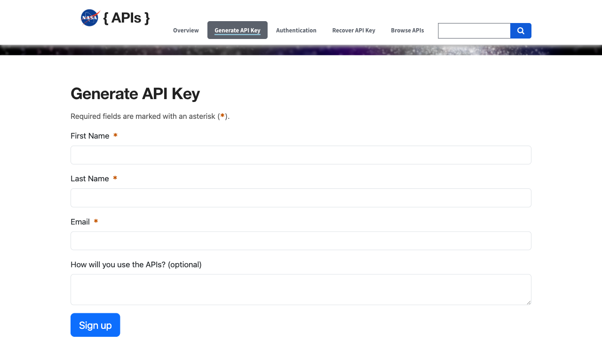
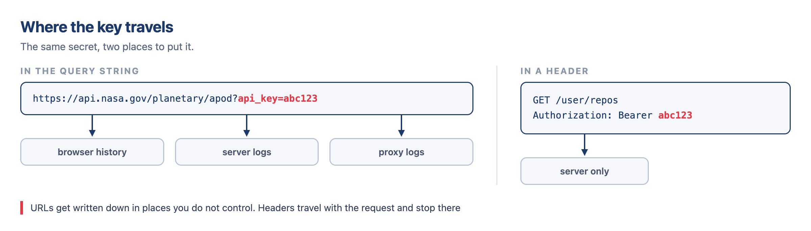
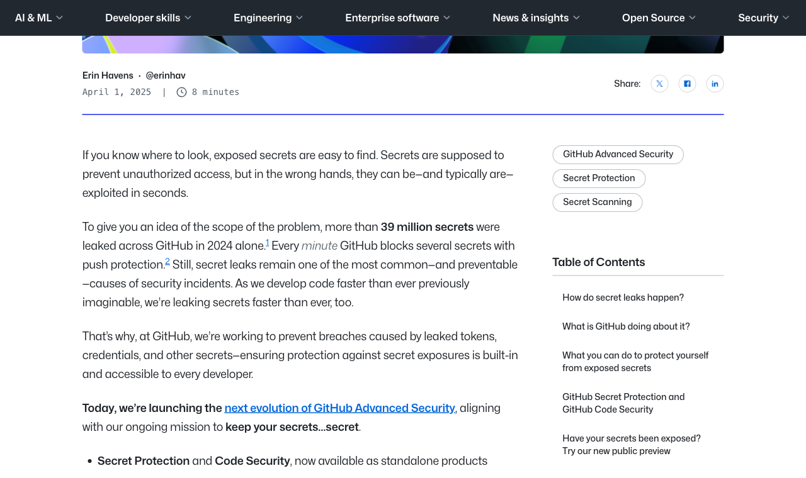
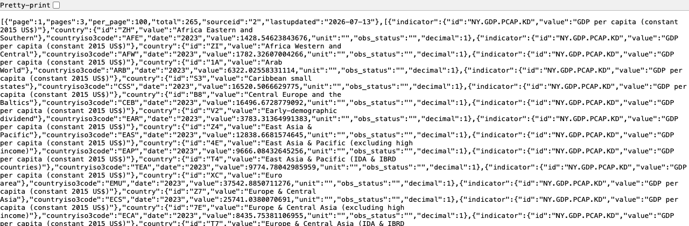
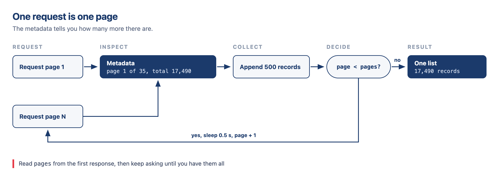
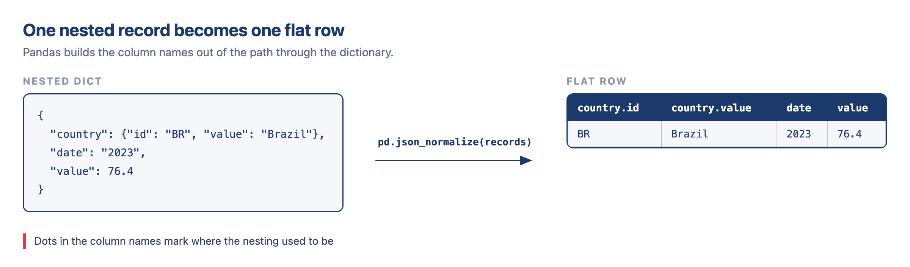
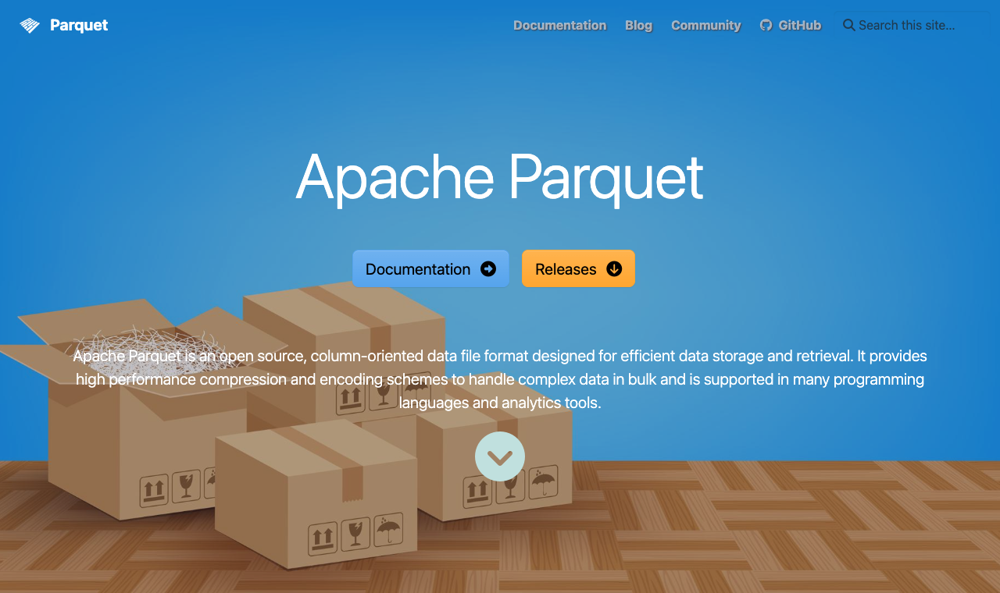
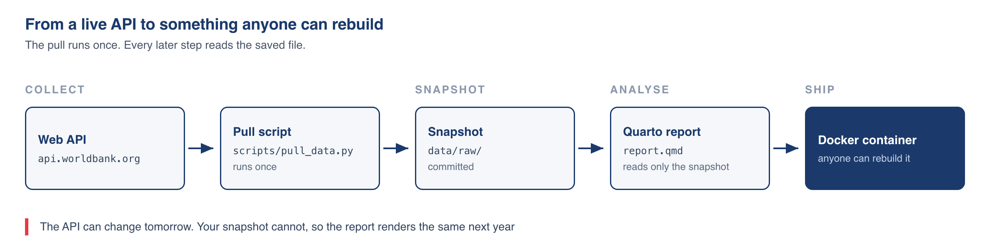

# Hello! Great to see you again! 😊 {background-color="#1B3A6B"}

# Brief recap 📚 {background-color="#1B3A6B"}

## Where we got to last class
### A few things we covered

:::{style="margin-top: 20px; font-size: 22px;"}
:::{.columns}
::::{.column width="55%"}
- An [API is a contract]{.alert}: request and response must follow agreed rules
- A URL consists of a [scheme, host, path, and query string]{.alert} (beginning at `?`)
- [`GET`]{.alert} asks for data. `POST` sends data
- [Status codes]{.alert} indicate results: `200` success, `404` not found, `429` retry later, `500` server error
- The World Bank returns `200` for errors too, so status alone doesn't confirm data receipt
- Responses are [JSON]{.alert} (Python dicts/lists), wrapped by the World Bank in a [metadata, records]{.alert} list
- Workflow: `requests.get(url, params=...)` → `.raise_for_status()` → `.json()`, where params auto-generates the query string
- We pulled Brazilian GDP per capita for 2014-2025 and saved the snapshot to `data/`
::::

::::{.column width="45%"}
:::{style="margin-top: 10px; background: rgba(27, 58, 107, 0.08); padding: 15px; border-radius: 10px; font-size: 23px;"}
[Today picks up where that stopped]{.alert}

- Send [API keys]{.alert} without leaking them
- Collect data that arrives in [pages]{.alert}
- Stay inside [rate limits]{.alert}
- Turn nested JSON into [tidy DataFrames]{.alert}
- Save results to [files]{.alert} your report can read
- Wrap all of it in [`get_wdi()`]{.alert}, the pull script your project needs
:::
::::
:::
:::

## Lecture overview
### What we will cover today

:::{style="margin-top: 20px; font-size: 23px;"}
:::{.columns}
::::{.column width="50%"}
[1. Authentication and keys]{.alert}

- Why servers want to know who is asking
- Query string or header, and why headers win
- `.env`, `.gitignore`, and revoking a leaked key

[2. Pagination and rate limits]{.alert}

- Reading the metadata block to know when to stop
- The page-number loop, written once and reused
- Sleeping, backing off, and asking for bigger pages
::::

::::{.column width="50%"}
[3. From JSON to DataFrame]{.alert}

- `pd.json_normalize` on flat and nested records
- `record_path` and `meta` when dots are not enough

[4. Functions, caching, and files]{.alert}

- Wrapping the whole pull into `get_wdi()`
- Fetching once and reading from disk after that
- Parquet against CSV, and the project pull script
::::
:::
:::

# Authentication and keys {background-color="#1B3A6B"}

## Why keys exist
### A string that tells the server who you are

:::{style="margin-top: 20px; font-size: 23px;"}
:::{.columns}
::::{.column width="52%"}
- An API key is only a string that identifies your requests. Remember the lectures on AWS?
- [Identification]{.alert}: who is making the request, and are they allowed to ask this
- [Quotas]{.alert}: 1,000 requests a day per key, so one user cannot exhaust the service
- [Abuse prevention]{.alert}: a misbehaving key can be switched off without punishing everyone else
- Free keys are still keys. "Free" describes the price, not how carefully you handle it
- [A leaked free key can exhaust your quota]{.alert}, and run up a big bill in your name
- Most keys arrive within a minute of filling in a form with your email address
::::

::::{.column width="48%"}
:::{style="text-align: center; margin-top: -10px;"}
[{width="100%"}](#){data-modal-type="image" data-modal-url="figures/nasa-signup-2026.png"}

:::{style="font-size: 17px;"}
NASA's signup form: <https://api.nasa.gov>
:::
:::
::::
:::
:::

## Where keys go
### The query string is easier to write, the header is safer to send

:::{style="margin-top: 20px; font-size: 17px;"}
:::{.columns}
:::{.column width="50%"}
#### In the query string

```python
import requests

r = requests.get(
    "https://api.nasa.gov/planetary/apod",
    params={"api_key": "YOUR_KEY_HERE"},
    timeout=10,
)
print(r.json()["title"])
```

Simple, and some APIs offer nothing else
:::

:::{.column width="50%"}
#### In a header

```python
import requests

r = requests.get(
    "https://api.github.com/user/repos",
    headers={"Authorization":
             "Bearer YOUR_KEY_HERE"},
    timeout=10,
)
print(r.status_code)
```

Preferred whenever the API supports it
:::
:::

:::{style="text-align: center; margin-top: 10px;"}
[{width="45%"}](#){data-modal-type="image" data-modal-url="figures/keys-two-patterns-diagram.png"}
:::

:::{style="margin-top: 10px; font-size: 19px;"}
Headers win because [URLs get logged]{.alert}. They land in server logs, browser history, proxy caches, and the `Referer` header sent to the next site. A key in a URL can be used to identify a user, a project, or a specific request
:::
:::

## Key hygiene
### Four steps, the same ones your final project repository needs

:::{style="margin-top: 15px; font-size: 20px;"}
You already ran this routine in Lecture 14, when you talked to a language model

1. Put the key in a file called [`.env`]{.alert}, one `NAME=value` per line, no quotes, no spaces around the `=`

:::{style="margin-left: 50px;"}
```
NASA_API_KEY=abc123def456
```
:::

2. Add `.env` to your [`.gitignore`]{.alert} [before]{.alert} your first commit
3. Read it in Python with `python-dotenv`

```python
import os
from dotenv import load_dotenv

load_dotenv()
key = os.getenv("NASA_API_KEY")
```

4. Commit a `.env.example` with the names and no values, so collaborators know what to create

:::{style="margin-top: 15px; background: rgba(230, 57, 70, 0.1); padding: 12px; border-radius: 10px; font-size: 19px;"}
[Never]{.alert} hard-code a key in a notebook or script, and never paste one into a slide, a screenshot, or a chat message

Committed a key by accident? [Revoke it immediately]{.alert}, then reissue. Deleting the file in the next commit does not help, because `git log -p` still shows it
:::
:::

## Why I'm so strict about this
### 39 million leaked secrets in one year

:::{style="margin-top: 20px; font-size: 23px;"}
:::{.columns}
:::{.column width="52%"}
- GitHub reported [more than 39 million secrets]{.alert} leaked across the platform in 2024 alone
- Bots scan public repositories constantly; exposure from careless commits happens in [minutes]{.alert}
- AWS keys are the most frequently leaked type
- GitHub blocks pushes with known secret patterns via [push protection]{.alert}, but only for recognised formats
- Your checklist: `.gitignore` first, `.env.example` committed empty, `git diff --cached` before every commit
- [Revoke a leaked key immediately,]{.alert} then treat the old one as public forever
:::

:::{.column width="48%"}
:::{style="text-align: center; margin-top: -10px;"}
[{width="100%"}](#){data-modal-type="image" data-modal-url="figures/github-secrets-blog-2026.png"}

:::{style="font-size: 17px;"}
Source: GitHub Security Blog, [The next evolution of GitHub Advanced Security](https://github.blog/security/application-security/next-evolution-github-advanced-security/) (1 April 2025). Push protection: [docs.github.com](https://docs.github.com/en/code-security/concepts/secret-security/push-protection)
:::
:::
:::
:::
:::

## Worked example
### NASA's Astronomy Picture of the Day

:::{style="margin-top: 15px; font-size: 22px;"}
:::{.columns}
::::{.column width="56%"}
Ask for one day's picture, save the answer, then read the quota headers

:::{style="font-size: 18px;"}
```python
import os, json, requests
from dotenv import load_dotenv

load_dotenv()
key = os.getenv("NASA_API_KEY", "DEMO_KEY")

r = requests.get(
    "https://api.nasa.gov/planetary/apod",
    params={"api_key": key, "date": "2026-08-05"},
    timeout=10,
)
r.raise_for_status()

with open("data/nasa_apod.json", "w") as f:
    json.dump(r.json(), f, indent=2)

# How much quota is left
print(r.headers["X-RateLimit-Limit"],
      r.headers["X-RateLimit-Remaining"])
```

```text
10 8
```
:::
::::

::::{.column width="44%"}
:::{style="margin-top: 20px; font-size: 21px;"}
- `os.getenv(name, default)` falls back to `DEMO_KEY`, so the code runs before anyone has a key
- Sign up at <https://api.nasa.gov>, and the key arrives by email
- The docs promise `DEMO_KEY` [30 requests per IP address per hour]{.alert} and 50 per day
- This response says the limit is [10]{.alert}. The header is the truth, the documentation is the promise
- Read the header on every run, because limits differ by service and change without notice

:::{style="margin-top: 12px; background: rgba(230, 57, 70, 0.1); padding: 12px; border-radius: 10px; font-size: 17px;"}
`KeyError: 'X-RateLimit-Limit'` means this API does not send the header. Use `r.headers.get(...)` when you are not sure
:::
:::
::::
:::
:::

## The response
### Saved JSON on disk, read again without a new request

:::{style="margin-top: 20px; font-size: 20px;"}
:::{.columns}
::::{.column width="55%"}
Read the snapshot and print the two fields we need

```python
import json

with open("data/nasa_apod.json") as f:
    apod = json.load(f)

print(apod["date"], "|", apod["title"])
print()
print(apod["explanation"][:400], "...")
```

:::{style="font-size: 16px;"}
```text
2026-08-05 | Spokes on Saturn's B Ring

Don’t get spooked by Saturn’s ghostly spokes!
Today we feature a nearly two-hour timelapse
of Saturn and its rings looping forwards and
backwards. If you look closely, a ghoulish
shadow appears and disappears as Saturn’s B
ring rotates. [...]
```
:::

:::{style="margin-top: 10px; font-size: 19px;"}
- The response is a plain dictionary, so `apod["url"]` also gives the image address
- Fetch once, then work from the file for the rest of the session
:::
::::

::::{.column width="45%"}
:::{style="text-align: center; margin-top: -10px;"}
[{width="85%"}](#){data-modal-type="image" data-modal-url="figures/apod-picture-2026-08-05.jpg"}

:::{style="font-size: 17px;"}
A frame from the animation. Credit: Brad Croslin. Text: Keighley Rockcliffe (NASA GSFC, UMBC CSST, CRESST II)
:::
:::
::::
:::
:::

# Pagination 📄 {background-color="#1B3A6B"}

## Servers send data in pages
### Each response carries one page and the instructions to fetch the rest

:::{style="margin-top: 20px; font-size: 21px;"}
:::{.columns}
::::{.column width="55%"}
Read the metadata element of the saved first page

```python
import json

with open("data/wb_gdppc_2023_page1.json") as f:
    payload = json.load(f)

print(payload[0])
```

:::{style="font-size: 17px;"}
```text
{'page': 1, 'pages': 3, 'per_page': 100,
 'total': 265, 'sourceid': '2',
 'lastupdated': '2026-07-13'}
```
:::

:::{style="text-align: center; margin-top: 15px;"}
[{width="100%"}](#){data-modal-type="image" data-modal-url="figures/worldbank-paginated-2026.png"}
:::
::::

::::{.column width="45%"}
:::{style="margin-top: 20px;"}
- One indicator across all countries and all years runs to tens of thousands of records
- Sending that in one response would be slow for you and expensive for the server
- The [metadata block]{.alert} from last class holds the instructions. It is the first element of the two-element list
- `total` records exist, split into `pages` pages of `per_page` records. This response is page `page`
- `lastupdated` gives the date the World Bank last revised these numbers
:::
::::
:::
:::

## Reading the metadata block
### Four fields decide how many requests you have to send

:::{style="margin-top: 40px; font-size: 23px;"}
| Field | Meaning | Why it matters |
|---|---|---|
| `page` | Which page this is | Your position in the loop |
| `pages` | How many pages exist | [When to stop]{.alert} |
| `per_page` | Records per page | You can often raise this |
| `total` | Records in total | Sanity check at the end |

:::{style="margin-top: 30px;"}
- [Ask for a bigger page]{.alert} first. A request that needs 35 pages at `per_page=500` needs one page at `per_page=20000`
- The World Bank ceiling is [`per_page=32767`]{.alert}. Ask for 32768 and the server answers `400`, so 20000 is a safe value for one-page requests
- Check the documentation for the ceiling of the API you are using. If the ceiling is too low, you loop
:::
:::

## Pattern 1: the page-number loop
### Ask for page 1, read how many pages exist, repeat until the last one

:::{style="margin-top: 15px; font-size: 20px;"}
:::{.columns}
::::{.column width="56%"}
Collect GDP per capita for 2023, 100 rows at a time

:::{style="font-size: 17px;"}
```python
import requests, time

url = ("https://api.worldbank.org/v2/country/all"
       "/indicator/NY.GDP.PCAP.KD")
records, page = [], 1

while True:
    params = {"format": "json", "date": 2023,
              "per_page": 100, "page": page}
    r = requests.get(url, params=params, timeout=30)
    r.raise_for_status()
    meta, rows = r.json()

    records.extend(rows)
    print(f"page {meta['page']} of {meta['pages']}: "
          f"{len(rows)} rows")

    if page >= meta["pages"]:
        break
    page += 1
    time.sleep(0.5)          # be polite

print(f"collected {len(records)} records")
```

```text
page 1 of 3: 100 rows
page 2 of 3: 100 rows
page 3 of 3: 65 rows
collected 265 records
```
:::
::::

::::{.column width="44%"}
:::{style="margin-top: 15px; font-size: 19px;"}
- The loop [reads `pages` from the response]{.alert} instead of a hard-coded number, so it stays correct when countries are added
- Use `while True` with a `break`, because `pages` does not exist until the first response arrives
- The last page is short. 100 + 100 + 65 matches the `total` of 265
- `time.sleep(0.5)` adds one and a half seconds in total
:::

:::{style="text-align: center; margin-top: 10px;"}
[{width="85%"}](#){data-modal-type="image" data-modal-url="figures/pagination-loop-diagram.png"}

:::{style="font-size: 17px;"}
The same loop on total population: 35 pages, 17,490 records
:::
:::
::::
:::
:::

## The same loop, running on cached pages
### Three saved files replace the server, and the logic does not change

:::{style="margin-top: 20px; font-size: 18px;"}
:::{.columns}
::::{.column width="56%"}
Open page 1, page 2, page 3 from disk instead of the network

```python
import json

records, page = [], 1

while True:
    path = f"data/wb_gdppc_2023_page{page}.json"
    with open(path) as f:
        meta, rows = json.load(f)

    records.extend(rows)
    print(f"page {meta['page']} of {meta['pages']}: "
          f"{len(rows)} rows")

    if page >= meta["pages"]:
        break
    page += 1

print(f"\ncollected {len(records)} records "
      f"(metadata said {meta['total']})")
```

```text
page 1 of 3: 100 rows
page 2 of 3: 100 rows
page 3 of 3: 65 rows

collected 265 records (metadata said 265)
```
::::

::::{.column width="44%"}
:::{style="margin-top: 20px; font-size: 21px;"}
- Same structure and same stopping rule, with no network traffic
- The three files came from the live loop on the previous slide
- Comparing your record count with `total` is a cheap check that catches a dropped page
- Testing a loop on saved pages costs the server nothing and runs instantly
- Your project's pull script will do exactly this: fetch once, then work from the files
:::
::::
:::
:::

## Pattern 2: cursor pagination
### The server sends a token, and you return it with the next request

:::{style="margin-top: 20px; font-size: 23px;"}
:::{.columns}
::::{.column width="52%"}
- Not every API counts pages. Some return a [token that points to the next batch]{.alert}
- GitHub puts the next URL in a `Link` header. Follow it until `rel="next"` disappears
- Others put a `next_cursor` or `next_page_token` in the body, and you send it in the next request
- The logic is the same: [fetch, collect, check whether more data exists, repeat]{.alert}
- You lose the ability to plan. You cannot count the requests in advance or skip to page 7
- You will not need this today. Recognise the pattern when you see it, then read the API documentation
::::

::::{.column width="48%"}
:::{style="margin-top: -20px;"}
GitHub's `Link` header, from a real request

:::{style="font-size: 20px; margin-top: 30px; margin-bottom: 30px;"}
```text
link: <https://api.github.com/repositories/
858127/issues?per_page=2&after=Y3Vyc29yOnYy
OpLPAAABoCyW3oD[...]&page=2>; rel="next"
```
:::

- The `after=` value is an [opaque cursor]{.alert}, a bookmark that means something to GitHub and nothing to you
- Send it back unchanged, and stop when the header no longer includes a next link
:::
::::
:::
:::

## Being a polite guest
### Four habits that cost you nothing, and what to do about a 429

:::{style="margin-top: 20px; font-size: 23px;"}
:::{.columns}
::::{.column width="52%"}
- A loop can send hundreds of requests a second. A person with a browser cannot, and servers notice the difference
1. [Sleep between requests]{.alert}. `time.sleep(0.5)` is invisible to you and helpful to the server
2. [Read the documented limits]{.alert} and stay under them. Many APIs publish an exact number
3. [Ask for bigger pages]{.alert}. One request for 20,000 rows is better than 200 requests for 100
4. [Cache what you fetch]{.alert} so you never request the same data twice
- When the header and the documentation disagree, trust the header, as the NASA example showed
::::

::::{.column width="48%"}
:::{style="margin-top: -20px;"}
A [`429`]{.alert} often includes a `Retry-After` header with the waiting time

:::{style="font-size: 20px; margin-top: 30px; margin-bottom: 30px;"}
```python
if r.status_code == 429:
    wait = r.headers.get("Retry-After", 60)
    print(f"rate limited, sleeping {wait}s")
    time.sleep(int(wait))
```
:::

- `.get("Retry-After", 60)` gives a fallback when the server sends no header
- Without that header, use [exponential backoff]{.alert}: 1s, 2s, 4s, 8s
- Rapid retries against a struggling server turn a slowdown into an outage
:::
::::
:::
:::

## Try it yourself! 🤓 {#sec:exercise01}
### Ten minutes

:::{style="margin-top: 20px; font-size: 21px;"}
:::{.columns}
::::{.column width="55%"}
1. Fetch [total population]{.alert} (`SP.POP.TOTL`) for all countries and all available years
2. Set `per_page=500`. After the July 2026 update that gives [35 pages]{.alert} with 17,490 records
3. Do not hard-code the page count. Typing `35` in your loop defeats the exercise
4. Read `pages` from the metadata block and stop when you reach it
5. Put `time.sleep(0.5)` inside the loop before you run it
6. Collect every page into one list, then print the length of that list
7. Compare that length with the `total` field in the metadata
::::

::::{.column width="45%"}
:::{style="margin-top: -15px;"}
[What to look for]{.alert}

- A count that matches `total` exactly, with no page missed or collected twice
- A last page holding fewer than 500 rows
- A loop that still works next year, when the record count changes

:::{style="margin-top: 25px; background: rgba(27, 58, 107, 0.08); padding: 15px; border-radius: 10px; font-size: 20px;"}
Stuck, or want to compare your loop with mine?

[[Appendix 01]{.button}](#sec:appendix01)
:::
:::
::::
:::
:::

# From JSON to DataFrame 🐼 {background-color="#1B3A6B"}

## The problem
### A list of dictionaries inside dictionaries, and we want a rectangle

:::{style="margin-top: 20px; font-size: 21px;"}
:::{.columns}
::::{.column width="56%"}
Print the first record of the saved life expectancy file

```python
import json

with open("data/wb_life_expectancy_5.json") as f:
    payload = json.load(f)

records = payload[1]
print(json.dumps(records[0], indent=2))
```

:::{style="font-size: 16px;"}
```text
{
  "indicator": {
    "id": "SP.DYN.LE00.IN",
    "value": "Life expectancy at birth, [...]"
  },
  "country": {
    "id": "BR",
    "value": "Brazil"
  },
  "countryiso3code": "BRA",
  "date": "2024",
  "value": 76.023,
  [...]
}
```
:::
::::

::::{.column width="44%"}
:::{style="margin-top: 20px;"}
- The records live in [`payload[1]`]{.alert}. `payload[0]` is the metadata block from last class
- `indicator` and `country` arrive as [dictionaries nested inside]{.alert} each record
- A DataFrame cell can hold a dictionary. No calculation will run on it
- The file holds 125 records: five countries, 2000 to 2024, one record per country-year
- The target is four columns: country, iso3, year, value
:::
::::
:::
:::

## `pd.json_normalize`: the flat case
### Records with no nesting become a plain table

:::{style="margin-top: 20px; font-size: 21px;"}
:::{.columns}
::::{.column width="55%"}
Pass three flat dictionaries and read the table back

```python
import pandas as pd

flat = [
    {"code": "BRA", "year": 2023, "value": 76.4},
    {"code": "USA", "year": 2023, "value": 79.3},
    {"code": "JPN", "year": 2023, "value": 84.0},
]

print(pd.json_normalize(flat))
```

```text
  code  year  value
0  BRA  2023   76.4
1  USA  2023   79.3
2  JPN  2023   84.0
```
::::

::::{.column width="45%"}
:::{style="margin-top: 20px;"}
- Each dictionary key becomes a column, and each dictionary becomes a row
- [`pd.DataFrame(flat)`]{.alert} returns the same frame here, because there is nothing to flatten
- The two differ as soon as a value is a dict or a list
- `pd.DataFrame` keeps the dict in the cell. `json_normalize` expands it into columns
- Missing keys become `NaN` in both, so uneven records do not raise an error
:::
::::
:::
:::

## `pd.json_normalize`: the nested case
### Nested dictionaries become columns named with a dot

:::{style="margin-top: 15px; font-size: 17px;"}
:::{.columns}
::::{.column width="56%"}
Run it on the World Bank records from the previous slide

```python
df = pd.json_normalize(records)

print(df.columns.tolist())
print()
print(df[["countryiso3code", "country.value",
          "date", "value"]].head(4).to_string(index=False))
```

:::{style="font-size: 16px;"}
```text
['countryiso3code', 'date', 'value', 'unit',
 'obs_status', 'decimal', 'indicator.id',
 'indicator.value', 'country.id', 'country.value']

countryiso3code country.value date  value
            BRA        Brazil 2024 76.023
            BRA        Brazil 2023 75.848
            BRA        Brazil 2022 74.872
            BRA        Brazil 2021 73.038
```
:::
::::

::::{.column width="44%"}
:::{style="margin-top: 20px; font-size: 22px;"}
- Nested dictionaries became columns named with a [dot]{.alert}: `country.value`, `indicator.id`
- One nested level gives `parent.child`, two levels give `parent.child.grandchild`
- Ten columns come from a record that looked like six fields
- Use bracket notation, because `df.country.value` means something else to Python
:::
::::
:::

:::{style="text-align: center; margin-top: 10px;"}
[{width="52%"}](#){data-modal-type="image" data-modal-url="figures/json-normalize-diagram.png"}
:::
:::

## When dots are not enough: `record_path` and `meta`
### Dots flatten a dictionary. A nested list needs you to name the rows

:::{style="margin-top: 15px; font-size: 17px;"}
:::{.columns}
::::{.column width="58%"}
:::{style="font-size: 22px;"}
Each item holds a list of observations, so name that list
:::

```python
payload_nested = [
    {"country": "Brazil", "iso3": "BRA",
     "observations": [{"year": 2022, "value": 76.0},
                      {"year": 2023, "value": 76.4}]},
    {"country": "Japan", "iso3": "JPN",
     "observations": [{"year": 2022, "value": 84.0},
                      {"year": 2023, "value": 84.1}]},
]

out = pd.json_normalize(
    payload_nested,
    record_path="observations",   # the list that becomes rows
    meta=["country", "iso3"],     # carried down onto each row
)
print(out.to_string(index=False))
```

```text
 year  value country iso3
 2022   76.0  Brazil  BRA
 2023   76.4  Brazil  BRA
 2022   84.0   Japan  JPN
 2023   84.1   Japan  JPN
```
::::

::::{.column width="42%"}
:::{style="margin-top: 20px; font-size: 22px;"}
- [`record_path`]{.alert} names the list to explode into rows
- [`meta`]{.alert} names the parent fields to repeat on every row from that parent
- Two parents holding two observations each give four rows
- Without `record_path` you get two rows and a column of lists
- The World Bank never needs this. Many other APIs do
:::
::::
:::
:::

## Cleaning the frame
### A rectangle is not yet a tidy dataset

:::{style="margin-top: 15px; font-size: 19px;"}
:::{.columns}
::::{.column width="55%"}
Build the four columns we need, with the correct dtypes

```python
tidy = pd.DataFrame({
    "country": df["country.value"],
    "iso3": df["countryiso3code"],
    "year": df["date"].astype("int16"),
    "value": pd.to_numeric(df["value"],
                           errors="coerce"),
})

print(tidy.dtypes)
print()
print(tidy.head(3).to_string(index=False))
```

```text
country        str
iso3           str
year         int16
value      float64
dtype: object

country iso3  year  value
 Brazil  BRA  2024 76.023
 Brazil  BRA  2023 75.848
 Brazil  BRA  2022 74.872
```
::::

::::{.column width="45%"}
:::{style="margin-top: 10px; font-size: 19px;"}
- [Rename]{.alert} the columns to plain words. `country.value` is the API's vocabulary
- [Fix the dtypes]{.alert}. `year` and `value` arrive as strings (`str`), and a mean over strings fails or gives a wrong answer
- [`errors="coerce"`]{.alert} turns unreadable values into `NaN` instead of raising an error
- Gaps are normal in international statistics, so keep them visible instead of stopping the script
- [Drop the columns you will not use]{.alert}. Six of the ten here repeat the same string
:::

:::{style="margin-top: 12px; background: rgba(27, 58, 107, 0.08); padding: 15px; border-radius: 10px; font-size: 18px;"}
The project starter's `tidy()` does the same flattening with a list comprehension and Polars. `json_normalize` is the pandas shortcut for this step. The project asks for Polars or DuckDB in the main work
:::
::::
:::
:::

## One row per country-year
### The shape that every question we ask expects

:::{style="margin-top: 20px; font-size: 19px;"}
:::{.columns}
::::{.column width="56%"}
Count the frame, rank 2023, then measure the change since 2000

```python
print(f"{len(tidy)} rows, "
      f"{tidy['iso3'].nunique()} countries, "
      f"years {tidy['year'].min()}-{tidy['year'].max()}")
print()

# Life expectancy in 2023, highest first
latest = tidy[tidy["year"] == 2023].sort_values(
    "value", ascending=False)
print(latest[["country", "value"]].to_string(index=False))

print()
print("Change since 2000:")
wide = tidy.pivot(index="iso3", columns="year",
                  values="value")
change = (wide.assign(change=lambda d: d[2023] - d[2000])
              ["change"].round(1)
              .sort_values(ascending=False))
print(change.to_string())
```
::::

::::{.column width="44%"}
:::{style="font-size: 16px; margin-top: 20px;"}
```text
125 rows, 5 countries, years 2000-2024

      country     value
        Japan 84.041220
United States 78.385366
       Brazil 75.848000
        India 72.003000
      Nigeria 54.462000

Change since 2000:
iso3
IND    9.3
NGA    7.3
BRA    6.3
JPN    3.0
USA    1.7
```
:::

:::{style="margin-top: 10px; font-size: 19px;"}
- 125 rows is five countries times 25 years, with no gaps
- `pivot` turns years into columns so two of them can be subtracted
- India gained 9.3 years of life expectancy while the United States gained 1.7
:::
::::
:::
:::

## Try it yourself! 🤓 {#sec:exercise02}

:::{style="margin-top: 20px; font-size: 21px;"}
:::{.columns}
::::{.column width="55%"}
1. Open `data/wb_life_expectancy_5.json`, which holds life expectancy for Brazil, the United States, India, Nigeria, and Japan, 2000 to 2024
2. Find the records before you normalise anything. They are not at the top level of the file
3. Normalise them with `json_normalize` and build a tidy frame with columns `country`, `iso3`, `year`, `value`
4. Make `value` numeric before you compute anything with it
5. Report the [mean life expectancy for India]{.alert} across the whole period, rounded to one decimal place
6. Print the minimum and the maximum too, so you can see the trend behind the mean
::::

::::{.column width="45%"}
:::{style="margin-top: -15px;"}
[What to look for]{.alert}

- A frame of 125 rows, five countries, 25 years, before you filter anything
- A mean for India close to 68 years, rising across the period
- A `value` column with dtype `float64`, because a mean over strings fails or gives a wrong answer

:::{style="margin-top: 25px; background: rgba(27, 58, 107, 0.08); padding: 15px; border-radius: 10px; font-size: 20px;"}
Stuck, or want to compare your frame with mine?

[[Appendix 02]{.button}](#sec:appendix02)
:::
:::
::::
:::
:::

# Functions, caching, and files 💾 {background-color="#1B3A6B"}

## One function: `get_wdi`
### Decide what the function promises before writing the body

:::{style="margin-top: 20px; font-size: 20px;"}
:::{.columns}
::::{.column width="57%"}
Write the signature and the docstring first, with no body

```python
def get_wdi(indicator, countries="all",
            start=1990, end=2023):
    """Fetch one World Development Indicator
    as a tidy DataFrame.

    Parameters
    ----------
    indicator : str   WDI code, e.g. "NY.GDP.PCAP.KD"
    countries : str   "all", or ISO3 codes joined
                      by ";", e.g. "BRA;USA"
    start, end : int  First and last year, inclusive

    Returns
    -------
    DataFrame with columns country, iso3, year,
    value (one row per country-year)
    """
```
::::

::::{.column width="43%"}
:::{style="margin-top: 20px; font-size: 21px;"}
- So far we have written loose lines in a notebook, which is fine for learning
- A project needs one name you can call twice and trust both times
- The docstring makes you decide [what]{.alert} the function does before you decide how
- Defaults hold the choices you make most often, so most calls pass one argument
- [This is the most reusable part of the module]{.alert}, and you will copy it into your project
:::
::::
:::
:::

## `get_wdi`, the body
### Build the URL, then loop until the metadata says to stop

:::{style="margin-top: 20px; font-size: 18px;"}
:::{.columns}
::::{.column width="57%"}
```python
import time
import pandas as pd
import requests

def get_wdi(indicator, countries="all", start=1990, end=2023):
    """(docstring as on the previous slide)"""
    url = ("https://api.worldbank.org/v2/country/"
           f"{countries}/indicator/{indicator}")
    params = {"format": "json", "date": f"{start}:{end}",
              "per_page": 20000, "page": 1}

    records = []
    while True:
        r = requests.get(url, params=params, timeout=60)
        r.raise_for_status()
        payload = r.json()

        # An error comes back as a dict, not a two-element list
        if isinstance(payload, dict) or payload[1] is None:
            raise ValueError(f"No data for {indicator}. "
                             "Has the code been retired?")

        meta, rows = payload
        records.extend(rows)

        if params["page"] >= meta["pages"]:
            break
        params["page"] += 1
        time.sleep(0.5)

    # the frame is built on the next slide
```
::::

::::{.column width="43%"}
:::{style="margin-top: 20px; font-size: 20px;"}
- [`per_page=20000`]{.alert} usually fits the whole request into one page. The loop still runs when it does not
- The World Bank ceiling is 32767, so 20000 leaves room and never causes a `400`
- [`payload[1] is None`]{.alert} catches a valid two-element reply whose record list is empty
- `isinstance(payload, dict)` catches the other error shape the API sends
- `records` collects raw dictionaries across pages and stays unchanged until the loop ends
- `timeout=60` is generous, because a 20,000-row page takes a few seconds to build
:::
::::
:::
:::

## `get_wdi`, the body (continued)
### Flatten the records once, at the end, and return four named columns

:::{style="margin-top: 20px; font-size: 19px;"}
:::{.columns}
::::{.column width="56%"}
The last four lines of the function

```python
    df = pd.json_normalize(records)
    return pd.DataFrame({
        "country": df["country.value"],
        "iso3": df["countryiso3code"],
        "year": df["date"].astype("int16"),
        "value": pd.to_numeric(df["value"],
                               errors="coerce"),
    }).sort_values(["country", "year"])
```

Call it like any other function

```python
le = get_wdi("SP.DYN.LE00.IN", "BRA;USA", 2000, 2023)
print(le.head())
```
::::

::::{.column width="44%"}
:::{style="margin-top: 20px; font-size: 20px;"}
- Flattening happens [once]{.alert}, after every page arrives, instead of page by page
- The four columns are the same ones we built by hand two slides ago
- Sorting by country and year gives the caller a predictable order for plots and differences
- The caller never sees `pages`, `per_page`, or a dotted column name
- Every slide in this section contributed one line of this function
:::
::::
:::
:::

## Why the error check matters
### The World Bank answers a retired indicator with 200 and an error message

:::{style="margin-top: 20px; font-size: 20px;"}
:::{.columns}
::::{.column width="55%"}
Ask for a code that was removed and read the response

```python
# EN.ATM.CO2E.PC was the CO2 per capita code
# for years. It is gone
r = requests.get(
    "https://api.worldbank.org/v2/country/all"
    "/indicator/EN.ATM.CO2E.PC",
    params={"format": "json", "date": 2020},
)
print(r.status_code)
print(r.json())
```

:::{style="font-size: 16px;"}
```text
200
[{'message': [{'id': '175',
   'key': 'Invalid format',
   'value': 'The indicator was not found. It may
have been deleted or archived.'}]}]
```
:::
::::

::::{.column width="45%"}
:::{style="margin-top: 10px; font-size: 20px;"}
- `raise_for_status()` sees a `200` and raises nothing
- The parsing code then fails three lines later, with a confusing message
- [A successful HTTP request is not a successful data request]{.alert}
- The `isinstance(payload, dict)` line turns that into one clear error message
- `EN.GHG.CO2.PC.CE.AR5` replaced it, and this course uses that code

:::{style="margin-top: 15px; background: rgba(230, 57, 70, 0.1); padding: 15px; border-radius: 10px; font-size: 19px;"}
Indicator codes are retired without warning. Read the body of the response on every pull, and treat the status code as half the answer
:::
:::
::::
:::
:::

## Caching: fetch once, read forever
### Use the network the first time, then read from disk on every later run

:::{style="margin-top: 20px; font-size: 19px;"}
:::{.columns}
::::{.column width="57%"}
Check the file before you call the server

```python
from pathlib import Path

def get_wdi_cached(indicator, countries="all",
                   start=1990, end=2023):
    """get_wdi with a local cache."""
    cache = (Path("data") /
             f"{indicator}_{countries}_{start}_{end}.parquet")

    if cache.exists():
        print(f"reading {cache.name} from disk")
        return pd.read_parquet(cache)

    print(f"fetching {indicator} from the World Bank")
    df = get_wdi(indicator, countries, start, end)
    cache.parent.mkdir(exist_ok=True)
    df.to_parquet(cache, index=False)
    return df
```
::::

::::{.column width="43%"}
:::{style="margin-top: 20px; font-size: 20px;"}
Eight lines, four benefits

- [Speed]{.alert}: the second run is instant
- [Courtesy]{.alert}: you stop requesting data you already have
- [Reproducibility]{.alert}: your numbers stay the same while you write about them
- [Offline work]{.alert}: your analysis runs on a plane
- `scripts/pull_data.py` in the project starter does the same, and saves the raw JSON next to the tidy table
- [These slides are built this way]{.alert}: every call was made once, saved to `data/`, and read back at render time
:::
::::
:::
:::

## CSV or parquet?
### One format a person can open, one format your code should read

:::{style="margin-top: 20px; font-size: 19px;"}
:::{.columns}
::::{.column width="62%"}
| | CSV | Parquet |
|---|---|---|
| Format | Text, row-oriented | Binary, columnar, compressed |
| Dtypes | [Loses them]{.alert}: `int16` → `int64`, categories → strings | [Keeps exactly]{.alert} what you saved |
| Column selection | Reads all columns, even if you need three | Reads only the columns you ask for |
| Size | Large (numbers stored as digit characters) | Typically 3-6x smaller |
| Ecosystem | Any tool, including spreadsheets | Needs `pyarrow`; pandas, Polars, DuckDB, R, Spark all read it |
| Human-readable | Open in any text editor | Needs code to read |

```python
df.to_parquet("data/wdi_panel.parquet", index=False)
df = pd.read_parquet("data/wdi_panel.parquet")
```
::::

::::{.column width="38%"}
:::{style="text-align: center; margin-top: -10px;"}
[{width="95%"}](#){data-modal-type="image" data-modal-url="figures/parquet-site-2026.png"}

:::{style="font-size: 17px;"}
The format's home page: <https://parquet.apache.org>
:::
:::

:::{style="margin-top: 10px; font-size: 19px;"}
- Rule of thumb: [CSV for a person, parquet for everything your code reads]{.alert}
- The project starter writes CSV and does not pin `pyarrow`, so parquet is optional there
- If you use parquet in your project, add `pyarrow` to `requirements.txt`
:::
::::
:::
:::

## The size difference
### Eight indicators, every country, 1990 to 2023, written both ways

:::{style="margin-top: 20px; font-size: 19px;"}
:::{.columns}
::::{.column width="57%"}
Read the course panel, then write it again as CSV and compare

```python
import pandas as pd
from pathlib import Path

panel = pd.read_parquet("data/wdi_panel.parquet")
print(f"{len(panel):,} rows, {panel['iso3'].nunique()} countries, "
      f"{panel['indicator'].nunique()} indicators, "
      f"{panel['year'].min()}-{panel['year'].max()}")
print()
print(panel.head(4).to_string(index=False))

# Write the same data as CSV and compare
panel.to_csv("data/_size_check.csv", index=False)
pq = Path("data/wdi_panel.parquet").stat().st_size
csv = Path("data/_size_check.csv").stat().st_size
Path("data/_size_check.csv").unlink()

print(f"\nparquet: {pq/1024:>7,.0f} KB")
print(f"CSV:     {csv/1024:>7,.0f} KB   ({csv/pq:.1f}x larger)")
```
::::

::::{.column width="43%"}
:::{style="font-size: 16px; margin-top: 20px;"}
```text
59,024 rows, 217 countries, 8 indicators,
1990-2023

country iso3      indicator  year    value
  Aruba  ABW co2_per_capita  1990 3.203034
  Aruba  ABW co2_per_capita  1991 3.435717
  Aruba  ABW co2_per_capita  1992 3.634519
  Aruba  ABW co2_per_capita  1993 3.414535

parquet:     450 KB
CSV:       2,682 KB   (6.0x larger)
```
:::

:::{style="margin-top: 10px; font-size: 19px;"}
- [450 KB against 2,682 KB]{.alert}: the CSV is 6.0 times larger for identical data
- Long format repeats `Aruba`, `ABW`, and `co2_per_capita` thousands of times. Parquet stores each value once
- The CSV also loses the `category` and `int16` dtypes
:::
::::
:::
:::

## What we will do with this file {#sec:panel}
### The same panel returns twice in Module 06

:::{style="margin-top: 20px; font-size: 22px;"}
:::{.columns}
::::{.column width="55%"}
- Keep `wdi_panel.parquet` in mind. You will see it again
- In [Lecture 21]{.alert} we ask why one core is not enough, and what your laptop does while it waits
- In [Lecture 22]{.alert} we run the same aggregation on this panel and on a synthetic version with roughly [200 million rows]{.alert}
- Four tools do that job: pandas, Polars, DuckDB, and Dask, timed against each other
- The comparison works because you collected the small version yourself today
- The pipeline is the same at both sizes. Only the tool changes
::::

::::{.column width="45%"}
:::{style="margin-top: 20px;"}
The panel holds eight indicators for 217 countries, 1990 to 2023, in long format: 59,024 rows in 450 KB

The build script lives in the course repository, caches its raw API responses, and makes no network requests on a second run

[[Appendix 05]{.button}](#sec:appendix05)
:::
::::
:::
:::

# The project pipeline 🗺️ {background-color="#1B3A6B"}

## Today's lecture is your project's pull script
### Four stages, and you have the first two

:::{style="margin-top: 20px; font-size: 21px;"}
:::{style="text-align: center; margin-bottom: 20px;"}
[{width="90%"}](#){data-modal-type="image" data-modal-url="figures/project-pipeline-diagram.png"}
:::

- [Collect]{.alert}: `requests` pulls from a web API, the whole of today's material
- [Snapshot]{.alert}: the script writes the raw response and a tidy table into `data/raw/`, also today
- [Analyse]{.alert}: Polars or DuckDB do the work, and Quarto writes the report, from Module 03
- [Ship]{.alert}: a Docker container lets the report render on someone else's machine, later in the course
- Two things must be in the repository: the [pull script]{.alert} and the [committed snapshot]{.alert} it wrote
:::

## What the project asks of you
### Clone the starter, change four lines, run it once

:::{style="margin-top: 20px; font-size: 19px;"}
:::{.columns}
::::{.column width="56%"}
| File | What it does |
|---|---|
| `scripts/pull_data.py` | Runs once: `python scripts/pull_data.py` |
| `data/raw/<name>_raw.json` | The untouched API response |
| `data/raw/<name>.csv` | The tidy table your report reads |
| `report.qmd` | Reads only the saved copy, 1,500-2,500 words |
| `Dockerfile` | Builds the image your report renders in |
| `requirements.txt` | Pinned versions, so the build is the same next month |

- [Commit `data/raw/`]{.alert}. Do not put it in `.gitignore`
- The report never calls the API while it renders
- Track A is the World Bank and needs no key. Track B is any public API, and you must check it with me first
::::

::::{.column width="44%"}
:::{style="text-align: center; margin-top: -10px;"}
[{width="95%"}](#){data-modal-type="image" data-modal-url="figures/project-starter-2026.png"}

:::{style="font-size: 17px;"}
The starter repository: [github.com/danilofreire/datasci350-project-starter](https://github.com/danilofreire/datasci350-project-starter)
:::
:::

:::{style="margin-top: 10px; font-size: 19px;"}
- Groups of three to four, names to me by Thursday 5 November
- Due Tuesday 8 December, 11:59pm, link on Canvas
- [Reproducibility is 30% of the grade]{.alert}
:::
::::
:::
:::

# Conclusion 📚 {background-color="#1B3A6B"}

## What we learned today

:::{style="margin-top: 30px; font-size: 23px;"}
:::{.columns}
::::{.column width="50%"}
- An [API key]{.alert} identifies your requests, and a free key needs the same care
- Keys go in a header when the API allows it, because URLs get logged everywhere
- Keys live in [`.env`]{.alert}, and `.env` goes into `.gitignore` before your first commit
- [Pagination]{.alert}: read `pages` from the metadata and loop until you reach it
- Raising [`per_page`]{.alert} to 20000 turns 35 World Bank requests into one
- Respect the [rate limit]{.alert}: sleep between calls, and read `Retry-After` on a `429`
::::

::::{.column width="50%"}
- [`json_normalize`]{.alert} flattens nested dicts into dotted column names
- [`record_path`]{.alert} and `meta` turn a nested list into rows and repeat the parent fields
- Rename, fix the dtypes, and coerce numerics afterwards, because a rectangle is not yet tidy
- [`get_wdi`]{.alert} wraps the whole pull, and its error check catches a `200` with an error message inside
- Write a [snapshot]{.alert} to disk, in [parquet]{.alert} for your code and CSV for your reader
- Your project's pull script is the function you wrote today, with your indicator in it
::::
:::
:::

## Next class

:::{style="margin-top: 30px; font-size: 23px;"}
:::{.columns}
::::{.column width="55%"}
- [Quiz 03]{.alert} is next class, covering Lectures 12, 14, 15, 16 and 17
- Revise the exercises from those lectures and you will be well prepared
- [Lecture 21]{.alert} starts parallel computing, and it uses the panel from today
- One question left from this module: what do you do when the data is on a web page and there is no API?
- The optional [web-scraping tutorial]{.alert} (`tutorials/05-web-scraping-tutorial.qmd`) covers that, from HTML tables in pandas to BeautifulSoup, with the ethics and the law of scraping
::::

::::{.column width="45%"}
:::{style="margin-top: -15px;"}
[Before then]{.alert}

1. Email me your group's names, or I assign you a group at random
2. Clone the starter repository and run `python scripts/pull_data.py` once
3. Try the unemployment exercise in Appendix 03
4. Revise Lectures 12 to 17 for the quiz
:::
::::
:::
:::

# And that's all for today! 🤓 {background-color="#1B3A6B"}

## Appendix 01 {#sec:appendix01}
### Exercise 01 solution

:::{style="margin-top: 20px; font-size: 20px;"}
```python
import requests, time

url = "https://api.worldbank.org/v2/country/all/indicator/SP.POP.TOTL"
records, page = [], 1

while True:
    r = requests.get(url, params={"format": "json", "per_page": 500, "page": page}, timeout=30)
    r.raise_for_status()
    meta, rows = r.json()

    records.extend(rows)
    if page == 1:
        print(f"{meta['total']:,} records across {meta['pages']} pages")

    if page >= meta["pages"]:
        break
    page += 1
    time.sleep(0.5)

print(f"collected {len(records):,} records")
assert len(records) == meta["total"], "collected count does not match the metadata"
```

```text
17,490 records across 35 pages
collected 17,490 records
```

Three things worth copying from this solution

- The stopping rule reads `meta["pages"]`, so the loop is still correct when the World Bank adds a country or a year
- The `assert` at the end is a good habit
- A pagination loop that drops a page without warning is a bug you notice only when your analysis is wrong

That run took 41 seconds: 35 requests, each followed by half a second of sleeping. With `per_page=20000` the same data arrives in one call. The loop is the skill to learn, and a bigger page is the practical answer

[[Back to exercise]{.button}](#sec:exercise01)
:::

## Appendix 02 {#sec:appendix02}
### Exercise 02 solution

:::{style="margin-top: 20px; font-size: 20px;"}
:::{.columns}
::::{.column width="57%"}
```python
import json
import pandas as pd

with open("data/wb_life_expectancy_5.json") as f:
    payload = json.load(f)

# The records are element 1, not element 0
df = pd.json_normalize(payload[1])

tidy = pd.DataFrame({
    "country": df["country.value"],
    "iso3": df["countryiso3code"],
    "year": df["date"].astype("int16"),
    "value": pd.to_numeric(df["value"], errors="coerce"),
})

india = tidy[tidy["iso3"] == "IND"]["value"]
print(f"India, mean life expectancy 2000-2024: "
      f"{india.mean():.1f} years")
print(f"  from {india.min():.1f} to {india.max():.1f}")

print("\nMean by country:")
print(tidy.groupby("country", observed=True)["value"]
          .mean().round(1).sort_values().to_string())
```
::::

::::{.column width="43%"}
:::{style="font-size: 17px;"}
```text
India, mean life expectancy 2000-2024: 67.6 years
  from 62.7 to 72.2

Mean by country:
country
Nigeria          51.3
India            67.6
Brazil           73.5
United States    78.0
Japan            83.1
```
:::

:::{style="margin-top: 15px; font-size: 20px;"}
- `payload[1]` is the step most people miss on the first try
- India gained almost ten years of life expectancy across the period, and the mean hides that
- The gap between Nigeria and Japan is 32 years

[[Back to exercise]{.button}](#sec:exercise02)
:::
::::
:::
:::

## Appendix 03: one more exercise {#sec:exercise03}
### For after class

:::{style="margin-top: 20px; font-size: 21px;"}
:::{.columns}
::::{.column width="55%"}
1. Copy `get_wdi` from [Appendix 04](#sec:appendix04) into a notebook or a script
2. Pick [one indicator]{.alert} from the list on the right and fetch it for all countries, 2000 to 2023
3. Save the result as parquet inside a `data/` folder
4. Save the same frame as CSV and compare the two file sizes
5. Report the number of rows, both file sizes in KB, and how many values are missing
6. Hint: `Path(...).stat().st_size` gives you bytes, and `.isna().sum()` counts missing values
::::

::::{.column width="45%"}
:::{style="margin-top: -15px;"}
[Pick one of these]{.alert}

- `SP.RUR.TOTL.ZS` rural population, % of total
- `SL.UEM.TOTL.ZS` unemployment, % of labour force
- `NY.GDP.MKTP.KD.ZG` GDP growth, annual %

:::{style="margin-top: 25px; background: rgba(27, 58, 107, 0.08); padding: 15px; border-radius: 10px; font-size: 20px;"}
Want to compare your numbers with mine?

[[Appendix 03: solution]{.button}](#sec:appendix03)
:::
:::
::::
:::
:::

## Appendix 03: solution {#sec:appendix03}
### Unemployment, all countries, 2000 to 2023

:::{style="margin-top: 20px; font-size: 20px;"}
:::{.columns}
::::{.column width="57%"}
```python
from pathlib import Path

df = get_wdi("SL.UEM.TOTL.ZS", countries="all",
             start=2000, end=2023)

Path("data").mkdir(exist_ok=True)
df.to_parquet("data/unemployment.parquet", index=False)
df.to_csv("data/unemployment.csv", index=False)

pq = Path("data/unemployment.parquet").stat().st_size
csv = Path("data/unemployment.csv").stat().st_size

print(f"rows:     {len(df):,}")
print(f"missing:  {df['value'].isna().sum():,} "
      f"({df['value'].isna().mean():.1%})")
print(f"parquet:  {pq/1024:,.0f} KB")
print(f"CSV:      {csv/1024:,.0f} KB  ({csv/pq:.1f}x larger)")
```

```text
rows:     6,360
missing:  748 (11.8%)
parquet:  56 KB
CSV:      186 KB  (3.3x larger)
```
::::

::::{.column width="43%"}
:::{style="margin-top: 20px;"}
- The whole pull takes under a second, because `per_page=20000` fits it into one page
- The missing-value count matters here: 748 country-years have no observation
- International statistics are full of gaps, and a country-year with no observation is not a zero
- How you handle those gaps is a modelling choice, and your project should state the choice you made

[[Back to exercise]{.button}](#sec:exercise03)
:::
::::
:::
:::

## Appendix 04: the full `get_wdi` {#sec:appendix04}
### The reference version, ready to copy

:::{style="margin-top: 20px; font-size: 18px;"}
Copy this into your project

```python
import time
from pathlib import Path

import pandas as pd
import requests


def get_wdi(indicator, countries="all", start=1990, end=2023):
    """Fetch one World Development Indicator as a tidy DataFrame.

    Parameters
    ----------
    indicator : str    WDI code, e.g. "NY.GDP.PCAP.KD"
    countries : str    "all", or ISO3 codes joined by ";", e.g. "BRA;USA"
    start, end : int   First and last year, inclusive

    Returns
    -------
    DataFrame with columns country, iso3, year, value
    """
    url = f"https://api.worldbank.org/v2/country/{countries}/indicator/{indicator}"
    params = {"format": "json", "date": f"{start}:{end}", "per_page": 20000, "page": 1}

    records = []
    while True:
        r = requests.get(url, params=params, timeout=60)
        r.raise_for_status()
        payload = r.json()

        if isinstance(payload, dict) or payload[1] is None:
            raise ValueError(f"No data for {indicator}. Has the code been retired?")

        meta, rows = payload
        records.extend(rows)

        if params["page"] >= meta["pages"]:
            break
        params["page"] += 1
        time.sleep(0.5)

    df = pd.json_normalize(records)
    return pd.DataFrame({
        "country": df["country.value"],
        "iso3": df["countryiso3code"],
        "year": df["date"].astype("int16"),
        "value": pd.to_numeric(df["value"], errors="coerce"),
    })
```
:::

## Appendix 04: the caching wrapper
### The second half of the reference version

:::{style="margin-top: 20px; font-size: 19px;"}
Put this in the same file, below `get_wdi`

```python
def get_wdi_cached(indicator, countries="all", start=1990, end=2023, cache_dir="data"):
    """Like get_wdi, with the network used once per set of arguments."""
    cache = Path(cache_dir) / f"{indicator}_{countries}_{start}_{end}.parquet"
    if cache.exists():
        return pd.read_parquet(cache)

    df = get_wdi(indicator, countries, start, end)
    cache.parent.mkdir(exist_ok=True)
    df.to_parquet(cache, index=False)
    return df
```

The cache filename includes every argument, so a new year range fetches a new file instead of returning the old one. Delete the file when you want fresh numbers

[[Back to exercise]{.button}](#sec:exercise03)
:::

## Appendix 05: how the course panel was built {#sec:appendix05}
### The script, the columns, and the eight indicator codes

:::{style="margin-top: 20px; font-size: 20px;"}
`data/wdi_panel.parquet` is the file used in the size comparison, and again in Lectures 21 and 22

It holds eight indicators for every country (regional and income aggregates such as "World" and "Euro area" are dropped) from 1990 to 2023, in long format

| Column | Type | Meaning |
|---|---|---|
| `country` | category | Country name |
| `iso3` | category | Three-letter country code |
| `indicator` | category | Short name, one of the eight below |
| `year` | int16 | 1990 to 2023 |
| `value` | float64 | The observation, `NaN` where missing |

| Short name | WDI code |
|---|---|
| `gdp_per_capita` | `NY.GDP.PCAP.KD` |
| `population` | `SP.POP.TOTL` |
| `life_expectancy` | `SP.DYN.LE00.IN` |
| `co2_per_capita` | `EN.GHG.CO2.PC.CE.AR5` |
| `internet_users_pct` | `IT.NET.USER.ZS` |
| `urban_pop_pct` | `SP.URB.TOTL.IN.ZS` |
| `fertility_rate` | `SP.DYN.TFRT.IN` |
| `primary_enrolment_net` | `SE.PRM.NENR` |

The script that produced it is `data/build_wdi_panel.py`. Run `python build_wdi_panel.py` from that folder to rebuild the file from scratch. It caches raw API responses in `data/raw/`, so a second run makes no network requests

This is a small, complete example of the collection script your project needs

[[Back to the file slide]{.button}](#sec:panel)
:::
