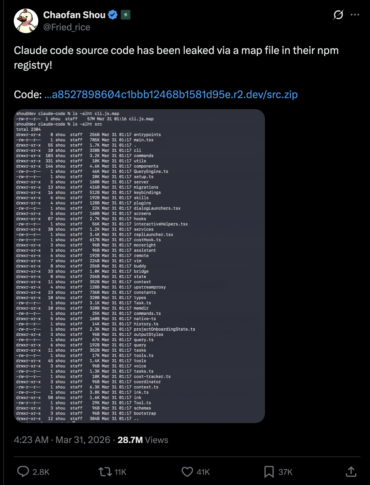

# Hello again, my friends! 😊 <br> {background-color="#2d4563"}

# Brief recap 📚 {background-color="#2d4563"}

## SQL joins and set operations

:::{style="margin-top: 30px; font-size: 25px;"}
:::{.columns}
:::{.column width="50%"}
- Last class we covered advanced SQL table operations:
  - [INNER, LEFT, and FULL OUTER JOIN]{.alert} to combine tables horizontally
  - [CROSS JOIN]{.alert} to produce every combination of two tables
  - [SELF JOIN]{.alert} to compare rows within the same table
  - [UNION, INTERSECT, and EXCEPT]{.alert} to combine query results vertically
  - [UPSERT]{.alert} with `INSERT ... ON CONFLICT` to handle duplicates
  - [VIEWS]{.alert} as saved queries you can treat like tables
:::

:::{.column width="50%"}
:::{style="text-align: center; margin-top: -30px;"}
[{width="90%"}](#){data-modal-type="image" data-modal-url="../lecture-19/figures/joins.webp"}
:::
:::
:::
:::

# Today's agenda 📅 {background-color="#2d4563"}

## Lecture outline

:::{style="margin-top: 30px; font-size: 23px;"}
:::{.columns}
:::{.column width="50%"}
- [Serial vs parallel execution]{.alert}
  - The `map` function and why it matters
  - Embarrassingly parallel problems
  - Big O notation and what parallelism can (and cannot) fix
- [`joblib`]{.alert} for single-node parallelism
  - `Parallel` and `delayed`
  - Timing serial vs parallel with `%timeit`
- [`Dask`]{.alert} for scalable computing
  - Lazy evaluation: arrays and DataFrames
  - Reading and writing CSV and Parquet files
  - `dask.delayed` for custom pipelines
- [DuckDB]{.alert}: running SQL on DataFrames
- [Best practices]{.alert}: when to parallelise and when not to
:::

:::{.column width="50%"}
:::{style="text-align: center; margin-top: -30px;"}
[{width="80%"}](#){data-modal-type="image" data-modal-url="figures/cores.webp"}
[{width="55%"}](#){data-modal-type="image" data-modal-url="figures/dask.png"}
:::
:::
:::
:::

## Funny AI news of the day 😂

:::{style="margin-top: 20px; font-size: 21px;"}
:::{.columns}
:::{.column width=55%}
- Anthropic shipped a debug file with [512K lines of source code]{.alert} inside a routine update ([Decrypt](https://decrypt.co/362917/anthropic-accidentally-leaked-claude-code-source-internet-keeping-forever))
- The cause? They [forgot to add it to `.npmignore`]{.alert}. So it shipped to every user who ran `npm install`
- That's why I keep telling you to use `.gitignore` properly! 😅
- Spotted within minutes, posted on X
- [21 million views]{.alert} before the team woke up
- Code mirrored across GitHub; DMCA takedowns couldn't keep up
- [Sigrid Jin](https://github.com/instructkr) (most active Claude Code user in the world, [25B tokens/year per the WSJ](https://www.wsj.com/tech/ai/claude-code-cursor-codex-vibe-coding-52750531)) rewrote it all in Python before sunrise
- [His repo](https://github.com/instructkr/claw-code) hit [50K stars in 2 hours]{.alert} 🚀
- Anthropic had built "Undercover Mode" to stop Claude from leaking secrets. [Then a human leaked their own code]{.alert} 🤦🏻‍♂️
:::

:::{.column width=45%}
:::{style="text-align: center; margin-top: -30px;"}
[{width="75%"}](#){data-modal-type="image" data-modal-url="figures/anthropic-code-leak.png"}

Source: <https://x.com/Fried_rice/status/2038894956459290963>
:::
:::
:::
:::

# Serial vs parallel algorithms  {background-color="#2d4563"}

## Serial execution

:::{style="margin-top: 30px; font-size: 24pt;"}
- Typical programs run lines one after another:

```{python}
#| echo: true
#| eval: true
#| cache: true 
# Import packages
import numpy as np

# Define an array of numbers
foo = np.array([0, 1, 2, 3, 4, 5])

# Define a function that squares numbers
def bar(x):
    return x * x

# Loop over each element and perform an action on it
for element in foo:
    # Print the result of bar
    print(bar(element))
```
:::

## The `map` function

:::{style="margin-top: 30px; font-size: 26px;"}
:::{.columns}
:::{.column width="50%"}
- One tool that we will use later is called `map`
- This lets us apply a function to each element in a list or array:

:::{style="font-size: 1.2em;"}
```{python}
#| echo: true
#| eval: true
#| cache: true 
# (Very) inefficient function
def my_map(function, array):
    # create a container for the results
    output = []

    # loop over each element
    for element in array:
        
        # add the intermediate result
        output.append(function(element))
    
    # return the now-filled container
    return output
```
:::
:::

:::{.column width="50%"}
:::{style="font-size: 1.2em;"}
```{python}
#| echo: true
#| eval: true
#| cache: true
my_map(bar, foo)
``` 
:::

- Python helpfully provides a `map` function in the standard library:

:::{style="font-size: 1.2em;"}
```{python}
#| echo: true
#| eval: true
#| cache: true
list(map(bar, foo))
```
:::

- The built-in `map` function is much faster than mine (it's implemented in `C`), so of course you should use that one! 😂
::: 
:::
:::

## Using `joblib` for parallel computing

:::{style="margin-top: 30px; font-size: 22px;"}
:::{.columns}
:::{.column width="50%"}
- Each step of our `map` call is [independent]{.alert}, so it is perfect for parallelism
- [`joblib`](https://joblib.readthedocs.io/) makes this easy. Two things to know:
  - `Parallel(n_jobs=k)` runs `k` tasks at the same time
  - `delayed(f)` wraps `f` so joblib can schedule it
- Combine them with a generator expression (see right)
- Install with `pip install joblib`
- `n_jobs=-1` uses [all available CPU cores]{.alert} automatically
- joblib handles the process creation, data transfer, and result collection behind the scenes
- It works best when each task takes at least a few milliseconds; for very cheap operations, [the overhead of spawning processes can be larger than the speedup]{.alert}
:::

:::{.column width="50%"}
- Using our `bar` function and `foo` array from before:

:::{style="font-size: 1.2em;"}
```{python}
#| echo: true
#| eval: true
#| cache: true
# Install joblib if you haven't done so yet
# !pip install joblib

# Import joblib functions 
from joblib import Parallel, delayed

results = Parallel(n_jobs=6)(
    delayed(bar)(x) for x in foo
)
results
```
:::

- `joblib` creates 6 instances of `bar` and applies each one to a different element of `foo`
- The results are the same as before, but the computation runs in parallel
:::
:::
:::

## Serial vs parallel execution

:::{style="margin-top: 30px; font-size: 22px;"}
:::{.columns}
:::{.column width="50%"}
- `calculation` runs 10 heavy operations on 10 million numbers
- Each call is fully independent: [embarrassingly parallel]{.alert}
- We time three things with `%timeit`:
  - one call (baseline)
  - four calls in serial
  - four calls in parallel

- [One call:]{.alert}

:::{style="font-size: 1.2em;"}
```{python}
#| echo: true
#| eval: true
#| cache: true
def calculation(size=10000000):
    # Create a large array and perform operations
    arr = np.random.rand(size)
    for _ in range(10):
        arr = np.sqrt(arr) + np.sin(arr)
    return np.mean(arr)

# Single run
%timeit calculation()
```
:::
:::

:::{.column width="50%"}
- [Four calls, serial:]{.alert}

:::{style="font-size: 1.2em;"}
```{python}
#| echo: true
#| eval: true
#| cache: true
# Sequential runs (4 times)
%timeit [calculation() for _ in range(4)]
```
:::

- [Four calls, parallel:]{.alert}

:::{style="font-size: 1.2em;"}
```{python}
#| echo: true
#| eval: true
#| cache: true
%%timeit
# Parallel runs (4 times)
Parallel(n_jobs=4)(
    delayed(calculation)() for _ in range(4)
)
```
:::

- Not exactly 4× faster (there is some overhead) but the speedup is real
:::
:::
:::

# Big O notation {background-color="#2d4563"}

## Big O notation: why it matters for parallel computing

:::{style="margin-top: 30px; font-size: 24px;"}
:::{.columns}
:::{.column width="50%"}
- [Big O notation]{.alert} describes how runtime grows as the input grows
- [O(1)]{.alert}: constant, does not change with input size (e.g., reading one array element)
- [O(n)]{.alert}: linear, doubles when input doubles (e.g., a single loop)
- [O(n²)]{.alert}: quadratic, quadruples when input doubles (e.g., nested loops)
- Our `calculation` function called on `n` inputs is [O(n)]{.alert}
  - 2 calls take ~2× as long as 1 call, 100 calls take ~100× as long
:::

:::{.column width="50%"}
:::{style="text-align: center;"}
```{python}
#| echo: true
#| code-fold: true
#| eval: true
#| cache: true
import matplotlib.pyplot as plt
import numpy as np

# Simulate processing times
num_images = np.array([1, 10, 50, 100, 200])
sequential_time = num_images * 2  # 2 seconds per image
parallel_time = (num_images * 2) / 4  # 4 cores, ideal speedup

plt.figure(figsize=(8, 5))
plt.plot(num_images, sequential_time, 'o-', label='Serial O(n)', linewidth=2, markersize=8)
plt.plot(num_images, parallel_time, 's-', label='Parallel O(n/4)', linewidth=2, markersize=8)
plt.xlabel('Number of Images', fontsize=12)
plt.ylabel('Time (seconds)', fontsize=12)
plt.title('O(n) Scaling: Serial vs Parallel', fontsize=14, fontweight='bold')
plt.legend(fontsize=11)
plt.grid(True, alpha=0.3)
plt.show()
```

:::
:::
:::
:::

## What parallelism does to complexity

:::{style="margin-top: 30px; font-size: 24px;"}
:::{.columns}
:::{.column width="50%"}
- With `p` cores, an O(n) problem becomes [O(n/p + overhead)]{.alert}
  - 4 cores: theoretically 4× faster, in practice slightly less due to overhead
- [Parallelism never changes the Big O class]{.alert}, only the constant
  - O(n²) stays O(n²); you just reach "too slow" later
- Best candidates: [embarrassingly parallel O(n) tasks]{.alert}
  - Running `n` independent calculations
  - Applying the same function to `n` inputs
  - No shared state, no dependencies between tasks
:::

:::{.column width="50%"}
- [Poor candidates for parallelism:]{.alert}

:::{style="font-size: 1.2em;"}
```{python}
#| echo: true
#| eval: true
#| cache: true
# O(n²): every pair of elements — not independent
def pairwise_sum(data):
    n = len(data)
    results = []
    for i in range(n):
        for j in range(n):
            results.append(data[i] + data[j])
    return results

data = list(range(1000))
# Don't run: ~1 million operations
# pairwise_sum(data)
```
:::

- Other bad candidates: steps that depend on previous results, algorithms with shared state, memory-bound problems
:::
:::
:::

## Try it yourself! 🧠 {#sec:exercise01}

:::{style="margin-top: 30px; font-size: 22px;"}
- Install `joblib` and `NumPy` if you haven't done so yet
  - `!pip install joblib numpy`
- Compare the time of the serial and parallel versions of the following function:

:::{style="font-size: 1.2em;"}
```{python}
#| echo: true
#| eval: false
def square(x):
    return x**2

# Create a large array to process
numbers = np.arange(1000000)

# Sequential version
%timeit [square(x) for x in numbers]
```
:::

- Then try the parallel version:

:::{style="font-size: 1.2em;"}
```{python}
#| echo: true
#| eval: false
from joblib import Parallel, delayed

# Parallel version
%timeit Parallel(n_jobs=4)(delayed(square)(x) for x in numbers)
```
:::

- What did you find? Is the parallel version faster?
- [[Appendix 01]{.button}](#sec:appendix01)
:::

# Dask {background-color="#2d4563"}

## Dask

:::{style="margin-top: 30px; font-size: 22px;"}
:::{.columns}
:::{.column width="50%"}
- [Dask](https://dask.org/) is a parallel computing library for Python
- It gives you [larger-than-memory]{.alert} versions of NumPy arrays and Pandas dataframes
- Write familiar code; Dask handles the parallelism
- Two main components:
  - [Task scheduling]{.alert}: splits your work into a graph of small tasks and runs them in parallel
  - [Big data collections]{.alert}: arrays, dataframes, and lists that look like NumPy/Pandas but can hold more data than your RAM
- Design goals:
  - [Familiar:]{.alert} same NumPy/Pandas API
  - [Native:]{.alert} pure Python
  - [Fast:]{.alert} low overhead on small and large data
:::

:::{.column width="50%"}
:::{style="text-align: center; margin-top: -10px;"}
[{width="90%"}](#){data-modal-type="image" data-modal-url="figures/dask.png"}

Website: <https://www.dask.org/>
:::
:::
:::
:::

## Dask arrays

:::{style="margin-top: 30px; font-size: 22px;"}
:::{.columns}
:::{.column width="50%"}
- Let's import Dask and see how it works

:::{style="font-size: 1.2em;"}
```{python}
#| echo: true
#| eval: true
#| cache: true
import dask.dataframe as dd
import dask.array as da
```
:::

- Dask arrays are a parallel version of NumPy arrays
- They split a large array into [chunks]{.alert}, each of which is a regular NumPy array
- Dask processes chunks in parallel across your CPU cores
- You choose the chunk size when creating the array (here: 100×100 blocks)
- The API is the same as NumPy, so `a.sum()`, `a.mean()`, slicing, etc. all work
:::

:::{.column width="50%"}
- Let's create a Dask array from a large NumPy array:
- The Dask array `a` is a lazy wrapper around the original NumPy array, split into 100×100 chunks

:::{style="font-size: 1.2em;"}
```{python}
#| echo: true
#| eval: true
#| cache: true
data = np.random.normal(size=100000).reshape(200, 500)
a = da.from_array(data, chunks=(100, 100))
a
```
:::
:::
:::
:::

## Dask arrays

:::{style="margin-top: 30px; font-size: 22px;"}
- Dask arrays are [lazy]{.alert}: they do not compute anything until you call `.compute()`
- This lets you build up a full computation graph (an execution plan) before any work runs
- Dask can then [optimise that graph and minimise memory use]{.alert} before executing
- For example, let's slice the Dask array `a` to get the first 10 rows of the 6th column

:::{style="font-size: 1.2em;"}
```{python}
#| echo: true
#| eval: true
#| cache: true
a[:10, 5] # first 10 rows of the 6th column
```
:::

- We use the `.compute()` method to compute the result

:::{style="font-size: 1.2em;"}
```{python}
#| echo: true
#| eval: true
#| cache: true
a[:10, 5].compute()
```
:::
:::

## Dask arrays

:::{style="margin-top: 30px; font-size: 22px;"}
- Dask Array supports many common NumPy operations including:
- Basic arithmetic and scalar mathematics (`+`, `*`, `exp`, `log`, etc)
- Reductions along axes (`sum()`, `mean()`, `std()`)
- Tensor operations and matrix multiplication (`tensordot`)
- Array slicing and basic indexing
- Axis reordering and transposition

:::{style="font-size: 1.2em;"}
```{python}
#| echo: true
#| eval: true
#| cache: true
a.sum().compute()
```
:::

- Let's compare a similar operation in NumPy:

:::{style="font-size: 1.2em;"}
```{python}
#| echo: true
#| eval: true
#| cache: true
size = 100000000
np_arr = np.random.random(size)
%timeit np_result = np.sqrt(np_arr) + np.sin(np_arr)
```
:::

- And in Dask:

:::{style="font-size: 1.2em;"}
```{python}
#| echo: true
#| eval: true
#| cache: true
da_arr = da.random.random(size, chunks='auto')
%timeit (da.sqrt(da_arr) + da.sin(da_arr)).compute()
```
:::
:::

## Dask dataframes

:::{style="margin-top: 30px; font-size: 22px;"}
:::{.columns}
:::{.column width="50%"}
- Dask also provides a parallelised version of Pandas dataframes
- They are composed of many Pandas dataframes, split along the index
- Let's jump into an example:

:::{style="font-size: 1.2em;"}
```{python}
#| echo: true
#| eval: true
#| cache: true
import dask
df = dask.datasets.timeseries()
```
:::

- This is a small dataset of about 240 MB
- Unlike Pandas, Dask DataFrames [are also lazy]{.alert}
- No data is printed here; instead it is replaced by ellipses (`...`)
:::

:::{.column width="50%"}

:::{style="font-size: 1.2em;"}
```{python}
#| echo: true
#| eval: true
#| cache: true
df
```
:::

- Nonetheless, the column names and dtypes are known

:::{style="font-size: 1.2em;"}
```{python}
#| echo: true
#| eval: true
#| cache: true
df.dtypes
```
:::
:::
:::
:::

## Dask dataframes

:::{style="margin-top: 30px; font-size: 20px;"}
:::{.columns}
:::{.column width="50%"}
- Dask DataFrames support a large subset of the Pandas API
- Some operations will automatically display the data

:::{style="font-size: 1.2em;"}
```{python}
#| echo: true
#| eval: true
#| cache: true
import pandas as pd

pd.options.display.precision = 2
pd.options.display.max_rows = 10

df.head()
```
:::
:::

:::{.column width="50%"}
- Here we filter rows where `y > 0`, then compute the standard deviation of `x` per group:

:::{style="font-size: 1.2em;"}
```{python}
#| echo: true
#| eval: true
#| cache: true
df2 = df[df.y > 0]
df3 = df2.groupby("name").x.std()
df3
```
:::

- Note that `df3` is still not shown
- We can use the `.compute()` method to display the result

:::{style="font-size: 1.2em;"}
```{python}
#| echo: true
#| eval: true
#| cache: true
df3.compute()
```
:::
:::
:::
:::

## Dask dataframes

:::{style="margin-top: 30px; font-size: 20px;"}
:::{.columns}
:::{.column width="50%"}
- Aggregations are also supported
- Here we compute the sum of `x` and the maximum of `y`, grouped by `name`

:::{style="font-size: 1.2em;"}
```{python}
#| echo: true
#| eval: true
#| cache: true
df4 = df.groupby("name").aggregate({"x": "sum", "y": "max"})
df4.compute()
```
:::
:::

:::{.column width="50%"}
- If you have enough RAM for the whole dataset, you can keep it in memory with `.persist()`
- Once persisted, future computations on that data skip the re-loading step

:::{style="font-size: 1.2em;"}
```{python}
#| echo: true
#| eval: true
#| cache: true
df5 = df4.persist()
df5.head()
```
:::
:::
:::
:::

## Combining Dask and Pandas

:::{style="margin-top: 30px; font-size: 22px;"}
:::{.columns}
:::{.column width="50%"}
- Dask and Pandas work together naturally
- Use Dask for the heavy lifting (large data, parallelism), then call `.compute()` to get a regular Pandas DataFrame for final steps
- This is the typical real-world pattern:
  1. Load and filter with Dask (fast, parallel)
  2. Aggregate to a small result
  3. Call `.compute()` to convert to Pandas
  4. Use Pandas for plotting, formatting, or export
- In short: Dask handles what doesn't fit in memory, Pandas handles everything else
- Most Dask code looks almost identical to Pandas, so switching between them is easy
:::

:::{.column width="50%"}
:::{style="font-size: 1.2em;"}
```{python}
#| echo: true
#| eval: true
import dask
import dask.dataframe as dd

df = dask.datasets.timeseries()

# Step 1-2: filter and aggregate with Dask
summary = (
    df[df.x > 0]
    .groupby("name")
    .agg({"x": "mean", "y": "std"})
)

# Step 3: bring to Pandas
pdf = summary.compute()

# Step 4: use Pandas normally
pdf.sort_values("x", ascending=False).head(5)
```
:::
:::
:::
:::

## Try it yourself! 🧠 {#sec:exercise02}

:::{style="margin-top: 30px; font-size: 18px;"}
- Install `dask` if you haven't done so yet
  - `!pip install dask`

- [Find the right chunk size!]{.alert}

- Create a Dask array with **10 million** random numbers (or less if you have memory constraints)
- Vary the chunk size and time the following operation:
- Calculate `mean(sqrt(x^2))` on the Dask array
- See the code below for an example with three different chunk sizes. Which one worked best for you? Why do you think that is?

:::{style="font-size: 1.2em;"}
```python
import numpy as np
import dask.array as da

size = 10_000_000

# Dask with SMALL chunks
da_data_small = da.random.random(size, chunks=100_000)  # 100 chunks
%timeit da.sqrt(da_data_small**2).mean().compute()

# Dask with MEDIUM chunks
da_data_medium = da.random.random(size, chunks=2_000_000)  # 5 chunks
%timeit da.sqrt(da_data_medium**2).mean().compute()

# Dask with LARGE chunks
da_data_large = da.random.random(size, chunks=5_000_000)  # Only 2 chunks
%timeit da.sqrt(da_data_large**2).mean().compute()
```
:::
- [[Appendix 02]{.button}](#sec:appendix02)
:::

## SQL on DataFrames with DuckDB

:::{style="margin-top: 30px; font-size: 22px;"}
:::{.columns}
:::{.column width="50%"}
- [DuckDB](https://duckdb.org/) lets you run SQL queries on Pandas DataFrames
- No server, no setup: just `pip install duckdb`
- It queries your DataFrame variables [by name]{.alert}: the Python variable `pdf` becomes the SQL table `pdf`
- Also reads `.parquet` and `.csv` files directly in SQL

:::{style="font-size: 1.2em;"}
```{python}
#| echo: true
#| eval: true
#| cache: true
import duckdb
import dask

# Create a sample Pandas DataFrame
df = dask.datasets.timeseries()
pdf = df.head(1000)

# Query it with SQL — no registration needed
duckdb.sql("SELECT AVG(x) AS mean_x FROM pdf")
```
:::
:::

:::{.column width="50%"}
- You can write full SQL queries with GROUP BY, joins, subqueries, etc.

:::{style="font-size: 1.2em;"}
```{python}
#| echo: true
#| eval: true
#| cache: true
duckdb.sql("""
    SELECT name,
           AVG(x)   AS mean_x,
           COUNT(*)  AS n
    FROM pdf
    GROUP BY name
    ORDER BY mean_x DESC
    LIMIT 5
""")
```
:::

- DuckDB can also query files without loading them first:

:::{style="font-size: 1.2em;"}
```python
# Read a Parquet file directly in SQL
duckdb.sql("SELECT * FROM 'data/sales.parquet'")
```
:::
:::
:::
:::

# Read and write data with Dask {background-color="#2d4563"}

## Reading and writing data

:::{style="margin-top: 30px; font-size: 22px;"}
:::{.columns}
:::{.column width="50%"}
- `.csv` is very common in data science (and for good reasons)
- Pandas reads `.csv` well, but it loads the [entire file into memory]{.alert}
- For large files, that can mean several gigabytes of RAM
- Dask provides a [much more efficient way](https://docs.dask.org/en/latest/dataframe-create.html) to read and write `.csv` files
- Let's split our dataset into daily files:
:::

:::{.column width="50%"}
:::{style="font-size: 1.2em;"}
```{python}
#| echo: true
#| eval: true
#| cache: true
df = dask.datasets.timeseries()
df
```
:::

:::{style="font-size: 1.2em;"}
```{python}
#| echo: true
#| eval: true
import os
import datetime

if not os.path.exists('data'):
    os.mkdir('data')

def name(i):
    return str(datetime.date(2000, 1, 1)
               + i * datetime.timedelta(days=1))

df.to_csv('data/*.csv', name_function=name);
```
:::
:::
:::
:::

## Reading and writing data

:::{style="margin-top: 30px; font-size: 22px;"}
:::{.columns}
:::{.column width="50%"}
- We now have many CSV files in our `data` directory, one for each day in January 2000
- We can read all of them as one logical dataframe using `dd.read_csv`
- Dask reads the files in parallel and only loads what it needs

:::{style="font-size: 1.2em;"}
```{python}
#| echo: true
#| eval: true
#| cache: true
df = dd.read_csv('data/2000-*-*.csv')
df
```
:::
:::

:::{.column width="50%"}
- Let's do a simple computation

:::{style="font-size: 1.2em;"}
```{python}
#| echo: true
#| eval: true
#| cache: true
%timeit df.groupby('name').x.mean().compute()
```
:::
:::
:::
:::

## Reading and writing data
### Parquet files

:::{style="margin-top: 30px; font-size: 22px;"}
:::{.columns}
:::{.column width="50%"}
- Although `.csv` files are nice, newer formats like [Parquet](https://parquet.apache.org/) are gaining popularity
- Data are [stored by column rather than by row]{.alert}, so you can query specific columns without reading the whole file
- Files are typically [75% smaller]{.alert} than equivalent CSV

:::{style="font-size: 1.2em;"}
```{python}
#| echo: true
#| eval: true
#| cache: true
df.to_parquet('data/2000-01.parquet',
              engine='pyarrow')
```
:::
:::

:::{.column width="50%"}
- Now we can read the parquet file (note we can select specific columns)

:::{style="font-size: 1.2em;"}
```{python}
#| echo: true
#| eval: true
#| cache: true
df = dd.read_parquet('data/2000-01.parquet',
                     columns=['name', 'x'],
                     engine='pyarrow')
df
```
:::

- The same computation, now on Parquet:

:::{style="font-size: 1.2em;"}
```{python}
#| echo: true
#| eval: true
#| cache: true
%timeit df.groupby('name').x.mean().compute()
```
:::
:::
:::
:::

## Why Parquet?

:::{style="margin-top: 30px; font-size: 22px;"}
:::{.columns}
:::{.column width="50%"}
- CSV is [row-based]{.alert}: reading one column means scanning every row
- Parquet is [column-based]{.alert}: it reads only the columns you ask for

| Feature | CSV | Parquet |
|---------|-----|---------|
| Storage | Row-based | Column-based |
| Compression | None | Snappy/gzip |
| Column selection | Reads all | Reads only needed |
| Data types | Text only | Typed (int, float, date) |
| File size (1M rows) | ~100 MB | ~25 MB |
:::

:::{.column width="50%"}
:::{style="font-size: 1.2em;"}
```python
import pandas as pd

# CSV: reads everything, infers types
df = pd.read_csv("sales.csv")

# Parquet: reads only what you need
df = pd.read_parquet("sales.parquet",
                     columns=["date", "revenue"])
```
:::

- Use Parquet when you have [many columns]{.alert} but query only a few, files are [larger than ~100 MB]{.alert}, or you share data across Python, R, and Spark
- CSV is still fine for small files, one-off exports, or sharing with non-technical users
:::
:::
:::

# Dask delayed {background-color="#2d4563"}

## Dask delayed

:::{style="margin-top: 30px; font-size: 22px;"}
:::{.columns}
:::{.column width="50%"}
- Sometimes you don't want to use an entire Dask DataFrame or Dask Array
- You may want to parallelise a single function, for instance, or a small part of your code
- There is a way to do this with Dask: the `dask.delayed` function

:::{style="font-size: 1.2em;"}
```{python}
#| echo: true
#| eval: true
#| cache: true
def calculation(size=10000000):
    arr = np.random.rand(size)
    for _ in range(10):
        arr = np.sqrt(arr) + np.sin(arr)
    return np.mean(arr)

%timeit [calculation() for _ in range(4)]
```
:::
:::

:::{.column width="50%"}
- We just need to add the `@dask.delayed` decorator to the function

:::{style="font-size: 1.2em;"}
```{python}
#| echo: true
#| eval: true
#| cache: true
@dask.delayed
def delayed_calculation(size=10000000):
    arr = np.random.rand(size)
    for _ in range(10):
        arr = np.sqrt(arr) + np.sin(arr)
    return np.mean(arr)

results = []
for _ in range(5):
    results.append(delayed_calculation())

# Compute all results at once
%timeit final_results = dask.compute(*results)
```
:::

- The results are much faster, and we didn't have to change the code at all!
- Just remember to add the `.compute()` method at the end
:::
:::
:::

## Dask delayed

:::{style="margin-top: 30px; font-size: 22px;"}
- We can even visualise the computation graph

:::{style="font-size: 1.2em;"}
```{python}
#| echo: true
#| eval: true
#| cache: true
@dask.delayed
def generate_data(size):
    return np.random.rand(size)

@dask.delayed
def transform_data(data):
    return np.sqrt(data) + np.sin(data)

@dask.delayed
def aggregate_data(data):
    return {
        'mean': np.mean(data),
        'std': np.std(data),
        'max': np.max(data)
    }

# Compare execution
sizes = [1000000, 2000000, 3000000]

# Dask execution
dask_results = []
for size in sizes:
    data = generate_data(size)
    transformed = transform_data(data)
    stats = aggregate_data(transformed)
    dask_results.append(stats)

%timeit dask.compute(*dask_results)
```
:::

:::{style="font-size: 1.2em;"}
```{python}
#| echo: true
#| eval: true
#| cache: true
# Requires graphviz: pip install graphviz
dask.visualize(*dask_results)
```
:::
:::

# Best practices {background-color="#2d4563"}

## Best practices

:::{style="margin-top: 30px; font-size: 23px;"}
:::{.incremental}
- Parallel computing is not always the right tool. Tips from the Dask docs:
- [Start small]{.alert}: NumPy or Pandas may already have a fast function. Switching to Parquet alone can be a big speedup
- [Sample first]{.alert}: _do you really need_ all those TBs of data?
- [Load with Dask from the start]{.alert}: easier to scale up than to scale down
- [Call `.compute()` and `.persist()` sparingly]{.alert}: each call triggers execution, so batch your work
- [Experiment with chunk sizes]{.alert}: try a few, or use `chunks=’auto’`
- [Break computations into many pieces]{.alert}: more pieces means more parallelism
- [Use `.parquet`]{.alert} over `.csv` for large datasets
- More tips: [Dask best practices](https://docs.dask.org/en/latest/best-practices.html)
:::
:::

# And that's all for today! 🎉 {background-color="#2d4563"}

# See you next time! 😊 {background-color="#2d4563"}

## Appendix 01 {#sec:appendix01}

:::{style="margin-top: 30px; font-size: 24px;"}
- Here is the solution to the exercise:

```{python}
#| echo: true
#| eval: true
#| cache: true
def square(x):
    return x**2

# Create a large array to process
numbers = np.arange(1000000)

# Sequential version
%timeit [square(x) for x in numbers]
```

```{python}
#| echo: true
#| eval: true
#| cache: true
from joblib import Parallel, delayed

# Parallel version
%timeit Parallel(n_jobs=4)(delayed(square)(x) for x in numbers)
```

- [Expected result:]{.alert} the parallel version is *slower* here. `square(x)` is so fast that joblib's process-spawning overhead dominates. Parallel computing pays off when each task is heavy, not trivial.

[[Back to exercise]{.button}](#sec:exercise01)
:::

## Appendix 02 {#sec:appendix02}

:::{style="margin-top: 30px; font-size: 22px;"}
- Create an array with **10 million** random numbers and calculate: `mean(sqrt(x^2))`
- Try different chunk sizes and see which one works best

```{python}
#| echo: true
#| eval: true
#| cache: true
size = 10000000

# Dask with SMALL chunks 
da_data_small = da.random.random(size, chunks=100000)
%timeit da.sqrt(da_data_small**2).mean().compute()
```

```{python}
#| echo: true
#| eval: true
#| cache: true
# Dask with MEDIUM chunks 
da_data_medium = da.random.random(size, chunks=2000000)
%timeit da.sqrt(da_data_medium**2).mean().compute()
```

```{python}
#| echo: true
#| eval: true
#| cache: true
# Dask with LARGE chunks 
da_data_large = da.random.random(size, chunks=5000000)
%timeit da.sqrt(da_data_large**2).mean().compute()
```

```{python}
#| echo: true
#| eval: true
#| cache: true
# Dask with AUTO chunks 
da_data_auto = da.random.random(size, chunks='auto')
%timeit da.sqrt(da_data_auto**2).mean().compute()
```

[[Back to exercise]{.button}](#sec:exercise02)
:::