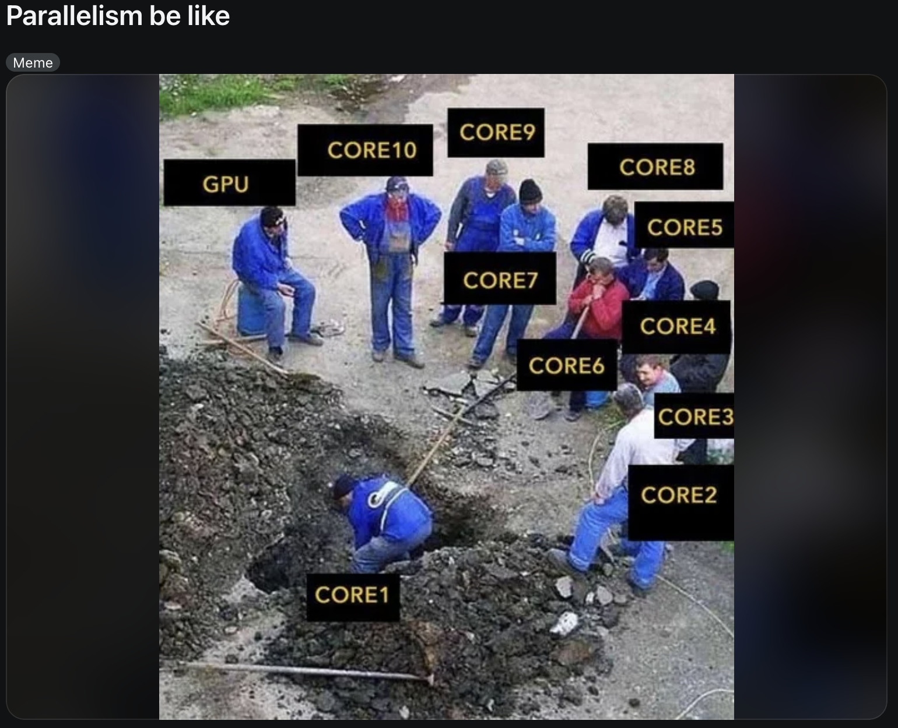
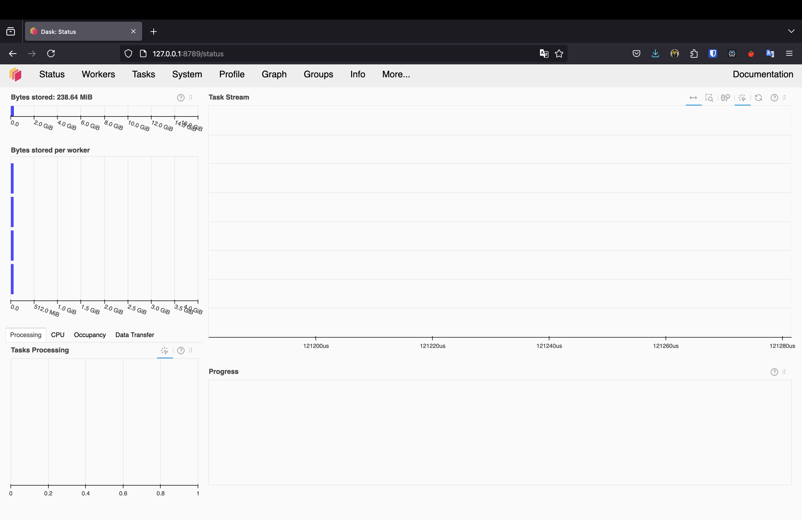
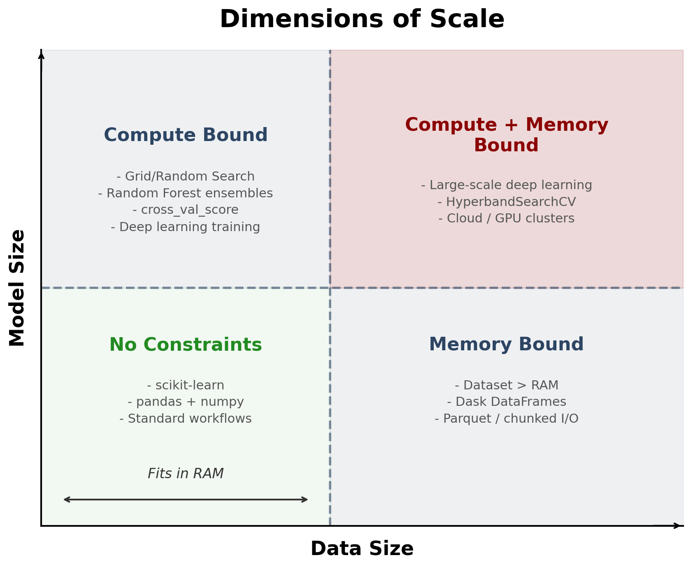
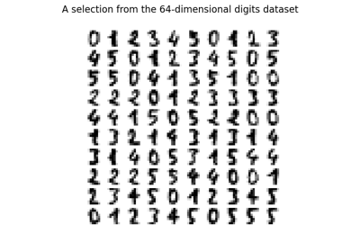
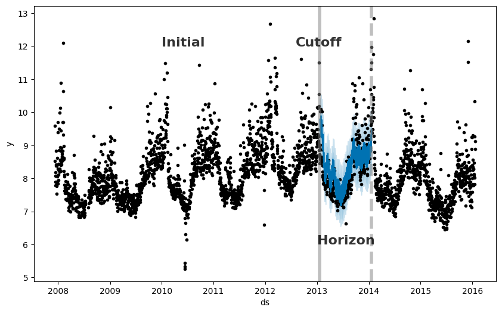

# Hello again! 😊 <br> How's everything? {background-color="#2d4563"}

# Brief recap of last class 📚 {background-color="#2d4563"}

## Parallel computing

:::{style="margin-top: 30px; font-size: 23px;"}
:::{.columns}
:::{.column width="50%"}
- **Parallel computing** is a type of computation in which many [calculations or processes are carried out simultaneously]{.alert}
- Python has several libraries that allow you to parallelise your code
  - We discussed the `joblib` library, which is a simple and effective way to parallelise your code
  - But we spent most of our time discussing `Dask`, which is currently the _de facto_ standard for parallel computing in Python 
- We also saw that [parallel computing is not a panacea]{.alert}: it can be hard to implement and may not always lead to performance improvements
- But when it works, it works great! 🚀
:::

:::{.column width="50%"}
:::{style="text-align: center; margin-top: -40px;"}
[{width="100%"}](#){data-modal-type="image" data-modal-url="figures/parallel.png"}
:::
:::
:::
:::

# Today's agenda 📅 {background-color="#2d4563"}

## Lecture outline

:::{style="margin-top: 30px; font-size: 23px;"}
:::{.columns}
:::{.column width="45%"}
- Today, we will continue exploring parallel computing with Dask, but we will focus on a specific use case: [automated machine learning (AutoML)](https://en.wikipedia.org/wiki/Automated_machine_learning)
- Set up [local Dask Clusters]{.alert} with workers, schedulers, and dashboards
- Use [Dask ML]{.alert} for distributed machine learning and model training
- Parallelise hyperparameter tuning with [IncrementalSearchCV]{.alert}, [HyperbandSearchCV]{.alert}, and [TPOT]{.alert}
- Handle [async/sync compatibility]{.alert} issues and cache computations
- Measure speedup and efficiency gains
:::

:::{.column width="55%"}
:::{style="text-align: center; margin-top: -20px;"}
[{width="100%"}](#){data-modal-type="image" data-modal-url="figures/meme01.png"}
:::
:::
:::
:::

# Dask Clients and Clusters 🌐 {background-color="#2d4563"}

## What is a Dask Cluster?
### Workers and schedulers

:::{style="margin-top: 30px; font-size: 23px;"}
- A Dask Cluster is [a group of computational engines]{.alert} (cores, GPUs, servers, etc.) that work together to solve a problem
- Workers provide two functions:
  - [Compute tasks as directed by the scheduler]{.alert}. The scheduler is the brain of the cluster
  - [Store and serve computed results]{.alert} to other workers or clients
- Workers are the reason why lazy evaluation speeds up computations
- Here is a simple example:

:::{style="font-size: 26px;"}
```{markdown}
Scheduler -> Eve: Compute a <- multiply(3, 5)!
Eve -> Scheduler: I've computed a and am holding on to it! 
Scheduler -> Frank: Compute b <- add(a, 7)!
Frank: You will need a. Eve has a.
Frank -> Eve: Please send me a.
Eve -> Frank: Sure. a is 15!
Frank -> Scheduler: I've computed b and am holding on to it!
```
:::
:::

## What is a Dask Cluster?
### Workers and schedulers

:::{style="margin-top: 27px; font-size: 24px;"}
- How do workers know what to do?
  - The scheduler [assigns tasks to workers based on their availability]{.alert}
  - Workers can be on the same machine or on different machines
  - Workers can be CPUs or GPUs
- These processes can [automatically restart and scale up]{.alert} without any intervention from the user
- The optimal number of workers depends on data size and computation complexity. Often the default configuration is sufficient
- In an adaptive cluster, you set the minimum and maximum number of workers. The cluster adds and removes workers as needed
- [Dask also provides a dashboard to monitor the performance of your cluster]{.alert}
:::

## Setting up a Dask Cluster

:::{style="margin-top: 30px; font-size: 27px;"}
- First, we need to install Dask and the distributed scheduler. I tested this with `dask==2025.11.0` and `distributed==2025.11.0`

```{verbatim}
python -m pip install "dask==2025.11.0" "distributed==2025.11.0"
```

- The `distributed` scheduler is the default for Dask and it works great 👍
- Conda users can install it with:

```{verbatim}
conda install dask=2025.11.0 distributed=2025.11.0 -c conda-forge
```
:::

## Setting up a Dask Client

:::{style="margin-top: 30px; font-size: 22px;"}
- Using `dask.distributed` requires that you set up a Client 
- This should be [the first thing you do]{.alert} if you intend to use `dask.distributed` in your analysis
- It offers low latency, data sharing between the workers, and is easy to set up

:::{style="font-size: 26px;"}
```{python}
#| echo: true
#| eval: true
from dask.distributed import LocalCluster, Client

# Specify a different port for the dashboard
# Use fewer workers and threads to avoid resource issues
cluster = LocalCluster(dashboard_address=':8789', n_workers=2, threads_per_worker=2)
client = Client(cluster)

# Print the dashboard link
print(f"Dask dashboard is available at: {cluster.dashboard_link}")
```
:::

- The `Client` object provides a way to interact with the cluster, submit tasks, and monitor the progress of computations
- You will see a screen like this in your browser:
:::

## Dask Client Dashboard

:::{style="margin-top: 30px; font-size: 20px; text-align: center;"}
[{width="100%"}](#){data-modal-type="image" data-modal-url="figures/dask-dashboard01.png"}
:::

## Dask Client Dashboard

:::{style="margin-top: 30px; font-size: 20px; text-align: center;"}
[{width="100%"}](#){data-modal-type="image" data-modal-url="figures/dask-dashboard02.png"}
:::

## Testing the Dask Client

:::{style="margin-top: 30px; font-size: 22px;"}
- You can test the Dask Client by running a simple computation

```{python}
#| echo: true
#| eval: true
import dask.array as da

# Create a random array (smaller size for interactive use)
# For large arrays, consider using a script or Jupyter notebook instead of terminal
x = da.random.RandomState(42).random((5000, 5000), chunks=(1000, 1000))
x
```

```{python}
#| echo: true
#| eval: true
# Perform a simple computation
y = (x + x.T).sum()

# Compute the result
y.compute()
```

- The `RandomState` object is used to set a seed number
- We can inspect the client dashboard to see how the computation was distributed across the workers
:::

## Testing the Dask Client

:::{style="margin-top: 30px; font-size: 20px; text-align: center;"}
[{width="100%"}](#){data-modal-type="image" data-modal-url="figures/dask-dashboard03.png"}
:::

## Testing the Dask Client

:::{style="margin-top: 30px; font-size: 20px; text-align: center;"}
[{width="100%"}](#){data-modal-type="image" data-modal-url="figures/dask-dashboard04.png"}
:::

## Troubleshooting Common Issues

:::{style="margin-top: 30px; font-size: 19px;"}
:::{.columns}
:::{.column width="50%"}
If you encounter errors like:

- `"No buffer space available"`
- `"Stream is closed"`
- `"CommClosedError"`

This typically happens when:

- Running large Dask computations in an interactive terminal
- System runs out of network resources for inter-worker communication
- Array size is too large for your system's resources

**Solutions:**

- Use smaller array sizes
- Limit the number of workers and threads
- Run code in a Python script or use Jupyter Notebooks
- Close and restart your Dask client if it becomes unresponsive
:::

:::{.column width="50%"}
If you encounter `RuntimeError: Attempting to use an asynchronous Client in a synchronous context`, this is a version incompatibility between `dask_ml` and `dask 2025.x`

- `dask_ml`'s `IncrementalSearchCV` and `HyperbandSearchCV` run `_fit()` as an `async` coroutine
- But `_fit()` internally calls `dask.persist()`, which is a synchronous API
- In `dask 2025.x`, calling synchronous APIs from inside an async context raises this error
- The fix is to patch `dask.base._ensure_not_async` so it returns the distributed client's scheduler directly:

:::{style="font-size: 26px;"}
```{python}
#| echo: true
#| eval: true
import dask.base
dask.base._ensure_not_async = lambda client: client.get
```
:::
:::
:::
:::

# Dask ML 🤖 {background-color="#2d4563"}

## Dimensions of Scale

:::{style="font-size: 22px; text-align: center;"}
[{width="70%"}](#){data-modal-type="image" data-modal-url="figures/dimensions-of-scale.png"}
:::

## Addressing the Challenges

:::{style="margin-top: 30px; font-size: 25px;"}
:::{.columns}
:::{.column width="50%"}
### Challenge 1: Scaling Model Size

- **Model size**: the number of parameters in a model
- More complex models need more computational resources to train
- Tasks like training, prediction, or evaluation will eventually complete. They just take too long
- You've become [compute bound]{.alert}
- You can keep using your current libraries (pandas, numpy, scikit-learn, etc.), but you need to scale them up
:::

:::{.column width="50%"}
### Challenge 2: Scaling Data Size

- **Data size**: the number of samples in your dataset
- Sometimes datasets grow larger than RAM (the horizontal axis in the figure)
- When that happens, even loading the data into numpy or pandas becomes impossible
- You've become [memory bound]{.alert}
- You can use a different file format (Parquet, Dask DataFrame, etc.) together with algorithms that handle large datasets
:::
:::
:::

## What is Dask ML?

:::{style="margin-top: 30px; font-size: 29px;"}
- [Dask ML](https://ml.dask.org/) is a scalable machine learning library built on top of Dask
- It provides parallel implementations of many popular libraries: [scikit-learn](https://scikit-learn.org/), [XGBoost](https://xgboost.readthedocs.io/), [LightGBM](https://lightgbm.readthedocs.io/), [TensorFlow](https://www.tensorflow.org/), and [PyTorch](https://pytorch.org/)
- Dask ML uses Dask arrays and dataframes, so you can scale your ML workflows to large datasets
- You can use it for model selection, model evaluation, and hyperparameter tuning
- It also works with [automated machine learning (AutoML)](https://en.wikipedia.org/wiki/Automated_machine_learning) tools to speed up the process
- So let's see what AutoML is and how to use it with Dask ML!
:::

# AutoML 🤖 {background-color="#2d4563"}

## What is AutoML?

:::{style="margin-top: 30px; font-size: 22px;"}
- [AutoML](https://en.wikipedia.org/wiki/Automated_machine_learning) is a set of tools that, well, automate the process of applying machine learning
- The main goal of AutoML is to make machine learning more [accessible to non-experts and to speed up the process of building machine learning models]{.alert}
- Think about it as a more advanced version of scikit-learn (or a more realistic version of "vibe coding" 😂)
- This allows users to focus on the problem at hand rather than the intricacies of the algorithms
- There are [several tools available for AutoML]{.alert}, such as:
  - [TPOT](https://epistasislab.github.io/tpot/)
  - [Amazon SageMaker Autopilot](https://aws.amazon.com/sagemaker/autopilot/)
  - [Auto-sklearn](https://automl.github.io/auto-sklearn/master/)
  - [H2O.ai](https://www.h2o.ai/)
  - [Google Cloud AutoML](https://cloud.google.com/automl)
  - [Microsoft Azure AutoML](https://azure.microsoft.com/en-us/services/machine-learning/automated-ml/)
- All of them are great, but they have different features and capabilities
- Here we will use Dask ML to parallelise the training of machine learning models with scikit-learn
:::

## What is Dask ML?

:::{style="margin-top: 30px; font-size: 22px;"}
- First, let's install Dask ML (using version 2025.1.0 for this example):

```{verbatim}
pip install "dask-ml==2025.1.0" "scikit-learn==1.8.0" 
# or 
conda install dask-ml=2025.1.0 scikit-learn=1.8.0 -c conda-forge
```

- And then import the necessary modules, mainly scikit-learn:

```{python}
#| echo: true
#| eval: true
import time
import numpy as np
from dask.distributed import LocalCluster, Client
import joblib
from sklearn.datasets import load_digits
from sklearn.model_selection import RandomizedSearchCV
from sklearn.svm import SVC
```

- The [`load_digits` dataset](https://scikit-learn.org/1.5/modules/generated/sklearn.datasets.load_digits.html) contains 1797 8x8 pixel images of handwritten digits
- The task is to predict the digit from the image

:::{style="text-align: center;"}
[{width="65%"}](#){data-modal-type="image" data-modal-url="figures/digits.png"}
:::
:::

## Dask ML and scikit-learn

:::{style="margin-top: 30px; font-size: 23px;"}
- We'll estimate the model using a simple grid search
- `param_space`: a list of settings to try for the model
- `C`: controls regularisation to prevent overfitting. Smaller values = more regularisation
  - Uses exponential notation: `np.logspace(-6, 6, 13)` creates 13 values between $10^{-6}$ and $10^6$
- `gamma`: defines how far a single example's influence reaches
  - Also exponential: `np.logspace(-8, 8, 17)` creates 17 values between $10^{-8}$ and $10^8$
- `tol` (tolerance): tells the model when to stop improving
- `class_weight`: options for handling imbalanced data
- This is standard scikit-learn code, but with one key difference: we use `joblib.parallel_backend('dask')` to parallelise the search
- This distributes the search across the Dask cluster workers (automatically!)
- `RandomizedSearchCV` will try 50 different hyperparameter combinations and return the best one
:::

## Dask ML and scikit-learn

:::{style="margin-top: 30px; font-size: 19px;"}
```{python}
#| echo: true
#| eval: true
# Load the digits dataset
digits = load_digits()   

# Define the parameter space to search through
param_space = {
    'C': np.logspace(-6, 6, 13),      
    'gamma': np.logspace(-8, 8, 17),
    'tol': np.logspace(-4, -1, 4),
    'class_weight': [None, 'balanced'], 
}

# Create the model
model = SVC()

search = RandomizedSearchCV(
    model,
    param_space,
    cv=3,
    n_iter=50,
    verbose=10
)

# Perform the search using Dask
start_time = time.time()
with joblib.parallel_backend('dask'):
    search.fit(digits.data, digits.target)

end_time = time.time()

# Calculate the elapsed time
elapsed_time = end_time - start_time

# Print the best parameters
print("Best parameters found: ", search.best_params_)
print("Best score: ", search.best_score_)
print("Best estimator: ", search.best_estimator_)
print("Time taken: {:.2f} seconds".format(elapsed_time))
```
:::

## Now let's tackle the problems we discussed earlier...
### Neither compute nor memory constrained

:::{style="margin-top: 30px; font-size: 30px;"}

- The model was trained in just a few seconds!
- The dataset is small, so we are not memory constrained
- The model is not complex, so we are not compute constrained
- So in this case we only used Dask to parallelise the search, but we could have used scikit-learn alone
- But [what if we had a larger dataset or a more complex model?]{.alert}
:::

## Memory constrained, but not compute constrained

:::{style="margin-top: 30px; font-size: 27px;"}
- The dataset is [too large to fit in memory]{.alert}, but we have enough compute power to train the model
- Parquet files and Dask DataFrames help load data in chunks, but that alone may not be enough
- [`IncrementalSearchCV`]{.alert} from `dask_ml` trains models on chunks of data, rather than loading everything at once
- It starts with many hyperparameter candidates on a small data slice, then [keeps only the best performers]{.alert} for further training
- This strategy relies on scikit-learn's [`partial_fit`](https://scikit-learn.org/stable/modules/generated/sklearn.linear_model.SGDClassifier.html#sklearn.linear_model.SGDClassifier.partial_fit) method
- See the [Dask ML documentation](https://ml.dask.org/hyper-parameter-search.html) for newer variants
:::

## Incremental Search

:::{style="margin-top: 30px; font-size: 22px;"}
- Let's see an example with [18 million possible hyperparameter combinations]{.alert} (`3000 × 3000 × 2`) and a dataset with 200 million samples (!)
- Combined, `X` and `y` will take up about 32 GB of memory, so they won't fit in most machines' RAM
- We will use the `make_classification` function from `dask_ml.datasets` to create the dataset

```{python}
#| echo: true
#| eval: true
# Troubleshooting: if you encounter async/sync issues, add this before
# creating the Dask client:
#   import dask.base
#   dask.base._ensure_not_async = lambda client: client.get

from dask_ml.datasets import make_classification
from sklearn.linear_model import SGDClassifier
from dask_ml.model_selection import IncrementalSearchCV

# 200M samples x 20 features x 8 bytes (float64) ~ 32 GB
# Dask loads data in 500k-row chunks, so it never sits in RAM all at once
X, y = make_classification(n_samples=200000000, n_features=20,
                           chunks=500000, random_state=0)

# SGDClassifier supports partial_fit, which IncrementalSearchCV requires
# elasticnet combines L1 (sparsity) and L2 (stability) regularisation
model = SGDClassifier(tol=1e-3, penalty='elasticnet', random_state=0)

# 3000 x 3000 x 2 = 18 million candidate combinations
params = {
    'alpha': np.logspace(-3, 2, num=3000),   # regularisation strength
    'l1_ratio': np.linspace(0, 1, num=3000), # L1/L2 balance (0 = L2, 1 = L1)
    'average': [True, False]                 # average SGD weights or not
}

# decay_rate=None keeps all candidates active throughout training
search = IncrementalSearchCV(model, params, random_state=0, decay_rate=None)

start_time = time.time()
search.fit(X, y, classes=[0, 1])
elapsed_time = time.time() - start_time

print("Best parameters found: ", search.best_params_)
print("Best score: ", search.best_score_)
print("Best estimator: ", search.best_estimator_)
print(f"Time taken: {elapsed_time:.2f} seconds")
```
:::

## Incremental Search

:::{style="margin-top: 30px; font-size: 30px;"}
- It took [about 4 minutes]{.alert} to train the model, which is _pretty fast_ considering the size of the dataset
- My computer has 16 GB of RAM, so the full dataset would not fit in memory
- But [the model ran fine]{.alert} because Dask processes data in chunks — no slowdown
- Now let's see another example...
:::

## Compute constrained, but not memory constrained

:::{style="margin-top: 30px; font-size: 21px;"}

- Here we have a case where the model is too complex to train in a reasonable amount of time
- Or the models require specialised hardware like GPUs
- The best class for this case is `HyperbandSearchCV`, which is a hyperparameter search algorithm that is based on the [Hyperband algorithm](https://arxiv.org/abs/1603.06560)
- In a nutshell, this algorithm is easy to use, has strong mathematical motivation and often performs well 

```{python}
#| echo: true
#| eval: true
from dask_ml.model_selection import HyperbandSearchCV
from dask_ml.datasets import make_classification
from sklearn.linear_model import SGDClassifier

X, y = make_classification(n_samples=5000000, n_features=20,
                           n_informative=10, chunks=10000,
                           random_state=0)
# SGDClassifier supports partial_fit, which Hyperband needs
est = SGDClassifier(tol=1e-3)

# 3000 * 1000 * 4 * 2 = 24 million candidate combinations
param_dist = {
    'alpha': np.logspace(-5, 2, num=3000),   # regularisation strength
    'l1_ratio': np.linspace(0, 1, num=1000), # mix of L1 vs L2 penalty
    'loss': ['hinge', 'log_loss',             # SVM, logistic regression,
             'modified_huber', 'squared_hinge'], # and two variants
    'average': [True, False]                  # average SGD weights or not
}

start_time = time.time()
search = HyperbandSearchCV(est, param_dist, max_iter=500)
search.fit(X, y, classes=np.unique(y))
end_time = time.time()

elapsed_time = end_time - start_time
print("Best parameters found: ", search.best_params_)
print("Best score: ", search.best_score_)
print(f"Time taken: {elapsed_time:.2f} seconds")
```
:::

## Compute and memory constrained

:::{style="margin-top: 30px; font-size: 30px;"}
- This is the worst-case scenario, where you have a large dataset and a complex model
- In this case, you can use a combination of the strategies we discussed earlier
  - Use Dask DataFrames to load the data in chunks
  - Use Parquet files to store the data efficiently and load only the necessary columns
  - Use the `HyperbandSearchCV` class to search for the best hyperparameters

- Apart from this, you can always use cloud computing services like AWS, GCP, or Azure...
- ... or pray to the machine learning gods 😂
:::

# More AutoML 🤖 {background-color="#2d4563"}

## TPOT

:::{style="margin-top: 30px; font-size: 24px;"}
- [TPOT](https://epistasislab.github.io/tpot/) is a Python library that automatically creates and optimises machine learning pipelines using [genetic programming]{.alert}
- It is built on top of scikit-learn and uses a similar syntax
- TPOT evolves pipelines over several generations, selecting the best-performing combinations of preprocessors and estimators
- For more on AutoML optimisation strategies, see [this article](https://arxiv.org/pdf/1908.00709)
- First, let's install TPOT:

```{verbatim}
pip install "TPOT==1.1.0"
conda install -c conda-forge tpot
```

- I'm using Python 3.13 for this example, so your mileage may vary
:::

## Using TPOT

:::{style="margin-top: 30px; font-size: 21px;"}
- Let's see an example using the `load_digits` dataset

```{python}
#| echo: true
#| eval: true
import time
from tpot import TPOTClassifier
from sklearn.datasets import load_digits
from sklearn.model_selection import train_test_split
from sklearn.metrics import accuracy_score

# Load the digits dataset
digits = load_digits()

# Split the dataset into training and testing sets
X_train, X_test, y_train, y_test = train_test_split(digits.data, digits.target,
                                                    train_size=0.75, test_size=0.25)

# Create the TPOTClassifier object
start_time = time.time()
tpot = TPOTClassifier(generations=2, population_size=5, verbose=2, random_state=42)

# Fit the model
tpot.fit(X_train, y_train)
end_time = time.time()
elapsed_time = end_time - start_time

# Get predictions and calculate score
y_pred = tpot.predict(X_test)
score = accuracy_score(y_test, y_pred)
print(f"Score: {score}")
print(f"Time taken: {elapsed_time:.2f} seconds")
```

:::

## Time series forecasting with Prophet

:::{style="margin-top: 30px; font-size: 22px;"}
:::{.columns}
:::{.column width="50%"}
- [Prophet](https://facebook.github.io/prophet/) is an open-source forecasting tool maintained by Facebook
- It analyses time series data that display patterns on different time scales
- Particularly good for data with [multiple seasonality]{.alert} and changing trends
- Built on top of `PyStan`, a Python interface to Stan (a probabilistic programming language)
- First, let's install the library:

```{verbatim}
pip install prophet
conda install -c conda-forge prophet
```
:::

:::{.column width="50%"}
- Large datasets are not the only scaling challenge teams face
- Here we focus on [model complexity]{.alert}: many forecasts need automated evaluation
- In the words of [Sean Taylor and Ben Letham](https://peerj.com/preprints/3190/), the authors of the `Prophet` library:
  - "_In most realistic settings, a large number of forecasts will be created, necessitating efficient, automated means of evaluating and comparing them, as well as detecting when they are likely to be performing poorly. When hundreds or even thousands of forecasts are made, it becomes important to let machines do the hard work of model evaluation and comparison while efficiently using human feedback to fix performance problems._"
:::
:::
:::

## Using Prophet

:::{style="margin-top: 30px; font-size: 22px;"}
- We will use Prophet and Dask together to parallelise the diagnostics stage of research
- It does not attempt to parallelise the training of the model itself (which is actually quite fast)

```{python}
#| echo: true
#| eval: true
import logging
logging.getLogger('cmdstanpy').setLevel(logging.WARNING)
import pandas as pd
from prophet import Prophet
```

- The values represent the log daily page views for [Peyton Manning's Wikipedia page](https://en.wikipedia.org/wiki/Peyton_Manning)

```{python}
#| echo: true
#| eval: true
df = pd.read_csv(
    'https://raw.githubusercontent.com/facebook/prophet/master/examples/example_wp_log_peyton_manning.csv',
    parse_dates=['ds']
)
df.head()
```
:::

## Using Prophet

:::{style="margin-top: 30px; font-size: 22px;"}
- Let's plot the data and fit the model
- No Dask here, just Prophet

```{python}
#| echo: true
#| eval: true
df.plot(x='ds', y='y')

m = Prophet(daily_seasonality=False)
m.fit(df)
```
:::

## Using Prophet

:::{style="margin-top: 30px; font-size: 22px;"}
- And we can make a forecast. Again, no Dask here

```{python}
#| echo: true
#| eval: true
future = m.make_future_dataframe(periods=365)
forecast = m.predict(future)
m.plot(forecast);  # semicolon suppresses duplicate figure output
```
:::

## Using Prophet with Dask

:::{style="margin-top: 30px; font-size: 22px;"}
- Now let's use Dask to parallelise the diagnostics stage
- Prophet includes `prophet.diagnostics.cross_validation`, which uses [simulated historical forecasts]{.alert} to estimate model quality
- It selects cutoff points in the history, fits the model using only data up to each cutoff, and compares forecasted values to actual values

:::{style="text-align: center;"}
[{width="50%"}](#){data-modal-type="image" data-modal-url="figures/diagnostics_4_0.png"}
:::
:::

## Using Prophet with Dask

:::{style="margin-top: 30px; font-size: 22px;"}
- Let's use Dask to parallelise the [cross-validation]{.alert} stage
- Then we compute performance metrics and plot how [prediction error grows]{.alert} with forecast horizon

```{python}
#| echo: true
#| eval: true
from prophet.diagnostics import cross_validation, performance_metrics
from prophet.plot import plot_cross_validation_metric

# Cross-validate with Dask: 2 years of training, test every 180 days,
# forecast up to 365 days ahead
df_cv = cross_validation(
    m, initial="730 days", period="180 days", horizon="365 days",
    parallel="dask")

# Compute error metrics (MAPE, MSE, etc.) for each forecast horizon
df_metrics = performance_metrics(df_cv)

# Plot MAPE vs. horizon: shows how accuracy degrades over time
plot_cross_validation_metric(df_cv, metric='mape');
```
:::

# Conclusion 🎉 {background-color="#2d4563"}

## Summary

:::{style="margin-top: 30px; font-size: 23px;"}
- Today we discussed how to parallelise data analysis tasks with Dask and AutoML
- We learnt about Dask Clusters and how to set up a Dask Client
- We discussed the types of problems data scientists face when scaling their models and datasets
  - No constraints
  - Compute constrained
  - Memory constrained
  - Compute and memory constrained

- We also saw how AutoML tools like TPOT can be used to speed up the process of model selection and hyperparameter tuning
- And we discussed how to use Prophet and Dask together to parallelise the diagnostics stage of research
- I hope you enjoyed the lecture and learnt something new today! 😊
:::

# ...and that's all for today! 🚀 {background-color="#2d4563"}