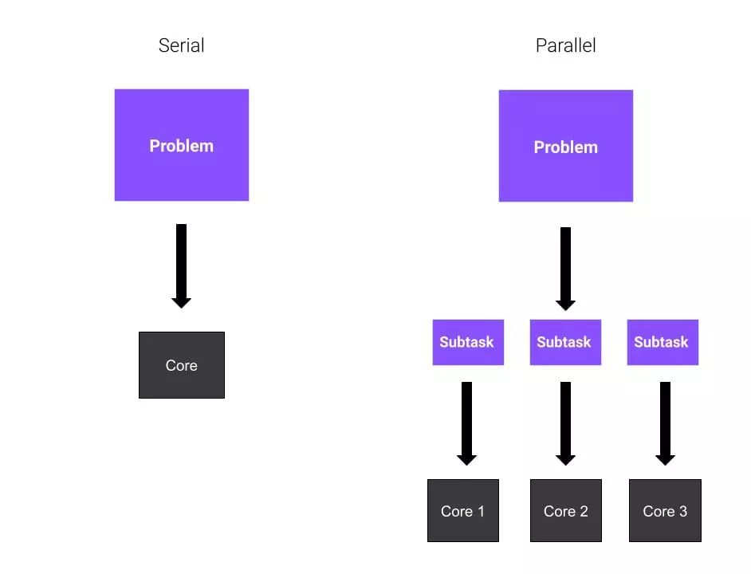
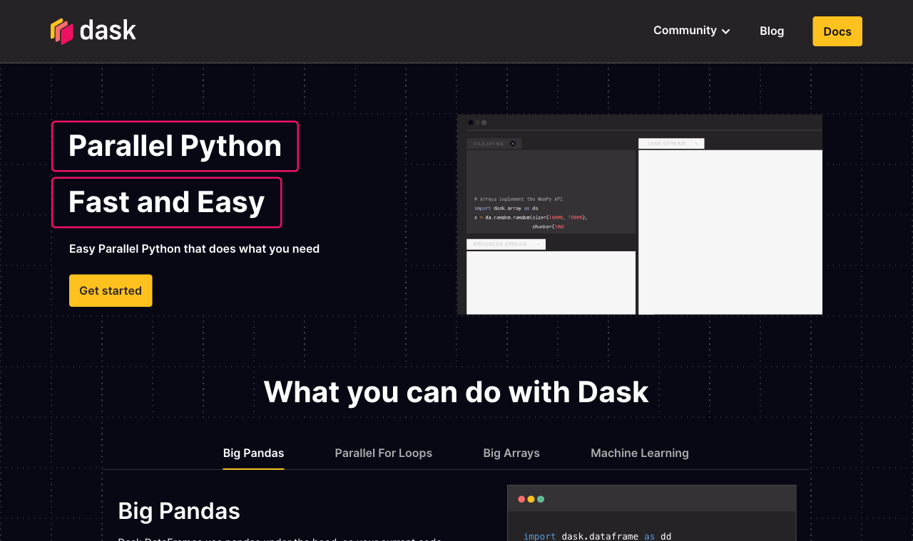
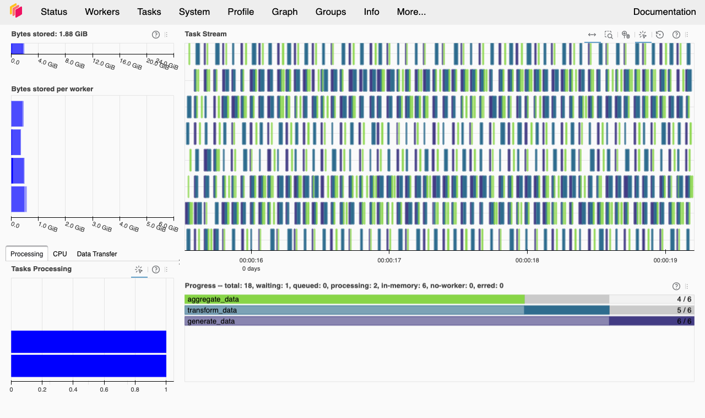

# Hello again, my friends! 😊 <br> {background-color="#1B3A6B"}

# Brief recap 📚 {background-color="#1B3A6B"}

## Module 06: getting data from the web
### What we did in lectures 18 and 19

:::{style="margin-top: 30px; font-size: 24px;"}
:::{.columns}
:::{.column width="50%"}
- A web API is a [contract]{.alert} between your code and a server
- We sent HTTP requests and read the JSON that came back
- We handled [pagination]{.alert} and wrapped the whole download in `get_wdi()`
- Pages without an API need `requests` and `BeautifulSoup` instead
- We saved every result as a [parquet file]{.alert}, which keeps column types and compresses well
- Today we ask what happens when those files get [really big!]{.alert}
:::

:::{.column width="50%"}
- This module is called [Scaling and Performance]{.alert} because "parallelise" is only one of the answers
- Sometimes parallelism really is the right move
- Sometimes the fix is a [better algorithm]{.alert}
- Sometimes we need a [faster engine]{.alert} (next lecture)
- We will cover all three strategies across these two lectures

:::{style="background: rgba(27, 58, 107, 0.08); padding: 15px; border-radius: 10px; font-size: 19px; margin-top: 20px;"}
[Worth noticing]{.alert}: the parquet files we wrote in Module 06 are exactly the format Dask reads 
:::
:::
:::
:::

# Today's agenda {background-color="#1B3A6B"}

## Lecture outline
### What we will cover today

:::{style="margin-top: 30px; font-size: 22px;"}
:::{.columns}
:::{.column width="50%"}
- [Serial vs parallel execution]{.alert}
  - `map` function and embarrassingly parallel problems
- [Big O notation]{.alert} and what parallelism can (and cannot) fix
- [Amdahl's law]{.alert}: the speed-up ceiling
- [The GIL]{.alert}: why threads do not always help in Python
- [`joblib`]{.alert} and [`concurrent.futures`]{.alert} for single-node parallelism
- [`Dask`]{.alert} for scalable computing
  - Lazy evaluation: arrays and DataFrames
  - Reading and writing CSV and Parquet files
  - `dask.delayed` for custom pipelines
- [Best practices]{.alert}: when to parallelise and when not to
:::

:::{.column width="50%"}
:::{style="text-align: center; margin-top: -30px;"}
[{width="80%"}](#){data-modal-type="image" data-modal-url="figures/cores.webp"}
[{width="55%"}](#){data-modal-type="image" data-modal-url="figures/dask.png"}
:::
:::
:::
:::

# Serial vs parallel algorithms  {background-color="#1B3A6B"}

## Serial execution
### One line finishes before the next one starts

:::{style="margin-top: 30px; font-size: 22pt;"}
- A typical Python program runs its lines one after another, in order:

```{python}
#| echo: true
#| eval: true
#| cache: true 
# Import packages
import numpy as np

# Define an array of numbers
foo = np.array([0, 1, 2, 3, 4, 5])

# Define a function that squares numbers
def bar(x):
    return x * x

# Loop over each element and perform an action on it
for element in foo:
    # Print the result of bar
    print(bar(element))
```
:::

## The `map` function
### Apply one function to every element of a list

:::{style="margin-top: 30px; font-size: 22px;"}
:::{.columns}
:::{.column width="50%"}
- We will use a tool called `map` later in this lecture
- It applies one function to each element of a list or array
- Here is a version I wrote by hand so you can see the loop inside it:

:::{style="font-size: 1.2em;"}
```{python}
#| echo: true
#| eval: true
#| cache: true 
# (Very) inefficient function
def my_map(function, array):
    # create a container for the results
    output = []

    # loop over each element
    for element in array:
        
        # add the intermediate result
        output.append(function(element))
    
    # return the now-filled container
    return output
```
:::
:::

:::{.column width="50%"}
:::{style="font-size: 1.2em; margin-top: 20px;"}
```{python}
#| echo: true
#| eval: true
#| cache: true
my_map(bar, foo)
``` 
:::

- [Python already provides a `map` function in its standard library](https://www.w3schools.com/python/ref_func_map.asp), so you never have to write mine:

:::{style="font-size: 1.2em;"}
```{python}
#| echo: true
#| eval: true
#| cache: true
list(map(bar, foo))
```
:::

- The built-in version returns the same answer and runs much faster than mine (it is implemented in C), so use it instead

::: 
:::
:::

## Using `joblib` for parallel computing
### Two functions turn a loop into parallel work

:::{style="margin-top: 30px; font-size: 21px;"}
:::{.columns}
:::{.column width="50%"}
- Each step of our `map` call is [independent]{.alert}, so nothing stops us running the steps at the same time
- [`joblib`](https://joblib.readthedocs.io/) gives us two functions for that
- `Parallel(n_jobs=k)` runs `k` tasks at the same time
- `delayed(f)` wraps `f` so that joblib can schedule the call instead of running it immediately
- You combine them with a generator expression, as shown on the right
- `n_jobs=-1` asks joblib to use [all available CPU cores]{.alert}
- joblib handles process creation, data transfer and result collection for you
- More details in the [joblib documentation](https://joblib.readthedocs.io/en/stable/index.html)
:::

:::{.column width="50%"}
- Using our `bar` function and `foo` array from before:

:::{style="font-size: 1.2em;"}
```{python}
#| echo: true
#| eval: true
#| cache: true
# Install joblib if you haven't done so yet
# !pip install joblib

# Import joblib functions 
from joblib import Parallel, delayed

results = Parallel(n_jobs=6)(
    delayed(bar)(x) for x in foo
)
results
```
:::

- `joblib` starts six workers and gives each one a different element of `foo`
- The results match the serial version exactly, because the work itself has not changed
:::
:::
:::

## Serial vs parallel execution
### Four heavy calls, timed for real

:::{style="margin-top: 30px; font-size: 22px;"}
:::{.columns}
:::{.column width="50%"}
- `calculation` runs ten heavy operations on ten million random numbers
- Each call is fully independent of the others, which makes this problem [embarrassingly parallel](https://en.wikipedia.org/wiki/Embarrassingly_parallel)
- We time three things with `%timeit`: one call as a baseline, four calls in serial, and four calls in parallel

- [One call:]{.alert}

:::{style="font-size: 1.2em;"}
```{python}
#| echo: true
#| eval: true
#| cache: true
def calculation(size=10000000):
    # Create a large array and perform operations
    arr = np.random.rand(size)
    for _ in range(10):
        arr = np.sqrt(arr) + np.sin(arr)
    return np.mean(arr)

# Single run
%timeit calculation()
```
:::
:::

:::{.column width="50%"}
- [Four calls, serial:]{.alert}

:::{style="font-size: 1.2em;"}
```{python}
#| echo: true
#| eval: true
#| cache: true
# Sequential runs (4 times)
%timeit [calculation() for _ in range(4)]
```
:::

- [Four calls, parallel:]{.alert}

:::{style="font-size: 1.2em;"}
```{python}
#| echo: true
#| eval: true
#| cache: true
%%timeit
# Parallel runs (4 times)
Parallel(n_jobs=4)(
    delayed(calculation)() for _ in range(4)
)
```
:::

- On my machine the parallel version does not reach a full 4× speed-up, [because starting the workers and moving the results back costs time.]{.alert} The saving is still real
:::
:::
:::

# concurrent.futures {background-color="#1B3A6B"}

## `concurrent.futures`: the standard-library option
### The same pattern ships with Python itself

:::{style="margin-top: 30px; font-size: 21px;"}
:::{.columns}
:::{.column width="50%"}
- [`concurrent.futures` comes with Python](https://docs.python.org/3/library/concurrent.futures.html)
- A slow task is slow for one of two reasons: [the processor is busy, or the processor is idle while your code waits for an answer]{.alert}
- [CPU-bound]{.alert}: the processor is busy with a task. Only more processors help, so use [`ProcessPoolExecutor`](https://docs.python.org/3/library/concurrent.futures.html#concurrent.futures.ProcessPoolExecutor), which works like `joblib`
- [I/O-bound]{.alert}: the processor is idle, waiting for a web server, a disk, or a database to answer. Use [`ThreadPoolExecutor`](https://docs.python.org/3/library/concurrent.futures.html#concurrent.futures.ThreadPoolExecutor)
- Both copy the `map` interface: a function and an iterable

:::{style="font-size: 1.1em;"}
```{python}
#| echo: true
#| eval: false
from concurrent.futures import ProcessPoolExecutor

with ProcessPoolExecutor(max_workers=4) as executor:
    results = list(executor.map(bar, foo))

results
# [0, 1, 4, 9, 16, 25]
```
:::
:::

:::{.column width="50%"}
- Waiting needs no second processor, so cheap threads do the job and no processes are spawned:

:::{style="font-size: 1.1em;"}
```{python}
#| echo: true
#| eval: false
from concurrent.futures import ThreadPoolExecutor
import requests

urls = [
    "https://api.worldbank.org/v2/country/BRA/indicator/SP.POP.TOTL?format=json",
    "https://api.worldbank.org/v2/country/IND/indicator/SP.POP.TOTL?format=json",
    "https://api.worldbank.org/v2/country/USA/indicator/SP.POP.TOTL?format=json",
]

def fetch(url):
    return requests.get(url).json()

with ThreadPoolExecutor(max_workers=3) as executor:
    results = list(executor.map(fetch, urls))
```
:::

- In lecture 19 you downloaded World Bank indicators one country at a time
- This is the same `get_wdi()` pattern, with all three requests now running at the same time
:::
:::
:::

## When to use which?
### sklearn and joblib

:::{style="margin-top: 30px; font-size: 23px;"}
:::{.columns}
:::{.column width="50%"}
- [joblib]{.alert} suits numeric loops and [scikit-learn.](https://scikit-learn.org/stable/) `sklearn` calls joblib internally whenever you set `n_jobs=-1`:

:::{style="font-size: 1.1em;"}
```{python}
#| echo: true
#| eval: true
#| cache: true
from sklearn.datasets import load_digits
from sklearn.model_selection import GridSearchCV
from sklearn.svm import SVC
import time

digits = load_digits()
param_grid = {"C": [0.1, 1, 10], "gamma": [0.001, 0.01]}

start = time.time()
search = GridSearchCV(SVC(), param_grid, cv=3, n_jobs=-1)
search.fit(digits.data, digits.target)
elapsed = time.time() - start

print(f"Best score: {search.best_score_:.3f}")
print(f"Time: {elapsed:.2f}s (all cores)")
```
:::
:::

:::{.column width="50%"}
- [`concurrent.futures`]{.alert} suits I/O parallelism, and anywhere you cannot install extra packages

:::{style="margin-top: 30px; margin-bottom: 30px;"}
| Scenario | Tool |
|----------|------|
| sklearn / numeric loops | `joblib` (`n_jobs=-1`) |
| Download many files | `ThreadPoolExecutor` |
| CPU-heavy, no dependencies | `ProcessPoolExecutor` |
| Bigger than RAM, clusters | `Dask` (next section) |
:::

:::{style="background: rgba(27, 58, 107, 0.08); padding: 15px; border-radius: 10px; font-size: 19px; margin-top: 20px;"}
[Every tool does the same thing]{.alert}: split the work, run it on separate workers, then collect the results
:::
:::
:::
:::

# Big O notation {background-color="#1B3A6B"}

## Big O notation
### Runtime growth decides whether parallelism helps

:::{style="margin-top: 30px; font-size: 24px;"}
:::{.columns}
:::{.column width="50%"}
- [Big O notation]{.alert} describes how the runtime grows as the input grows
- [O(1)]{.alert} means constant: reading one array element costs the same whatever the array size
- [O(n)]{.alert} means linear: a single loop takes twice as long when the input doubles
- [O(n²)]{.alert} means quadratic: a nested loop takes four times as long when the input doubles
- Our `calculation` function called on `n` inputs is [O(n)]{.alert}
- Two calls take about twice as long as one, and a hundred calls take about a hundred times as long
:::

:::{.column width="50%"}
:::{style="text-align: center;"}
```{python}
#| echo: true
#| code-fold: true
#| eval: true
#| cache: true
import matplotlib.pyplot as plt
import numpy as np

# Simulate processing times
num_images = np.array([1, 10, 50, 100, 200])
sequential_time = num_images * 2  # 2 seconds per image
parallel_time = (num_images * 2) / 4  # 4 cores, ideal speedup

plt.figure(figsize=(8, 5))
plt.plot(num_images, sequential_time, 'o-', label='Serial O(n)', linewidth=2, markersize=8)
plt.plot(num_images, parallel_time, 's-', label='Parallel O(n/4)', linewidth=2, markersize=8)
plt.xlabel('Number of Images', fontsize=12)
plt.ylabel('Time (seconds)', fontsize=12)
plt.title('O(n) Scaling: Serial vs Parallel', fontsize=14, fontweight='bold')
plt.legend(fontsize=11)
plt.grid(True, alpha=0.3)
plt.show()
```

:::
:::
:::
:::

## What parallelism does to complexity

:::{style="margin-top: 30px; font-size: 22px;"}
:::{.columns}
:::{.column width="50%"}
- With `p` cores, an O(n) problem becomes [O(n/p + overhead)]{.alert}
- Four cores give you close to a 4× saving, minus whatever the coordination costs
- The best candidates are [embarrassingly parallel O(n) tasks]{.alert}
- Running `n` independent calculations qualifies
- Applying the same function to `n` separate inputs qualifies too
- What both have in common is no shared state and no dependency between tasks

:::{style="background: rgba(230, 57, 70, 0.1); padding: 15px; border-radius: 10px; font-size: 19px; margin-top: 20px;"}
Parallelism never changes the Big O class. It divides the constant in front of it. An O(n²) algorithm running on eight cores is still an O(n²) algorithm; you only reach "too slow" a little later
:::
:::

:::{.column width="50%"}
- [A poor candidate for parallelism:]{.alert}

:::{style="font-size: 1.2em;"}
```{python}
#| echo: true
#| eval: true
#| cache: true
# O(n^2): every pair of elements
def pairwise_sum(data):
    n = len(data)
    results = []
    for i in range(n):
        for j in range(n):
            results.append(data[i] + data[j])
    return results

data = list(range(1_000))
print(f"{len(pairwise_sum(data)):,} operations")
```
:::

- A thousand elements already means a million operations
- At `n = 100_000` the same code is 10 billion operations, and no core count rescues that
- Other poor candidates are steps that depend on previous results, algorithms with shared state, and problems limited by memory rather than by the CPU
:::
:::
:::

## Try it yourself! 🧠 {#sec:exercise01}

:::{style="margin-top: 30px; font-size: 22px;"}
1. Install the packages with `pip install joblib numpy` if you have not done so already
2. Run the serial version below and write down the time it prints

:::{style="font-size: 1.2em;"}
```{python}
#| echo: true
#| eval: false
def square(x):
    return x**2

# Create a large array to process
numbers = np.arange(1000000)

# Sequential version
%timeit [square(x) for x in numbers]
```
:::

3. Now run the parallel version and write down its time as well. Be patient: this one takes a while

:::{style="font-size: 1.2em;"}
```{python}
#| echo: true
#| eval: false
from joblib import Parallel, delayed

# Parallel version
%timeit Parallel(n_jobs=4)(delayed(square)(x) for x in numbers)
```
:::

4. Compare the two times and decide which version you would ship

[[Appendix 01]{.button}](#sec:appendix01)
:::

# Amdahl's law {background-color="#1B3A6B"}

## Amdahl's law: the speed-up ceiling
### The serial share caps the speed-up

:::{style="margin-top: 30px; font-size: 23px;"}
:::{.columns}
:::{.column width="50%"}
- Every program has a [serial share]{.alert}: the setup, the merging of results, and any step that must wait for the one before it
- [Amdahl's law](https://en.wikipedia.org/wiki/Amdahl%27s_law) says that share caps your maximum speed-up, however many cores you add
- The formula is $\text{speedup} = \dfrac{1}{s + \dfrac{p}{N}}$, where $s$ is the serial fraction, $p = 1 - s$ is the parallel fraction, and $N$ is the number of cores
- Take a program that is 90% parallel, so $s = 0.1$, running on 8 cores
- The arithmetic gives $\frac{1}{0.1 + 0.9/8} = \frac{1}{0.2125} \approx 4.7\times$, well short of the $8\times$ you might have hoped for
:::

:::{.column width="50%"}
:::{style="text-align: center;"}
```{python}
#| echo: true
#| code-fold: true
#| eval: true
#| cache: true
import matplotlib.pyplot as plt
import numpy as np

cores = np.arange(1, 65)
serial_fracs = [0.05, 0.2, 0.5]
labels = ["5% serial", "20% serial", "50% serial"]
colours = ["#1B3A6B", "#E07A24", "#2CA02C"]

plt.figure(figsize=(8, 5))
for s, lab, c in zip(serial_fracs, labels, colours):
    speedup = 1 / (s + (1 - s) / cores)
    plt.plot(cores, speedup, label=lab, linewidth=2, color=c)

plt.xlabel("Number of cores", fontsize=12)
plt.ylabel("Speed-up (×)", fontsize=12)
plt.title("Amdahl's law: speed-up vs core count",
          fontsize=14, fontweight="bold")
plt.legend(fontsize=11)
plt.grid(True, alpha=0.3)
plt.tight_layout()
plt.show()
```
:::
:::
:::
:::

# Global Interpreter Lock (GIL) {background-color="#1B3A6B"}

## The GIL
### Why threads do not always help in Python

:::{style="margin-top: 30px; font-size: 22px;"}
:::{.columns}
:::{.column width="50%"}
- CPython, the Python you are running, has a [Global Interpreter Lock (GIL)](https://en.wikipedia.org/wiki/Global_Interpreter_Lock)
- The GIL lets only [one thread]{.alert} execute Python code at a time, however many cores you have
- Threads still help while your code [waits]{.alert}, because the lock is released during downloads and API calls
- They do nothing while your code [computes]{.alert}, because the lock keeps the other threads idle
- CPU-bound work needs [processes]{.alert}: each process is a separate Python with its own GIL
- [NumPy](https://numpy.org/), [Polars](https://polars.dev/) and [DuckDB](https://duckdb.org/) [release the GIL]{.alert} while their C and Rust code runs, so they use all cores with no processes to manage
- A [free-threaded build]{.alert} without the GIL is official since Python 3.14 ([PEP 779](https://peps.python.org/pep-0779/)), but it is not the default
:::

:::{.column width="50%"}
- How the GIL maps onto the tools you already know:

:::{style="font-size: 19px;"}
| Task | Use | Why |
|------|-----|-----|
| Number crunching | [Processes]{.alert} (`joblib`, `ProcessPoolExecutor`) | Sidesteps the GIL |
| Downloading many URLs | [Threads]{.alert} (`ThreadPoolExecutor`) | GIL released while waiting |
| NumPy / Polars / DuckDB | [Either or neither]{.alert} | Heavy work runs in C/Rust, outside the GIL |
| `sklearn` with `n_jobs=-1` | Processes (via `joblib`) | Each fold trains independently |
:::
:::
:::
:::

# Dask {background-color="#1B3A6B"}

## Dask
### Familiar pandas code on data bigger than your RAM

:::{style="margin-top: 20px; font-size: 22px;"}
:::{.columns}
:::{.column width="52%"}
- [Dask](https://dask.org/) is a parallel computing library for Python
- It scales the previous sections to [datasets bigger than RAM](https://docs.dask.org/en/stable/best-practices.html){.alert} and to [clusters](https://docs.dask.org/en/stable/deploying.html) bigger than one machine
- You write ordinary [NumPy](https://numpy.org/) and [pandas](https://pandas.pydata.org/) code; Dask handles the parallelism
- Its [task scheduler](https://docs.dask.org/en/stable/scheduling.html){.alert} splits your work into a graph of small tasks and spreads them across your cores
- Its big data collections are [arrays](https://docs.dask.org/en/stable/array.html){.alert}, [DataFrames](https://docs.dask.org/en/stable/dataframe.html){.alert} and [lists](https://docs.dask.org/en/stable/bag.html){.alert} that behave like the ones you know
- Active development, with a release most months: [version 2026.8.0](https://github.com/dask/dask/releases/tag/2026.8.0) was released in August 2026
- Next lecture: when do you actually need Dask, and when does a faster single-machine engine win?
:::

:::{.column width="48%"}
:::{style="text-align: center; margin-top: -10px;"}
[{width="88%"}](#){data-modal-type="image" data-modal-url="figures/dask-homepage-2026.png"}

:::{style="font-size: 17px;"}
<https://www.dask.org/>
:::
:::{style="background: rgba(27, 58, 107, 0.08); padding: 15px; border-radius: 10px; font-size: 19px; margin-top: 15px; text-align: left;"}
`joblib` parallelises your functions and leaves the data where it was. [Dask chunks the data itself,]{.alert} so a Dask array or DataFrame can be larger than your RAM
:::
:::
:::
:::
:::

## Dask arrays
### NumPy arrays split into chunks that run in parallel

:::{style="margin-top: 30px; font-size: 22px;"}
:::{.columns}
:::{.column width="50%"}
- Let's import Dask and see how it works

:::{style="font-size: 1.3em; margin-top: 30px; margin-bottom: 30px"}
```{python}
#| echo: true
#| eval: true
#| cache: true
import dask.dataframe as dd
import dask.array as da
```
:::

- A [Dask array](https://docs.dask.org/en/stable/array.html) is a parallel version of a [NumPy array](https://numpy.org/doc/stable/reference/generated/numpy.ndarray.html)
- It splits one large array into [chunks]{.alert}, and every chunk is an ordinary NumPy array
- Dask processes those chunks in parallel across your CPU cores
- You choose the chunk size when you create the array, and here each block is 100 by 100
- The API matches NumPy, so `a.sum()`, `a.mean()` and slicing all work as you expect
:::

:::{.column width="50%"}
- Let's build a Dask array from a large NumPy array
- The Dask array `a` is a lazy wrapper around the original data, split into 100 by 100 chunks

:::{style="font-size: 1.2em;"}
```{python}
#| echo: true
#| eval: true
#| cache: true
data = np.random.normal(size=100000).reshape(200, 500)
a = da.from_array(data, chunks=(100, 100))
a
```
:::
:::
:::
:::

## Dask arrays
### Nothing runs until you call `.compute()`

:::{style="margin-top: 30px; font-size: 21px;"}
- Dask arrays are [lazy](https://en.wikipedia.org/wiki/Lazy_evaluation), so nothing is computed until you call `.compute()`
- That lets you build a full computation graph, an execution plan, before any work starts
- Dask can then [optimise the graph and cut memory use]{.alert} before it executes anything
- Let's slice the Dask array `a` to get the first 10 rows of the sixth column

:::{style="font-size: 1.2em;"}
```{python}
#| echo: true
#| eval: true
#| cache: true
a[:10, 5] # first 10 rows of the 6th column
```
:::

- The `.compute()` method is what finally asks Dask for the numbers

:::{style="font-size: 1.2em;"}
```{python}
#| echo: true
#| eval: true
#| cache: true
a[:10, 5].compute()
```
:::
:::

## Dask arrays

:::{style="margin-top: 20px; font-size: 20px;"}
- Dask arrays support most of the NumPy operations you already use
- Arithmetic works elementwise, so `+`, `*`, `exp` and `log` behave normally
- Reductions along an axis work too, including `sum()`, `mean()` and `std()`

:::{style="font-size: 1.2em;"}
```{python}
#| echo: true
#| eval: true
#| cache: true
a.sum().compute()
```
:::

- Let's time the same operation in NumPy on 100 million numbers

:::{style="font-size: 1.2em;"}
```{python}
#| echo: true
#| eval: true
#| cache: true
size = 100000000
np_arr = np.random.random(size)
%timeit np_result = np.sqrt(np_arr) + np.sin(np_arr)
```
:::

- And now the same operation in Dask, with the chunk size left to Dask

:::{style="font-size: 1.2em;"}
```{python}
#| echo: true
#| eval: true
#| cache: true
da_arr = da.random.random(size, chunks='auto')
%timeit (da.sqrt(da_arr) + da.sin(da_arr)).compute()
```
:::

:::{style="background: rgba(230, 57, 70, 0.1); padding: 15px; border-radius: 10px; font-size: 19px; margin-top: 15px;"}
[Not a rule]{.alert}: Dask wins here because `sqrt` and `sin` split cacross chunks. On data that fits in memory, building the graph and moving chunks often makes Dask [slower]{.alert}. Run `%timeit` to see the difference
:::
:::

## Dask dataframes
### Many pandas DataFrames behind one lazy interface

:::{style="margin-top: 30px; font-size: 22px;"}
:::{.columns}
:::{.column width="50%"}
- Dask also gives you a parallel version of the [pandas DataFrame](https://pandas.pydata.org/docs/reference/api/pandas.DataFrame.html)
- One [Dask DataFrame](https://docs.dask.org/en/stable/dataframe.html) is many pandas DataFrames, [split along the index](https://docs.dask.org/en/stable/dataframe-design.html)
- Let's look at an example

:::{style="font-size: 28px; margin-top: 20px; margin-bottom: 20px;"}
```{python}
#| echo: true
#| eval: true
#| cache: true
import dask
df = dask.datasets.timeseries()
```
:::

- This is a small synthetic dataset of about 240 MB
- Dask DataFrames are [lazy](https://docs.dask.org/en/stable/graphs.html){.alert} in the same way Dask arrays are
- Nothing is printed but ellipses, because no rows have been read yet
:::

:::{.column width="50%"}

:::{style="font-size: 22px;"}
```{python}
#| echo: true
#| eval: true
#| cache: true
df
```
:::

- The column names and [dtypes](https://pandas.pydata.org/docs/reference/api/pandas.DataFrame.dtypes.html) are known even so

:::{style="font-size: 28px;"}
```{python}
#| echo: true
#| eval: true
#| cache: true
df.dtypes
```
:::
:::
:::
:::

## Dask dataframes
### Filtering and grouping look exactly like pandas

:::{style="margin-top: 30px; font-size: 20px;"}
:::{.columns}
:::{.column width="50%"}
- Dask DataFrames support a large subset of the pandas API
- A few operations, such as `head()`, display data without being asked

:::{style="font-size: 1.2em;"}
```{python}
#| echo: true
#| eval: true
#| cache: true
import pandas as pd

pd.options.display.precision = 2
pd.options.display.max_rows = 10

df.head()
```
:::
:::

:::{.column width="50%"}
- Here we keep the rows where `y > 0` and take the standard deviation of `x` within each group

:::{style="font-size: 1.2em;"}
```{python}
#| echo: true
#| eval: true
#| cache: true
df2 = df[df.y > 0]
df3 = df2.groupby("name").x.std()
df3
```
:::

- Notice that `df3` still shows no numbers
- Calling `.compute()` runs the plan and hands back a pandas Series

:::{style="font-size: 1.2em;"}
```{python}
#| echo: true
#| eval: true
#| cache: true
df3.compute()
```
:::
:::
:::
:::

## Dask dataframes
### `.persist()` keeps a computed result in memory

:::{style="margin-top: 30px; font-size: 20px;"}
:::{.columns}
:::{.column width="50%"}
- Aggregations work the same way
- Here we take the sum of `x` and the maximum of `y` within each `name`

:::{style="font-size: 1.2em;"}
```{python}
#| echo: true
#| eval: true
#| cache: true
df4 = df.groupby("name").aggregate({"x": "sum", "y": "max"})
df4.compute()
```
:::
:::

:::{.column width="50%"}
- If the result fits in RAM, `.persist()` computes it once and holds it in memory
- Later computations on persisted data skip the loading and the recomputation
- Persist a small aggregate, never the raw 240 MB frame you have not filtered yet

:::{style="font-size: 1.2em;"}
```{python}
#| echo: true
#| eval: true
#| cache: true
df5 = df4.persist()
df5.head()
```
:::
:::
:::
:::

## Combining Dask and Pandas
### The workflow ends with a small pandas DataFrame

:::{style="margin-top: 20px; font-size: 21px;"}
:::{.columns}
:::{.column width="50%"}
- Dask and pandas are designed to hand work to each other
- Dask does the heavy lifting over data that will not fit in memory
- `.compute()` then returns an ordinary pandas DataFrame for the last few steps
- Most Dask code reads almost identically to pandas code, so moving between them costs you very little

:::{style="background: rgba(27, 58, 107, 0.08); padding: 15px; border-radius: 10px; font-size: 19px; margin-top: 15px;"}
Load and filter in Dask, aggregate down to something small, call `.compute()`, then finish in pandas
:::
:::

:::{.column width="50%"}
:::{style="font-size: 1.2em;"}
```{python}
#| echo: true
#| eval: true
import dask
import dask.dataframe as dd

df = dask.datasets.timeseries()

# Step 1-2: filter and aggregate with Dask
summary = (
    df[df.x > 0]
    .groupby("name")
    .agg({"x": "mean", "y": "std"})
)

# Step 3: bring to Pandas
pdf = summary.compute()

# Step 4: use Pandas normally
pdf.sort_values("x", ascending=False).head(5)
```
:::
:::
:::
:::

## Try it yourself! 🧠 {#sec:exercise02}

:::{style="margin-top: 20px; font-size: 22px;"}
:::{.columns}
:::{.column width="55%"}
1. Install Dask with `pip install dask` if you have not already
2. Import `numpy` and `dask.array`
3. Set `size = 10_000_000`. Use a smaller number if your laptop is short on memory
4. Build a Dask array of that many random numbers with `chunks=100_000`
5. Time `da.sqrt(x**2).mean().compute()` with `%timeit`
6. Repeat steps 4 and 5 with `chunks=2_000_000`
7. Repeat them once more with `chunks=5_000_000`
8. Write down the three timings before you look at the appendix
:::

:::{.column width="45%"}
:::{style="font-size: 22px; margin-top: 20px; margin-bottom: 20px;"}
```python
import numpy as np
import dask.array as da

size = 10_000_000

# Dask with SMALL chunks
da_data_small = da.random.random(size, chunks=100_000)  # 100 chunks
%timeit da.sqrt(da_data_small**2).mean().compute()

# Dask with MEDIUM chunks
da_data_medium = da.random.random(size, chunks=2_000_000)  # 5 chunks
%timeit da.sqrt(da_data_medium**2).mean().compute()

# Dask with LARGE chunks
da_data_large = da.random.random(size, chunks=5_000_000)  # 2 chunks
%timeit da.sqrt(da_data_large**2).mean().compute()
```
:::

- [[Appendix 02]{.button}](#sec:appendix02)
:::
:::
:::

# Read and write data with Dask {background-color="#1B3A6B"}

## Reading and writing data
### Thirty daily CSV files from one line of Dask

:::{style="margin-top: 30px; font-size: 22px;"}
:::{.columns}
:::{.column width="50%"}
- CSV is still the most common format in data science, and for good reasons
- Pandas reads CSV well, but it loads the [entire file into memory]{.alert} first
- On a large file that can mean several gigabytes of RAM for a question about one column
- Dask offers a [more careful way](https://docs.dask.org/en/latest/dataframe-create.html) to read and write CSV
- The `name_function` argument below turns one DataFrame into one file per day
- Writing `data/*.csv` gives us 30 files for January 2000
:::

:::{.column width="50%"}
:::{style="font-size: 20px; margin-top: 20px; margin-bottom: 20px;"}
```{python}
#| echo: true
#| eval: true
#| cache: true
df = dask.datasets.timeseries()
df
```
:::

:::{style="font-size: 24px;"}
```{python}
#| echo: true
#| eval: true
import os
import datetime

if not os.path.exists('data'):
    os.mkdir('data')

def name(i):
    return str(datetime.date(2000, 1, 1)
               + i * datetime.timedelta(days=1))

df.to_csv('data/*.csv', name_function=name);
```
:::
:::
:::
:::

## Reading and writing data
### One glob pattern reads a whole month

:::{style="margin-top: 30px; font-size: 22px;"}
:::{.columns}
:::{.column width="50%"}
- The `data` directory now holds 30 CSV files, one per day in January 2000, and 182 MB in total
- `dd.read_csv` takes a glob pattern and treats the whole set as one DataFrame
- Dask reads the files in parallel and loads only the parts a computation needs
- Pandas would need all 182 MB in memory before it could answer anything

:::{style="font-size: 1.2em;"}
```{python}
#| echo: true
#| eval: true
#| cache: true
df = dd.read_csv('data/2000-*-*.csv')
df
```
:::
:::

:::{.column width="50%"}
- Here is a group-by across all 30 files, timed for real

:::{style="font-size: 1.2em;"}
```{python}
#| echo: true
#| eval: true
#| cache: true
%timeit df.groupby('name').x.mean().compute()
```
:::
:::
:::
:::

## Reading and writing data
### The same query runs faster on a columnar file

:::{style="margin-top: 30px; font-size: 22px;"}
:::{.columns}
:::{.column width="50%"}
- CSV works, but newer formats such as [Parquet](https://parquet.apache.org/) have taken over for analytical work
- Parquet stores data [by column rather than by row]{.alert}, so a query can read one column and ignore the rest
- It also compresses: the month of CSVs we just wrote is 182 MB, and the same data as parquet is 86 MB
- That is 53% smaller, on this dataset, with no loss of information

:::{style="font-size: 1.2em;"}
```{python}
#| echo: true
#| eval: true
#| cache: true
df.to_parquet('data/2000-01.parquet')
```
:::
:::

:::{.column width="50%"}
- Reading it back, we can name the columns we want

:::{style="font-size: 1.2em;"}
```{python}
#| echo: true
#| eval: true
#| cache: true
df = dd.read_parquet('data/2000-01.parquet',
                     columns=['name', 'x'])
df
```
:::

- Now the same group-by, on parquet instead of CSV

:::{style="font-size: 1.2em;"}
```{python}
#| echo: true
#| eval: true
#| cache: true
%timeit df.groupby('name').x.mean().compute()
```
:::
:::
:::
:::

## Why Parquet?
### Column storage reads only what you ask for

:::{style="margin-top: 30px; font-size: 22px;"}
:::{.columns}
:::{.column width="50%"}
- CSV is [row-based]{.alert}, so reading one column still means scanning every row
- Parquet is [column-based]{.alert}, so it reads the columns you named and skips the others

| Feature | CSV | Parquet |
|---------|-----|---------|
| Storage | Row-based | Column-based |
| Compression | None | Snappy/gzip |
| Column selection | Reads all | Reads only needed |
| Data types | Text only | Typed (int, float, date) |
| Our January 2000 data | 182 MB | 86 MB |
:::

:::{.column width="50%"}
:::{style="font-size: 1.2em;"}
```python
import pandas as pd

# CSV: reads everything, infers types
df = pd.read_csv("sales.csv")

# Parquet: reads only what you need
df = pd.read_parquet("sales.parquet",
                     columns=["date", "revenue"])
```
:::

:::{style="background: rgba(230, 57, 70, 0.1); padding: 15px; border-radius: 10px; font-size: 19px; margin-top: 15px;"}
[CSV is not obsolete]{.alert}: reach for parquet when you have [many columns]{.alert} and query only a few, or when the file passes 100 MB. Stay with CSV for small files, one-off exports, and anything a collaborator will open in Excel
:::
:::
:::
:::

# Dask delayed {background-color="#1B3A6B"}

## Dask delayed
### A decorator schedules any function you already have

:::{style="margin-top: 30px; font-size: 21px;"}
:::{.columns}
:::{.column width="50%"}
- Sometimes you do not want a whole Dask DataFrame or Dask array
- You want to parallelise one function, or one small part of a script
- `dask.delayed` does exactly that, and it works on functions you have already written
- Here are four serial calls to a deliberately heavy function

:::{style="font-size: 1.2em;"}
```{python}
#| echo: true
#| eval: true
#| cache: true
def calculation(size=10000000):
    arr = np.random.rand(size)
    for _ in range(10):
        arr = np.sqrt(arr) + np.sin(arr)
    return np.mean(arr)

%timeit [calculation() for _ in range(4)]
```
:::
:::

:::{.column width="50%"}
- The only change is the `@dask.delayed` decorator above the function

:::{style="font-size: 1.2em;"}
```{python}
#| echo: true
#| eval: true
#| cache: true
@dask.delayed
def delayed_calculation(size=10000000):
    arr = np.random.rand(size)
    for _ in range(10):
        arr = np.sqrt(arr) + np.sin(arr)
    return np.mean(arr)

results = []
for _ in range(4):
    results.append(delayed_calculation())

# Compute all results at once
%timeit final_results = dask.compute(*results)
```
:::

- Nothing in the body of the function changed
- Calling `delayed_calculation()` builds a task instead of running one, so `dask.compute(*results)` is what triggers the work
:::
:::
:::

## Dask delayed
### Dask draws the plan before running a single task

:::{style="margin-top: 20px; font-size: 21px;"}
:::{.columns}
:::{.column width="55%"}
- Three delayed functions, chained over three input sizes, give us nine tasks in three independent branches

:::{style="font-size: 1.2em;"}
```{python}
#| echo: true
#| eval: true
#| cache: true
@dask.delayed
def generate_data(size):
    return np.random.rand(size)

@dask.delayed
def transform_data(data):
    return np.sqrt(data) + np.sin(data)

@dask.delayed
def aggregate_data(data):
    return {
        'mean': np.mean(data),
        'std': np.std(data),
        'max': np.max(data)
    }

# Compare execution
sizes = [1000000, 2000000, 3000000]

# Dask execution
dask_results = []
for size in sizes:
    data = generate_data(size)
    transformed = transform_data(data)
    stats = aggregate_data(transformed)
    dask_results.append(stats)

%timeit dask.compute(*dask_results)
```
:::
:::

:::{.column width="45%"}
<style>.taskgraph img { max-height: 290px; width: auto; }</style>

- `dask.visualize()` draws the graph without running any of it

:::{.taskgraph style="font-size: 1.2em; text-align: center;"}
```{python}
#| echo: true
#| eval: true
#| cache: true
# Needs graphviz twice over: the Python package
# and the binary itself
#   pip install graphviz
#   brew install graphviz   (macOS)
#   apt install graphviz    (Linux)
dask.visualize(*dask_results)
```
:::

:::{style="background: rgba(27, 58, 107, 0.08); padding: 15px; border-radius: 10px; font-size: 19px; margin-top: 10px;"}
Dask sees all nine tasks before it runs any of them. The three branches never touch each other, so they go to separate workers
:::
:::
:::
:::

## The Dask dashboard
### Watching the task stream at `localhost:8787`

:::{style="margin-top: 20px; font-size: 21px;"}
:::{.columns}
:::{.column width="52%"}
- Starting a `dask.distributed.Client()` opens a diagnostics dashboard on port 8787
- The task stream on the right is the same three-stage pipeline, run in a loop so the picture fills up
- Each row is one worker thread, and each coloured bar is one task it ran
- The three colours are `generate_data`, `transform_data` and `aggregate_data`
- Bars at the same horizontal position in different rows ran at the same moment
- The dashboard is the fastest way to find out whether your work is actually parallel

:::{style="background: rgba(27, 58, 107, 0.08); padding: 15px; border-radius: 10px; font-size: 19px; margin-top: 15px;"}
White space in a row means that worker had nothing to do. Large gaps usually mean your chunks are too big, so there are fewer tasks than workers
:::
:::

:::{.column width="48%"}
:::{style="text-align: center; margin-top: -10px;"}
[{width="100%"}](#){data-modal-type="image" data-modal-url="figures/dask-dashboard-task-stream-2026.png"}

:::{style="font-size: 17px;"}
The Dask dashboard at `localhost:8787` while this computation ran on my laptop
:::
:::
:::
:::
:::

# Best practices {background-color="#1B3A6B"}

## Best practices
### Cheaper fixes to try before you parallelise

:::{style="margin-top: 20px; font-size: 21px;"}
:::{.columns}
:::{.column width="50%"}
- [Measure first]{.alert}: `%timeit` and `cProfile` will tell you where the time goes, and Amdahl's law tells you what that share is worth
- [Ask two questions]{.alert}: are the tasks independent of each other, and is each one heavy enough to pay for starting a worker? If either answer is no, do not parallelise
- [Pick the right algorithm]{.alert}: an $O(n \log n)$ solution beats a parallelised $O(n^2)$ one on any interesting input
- [Pick the right engine]{.alert}: Polars or DuckDB may finish the job faster than a parallelised pandas, as we will see next lecture
- [Start small]{.alert}: NumPy or pandas may already have a fast function for what you wrote by hand
- [Sample first]{.alert}: ask whether the question really needs all of those terabytes
:::

:::{.column width="50%"}
- [Switch to parquet]{.alert}: the format change alone bought us a large speed-up a few slides ago
- [Call `.compute()` and `.persist()` sparingly]{.alert}: every call triggers execution, so batch the work into one
- [Experiment with chunk sizes]{.alert}: try a few by hand, or start from `chunks='auto'`
- The Dask team keeps a longer list at [Dask best practices](https://docs.dask.org/en/latest/best-practices.html)

:::{style="background: rgba(230, 57, 70, 0.1); padding: 15px; border-radius: 10px; font-size: 19px; margin-top: 15px;"}
[The mistake I see most often]{.alert}: students parallelise before they profile. Run `%timeit` first. If the hot spot turns out to be disk reads or an $O(n^2)$ loop, more cores will not save you, and you will have spent an afternoon finding that out
:::
:::
:::
:::

# Summary {background-color="#1B3A6B"}

## What we learned today

:::{style="margin-top: 30px; font-size: 22px;"}
:::{.columns}
:::{.column width="50%"}
- [Serial and parallel execution]{.alert}: `map`, embarrassingly parallel problems, and `joblib` for the easy cases
- [`concurrent.futures`]{.alert} ships with Python: `ProcessPoolExecutor` for CPU work, `ThreadPoolExecutor` for waiting
- [Big O notation]{.alert}: parallelism cuts the constant factor and leaves the complexity class alone
- [Amdahl's law]{.alert}: the serial share caps your speed-up, so measure it before you buy cores
- [The GIL]{.alert}: threads help while Python waits, processes help while Python computes, and NumPy sidesteps both
:::

:::{.column width="50%"}
- [Dask]{.alert} gives you lazy arrays and DataFrames for data bigger than RAM
- [`dask.delayed`]{.alert} parallelises functions you have already written, and `dask.visualize` shows the plan
- [Parquet]{.alert} cut our January 2000 data from 182 MB to 86 MB and made the group-by much faster
- Next lecture, [Scaling Data Analysis in Practice]{.alert}, puts Polars and DuckDB against pandas and Dask on the WDI panel. They use every core by default, with nothing to configure

:::{style="font-size: 18px;"}
| Engine | Language | Parallel? | Out-of-core? |
|--------|----------|-----------|-------------|
| pandas | Python/C | Single-threaded | No |
| Polars | Rust | All cores | Yes (streaming) |
| DuckDB | C++ | All cores | Yes |
| Dask | Python | All cores + clusters | Yes |
:::

- To try SQL on DataFrames before then, see [`tutorials/04-duckdb-sql-tutorial.qmd`](https://danilofreire.github.io/datasci350/04-duckdb-sql-tutorial.html)
:::
:::
:::

# Thank you! 😊 {background-color="#1B3A6B"}

## Appendix 01 {#sec:appendix01}
### Solution to the joblib exercise

:::{style="margin-top: 30px; font-size: 24px;"}
- Here is the solution to the exercise

```{python}
#| echo: true
#| eval: true
#| cache: true
def square(x):
    return x**2

# Create a large array to process
numbers = np.arange(1000000)

# Sequential version
%timeit [square(x) for x in numbers]
```

```{python}
#| echo: true
#| eval: true
#| cache: true
from joblib import Parallel, delayed

# Parallel version
%timeit Parallel(n_jobs=4)(delayed(square)(x) for x in numbers)
```

- [Expected result]{.alert}: the parallel version is [slower]{.alert} here. `square(x)` finishes so fast that joblib's process-spawning overhead swamps the work. Parallel computing pays off when each task is heavy

[[Back to exercise]{.button}](#sec:exercise01)
:::

## Appendix 02 {#sec:appendix02}
### Chunk sizes compared

:::{style="margin-top: 30px; font-size: 22px;"}
- Ten million random numbers, computing `mean(sqrt(x^2))` at four chunk sizes
- The middle setting wins on my laptop, and the timings below say by how much

```{python}
#| echo: true
#| eval: true
#| cache: true
size = 10_000_000

# Dask with SMALL chunks  # 100 chunks
da_data_small = da.random.random(size, chunks=100_000)
%timeit da.sqrt(da_data_small**2).mean().compute()
```

```{python}
#| echo: true
#| eval: true
#| cache: true
# Dask with MEDIUM chunks  # 5 chunks
da_data_medium = da.random.random(size, chunks=2_000_000)
%timeit da.sqrt(da_data_medium**2).mean().compute()
```

```{python}
#| echo: true
#| eval: true
#| cache: true
# Dask with LARGE chunks  # 2 chunks
da_data_large = da.random.random(size, chunks=5_000_000)
%timeit da.sqrt(da_data_large**2).mean().compute()
```

```{python}
#| echo: true
#| eval: true
#| cache: true
# Dask with AUTO chunks  # Dask picks
da_data_auto = da.random.random(size, chunks='auto')
%timeit da.sqrt(da_data_auto**2).mean().compute()
```

[[Back to exercise]{.button}](#sec:exercise02)
:::