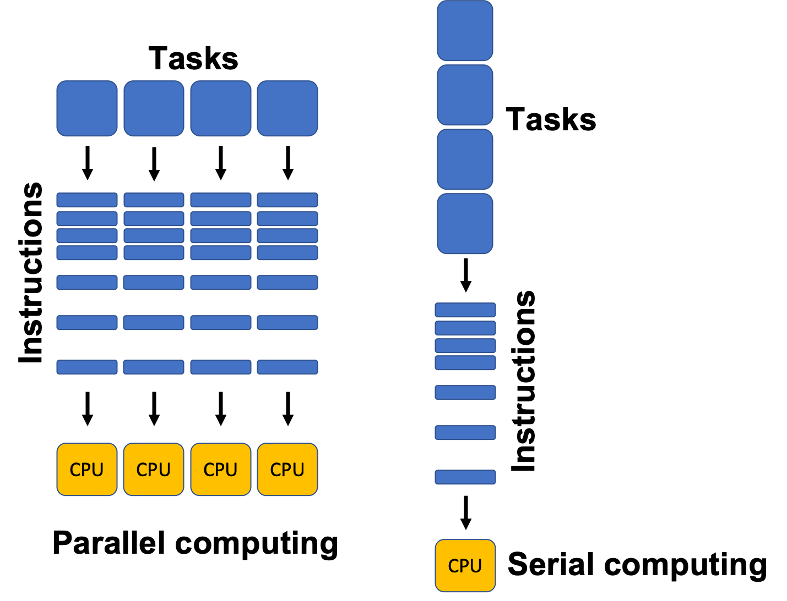
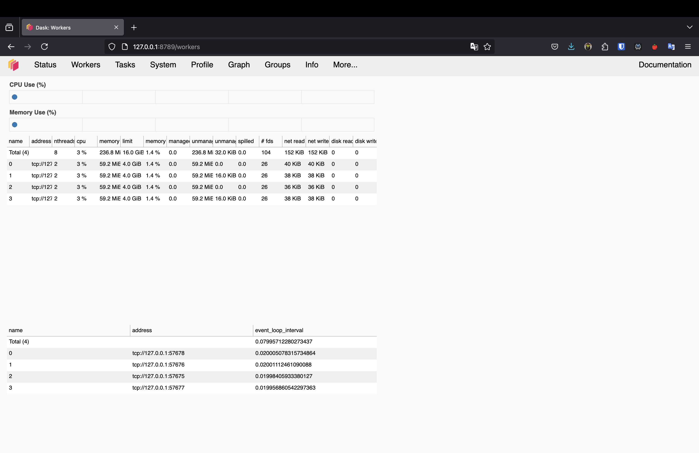
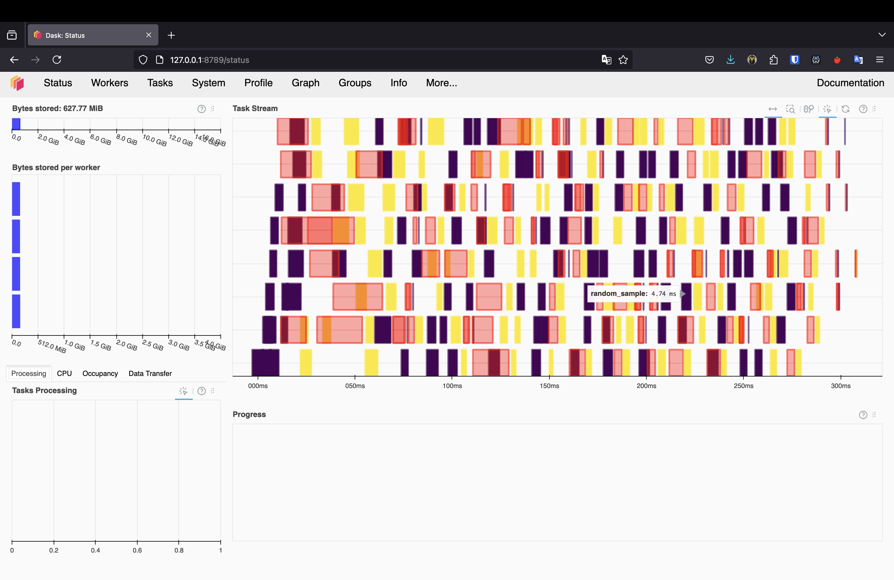
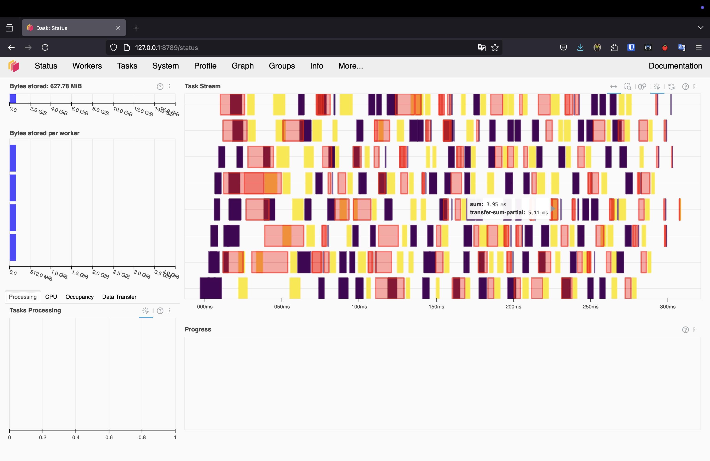
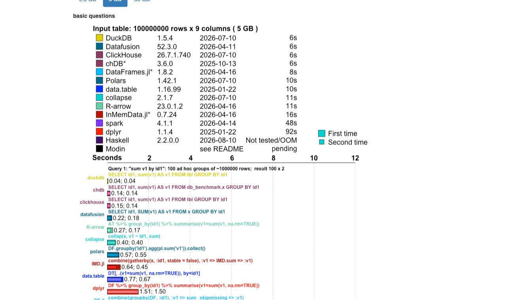
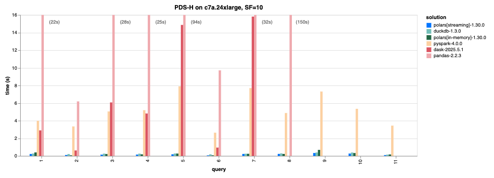
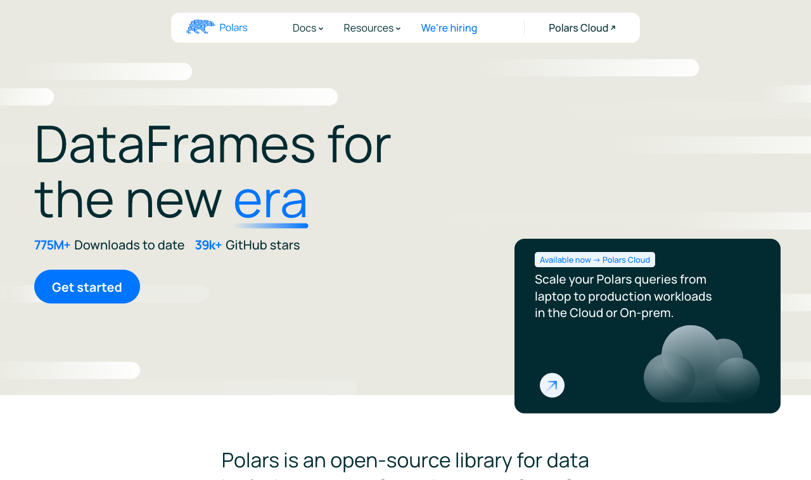
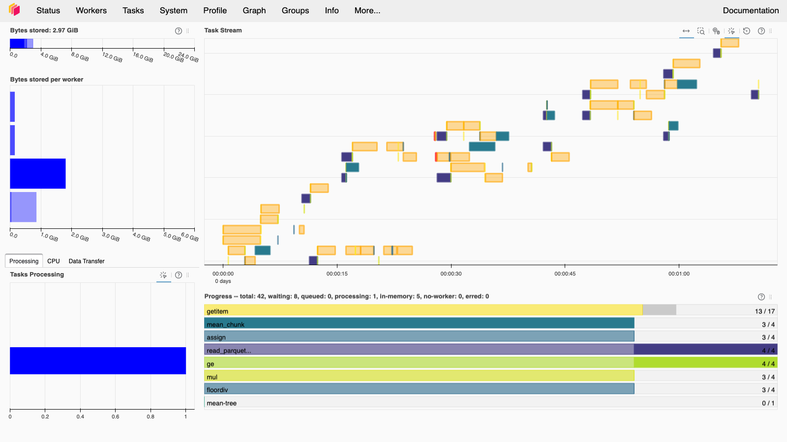
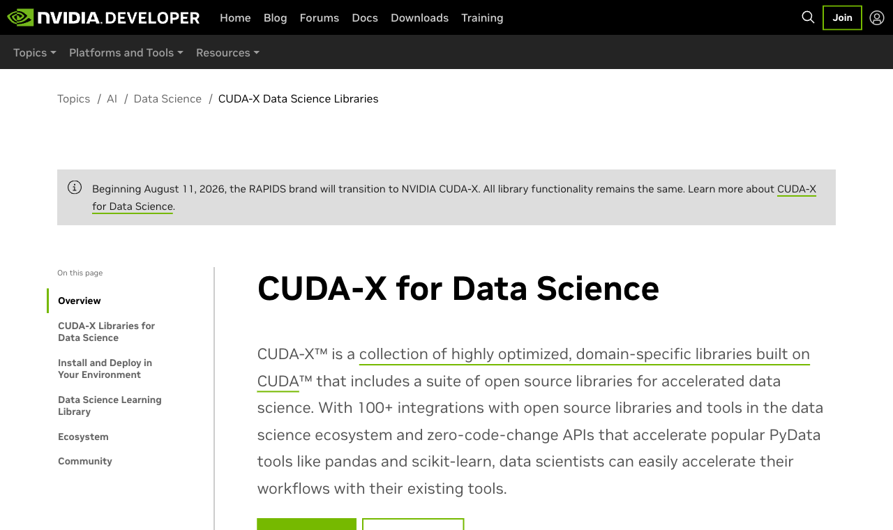
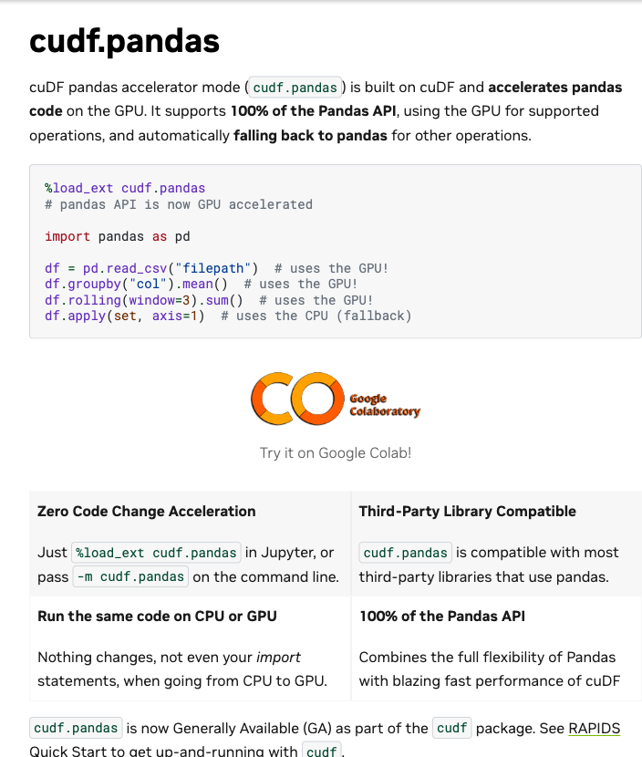

# Hello again! 😊 <br> How's everything? {background-color="#1B3A6B"}

# Brief recap 📚 {background-color="#1B3A6B"}

## Parallel computing fundamentals
### Where lecture 21 left us

:::{style="margin-top: 30px; font-size: 22px;"}
:::{.columns}
:::{.column width="50%"}
- Last class we covered the [concepts]{.alert} of parallel and scalable computing:
  - [`map`]{.alert}, embarrassingly parallel problems, and `joblib` / `concurrent.futures`
  - [Big O]{.alert}: parallelism cuts the constant while the complexity class stays the same
  - [Amdahl's law](https://en.wikipedia.org/wiki/Amdahl%27s_law): speed-up is capped by the serial share, so measure before scaling
  - [The GIL](https://en.wikipedia.org/wiki/Global_interpreter_lock): threads help for I/O, processes for CPU, and C/Rust libraries sidestep it entirely
  - [Dask]{.alert} basics: lazy arrays and DataFrames for bigger-than-RAM data
:::

:::{.column width="50%"}
- We ended with a promise: some engines [parallelise for you]{.alert}, with no cluster to manage
- Today is the [practice session]{.alert}: we decide which tool you actually reach for
- We will meet [Polars](https://pola.rs/) and [DuckDB](https://duckdb.org/), then race all four engines on the WDI panel we built in Module 06

:::{style="text-align: center; margin-top: -10px;"}
[{width="70%"}](#){data-modal-type="image" data-modal-url="figures/parallel.png"}
:::
:::
:::
:::

# Today's agenda {background-color="#1B3A6B"}

## Lecture outline
### What we will cover today

:::{style="margin-top: 30px; font-size: 22px;"}
:::{.columns}
:::{.column width="50%"}
- Set up [[local Dask Clusters]{.alert}](https://docs.dask.org/en/stable/deploying-python.html) with workers, schedulers, and the dashboard
- The [[single-machine renaissance]{.alert}](https://duckdblabs.github.io/db-benchmark/): why most "big data" now fits on one laptop
- [[Polars]{.alert}](https://pola.rs/): a fast DataFrame library with lazy evaluation and streaming
- [[DuckDB]{.alert}](https://duckdb.org/): SQL as an out-of-core scaling tool
- [[The benchmark]{.alert}](https://raw.githubusercontent.com/danilofreire/datasci350/main/lectures/lecture-22/data/benchmark_results.csv): pandas vs Polars vs DuckDB vs Dask on 200 million rows
- [Which tool when]{.alert}: a decision framework, plus a short word on [GPUs](https://developer.nvidia.com/topics/ai/data-science/cuda-x-for-data-science)
:::

:::{.column width="50%"}
:::{style="text-align: center; margin-top: -40px;"}
[{width="100%"}](#){data-modal-type="image" data-modal-url="figures/meme01.png"}
:::
:::
:::

:::{style="background: rgba(230, 57, 70, 0.1); padding: 12px; border-radius: 10px; font-size: 19px; margin-top: 10px;"}
Every output on these slides comes from a real run on my laptop. The benchmark was [measured once]{.alert} and saved to [`data/benchmark_results.csv`](https://raw.githubusercontent.com/danilofreire/datasci350/main/lectures/lecture-22/data/benchmark_results.csv)
:::
:::

# Dask Clients and Clusters 🌐 {background-color="#1B3A6B"}

## What is a Dask Cluster?
### Workers and schedulers

:::{style="margin-top: 30px; font-size: 23px;"}
- A [Dask Cluster](https://docs.dask.org/en/stable/deploying.html) is [a group of computational engines]{.alert} (cores, GPUs, servers, etc.) that work together to solve a problem
- Workers provide two functions:
  - [Compute tasks as directed by the scheduler]{.alert}. The scheduler is the brain of the cluster
  - [Store and serve computed results]{.alert} to other workers or clients
- Workers are the reason why lazy evaluation speeds up computations
- Here is a simple example:

:::{style="font-size: 26px;"}
```{markdown}
Scheduler -> Eve: Compute a <- multiply(3, 5)!
Eve -> Scheduler: I've computed a and am holding on to it! 
Scheduler -> Frank: Compute b <- add(a, 7)!
Frank: You will need a. Eve has a.
Frank -> Eve: Please send me a.
Eve -> Frank: Sure. a is 15!
Frank -> Scheduler: I've computed b and am holding on to it!
```
:::
:::

## What is a Dask Cluster?
### How the scheduler assigns work

:::{style="margin-top: 27px; font-size: 24px;"}
- How do workers know what to do?
  - The scheduler [assigns tasks to workers based on their availability]{.alert}
  - Workers can be on the same machine or on different machines
  - Workers can be CPUs or GPUs
- These processes can [automatically restart and scale up]{.alert} without any intervention from the user
- The optimal number of workers depends on data size and computation complexity
- The default configuration is usually enough
- In an adaptive cluster, you set the minimum and maximum number of workers
- The cluster adds and removes workers as the work demands
- [Dask also provides a dashboard to monitor the performance of your cluster]{.alert}
:::

## Setting up a Dask Cluster
### Installing the distributed scheduler

:::{style="margin-top: 30px; font-size: 27px;"}
- First, we need to install Dask and the distributed scheduler. I tested this with `dask==2026.7.1` and `distributed==2026.7.1`

:::{style="font-size: 30px; margin-top: 30px; margin-bottom: 30px;"}
```{verbatim}
python -m pip install "dask==2026.7.1" "distributed==2026.7.1"
```
:::

- The `distributed` scheduler is the default for Dask and it works great 👍
- Conda users can install it with:

:::{style="font-size: 30px; margin-top: 30px; margin-bottom: 30px;"}
```{verbatim}
conda install dask=2026.7.1 distributed=2026.7.1 -c conda-forge
```
:::
:::

## Setting up a Dask Client
### One client at the top of your script

:::{style="margin-top: 30px; font-size: 22px;"}
- Using `dask.distributed` requires that you set up a Client 
- This should be [the first thing you do]{.alert} if you intend to use `dask.distributed` in your analysis
- It offers low latency, data sharing between the workers, and is easy to set up

:::{style="font-size: 26px; margin-top: 30px; margin-bottom: 30px;"}
```{python}
#| echo: true
#| eval: true
from dask.distributed import LocalCluster, Client

# Specify a different port for the dashboard
# Use fewer workers and threads to avoid resource issues
cluster = LocalCluster(dashboard_address=':8789', n_workers=2, threads_per_worker=2)
client = Client(cluster)

# Print the dashboard link
print(f"Dask dashboard is available at: {cluster.dashboard_link}")
```
:::

- The `Client` object provides a way to interact with the cluster, submit tasks, and monitor the progress of computations
- Opening that link in your browser gives you the dashboard on the next slide
:::

## The Dask dashboard
### The status page and the workers tab

:::{style="margin-top: 20px; font-size: 21px;"}
:::{.columns}
:::{.column width="50%"}
:::{style="text-align: center;"}
[{width="100%"}](#){data-modal-type="image" data-modal-url="figures/dask-dashboard01.png"}
:::

:::{style="font-size: 17px; text-align: center; margin-top: 8px;"}
The status page: bytes stored, task processing, and the task stream, all updating live while the cluster works
:::
:::

:::{.column width="50%"}
:::{style="text-align: center;"}
[{width="100%"}](#){data-modal-type="image" data-modal-url="figures/dask-dashboard02.png"}
:::

:::{style="font-size: 17px; text-align: center; margin-top: 8px;"}
The workers tab: one row per worker, with its CPU, memory, and the number of tasks it is holding
:::
:::
:::

- Keep this open in a second window while you work. It is the fastest way to see whether the cluster is busy, idle, or running out of memory
:::

## Testing the Dask Client {#sec-dask-client-test}
### A small computation, watched from the dashboard

:::{style="margin-top: 4px; font-size: 22px;"}
:::{.columns}
:::{.column width="52%"}
- You can test the Dask Client by running a simple computation

:::{style="font-size: 19px; margin-top: 30px; margin-bottom: 30px;"}
```{python}
#| echo: true
#| eval: true
import dask.array as da

# A small array, so this stays interactive
x = da.random.RandomState(42).random((5000, 5000), chunks=(1000, 1000))
```

```{python}
#| echo: true
#| eval: true
# Perform a simple computation
y = (x + x.T).sum()

# Compute the result
y.compute()
```
:::

- `RandomState` sets the seed, so your numbers match mine
- If the client misbehaves, [[Appendix 03]{.button}](#sec-appendix-03) lists the errors you are most likely to hit
:::

:::{.column width="48%"}
:::{style="text-align: center;"}
[{width="50%"}](#){data-modal-type="image" data-modal-url="figures/dask-dashboard03.png"}
:::

:::{style="font-size: 17px; text-align: center; margin-top: 5px;"}
The task stream while `y.compute()` runs: every coloured bar is one chunk of the array being added and summed
:::

:::{style="text-align: center; margin-top: 2px;"}
[{width="50%"}](#){data-modal-type="image" data-modal-url="figures/dask-dashboard04.png"}
:::

:::{style="font-size: 17px; text-align: center; margin-top: 5px;"}
The same run seen per worker: both workers stay busy, which is what parallel execution looks like
:::
:::
:::
:::

# The single-machine renaissance 🚀 {background-color="#1B3A6B"}

## A reality check
### "Big data" doesn't only mean "buy a cluster"

:::{style="margin-top: 15px; font-size: 21px;"}
:::{.columns}
:::{.column width="50%"}
- For a decade, "big data" meant "buy a cluster", and that assumption is now [often wrong]{.alert}
- A modern laptop has 8-16 cores and fast SSD storage
- Most datasets that feel large (a few GB, tens of millions of rows) fit comfortably on one machine [if the engine is written for it]{.alert}
- Why does this matter for you?
  - No cluster to set up, pay for, or debug
  - Ordinary code, running fast
  - Enough for the final project and most real jobs
- The old advice ("just use Spark") often makes things [slower]{.alert} at this size, because cluster coordination has real overhead
- Two public benchmarks agree: Polars and DuckDB perform really well
:::

:::{.column width="50%"}
:::{style="text-align: center;"}
[{width="95%"}](#){data-modal-type="image" data-modal-url="figures/duckdb-db-benchmark-2026.png"}
:::

:::{style="font-size: 18px; margin-top: 5px;"}
Groupby on 5 GB, 16 cores and 32 GB RAM. DuckDB is one of the winners, and Polars does a great job too. Source: [db-benchmark](https://duckdblabs.github.io/db-benchmark/)
:::
:::
:::
:::

## Why single-machine engines got so fast
### The design decisions Polars and DuckDB share

:::{style="margin-top: 6px; font-size: 19px;"}
:::{.columns}
:::{.column width="50%"}
- [Columnar memory (Apache Arrow)]{.alert}: data is stored column by column, so a query reads only the columns it needs, streaming through contiguous memory
- [Vectorised kernels]{.alert}: the heavy loops are written in Rust (Polars) or C++ (DuckDB), running in batches on your CPU's SIMD instructions
- [All cores by default]{.alert}: every query is parallelised across your cores, with no cluster and no `n_jobs` to set
:::

:::{.column width="50%"}
:::{style="text-align: center;"}
```{python}
#| echo: false
#| eval: true
#| cache: true
#| fig-width: 4.8
#| fig-height: 1.75
import matplotlib.pyplot as plt
import matplotlib.patches as mpatches

fig, axes = plt.subplots(1, 2, figsize=(4.8, 1.75))
cols = ["#1B3A6B", "#E07A24", "#2CA02C"]

# Row store
ax = axes[0]
ax.set_title("Row store", fontsize=13, fontweight="bold")
ax.set_xlim(0, 4); ax.set_ylim(0, 6)
labels = ["id", "year", "value"]
for r in range(3):
    for c in range(3):
        ax.add_patch(mpatches.Rectangle((0.5 + c, 4.5 - r*1.5), 1, 1.2,
                     facecolor=cols[c], edgecolor="white", alpha=0.85))
        ax.text(1 + c, 5.1 - r*1.5, labels[c], ha="center", va="center",
                color="white", fontsize=8)
ax.annotate("one row =\nread everything", xy=(2, 0.95), ha="center",
            va="top", fontsize=10, color="#444")
ax.axis("off")

# Column store
ax = axes[1]
ax.set_title("Column store", fontsize=13, fontweight="bold")
ax.set_xlim(0, 4); ax.set_ylim(0, 6)
for c in range(3):
    for r in range(3):
        ax.add_patch(mpatches.Rectangle((0.5 + c, 4.5 - r*1.5), 1, 1.2,
                     facecolor=cols[c], edgecolor="white", alpha=0.85))
    ax.text(1 + c, 1.25, labels[c], ha="center", va="center",
            color=cols[c], fontsize=9, fontweight="bold")
ax.annotate("one column =\nread just that", xy=(2, 0.7), ha="center",
            va="top", fontsize=10, color="#444")
ax.axis("off")

plt.tight_layout()
plt.show()
```
:::
- "Average one column" then reads a tiny slice of the file
:::
:::

:::{style="text-align: center; margin-top: 10px;"}
[{width="62%"}](#){data-modal-type="image" data-modal-url="figures/polars-benchmarks-2026.png"}
:::

:::{style="font-size: 16px; text-align: center;"}
Source: [pola.rs/posts/benchmarks](https://pola.rs/posts/benchmarks/)
:::
:::

# Polars 🐻‍❄️ {background-color="#1B3A6B"}

## What is Polars?
### The product page, before the syntax

:::{style="margin-top: 20px; font-size: 23px;"}
:::{.columns}
:::{.column width="50%"}
- [Polars](https://pola.rs/) is a DataFrame library written in [Rust]{.alert}
- Its own headline is "DataFrames for the new era"
- The numbers on the front page: [775 million downloads]{.alert} and 39,000 GitHub stars, under an MIT licence
- It feels like pandas, with four differences:
  - The multi-threaded Rust engine uses [all your CPU cores]{.alert} automatically
  - Data sits in [Arrow]{.alert} columnar memory
  - A [lazy]{.alert} mode optimises your whole query before running it
  - It can [stream]{.alert} data larger than RAM
- Install it with `pip install polars`
:::

:::{.column width="50%"}
:::{style="text-align: center;"}
[{width="100%"}](#){data-modal-type="image" data-modal-url="figures/polars-home-2026.png"}
:::

:::{style="font-size: 20px; margin-top: 8px; text-align: center;"}
Source: [pola.rs](https://pola.rs)
:::
:::
:::
:::

## Selecting and filtering
### Expressions that pick columns and rows

:::{style="margin-top: 20px; font-size: 21px;"}
:::{.columns}
:::{.column width="52%"}
- Let's read the WDI panel you built in Module 06:

:::{style="font-size: 1.0em;"}
```{python}
#| echo: true
#| eval: true
#| cache: true
import polars as pl

df = pl.read_parquet("../lecture-19/data/wdi_panel.parquet")
df.head()
```
:::

- Polars uses [[expressions]{.alert}](https://docs.pola.rs/user-guide/expressions/): small descriptions of a column operation
- [`select`](https://docs.pola.rs/api/python/stable/reference/dataframe/api/polars.DataFrame.select.html) picks columns; [`filter`](https://docs.pola.rs/api/python/stable/reference/dataframe/api/polars.DataFrame.filter.html) keeps rows

:::{style="font-size: 1.0em;"}
```{python}
#| echo: true
#| eval: true
#| cache: true
(
    df
    .select(["country", "year", "value"])
    .filter(pl.col("year") >= 2000)
    .head(3)
)
```
:::
:::

:::{.column width="48%"}
- [`read_parquet`](https://docs.pola.rs/api/python/stable/reference/api/polars.read_parquet.html) loads the whole file
- [`scan_parquet`](https://docs.pola.rs/api/python/stable/reference/api/polars.scan_parquet.html) (later) stays lazy
- The pandas equivalent of the chain on the left:

:::{style="font-size: 0.95em; color: #555;"}
```python
# pandas
(
    df[["country", "year", "value"]]
    .loc[df["year"] >= 2000]
    .head(3)
)
```
:::

- [`pl.col("year")`](https://docs.pola.rs/api/python/stable/reference/expressions/col.html) refers to a column inside an expression
- The round brackets around the chain make Python read the four lines as [one expression]{.alert}
- Every method here is documented in the [Polars user guide](https://docs.pola.rs/user-guide/expressions/)
:::
:::
:::

## Transforming and aggregating
### with_columns and group_by, beside their pandas equivalents

:::{style="margin-top: 10px; font-size: 17px;"}
:::{.columns}
:::{.column width="52%"}
- `with_columns` adds or replaces columns

:::{style="font-size: 1.0em;"}
```{python}
#| echo: true
#| eval: true
#| cache: true
(
    df.with_columns(((pl.col("year") // 10) * 10).alias("decade"))
      .select(["country", "year", "decade"])
      .head(3)
)
```
:::

- `group_by(...).agg(...)` summarises groups

:::{style="font-size: 1.0em;"}
```{python}
#| echo: true
#| eval: true
#| cache: true
(
    df.group_by("indicator")
      .agg(pl.col("value").mean().alias("mean_value"),
           pl.len().alias("n"))
      .head(3)
)
```
:::
:::

:::{.column width="48%"}
- The pandas equivalents:

:::{style="font-size: 20px; color: #555;"}
```python
# pandas
df["decade"] = (df["year"] // 10) * 10
df[["country", "year", "decade"]].head(3)
```
:::

:::{style="font-size: 20px; color: #555;"}
```python
# pandas
df.groupby("indicator").agg(
    mean_value=("value", "mean"),
    n=("value", "size"),
).head(3)
```
:::

- `.alias("decade")` names the new column
- Polars never mutates in place; each step returns a new frame
- Inside `.agg()` you list one expression per output column
- `pl.len()` counts rows in each group
:::
:::
:::

## Lazy mode: let the engine plan the query {#sec-lazy}
### Nothing runs until you call collect

:::{style="margin-top: 30px; font-size: 20px;"}
:::{.columns}
:::{.column width="50%"}
- `scan_parquet` returns a [lazy frame]{.alert}: nothing runs until you call `.collect()`
- This lets Polars [reorder and prune]{.alert} your query like a database would

:::{style="font-size: 1.0em;"}
```{python}
#| echo: true
#| eval: true
#| cache: true
lazy = (
    pl.scan_parquet("../lecture-19/data/wdi_panel.parquet")
    .filter(pl.col("year") >= 1990)
    .group_by("indicator")
    .agg(pl.col("value").mean())
)
result = lazy.collect()
result.head(3)
```
:::
:::

:::{.column width="50%"}
- `.explain()` shows the optimised plan:

:::{style="font-size: 0.95em;"}
```{python}
#| echo: true
#| eval: true
#| cache: true
print(lazy.explain())
```
:::

- [Read the nodes bottom-up:]{.alert} Polars pushes the filter and the column selection [down into the file scan]{.alert}, so it never reads data it will throw away
  - It's like `mean(filter(read(file)))`: the outermost call is written first but happens last
- `π` is [projection]{.alert} (keep these columns) and `SELECTION` is the row filter, two ideas from [relational algebra](https://en.wikipedia.org/wiki/Relational_algebra#Projection)
- Polars reads 3 of the 5 columns and drops the old rows [before any data reaches your query]{.alert}
:::
:::
:::

## Streaming: data larger than RAM
### One argument changes how the query runs

:::{style="margin-top: 30px; font-size: 23px;"}
:::{.columns}
:::{.column width="50%"}
- The same lazy query can run in [streaming]{.alert} mode
- Polars processes the data in small batches, so the full dataset never sits in memory at once

:::{style="font-size: 1.0em;"}
```{python}
#| echo: true
#| eval: true
#| cache: true
result = (
    pl.scan_parquet("../lecture-19/data/wdi_panel.parquet")
    .filter(pl.col("year") >= 1990)
    .group_by("indicator")
    .agg(pl.col("value").mean())
    .collect(engine="streaming")
)
result.shape
```
:::
:::

:::{.column width="50%"}
- The only change is `collect(engine="streaming")`
- This is how Polars handles files bigger than your RAM on a single machine
- We use exactly this in the benchmark, on a file of 200 million rows

:::{style="font-size: 0.9em; color: #555; margin-top: 15px;"}
Note: the streaming engine has changed name across Polars versions. On Polars 1.43 (this deck) it is `collect(engine="streaming")`
:::
:::
:::
:::

## Polars and pandas can work together!
### Converting in both directions

:::{style="margin-top: 30px; font-size: 24px;"}
:::{.columns}
:::{.column width="50%"}
- You do not have to choose one forever
- Convert in either direction:

:::{style="font-size: 1.0em;"}
```{python}
#| echo: true
#| eval: true
#| cache: true
# Polars -> pandas
pdf = result.to_pandas()

# pandas -> Polars
back = pl.from_pandas(pdf)
type(pdf), type(back)
```
:::
:::

:::{.column width="50%"}
- Typical pattern:
  - Do the [heavy data work]{.alert} in Polars (fast, parallel)
  - Convert to pandas when a tool [needs]{.alert} pandas: plotting with matplotlib, or feeding scikit-learn
- The conversion is cheap because both use Arrow underneath
:::
:::
:::

## Try it yourself! 🧠 {#sec-exercise-01}

:::{style="margin-top: 30px; font-size: 22px;"}
- Here is a pandas groupby chain on the WDI panel:

:::{style="font-size: 1.05em;"}
```python
import pandas as pd
df = pd.read_parquet("../lecture-19/data/wdi_panel.parquet")
out = (
    df[df["year"] >= 2000]
      .groupby("country")["value"]
      .mean()
)
```
:::

- [Your task:]{.alert} rewrite it in [Polars lazy]{.alert} syntax and time both with `%timeit`
- Hint: five steps in this order, [`scan_parquet` → `filter` → `group_by` → `agg` → `collect`]{.alert}
- `agg` takes an [expression]{.alert}, not a column name: build it with `pl.col`, as on the [lazy mode slide](#sec-lazy)
- [[Appendix 01]{.button}](#sec-appendix-01)
:::

# DuckDB 🦆 {background-color="#1B3A6B"}

## SQL as a scaling tool
### The DuckDB home page, before the syntax

:::{style="margin-top: 15px; font-size: 19px;"}
:::{.columns}
:::{.column width="46%"}
- [DuckDB](https://duckdb.org/) is an [in-process]{.alert} analytical database written in C++, and its own tagline is "Your universal data wrangling tool"
- Think "SQLite for analytics": no server, just `pip install duckdb`
- Like Polars, it is [parallel]{.alert} and [out-of-core]{.alert} (it can process data larger than RAM)
- Its trick: query [files directly]{.alert}, with no loading step

:::{style="text-align: center; margin-top: -12px;"}
[{width="78%"}](#){data-modal-type="image" data-modal-url="figures/duckdb-home-2026.png"}
:::

:::{style="font-size: 16px; text-align: center; margin-top: 5px;"}
Source: [duckdb.org](https://duckdb.org)
:::
:::

:::{.column width="54%"}
- Query a Parquet file straight from disk:

:::{style="font-size: 22px;"}
```{python}
#| echo: true
#| eval: true
#| cache: true
import duckdb

duckdb.sql("""
    SELECT indicator, AVG(value) AS mean_value
    FROM '../lecture-19/data/wdi_panel.parquet'
    WHERE year >= 1990
    GROUP BY indicator
    LIMIT 3
""")
```
:::

- The file path goes straight in the `FROM` clause. DuckDB reads only the columns and rows it needs
:::
:::
:::

## Querying a DataFrame by name
### Your Python variable becomes a SQL table

:::{style="margin-top: 30px; font-size: 22px;"}
:::{.columns}
:::{.column width="50%"}
- DuckDB can also query a DataFrame that already sits in a Python variable
- The variable name [becomes the table name]{.alert} in your SQL

:::{style="font-size: 1.0em;"}
```{python}
#| echo: true
#| eval: true
#| cache: true
import pandas as pd

pdf = pd.read_parquet(
    "../lecture-19/data/wdi_panel.parquet"
)

# The variable `pdf` is now a SQL table
duckdb.sql("SELECT COUNT(*) AS n FROM pdf")
```
:::
:::

:::{.column width="50%"}
- Full SQL works: `GROUP BY`, joins, subqueries, window functions
- `country` is a pandas category, which DuckDB reads as an [enum]{.alert}: `::VARCHAR` turns it back into plain text so the result prints tidily

:::{style="font-size: 1.0em;"}
```{python}
#| echo: true
#| eval: true
#| cache: true
duckdb.sql("""
    SELECT country::VARCHAR AS country,
           ROUND(AVG(value), 1) AS mean_value,
           COUNT(*) AS n
    FROM pdf
    WHERE year >= 2000
    GROUP BY country
    ORDER BY mean_value DESC
    LIMIT 3
""")
```
:::
:::
:::
:::

## When to use SQL
### Choosing between expressions and SQL

:::{style="margin-top: 20px; font-size: 21px;"}
:::{.columns}
:::{.column width="50%"}
- Polars and DuckDB solve the same problems at similar speed
- The choice is mostly about [what you find readable]{.alert}:
  - [Polars]{.alert}: method chains, expressions, feels like Python
  - [DuckDB]{.alert}: SQL, familiar to anyone who took [DATASCI 151](https://danilofreire.github.io/datasci151-summer) 
- Many people use both: SQL for the big aggregation, Polars or pandas for the follow-up
- A DuckDB result converts to either DataFrame with one method:
  - `.df()` gives a pandas DataFrame
  - `.pl()` gives a Polars DataFrame
- So you can write the heavy query in SQL and continue in whichever library you prefer
- The same hand-off pattern we saw with Polars
:::

:::{.column width="50%"}
:::{style="font-size: 0.95em;"}
```{python}
#| echo: true
#| eval: true
#| cache: true
q = """
    SELECT indicator, AVG(value) AS mean_value
    FROM '../lecture-19/data/wdi_panel.parquet'
    WHERE year >= 1990
    GROUP BY indicator
"""

# To pandas
pdf = duckdb.sql(q).df()

# To Polars
pol = duckdb.sql(q).pl()

type(pdf), type(pol)
```
:::

:::{style="background: rgba(27, 58, 107, 0.08); padding: 15px; border-radius: 10px; font-size: 19px; margin-top: 15px;"}
Want more SQL practice? The course website has a full self-study [DuckDB SQL tutorial](https://danilofreire.github.io/datasci350/04-duckdb-sql-tutorial.html). It covers `SELECT`, `WHERE`, `GROUP BY`, joins, and window functions with DuckDB, for anyone who skipped [DATASCI 151](https://danilofreire.github.io/datasci151-summer) or wants more depth
:::
:::
:::
:::

## Try it yourself! 🧠 {#sec-exercise-02}

:::{style="margin-top: 30px; font-size: 22px;"}
- Take the aggregation from the last exercise (mean `value` per `country`, for `year >= 2000`)

:::{style="font-size: 1.0em;"}
```python
out = (
    pl.scan_parquet("../lecture-19/data/wdi_panel.parquet")
    .filter(pl.col("year") >= 2000)
    .group_by("country")
    .agg(pl.col("value").mean().alias("mean_value"))
    .collect()
)
```
:::

- [Your task:]{.alert} write it as a [DuckDB SQL query]{.alert} that reads the parquet file directly, and return the result as a [Polars]{.alert} frame
- Hint: the keywords you need, in query order, [`SELECT` → `AVG` → `FROM` → `WHERE` → `GROUP BY`]{.alert}
- Hint: the `FROM` clause can name a file path directly, in quotes
- Hint: `.pl()` turns a DuckDB result into a Polars frame
- [[Appendix 02]{.button}](#sec-appendix-02)
:::

# Let's create a benchmark 🏁 {background-color="#1B3A6B"}

## Our set-up {#sec-benchmark-setup}
### One task to run on four engines

:::{style="margin-top: 30px; font-size: 23px;"}
:::{.columns}
:::{.column width="50%"}
- One identical task and four different engines
  - [mean `value` by indicator and decade, filtered to post-1990]{.alert}
- Our data is `wdi_big.parquet`, a synthetic panel of [200 million rows]{.alert} (~1.4 GB on disk)
- It is built by cloning the small WDI panel many times (script: [`data/make_big_parquet.py`](https://github.com/danilofreire/datasci350/blob/main/lectures/lecture-22/data/make_big_parquet.py))
- The file is [not committed]{.alert} (too big); but anyone can rebuild it from the script
- [[Appendix 04]{.button}](#sec-appendix-04)
:::

:::{.column width="50%"}
- Our four engines:

:::{style="font-size: 24px; margin-top: 30px; margin-bottom: 30px;"}
| Engine | Strategy |
|--------|----------|
| pandas | load all, then `groupby` |
| Polars | lazy scan + streaming |
| DuckDB | SQL over the file |
| Dask | parallel DataFrame + dashboard |
:::

- The numbers on the next slides were [measured once on my machine]{.alert} and saved to [`data/benchmark_results.csv`](https://raw.githubusercontent.com/danilofreire/datasci350/main/lectures/lecture-22/data/benchmark_results.csv)
- The deck [reads that CSV]{.alert}. It doesn't re-run the benchmark
:::
:::
:::

## The four queries, side by side
### Polars and DuckDB here; pandas and Dask in Appendix 05

:::{style="margin-top: 20px; font-size: 23px;"}
[Polars]{.alert} (lazy + streaming):

```{python}
#| echo: true
#| eval: false
import polars as pl
(pl.scan_parquet("data/wdi_big.parquet")
   .filter(pl.col("year") >= 1990)
   .with_columns(((pl.col("year") // 10) * 10).alias("decade"))
   .group_by("indicator", "decade")
   .agg(pl.col("value").mean())
   .collect(engine="streaming"))
```

[DuckDB]{.alert} (SQL over the file):

```{python}
#| echo: true
#| eval: false
import duckdb
duckdb.sql("""
    SELECT indicator, (year // 10) * 10 AS decade,
           AVG(value) AS mean_value
    FROM 'data/wdi_big.parquet'
    WHERE year >= 1990
    GROUP BY indicator, decade
""").df()
```

- The same query in SQL, with the file path in the `FROM` clause
- The pandas and Dask versions of this query are in [[Appendix 05]{.button}](#sec-appendix-05)
:::

## The results

:::{style="margin-top: 40px; font-size: 20px;"}
:::{.columns}
:::{.column width="60%"}
:::{style="text-align: center;"}
```{python}
#| echo: false
#| eval: true
#| cache: true
import pandas as pd
import matplotlib.pyplot as plt

res = pd.read_csv("data/benchmark_results.csv")
res = res.sort_values("seconds", ascending=True)

colours = {"pandas": "#888888", "dask": "#F2A93B",
           "polars": "#1B3A6B", "duckdb": "#2CA02C"}
bar_colours = [colours[t] for t in res["tool"]]

fig, ax = plt.subplots(figsize=(7, 4.5))
bars = ax.barh(res["tool"], res["seconds"], color=bar_colours)
ax.set_xlabel("Wall-clock time (seconds, lower is better)", fontsize=12)
ax.set_title("Mean value by indicator and decade\n200 million rows, one machine",
             fontsize=13, fontweight="bold")
ax.bar_label(bars, fmt="%.2f s", padding=4, fontsize=11)
ax.margins(x=0.15)
ax.invert_yaxis()
plt.tight_layout()
plt.show()
```
:::
:::

:::{.column width="40%"}
:::{style="font-size: 23px;"}
- [Polars and DuckDB]{.alert} finish in well under a second
- [pandas]{.alert} is over 15× slower, and must hold the whole column set in RAM
- [Dask]{.alert} beats pandas by parallelising and streaming, but the single-machine engines still win here
- Macbook Pro, Apple M5, 10 cores, 24 GB RAM
:::
:::
:::
:::

## Reading the benchmark honestly

:::{style="margin-top: 30px; font-size: 23px;"}
:::{.columns}
:::{.column width="50%"}
- Every benchmark measures one task on one machine
- Treat the numbers as evidence about this setting, and expect them to shift with:
  - the task (this one is a simple aggregation)
  - the hardware (cores, RAM, disk speed)
  - the data shape and file layout
- What stays the same:
  - The [order of magnitude]{.alert}: Polars and DuckDB are far ahead for single-node analytics
  - The [zero setup cost]{.alert}: no cluster, no config
- The order of magnitude is the result worth remembering; the exact seconds will differ on your machine
:::

:::{.column width="50%"}
:::{style="text-align: center;"}
[{width="95%"}](#){data-modal-type="image" data-modal-url="figures/dask-dashboard-benchmark.png"}
:::

:::{style="font-size: 20px; margin-top: 10px; text-align: center;"}
The Dask task stream during the benchmark
:::
:::
:::
:::

# Which tool when? 🧭 {background-color="#1B3A6B"}

## A decision framework
### What we have been building

:::{style="margin-top: 12px; font-size: 22px;"}
:::{style="text-align: center; margin-bottom: 10px;"}
| Your situation | Reach for |
|----------------|-----------|
| Fits in RAM, quick exploration, plotting | [pandas]{.alert} |
| Big single file or many files, one machine | [Polars or DuckDB]{.alert} (expressions or SQL, your preference) |
| Bigger than the machine, a real cluster, or task graphs / arrays | [Dask]{.alert} (or Spark in industry) |

`pandas → Polars/DuckDB → Dask`
:::

:::{.columns}
:::{.column width="50%"}
- When Dask still wins:
  - Data larger than one machine's disk
  - A real cluster of many machines
  - Parallel [arrays]{.alert} and custom [task graphs]{.alert} (the `dask.delayed` pipelines from last lecture)
- Fast single-machine engines shrink the set of problems that need Dask. The cases above remain genuinely distributed
:::

:::{.column width="50%"}
- [pandas]{.alert} is still the right default for small data and for the huge ecosystem around it
- [Polars]{.alert} and [DuckDB]{.alert} answer "my data got big and still fits on one machine"
- From last lecture, before you scale anything:
  - [Amdahl first]{.alert}: measure where the time goes
  - A better algorithm or a faster engine often beats adding cores
:::
:::
:::

## A word on GPUs
### When different hardware is worth the trouble

:::{style="margin-top: 12px; font-size: 21px;"}
:::{.columns}
:::{.column width="50%"}
- Everything today used your [CPU]{.alert}, which are general-purpose processors with a few fast cores
- A [[GPU]{.alert}](https://developer.nvidia.com/cuda-zone) has thousands of small, slow cores
- That suits [data-parallel]{.alert} work 
  - The same operation applied to millions of numbers at once, like matrix multiplication
- This is [exactly what training a neural network needs]{.alert}
- GPUs pay off when the work is the same arithmetic repeated across millions of values
- Ordinary data wrangling rarely has that shape, which is why everything else today ran on the CPU
:::

:::{.column width="50%"}
- For data analysis, the GPU stack is [RAPIDS, renamed CUDA-X in August 2026](https://developer.nvidia.com/topics/ai/data-science/cuda-x-for-data-science):
  - [cuDF](https://docs.rapids.ai/api/cudf/stable/): DataFrames on the GPU
  - [cuML](https://docs.rapids.ai/api/cuml/stable/): the same offer for scikit-learn

:::{style="text-align: center; margin-top: 8px;"}
[{width="80%"}](#){data-modal-type="image" data-modal-url="figures/rapids-home-2026.png"}
:::

:::{style="font-size: 16px; margin-top: 5px; text-align: center;"}
Source: [NVIDIA CUDA-X](https://developer.nvidia.com/topics/ai/data-science/cuda-x-for-data-science)
:::
:::
:::
:::

## GPUs without rewriting your code

:::{style="margin-top: 30px; font-size: 22px;"}
:::{.columns}
:::{.column width="50%"}
- [cudf.pandas](https://docs.rapids.ai/api/cudf/stable/cudf_pandas/) accelerates pandas from [one line]{.alert}
  - `%load_ext cudf.pandas` in a notebook
- It covers the whole pandas API and [falls back to the CPU]{.alert}, so your code still runs
- The [Polars GPU engine](https://docs.rapids.ai/api/cudf/stable/cudf_polars/) does the same for lazy Polars
  - You pass an engine to `collect`, and unsupported queries fall back to the CPU
- It is still [open beta]{.alert}, and NVIDIA aims it at datasets of hundreds of gigabytes and up
- No GPU on your laptop? [Google Colab](https://colab.research.google.com/) gives you one for free, and both projects ship a Colab demo
- Nothing in the final project needs a GPU
:::

:::{.column width="50%"}
:::{style="text-align: center; margin-top: -20px;"}
[{width="80%"}](#){data-modal-type="image" data-modal-url="figures/cudf-pandas-2026.png"}
:::
:::
:::
:::

# Conclusion {background-color="#1B3A6B"}

## Summary
### What we learned today

:::{style="margin-top: 25px; font-size: 24px;"}
:::{.columns}
:::{.column width="50%"}
- We set up a [Dask cluster]{.alert} and watched work flow through the dashboard
- We saw why the new engines are fast
  - They store data by [column]{.alert}, and their compiled kernels use every core without any configuration
- [Polars]{.alert}: expressions, lazy mode, streaming, pandas interop
- [DuckDB]{.alert}: SQL over files, out-of-core, results to pandas or Polars
:::

:::{.column width="50%"}
- The [benchmark]{.alert}: on 200 million rows, Polars and DuckDB finished in under a second, an order of magnitude ahead of pandas and Dask
- A [decision framework]{.alert}: pandas for small data, Polars or DuckDB on one machine, Dask when you outgrow it
- Measure where the time goes before you scale anything
:::
:::
:::

## Next class

:::{style="margin-top: 30px; font-size: 23px;"}
:::{.columns}
:::{.column width="50%"}
- [Lecture 23]{.alert} moves from making your pipeline fast to making it [run anywhere]{.alert}
- The tools: containers and dependency management
- Today your code depended on your Python, your versions, and your laptop
- Next class we package all three
- A classmate, a server, or a marker then gets the same result
- The `pip install` lines from this deck stop being setup instructions, and become part of an [image]{.alert} you build
:::

:::{.column width="50%"}
:::{style="margin-top: -20px;"}
Before then:

1. Finish both exercises if you did not complete them in class
2. Time the four engines on the small panel, using the code in [Appendix 05](#sec-appendix-05)
3. Check that `dask`, `polars`, and `duckdb` all import in your environment

:::{style="background: rgba(27, 58, 107, 0.08); padding: 15px; border-radius: 10px; font-size: 19px; margin-top: 15px;"}
- [Quiz 04]{.alert} covers web APIs and JSON (Module 06)
- Your [final project]{.alert} pulls World Bank data from the API
- It processes that data with the tools from this module, and ships it in a container
:::
:::
:::
:::
:::

# Thank you! 🚀 {background-color="#1B3A6B"}

# Appendix 📚 {background-color="#1B3A6B"}

## Appendix 01: Solution to Exercise 01 {#sec-appendix-01}

:::{style="margin-top: 30px; font-size: 21px;"}
- Rewrite the pandas chain in Polars lazy syntax:

```{python}
#| echo: true
#| eval: true
#| cache: true
import polars as pl

out = (
    pl.scan_parquet("../lecture-19/data/wdi_panel.parquet")
    .filter(pl.col("year") >= 2000)
    .group_by("country")
    .agg(pl.col("value").mean().alias("mean_value"))
    .collect()
)
out.head(3)
```

- The three verbs, in order: `filter` (keep recent rows), `group_by` (form the groups), `agg` (summarise)
- On this small panel, both pandas and Polars finish in milliseconds. The gap only appears on large data

[[Back to exercise]{.button}](#sec-exercise-01)
:::

## Appendix 02: Solution to Exercise 02 {#sec-appendix-02}

:::{style="margin-top: 30px; font-size: 21px;"}
- The same aggregation in DuckDB SQL, returned as a Polars frame:

```{python}
#| echo: true
#| eval: true
#| cache: true
import duckdb

result = duckdb.sql("""
    SELECT country, AVG(value) AS mean_value
    FROM '../lecture-19/data/wdi_panel.parquet'
    WHERE year >= 2000
    GROUP BY country
""").pl()

result.head(3)
```

- The file path sits directly in the `FROM` clause
- `.pl()` turns the DuckDB result into a Polars frame (use `.df()` for pandas)

[[Back to exercise]{.button}](#sec-exercise-02)
:::

## Appendix 03: When something goes wrong {#sec-appendix-03}

:::{style="margin-top: 25px; font-size: 20px;"}
:::{.columns}
:::{.column width="50%"}
[`No buffer space available`]{.alert}

The cluster ran out of network resources for worker-to-worker traffic. Use a smaller array, or lower `n_workers` and `threads_per_worker`.

[`Stream is closed` or `CommClosedError`]{.alert}

A worker died mid-computation, usually in an interactive terminal. Run the same code from a script or a Jupyter notebook instead.

[The dashboard will not open]{.alert}

The port is already taken. Pick a free one with `dashboard_address=':8789'`, or let Dask choose automatically.
:::

:::{.column width="50%"}
[Workers keep restarting]{.alert}

This is memory pressure. Lower `n_workers`, raise the memory limit, or process the data in smaller chunks.

[The computation hangs]{.alert}

You probably created two clients. Restart the kernel and create exactly one `Client`

:::{style="background: rgba(27, 58, 107, 0.08); padding: 15px; border-radius: 10px; font-size: 19px; margin-top: 15px;"}
General advice: create [one]{.alert} `Client` at the top of your script and reuse it. Watch the [task stream]{.alert} and [worker memory]{.alert} panels on the dashboard, and when in doubt restart the client and run on a smaller sample first
:::
:::
:::

[[Back to the client]{.button}](#sec-dask-client-test)
:::

## Appendix 04: Rebuilding the big file {#sec-appendix-04}

:::{style="margin-top: 30px; font-size: 22px;"}
- `wdi_big.parquet` is [not committed]{.alert} to the repository (it is ~1.4 GB)
- Rebuild it from the small panel with the [generation script](https://github.com/danilofreire/datasci350/blob/main/lectures/lecture-22/data/make_big_parquet.py):

```{verbatim}
cd lectures/lecture-22/data
python make_big_parquet.py
```

- Default: ~200 million rows. For a slower laptop, use fewer replicas:

```{verbatim}
python make_big_parquet.py --replicas 400
```

- The script uses a fixed seed, so everyone who runs it gets the same file
- This is the Module 06 principle: [do not commit data you can regenerate from a script]{.alert}

[[Back to the benchmark]{.button}](#sec-benchmark-setup)
:::

## Appendix 05: The pandas and Dask queries {#sec-appendix-05}

:::{style="margin-top: 25px; font-size: 22px;"}
[pandas]{.alert} (loads everything into memory):

```{python}
#| echo: true
#| eval: false
import pandas as pd
df = pd.read_parquet("data/wdi_big.parquet",
                     columns=["indicator", "year", "value"])
df = df[df["year"] >= 1990]
df["decade"] = (df["year"] // 10) * 10
df.groupby(["indicator", "decade"])["value"].mean()
```

- The whole three-column slice has to fit in RAM before the `groupby` starts

[Dask]{.alert} (parallel DataFrame):

```{python}
#| echo: true
#| eval: false
import dask.dataframe as dd
df = dd.read_parquet("data/wdi_big.parquet",
                     columns=["indicator", "year", "value"])
df = df[df["year"] >= 1990]
df["decade"] = (df["year"] // 10) * 10
df.groupby(["indicator", "decade"])["value"].mean().compute()
```

- The pandas code with two changes: `dd` in place of `pd`, and a `.compute()` at the end

[[Back to the queries]{.button}](#the-four-queries-side-by-side)
:::
