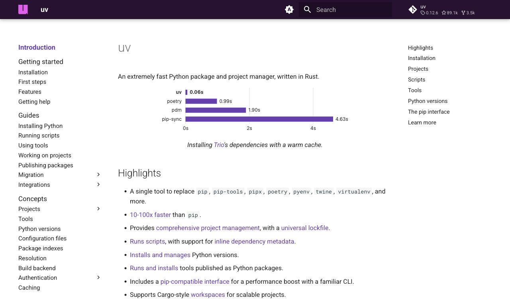
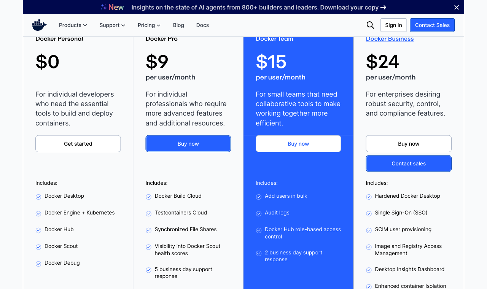
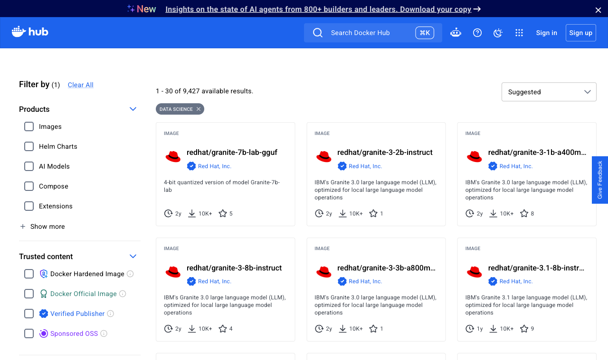
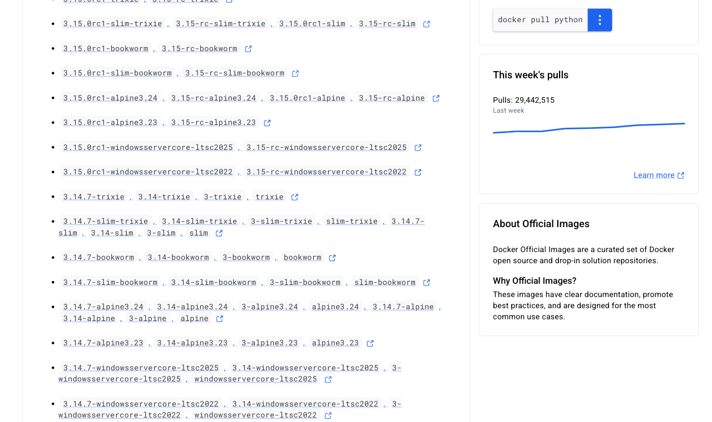
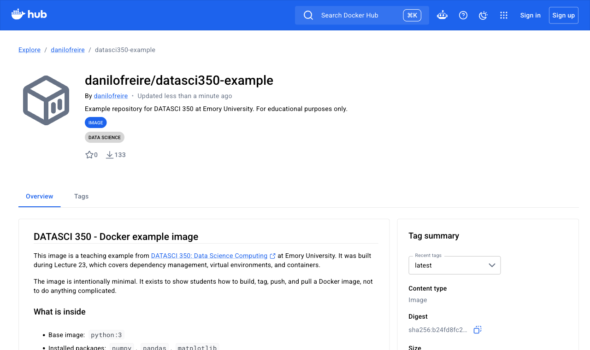

# Hello again! 😊 {background-color="#1B3A6B"}

# Brief recap 📚 {background-color="#1B3A6B"}

## Scaling up an analysis

:::{style="margin-top: 30px; font-size: 23px;"}
:::{.columns}
:::{.column width="52%"}
- We set up a [Dask cluster]{.alert} and watched work flow through the dashboard
- We met the ["single-machine renaissance"]{.alert}
  - Columnar memory, vectorised kernels, all cores by default
- [Polars]{.alert}: expressions, lazy mode, streaming, and pandas interop
- [DuckDB]{.alert}: SQL over files, out-of-core, results back into pandas or Polars
- Our little [benchmark]{.alert}: [Polars](https://pola.rs) and [DuckDB](https://duckdb.org/) finished in under a second, way ahead of [pandas](https://pandas.pydata.org/) and [Dask](https://dask.org/)
- Pandas for small data, Polars or DuckDB when it grows, Dask when it leaves one machine
- Now that your pipeline works, [let's make it run anywhere!]{.alert} 🤓
:::

:::{.column width="48%"}
:::{style="text-align: center; margin-top: 0px;"}
[{width="100%"}](#){data-modal-type="image" data-modal-url="figures/dask-dashboard-benchmark.png"}
:::
:::{style="font-size: 20px; text-align: center;"}
The Dask dashboard during the 200-million-row benchmark
:::
:::
:::
:::

# Today's agenda {background-color="#1B3A6B"}

## Lecture overview
### Will your code run anywhere else?

:::{style="margin-top: 0px; font-size: 24px;"}

:::{.columns}
:::{.column width="50%"}
[1. Dependency management]{.alert}

- Why working code breaks
- How to write down what your code needs

[2. Virtual environments]{.alert}

- `venv` and `pip`, and the `requirements.txt` every Dockerfile reads
- `conda` for software that is not Python, `uv` for speed
:::

:::{.column width="50%"}
[3. Containers]{.alert}

- What Docker is, and how an image differs from a container
- Docker Desktop, its licence, and the free alternatives

[4. Your first image]{.alert}

- Five instructions, built, run, and pushed to Docker Hub
- The [final project]{.alert} is due on the last day of classes, and 30% of the grade is a container that renders your report
- Starter: [github.com/danilofreire/datasci350-project-starter](https://github.com/danilofreire/datasci350-project-starter)
:::
:::
:::

# Dependency management 📦 {background-color="#1B3A6B"}

## Congratulations! 🎉
### You have a project 🥳

:::{style="margin-top: 20px; font-size: 24px;"}
:::{.columns}
:::{.column width="50%"}
- Your code works, it is fast thanks to Polars and DuckDB, the report renders, the repository is documented
- One question remains: [will it run anywhere else?]{.alert}
- What happens when you move it to a new machine, hand it to a colleague, or open it again in six months?
- Everything so far assumed one thing you never wrote down: [the software installed on your laptop]{.alert}
- [Dependency management]{.alert} makes that assumption explicit
:::

:::{.column width="50%"}
:::{style="text-align: center; margin-top: -20px;"}
[{width="100%"}](#){data-modal-type="image" data-modal-url="figures/dependencies.png"}
:::
:::
:::
:::

## Why do we need dependency management?

:::{style="margin-top: 30px; font-size: 21px;"}
:::{.columns}
:::{.column width="50%"}
### The problem

- [Libraries change constantly!]{.alert}
- Even very simple code breaks when software updates
- From Python 2.x to 3.x:
  - `-c` means "run this command"

:::{style="font-size: 21px; margin-top: 20px; margin-bottom: 20px;"}
```text
python2 -c 'print "Hello, DATASCI350!"'
Hello, DATASCI350!

python3 -c 'print "Hello, DATASCI350!"'

  File "<string>", line 1
    print "Hello, DATASCI350!"
    ^^^^^^^^^^^^^^^^^^^^^^^^^^
SyntaxError: Missing parentheses in call to
'print'. Did you mean print(...)?
```
:::
:::

:::{.column width="50%"}
### Some definitions

:::{style="font-size: 22px;"}
- [Dependency management]{.alert}: making sure your code will run in the future
- [Dependencies]{.alert}: external libraries, packages, and software your code needs
- [Packages]{.alert}: have a name, a version, and possibly their own dependencies
- [Package registry]{.alert}: a directory that stores packages and metadata, e.g., [CRAN](https://cran.r-project.org/), [PyPI](https://pypi.org/), [Conda](https://docs.conda.io/en/latest/)
- [Dependency management tools]{.alert}: `pip`, `conda`, and others install and track those packages
- Every tool in this lecture exists to write that list down and replay it somewhere else
:::
:::
:::
:::

## The reproducibility crisis

:::{style="margin-top: 30px; font-size: 23px;"}
:::{.columns}
:::{.column width="50%"}
- [Reproducibility crisis]{.alert}: many researchers cannot replicate published results
- It affects computer science, statistics, psychology, and medicine alike
- Some causes are statistical: p-hacking, publication bias, low power
- A 2016 [Nature survey](https://www.nature.com/articles/533452a) asked 1,576 researchers:
  - [More than 70%]{.alert} had failed to reproduce another scientist's experiment
  - [More than half]{.alert} had failed to reproduce one of their own
- Missing documentation and unrecorded dependencies are as common, and both have a technical fix
- The rest of today is that fix
:::

:::{.column width="50%"}
:::{style="text-align: center; margin-top: -20px;"}
[{width="85%"}](#){data-modal-type="image" data-modal-url="figures/reproducibility.webp"}
:::
:::
:::
:::

## The reproducibility trade-off
### How far do you go?

:::{style="margin-top: 20px; font-size: 23px;"}
:::{style="text-align: center; margin-top: 10px;"}
[{width="72%"}](#){data-modal-type="image" data-modal-url="figures/trade-off.png"}
:::

- How far should you go to make a result reproducible? [It depends on who has to rerun it]{.alert}
- At minimum, [declare your dependencies]{.alert} so others know what you used
- [Manage them]{.alert} with a package or environment manager (`conda`, `pip`, `uv`)
- [Pin them]{.alert} with `renv` (R) or `uv` (Python), which record exact versions
- Host them online with [Code Ocean](https://codeocean.com/) ($$$) or [Binder](https://mybinder.org/) (free and limited)
- Go further with [containers]{.alert} ([Docker](https://www.docker.com/), [Apptainer](https://apptainer.org/)) for full portability
- Your project sits near the right-hand end, and the rest of today is how to get there
:::

## How to declare dependencies?
### One file in the repository root

:::{style="margin-top: 20px; font-size: 24px;"}
- Say your analysis uses Python, NumPy, pandas, and matplotlib. Ask yourself:
  - What packages do I need?
  - Will this work on my collaborator's operating system?
  - Can someone else reproduce my results?

- Use a [package manager to declare your dependencies]{.alert} in a single file
- [Store it in the repository root]{.alert} so collaborators can install everything in one step
- Which file depends on your package manager:
  - `pip` (Python only): [`requirements.txt`]{.alert}
  - `conda` (Python and R): `environment.yml`
  - `uv` (Python only): `pyproject.toml` and `uv.lock`
- Know `requirements.txt` best: every Dockerfile reads it, including your project starter's
- Let's see all three
:::

# Virtual environments 🌐 {background-color="#1B3A6B"}

## `venv` and `pip`: an isolated Python
### The workflow your Dockerfile will use

:::{style="margin-top: 2px; font-size: 19px;"}
:::{.columns}
:::{.column width="52%"}
- [`venv`]{.alert} ships with Python. It creates a folder with its own `python` and `site-packages`
- [Nothing you install inside it touches the system Python]{.alert} 
- Two projects can keep two versions of the same package
- Create it, switch into it, and install:

:::{style="margin-top: 20px; margin-bottom: 20px;"}
```{verbatim}
python3 -m venv .venv

source .venv/bin/activate    # macOS and Linux
.venv\Scripts\activate       # Windows

pip install requests polars
```
:::

- Add `.venv/` to your `.gitignore`. The package list goes into git; [the folder itself stays on your machine]{.alert}
:::

:::{.column width="48%"}
- `which python` tells you which interpreter you are actually using:

:::{style="font-size: 16px;"}
```{verbatim}
which python
/private/tmp/[...]/l23/venv-demo/.venv/bin/python

python --version
Python 3.14.6

pip --version
pip 26.1.2 [...] (python 3.14)
```
:::

- The path ends in `.venv/bin/python`, so the environment is active
- The install itself:

:::{style="font-size: 16px;"}
```{verbatim}
Successfully installed certifi-2026.7.22
charset_normalizer-3.5.1 idna-3.19 polars-1.44.0
polars-runtime-32-1.44.0 requests-2.34.2
urllib3-2.7.0
```
:::

- [Docker images do this too]{.alert} 
- The project starter's Dockerfile runs `python3 -m venv /opt/venv` and sets `ENV PATH="/opt/venv/bin:$PATH"`, so every later instruction uses that interpreter without activation
:::
:::
:::

## `requirements.txt`: the file you commit
### `pip freeze` writes it and `pip install -r` reads it

:::{style="margin-top: 20px; font-size: 21px;"}
:::{.columns}
:::{.column width="50%"}
- Inside the clean environment, [`pip freeze`]{.alert} [prints every installed package with its exact version:]{.alert}

```{verbatim}
pip freeze > requirements.txt
cat requirements.txt

certifi==2026.7.22
charset-normalizer==3.5.1
idna==3.19
polars==1.44.0
polars-runtime-32==1.44.0
requests==2.34.2
urllib3==2.7.0
```

- Two packages became seven lines because `pip` lists the dependencies of your dependencies
- The [`==` pins]{.alert} say "these exact versions"
:::

:::{.column width="50%"}
- Your collaborator [makes their own environment and installs from the file:]{.alert}

```{verbatim}
python3 -m venv .venv
source .venv/bin/activate
pip install -r requirements.txt
```

- Run `pip freeze` inside a [conda]{.alert} environment and some lines come out as `name @ file:///...` local paths, which install nowhere else
- Freeze inside a plain `venv` and the problem never appears
- [Our project starter repo](https://github.com/danilofreire/datasci350-project-starter) pins every package by hand, with a comment for each:

```{verbatim}
# Talking to web APIs
requests==2.34.2

# Data processing (use either, or both)
polars==1.44.0
duckdb==1.5.5
```
:::
:::
:::

## Conda in one slide
### You met conda in DATASCI 151

:::{style="margin-top: 20px; font-size: 20px;"}
:::{.columns}
:::{.column width="50%"}
- [Conda](https://docs.conda.io/) [manages environments and packages together,]{.alert} and installs non-Python software: compilers, R, CUDA
- Create it and switch into it:

:::{style="margin-top: 20px; margin-bottom: 20px;"}
```{verbatim}
conda create --name l23-demo \
  python=3.14 numpy pandas -y
conda activate l23-demo
```
:::

- Export it with [`--from-history`]{.alert}, which records only the packages you asked for:

:::{style="margin-top: 20px; margin-bottom: 20px;"}
```{verbatim}
conda env export --name l23-demo \
  --from-history > environment.yml
```
:::

- Others recreate it with `conda env create --file environment.yml`, then `conda activate l23-demo`
:::

:::{.column width="50%"}
- The file it produced:

:::{style="font-size: 20px; margin-top: 10px; margin-bottom: 20px;"}
```{verbatim}
name: l23-demo
channels:
  - conda-forge
  - defaults
dependencies:
  - pandas
  - numpy
  - python=3.14
prefix: /Users/dafreir/miniconda3/envs/l23-demo
```
:::

- Drop `--from-history` and it lists every transitive package instead:

:::{style="font-size: 16px; margin-top: 20px; margin-bottom: 20px;"}
```{verbatim}
  - _openmp_mutex=4.5=7_kmp_llvm
  - bzip2=1.0.8=h4e30115_10
  - libblas=3.11.0=9_h51639a9_openblas
  - libcxx=23.1.0=h55c6f16_0
  [...]
```
:::

- Those files describe one machine exactly but [rarely install on another.]{.alert} The next slide takes one apart
:::
:::
:::

## What are build strings?
### Reading a conda package specification

:::{style="margin-top: 12px; font-size: 20px;"}
:::{.columns}
:::{.column width="50%"}
- A conda [build](https://docs.conda.io/projects/conda/en/latest/user-guide/concepts/build.html) is [a specific compiled binary of a package]{.alert}
- The same version can be compiled differently per platform, Python version, or feature set
- A full conda package specification:

```{verbatim}
numpy=1.21.5=py39h12345_0
└──┬─┘└─┬──┘ └────┬───┘└┬┘
   │    │         │     │
   │    │         │     └─ Build number (0)
   │    │         └─────── Build string (py39h12345)
   │    └───────────────── Version (1.21.5)
   └────────────────────── Package name (numpy)
```

- The [`--no-builds` flag]{.alert} strips it, making the file [portable across platforms]{.alert}
:::

:::{.column width="50%"}
- The build string (`py39h12345`) encodes metadata:
  - Python version (`py39`, `py310`)
  - Architecture (`linux_64`, `osx_arm64`)
  - Compiler (`gcc9`, `clang`)
  - Features (`nomkl`, `cuda`)

- Why do builds exist?
  - Software is compiled differently per operating system
  - Packages target specific Python versions
  - Builds enable or disable optional features
  - Different compilers produce different binaries

- The line `libblas=3.11.0=9_h51639a9_openblas` on the previous slide will not resolve on a Linux collaborator's machine
:::
:::
:::

## `uv`: a fast Python package manager
### Maybe new to you

:::{style="margin-top: 12px; font-size: 20px;"}
:::{.columns}
:::{.column width="50%"}
- [uv](https://docs.astral.sh/uv/) is a Python package and project manager built by [Astral](https://astral.sh/), the people behind the [Ruff](https://docs.astral.sh/ruff/) linter
- Written in Rust, it replaces `pip`, `pip-tools`, `pipenv`, `poetry`, `virtualenv`, and `pyenv` with one command
- It installs Python itself, so you need no separate installer
- Install it:

```{verbatim}
# macOS and Linux
curl -LsSf https://astral.sh/uv/install.sh | sh

# or with Homebrew
brew install uv

uv --version
uv 0.11.7 (9d177269e 2026-04-15
aarch64-apple-darwin)
```
:::

:::{.column width="50%"}
:::{style="text-align: center; margin-top: -10px;"}
[{width="46%"}](#){data-modal-type="image" data-modal-url="figures/uv-docs-2026.png"}
:::
:::{style="font-size: 17px; text-align: center;"}
<https://docs.astral.sh/uv/>
:::

:::{style="font-size: 17px;"}
```{verbatim}
uv init l23-uv-demo --python 3.14
cd l23-uv-demo
uv add polars requests

Using CPython 3.14.6 interpreter at:
  /opt/homebrew/opt/python@3.14/bin/python3.14
Creating virtual environment at: .venv
Resolved 8 packages in 1.62s
Prepared 3 packages in 1m 06s
Installed 7 packages in 12ms
 + polars==1.44.0
 [...]
 + requests==2.34.2
```
:::

- Eight packages resolved in [1.62 seconds]{.alert}, environment created along the way
:::
:::
:::

## `uv`: project files and sharing
### Just two files, and both belong in git

:::{style="margin-top: 20px; font-size: 20px;"}
:::{.columns}
:::{.column width="50%"}
- [`pyproject.toml`]{.alert} holds your direct dependencies and is meant for humans. Mine after `uv add`:

```{verbatim}
[project]
name = "l23-uv-demo"
version = "0.1.0"
description = "Add your description here"
readme = "README.md"
requires-python = ">=3.14"
dependencies = [
    "polars>=1.44.0",
    "requests>=2.34.2",
]
```

- [TOML]{.alert} ([Tom's Obvious Minimal Language](https://toml.io/en/)): a config format of key-value pairs and `[sections]`. Created by Tom Preston-Werner, a GitHub co-founder. [More here](https://toml.io/en/)
  - Very similar to [YAML,](https://yaml.org/) which we saw when writing Quarto documents
- `uv init` also writes a `.gitignore`, a `README.md`, and a `main.py`
:::

:::{.column width="50%"}
- [`uv.lock`]{.alert} [is generated for you,]{.alert} recording the exact version and hash of every package
- Mine is 182 lines for eight packages. You never edit it by hand
- [Push both `pyproject.toml` and `uv.lock`]{.alert}. Your collaborator clones and runs `uv sync` [to get the same environment:]{.alert}

```{verbatim}
uv sync
Resolved 8 packages in 2ms
Checked 7 packages in 1ms

uv run python -c \
  "import polars; print(polars.__version__)"
1.44.0
```

- `uv run` executes inside the project environment, so there is nothing to activate
- `uv` manages Python versions too: `uv python install 3.14` and `uv python pin 3.14`
- [More about `uv` here](https://docs.astral.sh/uv/)
:::
:::
:::

## `uv`: handing a project to Docker
### Every Dockerfile still wants `requirements.txt`

:::{style="margin-top: 20px; font-size: 20px;"}
:::{.columns}
:::{.column width="52%"}
- Docker images read `requirements.txt`, and [`uv export`]{.alert} writes one from your lock file:

```{verbatim}
uv export --format requirements-txt --no-hashes

Resolved 8 packages in 2ms
# This file was autogenerated by uv via the
# following command:
#    uv export --format requirements-txt
#      --no-hashes
certifi==2026.7.22
    # via requests
charset-normalizer==3.5.1
    # via requests
polars==1.44.0
    # via l23-uv-demo
requests==2.34.2
    # via l23-uv-demo
[...]
```

- Drop `--no-hashes` and each line also carries the wheel's SHA-256, which `pip` then verifies
:::

:::{.column width="48%"}
- Redirect it into the file your Dockerfile copies:

```{verbatim}
uv export --format requirements-txt \
  --no-hashes > requirements.txt
```

- The `# via` comments name which package pulled each dependency in. `pip freeze` never does
- Want the `venv` and `pip` workflow at uv's speed? Drop-in replacements:

```{verbatim}
uv venv
source .venv/bin/activate
uv pip install -r requirements.txt
```

- Same commands, same files as the `venv` slides, with `uv` doing the install
:::
:::
:::

# Containers 🚢 {background-color="#1B3A6B"}

## The matrix from hell

:::{style="margin-top: 40px; font-size: 22px;"}
:::{style="text-align: center;"}
[{width="65%"}](#){data-modal-type="image" data-modal-url="figures/p02.png"}
:::
:::{style="font-size: 17px; text-align: center;"}
Each cell is one combination someone has to test by hand
:::
:::

## Cargo transport before 1960

:::{style="margin-top: 40px; font-size: 22px;"}
:::{style="text-align: center;"}
[{width="88%"}](#){data-modal-type="image" data-modal-url="figures/p03.png"}
:::
:::{style="font-size: 17px; text-align: center;"}
Sacks, barrels, and crates, each loaded differently at every port
:::
:::

## Also a matrix from hell

:::{style="margin-top: 40px; font-size: 22px;"}
:::{style="text-align: center;"}
[{width="77%"}](#){data-modal-type="image" data-modal-url="figures/p04.png"}
:::
:::{style="font-size: 17px; text-align: center;"}
Shipping had the same combinatorial problem
:::
:::

## The solution: intermodal containers

:::{style="margin-top: 40px; font-size: 22px;"}
:::{style="text-align: center;"}
[{width="88%"}](#){data-modal-type="image" data-modal-url="figures/p05.png"}
:::
:::{style="font-size: 17px; text-align: center;"}
A standard box fits every ship, train, and lorry, and nobody opens it in transit
:::
:::

## Docker is a container for your code

:::{style="margin-top: 40px; font-size: 22px;"}
:::{style="text-align: center;"}
[{width="88%"}](#){data-modal-type="image" data-modal-url="figures/p06.png"}
:::
:::{style="font-size: 17px; text-align: center;"}
Your code, its libraries, and its Python version inside a container
:::
:::

## Docker eliminates the matrix from hell

:::{style="margin-top: 40px; font-size: 22px;"}
:::{style="text-align: center;"}
[{width="65%"}](#){data-modal-type="image" data-modal-url="figures/p07.png"}
:::
:::{style="font-size: 17px; text-align: center;"}
The host only needs Docker, and the image carries everything else
:::
:::

## What are software containers?
### Lighter than a virtual machine

:::{style="margin-top: 20px; font-size: 24px;"}
:::{.columns}
:::{.column width="50%"}
- [Containers](https://www.docker.com/resources/what-container) package software so it can run on any system
- A [virtual machine](https://www.vmware.com/topics/glossary/content/virtual-machine) boots a whole operating system. A container carries only [the libraries the application needs]{.alert}, so it starts in a second
- A virtual environment isolates Python packages. A container also carries the operating system libraries, the interpreter, and the system tools your code touches
- It then runs on [any system with Docker installed]{.alert}, whatever the operating system or hardware
:::

:::{.column width="50%"}
- Created with tools like [Docker](https://www.docker.com/) or [Apptainer](https://apptainer.org/) 
- Usually [a stripped-down Linux]{.alert} ([Ubuntu](https://ubuntu.com/) or [Alpine Linux](https://alpinelinux.org/)) with only the required libraries
- Why Linux? It is open source and the most widely used server operating system
- Stored in [container registries](https://www.docker.com/resources/what-container-registry) like [Docker Hub](https://hub.docker.com/), so you can share them
- [More about Docker here](https://docs.docker.com/get-started/overview/)

:::{style="background: rgba(27, 58, 107, 0.08); padding: 15px; border-radius: 10px; font-size: 20px; margin-top: 15px;"}
Lecture 10 listed four ingredients of a reproducible result: code, data, environment, documentation. [A container ships the environment with the code already inside it]{.alert}
:::
:::
:::
:::

## What is Docker?
### Images, containers, and registries

:::{style="margin-top: 12px; font-size: 20px;"}
:::{.columns}
:::{.column width="52%"}
- [Docker](https://www.docker.com/) is the leading containerisation platform
- Three concepts that you should know:
  - [Image]{.alert}: a read-only template holding the operating system, the libraries, your code, and the configuration. You [build]{.alert} images from a `Dockerfile`
  - [Container]{.alert}: a running instance of an image. [Many containers from one image]{.alert}
  - [Registry]{.alert}: a collection of repositories you pull images from, such as Docker Hub
- An image is a class and a container is an object ([more here](https://stackoverflow.com/questions/23735149/what-is-the-difference-between-a-docker-image-and-a-container))
- The syntax borrows from Git and Linux, so it should feel familiar
- The `docker` command is a client. It sends every instruction to a background [daemon]{.alert}, which does the building and the running
:::

:::{.column width="48%"}
:::{style="text-align: center; margin-top: -10px;"}
[{width="100%"}](#){data-modal-type="image" data-modal-url="figures/docker-architecture.png"}
:::
:::{style="font-size: 17px; text-align: center;"}
Client, daemon, and registry, from the [Docker documentation](https://docs.docker.com/get-started/docker-overview/)
:::
:::
:::
:::

## Docker Desktop and the alternatives

:::{style="margin-top: 20px; font-size: 22px;"}
:::{.columns}
:::{.column width="55%"}
- [Docker Desktop](https://www.docker.com/products/docker-desktop) runs the Docker engine on macOS and Windows. It is how most of you will install Docker
- The free licence covers non-commercial open source work and companies with [fewer than 250 employees and under $10M in annual revenue]{.alert}
- The personal plan also caps Docker Hub at [100 image pulls per hour]{.alert}
- [Docker Engine](https://docs.docker.com/engine/) itself is open source and free everywhere, including every Linux server
- Free alternatives that take the same commands: [Podman](https://podman.io/), [Colima](https://github.com/abiosoft/colima) (macOS), [OrbStack](https://orbstack.dev/) (macOS, free for personal use), and [Rancher Desktop](https://rancherdesktop.io/)

:::{style="background: rgba(230, 57, 70, 0.1); padding: 10px 15px; border-radius: 10px; font-size: 19px; margin-top: 8px;"}
Every `docker` command on these slides ran through OrbStack. The commands are identical under Docker Desktop
:::
:::

:::{.column width="45%"}
:::{style="text-align: center; margin-top: -10px;"}
[{width="60%"}](#){data-modal-type="image" data-modal-url="figures/docker-desktop.png"}
:::
:::{style="font-size: 17px; text-align: center;"}
Docker Desktop on macOS
:::

:::{style="text-align: center; margin-top: 10px;"}
[{width="60%"}](#){data-modal-type="image" data-modal-url="figures/docker-pricing-2026.png"}
:::
:::{style="font-size: 17px; text-align: center;"}
<https://www.docker.com/pricing/>
:::
:::
:::
:::

## Check your installation with `hello-world`

:::{style="margin-top: 30px; font-size: 22px;"}
:::{.columns}
:::{.column width="55%"}
- Install Docker with [these instructions](https://docs.docker.com/get-docker/), start the application once, and run:

```text
docker run hello-world

Unable to find image 'hello-world:latest' locally
latest: Pulling from library/hello-world
58dee6a49ef1: Pull complete
Digest: sha256:5dd0d3e6e255913fc30f90b9f2b1d359cc2cbdb48090cc4b65f1676e203243cc
Status: Downloaded newer image for hello-world:latest

Hello from Docker!
This message shows that your installation appears to be
working correctly.
[...]
```

```text
docker -v

Docker version 29.4.0, build 9d7ad9f
```
:::

:::{.column width="45%"}
- The image was not on my laptop, so Docker [pulled it from Docker Hub]{.alert} and ran it
- The message lists the [four steps:]{.alert} the client contacted the daemon, the daemon pulled the image, created a container from it, and streamed the output to your terminal
- Those four steps are the client, daemon, and registry diagram from two slides ago
- Create a free [Docker Hub](https://hub.docker.com/) account as soon as possible. You will need it!

:::{style="background: rgba(230, 57, 70, 0.1); padding: 15px; border-radius: 10px; font-size: 19px; margin-top: 15px;"}
Nothing happens and the terminal complains about a daemon? The application is not running: [[Appendix 02]{.button}](#sec-appendix-02)
:::
:::
:::
:::

## Let's create our first container
### A Dockerfile is a plain-text recipe

:::{style="margin-top: 12px; font-size: 22px;"}
:::{.columns}
:::{.column width="52%"}
- A `Dockerfile` is a [plain-text recipe]{.alert} that builds everything needed to recreate a project
- It goes under version control, named `Dockerfile` with no extension
- You [rarely start from scratch]{.alert}: [Docker Hub](https://hub.docker.com/) holds base images for almost anything
- Its Data Science category alone showed [9,427 results](https://hub.docker.com/search?categories=Data+Science) (August 2026)
- We build one now with three files. Your project's has the same shape
- Demo files: [`lectures/lecture-23/docker/`](https://github.com/danilofreire/datasci350/tree/main/lectures/lecture-23/docker) in the course repository
:::

:::{.column width="48%"}
:::{style="font-size: 19px;"}
- `requirements.txt`, same file from the `pip` slides:

```{verbatim}
numpy==2.5.2
pandas==3.0.5
```

- `hello.py`, so the container has something to do:

```{verbatim}
import numpy as np
import pandas as pd

print("Hello, DATASCI350!")
print(f"numpy  {np.__version__}")
print(f"pandas {pd.__version__}")
```

- The third file is the `Dockerfile`. The next slide takes it line by line
:::
:::{style="text-align: center; margin-top: 10px;"}
[{width="39%"}](#){data-modal-type="image" data-modal-url="figures/docker-hub-datascience-2026.png"}
:::
:::{style="font-size: 17px; text-align: center;"}
[Docker Hub](https://hub.docker.com/search?categories=Data+Science)
:::
:::
:::
:::

## The Dockerfile
### Five instructions and five layers

:::{style="margin-top: 15px; font-size: 20px;"}
:::{.columns}
:::{.column width="52%"}
```{verbatim}
# Start from an official Python image
FROM python:3.14-slim

# Everything below happens inside /app
WORKDIR /app

# Copy requirements first, so Docker can
# cache the install
COPY requirements.txt .
RUN pip install --no-cache-dir -r requirements.txt

# Copy the script
COPY hello.py .

# What runs when the container starts
CMD ["python", "hello.py"]
```

- `--no-cache-dir -r` means "install from the file and don't keep a cache of the wheels"
- [Let's build it!]{.alert} `-t` tags the image `datasci350-example`, and `.` is the folder holding the `Dockerfile`:

```{verbatim}
docker build -t datasci350-example .
```
:::

:::{.column width="48%"}
- `docker build` runs the instructions in sequence, [layer by layer]{.alert}, and each one adds a layer

:::{style="text-align: center; font-size: 17px; margin-top: 10px; margin-bottom: 10px;"}
| Instruction | What it does | Runs when |
|---|---|---|
| `FROM` | Picks the base image | Build |
| `WORKDIR` | Sets the folder for every later step | Build |
| `COPY` | Brings a file from your folder into the image | Build |
| `RUN` | Executes a command inside the image | Build |
| `CMD` | Names the command the container starts with | Start |
:::

- [Full reference here](https://docs.docker.com/reference/dockerfile/)

:::{style="text-align: center; margin-top: 10px;"}
[{width="50%"}](#){data-modal-type="image" data-modal-url="figures/docker-hub-python-2026.png"}
:::
:::{style="font-size: 19px; text-align: center;"}
The official Python image on Docker Hub: <https://hub.docker.com/_/python>
:::
:::
:::
:::

## The build, step by step
### Real output (trimmed)

:::{style="margin-top: 20px; font-size: 20px;"}
:::{.columns}
:::{.column width="56%"}
:::{style="font-size: 18px;"}
```text
docker build --progress=plain -t datasci350-example .

#5 [1/5] FROM docker.io/library/python:3.14-slim
#5 sha256:bf7af02297 30.16MB / 30.16MB 63.7s done
#5 DONE 64.4s

#6 [2/5] WORKDIR /app
#6 DONE 0.2s

#7 [3/5] COPY requirements.txt .
#7 DONE 0.0s

#8 [4/5] RUN pip install --no-cache-dir -r
    requirements.txt
#8 51.68 Successfully installed numpy-2.5.2
    pandas-3.0.5 [...]
#8 DONE 51.9s

#9 [5/5] COPY hello.py .
#9 DONE 0.1s

#10 exporting to image
#10 naming to datasci350-example:latest done
#10 DONE 2.7s
```
:::
:::

:::{.column width="44%"}
- The five numbered steps, `[1/5]` to `[5/5]`, match the five `Dockerfile` instructions
- Step `[1/5]` took [64.4 seconds]{.alert} because Docker downloaded the 30 MB `python:3.14-slim` base image. That happens once per machine
- Step `[4/5]` is the `pip install`, and its [51.9 seconds]{.alert} is the slow part of every rebuild
- The whole build came to about [two minutes]{.alert}, almost all of it downloading
- `docker images` shows what came out:

```{verbatim}
docker images datasci350-example

IMAGE                DISK USAGE  CONTENT SIZE
datasci350-example        406MB          88MB
```

- Python, NumPy, pandas, Debian OS, and your code
:::
:::
:::

## Layer caching
### Why the second build takes no time at all

:::{style="margin-top: 20px; font-size: 20px;"}
:::{.columns}
:::{.column width="52%"}
- Run the same build again, changing nothing:

```text
docker build -t datasci350-example .

#5 [1/5] FROM docker.io/library/python:3.14-slim
#5 DONE 0.0s

#6 [3/5] COPY requirements.txt .
#6 CACHED

#7 [4/5] RUN pip install --no-cache-dir -r
    requirements.txt
#7 CACHED

#8 [2/5] WORKDIR /app
#8 CACHED

#9 [5/5] COPY hello.py .
#9 CACHED

#10 exporting to image
#10 DONE 0.1s
```
:::

:::{.column width="48%"}
- Every layer says [`CACHED`]{.alert} and the build finishes in [0.754 seconds]{.alert}
- Docker reuses a layer when its instruction and its inputs are unchanged
- Once one layer misses, [every layer below it rebuilds]{.alert}
- That is why `COPY requirements.txt` sits above `COPY hello.py`: editing your script invalidates only the last layer, and the slow `pip install` stays cached
- Put `COPY . .` at the top and any edit re-installs every package
- Your project starter's `Dockerfile` uses the same ordering, for the same reason
- Docker also reorders independent steps, which is why the cached run reports `#6` as step `[3/5]`
:::
:::
:::

## Let's run and share the container
### From `docker run` to Docker Hub

:::{style="margin-top: 20px; font-size: 22px;"}
:::{.columns}
:::{.column width="50%"}
- Run it. The [`--rm` flag]{.alert} deletes the container when it exits, so you do not accumulate hundreds of dead ones:

```text
docker run --rm datasci350-example

Hello, DATASCI350!
numpy  2.5.2
pandas 3.0.5
```

- Those version numbers come from inside the image, so they are the same on every machine that runs it
- [The image is now something you can hand to someone]{.alert} 🤓
:::

:::{.column width="50%"}
- To share it, log in to [Docker Hub](https://hub.docker.com/):

```{verbatim}
docker login
```

- Tag the image with your Docker Hub username:

```{verbatim}
docker tag datasci350-example \
  danilofreire/datasci350-example:latest
```

- Push it:

```text
docker push danilofreire/datasci350-example:latest

bf7af0229701: Pushed
c66215f6ebe7: Pushed
latest: digest: sha256:b24fd8fc20ef... size: 856
```

- The name before the slash is your account, so use your own username
:::
:::
:::

## And here it is
### The image on Docker Hub

:::{style="margin-top: 20px; font-size: 20px; text-align: center;"}
<https://hub.docker.com/r/danilofreire/datasci350-example>

[{width="68%"}](#){data-modal-type="image" data-modal-url="figures/docker-hub-image-2026.png"}

:::{style="font-size: 17px;"}
Pushed and captured on 26 August 2026
:::
:::

## Docker pull
### Anyone, anywhere, two commands

:::{style="margin-top: 20px; font-size: 22px;"}
- The image sits on Docker Hub now, so anyone can fetch it and run it:

```text
docker pull danilofreire/datasci350-example:latest
docker run --rm danilofreire/datasci350-example:latest

latest: Pulling from danilofreire/datasci350-example
Digest: sha256:b24fd8fc20ef...
Status: Downloaded newer image
Hello, DATASCI350!
numpy  2.5.2
pandas 3.0.5
```

- They need Docker installed and nothing else: no Python, no NumPy, no matching operating system
- Our example is tiny, and the shape is the same for a real project: your report renders inside the image the way this script runs
- That is what the container part of the project grade tests. [I run `docker build` and `docker run` on a clean machine, and either your report appears or it does not]{.alert}
- [Lecture 25]{.alert} builds the project container instruction by instruction

:::{style="text-align: center; margin-top: 15px;"}
[[Try it yourself]{.button}](#sec-exercise-01)
:::
:::

## Try it yourself! 🧠 {#sec-exercise-01}
### Ten minutes

:::{style="margin-top: 20px; font-size: 23px;"}
1. Copy the [`docker/`](https://github.com/danilofreire/datasci350/tree/main/lectures/lecture-23/docker) folder from the course repository: <https://github.com/danilofreire/datasci350/tree/main/lectures/lecture-23/docker>
2. Open a terminal inside that folder
3. Run `docker build -t datasci350-example .`
4. Run `docker run --rm datasci350-example`. Three lines appear
5. Open `requirements.txt`. Add the line `polars==1.44.0`
6. Open `hello.py`. Import `polars` and print `pl.__version__`
7. Run `docker build -t datasci350-example .` again
8. Read the output. Note which steps say `CACHED`
9. Run `docker run --rm datasci350-example`. Four lines now
10. If you have time, swap the two `COPY` lines and rebuild

:::{style="margin-top: 15px; margin-left: 30px;"}
Solution: [[Appendix 01]{.button}](#sec-appendix-01)
:::
:::

# Summary {background-color="#1B3A6B"}

## What we learned today
### Four tools and one deliverable

:::{style="margin-top: 20px; font-size: 21px;"}
:::{.columns}
:::{.column width="50%"}
- [Dependency management]{.alert} is writing down the software your code assumes: Lecture 10's third ingredient
- The Python 2 `print` statement showed the failure: the script was fine and the environment moved
- [`venv` and `pip`]{.alert}: an isolated Python, `pip freeze` writing `==` pins, `pip install -r` reading them back
- [Conda]{.alert}: environments and packages together, `--from-history` for a file that travels, [build strings]{.alert} for one that stays home
:::

:::{.column width="50%"}
- [uv]{.alert}: `pyproject.toml` and `uv.lock`, `uv sync` for collaborators, `uv export` when a Dockerfile needs `requirements.txt`
- [Containers]{.alert}: an image is the recipe, a container is a running instance, and a registry is where images live
- We built one from `python:3.14-slim` in about two minutes, and [layer caching]{.alert} brought the rebuild down to 0.754 seconds
- Docker Desktop is free at your scale, and [Podman, Colima, OrbStack, and Rancher Desktop]{.alert} run the same commands
:::
:::

:::{style="background: rgba(27, 58, 107, 0.08); padding: 15px; border-radius: 10px; font-size: 20px; margin-top: 15px;"}
The container you push is the deliverable. On my Macbook I will run `docker build` and then `docker run`, and your report either appears or it does not 😅
:::
:::

## Next class
### Quiz first, Docker after

:::{style="margin-top: 20px; font-size: 22px;"}
:::{.columns}
:::{.column width="50%"}
[Quiz 04]{.alert}: web APIs and JSON, from Lectures 18 and 19. No new material that day

[Lecture 25]{.alert}, on 24 November, is Docker for Data Science. We take the project starter's `Dockerfile` instruction by instruction, and it installs Quarto as well as Python

Everything today was the small version of that file
:::

:::{.column width="50%"}
Before then:

1. Install [Docker Desktop](https://www.docker.com/products/docker-desktop), or an alternative from the licensing slide, and check `docker run hello-world`
2. Create a free account on [Docker Hub](https://hub.docker.com/)
3. Clone <https://github.com/danilofreire/datasci350-project-starter> and run `docker build` once on your own wifi

:::{style="background: rgba(27, 58, 107, 0.08); padding: 15px; border-radius: 10px; font-size: 20px; margin-top: 15px;"}
[Quiz 05]{.alert} covers Lectures 21, 22, 23, and 25. The [final project]{.alert} is due on the last day of classes
:::
:::
:::
:::

# And that's all for today! 🎉 {background-color="#1B3A6B"}

# Appendix 📚 {background-color="#1B3A6B"}

## Appendix 01: Exercise solution {#sec-appendix-01}
### What the rebuild printed

:::{style="margin-top: 5px; font-size: 16px;"}
:::{.columns}
:::{.column width="50%"}
[Steps 5 and 6]{.alert}, the two edited files:

```{verbatim}
# requirements.txt
numpy==2.5.2
pandas==3.0.5
polars==1.44.0
```

```{verbatim}
# hello.py
import numpy as np
import pandas as pd
import polars as pl

print("Hello, DATASCI350!")
print(f"numpy  {np.__version__}")
print(f"pandas {pd.__version__}")
print(f"polars {pl.__version__}")
```

[Step 9]{.alert}, the run:

```text
docker run --rm datasci350-example

Hello, DATASCI350!
numpy  2.5.2
pandas 3.0.5
polars 1.44.0
```

- The image grew from 406MB to [684MB]{.alert} on disk
:::

:::{.column width="50%"}
[Steps 7 and 8]{.alert}, the rebuild on my laptop:

```text
#6 [2/5] WORKDIR /app
#6 CACHED

#7 [3/5] COPY requirements.txt .
#7 DONE 0.0s

#8 [4/5] RUN pip install --no-cache-dir -r
    requirements.txt
#8 227.5 Successfully installed numpy-2.5.2
    pandas-3.0.5 polars-1.44.0 [...]
#8 DONE 228.1s

#9 [5/5] COPY hello.py .
#9 DONE 0.1s
```

- One layer stayed cached and three rebuilt. The miss at `#7` forced every later layer to run again
- Most of those 228 seconds went on `polars`, which the first build never fetched
- [Step 10]{.alert}: with the `COPY` lines swapped, editing `hello.py` alone invalidates `COPY hello.py` and re-runs `pip install` for nothing

:::{style="margin-top: 15px;"}
[[Back to the exercise]{.button}](#sec-exercise-01)
:::
:::
:::
:::

## Appendix 02: When something goes wrong {#sec-appendix-02}
### Six errors you are likely to meet

:::{style="margin-top: 20px; font-size: 20px;"}
:::{.columns}
:::{.column width="50%"}
[`Cannot connect to the Docker daemon`]{.alert}

Docker Desktop is not running. Start the application, wait for the whale icon to settle, and try again. On my laptop OrbStack was stopped, and `docker info` answered `failed to connect to the docker API at unix:///Users/dafreir/.orbstack/run/docker.sock`.

[`permission denied ... /var/run/docker.sock`]{.alert}

On Linux, your user is not in the `docker` group. Run `sudo usermod -aG docker $USER`, then log out and back in.

[`pip: command not found`]{.alert}

Your virtual environment is not active. Run `source .venv/bin/activate` and check with `which python`, which should print a path ending in `.venv/bin/python`.
:::

:::{.column width="50%"}
[`No matching distribution found for numpy==2.5.2`]{.alert}

That version does not exist for your Python. Check the pin against [PyPI](https://pypi.org/project/numpy/), or loosen it to `numpy>=2.0`.

[`toomanyrequests: You have reached your pull rate limit`]{.alert}

Docker Hub allows 100 anonymous pulls per hour from one address. Run `docker login` with your free account and pull again.

[`failed to read dockerfile: open Dockerfile: no such file or directory`]{.alert}

You are in the wrong folder. The `.` at the end of `docker build -t name .` is where Docker looks, so `cd` into the folder holding the `Dockerfile`
:::
:::
:::
