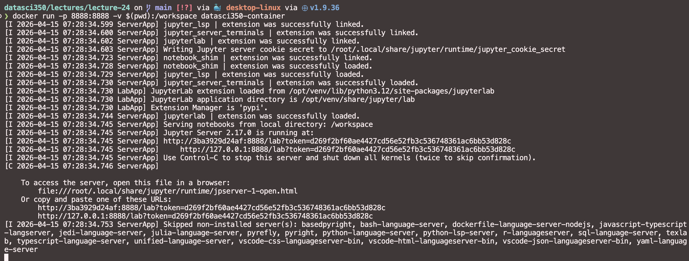

# Hello, everyone! 😊 {background-color="#2d4563"}

# Brief recap of last class 📚 {background-color="#2d4563"}

## Reproducible workflows, virtual environments, and containers

:::{style="margin-top: 30px; font-size: 24px;"}
:::{.columns}
:::{.column width="50%"}
- [Reproducibility]{.alert}: recreating the results of a computational analysis
  - There is a [reproducibility crisis](https://www.nature.com/articles/533452a) in science
- [Dependency management]{.alert}: specifying and installing the software a project needs
- [Virtual environments]{.alert}: isolated Python setups that don't affect the system installation
  - Popular tools: `conda` and `uv`
- [Containers]{.alert}: standalone packages with everything needed to run an application
  - [Docker](https://www.docker.com/) is the most widely used container platform
:::

:::{.column width="50%"}
:::{style="text-align: center; margin-top: -30px;"}
[{width="60%"}](#){data-modal-type="image" data-modal-url="figures/phd031214s.png"}
:::
:::
:::
:::

# Today's lecture 📋 {background-color="#2d4563"}

## Docker for Data Science

:::{style="margin-top: 30px; font-size: 24px;"}
:::{.columns}
:::{.column width="50%"}
- Last time: wrote a [Dockerfile](https://docs.docker.com/engine/reference/builder/) with a [Python image](https://hub.docker.com/_/python), ran a container, and [pushed it to Docker Hub](https://hub.docker.com/r/danilofreire/datasci350-example)
- Today: build a container from scratch with [all course tools]{.alert}: `bash`, `git`, `Python`, `Jupyter`, `Quarto`, and `SQL`
- Dockerfile instructions: `FROM`, `LABEL`, `RUN`, `SHELL`, `ENV`, `EXPOSE`, `CMD`
- Installing packages: `apt` (system), `pip` (Python), `wget` (Quarto)
- Debugging dependency errors, mounting volumes, and managing containers
- Deploying containers to AWS
- If time allows: Q&A about your projects (more time next class too)
:::

:::{.column width="50%"}
:::{style="text-align: center; margin-top: -30px;"}
[{width="100%"}](#){data-modal-type="image" data-modal-url="figures/1684079864237.png"}
[{width="100%"}](#){data-modal-type="image" data-modal-url="figures/https___thepracticaldev.s3.amazonaws.com_i_f4rmgjxdd6iurstqaai9.jpg"}
:::
:::
:::
:::

## Torvalds on vibe coding then...

:::{style="margin-top: 30px; font-size: 22px; text-align: center;"}
[{width="100%"}](#){data-modal-type="image" data-modal-url="figures/torvalds.png"}

<https://www.theregister.com/2025/11/18/linus_torvalds_vibe_coding/>
:::

## Torvalds on vibe coding now!

:::{style="margin-top: 30px; font-size: 22px; text-align: center;"}
[{width="80%"}](#){data-modal-type="image" data-modal-url="figures/linux-foundation.png"}

<https://x.com/linuxfoundation/status/2041583296044528122>
:::

# Docker for Data Science 🐳 {background-color="#2d4563"}

## A container for all tools we covered in this course

:::{style="margin-top: 30px; font-size: 30px;"}
- Today we will build a container with [all the tools we covered in this course (!)]{.alert} 🤓
- That includes `bash`, `git`, `Python`, `Quarto`, `SQL`, and `Jupyter` tools
- We will write a [Dockerfile](https://docs.docker.com/engine/reference/builder/) and run the container locally
- The base image is the [official Ubuntu image](https://hub.docker.com/_/ubuntu) (same as our AWS instance), and we will install all packages on top of it
- We will also explore [volume mounts](https://docs.docker.com/storage/volumes/) to persist data and how to manage dependencies inside the container
:::

## A container for all tools we covered in this course

:::{style="margin-top: 30px; font-size: 30px;"}
- There are many ready-made Docker images for data science: [Jupyter](https://hub.docker.com/r/jupyter/datascience-notebook), [RStudio](https://hub.docker.com/r/rocker/rstudio), [SQLite](https://hub.docker.com/r/alpine/sqlite)
- There are also several ways to build containers:
  - [Docker Compose](https://docs.docker.com/compose/): define multi-container apps in a single file
  - [VS Code Dev Containers](https://code.visualstudio.com/docs/remote/containers): integrate Docker with VS Code
  - [Kubernetes](https://kubernetes.io/): automate deployment, scaling, and management of containerised apps
- To keep things simple, we will use a single container today and run it with `docker run`
:::

# Let's get started! 🚀 {background-color="#2d4563"}

## Docker Desktop and Ubuntu

:::{style="margin-top: 30px; font-size: 24px;"}
:::{.columns}
:::{.column width="50%"}
- Make sure [Docker Desktop](https://www.docker.com/products/docker-desktop) is installed on your computer. It has everything you need to build, run, and share containers
- Windows users: you may need to enable [WSL](https://docs.microsoft.com/en-us/windows/wsl/install-win10) to run Linux containers. You should have done that already!
- We will use [Ubuntu 24.04 LTS](https://hub.docker.com/_/ubuntu) as the base image
- [Ubuntu](https://ubuntu.com/) is the most popular Linux distribution in data science, but you won't even feel you are using it, as it runs inside the container
:::

:::{.column width="50%"}
:::{style="text-align: center; margin-top: -30px;"}
[{width="100%"}](#){data-modal-type="image" data-modal-url="figures/ubuntu-logo.png"}
[{width="100%"}](#){data-modal-type="image" data-modal-url="figures/Ubuntu-2404.png"}
:::
:::
:::
:::

## Downloading Docker Desktop

:::{style="margin-top: 30px; font-size: 32px;"}
- Please download Docker Desktop for your operating system here: <https://www.docker.com/>
- There are versions for Windows, macOS, and Linux
- You can install it like any other application, just follow the instructions of the installer
- Docker now has a native Windows application, so it should work without any issues
- More information here: <https://docs.docker.com/desktop/setup/install/windows-install/>
:::

## Creating an account on Docker Hub

:::{style="margin-top: 30px; font-size: 26px;"}
:::{.columns}
:::{.column width="50%"}
- If you don't have a Docker Hub account yet, please create one here: <https://hub.docker.com/signup>
- Docker has several types of accounts, but the free account is enough for academic purposes
- You can use Docker Hub to store your images and share them with others
- If you click on `Sign in` on the Docker Desktop application or on the website, it will open a web browser and ask you to log in
- Please enter your credentials and log in
:::

:::{.column width="50%"}
:::{style="text-align: center; margin-top: -30px;"}
[{width="100%"}](#){data-modal-type="image" data-modal-url="figures/docker-signin.png"}
:::
:::
:::
:::

## Anatomy of a Dockerfile revisited
### `FROM image:tag`

:::{style="margin-top: 30px; font-size: 24px;"}
- A [Dockerfile](https://docs.docker.com/engine/reference/builder/) is a text file with all the commands needed to assemble an image; think of it as a recipe for building a container
- The base image is the starting point, and it can be any image on [Docker Hub](https://hub.docker.com/)
- Create a text file called `Dockerfile` (no extension) in your directory. Any editor will do! 😉
- You will need about 2 GB of free space to build the container
- We start the Dockerfile with `FROM`, followed by the base image

:::{style="margin-top: 20px;"}
:::
```Dockerfile
# Use the official Ubuntu image as the base image
FROM ubuntu:24.04
```
:::{style="margin-top: 20px;"}
:::

- The `:` specifies the image version. Here, we use Ubuntu 24.04
- All available tags: <https://hub.docker.com/_/ubuntu?tab=tags>
- That's the easy part. Now let's install everything we need! 🛠️
:::

## `LABEL` command

:::{style="margin-top: 30px; font-size: 24px;"}
- The `LABEL` instruction adds metadata to an image
- This is useful for documentation purposes and to provide information about the image
- You can add any key-value pairs you want, but it is a good practice to include the version, description, maintainer, and license
- You can also add a `MAINTAINER` instruction to specify the maintainer of the image
- For instance, you can add the following lines to your Dockerfile

:::{style="margin-top: 20px;"}
:::
```Dockerfile
# Metadata
LABEL version="1.0"
LABEL description="Container with the tools covered in DATASCI 350"
LABEL maintainer="Danilo Freire <danilo.freire@emory.edu>"
LABEL license="MIT"
```
:::{style="margin-top: 20px;"}
:::

- This will add the metadata to the image, and you can see it when you run the `docker inspect` command
:::
      
## `RUN` command

:::{style="margin-top: 30px; font-size: 26px;"}
- `RUN` executes commands in a [new layer](https://docs.docker.com/engine/reference/commandline/commit/) on top of the current image
  - Like a Git commit, but for the image instead of the file system
- We use `apt-get update` (once) then `apt-get install <package>` to add software, just like on AWS
  - Example: `apt-get update && apt-get install git -y`
- Useful flags:
  - `--no-install-recommends`: skip unnecessary packages
  - `-y`: auto-answer "yes" to prompts
- Clean up after installing to keep the image small:
  - `apt-get clean && rm -rf /var/lib/apt/lists/*`
- Let's add some packages to the Dockerfile 🐳
:::

## `RUN` command

:::{style="margin-top: 30px; font-size: 24px;"}
```Dockerfile
# Update and install dependencies
# Versions: https://packages.ubuntu.com/
RUN apt-get update && apt-get install -y --no-install-recommends\
    bash=5.2.21-2ubuntu4 \
    git=1:2.43.0-1ubuntu7.3 \
    sqlite3=3.45.1-1ubuntu2.5 \
    libsqlite3-0=3.45.1-1ubuntu2.5 \
    wget=1.21.4-1ubuntu4.1 \
    python3.12=3.12.3-1ubuntu0.12 \
    python3.12-venv=3.12.3-1ubuntu0.12 \
    python3-pip=24.0+dfsg-1ubuntu1.3 && \
    apt-get clean && rm -rf /var/lib/apt/lists/*
```

- So far, so good! 😎
- We are installing `bash`, `git`, `sqlite3`, `Python 3.12`, and `pip` in the container, similar to what we did on AWS
- We pin [specific versions]{.alert} of each package to ensure reproducibility
- Available versions: <https://packages.ubuntu.com/>
  - Match the OS version (`24.04 LTS` / `noble`) with the package version
:::

## Setting the default shell to `bash`

:::{style="margin-top: 30px; font-size: 30px;"}
- Docker uses `sh` by default, but we want `bash` instead
- `sh` (Bourne shell) is a simpler shell that doesn't support all the features of `bash`. [More here](https://en.wikipedia.org/wiki/Bourne_shell)

:::{style="margin-top: 20px;"}
:::
```Dockerfile
# Set the default shell to bash
SHELL ["/bin/bash", "-c"]
```
:::{style="margin-top: 20px;"}
:::

- `SHELL` sets `bash` as the default for all subsequent `RUN` commands
- `-c` stands for "command": it tells `bash` to read the next argument as a command string (e.g., `bash -c "echo hello"`)
- This way, we can use `bash` commands without specifying the shell every time
:::

## Hey Danilo, wait a minute...🤔
### Isn't that a lot of work?

:::{style="margin-top: 30px; font-size: 30px;"}
- [Yes, it is!]{.alert} 😅
- I am purposely making this harder than it needs to be!
- But starting from a bare-bones image (Ubuntu) and installing everything from scratch is the most flexible approach
- I (we?) don't have Ubuntu installed locally, so I can't just run `apt list --installed` and copy the packages to the Dockerfile
- It did involve some research to find the right package names and versions
- But once you have the Dockerfile, you can reuse it as many times as you want
:::

## Reusing the Dockerfile

:::{style="margin-top: 30px; font-size: 27px;"}
:::{.columns}
:::{.column width="50%"}
- You could save time by using a [Python image](https://hub.docker.com/_/python) as the base, which already comes with Python and `pip`
- My suggestion: if you are building a container for a specific purpose, [start with an image that is closer to what you need]{.alert}
- You can even download a [Jupyter image with a full data science stack in one line](https://jupyter-docker-stacks.readthedocs.io/en/latest/using/selecting.html)
- But it wouldn't be so fun, would it? 😅
:::

:::{.column width="50%"}
:::{style="text-align: center; margin-top: -30px;"}
[{width="100%"}](#){data-modal-type="image" data-modal-url="figures/python.png"}

<https://hub.docker.com/_/python>
:::
:::
:::
:::

## Back to the Dockerfile
### Installing Python packages with `pip`

:::{style="margin-top: 30px; font-size: 22px;"}
- We will use `RUN` to install Python libraries (`numpy`, `pandas`, `jupyterlab`, `dask`, `matplotlib`) with `pip3`
- You can check which versions you already have with `pip freeze > requirements.txt` and copy them
- Ubuntu requires a virtual environment to install Python packages, so we create one first
- `python3 -m venv /opt/venv` creates a virtual environment in `/opt/venv`
- `ENV PATH="/opt/venv/bin:$PATH"` prepends `/opt/venv/bin` to `PATH`, so we can use the virtual environment's Python and packages without specifying the full path

:::{style="margin-top: 20px;"}
:::
```Dockerfile
# Create and activate virtual environment
RUN python3 -m venv /opt/venv
ENV PATH="/opt/venv/bin:$PATH"

# Install Python libraries in virtual environment
RUN pip install httpx==0.27.2 numpy==1.26.4 pandas==2.2.2 \
                jupyterlab==4.2.5 ipykernel==6.29.5 \
                dask==2024.5.0 matplotlib==3.9.2
```
:::

## Installing Quarto with `wget`

:::{style="margin-top: 30px; font-size: 22px;"}
- [Quarto](https://quarto.org/) is not on `pip` or `apt`, so we download the binary directly with [`wget`](https://www.gnu.org/software/wget/)
- We download a `.deb` file, which is Ubuntu's package format
  - The `./` prefix tells `apt-get` to install the local file, not search the repositories
- After installation, we clean up to keep the image small:
  - `rm` deletes the downloaded `.deb` file
  - `apt-get clean` removes the package cache
  - `rm -rf /var/lib/apt/lists/*` removes the list of available packages
- We use the `arm64` version here (Apple Silicon Macs). Windows and Intel Mac users: replace `arm64` with `amd64` in the URL

:::{style="margin-top: 20px;"}
:::
```Dockerfile
# Download and install Quarto
# Install Quarto
RUN wget https://github.com/quarto-dev/quarto-cli/releases/download/v1.9.37/quarto-1.9.37-linux-arm64.deb && \
    apt-get install -y ./quarto-1.9.37-linux-arm64.deb && \
    rm ./quarto-1.9.37-linux-arm64.deb && \
    apt-get clean && \
    rm -rf /var/lib/apt/lists/*
```
:::

## Creating a working directory
### `WORKDIR` instruction

:::{style="margin-top: 30px; font-size: 28px;"}
- We need a place inside the container to store our notebooks and data files
- `mkdir -p` creates the directory (and any parent directories if needed)
- `WORKDIR` sets the default directory for all subsequent commands (`RUN`, `CMD`, `COPY`, etc.)
  - It also becomes the directory you land in when you open a terminal in the container

:::{style="margin-top: 20px;"}
:::
```Dockerfile
# Create a directory for saving files
RUN mkdir -p /workspace
WORKDIR /workspace
```
:::{style="margin-top: 20px;"}
:::

- Later, we will [mount a volume]{.alert} to `/workspace` so that files persist even after the container stops
:::

## We are almost there! 🏁
### `EXPOSE` and `CMD`

:::{style="margin-top: 30px; font-size: 24px;"}
- `EXPOSE 8888` tells Docker that the container listens on port `8888` (the default for JupyterLab)
  - This is [documentation]{.alert}, not enforcement: you still need `-p 8888:8888` when running the container
- `CMD` defines the command that runs when the container starts
  - Ours activates the virtual environment, then launches JupyterLab
  - `--ip=0.0.0.0`: listen on all network interfaces (not just `localhost`), so the host machine can reach it
  - `--no-browser`: don't try to open a browser inside the container (there isn't one!)
  - `--allow-root`: Docker containers run as `root` by default, and JupyterLab requires this flag to accept that
- JupyterLab includes a built-in terminal, so you can run `bash`, `git`, `sqlite3`, and `quarto` directly from the browser 😉
:::


## And here it is, the complete Dockerfile! 🎉

:::{style="margin-top: 20px; font-size: 22px;"}
```Dockerfile
# Base image
FROM ubuntu:24.04

# Metadata
LABEL version="1.0"
LABEL description="Container with the tools covered in DATASCI 350"
LABEL maintainer="Danilo Freire <danilo.freire@emory.edu>"
LABEL license="MIT"

# Update and install system dependencies
# We will see why we need to install libsqlite3-0 later
RUN apt-get update && apt-get install -y --no-install-recommends\
    bash=5.2.21-2ubuntu4 \
    git=1:2.43.0-1ubuntu7.3 \
    sqlite3=3.45.1-1ubuntu2.5 \
    libsqlite3-0=3.45.1-1ubuntu2.5 \
    wget=1.21.4-1ubuntu4.1 \
    nano=7.2-2ubuntu0.1 \
    python3.12=3.12.3-1ubuntu0.12 \
    python3.12-venv=3.12.3-1ubuntu0.12 \
    python3-pip=24.0+dfsg-1ubuntu1.3 && \
    apt-get clean && rm -rf /var/lib/apt/lists/*

# Set default shell to Bash
SHELL ["/bin/bash", "-c"]

# Create and activate virtual environment
RUN python3 -m venv /opt/venv
ENV PATH="/opt/venv/bin:$PATH"

# Install Python dependencies in virtual environment
RUN pip install httpx==0.27.2 numpy==1.26.4 pandas==2.2.2 \
                jupyterlab==4.2.5 ipykernel==6.29.5 \
                dask==2024.5.0 matplotlib==3.9.2

# Install Quarto and clean up
RUN wget https://github.com/quarto-dev/quarto-cli/releases/download/v1.9.37/quarto-1.9.37-linux-arm64.deb && \
    # Install the local deb file (notice the "./" prefix)
    apt-get install -y ./quarto-1.9.37-linux-arm64.deb && \
    rm quarto-1.9.37-linux-arm64.deb && \
    apt-get clean && \
    rm -rf /var/lib/apt/lists/*

# Create a directory for saving files
RUN mkdir -p /workspace
WORKDIR /workspace

# Expose port for JupyterLab 
EXPOSE 8888

# Start JupyterLab
CMD . /opt/venv/bin/activate && jupyter lab --ip=0.0.0.0 --port=8888 --no-browser --allow-root

```
:::

## Building the container

:::{style="margin-top: 30px; font-size: 22px;"}
- Now that we have the Dockerfile, we can build the container with the `docker build` command

:::{style="margin-top: 20px;"}
:::
```{verbatim}
docker build -t datasci350-container .
```
:::{style="margin-top: 20px;"}
:::

- The `-t` flag is used to tag the image with a name, in this case `datasci350-container`
- The `.` at the end of the command specifies the build context, which is the current directory
- Now we just need to wait for the image to be built and then run it with the `docker run` command
- Let's see how it goes! 🤞

:::{style="text-align: center;"}
[{width="100%"}](#){data-modal-type="image" data-modal-url="figures/docker01.png"}
:::
:::

## Oh, no! 😱

:::{style="margin-top: 30px; font-size: 22px;"}
- We got an error when building the container! 😕

:::{style="margin-top: 20px;"}
:::
```verbatim
[...]

4.585 Some packages could not be installed. This may mean that you have
4.585 requested an impossible situation or if you are using the unstable
4.585 distribution that some required packages have not yet been created
4.585 or been moved out of Incoming.
4.585 The following information may help to resolve the situation:
4.585 
4.585 The following packages have unmet dependencies:
4.650  sqlite3 : Depends: libsqlite3-0 (= 3.45.1-1ubuntu2) but 3.45.1-1ubuntu2.1 is to be installed
4.651 E: Unable to correct problems, you have held broken packages.
```
:::{style="margin-top: 20px;"}
:::

- The error message indicates that there are unmet dependencies for the `sqlite3` package!
:::

## Fixing the error 🔧

:::{style="margin-top: 30px; font-size: 22px;"}
- But that's fine, we know how to fix it! 😎
- We can resolve the unmet dependencies by [ensuring the correct versions of the packages are installed]{.alert} 
- So we go to <https://packages.ubuntu.com/>, search for `libsqlite3-0` and check the available versions
- We can see that the version `3.45.1-1ubuntu2` is available, so we can just add it to the `apt-get install` command
- Let's update the Dockerfile and try again

:::{style="margin-top: 20px;"}
:::
```Dockerfile
libsqlite3-0=3.45.1-1ubuntu2 \
```
:::{style="margin-top: 20px;"}
:::

- Now we can build the container again with the same command as before

:::{style="margin-top: 20px;"}
:::
```{verbatim}
docker build -t datasci350-container .
```
:::{style="margin-top: 20px;"}
:::

- This time it should work! 🤞
:::

## Success! 🎉

:::{style="margin-top: 30px; font-size: 22px; text-align: center;"}
[{width="100%"}](#){data-modal-type="image" data-modal-url="figures/docker02.png"}
:::

## Running the container

:::{style="margin-top: 30px; font-size: 26px;"}
- We use `docker run` with `-p` to map port `8888` (container) to port `8888` (host) and `-v` to mount a volume

:::{style="margin-top: 20px;"}
:::
```{verbatim}
docker run -p 8888:8888 -v $(pwd):/workspace datasci350-container
```
:::{style="margin-top: 20px;"}
:::

- `-v` mounts the current directory (`$(pwd)`) to `/workspace` in the container, so notebooks persist even after the container stops
- Open <http://127.0.0.1:8888> in a web browser to access JupyterLab 🚀
- Jupyter generates a token for access; copy it from the terminal or click the link
:::

## Running the container

:::{style="margin-top: 30px; font-size: 22px; text-align: center;"}
[{width="100%"}](#){data-modal-type="image" data-modal-url="figures/docker03.png"}
:::

## Accessing the JupyterLab interface

:::{style="margin-top: 30px; font-size: 22px; text-align: center;"}
[{width="80%"}](#){data-modal-type="image" data-modal-url="figures/docker04.png"}
:::

## How to manage the container

:::{style="margin-top: 30px; font-size: 26px;"}
- Press `Ctrl+C` in the terminal to stop the container, or use `docker ps` to list running containers and `docker stop <id>` to stop one
- Remove a container with `docker rm` and an image with `docker rmi`
- You can also manage containers from Docker Desktop (stop, remove, restart)
- To tag and push to Docker Hub, use `docker tag` and `docker push`

:::{style="margin-top: 20px;"}
:::  
```{verbatim}
docker tag datasci350-container danilofreire/datasci350-container
docker push danilofreire/datasci350-container
```
:::

## Cleaning up

:::{style="margin-top: 30px; font-size: 26px;"}
- `docker ps -a` lists all containers (running and stopped). `ps` = "process status"; `-a` includes stopped ones
- `docker stop <id>` stops a running container
- `docker rm <id>` removes a container; `docker rmi datasci350-container` removes the image
- `docker system prune` removes all stopped containers, unused networks, images, and build cache (`-a` removes all unused images too). [Warning]{.alert}: this is aggressive!

:::{style="margin-top: 20px;"}
:::
```{verbatim}
docker ps -a
docker stop <container_id_or_name>
docker rm <container_id_or_name>
docker rmi datasci350-container
# Optional: docker system prune -a
```
:::

## Running Docker containers on AWS

:::{style="margin-top: 30px; font-size: 30px;"}
- There are many ways to run Docker containers on AWS:
- You can use the [Amazon Elastic Container Service](https://aws.amazon.com/ecs/), which is a fully managed container orchestration service. More information here: <https://aws.amazon.com/ecs/getting-started/>
- [Amazon SageMaker](https://aws.amazon.com/sagemaker/), which allows you to develop your machine learning models. More information here: <https://docs.aws.amazon.com/sagemaker/latest/dg/docker-containers.html>
- [AWS Lambda](https://aws.amazon.com/lambda/). More information here: <https://docs.aws.amazon.com/lambda/latest/dg/images-create.html>
- And of course, you use an EC2 instance and install Docker on it, like we did a few weeks ago!
:::

## Running Docker containers on AWS
### An easy way to run our container on an EC2 instance

:::{style="margin-top: 30px; font-size: 22px;"}
```{verbatim}
# On your local machine: upload the Docker image to Docker Hub
docker tag datasci350-container danilofreire/datasci350-container
docker push danilofreire/datasci350-container

# On your EC2 instance: install Docker, start the Docker service, and add your user to the docker group
sudo apt update && \
    sudo apt install -y docker.io -y && \
    sudo systemctl start docker && \
    sudo usermod -aG docker $USER

# Pull the Docker image from Docker Hub
docker pull danilofreire/datasci350-container

# Run the Docker container
docker run -p 8888:8888 -v $(pwd):/workspace danilofreire/datasci350-container

# Access JupyterLab via web browser
http://<EC2_PUBLIC_IP>:8888/lab?token=<TOKEN>
```
:::

## Summary of the Dockerfile

:::{style="margin-top: 30px; font-size: 19px;"}
:::{.columns}
:::{.column width="50%"}
- We built a container with all the tools covered in this course: `bash`, `git`, `Python`, `Jupyter`, `Quarto`, and `SQLite`
- `FROM` set Ubuntu 24.04 as the base image
- `LABEL` added metadata (version, description, maintainer, licence)
- `RUN` + `apt-get` installed system packages with pinned versions
- `SHELL` switched the default shell from `sh` to `bash`
- `RUN` + `pip` installed Python libraries inside a virtual environment
- `ENV` prepended the virtual environment to `PATH`
- `wget` downloaded and installed Quarto from a `.deb` file
- `EXPOSE` opened port 8888 for JupyterLab
- `CMD` started the Jupyter notebook server
- We built with `docker build`, ran with `docker run -p -v`, and pushed to Docker Hub
- We also saw how to debug dependency errors, manage containers, and deploy to AWS
:::

:::{.column width="50%"}
:::{style="text-align: center;"}
[{width="100%"}](#){data-modal-type="image" data-modal-url="figures/0_CP98BIIBgMG2K3u5.png"}
[{width="100%"}](#){data-modal-type="image" data-modal-url="figures/layer4.JPG"}
:::
:::
:::
:::

# And that's it for today! 🎉 {background-color="#2d4563"}