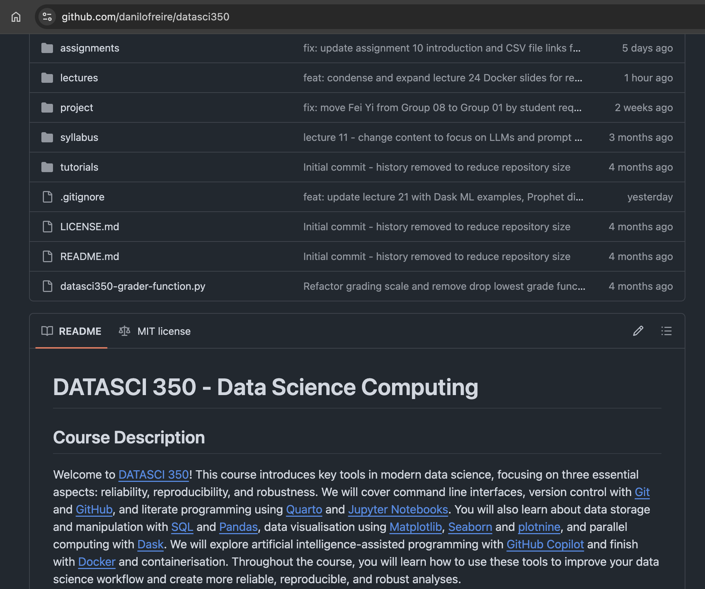
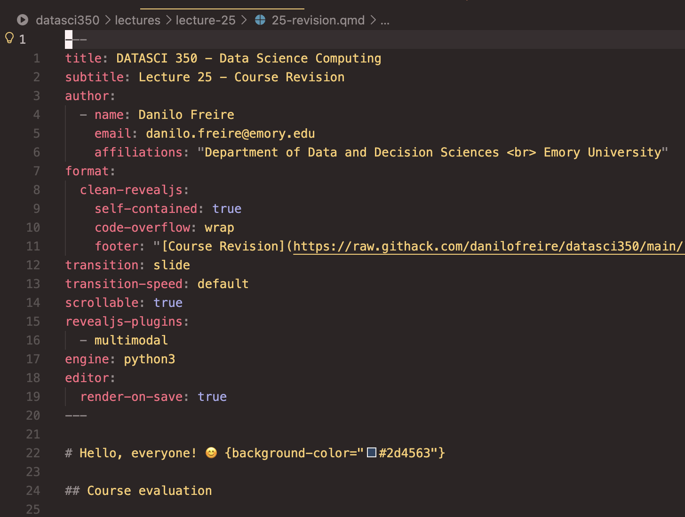

# Hello, everyone! 😊 {background-color="#2d4563"}

## Course evaluation

:::{style="margin-top: 30px; font-size: 34px;"}
- Please complete the course evaluation form!
- Your feedback helps improve the course
- Share what you liked too!
- Canvas → Account → Profile → Course Evaluations
- Thank you! 🙏
:::

## Course recap

:::{style="margin-top: 30px; font-size: 28px;"}
:::{.columns}
:::{.column width="50%"}
- We covered [a lot of content]{.alert} this term! 🤓
- Three key areas for data science:
    - [Reliability]{.alert}: consistent results every time you run your code
    - [Reproducibility]{.alert}: others (and your future self) can obtain the same results with your data and code
    - [Robustness]{.alert}: analyses that handle data variation and scale to larger problems
- Together, these support [more credible and collaborative science]{.alert} 🤓
:::

:::{.column width="50%"}
:::{style="text-align: center;"}
[{width="100%"}](#){data-modal-type="image" data-modal-url="figures/table-reproducibility.jpg"}

Source: [The Turing Way Community (2025)](https://book.the-turing-way.org/reproducible-research/overview/overview-definitions)
:::
:::
:::
:::

## Core tools overview

:::{style="margin-top: 30px; font-size: 27px;"}
:::{.columns}
:::{.column width="50%"}
* Tools and techniques we covered:
  * [Command Line (Bash)]{.alert}: system control, automation, remote servers, containers
  * [Git & GitHub]{.alert}: [version control]{.alert} to track changes, revert mistakes, and collaborate
  * [Quarto]{.alert}: [literate programming]{.alert}, combining text, code, and results in one document
  * [Cloud Computing (AWS)]{.alert}: on-demand servers, storage, and services for scalability
:::

:::{.column width="50%"}
  * [Pandas & SQL]{.alert}: [Pandas]{.alert} for data manipulation; [SQLite]{.alert} for databases
  * [AI Tools]{.alert}: programming assistants that generate, explain, and debug code
  * [Dask]{.alert}: [parallel and distributed computing]{.alert} beyond a single machine
  * [Docker]{.alert}: [containerisation]{.alert}, packaging apps and dependencies to run anywhere
:::
:::
:::

# Computational literacy 💻 {background-color="#2d4563"}

## From human computers to the silicon age

:::{style="margin-top: 30px; font-size: 26px;"}
:::{.columns}
:::{.column width="50%"}
* 'Computing' changed a lot over time
* Originally, 'computers' were people doing calculations, often with tools like the abacus
* Mechanical calculators followed (e.g., Leibniz's machine for basic arithmetic)
* The [transistor]{.alert}, [integrated circuits]{.alert}, and [microprocessors]{.alert} of the [silicon age]{.alert} gave us electronic computers
* Most modern computers use the [Von Neumann architecture]{.alert}: program instructions and data share the same memory, accessed by a CPU
:::

:::{.column width="50%"}
:::{style="text-align: center;"}
[{width="100%"}](#){data-modal-type="image" data-modal-url="figures/von-neumann-architecture.webp"}

Source: [Von Neumann architecture (Wikipedia)](https://en.wikipedia.org/wiki/Von_Neumann_architecture)
:::
:::
:::
:::

## Representing data: binary, hex, and decimal

:::{style="margin-top: 30px; font-size: 27px;"}
:::{.columns}
:::{.column width="50%"}
* Computers store all information in [binary]{.alert} (base 2): only 0s and 1s
* These map to the on/off states of transistors
* One binary digit = a [bit]{.alert}; eight bits = a [byte]{.alert}
* [Hexadecimal (base 16)]{.alert}: digits 0-9 and A-F, shorthand for binary. Each hex digit = four bits (e.g., `FF` = `11111111` = 255)
* Used for colours (`#FF0000`) and memory addresses
:::

:::{.column width="50%"}
:::{style="text-align: center;"}
[{width="100%"}](#){data-modal-type="image" data-modal-url="figures/hexadecimal.png"}

Conversion table
:::
:::
:::
:::

## Encoding information: text and images

:::{style="margin-top: 30px; font-size: 26px;"}
:::{.columns}
:::{.column width="50%"}
* Computers encode information so they can process it
* [Abstraction]{.alert}: mapping complex data types to numbers
* Digital images are grids of [pixels]{.alert}
* Each pixel's colour uses the [RGB model]{.alert}: Red, Green, Blue intensities (0-255)
* Text encoding assigns a number to each character:
    * [ASCII]{.alert}: early standard, enough for basic English but limited (7-8 bits)
    * [Unicode (UTF-8)]{.alert}: modern universal standard, supports nearly all characters (1-4 bytes)
:::

:::{.column width="50%"}
:::{style="text-align: center;"}
[{width="100%"}](#){data-modal-type="image" data-modal-url="figures/ascii-table.png"}

ASCII table
:::
:::
:::
:::

## Programming languages: low-level vs high-level ⌨️

:::{style="margin-top: 30px; font-size: 23px;"}
:::{.columns}
:::{.column width="55%"}
Languages bridge human instructions and machine execution:

* [Machine Code]{.alert}: raw binary the CPU runs directly
* [Assembly Language]{.alert}: [low-level]{.alert} mnemonics for machine instructions. CPU-specific, fine control, poor portability
* [High-Level Languages]{.alert} (Python, R, Java): human-readable syntax, abstracts hardware. More portable, but needs translation
* [Translation Methods]{.alert}:
    * [Compiled]{.alert} (e.g., C++): source translated to machine code *before* running; faster execution
    * [Interpreted]{.alert} (e.g., Python): code run line-by-line *at runtime* by an interpreter; easier development
:::

:::{.column width="45%"}
:::{style="text-align: center;"}
[{width="100%"}](#){data-modal-type="image" data-modal-url="figures/high-low-languages.png"}

High and low-level languages
:::
:::
:::
:::

# The command line 🖥️ {background-color="#2d4563"}

## Understanding the shell

:::{style="margin-top: 30px; font-size: 20px;"}
:::{.columns}
:::{.column width="50%"}
* The [Operating System (OS)]{.alert} sits between hardware and software
* Its core, the [Kernel]{.alert}, manages hardware access and resources
* Applications run in [User Space]{.alert}, separate from the kernel for stability
* A [Shell]{.alert} (Bash, Zsh) is a command-line interpreter for interacting with the OS
* You access the shell through a [Terminal]{.alert} application
  
:::{style="text-align: center;"}
[{width="70%"}](#){data-modal-type="image" data-modal-url="figures/bash.png"}
:::
:::

:::{.column width="50%"}
Core commands:

* `pwd`: Print Working Directory (shows current location)
* `ls`: List directory contents (`ls -l` for details, `ls -a` for hidden files)
* `cd <directory>`: Change Directory (`cd ..` up, `cd ~` home)
* `mkdir <name>`: Make Directory
* `touch <name>`: Create empty file / update timestamp
* `cp <source> <dest>`: Copy file/directory (`-r` for directories)
* `mv <source> <dest>`: Move or Rename file/directory
* `rm <file>`: Remove file ([permanently!]{.alert})
* `rmdir <empty_dir>`: Remove empty directory
* `rm -r <dir>`: Remove directory recursively ([DANGEROUS!]{.alert} No undo)
:::
:::
:::

## Working with text & finding files

:::{style="margin-top: 30px; font-size: 20px;"}
:::{.columns}
:::{.column width="50%"}
### Inspecting and searching text:

* `cat <file>`: display entire file
* `head <file>` / `tail <file>`: first/last lines (`-n #`)
* `wc <file>`: count lines, words, characters
* `grep <pattern> <file>`: search with regular expressions
    * `-i` (ignore case), `-r` (recursive), `-n` (line numbers), `-v` (invert)

### Finding files:

* `find <path> [options]`: search tool
    * `-name <pattern>`: by name (quote patterns with `*`)
    * `-iname <pattern>`: case-insensitive
    * `-type d` / `-type f`: directories / files
    * `-size +1M`: files larger than 1 MB
* [Wildcards]{.alert}: `*` (any characters), `?` (single character)
:::

:::{.column width="50%"}
:::{style="text-align: center;"}
[{width="100%"}](#){data-modal-type="image" data-modal-url="figures/grep.png"}

Source: [Julia Evans (2024)](https://wizardzines.com/comics/grep/)
:::
:::
:::
:::

## Pipes, redirects & scripting

:::{style="margin-top: 30px; font-size: 27px;"}
:::{.columns}
:::{.column width="55%"}
* [Redirection]{.alert}: control where output goes
    * `>`: write output to file ([overwrites]{.alert})
    * `>>`: append output to file
    * `<`: read input from file
* [Pipes `|`]{.alert}: chain commands; left output becomes right input (e.g., `ls -l | grep "Jan"`)
* [Shell Scripting]{.alert}: save commands in a `.sh` file for automation
    * Start with `#!/bin/bash` (shebang)
    * Make executable: `chmod +x script.sh`
    * Run: `./script.sh`
:::
:::{.column width="45%"}
:::{style="text-align: center;"}
[{width="100%"}](#){data-modal-type="image" data-modal-url="figures/shell-script.png"}

A simple script that moves `.png` files to the Desktop
:::
:::
:::
:::

# Git & GitHub 💾 {background-color="#2d4563"}

## Version control basics

:::{style="margin-top: 30px; font-size: 24px;"}
:::{.columns}
:::{.column width="50%"}
* [Problem]{.alert}: managing project changes manually is chaotic 😂
* [Solution]{.alert}: Version Control Systems (VCS) like [Git]{.alert} track every change
* [Benefits]{.alert}: revert to previous states, understand history, collaborate, keep backups
* [Core Workflow]{.alert}:
  - Edit files in the [Working Directory]{.alert}
  - Stage changes with `git add <file>` → [Staging Area]{.alert}
  - Save a snapshot with `git commit -m "message"` → [Repository]{.alert}
* Key commands: `git status`, `git add`, `git checkout`, `git commit`, `git diff`, `git log`, `git pull`, `git push`
:::

:::{.column width="50%"}
:::{style="text-align: center;"}
[{width="100%"}](#){data-modal-type="image" data-modal-url="figures/git-workflow.svg"}

Source: [Atlassian](https://www.atlassian.com/git/tutorials/comparing-workflows/gitflow-workflow)
:::
:::
:::
:::

## GitHub: collaboration platform 🤝

:::{style="margin-top: 30px; font-size: 25px;"}
:::{.columns}
:::{.column width="50%"}
* [GitHub]{.alert}: a central [remote repository]{.alert} (`origin`) for sharing code
* Key commands:
    * `git push`: upload local commits to the remote
    * `git commit`: record changes locally
    * `git pull`: download and merge remote changes
* [`.gitignore`]{.alert}: tells Git which files to skip

* Other GitHub features:
    * Pull Requests (code review)
    * Wikis
    * GitHub Actions (automation)
    * GitHub Pages (web hosting)
:::

:::{.column width="50%"}
:::{style="text-align: center;"}
[{width="100%"}](#){data-modal-type="image" data-modal-url="figures/github.png"}
:::
:::
:::
:::

## Branching & merging 🌿

:::{style="margin-top: 30px; font-size: 26px;"}
:::{.columns}
:::{.column width="50%"}
* Version control also means managing different lines of development
* [Branches]{.alert} allow independent work without affecting `main`
* [Workflow]{.alert}: create a branch (`git checkout -b feature-x`), commit, then merge back (`git checkout main`, `git merge feature-x`)
* [Merge Conflicts]{.alert}: happen when branches change the same lines. Git asks you to resolve them manually
* [Pull Requests (PRs)]{.alert}: GitHub's workflow for proposing merges with code review and discussion
:::

:::{.column width="50%"}
:::{style="text-align: center;"}
[{width="100%"}](#){data-modal-type="image" data-modal-url="figures/branches.webp"}

Read more: [Git Branching](https://git-scm.com/book/en/v2/Git-Branching-Branches-in-a-Nutshell)
:::
:::
:::
:::

# Quarto 📖 {background-color="#2d4563"}

## Literate programming & reproducibility 💡

:::{style="margin-top: 30px; font-size: 28px;"}
:::{.columns}
:::{.column width="50%"}
* [Reproducible research]{.alert}: others can consistently reproduce your results
* [Literate programming]{.alert} combines code, results, and narrative in one place
* [Quarto]{.alert}: modern, open-source system built on Pandoc
* Language-agnostic: supports Python, R, Julia, Observable
* One source file (`.qmd` or `.ipynb`) → HTML, PDF, Word, slides, websites, books
* More information: [Quarto website](https://quarto.org/)
:::

:::{.column width="50%"}
:::{style="text-align: center; margin-top: -30px;"}
[{width="100%"}](#){data-modal-type="image" data-modal-url="figures/quarto.png"}
:::
:::
:::
:::

## Quarto documents

:::{style="margin-top: 30px; font-size: 27px;"}
:::{.columns}
:::{.column width="60%"}
### Structure

A typical Quarto (`.qmd`) document includes:

* [YAML Header]{.alert}: between `---` marks; sets metadata (title, author, date) and output format
* [Markdown Content]{.alert}: narrative text with headings, lists, links, maths (`$...$`, `$$...$$`)
* [Code Chunks]{.alert}: executable blocks (e.g., ````{python}`) with `#|` options for execution, visibility, figures, etc.
* Render with: `quarto render mydoc.qmd`
:::

:::{.column width="40%"}
### Advanced features

You can also use Quarto for:

* Citations (`[@citekey]`, needs `.bib`)
* Cross-references (`@fig-label`)
* Callouts, Tabsets
* Interactive components
* Websites, Books, Presentations
:::
:::
:::

# AI-assisted programming 🤖 {background-color="#2d4563"}

## LLMs & code generation

:::{style="margin-top: 30px; font-size: 25px;"}
:::{.columns}
:::{.column width="50%"}
* [LLMs (Large Language Models)]{.alert} like GPT-4 and Claude: trained on vast text/code data to generate code, explain concepts, translate languages
* [AI-Assisted Programming]{.alert}: using LLMs as coding companions (GitHub Copilot, ChatGPT)
* [Benefits]{.alert}: faster development, less repetitive coding, help with debugging and learning
* [Risks]{.alert}: [hallucinations]{.alert} (incorrect/insecure code), training data biases, IP concerns
* Good [prompt engineering]{.alert} matters: clear instructions, context, examples
* [Agents]{.alert}: LLMs that act autonomously (web browsing, API calls)
:::

:::{.column width="50%"}
:::{style="text-align: center;"}
[{width="100%"}](#){data-modal-type="image" data-modal-url="figures/llm.png"}

WebUI GitHub repository: <https://github.com/browser-use/web-ui>
:::
:::
:::
:::

# Cloud computing ☁️ {background-color="#2d4563"}

## What is cloud computing? 🤔

:::{style="margin-top: 30px; font-size: 24px;"}
:::{.columns}
:::{.column width="50%"}
* [IaaS (Infrastructure as a Service)]{.alert}: virtual machines ([EC2]{.alert}), networks. You manage the rest
* [PaaS (Platform as a Service)]{.alert}: develop and run apps without managing servers or OS
* [SaaS (Software as a Service)]{.alert}: complete applications delivered over the internet
* [FaaS (Function as a Service / Serverless)]{.alert}: run code on events, no server management (AWS Lambda, Google Cloud Functions)
:::

:::{.column width="50%"}
* [EC2 (Elastic Compute Cloud)]{.alert}: scalable virtual servers ([instances]{.alert})
    * Pick an [AMI (Amazon Machine Image)]{.alert} to launch
    * [Instance types]{.alert}: different CPU, RAM, storage configs
    * Choose OS, instance type, storage ([EBS]{.alert}). Connect via [SSH]{.alert}
* [S3 (Simple Storage Service)]{.alert}: scalable [object storage]{.alert} in [buckets]{.alert}
* [RDS (Relational Database Service)]{.alert}: managed relational databases (PostgreSQL, MySQL, etc.)
* [SageMaker]{.alert}: build, train, and deploy ML models
* [Cost Management]{.alert}: set up [billing alarms]{.alert}!
:::
:::
:::

## Interacting with EC2 instances

:::{style="margin-top: 30px; font-size: 26px;"}
* [Launching]{.alert}: in the AWS Console, pick AMI, instance type, storage, security groups, and an [SSH key pair]{.alert} (`.pem` file)
* [Connecting (SSH)]{.alert}: use `ssh` with your `.pem` key (set `chmod 400 key.pem` first)
    * `ssh -i key.pem ubuntu@<public-ip-or-dns>`
* [Managing Software (Ubuntu)]{.alert}: `apt` package manager
    * `sudo apt update` → refresh package lists
    * `sudo apt upgrade` → install updates
    * `sudo apt install <package-name>` → install software
* [Transferring Files (`scp`)]{.alert}: copy files to/from EC2
    * `scp -i key.pem local_file ubuntu@ip:/remote/path` (local → remote)
    * `scp -i key.pem ubuntu@ip:/remote/file ./local/path` (remote → local)
* [Stopping/Terminating]{.alert}: Stop = pause (still pay for storage); Terminate = delete permanently. [Manage costs!]{.alert}
:::

# Python and SQL for data science 🐍 🗄️{background-color="#2d4563"}

## Data wrangling with Pandas

:::{style="margin-top: 30px; font-size: 25px;"}
:::{.columns}
:::{.column width="50%"}
* [Pandas]{.alert}: Python's main data manipulation library. Core objects: `DataFrame` (2D table) and `Series` (1D array)
* Works best with [tidy data]{.alert}: variables as columns, observations as rows
* [Reshaping]{.alert}:
    * `melt()`: wide → long
    * `pivot()`/`pivot_table()`: long → wide (with optional aggregation)
* [Combining]{.alert}:
    * `pd.concat()`: stack DataFrames row/column-wise
    * `pd.merge()`: database-style joins (`inner`, `left`, `right`, `outer`)
:::
:::{.column width="50%"}
* [Grouping]{.alert}: `df.groupby('column')` for group-wise operations
* [Aggregation]{.alert}: summary functions (`mean`, `sum`, `count`, `std`, `min`, `max`, custom) via `.agg()`
* [Applying Functions]{.alert}: `.apply()` (row/column), `.applymap()` (element-wise DF), `.map()` (element-wise Series)
* [Missing Data ([NaN]{.alert})]{.alert}:
    * Detect: `isnull()`, `notnull()`, `info()`
    * Remove: `dropna()`
    * Impute: `fillna()` (value, mean, median, `method='ffill'`, etc.)
:::
:::
:::

## Relational databases & SQL

:::{style="margin-top: 30px; font-size: 24px;"}
:::{.columns}
:::{.column width="50%"}
* [Relational Databases]{.alert}: structured tables with defined relationships (PostgreSQL, MySQL, SQLite)
* [SQL]{.alert}: standard language for querying and managing these databases
* [SQLite]{.alert}: file-based, serverless database engine
* [Keys]{.alert}:
    * [Primary Key (PK)]{.alert}: uniquely identifies each row
    * [Foreign Key (FK)]{.alert}: references a PK in another table, creating links
:::

:::{.column width="50%"}
Core commands:

* `CREATE TABLE`: Define table schema (columns, data types like `INTEGER`, `TEXT`, `REAL`)
* `INSERT INTO`: Add new rows
* `SELECT`: Retrieve data (`SELECT cols FROM table WHERE condition ORDER BY col`)
* `UPDATE`: Modify existing rows (`UPDATE table SET col = val WHERE condition`)
* `DELETE FROM`: Remove rows (`DELETE FROM table WHERE condition`)
* `ALTER TABLE`: Modify table structure
* `DROP TABLE`: Delete a table
:::
:::
:::

## Advanced SQL

:::{style="margin-top: 30px; font-size: 23px;"}
:::{.columns}
:::{.column width="50%"}
Going beyond basic queries:

* [Filtering (`WHERE`)]{.alert}: operators (`=`, `>`, `LIKE`, `IN`, `BETWEEN`, `IS NULL`) + logic (`AND`, `OR`)
* [Aggregation (`GROUP BY`)]{.alert}: group rows, apply functions (`COUNT`, `SUM`, `AVG`); filter with `HAVING`
* [Joins]{.alert}: combine tables (`INNER JOIN`, `LEFT JOIN`) on related columns
* [Subqueries]{.alert}: nested `SELECT` statements
* [Window Functions]{.alert}: calculations across related rows (`RANK() OVER (...)`, `AVG(...) OVER (PARTITION BY ...)`), keeping individual rows
* [String Functions]{.alert}: `SUBSTR`, `LENGTH`, `REPLACE`, `||` (concatenation)
* [Conditional Logic]{.alert}: `CASE WHEN condition THEN result ... ELSE default END`
:::

:::{.column width="50%"}
* Python's [`sqlite3`]{.alert} module: connect, cursor, execute, commit, fetch, close
* [Pandas]{.alert} makes it simpler:
    * `pd.read_sql(query, conn)`: query → DataFrame
    * `df.to_sql('table', conn, ...)`: DataFrame → database table

:::{style="text-align: center;"}
[{width="70%"}](#){data-modal-type="image" data-modal-url="figures/sql-table.webp"}
:::
:::
:::
:::

# Parallel computing ⚡ {background-color="#2d4563"}

## Serial vs parallel

:::{style="margin-top: 30px; font-size: 21px;"}
:::{.columns}
:::{.column width="50%"}
* [Serial]{.alert}: tasks run one after another; slow for large workloads
* [Parallel]{.alert}: tasks run concurrently on multiple cores/machines
* Best for "[embarrassingly parallel]{.alert}" problems (independent computations)
* [Python Libraries]{.alert}:
    * [`joblib`]{.alert}: simple single-machine parallelism (`Parallel`, `delayed`)
    * [`dask`]{.alert}: scalable parallel/distributed computing

### Dask:

* [Dask Array]{.alert}: parallel NumPy arrays
* [Dask DataFrame]{.alert}: parallel Pandas DataFrames
* [Dask Delayed]{.alert}: parallelise custom functions
* [Dask Distributed]{.alert}: cluster management (multi-process/multi-machine)
:::

:::{.column width="50%"}
:::{style="text-align: center; margin-top: -30px;"}
[{width="100%"}](#){data-modal-type="image" data-modal-url="figures/distributed.png"}
[{width="80%"}](#){data-modal-type="image" data-modal-url="figures/dask-dashboard03.png"}
:::
:::
:::
:::

# Containers & Docker 🐳 {background-color="#2d4563"}

## Dependency management & reproducibility

:::{style="margin-top: 30px; font-size: 24px;"}
:::{.columns}
:::{.column width="50%"}
### Virtual environments

* [Challenge]{.alert}: "it works on my machine" problem, where code fails elsewhere because of different [dependencies]{.alert}
* [Solution]{.alert}: explicitly manage dependencies for [reproducibility]{.alert}
* [Virtual Environments]{.alert} (`venv`, `conda`): isolate project packages, prevent conflicts
  * Define with `requirements.txt` (pip) or `environment.yml` (conda)
* [Limitation]{.alert}: virtual environments only isolate Python packages, not system libraries
:::

:::{.column width="50%"}
### Containers

* [Containers]{.alert}: package an app with *all* its dependencies (system libs, tools, code, runtime) in one portable unit
* Runs the same way on any machine with [Docker]{.alert}
* [Docker Concepts]{.alert}:
    * [Image]{.alert}: immutable template built from a [Dockerfile]{.alert}
    * [Container]{.alert}: running instance of an image
    * [Dockerfile]{.alert}: instructions (`FROM`, `RUN`, `COPY`, etc.) to build the image
    * [Registry]{.alert} (e.g., Docker Hub): stores and shares images
:::
:::
:::

## Using Docker

:::{style="margin-top: 30px; font-size: 25px;"}
:::{.columns}
:::{.column width="55%"}
Basic workflow:

* [Write Dockerfile]{.alert}: define base OS, packages, code, run command
* [Build Image]{.alert}: `docker build -t myimage:latest .`
* [Run Container]{.alert}: `docker run -p 8888:8888 -v $(pwd):/app myimage:latest`
    * `-p`: port mapping (host:container)
    * `-v`: volume mount (host:container) for persistent data
    * `-it`: interactive terminal
* [Share]{.alert}: `docker push` / `docker pull` (via Docker Hub or other registry)
:::
:::{.column width="45%"}
:::{style="text-align: center; font-size: 21px; margin-top: 50px;"}
```verbatim
FROM ubuntu:24.04

RUN apt-get update && \
    apt-get install -y python3 python3-pip && \
    apt-get clean && \
    rm -rf /var/lib/apt/lists/*

RUN python3 --version
RUN pip3 --version

CMD ["python3"]

COPY . /app
WORKDIR /app
RUN pip3 install -r requirements.txt
CMD ["python3", "your_script.py"]
```

Example Dockerfile
:::
:::
:::
:::

# Conclusion 🎓 {background-color="#2d4563"}

## What we learnt

:::{style="margin-top: 30px; font-size: 28px;"}
:::{.columns}
:::{.column width="50%"}
* [Computational literacy]{.alert}, [reproducibility]{.alert}, and solid data science practices
* [Command line]{.alert}, version control ([Git & GitHub]{.alert}), reproducible reports ([Quarto]{.alert})
* Data manipulation with [Python/Pandas]{.alert} and database queries with [SQL]{.alert}
* [AI-assisted programming]{.alert}, [parallel computing]{.alert} (Dask), and [containers]{.alert} (Docker)
:::

:::{.column width="50%"}
:::{style="text-align: center; margin-top: -50px;"}
[{width="100%"}](#){data-modal-type="image" data-modal-url="figures/meme-programming.png"}
:::
:::
:::
:::

# Questions? 🤔 {background-color="#2d4563"}

# Thank you very much! 🙏 {background-color="#2d4563"}
