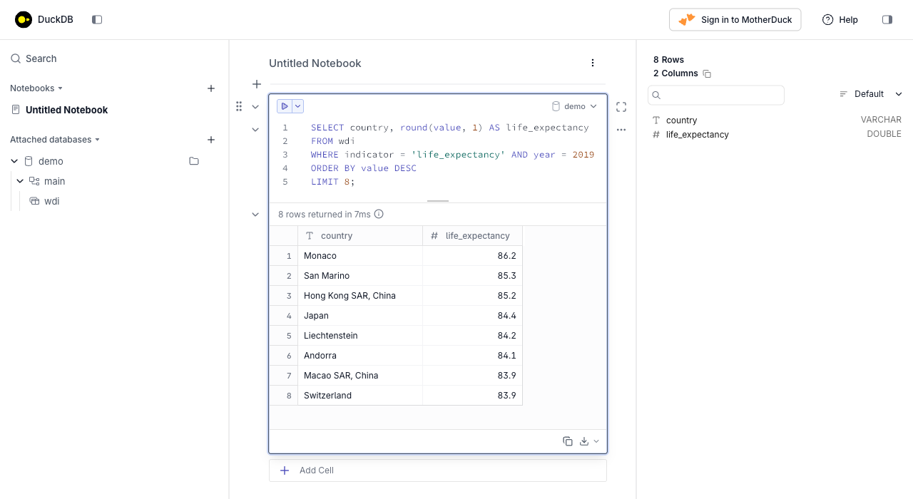

::: {.content-visible when-format="pdf"}
\newpage
:::

# Introduction

SQL is no longer taught in the lectures of DATASCI 350. Module 06 now covers getting data from the web, and DATASCI 151 already introduces the basics of SQL. This self-study tutorial keeps the SQL material available for you. Read it if you want to add a widely used skill to your toolkit, or if you meet SQL in a job and want a reference written for this course.

The tutorial is self-contained. You will install one Python package, run every query yourself, and finish able to read and write the SQL you are most likely to see in a data science role. All the code here executes when the document is rendered, so every output you read below is real.

We use [DuckDB](https://duckdb.org/) as the engine. If you followed the old lectures, you saw SQLite instead. DuckDB is a better fit for data science, and the reasons are worth a short section of their own.

# Why learn SQL, and why DuckDB

SQL (Structured Query Language) is the common language of databases. You write a description of the data you want, and the database engine works out how to fetch it. The same language, with small dialect differences, drives SQLite on your laptop, PostgreSQL on a server, and BigQuery in the cloud. Learn it once and you can query almost any tabular data store you meet.

Two features make it worth your time. First, SQL is declarative: you say *what* you want, not *how* to compute it, so a short query can replace a long loop. Second, SQL is everywhere in data work. Analyst and data-scientist job adverts list it more often than any single Python library.

[DuckDB](https://duckdb.org/) is an SQL engine built for analytics. Three properties make it the right choice for this course:

- **Zero setup.** DuckDB is a single Python package. There is no server to start and no account to create. You run `pip install duckdb` and you have a working database.
- **It reads files directly.** DuckDB can query a CSV or Parquet file in place, with no import step. You point a query at a file and it returns rows.
- **It lives inside Python.** DuckDB runs in the same process as your Python code. It reads pandas and Polars DataFrames by name, and it returns results as DataFrames. SQL and Python stop being separate worlds.

You met DuckDB once already. Lecture 22 uses it, alongside Polars, as a tool for processing data at scale. This tutorial fills in the SQL underneath that lecture.

# Setup

You install DuckDB the same way you install any Python package. The instructions below assume you have a working Python environment from earlier in the course.

Install the package first.

```bash
pip install duckdb
```

The tutorial also uses pandas and Polars in the final section. Install them too if they are missing.

```bash
pip install pandas polars pyarrow
```

Now verify the installation. Open Python. Run the two lines below. The version number appears.

```{python}
#| echo: true
#| eval: true
import duckdb
print(duckdb.__version__)
```

```{python}
#| echo: false
#| eval: true
# Display query results as plain text tables, which keep the PDF tidy.
import pandas as pd
pd.set_option("display.notebook_repr_html", False)
pd.set_option("display.max_columns", None)
pd.set_option("display.width", 100)
```

You now have a working SQL engine. No server runs in the background. The engine is a library that your Python process loads.

## Optional: the DuckDB command-line tool

You can also use DuckDB outside Python, in a terminal. The command-line tool is a separate download. It is optional for this tutorial, so skip this section if you only want the Python interface.

To install the command-line tool, visit the [DuckDB installation page](https://duckdb.org/docs/installation/). Follow the instructions for your operating system. To start it, type `duckdb` in a terminal. To leave it, type `.quit`.

The tool also has a browser interface. Start it with `duckdb -ui`. A local page opens where you can type SQL in a notebook cell and read the result as a table, as in the figure below. Everything in this tutorial works the same way, whether you type it in Python or in the command-line tool.

{width=95%}

# Connecting to a database

A DuckDB database is either a file on disk or a temporary space in memory. You choose when you connect.

An **in-memory** database exists only while your program runs. It is fast and leaves nothing behind, which is ideal for learning and for one-off analysis. Connect with no argument.

```{python}
#| echo: true
#| eval: true
con = duckdb.connect()
```

A **file-backed** database saves your tables to disk, so they survive after the program ends. Pass a filename to keep your work.

```python
con = duckdb.connect("course.duckdb")
```

The only difference is the argument. Everything else in this tutorial works the same either way. We use an in-memory connection so the tutorial leaves no files behind.

You run a query with `con.sql()`. The result is a DuckDB *relation*. Add `.df()` to turn it into a pandas DataFrame, which prints as a familiar table.

```{python}
#| echo: true
#| eval: true
con.sql("SELECT 'Hello, DuckDB' AS greeting, 2 + 2 AS sum").df()
```

We use `.df()` throughout so every result prints clearly. The last section shows the other ways to collect a result.

# Databases and tables

A relational database stores data in **tables**. A table is a grid of rows and columns, like a single spreadsheet. Each column has a fixed **data type**, so a column of whole numbers cannot suddenly hold text. Each row is one record.

Two ideas connect tables to each other:

- A **primary key** is a column whose value is unique for every row. It identifies a record without ambiguity. A `driver_id` that is different for every driver is a primary key.
- A **foreign key** is a column in one table that points at the primary key of another. It is how a row in an `orders` table says which `customer` placed the order. Foreign keys are how relational databases avoid repeating the same information in many places.

DuckDB's core data types are few and predictable:

- `INTEGER` holds whole numbers.
- `DOUBLE` holds decimal numbers.
- `VARCHAR` holds text of any length.
- `BOOLEAN` holds true or false.
- `DATE` and `TIMESTAMP` hold calendar dates and times.
- `NULL` is not a type but a marker for a missing value. Any column can hold it.

## Creating a table

You create a table with `CREATE TABLE`. You list each column and its type. Marking a column `PRIMARY KEY` tells DuckDB the values must be unique and present.

We build a small table of Formula 1 drivers, small enough to check by eye.

```{python}
#| echo: true
#| eval: true
#| output: false
con.execute("""
CREATE TABLE drivers (
    driver_id   INTEGER PRIMARY KEY,
    driver_name VARCHAR,
    team        VARCHAR,
    nationality VARCHAR,
    victories   INTEGER
);
""")
```

Notice two conventions. SQL keywords are written in capitals, which separates them from your own column names. Each statement ends with a semicolon, which marks where one command stops and the next begins.

## Inserting rows

You add rows with `INSERT INTO`. List the values for each row in the same order as the columns. Python's `None` becomes SQL's `NULL`, which is how we record that we do not know a driver's nationality or win count.

```{python}
#| echo: true
#| eval: true
con.execute("""
INSERT INTO drivers VALUES
 (1, 'Lewis Hamilton',  'Mercedes',        'British',    103),
 (2, 'Max Verstappen',  'Red Bull Racing', 'Dutch',       55),
 (3, 'Fernando Alonso', 'Aston Martin',     NULL,        NULL),
 (4, 'Charles Leclerc', 'Ferrari',         'Monégasque', NULL),
 (5, 'Valtteri Bottas', 'Mercedes',        'Finnish',     10),
 (6, 'Sergio Pérez',    'Red Bull Racing', 'Mexican',      5),
 (7, 'Lando Norris',    'McLaren',         'British',      4),
 (8, 'Esteban Ocon',    'Alpine',          'French',       1);
""")
con.sql("SELECT * FROM drivers").df()
```

The `SELECT * FROM drivers` at the end reads every column (`*`) and every row back. `SELECT` is the command you will use most. It extracts data without changing it.

## Changing a table

Real tables change over time. A few commands cover most needs. Read the warning before you use `DROP TABLE`.

- Add a column: `ALTER TABLE drivers ADD COLUMN points INTEGER;`
- Remove a column: `ALTER TABLE drivers DROP COLUMN points;`
- Delete rows that match a condition: `DELETE FROM drivers WHERE victories = 0;`

**Warning: `DROP TABLE` deletes the table and all its data at once. The action cannot be undone.** Use it only when you are certain.

- Delete a whole table: `DROP TABLE drivers;`

We keep the `drivers` table, so we do not run those here.

# Querying files directly

This is where DuckDB pulls ahead of a traditional database. You do not have to load a file into a table before you query it. You point a query straight at the file.

We use the course's World Bank data throughout the rest of the tutorial. It is the same dataset the final project pulls from the World Bank API, so the queries you practise here transfer directly.

The file `data/wdi_panel.parquet` ships with the tutorial. Copy it next to your own script first.

Copy the file `wdi_panel.parquet` into a folder named `data` beside your script. Confirm the path `data/wdi_panel.parquet` exists.

The data is in **long** format. Each row is one country, one indicator, and one year. Read five rows to see the shape.

```{python}
#| echo: true
#| eval: true
con.sql("SELECT * FROM 'data/wdi_panel.parquet' LIMIT 5").df()
```

The quoted filename stands in for a table name. DuckDB opens the Parquet file, reads it, and treats it as a table for the length of the query.

Two commands describe a dataset before you query it. `DESCRIBE` lists the columns and their types.

```{python}
#| echo: true
#| eval: true
con.sql("DESCRIBE SELECT * FROM 'data/wdi_panel.parquet'").df()
```

`SUMMARIZE` goes further. It reports counts, ranges, and the share of missing values per column, which is a fast way to learn a new dataset.

```{python}
#| echo: true
#| eval: true
con.sql("""
SELECT column_name, min, max, count, null_percentage
FROM (SUMMARIZE SELECT country, indicator, year, value
      FROM 'data/wdi_panel.parquet')
""").df()
```

Typing the filename in every query is tedious. Register the file once as a **view**, a saved query that behaves like a table. From here on we write `FROM wdi`.

```{python}
#| echo: true
#| eval: true
con.execute("""
CREATE VIEW wdi AS
SELECT * FROM 'data/wdi_panel.parquet';
""")
con.sql("SELECT COUNT(*) AS rows, COUNT(DISTINCT country) AS countries FROM wdi").df()
```

Which indicators does the dataset contain? A quick query answers it.

```{python}
#| echo: true
#| eval: true
con.sql("SELECT DISTINCT indicator FROM wdi ORDER BY indicator").df()
```

# Core queries

Every SQL query is built from a few clauses in a fixed order. You select columns, filter rows, group them, and sort the result. This section covers each clause on both the small `drivers` table and the real World Bank data.

## Selecting columns and filtering rows

`SELECT` chooses columns. `WHERE` keeps only the rows that meet a condition.

```{python}
#| echo: true
#| eval: true
con.sql("""
SELECT driver_name, team, victories
FROM drivers
WHERE victories > 10
""").df()
```

Combine conditions with `AND` and `OR`. Parentheses make the logic explicit.

```{python}
#| echo: true
#| eval: true
con.sql("""
SELECT driver_name, nationality, victories
FROM drivers
WHERE (nationality = 'British') AND (victories > 5)
""").df()
```

On the World Bank data, the same clauses pull one indicator for one year. `ORDER BY` sorts the result, and `DESC` sorts from high to low. `LIMIT` keeps only the first rows.

```{python}
#| echo: true
#| eval: true
con.sql("""
SELECT country, ROUND(value, 0) AS gdp_per_capita
FROM wdi
WHERE indicator = 'gdp_per_capita' AND year = 2020
ORDER BY value DESC
LIMIT 8
""").df()
```

## Matching lists, ranges, and patterns

Three operators make `WHERE` conditions shorter and clearer.

`IN` checks whether a value is in a list. `NOT IN` excludes the list.

```{python}
#| echo: true
#| eval: true
con.sql("""
SELECT driver_name, team
FROM drivers
WHERE team IN ('Ferrari', 'Mercedes')
""").df()
```

`BETWEEN` checks a range, and it includes both endpoints.

```{python}
#| echo: true
#| eval: true
con.sql("""
SELECT country, year, ROUND(value, 1) AS life_expectancy
FROM wdi
WHERE indicator = 'life_expectancy'
  AND country = 'Japan'
  AND year BETWEEN 2010 AND 2015
ORDER BY year
""").df()
```

`LIKE` matches text patterns. The `%` sign matches any run of characters, and `_` matches exactly one character.

```{python}
#| echo: true
#| eval: true
con.sql("""
SELECT DISTINCT country
FROM wdi
WHERE country LIKE 'United%'
""").df()
```

SQLite needed a `COLLATE NOCASE` trick to ignore case. DuckDB gives you `ILIKE`, which matches the same pattern while ignoring upper and lower case.

```{python}
#| echo: true
#| eval: true
con.sql("SELECT driver_name FROM drivers WHERE driver_name ILIKE 'l%'").df()
```

## Aggregating

Aggregate functions reduce many rows to a single summary value. `COUNT`, `SUM`, `AVG`, `MIN`, and `MAX` are the common ones. `AS` names the result column, and `ROUND` controls decimal places.

```{python}
#| echo: true
#| eval: true
con.sql("""
SELECT
    COUNT(*)              AS num_drivers,
    SUM(victories)        AS total_wins,
    ROUND(AVG(victories), 1) AS mean_wins,
    MAX(victories)        AS most_wins
FROM drivers
""").df()
```

`AVG` and the other aggregates skip `NULL` values automatically. The mean above divides by the number of non-missing wins, not by all eight drivers.

## Grouping

`GROUP BY` splits rows into groups and computes an aggregate for each, returning one row per group. This is the workhorse of analysis. Here it gives the average value of each indicator for one year.

```{python}
#| echo: true
#| eval: true
con.sql("""
SELECT indicator,
       COUNT(*)              AS n,
       ROUND(AVG(value), 2)  AS mean_value
FROM wdi
WHERE year = 2020
GROUP BY indicator
ORDER BY indicator
""").df()
```

To filter groups after aggregating, use `HAVING`. The difference from `WHERE` matters: `WHERE` filters rows before grouping, and `HAVING` filters groups after. You cannot put an aggregate in `WHERE`, so `HAVING` is where a condition on a group total belongs.

```{python}
#| echo: true
#| eval: true
con.sql("""
SELECT team,
       COUNT(*)                 AS drivers,
       SUM(victories)           AS team_wins
FROM drivers
GROUP BY team
HAVING SUM(victories) > 10
ORDER BY team_wins DESC
""").df()
```

## Try it yourself

Write queries against the `wdi` view for each task.

1. List the ten countries with the highest life expectancy in 2019.
2. Count how many countries have an `internet_users_pct` value recorded for the year 2000.
3. For the year 2015, report the average `co2_per_capita` grouped by whether the country's name starts with a letter before 'N'. Use a `WHERE` filter of your choice to keep it simple.

The solutions are in @sec-solutions.

# NULLs, CASE, and window functions

Real data is missing values, needs conditional labels, and often asks a question that `GROUP BY` cannot answer on its own. Three tools handle these cases.

## Handling missing values

SQL marks a missing value as `NULL`. A `NULL` is not zero and not an empty string. It means "unknown". Test for it with `IS NULL` or `IS NOT NULL`, never with `=`.

The World Bank data has real gaps. Count them for one indicator.

```{python}
#| echo: true
#| eval: true
con.sql("""
SELECT
    COUNT(*)                                  AS total_rows,
    COUNT(value)                              AS rows_with_value,
    SUM(CASE WHEN value IS NULL THEN 1 ELSE 0 END) AS missing
FROM wdi
WHERE indicator = 'primary_enrolment_net' AND year = 2020
""").df()
```

`COALESCE` returns the first value in its list that is not `NULL`. Use it to supply a default in place of a gap.

```{python}
#| echo: true
#| eval: true
con.sql("""
SELECT driver_name, COALESCE(victories, 0) AS victories_filled
FROM drivers
ORDER BY driver_id
""").df()
```

Here every missing win count becomes 0, so Fernando Alonso and Charles Leclerc now read as zero rather than blank.

## Conditional logic with CASE

`CASE` is SQL's if-then-else. It reads each `WHEN` in order and returns the result of the first one that is true. The `ELSE` catches everything else. It is the natural way to turn a number into a label.

We classify countries by the World Bank's rough income bands, using GDP per capita in 2020.

```{python}
#| echo: true
#| eval: true
con.sql("""
SELECT country, ROUND(value, 0) AS gdp_per_capita,
    CASE
        WHEN value >= 13846 THEN 'High income'
        WHEN value >= 4466  THEN 'Upper middle'
        WHEN value >= 1136  THEN 'Lower middle'
        WHEN value IS NULL  THEN 'No data'
        ELSE 'Low income'
    END AS income_band
FROM wdi
WHERE indicator = 'gdp_per_capita' AND year = 2020
  AND country IN ('Norway', 'Brazil', 'India', 'Burundi', 'China')
ORDER BY value DESC NULLS LAST
""").df()
```

Order the `WHEN` clauses carefully. Because only the first true branch fires, a `NULL` check placed last would never run if an earlier branch matched. Put the most specific condition first.

## Window functions

`GROUP BY` collapses each group to one row. A **window function** keeps every row and adds a value computed across a related set of rows. That is exactly what you need to rank rows, or to compare each row against its group's average, without losing the detail.

The `OVER()` clause defines the window. An empty `OVER()` uses the whole result. `PARTITION BY` splits it into groups. `ORDER BY` inside `OVER()` sets the order for ranking.

We rank countries by GDP per capita within one year, and show each country's gap from the global average that year.

```{python}
#| echo: true
#| eval: true
con.sql("""
SELECT country,
       ROUND(value, 0) AS gdp_per_capita,
       RANK() OVER (ORDER BY value DESC) AS world_rank,
       ROUND(value - AVG(value) OVER (), 0) AS gap_from_mean
FROM wdi
WHERE indicator = 'gdp_per_capita' AND year = 2020
  AND value IS NOT NULL
ORDER BY world_rank
LIMIT 8
""").df()
```

Compare the two approaches directly on the small `drivers` table. `GROUP BY team` would give one average win count per team and drop the driver names. A window function with `PARTITION BY team` attaches that same team average to every driver while keeping each driver's row.

```{python}
#| echo: true
#| eval: true
con.sql("""
SELECT driver_name, team, victories,
       ROUND(AVG(victories) OVER (PARTITION BY team), 1) AS team_avg
FROM drivers
WHERE victories IS NOT NULL
ORDER BY team, victories DESC
""").df()
```

## Try it yourself

1. Use `RANK()` to rank countries by `life_expectancy` in 2019, highest first, and show the top five.
2. Use `CASE` to label each country's 2020 `internet_users_pct` as 'High' (60 or more), 'Medium' (30 to 59), 'Low' (below 30), or 'No data'. Show ten rows.

The solutions are in @sec-solutions.

# Combining tables

Analysis usually needs data from more than one table. A **join** matches rows from two tables on a shared column. We add a small `regions` table by hand, then join it to the World Bank data.

First, build a subset of one indicator as a real table, so the joins have a clear left side.

```{python}
#| echo: true
#| eval: true
con.execute("""
CREATE TABLE gdp2020 AS
SELECT country, iso3, ROUND(value, 0) AS gdp_per_capita
FROM wdi
WHERE indicator = 'gdp_per_capita' AND year = 2020
  AND iso3 IN ('USA','BRA','CHN','IND','DEU','FRA','ZAF','JPN');
""")
con.sql("SELECT * FROM gdp2020 ORDER BY iso3").df()
```

Now create a `regions` table. We give it a region for most of those countries, but leave Japan out on purpose, so the different joins produce visibly different results.

```{python}
#| echo: true
#| eval: true
con.execute("""
CREATE TABLE regions (
    iso3   VARCHAR PRIMARY KEY,
    region VARCHAR
);
INSERT INTO regions VALUES
 ('USA', 'North America'),
 ('BRA', 'Latin America'),
 ('CHN', 'East Asia'),
 ('IND', 'South Asia'),
 ('DEU', 'Europe'),
 ('FRA', 'Europe'),
 ('ZAF', 'Sub-Saharan Africa'),
 ('KOR', 'East Asia');
""")
con.sql("SELECT * FROM regions ORDER BY iso3").df()
```

Note the asymmetry. `gdp2020` has Japan (`JPN`), which is missing from `regions`. `regions` has South Korea (`KOR`), which is missing from `gdp2020`. Each join treats these unmatched rows differently.

## Inner join

An `INNER JOIN` keeps only rows that match in both tables. Japan and South Korea both drop out, because neither has a partner.

```{python}
#| echo: true
#| eval: true
con.sql("""
SELECT g.country, r.region, g.gdp_per_capita
FROM gdp2020 AS g
INNER JOIN regions AS r ON g.iso3 = r.iso3
ORDER BY g.country
""").df()
```

The `g` and `r` after the table names are **aliases**, short nicknames that save typing and make the `ON` condition readable.

## Left join

A `LEFT JOIN` keeps every row from the left table, matched or not. Where the right table has no match, its columns come back as `NULL`. Japan stays, with no region.

```{python}
#| echo: true
#| eval: true
con.sql("""
SELECT g.country, r.region, g.gdp_per_capita
FROM gdp2020 AS g
LEFT JOIN regions AS r ON g.iso3 = r.iso3
ORDER BY g.country
""").df()
```

The left join is the one you will reach for most, because it keeps the table you care about whole and adds detail where it exists.

## Right and full joins

SQLite could not write these joins directly. It needed a swapped `LEFT JOIN`, and a `UNION` of two joins for the full case. DuckDB supports both natively, so the query says what it means.

A `RIGHT JOIN` keeps every row from the right table. South Korea now stays, with no GDP value.

```{python}
#| echo: true
#| eval: true
con.sql("""
SELECT g.country, r.region, g.gdp_per_capita
FROM gdp2020 AS g
RIGHT JOIN regions AS r ON g.iso3 = r.iso3
ORDER BY r.region
""").df()
```

A `FULL OUTER JOIN` keeps every row from both tables. Japan and South Korea both appear, each with `NULL` on the side that lacks a match.

```{python}
#| echo: true
#| eval: true
con.sql("""
SELECT g.country, r.iso3, r.region, g.gdp_per_capita
FROM gdp2020 AS g
FULL OUTER JOIN regions AS r ON g.iso3 = r.iso3
ORDER BY r.region NULLS LAST
""").df()
```

## Cross and self joins

A `CROSS JOIN` pairs every row of one table with every row of the other. It has no `ON` condition. Use it to generate all combinations, such as every size with every colour.

```{python}
#| echo: true
#| eval: true
con.execute("""
CREATE TABLE colours (colour VARCHAR);
CREATE TABLE sizes (size VARCHAR);
INSERT INTO colours VALUES ('Black'), ('Red');
INSERT INTO sizes VALUES ('S'), ('M');
""")
con.sql("""
SELECT colour, size, colour || ' - ' || size AS variant
FROM colours
CROSS JOIN sizes
ORDER BY colour, size
""").df()
```

A **self join** joins a table to itself, which is how you follow a hierarchy stored in one table. A `family` table where `mother_id` points back to `person_id` is the classic example.

```{python}
#| echo: true
#| eval: true
con.execute("""
CREATE TABLE family (
    person_id INTEGER PRIMARY KEY,
    name      VARCHAR,
    mother_id INTEGER
);
INSERT INTO family VALUES
 (1, 'Emma',  NULL),
 (2, 'Sarah', 1),
 (3, 'Lisa',  1),
 (4, 'Tom',   2),
 (5, 'Alice', 2);
""")
con.sql("""
SELECT child.name AS child, mother.name AS mother
FROM family AS child
JOIN family AS mother ON child.mother_id = mother.person_id
ORDER BY mother.name
""").df()
```

The two aliases `child` and `mother` are two views of the same table. The join matches each child's `mother_id` to a mother's `person_id`.

## Combining rows: UNION, INTERSECT, EXCEPT

Joins add columns side by side. Set operators stack results on top of each other. Each query must return the same columns.

`UNION` stacks two results and removes duplicate rows. `UNION ALL` keeps duplicates and is faster.

```{python}
#| echo: true
#| eval: true
con.sql("""
SELECT country, 'rich' AS tag FROM gdp2020 WHERE gdp_per_capita > 30000
UNION
SELECT country, 'poor' AS tag FROM gdp2020 WHERE gdp_per_capita < 10000
ORDER BY country
""").df()
```

`INTERSECT` returns rows present in both results. `EXCEPT` returns rows in the first result that are absent from the second. Here they compare the country codes in the two tables.

```{python}
#| echo: true
#| eval: true
con.sql("""
SELECT iso3 FROM gdp2020
INTERSECT
SELECT iso3 FROM regions
ORDER BY iso3
""").df()
```

```{python}
#| echo: true
#| eval: true
con.sql("""
SELECT iso3 FROM gdp2020
EXCEPT
SELECT iso3 FROM regions
""").df()
```

Only `JPN` is in `gdp2020` but not in `regions`, which matches the asymmetry we built in.

## Upsert: insert or update

Sometimes you want to insert a row, but update it instead if it already exists. SQL calls this an **upsert**, written as `INSERT ... ON CONFLICT`. It needs a `PRIMARY KEY` or `UNIQUE` column to detect the conflict. The `excluded` keyword refers to the row you tried to insert.

The `regions` table has `iso3` as its primary key. We reassign the United States to a new region. Because `USA` already exists, `DO UPDATE` runs instead of a failed insert.

```{python}
#| echo: true
#| eval: true
con.execute("""
INSERT INTO regions VALUES ('USA', 'Americas')
ON CONFLICT (iso3) DO UPDATE SET region = excluded.region;
""")
con.sql("SELECT * FROM regions WHERE iso3 = 'USA'").df()
```

`DO NOTHING` is the other option. It skips the insert quietly when the row already exists, which is useful when you load from several sources and want to keep the first version.

```{python}
#| echo: true
#| eval: true
con.execute("""
INSERT INTO regions VALUES ('USA', 'This is ignored')
ON CONFLICT (iso3) DO NOTHING;
""")
con.sql("SELECT * FROM regions WHERE iso3 = 'USA'").df()
```

The syntax here is identical to the SQLite version in the old lectures. Upsert is one place where the two engines agree exactly.

## Views

A **view** is a saved query that behaves like a table. It stores no data. It runs its query every time you read it. Views save you from rewriting a long query, and they give a stable name to a result even if the underlying tables change. You already made one: the `wdi` view.

Here is a view that joins `gdp2020` to `regions` and averages GDP by region. Once created, anyone can query it without knowing the join.

```{python}
#| echo: true
#| eval: true
con.execute("""
CREATE VIEW region_gdp AS
SELECT r.region,
       COUNT(*)                    AS countries,
       ROUND(AVG(g.gdp_per_capita), 0) AS mean_gdp
FROM gdp2020 AS g
INNER JOIN regions AS r ON g.iso3 = r.iso3
GROUP BY r.region;
""")
con.sql("SELECT * FROM region_gdp ORDER BY mean_gdp DESC").df()
```

## Try it yourself

1. Join `gdp2020` and `regions` with an `INNER JOIN`, then report the single richest country in each region using `MAX`.
2. Use `EXCEPT` to list the country codes in `regions` that have no matching row in `gdp2020`.

The solutions are in @sec-solutions.

# DuckDB and DataFrames

DuckDB and pandas are not rivals. DuckDB reads a DataFrame by its Python variable name, and returns results as DataFrames, so you move between SQL and Python freely.

## Querying a DataFrame with SQL

Put a DataFrame in a variable, then name it in a query as if it were a table. DuckDB finds it in your Python session.

```{python}
#| echo: true
#| eval: true
import pandas as pd

drivers_df = con.sql("SELECT * FROM drivers").df()

con.sql("""
SELECT team, COUNT(*) AS n, ROUND(AVG(victories), 1) AS mean_wins
FROM drivers_df
GROUP BY team
ORDER BY n DESC
""").df()
```

This is the feature that makes DuckDB comfortable inside a data science workflow. You clean data in pandas, run a fast SQL aggregation on it, and read the result straight back.

## Returning results as pandas or Polars

A DuckDB relation converts to whichever frame you want. `.df()` gives pandas. `.pl()` gives Polars, the fast DataFrame library from Lecture 22. `.fetchall()` gives a plain list of tuples.

```{python}
#| echo: true
#| eval: true
result = con.sql("""
SELECT country, ROUND(value, 1) AS life_expectancy
FROM wdi
WHERE indicator = 'life_expectancy' AND year = 2020
ORDER BY value DESC
LIMIT 3
""")

print("As tuples:", result.fetchall())
```

The Polars conversion is one method call. The query below reshapes the long World Bank data into a wide table with pandas after the SQL step, which shows the two tools working together.

```{python}
#| echo: true
#| eval: true
long_df = con.sql("""
SELECT country, indicator, value
FROM wdi
WHERE year = 2020
  AND country IN ('Brazil', 'Germany', 'Japan')
  AND indicator IN ('gdp_per_capita', 'life_expectancy', 'internet_users_pct')
""").df()

wide = long_df.pivot(index="country", columns="indicator", values="value").round(1)
wide
```

## When to use SQL, and when to use a DataFrame

Neither tool wins every time. A rough guide:

- Reach for **SQL** to join tables, to aggregate with `GROUP BY`, and to filter large files before loading them. These read clearly as one query, and DuckDB runs them quickly on data larger than memory.
- Reach for a **DataFrame** for row-by-row transformations, for plotting, for machine-learning input, and for anything that chains many small steps you want to inspect between.

Most real work mixes both. DuckDB makes the mixing cheap, because the data never leaves the process.

# Going further

You now have the SQL you are most likely to need. To go deeper:

- The [DuckDB documentation](https://duckdb.org/docs/) is clear and full of examples. The SQL reference lists every function.
- [*DuckDB in Action*](https://motherduck.com/duckdb-book-brief/) is a full book, free as a PDF from MotherDuck. It covers analytics, data pipelines, and the Python API in depth.
- The [Mode SQL tutorial](https://mode.com/sql-tutorial/) is a well-paced interactive course for general SQL practice.
- [SQLBolt](https://sqlbolt.com/) gives short interactive lessons in the browser, good for a quick refresher.

Lecture 22 returns to DuckDB as a tool for scaling and performance, alongside Polars. The SQL in this tutorial is the foundation that lecture builds on. When you meet a large Parquet or CSV file in the final project or in a job, you can now query it in place, join it, aggregate it, and hand the result to Python.

# Solutions to exercises {#sec-solutions}

The queries below answer the "Try it yourself" tasks. Try each task before you read its solution.

**Core queries, task 1.** Ten countries with the highest life expectancy in 2019.

```{python}
#| echo: true
#| eval: true
con.sql("""
SELECT country, ROUND(value, 1) AS life_expectancy
FROM wdi
WHERE indicator = 'life_expectancy' AND year = 2019
ORDER BY value DESC
LIMIT 10
""").df()
```

**Core queries, task 2.** Countries with an internet figure recorded in 2000.

```{python}
#| echo: true
#| eval: true
con.sql("""
SELECT COUNT(*) AS countries_with_data
FROM wdi
WHERE indicator = 'internet_users_pct' AND year = 2000
  AND value IS NOT NULL
""").df()
```

**Core queries, task 3.** Average CO2 per capita in 2015, split by an initial-letter condition.

```{python}
#| echo: true
#| eval: true
con.sql("""
SELECT
    CASE WHEN country < 'N' THEN 'A to M' ELSE 'N to Z' END AS name_group,
    ROUND(AVG(value), 2) AS mean_co2
FROM wdi
WHERE indicator = 'co2_per_capita' AND year = 2015
GROUP BY name_group
ORDER BY name_group
""").df()
```

**NULLs, CASE, windows, task 1.** Top five countries by life expectancy in 2019 with `RANK()`.

```{python}
#| echo: true
#| eval: true
con.sql("""
SELECT country,
       ROUND(value, 1) AS life_expectancy,
       RANK() OVER (ORDER BY value DESC) AS rank
FROM wdi
WHERE indicator = 'life_expectancy' AND year = 2019 AND value IS NOT NULL
ORDER BY rank
LIMIT 5
""").df()
```

**NULLs, CASE, windows, task 2.** Internet-use labels for 2020.

```{python}
#| echo: true
#| eval: true
con.sql("""
SELECT country, ROUND(value, 1) AS internet_pct,
    CASE
        WHEN value IS NULL THEN 'No data'
        WHEN value >= 60   THEN 'High'
        WHEN value >= 30   THEN 'Medium'
        ELSE 'Low'
    END AS usage_band
FROM wdi
WHERE indicator = 'internet_users_pct' AND year = 2020
ORDER BY value DESC NULLS LAST
LIMIT 10
""").df()
```

**Combining tables, task 1.** Richest country in each region.

```{python}
#| echo: true
#| eval: true
con.sql("""
SELECT r.region, MAX(g.gdp_per_capita) AS top_gdp
FROM gdp2020 AS g
INNER JOIN regions AS r ON g.iso3 = r.iso3
GROUP BY r.region
ORDER BY top_gdp DESC
""").df()
```

**Combining tables, task 2.** Region codes with no GDP row.

```{python}
#| echo: true
#| eval: true
con.sql("""
SELECT iso3 FROM regions
EXCEPT
SELECT iso3 FROM gdp2020
ORDER BY iso3
""").df()
```

That is the end of the tutorial. You installed DuckDB, queried files in place, and worked through the core of SQL on real World Bank data. Keep this document as a reference, and open the [DuckDB documentation](https://duckdb.org/docs/) when you need a function it did not cover.
