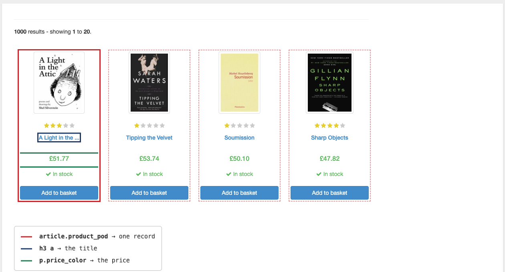
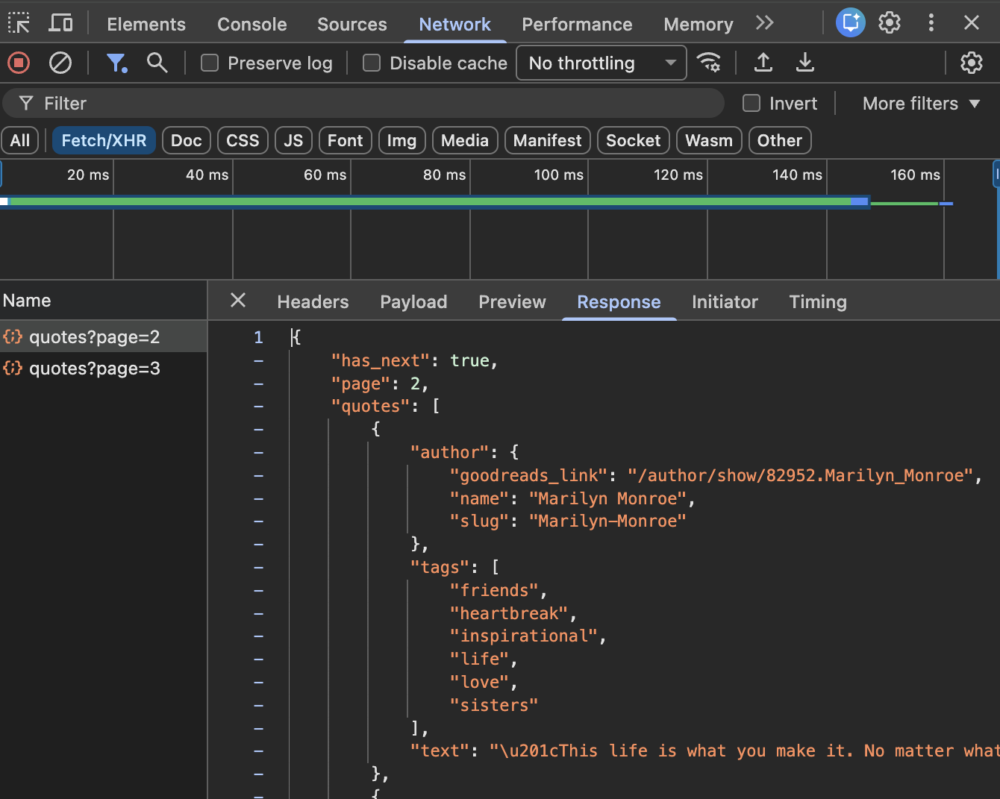

::: {.content-visible when-format="pdf"}
\newpage
:::

# Introduction

Web scraping is no longer taught in the lectures of DATASCI 350. Module 06 covers web APIs, the front door that most modern data providers offer, and Lectures 18 and 19 teach you how to use them well. This self-study tutorial covers the other case: the data you want sits on a web page, visible to any human, with no endpoint for it. Read it if you meet that situation in a project or a job, or if you simply want to know what scraping involves before you need it.

The tutorial pairs naturally with the web API lectures. The workflow you learned there, fetch, cache, extract, tidy, tabulate, is exactly the workflow here, only the extraction step changes. The final section, on using language models for extraction, builds on the AI lectures in Module 04 (Lectures 12 to 15), and it will make more sense if you have seen those.

The tutorial is self-contained. You will read a little HTML, pull tables into pandas with one line, walk a page with BeautifulSoup when there is no table, and think through the ethics and the law of scraping. All the code executes when the document is rendered, so every output you read below is real. The web pages it parses were fetched once and saved to disk, so the whole document renders without a network connection. The few cells that do reach the internet are marked as such and are not executed.

# When there is no API

Everything in Module 06 assumed somebody built you a front door. Often nobody did. The data sits on a web page, readable by any person with a browser, and there is no endpoint for it. **Scraping** means writing a program that reads the page the way a person would, and pulls the data out of the HTML.

Before you write a single line of scraping code, work down this ladder and stop at the first rung that works:

1. **Look harder for an API.** More sites have one than admit it. Section 3.5 shows a trick for finding hidden ones.
2. **Ask.** Many organisations will send you the dataset if you email and explain what you need it for.
3. **`pd.read_html`.** If the data is in an HTML `<table>`, this is one line.
4. **BeautifulSoup.** When the data is in cards, lists, or divs, you walk the page yourself.
5. **Selenium or Playwright.** When JavaScript draws the page and there is no hidden API, you need a real browser under program control. This tutorial stops before that rung.
6. **Stop.** Some pages should not be scraped, and knowing which is part of the skill.

The ladder matters. Each step down costs you more time and produces more fragile code.

# How a web page is built

## HTML in ten minutes

Here is a small but complete web page:

```html
<html>
  <body>
    <h1>Reading list</h1>
    <p class="intro">Books for the course.</p>
    <div class="book" id="b1">
      <h3><a href="/b1">Invisible Cities</a></h3>
      <span class="price">£12.50</span>
    </div>
    <div class="book" id="b2">
      <h3><a href="/b2">The Order of Time</a></h3>
      <span class="price">£9.99</span>
    </div>
  </body>
</html>
```

A **tag** is written `<name>content</name>`. `<p>` is a paragraph and `<h1>` is a heading. Tags nest: the `<a>` sits inside the `<h3>`, which sits inside the `<div>`. **Attributes** live in the opening tag as `name="value"`. Two attributes do almost all the work in scraping. `class` groups elements that look alike, and many elements share a class. `id` names one element, and an id should be unique on the page. So `class` finds you a set of things, and `id` finds you one thing. The `href` attribute on an `<a>` holds the link target.

The only tags you need for this tutorial are `<table>`, `<tr>`, `<td>`, `<th>` (tables), `<a href>` (links), `<div class>` and `<span>` (containers), `<h1>` to `<h3>` (headings), `<p>` (paragraphs), `<ul>` and `<li>` (lists), and `` (images, self-closing, so there is no `</img>`).

## The page is a tree

Because tags nest and never overlap, an HTML document is a **tree**. Browsers call it the DOM, the Document Object Model. Our reading list looks like this as a tree:

```
html
`-- body
    |-- h1                "Reading list"
    |-- p.intro           "Books for the course."
    |-- div.book#b1
    |   |-- h3
    |   |   `-- a[href]   "Invisible Cities"
    |   `-- span.price    "£12.50"
    `-- div.book#b2
        |-- h3
        |   `-- a[href]   "The Order of Time"
        `-- span.price    "£9.99"
```

Scraping is walking this tree, and every scraping task reduces to the same two questions. Which branch holds one record? Here it is `div.book`, and there are two of them, so there are two records. Where inside that branch is each field? The title is in `h3 a`, and the price is in `span.price`. Answer those two questions and the code writes itself. Get them wrong and no amount of clever code saves you.

The figure below answers both questions for the real front page of books.toscrape.com. The solid red box is one record, the dashed boxes are its repeating siblings, and the two coloured boxes inside are the fields. Every scraping job you will ever write starts by drawing these boxes, whether on paper or in your head.

{width=95%}

## Finding the branch: your browser's inspector

You do not read the HTML source top to bottom. You ask the browser. Right-click on the data you want, then choose Inspect (the option exists in Chrome, Firefox, Edge, and Safari). A panel opens with the DOM tree, scrolled to the element you clicked. Three things to do once you are there:

1. Hover over lines in the panel. The matching part of the page lights up. Find the branch that holds one whole record.
2. Read the class names on that branch and on the fields inside it. Those become your selectors.
3. Walk up the tree until the highlight covers exactly one record and no more. That is your unit of observation.

{width=100%}

Practise on <https://books.toscrape.com> before you try a real site. We return to it in @sec-beautifulsoup.


## CSS selectors: the minimum you need

A **selector** is a small pattern that picks elements out of the tree. The same syntax works in your browser's inspector, in BeautifulSoup, and in CSS itself.

| Selector | Reads as | Matches in our example |
|---|---|---|
| `div` | every `div` element | both books |
| `.book` | every element with class `book` | both books |
| `#b1` | the element with id `b1` | the first book only |
| `div.book` | `div` elements that also have class `book` | both books |
| `div.book h3` | any `h3` *inside* a `div.book` | both titles |
| `h3 > a` | an `a` that is a *direct child* of an `h3` | both links |
| `a[href]` | `a` elements that have an `href` attribute | both links |
| `p[class="intro"]` | `p` whose class is exactly `intro` | the intro paragraph |

: CSS selectors and what they match in the example page

A space means "somewhere inside", and `>` means "directly inside". That single distinction causes most selector confusion. Test a selector in the inspector's search box before you put it in your code. A fuller cheat sheet appears in @sec-cheatsheet.

## The trick worth knowing: check the network tab

Many pages that look impossible to scrape load their data as JSON behind the scenes. The HTML arrives nearly empty, then JavaScript fetches the real data and draws it. Scraping that HTML gets you nothing, because at the moment you fetched it there was nothing there. Many "single-page apps" (built with React, Vue, or Angular) work entirely this way: a shell of HTML plus API calls. The data you see on screen was never in the HTML at all.

Here is how to find the real source:

1. Open developer tools. Select the Network tab.
2. Tick the Fetch/XHR filter to hide images and stylesheets.
3. Reload the page. Click through the requests that appear.
4. Look for a request that returns JSON matching the data on screen. If you find one, you have found an undocumented API.
5. Copy the URL. Call it with `requests`.

The figure below is that hunt succeeding on <https://quotes.toscrape.com/scroll>, a page that loads its quotes as you scroll. The Fetch/XHR filter is on, so only data calls are listed, and two of them are visible. The Response pane shows what the first one returned: clean JSON, with `has_next` telling you whether more pages exist and `text` holding the very quote the page had just drawn on screen. There was no need to parse any HTML at all.

{width=100%}

This is worth ten minutes before any scraping job. An undocumented endpoint is far better than parsing HTML, because a site redesign breaks selectors but usually leaves the data feed alone. Right-clicking a request and choosing "Copy as cURL" gives you the exact command, including headers and cookies, which you can translate to Python.

# Setup

The tutorial uses four Python packages. The instructions below assume you have a working Python environment from earlier in the course.

Install the packages first.

```bash
pip install requests beautifulsoup4 lxml pandas
```

`requests` fetches pages, `beautifulsoup4` parses them, `lxml` is the parser that `pd.read_html` needs, and pandas holds the results.

The tutorial parses pages that were fetched once and saved to disk, so you can run every example offline. Download the `data/scraping` folder from the `tutorials` folder of the course repository. Place it in a folder named `data/scraping` beside your script. Confirm that the path `data/scraping/books_page1.html` exists.

Each worked example also shows the fetch code that created those files, marked "not executed", so you can see exactly how a page gets from the web to your disk.

```{python}
#| echo: false
#| eval: true
# Display DataFrames as plain text tables, which keep the PDF tidy.
import pandas as pd
pd.set_option("display.notebook_repr_html", False)
pd.set_option("display.max_columns", None)
pd.set_option("display.width", 95)
```

# The fast path: `pd.read_html`

If the data sits in an HTML `<table>`, you do not need BeautifulSoup at all. `pd.read_html` finds every table on a page and hands you a list of DataFrames.

```python
import pandas as pd

url = "https://en.wikipedia.org/wiki/List_of_countries_by_population_(United_Nations)"
tables = pd.read_html(url)
print(len(tables))
df = tables[0]
```

Always print `len(tables)` first. A Wikipedia article often has navigation boxes and infoboxes that are technically tables, so the one you want is rarely the only one and not always the first.

A word on the modern idiom: passing a string of HTML directly to `read_html` was deprecated and then removed. Give it a URL, a file path, or an open file object. If you have HTML in a variable, wrap it in `io.StringIO`.

## Worked example: world population from Wikipedia

Here is the live fetch, shown but not executed. Note the `User-Agent` header: Wikipedia asks that automated clients identify themselves, and a project name with an email address is the polite way to do it.

```{python}
#| echo: true
#| eval: false
import requests

url = "https://en.wikipedia.org/wiki/List_of_countries_by_population_(United_Nations)"
headers = {"User-Agent": "DATASCI350-course-materials/1.0 (danilo.freire@emory.edu)"}

r = requests.get(url, headers=headers, timeout=30)
r.raise_for_status()

# Save the page so we parse many times and fetch once
with open("data/scraping/wikipedia_population_un.html", "w", encoding="utf-8") as f:
    f.write(r.text)
```

And here is the version that runs, reading the saved page. `read_html` accepts a file path.

```{python}
#| echo: true
#| eval: true
import pandas as pd

tables = pd.read_html("data/scraping/wikipedia_population_un.html")
print(f"{len(tables)} tables on the page")

df = tables[0]
print(df.shape)
for col in df.columns:
    print(" ", col)
```

## The cleaning is the real work

Look at what arrived.

```{python}
#| echo: true
#| eval: true
df.head(4).iloc[:, :3]
```

Column names carry footnote markers, the population columns may have come in as text, and the first row is a total rather than a country. This is normal. A table built to be read by a person is not a dataset. The cleaning below is the real work of `read_html` scraping:

```{python}
#| echo: true
#| eval: true
import re

clean = df.copy()

# 1. Column names: strip footnote markers like [1] and collapse whitespace
clean.columns = [re.sub(r"\[.*?\]", "", str(c)).strip() for c in clean.columns]

# 2. Keep the first four columns and give them names we chose ourselves
clean = clean.iloc[:, :4]
clean.columns = ["country", "pop_2022", "pop_2023", "change_pct"]

# 3. Strip footnotes from the country names too
clean["country"] = (clean["country"].astype(str)
                    .str.replace(r"\[.*?\]", "", regex=True).str.strip())

# 4. Population columns to numbers: remove commas, then coerce
for col in ["pop_2022", "pop_2023"]:
    clean[col] = pd.to_numeric(
        clean[col].astype(str).str.replace(r"[^\d.]", "", regex=True),
        errors="coerce"
    )

# 5. The change column: Wikipedia writes negatives with a Unicode
#    minus sign (U+2212), which Python does not read as a minus.
#    Swap it for a plain hyphen, drop the %, then coerce
clean["change_pct"] = pd.to_numeric(
    clean["change_pct"].astype(str)
    .str.replace("\u2212", "-", regex=False).str.rstrip("%"),
    errors="coerce"
)

print(clean.head(6).to_string(index=False))
print(f"\n{len(clean)} rows, dtypes: {clean['pop_2023'].dtype}")
```

## Checking your work

Never trust a scrape you have not sanity-checked.

```{python}
#| echo: true
#| eval: true
print(f"rows parsed:        {len(clean)}")
print(f"missing pop_2023:   {clean['pop_2023'].isna().sum()}")
print()
print("Largest by 2023 population:")
print(clean.nlargest(5, "pop_2023")[["country", "pop_2023"]]
      .to_string(index=False))
```

Look at that top row. `World` is not a country, and it would have quietly doubled every total you computed.

## The row that was not a country

Tables written for people often carry totals, subtotals, and notes in the same shape as the data. Drop them on purpose.

```{python}
#| echo: true
#| eval: true
countries = clean[clean["country"] != "World"].copy()

print(f"before: {len(clean)} rows   after: {len(countries)} rows")
print()
print(countries.nlargest(5, "pop_2023")[["country", "pop_2023"]]
      .to_string(index=False))

# Does the rest now add up to roughly the World figure we removed?
world = clean.loc[clean["country"] == "World", "pop_2023"].iloc[0]
total = countries["pop_2023"].sum()
print(f"\nsum of countries: {total:,.0f}")
print(f"World row said:   {world:,.0f}")
print(f"difference:       {abs(total - world) / world:.2%}")
```

That last check is the useful habit: the total you removed is a free test of the rows you kept. A scrape that returns a DataFrame is not a scrape that worked. It is a scrape that returned a DataFrame.

## Try it yourself

Scrape the Wikipedia article [List of countries by GDP (nominal)](https://en.wikipedia.org/wiki/List_of_countries_by_GDP_(nominal)). The file `wikipedia_gdp_nominal.html` in `data/scraping/` is a saved copy, so you can work offline. Find the main table, the one listing countries with IMF, World Bank, and United Nations estimates, and report the IMF estimate for Brazil, in millions of US dollars.

Two hints. `read_html` returns a list, and this page has more tables than you expect, so print its length first, then look at the `.shape` and columns of each one until you find the right table. And the column headers on that page span two rows, so pandas gives you a `MultiIndex`. Printing `df.columns` will show you what you are dealing with.

If you fetch the live page instead of the saved copy, send a `User-Agent` header, as in the worked example. The solution is in @sec-solutions.

# BeautifulSoup {#sec-beautifulsoup}

Most of the web is not `<table>` elements. Data comes as cards, lists, panels, and nested divs. **BeautifulSoup** parses HTML into a tree you can search.

```python
from bs4 import BeautifulSoup

soup = BeautifulSoup(html_text, "html.parser")
```

The second argument is the parser. `"html.parser"` ships with Python and is fine. `"lxml"` is faster and more forgiving of broken markup. Either way, `soup` is now the root of the tree, and everything that follows is searching it.

## `find` and `find_all`

The two basic search methods take a tag name and, optionally, attribute filters.

```{python}
#| echo: true
#| eval: true
from bs4 import BeautifulSoup

html = """
<div class="book" id="b1">
  <h3><a href="/b1">Invisible Cities</a></h3>
  <span class="price">£12.50</span>
</div>
<div class="book" id="b2">
  <h3><a href="/b2">The Order of Time</a></h3>
  <span class="price">£9.99</span>
</div>
"""

soup = BeautifulSoup(html, "html.parser")

print(type(soup.find("div")))          # the FIRST match, or None
print(len(soup.find_all("div")))       # ALL matches, as a list

# class_ has a trailing underscore, because 'class' is a Python keyword
books = soup.find_all("div", class_="book")
print(len(books), "books")
```

`find` returns one element or `None`. `find_all` returns a list, possibly empty. Confusing the two is the most common beginner error, because `None` and `[]` fail in different places.

## Getting text and attributes out

Once you hold an element, you want the text between its tags or the value of an attribute.

```{python}
#| echo: true
#| eval: true
first = books[0]

# Text between the tags
print(repr(first.find("a").get_text()))
print(repr(first.find("a").get_text(strip=True)))   # strip surrounding whitespace

# Attribute values: two ways, one of which does not crash
print(first.find("a")["href"])          # KeyError if the attribute is missing
print(first.find("a").get("href"))      # None if the attribute is missing
print(first.get("id"), first.get("data-nonexistent"))
```

`.get_text(strip=True)` is what you want almost every time, because HTML is full of newlines and indentation that you do not want in your data. And prefer `.get("attr")` over `["attr"]` in a loop: one missing attribute should not stop a scrape of a thousand records.

## `select`: the same selectors as your browser

`select()` takes the CSS selectors from Section 3.4. `select_one()` is its `find` equivalent.

```{python}
#| echo: true
#| eval: true
print(len(soup.select("div.book")))
print(soup.select_one("div.book h3 a").get_text(strip=True))
print(soup.select_one("#b2 .price").get_text(strip=True))
print([a.get("href") for a in soup.select("div.book h3 > a")])
```

`find_all("div", class_="book")` and `select("div.book")` do the same job. Prefer `select` for two reasons: you can paste the selector straight from your browser's inspector, and one string expresses a path that `find_all` needs several chained calls to reach. Keep `find_all` for when you want to filter on something CSS cannot express.

## Worked example: books.toscrape.com

<https://books.toscrape.com> is a fake bookshop built specifically for practising scraping. It has 1,000 books, 20 per page across 50 pages. The prices and ratings are random and mean nothing. Its banner says "We love being scraped!", which is as clear a permission as you will ever get. Practise here, not on a real shop.

Step one is always the same: fetch the page once and save it. This is the fetch that created the cached copy, shown but not executed.

```{python}
#| echo: true
#| eval: false
import requests

url = "https://books.toscrape.com/catalogue/page-1.html"
headers = {"User-Agent": "DATASCI350-course/1.0 (danilo.freire@emory.edu)"}

r = requests.get(url, headers=headers, timeout=15)
r.raise_for_status()

with open("data/scraping/books_page1.html", "wb") as f:
    f.write(r.content)
```

## A trap worth meeting now: encoding

Fetch that page, print a price, and you may see `£51.77` instead of `£51.77`. Here is why. The server sends `Content-Type: text/html` with no charset. The HTTP specification says that when no charset is given, the client should assume `ISO-8859-1`, and `requests` follows the rule. But the page is actually UTF-8, so the pound sign gets mangled, and later `float(price.replace("£", ""))` fails with an error that mentions none of this.

```{python}
#| echo: true
#| eval: false
r = requests.get(url, headers=headers, timeout=15)

print(r.encoding)             # ISO-8859-1
print(r.apparent_encoding)    # utf-8

r.encoding = "utf-8"          # the fix: one line
# or save r.content (raw bytes) to disk and decode when you read the file
```

When text comes out looking like `£` or `é`, the problem is always encoding, never your parser. Saving `r.content` (raw bytes) rather than `r.text` (decoded text) sidesteps it entirely, which is why the fetch above wrote `r.content` and opened the file in `"wb"` mode.

## Step 1: find the branch that holds one record

Now we parse the saved page and answer the first of the two questions from Section 3.2.

```{python}
#| echo: true
#| eval: true
from bs4 import BeautifulSoup

with open("data/scraping/books_page1.html", encoding="utf-8") as f:
    soup = BeautifulSoup(f.read(), "html.parser")

cards = soup.select("article.product_pod")
print(f"{len(cards)} book cards on this page\n")

snippet = cards[0].prettify()[:600]
print("\n".join(line[:72] for line in snippet.splitlines()))  # trim long lines
```

The branch is `article.product_pod`, and there are twenty of them, one per book.

## Step 2: locate each field inside the branch

```{python}
#| echo: true
#| eval: true
card = cards[0]

print("title (visible text):", card.select_one("h3 a").get_text(strip=True))
print("title (attribute)   :", card.select_one("h3 a").get("title"))
print("price               :",
      card.select_one("p.price_color").get_text(strip=True))
print("rating (class list) :", card.select_one("p.star-rating").get("class"))
print("link                :", card.select_one("h3 a").get("href"))
```

There are two lessons in that output. First, the visible title is truncated with an ellipsis, and the full one is in the `title` attribute. What a human reads is not always what you want to store. Second, the rating is not text at all. It is encoded in the class name, `star-rating Three`, and the stars you see are drawn by CSS. Data hides in attributes as often as in text.

## Step 3: the universal recipe

```{python}
#| echo: true
#| eval: true
import pandas as pd

WORDS = {"One": 1, "Two": 2, "Three": 3, "Four": 4, "Five": 5}

def parse_books(soup):
    """Every book card on one page, as a list of dicts."""
    rows = []
    for card in soup.select("article.product_pod"):
        rating = card.select_one("p.star-rating").get("class")[1]
        rows.append({
            "title": card.select_one("h3 a").get("title"),
            "price": float(card.select_one("p.price_color")
                           .get_text(strip=True).lstrip("£")),
            "rating": WORDS.get(rating),
            "in_stock": "In stock" in
                        card.select_one("p.instock.availability").get_text(),
            "url": card.select_one("h3 a").get("href"),
        })
    return rows

books_df = pd.DataFrame(parse_books(soup))
print(books_df.head(5).to_string(index=False, max_colwidth=30))
print(f"\n{len(books_df)} books, mean price £{books_df['price'].mean():.2f}")
```

That recipe again, in words. Every scraper you will ever write has these five steps:

1. **Fetch** the page once, and save it to disk.
2. **Parse** the saved text into a soup.
3. **Select** the elements that each hold one record.
4. **Extract** the fields from inside each one, into a dict.
5. **Tabulate**: a list of dicts becomes a DataFrame in one line.

Steps 3 and 4 are the only ones that change between sites. Everything else is boilerplate you will copy from job to job. Notice how closely this mirrors the API workflow from Lecture 18: fetch, cache, extract, tidy, tabulate. The shape of the work is the same whether or not there is an API.

## Scraping several pages

Real jobs rarely stop at one page. Here is the loop that fetched three pages of the bookshop, again shown but not executed.

```{python}
#| echo: true
#| eval: false
import time
import requests

headers = {"User-Agent": "DATASCI350-course/1.0 (danilo.freire@emory.edu)"}
all_rows = []

for page in range(1, 4):
    url = f"https://books.toscrape.com/catalogue/page-{page}.html"
    r = requests.get(url, headers=headers, timeout=15)
    r.raise_for_status()

    with open(f"data/scraping/books_page{page}.html", "wb") as f:
        f.write(r.content)

    soup = BeautifulSoup(r.content.decode("utf-8"), "html.parser")
    rows = parse_books(soup)
    print(f"page {page}: {len(rows)} books")
    all_rows.extend(rows)

    time.sleep(1)        # one second between pages
```

`time.sleep(1)` is the same courtesy you learned for APIs, and it matters more here. An API expects programmatic traffic; a website was built for people. Notice also that the loop saves each page as it goes. Run it once, then develop your parser against the files, which is what the next cell does.

```{python}
#| echo: true
#| eval: true
all_rows = []

for page in range(1, 4):
    with open(f"data/scraping/books_page{page}.html", encoding="utf-8") as f:
        page_soup = BeautifulSoup(f.read(), "html.parser")
    rows = parse_books(page_soup)
    print(f"page {page}: {len(rows)} books")
    all_rows.extend(rows)

three = pd.DataFrame(all_rows)
print(f"\n{len(three)} books, mean price £{three['price'].mean():.2f}")
print(f"rating counts: {three['rating'].value_counts().sort_index().to_dict()}")
```

Three pages, 60 books, no network. This is how the tutorial you are reading was rendered.

## Try it yourself

Scrape page 1 of the Mystery category on books.toscrape.com. The live URL is <https://books.toscrape.com/catalogue/category/books/mystery_3/index.html>, and a saved copy is included at `data/scraping/books_mystery.html`. Extract the title and price of every book on that page, put them in a DataFrame, and report the mean price to two decimal places. Then report how many books are on the page, and check it against what the page itself says.

Two hints. The elements you need carry the classes `product_pod` and `price_color`; work out for yourself which one is the record and which one is the field. And the price arrives as text with a currency symbol in front, so it will not average until it is a number.

If you fetch the live page, save it to disk before you start experimenting on it. The solution is in @sec-solutions.

# Ethics, law, and reliability

## `robots.txt`

Almost every site publishes a file at `/robots.txt` saying which paths automated clients should leave alone. Fetch <https://en.wikipedia.org/robots.txt> and you will find a long, well-commented one. A saved copy ships with the tutorial.

```{python}
#| echo: true
#| eval: true
with open("data/scraping/wikipedia_robots.txt", encoding="utf-8") as f:
    lines = [l for l in f.read().splitlines()
             if l.startswith(("User-agent", "Disallow", "Allow", "Crawl-delay"))]

print(f"{len(lines)} rules in Wikipedia's robots.txt\n")
print("\n".join(lines[:14]))
```

`User-agent` says which clients the block applies to, and `*` means everyone. `Disallow` lists paths to stay away from. `Crawl-delay`, where present, asks for a pause between requests. Python has a reader in the standard library:

```python
from urllib.robotparser import RobotFileParser

rp = RobotFileParser()
rp.set_url("https://en.wikipedia.org/robots.txt")
rp.read()
print(rp.can_fetch("*", "https://en.wikipedia.org/wiki/Python"))
```

Three things to understand about `robots.txt`. It is a courtesy standard, not a technical barrier and not a law, so nothing stops you ignoring it; in this course you honour it. Absence is not permission: books.toscrape.com has no `robots.txt` at all, which means nobody wrote one, not that scraping is welcome (its banner grants that separately). And Google, Bing, and other search engines obey it. If a search engine respects a site's wishes, so should your script.

## Terms of service and the law

This is not legal advice, and I am not a lawyer. Here is the honest shape of it.

The most cited case is *hiQ Labs v. LinkedIn*. hiQ scraped public LinkedIn profiles, and LinkedIn tried to stop them using the Computer Fraud and Abuse Act (CFAA), the main US anti-hacking statute. The Ninth Circuit held that scraping publicly available data is unlikely to be unauthorised access under the CFAA, first in 2019 and again on remand in 2022 [@hiQ2022].

People stopped reading there, and they should not have. In December 2022 the case settled: hiQ accepted a permanent injunction, agreed to delete the scraped data, and paid LinkedIn $500,000. The lesson is precise: *not a crime* is not the same as *allowed*. hiQ won on the criminal statute and still lost on breach of contract, because it had agreed to LinkedIn's terms of service.

Four things constrain you regardless of the CFAA:

1. **Terms of service**, especially if you hold an account or clicked to agree.
2. **Copyright.** The facts in a page are generally not protected. The text and images generally are.
3. **Personal data.** GDPR, FERPA, and similar rules apply to information about people, whoever collected it.
4. **Load.** Making a site slower for its actual users is bad behaviour, whatever the law says.

## A working rule

Scraping public, factual, non-personal data at a gentle rate, from a site whose `robots.txt` allows it, for research or teaching, is normal practice and what this tutorial does. Everything outside that description deserves a pause and a question.

Never scrape personal data for coursework. Not names, not profiles, not anything about identifiable individuals. If you are unsure, ask me. If you are unsure and it is for something real, ask a lawyer. And ask first whether you need to scrape at all: many organisations will send you the dataset if you email and explain what you are doing.

## Politeness engineering

Four habits cost almost nothing and prevent almost every problem.

1. **Identify yourself.** Put a real `User-Agent` with your project name and an email address. If you cause a problem, someone can contact you rather than simply blocking you.

   ```python
   headers = {"User-Agent": "DATASCI350-course/1.0 (danilo.freire@emory.edu)"}
   ```

2. **Throttle.** Sleep for a second between pages with `time.sleep(1)`. If the site publishes a `Crawl-delay`, use that instead.
3. **Cache raw HTML to disk.** You will parse a page twenty times while developing. Fetch it once.
4. **Take only what you need.** Three pages beat fifty when three answer your question.

Habit 3 is the one people skip and regret. It makes you faster, makes your work reproducible, and means a site redesign halfway through your project does not destroy your data.

## Why scrapers rot

An API is a promise. HTML is not a promise, it is a design decision, and designs change. A site redesign renames `product_pod` to `product-card`, and your `select` quietly returns `[]`. The dangerous word is *quietly*. You do not get an exception. You get an empty list, an empty DataFrame, and a plot with no points, and you spend an hour blaming pandas.

The defence is to fail loudly: check that you found something, and that you found roughly what you expected.

```{python}
#| echo: true
#| eval: true
cards = soup.select("article.product_pod")

if not cards:
    raise ValueError("No book cards found. Has the page structure changed?")

assert len(cards) == 20, f"Expected 20 books per page, found {len(cards)}"
print(f"{len(cards)} cards found, as expected")
```

Three more defensive habits. Log what you got, printing counts per page while the scrape runs. Pin a copy of the page: the [Wayback Machine](https://web.archive.org) keeps snapshots, and you can scrape an archived version when the live page changes. And re-run your scraper occasionally, because scrapers rot even when nobody touches them.

## Which tool, and when

| Situation | Reach for | Why |
|---|---|---|
| A documented API exists | `requests` + JSON | Stable, fast, explicitly permitted |
| No documented API, but the Network tab shows JSON | `requests` on that URL | An undocumented API still beats HTML |
| The data is in an HTML `<table>` | `pd.read_html` | One line, then clean |
| The data is in cards, lists, or divs | BeautifulSoup | Full control over the tree |
| The page draws itself with JavaScript, and there is no JSON to find | Playwright or Selenium | A real browser. Slow, heavy, a last resort |
| Personal data, or `robots.txt` says no, or the ToS forbids it | Stop | Ask, or find another source |

: Which tool to reach for, and why

Work down this table from the top. Most people start at row four and never discover that row one was available.

# Language models and scraping

The AI lectures in Module 04 taught you structured-output prompting and coding agents. Both apply directly to scraping, in two distinct patterns, and the difference between them matters.

## Pattern 1: the model as a parser

Paste a messy chunk of HTML into a chat model and ask for a specific structure back.

```
Here is the HTML of a product listing. Return a JSON array where each element
has exactly these keys: title (string), price (number, no currency symbol),
rating (integer 1-5). Return only the JSON, no commentary.

<article class="product_pod">...</article>
```

This is the structured-output prompting from Lecture 12, applied to a new problem, and it genuinely works. Where it fits: one-off jobs, ugly pages, formats too irregular for a selector, and quick exploration when you are not sure what is in the page. Where it does not: 1,000 pages. You pay per token, you wait per call, and the model will occasionally invent a plausible value rather than admit a field was missing. A selector that returns nothing is obviously broken. A model that returns something wrong is not.

## Pattern 2: the model writes the scraper

The better use. Give a coding agent, of the kind you met in Lecture 14, the page and a description, and ask for the code.

```
Write a Python function using requests and BeautifulSoup that scrapes
books.toscrape.com and returns a DataFrame with title, price, and rating.
The rating is in the class attribute of p.star-rating, as a word.
Cache the HTML to disk. Include a check that raises if no books are found.
```

Now the model's output is code you can read, test, and version-control, and it runs a thousand times for free. The caveat is not optional: you must still verify the output. Models invent selectors that look right. A class name that does not exist on the page produces an empty list, and an empty list is exactly what a rotted scraper produces. Notice too that the prompt above contains the class name. I could write that prompt because I had already inspected the page.

## What this means for how you work

Models are good at the boilerplate: the fetch loop, the caching, the DataFrame assembly, the error handling. They are unreliable at the part that requires looking at this particular page and deciding which branch holds one record. That is the skill this tutorial teaches, and you cannot check the delegation without it. The honest summary: a model makes a competent scraper faster. It does not make an inexperienced one competent.

Whenever a model writes or parses for you, run this checklist:

1. Run the scraper.
2. Print the DataFrame shape and dtypes.
3. Check five rows against the page with your own eyes.
4. Check the row count against the page's own claim, if the page makes one.
5. Look for `NaN` where you expect data.
6. Look for data where you expect `NaN`.

Every time, no exceptions. A scraper that returns a plausible-looking DataFrame is the most dangerous kind of wrong.

# Selector cheat sheet {#sec-cheatsheet}

Keep this page as a reference. The left column works in `select()` and in your browser's inspector; the right column is the `find`/`find_all` equivalent.

| Goal | CSS selector (`select`) | `find_all` equivalent |
|---|---|---|
| Every paragraph | `p` | `find_all("p")` |
| Class `price` | `.price` | `find_all(class_="price")` |
| Id `main` | `#main` | `find(id="main")` |
| `div` with class `book` | `div.book` | `find_all("div", class_="book")` |
| Two classes at once | `p.instock.availability` | `find_all("p", class_=["instock",` `"availability"])` |
| Descendant, any depth | `div.book a` | chained `find_all` |
| Direct child only | `ul > li` | `find_all("li", recursive=False)` |
| Has an attribute | `a[href]` | `find_all("a", href=True)` |
| Attribute equals | `a[href="/b1"]` | `find_all("a", href="/b1")` |
| Attribute starts with | `a[href^="/books"]` | needs a regex |
| Attribute contains | `a[href*="page"]` | needs a regex |
| First match only | `select_one(...)` | `find(...)` |

: CSS selectors and their `find`/`find_all` equivalents

And for extraction, once you hold an element:

| Goal | Code |
|---|---|
| Text inside an element | `el.get_text(strip=True)` |
| An attribute, safely | `el.get("href")` |
| An attribute, strictly | `el["href"]` (raises if missing) |
| The class list | `el.get("class")` returns a list |
| Readable HTML, for debugging | `el.prettify()` |

: Getting data out of an element you already hold

# Going further

The habits matter more than the libraries. Look for an API before you scrape. Look at the response before you parse it. Fetch once, save, and work from the file. Sleep between requests, and say who you are. Check that you got what you expected. Write it all as a script, so the data can be rebuilt. When in doubt, email the data owner and ask.

To go deeper:

- The [BeautifulSoup documentation](https://www.crummy.com/software/BeautifulSoup/bs4/doc/) is short and readable, and covers the tree-navigation methods this tutorial skipped.
- The [pandas `read_html` reference](https://pandas.pydata.org/docs/reference/api/pandas.read_html.html) lists the arguments that handle headers, missing values, and number parsing at read time.
- [books.toscrape.com](https://books.toscrape.com) and its sibling [quotes.toscrape.com](https://quotes.toscrape.com) are safe playgrounds for every technique here, including pagination and login forms.
- [Playwright for Python](https://playwright.dev/python/) is the tool to learn when you meet a JavaScript-drawn page with no hidden API, the fifth rung of the ladder.

The workflow you practised here feeds the same pipeline as the rest of the course: once the data is a DataFrame, you save it to Parquet, and the scaling tools from Lectures 21 and 22 take over from there.

# Solutions to exercises {#sec-solutions}

Try each exercise before you read its solution.

## Wikipedia GDP table

The lesson of this exercise is the loop that prints every table's shape. You do not guess the index, you look.

```{python}
#| echo: true
#| eval: true
import pandas as pd

tables = pd.read_html("data/scraping/wikipedia_gdp_nominal.html")
print(f"{len(tables)} tables found\n")

# Look at each one until you find the shape you want
for i, t in enumerate(tables):
    print(f"  [{i}] shape {t.shape}")
```

The main country table is the one with roughly 200 rows. The headers span two rows, so pandas builds a `MultiIndex`; flatten it, then find the country column and the IMF column by name rather than by position.

```{python}
#| echo: true
#| eval: true
gdp = next(t for t in tables if t.shape[0] > 150)

# Flatten the MultiIndex into single strings
gdp.columns = [" ".join(str(c) for c in col).strip()
               if isinstance(col, tuple) else str(col)
               for col in gdp.columns]
for c in gdp.columns[:5]:
    print(" ", c)

country_col = gdp.columns[0]
imf_col = next(c for c in gdp.columns if "IMF" in c)

brazil = gdp[gdp[country_col].astype(str).str.contains("Brazil", na=False)]
print()
print(brazil[[country_col, imf_col]].to_string(index=False))
```

## Mystery books

The fetch that created the cached copy, not executed here:

```{python}
#| echo: true
#| eval: false
import requests

url = "https://books.toscrape.com/catalogue/category/books/mystery_3/index.html"
headers = {"User-Agent": "DATASCI350-course/1.0 (danilo.freire@emory.edu)"}

r = requests.get(url, headers=headers, timeout=15)
r.raise_for_status()

with open("data/scraping/books_mystery.html", "wb") as f:
    f.write(r.content)          # bytes, so the encoding trap cannot bite
```

And the parse, which runs on the saved page:

```{python}
#| echo: true
#| eval: true
from bs4 import BeautifulSoup
import pandas as pd

with open("data/scraping/books_mystery.html", encoding="utf-8") as f:
    soup = BeautifulSoup(f.read(), "html.parser")

cards = soup.select("article.product_pod")
if not cards:
    raise ValueError("No book cards found. Has the page structure changed?")

rows = [{"title": c.select_one("h3 a").get("title"),
         "price": float(c.select_one("p.price_color")
                        .get_text(strip=True).lstrip("£"))}
        for c in cards]

mystery = pd.DataFrame(rows)

print(f"{len(mystery)} books on the page")
print(f"mean price: £{mystery['price'].mean():.2f}")
print(f"cheapest:   £{mystery['price'].min():.2f}   "
      f"dearest: £{mystery['price'].max():.2f}")
print()
print(mystery.nsmallest(5, "price").to_string(index=False, max_colwidth=40))
```

The page header says "Mystery" with a count. Checking your row count against what the page claims is the cheapest bug-catcher there is.

That is the end of the tutorial. You read HTML as a tree, pulled a Wikipedia table into pandas and cleaned it, walked a bookshop page with BeautifulSoup, and met the case, *hiQ Labs v. LinkedIn*, that defines where the legal lines sit. Keep the selector cheat sheet in @sec-cheatsheet to hand, and start every future job at the top of the ladder in Section 2.

```{=latex}
% The article template predates pandoc's citeproc output, so define
% the commands and environment it emits for the reference list.
\providecommand{\citeproctext}{}
\providecommand{\citeproc}[2]{\hyperref[citeproc-#1]{#2}\nocite{#1}}
\makeatletter
\let\@cite@ofmt\@firstofone
\def\@biblabel#1{}
\def\@cite#1#2{{#1\if@tempswa , #2\fi}}
\makeatother
\newlength{\cslhangindent}
\setlength{\cslhangindent}{1.5em}
\newlength{\csllabelwidth}
\setlength{\csllabelwidth}{3em}
\newenvironment{CSLReferences}[2]{%
  \begin{list}{}{%
    \setlength{\itemindent}{0pt}%
    \setlength{\leftmargin}{0pt}%
    \setlength{\parsep}{0pt}%
    \ifodd #1
      \setlength{\leftmargin}{\cslhangindent}%
      \setlength{\itemindent}{-1\cslhangindent}%
    \fi
    \setlength{\itemsep}{#2\baselineskip}%
  }}%
  {\end{list}}
\newcommand{\CSLBlock}[1]{\hfill\break\parbox[t]{\linewidth}{\strut\ignorespaces#1\strut}}
\newcommand{\CSLLeftMargin}[1]{\parbox[t]{\csllabelwidth}{\strut#1\strut}}
\newcommand{\CSLRightInline}[1]{\parbox[t]{\dimexpr\linewidth-\csllabelwidth\relax}{\strut\ignorespaces#1\strut}}
\newcommand{\CSLIndent}[1]{\hspace{\cslhangindent}#1}
```

# References {.unnumbered}
