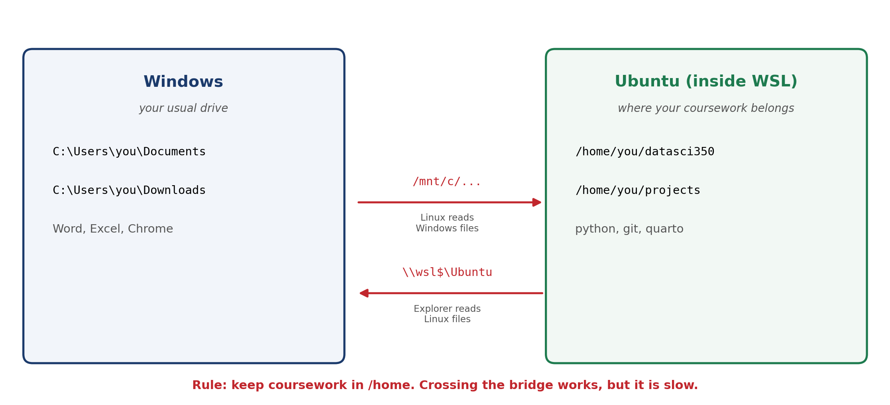

::: {.content-visible when-format="pdf"}
\newpage
:::

# Introduction

Lectures 03 and 04 teach the command line. The commands in those lectures, `ls`, `grep`, `chmod`, `man`, are Unix commands. macOS and Linux run them out of the box. Windows does not: PowerShell is a capable shell, but it is a different one, with different commands.

The Windows Subsystem for Linux, or WSL, fixes this. It gives you a real Ubuntu Linux running inside Windows, with the same shell your classmates on macOS are using. You install it once, and from then on every command in the lectures works on your machine exactly as it appears on the slides.

This tutorial is for Windows users only. If you are on macOS or Linux, you already have a Unix shell, and you can skip this document.

# What WSL is

WSL runs a genuine Linux kernel alongside Windows. It is not an emulator and not a simulation of Linux commands. The Ubuntu inside WSL is the same Ubuntu that runs on servers, so the tools behave the way the documentation says they will.

Three things are worth knowing before you start.

- Windows keeps running. WSL is not a dual boot, and you do not restart to switch. Ubuntu opens in a window like any other program.
- Linux and Windows see each other's files. Section 6 explains how, and why you should be careful with it.
- The current version is WSL 2, and it is what `wsl --install` gives you. Older guides describing WSL 1 are out of date.

# Before you start

Check your Windows version. Press the Windows key, type "winver", and press Enter. A box reports your version and build number.

You need Windows 11, or Windows 10 version 2004 (build 19041) or later. Almost every machine bought in the last few years qualifies. If yours does not, update Windows first.

The installation downloads about 1 GB and needs one restart. Set aside twenty minutes, and do not start it ten minutes before class.

# Installing WSL

Warning: the install command needs administrator rights. Opening PowerShell normally will not work.

Press the Windows key. Type "PowerShell". Right-click "Windows PowerShell". Select "Run as administrator".

Type the following command. Press Enter.

```powershell
wsl --install
```

The command enables the required Windows components, downloads the Linux kernel, sets WSL 2 as the default, and installs Ubuntu.

Restart your computer when the command finishes.

After the restart, Ubuntu opens on its own and unpacks itself. This takes a few minutes the first time. Every launch after that is instant.

If Ubuntu does not open by itself, press the Windows key, type "Ubuntu", and press Enter.

## Creating your Linux account

Ubuntu asks for a username and a password. This account is separate from your Windows account, and the two have nothing to do with each other.

Type a username in lower case, with no spaces. Your first name is a fine choice.

Warning: nothing appears on screen while you type the password. No dots, no asterisks, no moving cursor. This is normal Linux behaviour and not a frozen terminal. Type the password and press Enter.

Type the password again to confirm it.

Write this password down. You need it every time you run an administrative command, and there is no "forgot password" link.

## Checking the installation

Open PowerShell. Type the following command. Press Enter.

```powershell
wsl -l -v
```

You should see Ubuntu listed, with `Running` or `Stopped` under `STATE`, and `2` under `VERSION`. Version 2 is what you want.

# First steps inside Ubuntu

Open Ubuntu from the Start menu. You now have a Linux shell, and everything in Lectures 03 and 04 applies from here.

Update the package lists and the installed packages. This takes a few minutes on a fresh install.

```bash
sudo apt update && sudo apt upgrade
```

`sudo` runs a command as administrator, so Ubuntu asks for the password you created. Again, nothing appears as you type it.

Try the commands from Lecture 03 to confirm the shell works:

```bash
echo $SHELL
whoami
pwd
ls
```

`echo $SHELL` should report `/bin/bash`, and `pwd` should report `/home/yourname`.

## Making `man` work

Lecture 04 uses `man` to read a command's manual. Ubuntu images in WSL are stripped down to save space, and the manual pages are one of the things left out. You will see `No manual entry for ls` until you install them.

Install the manual pages:

```bash
sudo apt install man-db manpages
```

Test the result:

```bash
man ls
```

A manual page opens. Press `q` to leave it.

# The two file systems

This section is the one that confuses people, so read it before you save any work.

Windows and Ubuntu each have their own file system, and each can reach into the other. Windows files live under `C:\`, which Ubuntu sees at `/mnt/c/`. Ubuntu files live under `/home/`, which Windows Explorer reaches at `\\wsl$\Ubuntu\`.

{width=95%}

Keep your coursework in the Linux home directory, at `/home/yourname/`. Reading Windows files from Linux across `/mnt/c/` works, but it is much slower, and a Git repository stored there can take seconds to do what should be instant.

Make a folder for this course inside your Linux home directory:

```bash
mkdir ~/datasci350
cd ~/datasci350
```

The `~` is shorthand for your home directory.

To see the current Linux folder in Windows Explorer, type the following in Ubuntu. The full stop at the end is part of the command.

```bash
explorer.exe .
```

Explorer opens on the Linux folder. You can drag files in and out of that window normally.

# Using WSL with VS Code

VS Code connects to WSL directly. You edit files in the familiar Windows window while the code runs on Linux.

Install [VS Code on Windows](https://code.visualstudio.com/) if you have not already. Tutorial 01 covers this. Install it on Windows, not inside Ubuntu.

Open VS Code. Click the Extensions icon in the left sidebar.

Search for "WSL". Install the [WSL extension](https://marketplace.visualstudio.com/items?itemName=ms-vscode-remote.remote-wsl) by Microsoft.

Return to the Ubuntu terminal. Move to your course folder. Type the following command, again including the full stop.

```bash
code .
```

VS Code opens with that folder loaded. The bottom left corner reads "WSL: Ubuntu", which confirms the connection. Any terminal you open inside this window is an Ubuntu terminal.

Note: extensions install separately for Windows and for WSL. When you open a WSL folder for the first time, VS Code will offer to reinstall your Python extension in Ubuntu. Accept.

# Installing Python in Ubuntu

The Anaconda you installed on Windows in Tutorial 01 belongs to Windows. Ubuntu needs its own Python. We use Miniconda, which is the same `conda` tool without the packages you will not need.

Download the installer:

```bash
wget https://repo.anaconda.com/miniconda/Miniconda3-latest-Linux-x86_64.sh
```

Run it:

```bash
bash Miniconda3-latest-Linux-x86_64.sh
```

Press Enter to read the licence. Press `q` to leave the licence text. Type `yes` to accept it.

Accept the default install location. Answer `yes` when the installer offers to initialise conda.

Close the terminal. Open a new one. Your prompt now begins with `(base)`.

Check the result:

```bash
conda --version
python --version
```

Install the packages the course uses:

```bash
conda install pandas matplotlib jupyter
```

## Git and Quarto

Ubuntu ships with Git. Confirm it and set your identity, using the same details as your GitHub account:

```bash
git --version
git config --global user.name "Your Name"
git config --global user.email "your.email@emory.edu"
```

Quarto needs a few more steps. Do not download it with your Windows browser: the file lands in your Windows Downloads folder, and you then have to find it from Linux. Copy the link instead, and let Ubuntu do the downloading. The file then arrives in the folder you are already standing in.

Open <https://quarto.org/docs/get-started/> in your browser. Find the download button for Ubuntu.

Right-click that button. Select "Copy link address". Do not click it.

Return to the Ubuntu terminal. Move to your home directory:

```bash
cd ~
```

Type `wget `, then paste the link. In most terminals you paste with a right-click, or with `Ctrl+Shift+V`. The command will look like the one below, with a different version number:

```bash
wget https://github.com/quarto-dev/quarto-cli/releases/download/v1.10.18/quarto-1.10.18-linux-amd64.deb
```

Press Enter. Ubuntu downloads the file into your home directory.

Check the exact file name that arrived:

```bash
ls *.deb
```

Install it, using the name `ls` just reported:

```bash
sudo dpkg -i quarto-1.10.18-linux-amd64.deb
```

Confirm the installation:

```bash
quarto --version
```

`curl -LO` does the same job as `wget` if `wget` is missing. The `-L` follows redirects and the `-O` keeps the original file name.

```bash
curl -LO https://github.com/quarto-dev/quarto-cli/releases/download/v1.10.18/quarto-1.10.18-linux-amd64.deb
```

# Everyday commands

These run in PowerShell, not in Ubuntu.

| Command | What it does |
|:--------------------|:---------------------------------------|
| `wsl` | Opens your default Linux distribution |
| `wsl -l -v` | Lists distributions and their versions |
| `wsl --shutdown` | Stops WSL, which fixes many oddities |
| `wsl --update` | Updates WSL itself |

Table: WSL commands you will use from PowerShell

Inside Ubuntu, `exit` closes the shell.

# When something goes wrong

**`wsl --install` prints the help text instead of installing.** WSL is already present. Run `wsl --list --online` to see the available distributions, then `wsl --install -d Ubuntu`.

**The installation fails, or mentions virtualisation.** Your machine needs hardware virtualisation enabled in its BIOS. Restart, enter the BIOS setup, and look for "Virtualization Technology", "VT-x", or "SVM". Enable it. If you are not comfortable changing BIOS settings, bring your laptop to office hours.

**The install hangs at 0.0%.** Run `wsl --install --web-download -d Ubuntu` instead, which downloads the distribution before installing it.

**`sudo` rejects your password.** The password is the Linux one you created during setup, not your Windows password. To reset it, run `wsl -u root` in PowerShell, then `passwd yourname`.

**Everything in Ubuntu has become slow.** Check where you are with `pwd`. If the path starts with `/mnt/c/`, you are working across the bridge. Move the folder to `/home/yourname/`.

**`code .` reports that the command is not found.** VS Code is not installed on Windows, or the WSL extension is missing. Install both, then close and reopen Ubuntu.

**Something is stuck and no advice helps.** Run `wsl --shutdown` in PowerShell, then reopen Ubuntu. This resolves a surprising number of problems.

# Going further

- [Microsoft's WSL documentation](https://learn.microsoft.com/en-us/windows/wsl/) is the official reference and is genuinely well written.
- [Best practices for setting up a WSL development environment](https://learn.microsoft.com/en-us/windows/wsl/setup/environment) covers the same ground as this tutorial in more depth.
- [Windows Terminal](https://learn.microsoft.com/en-us/windows/terminal/) is worth installing. It gives you tabs, so PowerShell and Ubuntu can share one window.
- [The Missing Semester of Your CS Education](https://missing.csail.mit.edu/) is an MIT course on the shell and its tools. It pairs well with Lectures 03 and 04.

You now have the same shell as everyone else in the class, and the lecture commands will behave as the slides say. If any step here fails on your machine, email me at <danilo.freire@emory.edu> or come to office hours, and we will get it working together.
